# Awesome Text-to-Image Architectures 

<!-- Generated by scripts/catalog.py from data/models.json and data/figures.json. Edit the JSON, then regenerate. -->

A visual catalog of text-to-image models, from GANs to diffusion transformers and unified multimodal models. Diagrams, primary sources and short notes for every entry.

**228 models and families · Reviewed 2026-09-29**

[Model list](#models) · [All diagrams](#model-figures) · [2025+ arXiv collection](docs/t2i-arxiv-daily.md) · [Descriptions](docs/model-descriptions.md) · [Timeline](docs/timeline.md) · [Methodology](docs/methodology.md) · [Contribute](CONTRIBUTING.md)

The [2025+ arXiv collection](docs/t2i-arxiv-daily.md) screens every paper with "text-to-image" in its title first submitted from **January 1, 2025** onward (848 papers in the pinned snapshot). Every included family has an image, a description, paper links and an explicit GitHub availability status. The complete screening record is available as [JSON](data/t2i-arxiv-daily.json).

| Collection | Models |
| --- | ---: |
| [Early neural text-to-image models](models/early.md) | 3 |
| [Generative adversarial networks](models/gan.md) | 17 |
| [Autoregressive image-token models](models/ar-token.md) | 20 |
| [Masked and parallel image-token models](models/masked.md) | 8 |
| [Pixel-space and cascaded diffusion](models/pixel-diffusion.md) | 11 |
| [Latent diffusion with U-Net backbones](models/latent-unet.md) | 21 |
| [Diffusion transformers and flow matching](models/dit.md) | 33 |
| [Continuous-token autoregressive and hybrid models](models/continuous-ar.md) | 8 |
| [Unified multimodal understanding and generation](models/unified.md) | 65 |
| [Few-step, distilled and on-device models](models/efficient.md) | 21 |
| [Commercial image-generation interfaces](models/api.md) | 21 |

## Models

T: text · I: image · V: video · A: audio. [Scope and labels](docs/methodology.md#modalities-and-interaction).

Alphabetical model list · 228 entries

| Model | Group | Input → output |
| --- | --- | --- |
| [Adobe Firefly Image](#adobe-firefly) | API | T, I → I |
| [alignDRAW](#aligndraw) | Early | T → I |
| [AltDiffusion](#altdiffusion) | Latent U-Net | T → I |
| [Amazon Titan Image Generator](#amazon-titan-image-generator) | API | T, I → I |
| [aMUSEd](#amused) | Masked token | T → I |
| [AttnGAN](#attngan) | GAN | T → I |
| [AuraFlow](#auraflow) | DiT / flow | T → I |
| [BAGEL](#bagel) | Unified | T, I → T, I |
| [BitDance](#bitdance) | Continuous AR | T → I |
| [BK-SDM](#bk-sdm) | Efficient | T → I |
| [BLIP3-o](#blip3-o) | Unified | T, I → T, I |
| [BLIP3o-NEXT](#blip3o-next) | Unified | T, I → I |
| [Bridge Diffusion Model (BDM)](#bridge-diffusion) | Latent U-Net | T → I |
| [C4Synth](#c4synth) | GAN | T → I |
| [CanvasGAN](#canvasgan) | GAN | T → I |
| [Chameleon](#chameleon) | Unified | T, I → T, I |
| [ChatPainter](#chatpainter) | GAN | T → I |
| [CM3](#cm3) | Unified | T, I → T, I |
| [CoDi](#codi) | Unified | T, I, V, A → T, I, V, A |
| [CogView](#cogview) | AR token | T → I |
| [CogView-3Plus](#cogview3-plus) | DiT / flow | T → I |
| [CogView2](#cogview2) | AR token | T → I |
| [CogView3](#cogview3) | Latent U-Net | T → I |
| [CogView4](#cogview4) | DiT / flow | T → I |
| [Composer](#composer) | Pixel diffusion | T, I → I |
| [ControlGAN](#controlgan) | GAN | T → I |
| [Cosmos 3](#cosmos3) | Unified | T, I, V → T, I, V, A |
| [DALL·E](#dall-e) | AR token | T → I |
| [DALL·E 2 (unCLIP)](#dall-e-2) | Pixel diffusion | T, I → I |
| [DALL·E 3](#dall-e-3) | API | T → I |
| [DALL·E Mini](#dall-e-mini) | AR token | T → I |
| [DART](#dart) | Continuous AR | T → I |
| [DeepFloyd IF](#deepfloyd-if) | Pixel diffusion | T, I → I |
| [DM-GAN](#dm-gan) | GAN | T → I |
| [DMD2 (Distribution Matching Distillation)](#dmd2) | Efficient | T → I |
| [DreamLLM](#dreamllm) | Unified | T, I → T, I |
| [E-MMDiT (AMD Nitro-E)](#e-mmdit) | Efficient | T → I |
| [eDiff-I](#ediff-i) | Pixel diffusion | T, I → I |
| [Emu (BAAI)](#emu-baai) | Unified | T, I, V → T, I |
| [Emu (Meta)](#emu-meta) | Latent U-Net | T → I |
| [Emu2](#emu2) | Unified | T, I, V → T, I |
| [Emu3](#emu3) | Unified | T, I, V → T, I, V |
| [Emu3.5](#emu3-5) | Unified | T, I → T, I |
| [ERNIE-Image](#ernie-image) | DiT / flow | T → I |
| [ERNIE-ViLG](#ernie-vilg) | AR token | T → I |
| [ERNIE-ViLG 2.0](#ernie-vilg-2) | Latent U-Net | T → I |
| [Fluid](#fluid) | Continuous AR | T → I |
| [FLUX.1](#flux-1) | DiT / flow | T → I |
| [FLUX.1 Kontext](#flux-1-kontext) | DiT / flow | T, I → I |
| [FLUX.2](#flux-2) | DiT / flow | T, I → I |
| [Frido](#frido) | Latent U-Net | T → I |
| [GAN-INT-CLS](#gan-int-cls) | GAN | T → I |
| [GAWWN](#gawwn) | GAN | T → I |
| [Gemini native image generation](#gemini-image) | API | T, I → T, I |
| [GenTron](#gentron) | DiT / flow | T → I |
| [GILL](#gill) | Unified | T, I → T, I |
| [GLIDE](#glide) | Pixel diffusion | T, I → I |
| [GLM-Image](#glm-image) | Continuous AR | T, I → I |
| [GPT Image 1](#gpt-image-1) | API | T, I → I |
| [GPT Image 2](#gpt-image-2) | API | T, I → I |
| [Grok Aurora](#grok-aurora) | API | T → I |
| [Grok Imagine Image](#grok-imagine-image) | API | T, I → I |
| [HART](#hart) | Continuous AR | T → I |
| [HDGAN](#hdgan) | GAN | T → I |
| [HiDream-I1](#hidream-i1) | DiT / flow | T → I |
| [HiDream-O1-Image](#hidream-o1-image) | Pixel diffusion | T, I → I |
| [Hierarchical text-to-image via inferred semantic layout (Hong et al.)](#hong-semantic-layout) | GAN | T → I |
| [Hunyuan-DiT](#hunyuan-dit) | DiT / flow | T → I |
| [HunyuanImage 3.0](#hunyuanimage-3) | Unified | T, I → T, I |
| [HunyuanImage-2.1](#hunyuanimage-2-1) | DiT / flow | T → I |
| [Hyper-SD](#hyper-sd) | Efficient | T → I |
| [Ideogram](#ideogram) | API | T, I → I |
| [Ideogram 4.0](#ideogram-4) | DiT / flow | T → I |
| [ILLUME](#illume) | Unified | T, I → T, I |
| [ILLUME+](#illume-plus) | Unified | T, I → T, I |
| [ImageBART](#imagebart) | AR token | T, I → I |
| [Imagen](#imagen) | Pixel diffusion | T → I |
| [Imagen 2](#imagen-2) | API | T, I → I |
| [Imagen 3](#imagen-3) | API | T, I → I |
| [Imagen 4](#imagen-4) | API | T, I → I |
| [Imagine Flash](#imagine-flash) | Efficient | T → I |
| [Infinity](#infinity) | AR token | T → I |
| [InstaFlow](#instaflow) | Efficient | T → I |
| [InternVL-U](#internvl-u) | Unified | T, I → T, I |
| [Janus](#janus) | Unified | T, I → T, I |
| [Janus-Pro](#janus-pro) | Unified | T, I → T, I |
| [JanusFlow](#janusflow) | Unified | T, I → T, I |
| [JetFormer](#jetformer) | Continuous AR | T, I → I, T |
| [JoyAI-Image](#joyai-image) | Unified | T, I → T, I |
| [Kandinsky 2](#kandinsky-2) | Latent U-Net | T, I → I |
| [Kandinsky 3](#kandinsky-3) | Latent U-Net | T, I → I |
| [Kandinsky 5.0 Image Lite](#kandinsky-5) | DiT / flow | T → I |
| [Karlo](#karlo) | Pixel diffusion | T, I → I |
| [KOALA](#koala) | Efficient | T → I |
| [Kolors](#kolors) | Latent U-Net | T → I |
| [Kolors 2.0](#kolors-2) | API | T, I → I |
| [Krea 2](#krea-2) | DiT / flow | T → I |
| [L-Verse](#l-verse) | AR token | T → I |
| [Latent Consistency Models (LCM)](#lcm) | Efficient | T → I |
| [Latent Diffusion Models (LDM)](#ldm) | Latent U-Net | T → I |
| [Lavida-O](#lavida-o) | Unified | T, I → T, I |
| [LaVIT](#lavit) | Unified | T, I → T, I |
| [LI-DiT](#li-dit) | DiT / flow | T → I |
| [Liquid](#liquid) | Unified | T, I → T, I |
| [LLaDA2.0-Uni](#llada2-uni) | Unified | T, I → T, I |
| [LlamaGen](#llamagen) | AR token | T → I |
| [LongCat-Image](#longcat-image) | DiT / flow | T → I |
| [LongCat-Next](#longcat-next) | Unified | T, I, A → T, I, A |
| [Luma Uni-1](#luma-uni-1) | API | T, I → I |
| [Lumina-DiMOO](#lumina-dimoo) | Unified | T, I → T, I |
| [Lumina-Image 2.0](#lumina-image-2) | DiT / flow | T → I |
| [Lumina-mGPT](#lumina-mgpt) | AR token | T → I |
| [Lumina-mGPT 2.0](#lumina-mgpt-2) | AR token | T, I → I |
| [Lumina-Next](#lumina-next) | DiT / flow | T → I |
| [Lumina-T2X (Lumina-T2I)](#lumina-t2x) | DiT / flow | T → I |
| [LWM](#lwm) | Unified | T, I, V → T, I, V |
| [M6](#m6) | AR token | T → I |
| [M6-UFC](#m6-ufc) | Masked token | T → I |
| [Mage-Flow](#mage-flow) | DiT / flow | T → I |
| [MAI-Image](#mai-image) | API | T, I → I |
| [Make-A-Scene](#make-a-scene) | AR token | T → I |
| [MammothModa2](#mammothmoda2) | Unified | T, I → T, I |
| [Manzano](#manzano) | Unified | T, I → T, I |
| [MARS](#mars-t2i) | AR token | T → I |
| [Matryoshka Diffusion Models](#matryoshka-diffusion) | Pixel diffusion | T → I |
| [Meissonic](#meissonic) | Masked token | T → I |
| [MetaMorph](#metamorph) | Unified | T, I → T, I |
| [MetaQuery](#metaquery) | Unified | T, I → T, I |
| [Midjourney](#midjourney) | API | T, I → I |
| [Ming-Omni](#ming-omni) | Unified | T, I, V, A → T, I, A |
| [Ming-UniVision](#ming-univision) | Unified | T, I → T, I |
| [MiniMax Image-01](#minimax-image-01) | API | T, I → I |
| [MirrorGAN](#mirrorgan) | GAN | T → I |
| [MM-Interleaved](#mm-interleaved) | Unified | T, I → T, I |
| [MMaDA](#mmada) | Unified | T, I → T, I |
| [Mobile-O](#mobile-o) | Efficient | T, I → T, I |
| [MobileDiffusion](#mobilediffusion) | Efficient | T → I |
| [Mogao](#mogao) | Unified | T, I → T, I |
| [MonoFormer](#monoformer) | Unified | T → T, I |
| [Muse](#muse) | Masked token | T → I |
| [Muse Image](#muse-image) | API | T, I → I |
| [NExT-GPT](#next-gpt) | Unified | T, I, V, A → T, I, V, A |
| [NextFlow](#nextflow) | Unified | T, I → T, I |
| [NextStep-1](#nextstep-1) | Continuous AR | T, I → I |
| [Nexus-Gen](#nexus-gen) | Unified | T, I → T, I |
| [NÜWA](#nuwa) | AR token | T, I → I |
| [Obj-GAN](#obj-gan) | GAN | T → I |
| [OFA](#ofa) | Unified | T, I → T, I |
| [OmniGen](#omnigen) | Unified | T, I → I |
| [OmniGen2](#omnigen2) | Unified | T, I → T, I |
| [OneCAT](#onecat) | Unified | T, I → T, I |
| [Orthus](#orthus) | Unified | T, I → T, I |
| [Ovis-Image](#ovis-image) | DiT / flow | T → I |
| [Ovis-U1](#ovis-u1) | Unified | T, I → T, I |
| [Paella](#paella) | Masked token | T, I → I |
| [PanGu-Draw](#pangu-draw) | Latent U-Net | T → I |
| [Parallel Multiscale PixelCNN](#multiscale-pixelcnn) | Early | T → I |
| [Parti](#parti) | AR token | T → I |
| [PixArt-α](#pixart-alpha) | DiT / flow | T → I |
| [PixArt-δ](#pixart-delta) | Efficient | T → I |
| [PixArt-Σ](#pixart-sigma) | DiT / flow | T → I |
| [PixelFlow](#pixelflow) | Pixel diffusion | T → I |
| [Playground v2](#playground-v2) | Latent U-Net | T → I |
| [Playground v3](#playground-v3) | DiT / flow | T → I |
| [PUMA](#puma) | Unified | T, I → T, I |
| [Qwen-Image](#qwen-image) | DiT / flow | T → I |
| [Qwen-Image-2.0](#qwen-image-2) | DiT / flow | T, I → I |
| [RAPHAEL](#raphael) | Latent U-Net | T → I |
| [Re-Imagen](#re-imagen) | Pixel diffusion | T, I → I |
| [Recraft](#recraft) | API | T, I → I |
| [Retrieval-Augmented Diffusion Models (RDM)](#rdm) | Latent U-Net | T → I |
| [Reve Image](#reve-image) | API | T, I → I |
| [ruDALL-E](#rudall-e) | AR token | T → I |
| [SANA](#sana) | DiT / flow | T → I |
| [SANA 1.5](#sana-1-5) | DiT / flow | T → I |
| [SANA-Sprint](#sana-sprint) | Efficient | T → I |
| [SD-GAN](#sd-gan) | GAN | T → I |
| [SD3-Turbo (Latent Adversarial Diffusion Distillation)](#sd3-turbo) | Efficient | T → I |
| [SDXL](#sdxl) | Latent U-Net | T → I |
| [SDXL Turbo (Adversarial Diffusion Distillation)](#sdxl-turbo) | Efficient | T → I |
| [SDXL-Lightning](#sdxl-lightning) | Efficient | T → I |
| [SDXS](#sdxs) | Efficient | T → I |
| [SEED-LLaMA](#seed-llama) | Unified | T, I → T, I |
| [SEED-X](#seed-x) | Unified | T, I → T, I |
| [Seedream 2.0](#seedream-2) | DiT / flow | T → I |
| [Seedream 3.0](#seedream-3) | DiT / flow | T → I |
| [Seedream 4.0](#seedream-4) | DiT / flow | T, I → I |
| [Seedream 5.0](#seedream-5) | API | T, I → I |
| [SenseNova-U1](#sensenova-u1) | Unified | T, I → T, I |
| [Show-o](#show-o) | Unified | T, I → T, I |
| [Show-o2](#show-o2) | Unified | T, I, V → T, I, V |
| [SimpleAR](#simplear) | AR token | T → I |
| [Skywork UniPic](#skywork-unipic) | Unified | T, I → T, I |
| [SnapFusion](#snapfusion) | Efficient | T → I |
| [SnapGen](#snapgen) | Efficient | T → I |
| [SSD-1B](#ssd-1b) | Efficient | T → I |
| [Stable Diffusion 1.x](#stable-diffusion-1) | Latent U-Net | T, I → I |
| [Stable Diffusion 2.x](#stable-diffusion-2) | Latent U-Net | T, I → I |
| [Stable Diffusion 3](#stable-diffusion-3) | DiT / flow | T → I |
| [StackGAN](#stackgan) | GAN | T → I |
| [StackGAN++ (StackGAN-v2)](#stackgan-v2) | GAN | T → I |
| [STAR](#star-t2i) | AR token | T → I |
| [STARFlow](#starflow) | Continuous AR | T, I → I |
| [STARFlow2](#starflow2) | Unified | T, I → T, I |
| [SwiftBrush](#swiftbrush) | Efficient | T → I |
| [Switti](#switti) | AR token | T → I |
| [SynerGen-VL](#synergen-vl) | Unified | T, I → T, I |
| [TAC-GAN](#tac-gan) | GAN | T → I |
| [Taiyi-Diffusion-XL](#taiyi-diffusion-xl) | Latent U-Net | T → I |
| [Tar](#tar) | Unified | T, I → T, I |
| [Text-SeGAN](#text-segan) | GAN | T → I |
| [Text2Scene](#text2scene) | Early | T → I |
| [Transfusion](#transfusion) | Unified | T, I → T, I |
| [UFOGen](#ufogen) | Efficient | T → I |
| [UMT-BITG (Unifying Multimodal Transformer)](#generate-it) | Masked token | T → I |
| [UniDiffuser](#unidiffuser) | Unified | T, I → T, I |
| [Unified-IO](#unified-io) | Unified | T, I → T, I |
| [Unified-IO 2](#unified-io-2) | Unified | T, I, V, A → T, I, A |
| [UniWorld-V1](#uniworld) | Unified | T, I → T, I |
| [UPainting](#upainting) | Latent U-Net | T → I |
| [Versatile Diffusion](#versatile-diffusion) | Latent U-Net | T, I → I, T |
| [VILA-U](#vila-u) | Unified | T, I, V → T, I, V |
| [VL-GPT](#vl-gpt) | Unified | T, I → T, I |
| [VQ-Diffusion](#vq-diffusion) | Masked token | T, I → I |
| [Würstchen](#wuerstchen) | Latent U-Net | T → I |
| [X-LXMERT](#x-lxmert) | Masked token | T → I |
| [X-Omni](#x-omni) | Unified | T, I → T, I |
| [Z-Image](#z-image) | DiT / flow | T → I |

## Model figures

Figures are credited to their sources. Editorial input/output diagrams are labeled. [Credits](assets/architectures/CREDITS.md).

### Adobe Firefly Image

Adobe Firefly is Adobe's family of generative models, announced on 2023-03-21 with a first model for text-to-image generation and text effects that Adobe says was trained on Adobe Stock, openly licensed and public-domain content. Successive Firefly Image models followed: Image 2 (October 2023) with Generative Match for style guidance from an uploaded reference image, Image 3 (April 2024) with Structure Reference and Style Reference, Image 4 and 4 Ultra (April 2025) with output up to 2K, and Image 5 (October 2025, public beta) with native 4MP output and Prompt to Edit, which edits an image from a plain-language instruction. The models are offered in the Firefly app, Adobe's Creative Cloud products and the Firefly API; Adobe does not publish their architecture.

[Announcement 1](https://news.adobe.com/news/news-details/2023/Adobe-Unveils-Firefly-a-Family-of-new-Creative-Generative-AI/default.aspx) · [Announcement 2](https://news.adobe.com/news/news-details/2023/adobe-releases-next-generation-of-firefly-models) · [Announcement 3](https://news.adobe.com/news/news-details/2024/adobe-introduces-firefly-image-3-foundation-model-to-take-creative-exploration-and-ideation-to-new-heights) · [Announcement 4](https://news.adobe.com/news/2025/04/adobe-revolutionizes-ai-assisted-creativity-firefly) · [Announcement 5](https://news.adobe.com/news/2025/10/adobe-max-2025-firefly) · [Docs 1](https://developer.adobe.com/firefly-services/docs/firefly-api/) · [Docs 2](https://developer.adobe.com/firefly-services/docs/firefly-api/guides/how-tos/firefly-generate-image-api-tutorial) · [Details](models/api.md#adobe-firefly)

*Editorial input/output diagram · [Source](https://news.adobe.com/news/2025/10/adobe-max-2025-firefly)*

### alignDRAW

alignDRAW (ICLR 2016) is one of the first neural models to generate images from free-form captions. It extends the DRAW recurrent VAE so that each drawing step attends to the relevant words of the caption, accumulating patches on a canvas; trained on Microsoft COCO at 32 × 32 pixels, it produces blurry but compositionally novel scenes such as a stop sign flying in blue skies.

[Paper](https://arxiv.org/abs/1511.02793) · [GitHub](https://github.com/mansimov/text2image) · [Details](models/early.md#aligndraw)

*Figure 2 · [Source](https://arxiv.org/abs/1511.02793)*

### AltDiffusion

Stable Diffusion 2.1 latent U-Net re-aligned to a frozen 18-language XLM-R text encoder distilled from the OpenCLIP ViT-H text encoder (AltCLIP-style).

[Paper](https://arxiv.org/abs/2308.09991) · [GitHub](https://github.com/superhero-7/AltDiffusion) · [Model card 1](https://huggingface.co/BAAI/AltDiffusion-m18) · [Model card 2](https://huggingface.co/BAAI/AltDiffusion-m9) · [Details](models/latent-unet.md#altdiffusion)

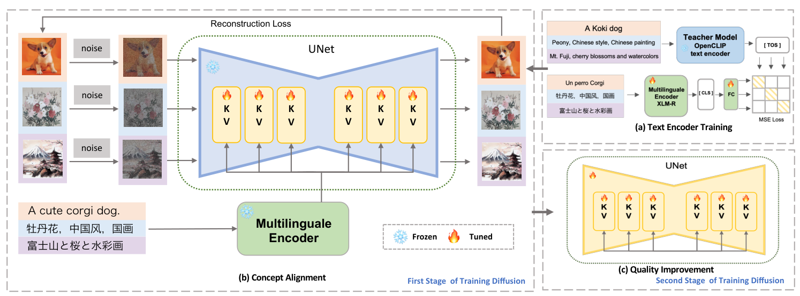

*Figure 2 · [Source](https://arxiv.org/abs/2308.09991)*

### Amazon Titan Image Generator

Amazon Titan Image Generator is Amazon's image generation model on Amazon Bedrock, announced in public preview on 2023-11-29 (`amazon.titan-image-generator-v1`, later documented as G1). It generates images from English prompts and edits uploaded images through inpainting and outpainting with a user mask or a text-derived mask from a built-in segmentation model, image variations from one to five input images, and mask-free text-prompted editing. Titan Image Generator v2, generally available from August 2024, adds image conditioning on a reference image's layout, color-palette guidance, background removal and subject-consistency fine-tuning. All outputs carry an invisible watermark and C2PA metadata. AWS does not publish the model architecture.

[Announcement 1](https://aws.amazon.com/blogs/aws/amazon-titan-image-generator-multimodal-embeddings-and-text-models-are-now-available-in-amazon-bedrock/) · [Announcement 2](https://aws.amazon.com/blogs/aws/amazon-titan-image-generator-v2-is-now-available-in-amazon-bedrock/) · [Docs](https://docs.aws.amazon.com/bedrock/latest/userguide/titan-image-models.html) · [Details](models/api.md#amazon-titan-image-generator)

*Editorial input/output diagram · [Source](https://docs.aws.amazon.com/bedrock/latest/userguide/titan-image-models.html)*

### aMUSEd

aMUSEd (Hugging Face, STUDIO EY and Amazon, 2024) is an open, 10x-smaller reproduction of Google's unreleased Muse model, replacing Muse's frozen T5-XXL text encoder with a smaller CLIP-L/14 encoder and using a single U-ViT masked-token transformer instead of a two-stage base-plus-super-resolution pipeline. The 256px and 512px checkpoints prioritize fast, low-resource inference and are released with training and inference code.

[Paper](https://arxiv.org/abs/2401.01808) · [GitHub](https://github.com/huggingface/open-muse) · [Model card](https://huggingface.co/amused/amused-256) · [Details](models/masked.md#amused)

*Figure 1 · [Source](https://arxiv.org/abs/2401.01808)*

### AttnGAN

Multi-stage attentional GAN that generates 64×64 to 256×256 images, with word-level attention at each refinement stage and a DAMSM image–text matching loss.

[Paper](https://arxiv.org/abs/1711.10485) · [GitHub](https://github.com/taoxugit/AttnGAN) · [Details](models/gan.md#attngan)

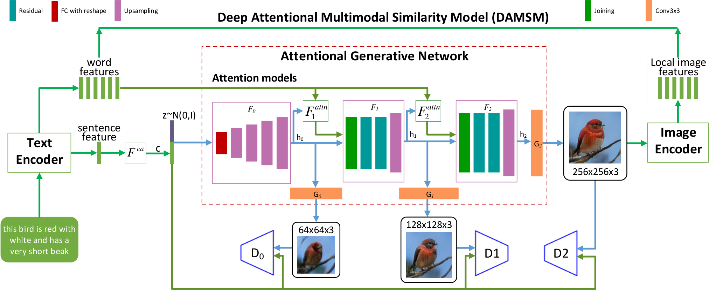

*Figure 2 · [Source](https://arxiv.org/abs/1711.10485)*

### AuraFlow

AuraFlow is an open text-to-image model from fal, developed with researcher Simo Ryu and released as v0.1 in July 2024 as the largest fully open flow-based text-to-image model at the time. It is a rectified-flow transformer that starts from the MMDiT design of Stable Diffusion 3 but keeps only a few joint text-image blocks, replacing the rest with plain DiT blocks for better hardware efficiency, and is scaled to 6.8B parameters with a wide, shallow shape. The launch post attributes its prompt following to fully synthetic captions and reports competitive GenEval scores; later v0.2 and v0.3 checkpoints continued training and aesthetic fine-tuning.

[Announcement](https://blog.fal.ai/auraflow/) · [Model card 1](https://huggingface.co/fal/AuraFlow) · [Model card 2](https://huggingface.co/fal/AuraFlow-v0.3) · GitHub: no author-linked repository found · [Details](models/dit.md#auraflow)

*Editorial input/output diagram · [Source](https://blog.fal.ai/auraflow/)*

### BAGEL

BAGEL (Scalable Generative Cognitive Model) is ByteDance Seed's open unified model for multimodal understanding and generation, with 7B active and 14B total parameters. One decoder-only transformer, split into an understanding expert and a generation expert that attend to the same interleaved token sequence, predicts text by next-token prediction and images by rectified flow over VAE latents. It is pretrained on trillions of tokens of text, image-text pairs and interleaved web and video data, and the paper reports text-to-image results on GenEval and WISE, image editing on GEdit-Bench and an intelligent-editing benchmark, and optional reasoning (thinking) before generation or editing.

[Paper](https://arxiv.org/abs/2505.14683) · [GitHub](https://github.com/ByteDance-Seed/Bagel) · [Model card](https://huggingface.co/ByteDance-Seed/BAGEL-7B-MoT) · [Details](models/unified.md#bagel)

*Figure 2 · [Source](https://arxiv.org/abs/2505.14683)*

### BitDance

BitDance (ByteDance with CUHK and other institutions) is an autoregressive image generator whose visual tokens are binary vectors from a lookup-free quantization tokenizer with vocabularies up to 2^256 states. Because a softmax over that many indices is impractical, a small DiT-style diffusion head treats each token as a vertex of a hypercube, generates it with rectified-flow sampling in continuous space conditioned on the transformer's hidden state, and snaps the result back to ±1. The same head samples a whole p×p patch of tokens at once (next-patch diffusion), under a block-wise causal mask, so many tokens are produced per step. For text-to-image generation a 14B model initialized from Qwen3-14B serves as both text encoder and image generator, uses a 16×-downsampling tokenizer and generates up to 1024×1024 images, with 16 or, after a short distillation stage, 64 tokens per step; the paper reports over 30× speedup over prior next-token AR models at 1024px.

[Paper](https://arxiv.org/abs/2602.14041) · [GitHub](https://github.com/shallowdream204/BitDance) · [Model card](https://huggingface.co/shallowdream204/BitDance-14B-64x) · [Details](models/continuous-ar.md#bitdance)

*Figure 4 (PDF p. 6) · [Source](https://arxiv.org/abs/2602.14041)*

### BK-SDM

BK-SDM (Nota Inc., 2023) compresses Stable Diffusion architecturally rather than by reducing steps. Pairs of residual and cross-attention blocks are removed from the down and up stages of the U-Net; the Small variant also removes the mid-stage, and Tiny removes the innermost stages as well, giving 30–50% reductions in size, compute and latency. The pruned U-Net is initialized from the original weights and retrained to imitate the original U-Net's noise predictions and intermediate feature maps, which the paper shows works with only 0.22M LAION image-text pairs and about 13 A100 days. The same recipe is applied to SD v1.4 and SD v2.1-base, and the compressed models are also used for DreamBooth personalization, image-to-image translation and on-device deployment.

[Paper](https://arxiv.org/abs/2305.15798) · [GitHub](https://github.com/Nota-NetsPresso/BK-SDM) · [Model card](https://huggingface.co/nota-ai/bk-sdm-small) · [Details](models/efficient.md#bk-sdm)

*Figure 3 (PDF p. 5) · [Source](https://arxiv.org/abs/2305.15798)*

### BLIP3-o

BLIP3-o is an open family of unified multimodal models from Salesforce Research and collaborators that adds image generation to a frozen Qwen2.5-VL understanding model. Instead of generating VAE latents, a diffusion transformer generates semantically rich CLIP image features conditioned on the language model's outputs, and a diffusion decoder turns those features into an image. The paper compares CLIP and VAE targets with MSE and flow-matching objectives, argues for sequential training (understanding first, then generation), and releases code, weights, pretraining captions and the BLIP3o-60k instruction-tuning set.

[Paper](https://arxiv.org/abs/2505.09568) · [GitHub](https://github.com/JiuhaiChen/BLIP3o) · [Model card](https://huggingface.co/BLIP3o/BLIP3o-Model-8B) · [Details](models/unified.md#blip3-o)

*Figure 1 · [Source](https://arxiv.org/abs/2505.09568)*

### BLIP3o-NEXT

BLIP3o-NEXT is the successor to BLIP3-o in the BLIP3 series, positioned as a native image generation model that handles text-to-image generation and image editing in one Autoregressive + Diffusion architecture of about 3B parameters. Unlike BLIP3-o, the autoregressive model now predicts discrete image tokens, which makes GRPO reinforcement learning with verifiable rewards (GenEval-style composition and text rendering) directly applicable, and a diffusion transformer conditioned on the tokens' hidden states renders the final image. The paper also describes consistency techniques for editing, including a reconstruction task and VAE-latent conditioning of the diffusion model.

[Paper](https://arxiv.org/abs/2510.15857) · [GitHub](https://github.com/JiuhaiChen/BLIP3o) · [Model card](https://huggingface.co/BLIP3o/BLIP3o-NEXT-SFT-3B) · [Details](models/unified.md#blip3o-next)

*Figure 1 · [Source](https://arxiv.org/abs/2510.15857)*

### Bridge Diffusion Model (BDM)

Frozen Stable Diffusion 1.5 U-Net backbone with a trainable ControlNet-like encoder branch conditioned on Chinese CLIP text features, keeping the latent space compatible with the English SD ecosystem.

[Paper](https://arxiv.org/abs/2309.00952) · [GitHub](https://github.com/360CVGroup/Bridge_Diffusion_Model) · [Model card](https://huggingface.co/qihoo360/BDM1.0) · [Details](models/latent-unet.md#bridge-diffusion)

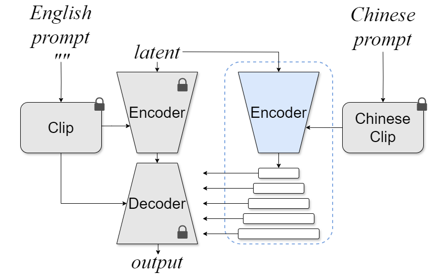

*Figure 2 · [Source](https://arxiv.org/abs/2309.00952)*

### C4Synth

Multi-caption text-to-image GAN that consumes several captions in sequence, with an LSTM captioning network enforcing cross-caption cycle consistency.

[Paper](https://arxiv.org/abs/1809.10238) · GitHub: no author-linked repository found · [Details](models/gan.md#c4synth)

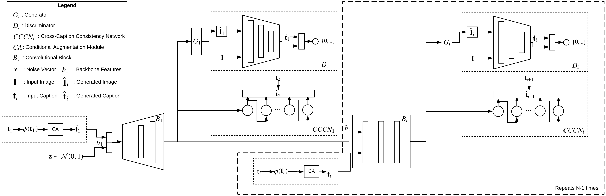

*Figure 3 · [Source](https://arxiv.org/abs/1809.10238)*

### CanvasGAN

Recurrent GAN generator that attends over word features at each step and adds upscaled color patches to a canvas.

[Paper](https://arxiv.org/abs/1810.02833) · GitHub: no author-linked repository found · [Details](models/gan.md#canvasgan)

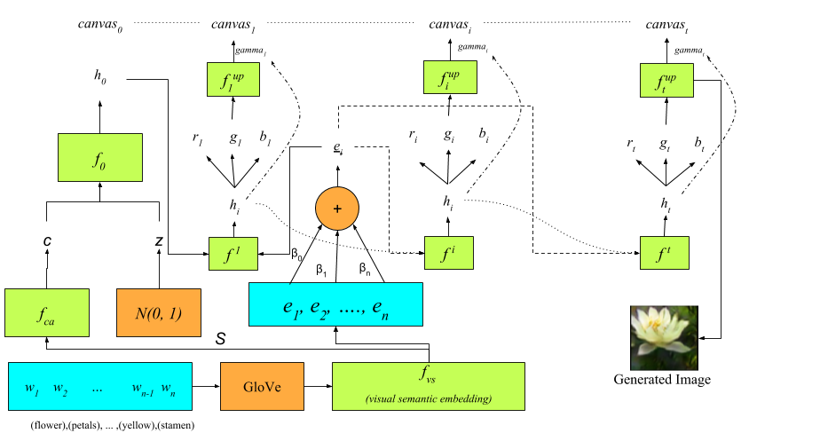

*Fig. 1 · [Source](https://arxiv.org/abs/1810.02833)*

### Chameleon

Chameleon is Meta FAIR's family of early-fusion, token-based mixed-modal models. Images are quantized into discrete tokens that share a single vocabulary with text, so one autoregressive transformer trained from scratch on interleaved image-text data can read and write arbitrary sequences of text and images, including text-to-image generation, captioning, visual question answering and long-form mixed-modal documents. The paper documents image generation, but the publicly released 7B and 34B checkpoints were published without image generation: Meta's release announcement states that the image generation model was not released and that the released models produce text-only output.

[Paper 1](https://arxiv.org/abs/2405.09818) · [GitHub 1](https://github.com/facebookresearch/chameleon) · [Announcement](https://ai.meta.com/blog/meta-fair-research-new-releases/) · [Paper 2](https://arxiv.org/abs/2407.06135) · [GitHub 2](https://github.com/GAIR-NLP/anole) · [Details](models/unified.md#chameleon)

*Figure 1 (PDF p. 2) · [Source](https://arxiv.org/abs/2405.09818)*

### ChatPainter

StackGAN-style two-stage GAN (64×64 then 256×256) conditioned on a caption embedding concatenated with an embedding of a question–answer dialogue about the image.

[Paper](https://arxiv.org/abs/1802.08216) · GitHub: no author-linked repository found · [Details](models/gan.md#chatpainter)

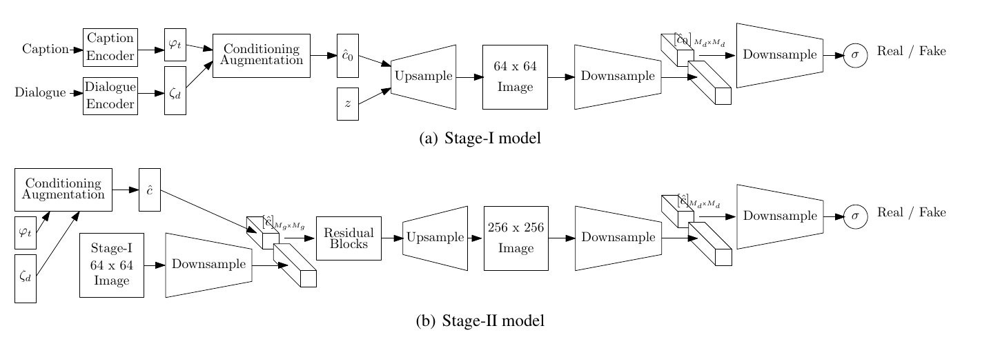

*Figure 3 (PDF p. 3) · [Source](https://arxiv.org/abs/1802.08216)*

### CM3

CM3 (Causally-Masked Multimodal Modeling), from Meta AI, extends structured-document pretraining to full HTML documents including images and hyperlinks. Every  tag's image is resized and tokenized into discrete VQGAN codes that are inserted as text into the tag's src attribute, so a single decoder-only transformer trained purely with next-token prediction over document structure can later be prompted, zero-shot, to generate an image for a caption by producing an  tag whose predicted tokens are decoded back to pixels.

[Paper](https://arxiv.org/abs/2201.07520) · GitHub: no author-linked repository found · [Details](models/unified.md#cm3)

*Figure 1 (PDF p. 3) · [Source](https://arxiv.org/abs/2201.07520)*

### CoDi

CoDi (Composable Diffusion), from the University of North Carolina and Microsoft Azure Cognitive Services Research, is an any-to-any generative model that produces any combination of text, image, video and audio outputs from any combination of input modalities in a single generation pass, including modality pairs never seen jointly in training. It starts from individually pretrained latent diffusion models per modality, aligns their conditioning encoders in a shared 'bridging alignment' space, and then couples the modality-specific UNets with cross-modal attention so that, for example, a text prompt can drive synchronized video-plus-audio generation or joint image-text-audio generation.

[Paper](https://arxiv.org/abs/2305.11846) · [GitHub](https://github.com/microsoft/i-Code) · [Details](models/unified.md#codi)

*Figure 2 · [Source](https://arxiv.org/abs/2305.11846)*

### CogView

CogView (Tsinghua, Alibaba DAMO and BAAI; NeurIPS 2021) is a Chinese text-to-image model built on a 4-billion-parameter transformer that predicts VQ-VAE image tokens after the prompt. Besides generation, the same pretrained model is fine-tuned for super-resolution, captioning-based self-reranking and style learning, and the paper contributes two techniques, PB-relax and Sandwich-LN, for stable large-transformer training.

[Paper](https://arxiv.org/abs/2105.13290) · [GitHub](https://github.com/zai-org/CogView) · [Details](models/ar-token.md#cogview)

*Figure 3 · [Source](https://arxiv.org/abs/2105.13290)*

### CogView-3Plus

CogView-3Plus is the diffusion-transformer line of Zhipu AI's CogView text-to-image models, open-sourced alongside CogView3 in September 2024. Where CogView3 used a cascade of diffusion stages, CogView-3Plus moves to a single diffusion transformer conditioned on T5-XXL text features. The released 3B-parameter checkpoint generates images between 512 and 2048 pixels per side. Architectural details beyond this have not been published in a paper, so this entry documents only the interface and encoder stated by the developers.

[GitHub](https://github.com/zai-org/CogView4) · [Model card](https://huggingface.co/zai-org/CogView3-Plus-3B) · [Details](models/dit.md#cogview3-plus)

*Editorial input/output diagram · [Source](https://github.com/zai-org/CogView4)*

### CogView2

CogView2 (Tsinghua and Zhipu AI, 2022) speeds up CogView-style autoregressive image generation by replacing single-pass left-to-right decoding with a hierarchical pipeline: a bidirectional-infilling transformer (CogLM) first produces a small 20×20 token image, and local-attention super-resolution transformers then upsample it to 480×480 in a few parallel passes, cutting inference time relative to the original CogView while supporting bilingual Chinese/English prompts and text-guided image completion.

[Paper](https://arxiv.org/abs/2204.14217) · [GitHub](https://github.com/zai-org/CogView2) · [Details](models/ar-token.md#cogview2)

*Figure 2 · [Source](https://arxiv.org/abs/2204.14217)*

### CogView3

CogView3, from Zhipu AI and Tsinghua University, is the first text-to-image system to apply relay diffusion. A 3-billion-parameter U-Net diffusion model works in the 8× compressed latent space of a KL-regularized autoencoder, conditioned on a frozen T5-XXL encoder with prompts of up to 225 tokens that are first expanded by a language model. The base stage generates 512×512 images; the super-resolution stage encodes the bilinearly upsampled result, adds noise from an intermediate point and denoises and deblurs it with a linear blurring schedule to reach 1024×1024, and it can be applied iteratively for 2048×2048. Training uses LAION-2B with captions rewritten by a fine-tuned CogVLM recaptioner. The paper reports that CogView3 beats SDXL in human evaluation at about half its inference time, and a progressively distilled variant needs about a tenth of SDXL's inference time.

[Paper](https://arxiv.org/abs/2403.05121) · [GitHub](https://github.com/zai-org/CogView4) · [Details](models/latent-unet.md#cogview3)

*Figure 3 · [Source](https://arxiv.org/abs/2403.05121)*

### CogView4

CogView4 is Zhipu AI's 6B-parameter open text-to-image model, the successor to CogView-3Plus. Its main change is the text side: it replaces the English-only T5 encoder with the bilingual GLM-4-9B language model, so it accepts long Chinese or English prompts and can render Chinese characters in images. Trained on captions and images of arbitrary length and resolution, it generates at flexible sizes up to about two megapixels. It was released under Apache-2.0 with diffusers support; no technical report describes its internals.

[GitHub](https://github.com/zai-org/CogView4) · [Model card](https://huggingface.co/zai-org/CogView4-6B) · [Docs](https://docs.bigmodel.cn/cn/guide/models/image-generation/cogview-4) · [Details](models/dit.md#cogview4)

*Editorial input/output diagram · [Source](https://github.com/zai-org/CogView4)*

### Composer

GLIDE-based cascaded pixel diffusion (64×64 base plus unconditional 256×256 and 1024×1024 upsamplers) trained to recompose images from decomposed global and local conditions, with an optional unCLIP-style prior from captions to CLIP image embeddings.

[Paper](https://arxiv.org/abs/2302.09778) · [GitHub](https://github.com/ali-vilab/composer) · [Details](models/pixel-diffusion.md#composer)

*Figures 7 and 8 (global and local conditioning modules) · [Source](https://arxiv.org/abs/2302.09778)*

### ControlGAN

Multi-stage AttnGAN-based generator with word-level spatial and channel-wise attention, trained with a word-level discriminator and a perceptual loss.

[Paper](https://arxiv.org/abs/1909.07083) · [GitHub](https://github.com/mrlibw/ControlGAN) · [Details](models/gan.md#controlgan)

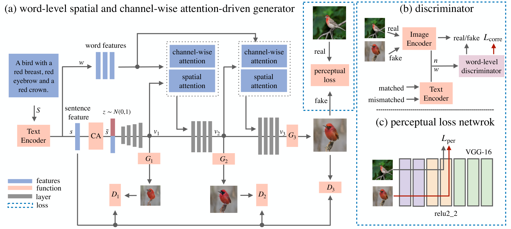

*Figure 2 · [Source](https://arxiv.org/abs/1909.07083)*

### Cosmos 3

Cosmos 3 is NVIDIA's family of omnimodal world models for Physical AI, which jointly process and generate language, images, video, audio and robot or vehicle actions in one Mixture-of-Transformers model. Text is produced by next-token prediction in a reasoner tower, while images, video, audio and actions are produced by iterative denoising in a generator tower that attends to the reasoner's context. Text-to-image is one of its generation modes, and NVIDIA released Cosmos3-Super-Text2Image, a 64B checkpoint specialized for text-to-image by two-stage fine-tuning, which the technical report describes as ranked first among open-weight models on the Artificial Analysis text-to-image leaderboard at the time of writing.

[Model card](https://huggingface.co/nvidia/Cosmos3-Super-Text2Image) · [Paper](https://research.nvidia.com/labs/cosmos-lab/cosmos3/technical-report.pdf) · [GitHub](https://github.com/NVIDIA/cosmos) · [Details](models/unified.md#cosmos3)

*Figure 5 (PDF p. 11) · [Source](https://research.nvidia.com/labs/cosmos-lab/cosmos3/technical-report.pdf)*

### DALL·E

DALL·E (OpenAI, 2021) showed that a single large autoregressive transformer, trained on hundreds of millions of web image-text pairs, can generate images from free text zero-shot. Images are first compressed into discrete tokens by a discrete VAE, then a 12-billion-parameter transformer predicts those tokens after the caption; candidate images are reranked with CLIP. Only the image tokenizer was publicly released.

[Paper](https://arxiv.org/abs/2102.12092) · [GitHub](https://github.com/openai/DALL-E) · [Details](models/ar-token.md#dall-e)

*Editorial input/output diagram · [Source](https://arxiv.org/abs/2102.12092)*

### DALL·E 2 (unCLIP)

Two-stage unCLIP stack: a prior maps the caption to a CLIP image embedding, and a GLIDE-style pixel diffusion decoder at 64×64 followed by two diffusion upsamplers (256×256, 1024×1024) inverts that embedding into an image.

[Paper](https://arxiv.org/abs/2204.06125) · [GitHub](https://github.com/openai/dalle-2-preview) · [Details](models/pixel-diffusion.md#dall-e-2)

*Figure 2 · [Source](https://arxiv.org/abs/2204.06125)*

### DALL·E 3

DALL·E 3 is OpenAI's third-generation text-to-image system, released in ChatGPT and, from November 2023, in the OpenAI Images API. Its accompanying paper argues that prompt following improves when a text-to-image model is trained on highly descriptive captions produced by a bespoke image captioner, and shows that a language model can "upsample" short prompts into detailed ones at inference. The system card describes a deployment in which GPT-4 in ChatGPT rewrites user requests into the prompts sent to DALL·E 3, plus prompt and output classifiers. The API accepted text only and supported image generation, not edits or variations; OpenAI removed the `dall-e-3` snapshot from the API on 2026-05-12.

[Paper](https://cdn.openai.com/papers/dall-e-3.pdf) · [Model card](https://cdn.openai.com/papers/DALL_E_3_System_Card.pdf) · [Docs 1](https://developers.openai.com/api/docs/models/dall-e-3) · [Docs 2](https://developers.openai.com/api/docs/changelog) · [Details](models/api.md#dall-e-3)

*Editorial input/output diagram · [Source](https://cdn.openai.com/papers/DALL_E_3_System_Card.pdf)*

### DALL·E Mini

DALL·E Mini is an open-source attempt to reproduce OpenAI's DALL·E, developed by a community team whose README acknowledges the Hugging Face Flax/JAX community week and Google TPU Research Cloud. A BART encoder reads the prompt and a BART decoder generates VQGAN image tokens that are decoded into an image. The larger DALL·E Mega shares the design, the Craiyon web service hosts the model, and code and weights are released under Apache 2.0.

[GitHub](https://github.com/borisdayma/dalle-mini) · [Model card 1](https://huggingface.co/dalle-mini/dalle-mini) · [Model card 2](https://huggingface.co/dalle-mini/dalle-mega) · [Announcement](https://wandb.ai/dalle-mini/dalle-mini/reports/DALL-E-Mini-Explained-with-Demo--Vmlldzo4NjIxODA) · [Details](models/ar-token.md#dall-e-mini)

*Editorial input/output diagram · [Source](https://github.com/borisdayma/dalle-mini)*

### DART

DART (Apple, with CUHK and Mila) merges autoregression and diffusion. Instead of denoising from only the current noisy image, as Markovian diffusion does, its transformer sees the concatenated sequence of all earlier noisy versions of the image and predicts the next, cleaner one, using a chunk-based causal mask and KV caching like a language model; no image quantization is involved. Two extensions add token-level autoregression inside each denoising step (DART-AR) and a small flow-matching head that models each token's distribution (DART-FM). Matryoshka-DART handles several resolutions in one sequence, and Kaleido-DART jointly trains discrete text-token prediction. Text-to-image models are trained on CC12M, mostly at 256×256 with 512×512 fine-tuning for Matryoshka-DART.

[Paper](https://arxiv.org/abs/2410.08159) · GitHub: no author-linked repository found · [Details](models/continuous-ar.md#dart)

*Figure 2 · [Source](https://arxiv.org/abs/2410.08159)*

### DeepFloyd IF

Frozen T5-XXL text encoder feeding three cascaded pixel-space diffusion U-Nets with cross-attention and attention pooling: a 64×64 base stage and super-resolution stages to 256×256 and 1024×1024.

[Announcement](https://stability.ai/news/deepfloyd-if-text-to-image-model) · [GitHub](https://github.com/deep-floyd/IF) · [Model card](https://huggingface.co/DeepFloyd/IF-I-XL-v1.0) · [Details](models/pixel-diffusion.md#deepfloyd-if)

*README architecture scheme · [Source](https://github.com/deep-floyd/IF)*

### DM-GAN

Initial-image GAN followed by refinement stages that read word features from a gated key–value dynamic memory to refine image features.

[Paper](https://arxiv.org/abs/1904.01310) · [GitHub](https://github.com/MinfengZhu/DM-GAN) · [Details](models/gan.md#dm-gan)

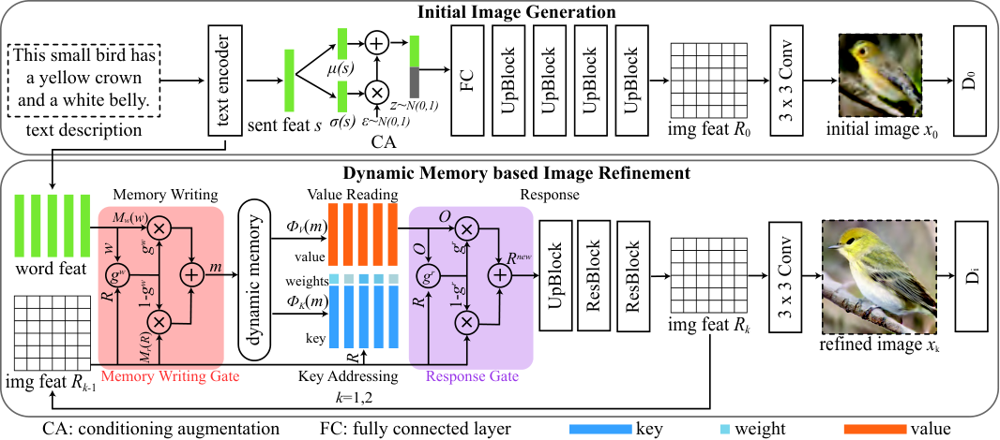

*Figure 2 · [Source](https://arxiv.org/abs/1904.01310)*

### DMD2 (Distribution Matching Distillation)

Distribution Matching Distillation (MIT and Adobe Research) turns a diffusion model into a one-step generator by matching output distributions rather than individual sampling trajectories. DMD (2023) minimizes an approximate KL divergence whose gradient is the difference between two scores: that of the frozen teacher (real distribution) and that of a second diffusion model trained online on the generator's samples (fake distribution); it also needed an LPIPS regression loss on precomputed teacher noise–image pairs. DMD2 (2024) removes the regression loss and its costly dataset, stabilizes training by updating the fake-score model more often than the generator, adds a GAN loss against real images so the student can surpass the teacher, and supports multi-step students trained on simulated inference-time inputs. Released DMD2 models distill SDXL into one- and four-step generators at 1024px.

[Paper 1](https://arxiv.org/abs/2311.18828) · [Paper 2](https://arxiv.org/abs/2405.14867) · [GitHub](https://github.com/tianweiy/DMD2) · [Model card](https://huggingface.co/tianweiy/DMD2) · [Details](models/efficient.md#dmd2)

*Figure 3 (PDF p. 6) · [Source](https://arxiv.org/abs/2405.14867)*

### DreamLLM

DreamLLM, from Xi'an Jiaotong University, MEGVII, Tsinghua and others, is a learning framework for multimodal LLMs that both comprehend and create images and interleaved documents. Instead of forcing the LLM's outputs to match CLIP embeddings, it appends a set of learnable dream queries whose LLM outputs are projected into the conditioning space of a frozen Stable Diffusion decoder, which is trained through score distillation in pixel space. A special <dream> token lets the model decide where images go within text, so interleaved generative pretraining on web documents yields free-form interleaved image-text generation as well as text-to-image synthesis and visual understanding.

[Paper](https://arxiv.org/abs/2309.11499) · [GitHub](https://github.com/RunpeiDong/DreamLLM) · [Details](models/unified.md#dreamllm)

*Figure 2 · [Source](https://arxiv.org/abs/2309.11499)*

### E-MMDiT (AMD Nitro-E)

E-MMDiT (AMD, 2025), released as Nitro-E, is a small MMDiT-style text-to-image model designed around token reduction so that it can be trained cheaply and run fast. Images are encoded by the highly compressive DC-AE (32× downsampling) and prompts by Llama 3.2-1B. Inside the transformer, a multi-path compression module condenses image tokens by 2× and 4× for the middle blocks and a reconstructor restores them, with positional embeddings re-injected (Position Reinforcement) to keep spatial coherence; Alternating Subregion Attention restricts attention to alternating token subregions, and AdaLN-affine computes modulation parameters cheaply. The 512px model was trained on about 25M public images in 1.5 days on one node of eight AMD MI300X GPUs and reaches 0.66 GenEval (0.72 after GRPO post-training). Distilled checkpoints sample in four steps and roughly double throughput.

[Paper](https://arxiv.org/abs/2510.27135) · [GitHub](https://github.com/AMD-AGI/Nitro-E) · [Model card](https://huggingface.co/amd/Nitro-E) · [Details](models/efficient.md#e-mmdit)

*Figure 3 (PDF p. 3) · [Source](https://arxiv.org/abs/2510.27135)*

### eDiff-I

Cascaded pixel-space diffusion (64×64 base, SR256 and SR1024 super-resolution models) in which denoising is split across an ensemble of expert denoisers specialized for different noise intervals, conditioned on T5-XXL and CLIP text embeddings.

[Paper](https://arxiv.org/abs/2211.01324) · [Project](https://research.nvidia.com/labs/cosmos-lab/ediff-i/) · GitHub: no author-linked repository found · [Details](models/pixel-diffusion.md#ediff-i)

*Figure 5 · [Source](https://arxiv.org/abs/2211.01324)*

### Emu (BAAI)

Emu is BAAI's generative multimodal foundation model trained with one autoregressive objective over interleaved image, text and video data. Images are encoded by EVA-CLIP and compressed by a Causal Transformer into a fixed number of visual embeddings that sit alongside text tokens in a LLaMA sequence; the model is trained to classify the next text token or regress the next visual embedding. Generated visual embeddings condition a latent diffusion decoder, initialized from Stable Diffusion, that renders the image. The same model performs captioning, image and video question answering, in-context image-to-text and text-to-image generation. It is unrelated to Meta's Emu text-to-image model.

[Paper](https://arxiv.org/abs/2307.05222) · [GitHub](https://github.com/baaivision/Emu) · [Details](models/unified.md#emu-baai)

*Figure 2 · [Source](https://arxiv.org/abs/2307.05222)*

### Emu (Meta)

Quality-tuned 1024×1024 latent diffusion model with a 2.8B-parameter U-Net, a 16-channel autoencoder, and CLIP ViT-L plus T5-XXL text conditioning.

[Paper](https://arxiv.org/abs/2309.15807) · [Details](models/latent-unet.md#emu-meta)

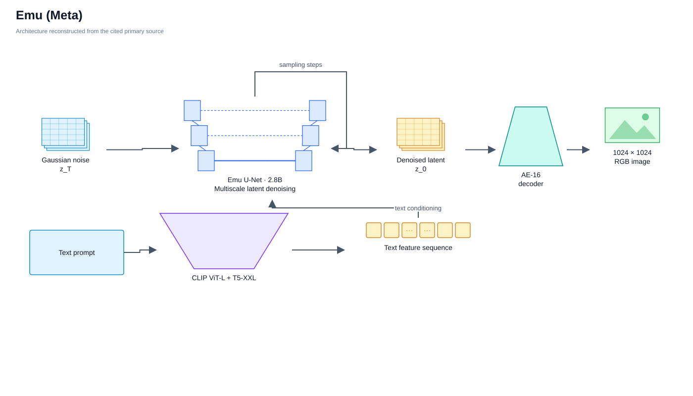

*Editorial input/output diagram · [Source](https://arxiv.org/abs/2309.15807)*

### Emu2

Emu2 is BAAI's 37-billion-parameter successor to Emu, trained with a unified predict-the-next-multimodal-element objective over text, image-text pairs and interleaved image-text-video sequences. Each image is encoded by EVA-02-CLIP and pooled into 64 continuous visual embeddings interleaved with text tokens; the model classifies text tokens and regresses visual embeddings, which an SDXL-initialized diffusion decoder turns back into images. Unlike Emu, the visual decoder is trained as a stand-alone detokenizer without the language model. Instruction tuning yields Emu2-Chat for multimodal dialogue and Emu2-Gen, which accepts mixes of text, locations and images for text-to-image, grounded, subject-driven generation and editing.

[Paper](https://arxiv.org/abs/2312.13286) · [GitHub](https://github.com/baaivision/Emu) · [Model card](https://huggingface.co/BAAI/Emu2-Gen) · [Details](models/unified.md#emu2)

*Figure 2 · [Source](https://arxiv.org/abs/2312.13286)*

### Emu3

Emu3 is BAAI's suite of multimodal models trained solely with next-token prediction. Images, videos and text are all tokenized into a discrete space, and a single transformer is trained from scratch on mixed multimodal sequences, with no diffusion model or CLIP encoder in the pipeline. Text-to-image generation, vision-language understanding and causal text-to-video generation or video extension are all performed by predicting the next token. The released post-trained models are split by task: Emu3-Gen for image generation and Emu3-Chat for vision-language understanding.

[Paper](https://arxiv.org/abs/2409.18869) · [GitHub](https://github.com/baaivision/Emu3) · [Model card](https://huggingface.co/BAAI/Emu3-Gen) · [Details](models/unified.md#emu3)

*Figure 1 (PDF p. 1) · [Source](https://arxiv.org/abs/2409.18869)*

### Emu3.5

Emu3.5 is BAAI's successor to Emu3, described as a native multimodal world model that predicts the next state across vision and language. A single 34B decoder-only transformer is pretrained end-to-end with next-token prediction on about 13 trillion tokens of interleaved vision-language data, mostly frames and transcripts of internet videos, then fine-tuned and trained with large-scale reinforcement learning. It generates interleaved text and images, including text-to-image and any-to-image (X2I) generation and editing, and the paper reports image generation and editing results comparable to Gemini 2.5 Flash Image. For speed, DiDA converts token-by-token image decoding into bidirectional parallel prediction, about 20x faster per image.

[Paper](https://arxiv.org/abs/2510.26583) · [GitHub](https://github.com/baaivision/Emu3.5) · [Model card](https://huggingface.co/BAAI/Emu3.5-Image) · [Details](models/unified.md#emu3-5)

*Figure 3 · [Source](https://arxiv.org/abs/2510.26583)*

### ERNIE-Image

ERNIE-Image is Baidu's open 8B-parameter text-to-image model, built as a single-stream diffusion transformer that deliberately pairs a compact 3B Ministral-3 language model as text encoder with the FLUX.2 project's open-source VAE, rather than pursuing a larger or novel backbone. Its technical report focuses on data and training choices instead of architectural novelty: captions are generated by a vision-language model instructed to describe in-image text carefully, so the model targets text-rich, layout-sensitive content such as slides, posters and documents, and training resolution is staged upward from 256px to 1024px. The team reports state-of-the-art results among open-weight text-to-image models at its release. Code and weights are released under Apache-2.0.

[Paper](https://arxiv.org/abs/2605.25347) · [GitHub](https://github.com/baidu/ERNIE-Image) · [Model card](https://huggingface.co/baidu/ERNIE-Image) · [Details](models/dit.md#ernie-image)

*Editorial input/output diagram · [Source](https://arxiv.org/abs/2605.25347)*

### ERNIE-ViLG

ERNIE-ViLG (Baidu, 2021) is a 10-billion-parameter Chinese model that treats both text-to-image generation and image captioning as autoregressive sequence generation in one transformer. Images are represented as VQGAN tokens; for generation the model predicts these tokens after the prompt and the VQGAN decoder renders the image. It was trained on 145 million Chinese image-text pairs.

[Paper](https://arxiv.org/abs/2112.15283) · GitHub: no author-linked repository found · [Details](models/ar-token.md#ernie-vilg)

*Figure 1 · [Source](https://arxiv.org/abs/2112.15283)*

### ERNIE-ViLG 2.0

Chinese latent diffusion model with a 1.3B transformer text encoder and a mixture of ten 2.2B U-Net denoising experts, each assigned to one block of timesteps.

[Paper](https://arxiv.org/abs/2210.15257) · [Details](models/latent-unet.md#ernie-vilg-2)

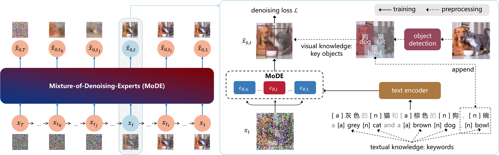

*Figure 2 · [Source](https://arxiv.org/abs/2210.15257)*

### Fluid

Fluid (Google DeepMind and MIT) studies why autoregressive image models scale worse than language models by comparing discrete versus continuous tokens and raster versus random generation order in a controlled text-to-image setup. Continuous tokens gave clearly better visual quality, and random-order models with bidirectional attention scored higher on GenEval than raster-order causal models, so the final Fluid model combines both: it predicts masked continuous tokens in random order, one or several at a time, and models each token with a small diffusion head following the MAR diffusion-loss approach. The largest model has 10.5B parameters and is trained on WebLI at 256×256.

[Paper](https://arxiv.org/abs/2410.13863) · GitHub: no author-linked repository found · [Details](models/continuous-ar.md#fluid)

*Figure 3 · [Source](https://arxiv.org/abs/2410.13863)*

### FLUX.1

FLUX.1 is the first model family from Black Forest Labs, founded by researchers behind latent diffusion and Stable Diffusion 3. It is a 12B-parameter rectified-flow transformer that starts with MM-DiT-style double-stream blocks, where text and image tokens keep separate weights but share attention, and continues with a deeper stack of single-stream blocks that process both token types together with fused attention and MLP layers. It works in the latent space of a 16-channel autoencoder and uses rotary position embeddings. The family was released as an API-only [pro] model, a guidance-distilled open-weight [dev] model for non-commercial use, and a few-step Apache-licensed [schnell] model.

[Announcement](https://bfl.ai/announcements/24-08-01-bfl) · [Paper](https://arxiv.org/abs/2506.15742) · [GitHub](https://github.com/black-forest-labs/flux) · [Model card 1](https://huggingface.co/black-forest-labs/FLUX.1-dev) · [Model card 2](https://huggingface.co/black-forest-labs/FLUX.1-schnell) · [Details](models/dit.md#flux-1)

*Figure 3 (FLUX.1 Kontext paper) · [Source](https://arxiv.org/abs/2506.15742)*

### FLUX.1 Kontext

FLUX.1 Kontext is Black Forest Labs' in-context image generation and editing model built on FLUX.1. Instead of adding adapters, it feeds the latent tokens of one or more reference images into the same transformer sequence as the image being generated, marking them apart with a positional offset, so one network can edit an image from a text instruction, carry a character or style into new scenes, or generate from text alone when no image is given. Adversarial distillation keeps generation and editing at interactive speeds, and the model is designed for repeated, multi-turn edits with little drift. The [pro] and [max] versions are available through the API, while [dev] is an open-weight editing model.

[Paper](https://arxiv.org/abs/2506.15742) · [Announcement](https://bfl.ai/announcements/flux-1-kontext) · [GitHub](https://github.com/black-forest-labs/flux) · [Model card](https://huggingface.co/black-forest-labs/FLUX.1-Kontext-dev) · [Details](models/dit.md#flux-1-kontext)

*Figure 4 · [Source](https://arxiv.org/abs/2506.15742)*

### FLUX.2

FLUX.2 is Black Forest Labs' next-generation image model family after FLUX.1, pairing a large vision-language model (Mistral-3 24B) with a rectified-flow diffusion transformer so that world knowledge and language understanding from the VLM inform the transformer's spatial and compositional generation. It is designed from the start to generate and edit in one model, including combining up to ten reference images into a single new image. The family spans closed API tiers ([pro], [flex], [max]) and open-weight tiers: a 32B [dev] model and smaller, faster, step-distilled [klein] models at 4B and 9B parameters, with licensing that varies by checkpoint from Apache-2.0 to a non-commercial research license. No technical paper accompanies the release, so this entry is based on Black Forest Labs' own announcement and documentation.

[Announcement 1](https://bfl.ai/blog/flux-2) · [Announcement 2](https://bfl.ai/blog/flux2-klein-towards-interactive-visual-intelligence) · [GitHub](https://github.com/black-forest-labs/flux2) · [Model card](https://huggingface.co/black-forest-labs/FLUX.2-dev) · [Details](models/dit.md#flux-2)

*Editorial input/output diagram · [Source](https://bfl.ai/blog/flux-2)*

### Frido

Feature-pyramid latent diffusion model that denoises multi-scale MS-VQGAN latents coarse to fine with a shared pyramid U-Net (PyU-Net) using coarse-to-fine modulation.

[Paper](https://arxiv.org/abs/2208.13753) · [GitHub](https://github.com/chrisfan-wc/Frido) · [Details](models/latent-unet.md#frido)

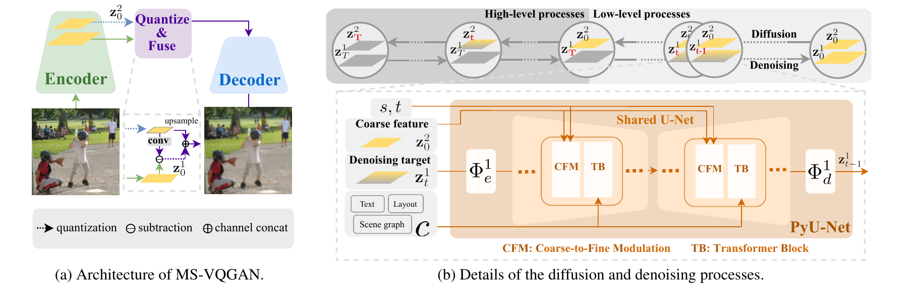

*Figure 3 (PDF p. 4) · [Source](https://arxiv.org/abs/2208.13753)*

### GAN-INT-CLS

Text-conditional DCGAN whose generator and discriminator both receive a projected char-CNN-RNN sentence embedding.

[Paper](https://arxiv.org/abs/1605.05396) · [GitHub](https://github.com/reedscot/icml2016) · [Details](models/gan.md#gan-int-cls)

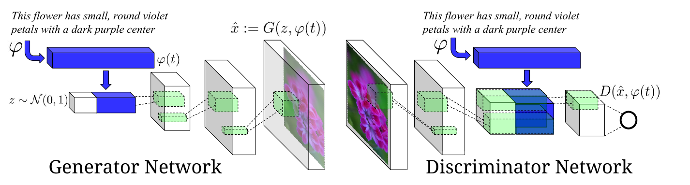

*Figure 2 (PDF p. 4) · [Source](https://arxiv.org/abs/1605.05396)*

### GAWWN

Text- and location-conditional GAN whose generator and discriminator split into global and local (bounding-box or keypoint-masked) pathways.

[Paper](https://arxiv.org/abs/1610.02454) · [GitHub](https://github.com/reedscot/nips2016) · [Details](models/gan.md#gawwn)

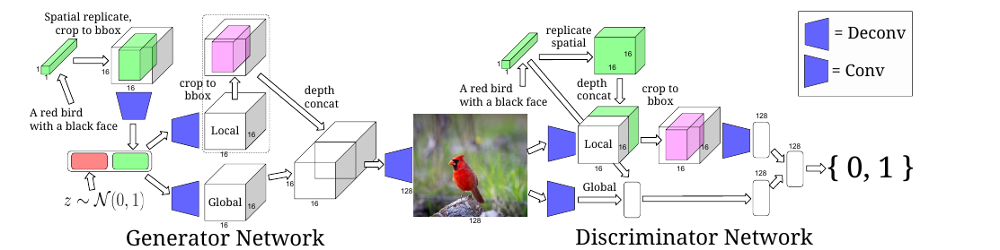

*Figure 2 (PDF p. 4) · [Source](https://arxiv.org/abs/1610.02454)*

### Gemini native image generation

Gemini native image generation lets Gemini models output images directly, first as an experiment in Gemini 2.0 Flash (March 2025) and then as dedicated image models branded Nano Banana: Gemini 2.5 Flash Image (August 2025), Gemini 3 Pro Image ("Nano Banana Pro", November 2025), Gemini 3.1 Flash Image ("Nano Banana 2", February 2026) and Gemini 3.1 Flash-Lite Image ("Nano Banana 2 Lite", GA July 2026). The Gemini API documents text-to-image generation, editing of a supplied image from text instructions, multi-turn conversational editing, multiple reference images and, for some models, interleaved text and image output. Google's model cards say each image model is based on a Gemini language model (for example, Gemini 3 Pro Image on Gemini 3 Pro) and refer to those models' cards for architecture; how images are generated is not described.

[Announcement 1](https://developers.googleblog.com/en/experiment-with-gemini-20-flash-native-image-generation/) · [Announcement 2](https://developers.googleblog.com/en/introducing-gemini-2-5-flash-image/) · [Announcement 3](https://blog.google/innovation-and-ai/products/nano-banana-pro/) · [Announcement 4](https://blog.google/innovation-and-ai/technology/ai/nano-banana-2/) · [Announcement 5](https://cloud.google.com/blog/products/ai-machine-learning/nano-banana-2-lite-and-gemini-omni-flash-available) · [Model card 1](https://storage.googleapis.com/deepmind-media/Model-Cards/Gemini-3-Pro-Image-Model-Card.pdf) · [Model card 2](https://storage.googleapis.com/deepmind-media/Model-Cards/Gemini-3-1-Flash-Image-Model-Card.pdf) · [Model card 3](https://storage.googleapis.com/deepmind-media/Model-Cards/Gemini-3-1-Flash-Lite-Image-Model-Card.pdf) · [Docs](https://ai.google.dev/gemini-api/docs/image-generation) · [Details](models/api.md#gemini-image)

*Editorial input/output diagram · [Source](https://ai.google.dev/gemini-api/docs/image-generation)*

### GenTron

GenTron is a 2023 study from Adobe and Johns Hopkins that adapts the class-conditional DiT transformer diffusion model to open-ended text-to-image generation. Its main contribution is a conditioning ablation: rather than the adaLN mechanism DiT uses for class labels, GenTron injects text through cross-attention layers while keeping adaLN for the diffusion timestep, and shows this produces better text alignment. Scaling the resulting transformer from about 900M to 3.1B parameters improves image quality, and in a human study GenTron's images were preferred over SDXL's on both visual quality and text alignment. The paper also extends the same design to text-to-video generation, which is outside this catalog's scope.

[Paper](https://arxiv.org/abs/2312.04557) · [Details](models/dit.md#gentron)

*Figure 2 (PDF p. 3) · [Source](https://arxiv.org/abs/2312.04557)*

### GILL

GILL (Generating Images with Large Language Models), from CMU, efficiently grounds a frozen autoregressive LLM in visual generation without training or running the image generator during training. A linear layer maps a pretrained visual encoder's image features into the LLM's embedding space so it can process interleaved image-and-text inputs, while on the output side the LLM learns to emit special [IMG] placeholder tokens whose hidden states are mapped, via a learned GILLMapper and an MSE loss against the frozen SD text encoder's own embeddings, into conditioning vectors for an off-the-shelf, frozen Stable Diffusion decoder; a separate retrieval head lets GILL alternatively retrieve rather than generate an image when appropriate.

[Paper](https://arxiv.org/abs/2305.17216) · [GitHub](https://github.com/kohjingyu/gill) · [Details](models/unified.md#gill)

*Figure 2 (PDF p. 3) · [Source](https://arxiv.org/abs/2305.17216)*

### GLIDE

Cascaded pixel-space diffusion: a text-conditional ADM U-Net at 64×64 plus a text-conditional diffusion upsampler to 256×256, with text encoded by a transformer trained jointly with the model.

[Paper](https://arxiv.org/abs/2112.10741) · [GitHub](https://github.com/openai/glide-text2im) · [Details](models/pixel-diffusion.md#glide)

*Editorial input/output diagram · [Source](https://arxiv.org/abs/2112.10741)*

### GLM-Image

GLM-Image (Z.ai) splits image generation into a semantic stage and a detail stage. The autoregressive part, built on the GLM-4-9B-0414 language model with an added vision embedding layer and a vision LM head, generates semantic-VQ tokens from the X-Omni tokenizer scheme; it first produces about 256 low-resolution layout tokens and then 1K–4K higher-resolution tokens. A 7B single-stream DiT decoder trained with flow matching receives these tokens, projected and concatenated with the VAE latent along the channel dimension, and adds the high-frequency detail; it needs no prompt text encoder, only a lightweight Glyph-ByT5 module for rendering text in the image. Final outputs range from 1024 to 2048 px. The same model also handles image-to-image tasks such as editing, style transfer and identity-preserving or multi-subject generation, and both stages are post-trained separately with GRPO-based reinforcement learning.

[Announcement](https://z.ai/blog/glm-image) · [GitHub](https://github.com/zai-org/GLM-Image) · [Model card](https://huggingface.co/zai-org/GLM-Image) · [Details](models/continuous-ar.md#glm-image)

*README architecture figure (architecture_1) · [Source](https://github.com/zai-org/GLM-Image)*

### GPT Image 1

GPT Image 1 (`gpt-image-1`) is OpenAI's image generation model added to the API on 2025-04-23. OpenAI's model documentation describes it as a natively multimodal language model that accepts text and image inputs and produces images, served through the Images API generation and edit endpoints and through batch processing, with inpainting support. A cost-efficient `gpt-image-1-mini` followed in October 2025, and `gpt-image-1.5` in December 2025 with better instruction following. OpenAI publishes no architecture details for these models, so the card records only the documented interface.

[Docs 1](https://developers.openai.com/api/docs/models/gpt-image-1) · [Docs 2](https://developers.openai.com/api/docs/models/gpt-image-1-mini) · [Docs 3](https://developers.openai.com/api/docs/models/gpt-image-1.5) · [Announcement](https://developers.openai.com/api/docs/changelog) · [Details](models/api.md#gpt-image-1)

*Editorial input/output diagram · [Source](https://developers.openai.com/api/docs/models/gpt-image-1)*

### GPT Image 2

GPT Image 2 (`gpt-image-2`) is the OpenAI image model released in the API on 2026-04-21 as a new model for image generation and editing, succeeding the GPT Image 1 line. OpenAI's changelog lists flexible image sizes, high-fidelity image inputs, token-based pricing and batch support; transparent backgrounds were added in preview in August 2026. On 2026-09-08 OpenAI released two point versions, GPT Image 2.5 Sunburst (aimed at editing precision) and GPT Image 2.5 Flare (fast everyday generation). All accept text and image input and return images; no architecture is published.

[Docs 1](https://developers.openai.com/api/docs/models/gpt-image-2) · [Docs 2](https://developers.openai.com/api/docs/models/gpt-image-2.5-sunburst) · [Docs 3](https://developers.openai.com/api/docs/models/gpt-image-2.5-flare) · [Announcement](https://developers.openai.com/api/docs/changelog) · [Details](models/api.md#gpt-image-2)

*Editorial input/output diagram · [Source](https://developers.openai.com/api/docs/models/gpt-image-2)*

### Grok Aurora

Aurora is the image generation model xAI introduced in Grok on the X platform on 2024-12-09. xAI's announcement describes it as an autoregressive mixture-of-experts network trained on billions of internet examples to predict the next token from interleaved text and image data, and highlights photorealistic rendering and close adherence to text instructions. The same post says the model natively supports multimodal input for taking inspiration from or directly editing user-provided images, but that editing would be released to X users later. Beyond this description xAI has published no technical report, so the card records the announced interface.

[Announcement](https://x.ai/news/grok-image-generation-release) · [Details](models/api.md#grok-aurora)

*Editorial input/output diagram · [Source](https://x.ai/news/grok-image-generation-release)*

### Grok Imagine Image

Grok Imagine Image is xAI's line of image models served in the Grok Imagine app and the xAI Imagine API. The API documents text-to-image generation of up to 10 images per request at 1K or 2K resolution, and natural-language editing with up to five source images for combining subjects, transferring styles and composing scenes. Imagine Image 2.0 (`grok-imagine-image-2.0`), announced on 2026-08-07, emphasizes instruction following, typography and layout, region edits via a magic wand and segmentation, smart resizing and background removal. xAI does not publish the architecture of these models.

[Announcement](https://x.ai/news/grok-imagine-image-2) · [Docs 1](https://docs.x.ai/docs/guides/image-generations) · [Docs 2](https://docs.x.ai/developers/model-capabilities/images/generation) · [Docs 3](https://docs.x.ai/docs/models) · [Details](models/api.md#grok-imagine-image)

*Editorial input/output diagram · [Source](https://docs.x.ai/docs/guides/image-generations)*

### HART

HART (Hybrid Autoregressive Transformer, from MIT, NVIDIA and Tsinghua) generates 1024×1024 images directly with an autoregressive model. Its hybrid tokenizer splits an autoencoder's continuous latent into the sum of discrete multi-scale VAR tokens, which capture overall structure, and a continuous residual that holds fine detail. A VAR-style transformer predicts the discrete tokens scale by scale, with text tokens from a frozen Qwen2-1.5B language model concatenated in front and visible to all visual tokens, and a lightweight MLP diffusion head predicts the residual in 8 sampling steps, conditioned on the transformer's final hidden states and the last discrete tokens. The paper reports quality comparable to diffusion models of similar size with 4.5–7.7× higher throughput.

[Paper](https://arxiv.org/abs/2410.10812) · [GitHub](https://github.com/mit-han-lab/hart) · [Model card](https://huggingface.co/mit-han-lab/hart-0.7b-1024px) · [Details](models/continuous-ar.md#hart)

*Figure 6 · [Source](https://arxiv.org/abs/2410.10812)*

### HDGAN

Single-stream residual generator that emits side-output images of growing resolution, each judged by its own hierarchically-nested discriminator.

[Paper](https://arxiv.org/abs/1802.09178) · [GitHub](https://github.com/ypxie/HDGan) · [Details](models/gan.md#hdgan)

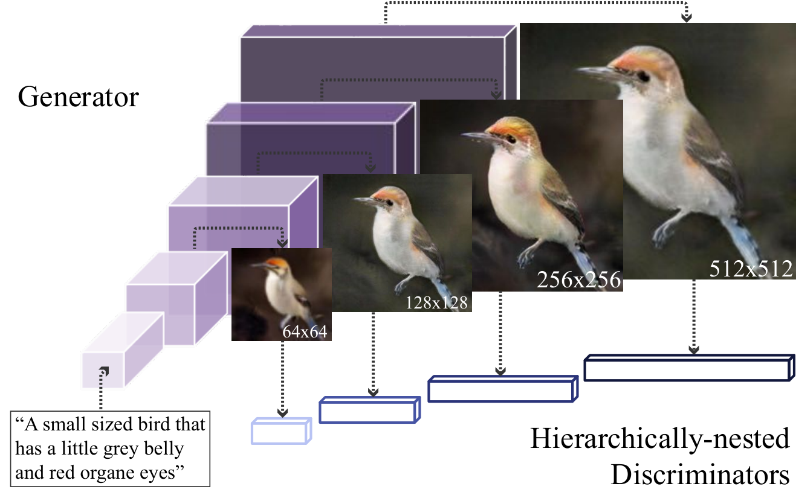

*Figure 1 (top panel) · [Source](https://arxiv.org/abs/1802.09178)*

### HiDream-I1

HiDream-I1 is a 17B-parameter open text-to-image diffusion transformer from HiDream-ai that combines a dual-stream-then-single-stream DiT backbone (in the style of FLUX/SD3) with sparse Mixture-of-Experts feed-forward layers, so only a subset of experts activates per token despite the large parameter count. It conditions on three complementary text representations at once: pooled long-context CLIP embeddings for global style through adaptive layer norm, T5-XXL token embeddings, and features drawn from multiple layers of a frozen Llama-3.1-8B-Instruct language model. The Full/Dev/Fast variants trade off inference steps and distillation for speed, and the model was released under the MIT license for both code and weights.

[Paper](https://arxiv.org/abs/2505.22705) · [GitHub](https://github.com/HiDream-ai/HiDream-I1) · [Model card](https://huggingface.co/HiDream-ai/HiDream-I1-Full) · [Details](models/dit.md#hidream-i1)

*Figure 3 · [Source](https://arxiv.org/abs/2505.22705)*

### HiDream-O1-Image

HiDream.ai's HiDream-O1-Image drops both the VAE and the separate text encoder. Text is tokenized with the backbone's own vocabulary, optional reference or source images are encoded with SigLIP2 into condition tokens, and the noisy target image is patchified directly from pixels; all three token types are concatenated and processed by one transformer, which predicts clean image patches. Text and condition tokens use causal attention while generation tokens attend to everything. The released 8B model is initialized from Qwen3-VL-8B-Instruct and trained with flow matching plus LPIPS and DINO perceptual losses, progressing from 512² to 1024² and above 2048² images. One model covers text-to-image generation, instruction-based editing and subject-driven personalization, and a Gemma-based prompt agent rewrites user prompts before generation.

[Paper](https://arxiv.org/abs/2605.11061) · [GitHub](https://github.com/HiDream-ai/HiDream-O1-Image) · [Model card](https://huggingface.co/HiDream-ai/HiDream-O1-Image) · [Details](models/pixel-diffusion.md#hidream-o1-image)

*Figure 7 · [Source](https://arxiv.org/abs/2605.11061)*

### Hierarchical text-to-image via inferred semantic layout (Hong et al.)

Text → layout → image pipeline: an LSTM box generator, a convolutional-recurrent shape generator and a layout- and text-conditioned GAN image generator.

[Paper](https://arxiv.org/abs/1801.05091) · GitHub: no author-linked repository found · [Details](models/gan.md#hong-semantic-layout)

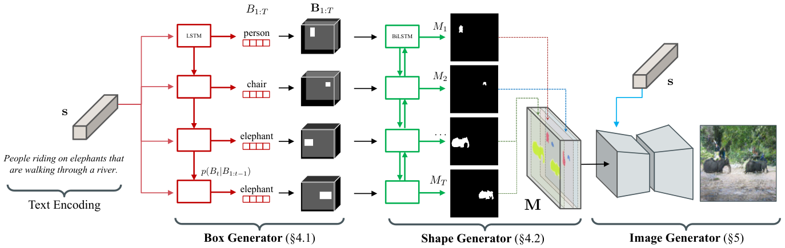

*Figure 2 · [Source](https://arxiv.org/abs/1801.05091)*

### Hunyuan-DiT

Hunyuan-DiT is Tencent's bilingual text-to-image diffusion transformer, built for fine-grained understanding of Chinese as well as English prompts. It keeps a transformer backbone but borrows the long skip connections of a U-Net, injects text through cross-attention from two encoders (a bilingual CLIP and a multilingual T5), and uses rotary position embeddings adapted to multiple resolutions. The report also describes a recaptioning data pipeline and an optional multimodal LLM that rewrites user prompts and enables multi-turn, dialogue-driven generation.

[Paper](https://arxiv.org/abs/2405.08748) · [GitHub](https://github.com/Tencent-Hunyuan/HunyuanDiT) · [Model card](https://huggingface.co/Tencent-Hunyuan/HunyuanDiT) · [Details](models/dit.md#hunyuan-dit)

*Figure 7 · [Source](https://arxiv.org/abs/2405.08748)*

### HunyuanImage 3.0

HunyuanImage 3.0 is Tencent Hunyuan's native multimodal model that unifies understanding and generation in one autoregressive framework; the report describes its image generation module as the largest open-source image generative model to date. Built on the Hunyuan-A13B Mixture-of-Experts language model, it models text tokens autoregressively and image tokens with diffusion prediction in the same sequence, uses a native chain-of-thought schema, and can choose image size and aspect ratio itself through special tokens. The technical report covers data curation, progressive pretraining and post-training (SFT, DPO, MixGRPO, SRPO, ReDA); the initial release is the image generation model, and a later Instruct checkpoint adds reasoning, prompt rewriting and image-to-image generation including editing and multi-image fusion.

[Paper](https://arxiv.org/abs/2509.23951) · [GitHub](https://github.com/Tencent-Hunyuan/HunyuanImage-3.0) · [Model card](https://huggingface.co/tencent/HunyuanImage-3.0) · [Details](models/unified.md#hunyuanimage-3)

*Figure 3 · [Source](https://arxiv.org/abs/2509.23951)*

### HunyuanImage-2.1

HunyuanImage-2.1 is Tencent's open 17B-parameter text-to-image model built to generate natively at 2K resolution. Its diffusion transformer mixes dual-stream blocks (separate processing paths for image and text tokens) for the first third of its depth with single-stream blocks for the rest, and conditions on two text encoders at once: a multimodal large language model for semantic alignment and a character-aware ByT5 encoder to improve legible text rendering in multiple languages. A second-stage refiner model cleans up detail and artifacts after the base generation step. The project reported a top rank among open text-to-image models on a public arena leaderboard at release. No architecture paper accompanies the open-source release, so its internals are documented only at README/model-card level.

[GitHub](https://github.com/Tencent-Hunyuan/HunyuanImage-2.1) · [Model card](https://huggingface.co/tencent/HunyuanImage-2.1) · [Details](models/dit.md#hunyuanimage-2-1)

*README — framework_overall.png · [Source](https://github.com/Tencent-Hunyuan/HunyuanImage-2.1)*

### Hyper-SD

Hyper-SD (ByteDance, 2024) accelerates SD 1.5 and SDXL to one to eight sampling steps. Its core method, Trajectory Segmented Consistency Distillation (TSCD), splits the diffusion timeline into segments, enforces consistency inside each segment, and progressively merges segments (8 → 4 → 2 → 1) so that the student keeps close to the teacher's ODE trajectory. Feedback learning from aesthetic reward models and an instance-segmentation model then improves quality, and Distribution Matching Distillation strengthens one-step generation. Most checkpoints are LoRA modules, including a unified one-step LoRA usable at 1–8 steps with the TCD scheduler; a dedicated one-step SDXL U-Net is also released.

[Paper](https://arxiv.org/abs/2404.13686) · [Model card](https://huggingface.co/ByteDance/Hyper-SD) · [Project](https://hyper-sd.github.io/) · GitHub: no author-linked repository found · [Details](models/efficient.md#hyper-sd)

*Figure 2 (PDF p. 5) · [Source](https://arxiv.org/abs/2404.13686)*

### Ideogram

Ideogram is a text-to-image service and API known for rendering legible text, logos and graphic-design layouts. The company announced Ideogram in August 2023 and released closed model versions 0.1, 1.0 (February 2024), 2.0 (August 2024) and 3.0 (March 2025). Ideogram 3.0 added Style References (up to three uploaded images) and reusable style codes. The API documents generation, mask-and-prompt inpainting, remix, reframe and background replacement with these models, but the architectures of the closed versions are not published. The open-weight Ideogram 4.0 is a separate card.

[Announcement 1](https://docs.ideogram.ai/about-ideogram/blog-posts) · [Announcement 2](https://ideogram.ai/models/3.0/) · [Docs 1](https://developer.ideogram.ai/api-reference/legacy-endpoints/generate) · [Docs 2](https://developer.ideogram.ai/api-reference/generate-images/generate-v3) · [Docs 3](https://developer.ideogram.ai/api-reference/edit-images/inpaint-v3) · [Details](models/api.md#ideogram)

*Editorial input/output diagram · [Source](https://developer.ideogram.ai/api-reference/generate-images/generate-v3)*

### Ideogram 4.0

Ideogram 4.0 is Ideogram's first open-weight text-to-image foundation model, trained from scratch as a 34-layer single-stream diffusion transformer. It conditions on a frozen Qwen3-VL-8B-Instruct vision-language model, drawing on hidden states from many of its intermediate layers rather than just its final output, and decodes flow-matching latents through a frozen KL autoencoder. The release follows the single-stream DiT pattern used by several other recent open text-to-image models, and ships with fp8 and nf4 quantized checkpoints plus open inference code, though the weights themselves are limited to non-commercial use.

[Announcement](https://ideogram.ai/blog/ideogram-4.0/) · [GitHub](https://github.com/ideogram-oss/ideogram4) · [Model card](https://huggingface.co/ideogram-ai/ideogram-4-fp8) · [Details](models/dit.md#ideogram-4)

*Editorial input/output diagram · [Source](https://ideogram.ai/blog/ideogram-4.0/)*

### ILLUME

ILLUME, from a group including vivo AI Lab, unifies multimodal understanding and generation in one MLLM by using different visual representations for the two directions: input images are embedded as continuous features through a vision encoder and adapter for understanding, while generated images are predicted as discrete tokens from a semantic vision tokenizer whose codebook is trained with both reconstruction and semantic supervision. A diffusion-based decoder (denoising U-Net plus upsampling) converts the predicted discrete tokens back into a higher-resolution image, and a self-enhancing multimodal alignment scheme with progressive training improves data efficiency compared to prior unified models.

[Paper](https://arxiv.org/abs/2412.06673) · GitHub: no author-linked repository found · [Details](models/unified.md#illume)

*Figure 3 · [Source](https://arxiv.org/abs/2412.06673)*

### ILLUME+

ILLUME+ is an enhanced version of ILLUME that adds a dual vision tokenizer and a diffusion decoder to close the gap between unified models' understanding, generation and editing abilities. Its DualViTok tokenizer has a semantic branch (a pretrained text-aligned QwenViT encoder, quantized and reconstructed for image-text alignment) and a pixel branch (a MoVQGAN-based encoder that additionally consumes the quantized semantic features to preserve texture), so the same tokenizer captures both deep semantics and fine-grained detail needed for editing. Rather than decoupling input and output representations like the Janus series, ILLUME+ uses continuous pre-quantized features as MLLM input and predicts discrete coarse-to-fine (semantic-then-pixel) tokens as output through one unified LM head, and an optional diffusion U-Net decoder refines those tokens into higher-fidelity, higher-resolution images. The 3B-LLM model is reported competitive with larger unified and specialist models on understanding, generation (up to 1024x1024) and editing benchmarks.

[Paper](https://arxiv.org/abs/2504.01934) · [GitHub](https://github.com/illume-unified-mllm/ILLUME_plus) · [Model card](https://huggingface.co/ILLUME-MLLM/ILLUME_plus-3b) · [Details](models/unified.md#illume-plus)

*Figure 3 · [Source](https://arxiv.org/abs/2504.01934)*

### ImageBART

ImageBART (Heidelberg University, NeurIPS 2021) addresses the one-directional, single-scale context of autoregressive image transformers by combining them with a discrete diffusion process. Image tokens are gradually corrupted, and a few transformers learn to restore them stage by stage, each seeing the whole coarser image. With text conditioning trained on Conceptual Captions it generates images from prompts and can edit masked regions of an existing image according to text.

[Paper](https://arxiv.org/abs/2108.08827) · [GitHub](https://github.com/CompVis/imagebart) · [Details](models/ar-token.md#imagebart)

*Figure 1 · [Source](https://arxiv.org/abs/2108.08827)*

### Imagen

Frozen T5-XXL text encoder feeding a cascade of pixel-space diffusion U-Nets: a 64×64 base model and two text-conditional super-resolution models (64→256, 256→1024).

[Paper](https://arxiv.org/abs/2205.11487) · [Project](https://imagen.research.google/) · GitHub: no author-linked repository found · [Details](models/pixel-diffusion.md#imagen)

*Figure A.4 (PDF p. 19) · [Source](https://arxiv.org/abs/2205.11487)*

### Imagen 2

Imagen 2 is Google's second-generation Imagen model, made generally available on Vertex AI in December 2023 and later used in Bard, ImageFX and Search. Google's announcements highlight photorealistic generation, text and logo rendering, and multilingual prompts; Google's consumer blog describes it only as a diffusion-based model, with no technical report. On Vertex AI it was offered as `imagegeneration@005` and `imagegeneration@006`, and the 006 editing model added mask-based inpainting, outpainting and product-image editing. Google deprecated Imagen 2 on Vertex AI in June 2025 and removed it in September 2025.

[Announcement 1](https://cloud.google.com/blog/products/ai-machine-learning/imagen-2-on-vertex-ai-is-now-generally-available) · [Announcement 2](https://blog.google/technology/ai/google-imagen-2/) · [Docs](https://docs.cloud.google.com/vertex-ai/generative-ai/docs/release-notes) · [Details](models/api.md#imagen-2)

*Editorial input/output diagram · [Source](https://cloud.google.com/blog/products/ai-machine-learning/imagen-2-on-vertex-ai-is-now-generally-available)*

### Imagen 3

Imagen 3 is Google's third-generation Imagen model, described in a technical report submitted to arXiv in August 2024. The report calls it a latent diffusion model that generates 1024×1024 images from text, optionally followed by 2×, 4× or 8× upsampling, and trained on filtered image–text data paired with both original and Gemini-generated synthetic captions. Most of the report covers human and automatic evaluations and safety and responsibility work rather than the network design. On Vertex AI, Imagen 3 generation models reached general availability in 2024, and a separate `imagen-3.0-capability` model added mask-based editing and reference-image customization.

[Paper](https://arxiv.org/abs/2408.07009) · [Docs](https://docs.cloud.google.com/vertex-ai/generative-ai/docs/release-notes) · [Details](models/api.md#imagen-3)

*Editorial input/output diagram · [Source](https://arxiv.org/abs/2408.07009)*

### Imagen 4

Imagen 4 is Google's fourth-generation Imagen model, announced at Google I/O on 2025-05-20 for the Gemini app, Whisk, Vertex AI and Workspace. Google highlights finer detail, better spelling and typography, and output up to 2K resolution. Its model card describes it as a latent diffusion model trained on filtered images with Gemini-generated synthetic captions, and lists text or image files as inputs. The family reached general availability in the Gemini API and Vertex AI in August 2025 as Imagen 4, Imagen 4 Fast and Imagen 4 Ultra. Google deprecated the Vertex AI Imagen endpoints in March 2026 and recommends Gemini 2.5 Flash Image instead.

[Model card](https://storage.googleapis.com/deepmind-media/Model-Cards/Imagen-4-Model-Card.pdf) · [Announcement 1](https://blog.google/technology/ai/generative-media-models-io-2025/) · [Announcement 2](https://developers.googleblog.com/announcing-imagen-4-fast-and-imagen-4-family-generally-available-in-the-gemini-api/) · [Docs](https://docs.cloud.google.com/vertex-ai/generative-ai/docs/release-notes) · [Details](models/api.md#imagen-4)

*Editorial input/output diagram · [Source](https://storage.googleapis.com/deepmind-media/Model-Cards/Imagen-4-Model-Card.pdf)*

### Imagine Flash

Imagine Flash (Meta GenAI, 2024) accelerates Meta's Emu text-to-image diffusion model to one, two or three sampling steps. Its main idea, backward distillation, trains the student on latents produced by its own backward (denoising) trajectory rather than on forward-noised real images, removing the mismatch between training inputs and what the student sees at inference. A Shifted Reconstruction Loss makes the teacher's target depend on the timestep, transferring global structure at high noise and fine detail at low noise, and an inference-time Noise Correction addresses singularities in noise prediction. The paper reports quality comparable to the 25-step Emu teacher with three steps.

[Paper](https://arxiv.org/abs/2405.05224) · GitHub: no author-linked repository found · [Details](models/efficient.md#imagine-flash)

*Figure 3 · [Source](https://arxiv.org/abs/2405.05224)*

### Infinity

Infinity (ByteDance, 2024) scales up VAR-style next-scale autoregressive image generation to open-vocabulary text-to-image synthesis by replacing VAR's small per-scale codebook with bitwise, binary-spherical-quantized tokens and an Infinite-Vocabulary Classifier, letting the tokenizer vocabulary grow to 2^64 without an intractable softmax. A Bitwise Self-Correction training trick further closes the train-inference gap from teacher forcing, and the resulting 2B model generates 1024px images with strong text rendering and prompt following.

[Paper](https://arxiv.org/abs/2412.04431) · [GitHub](https://github.com/FoundationVision/Infinity) · [Model card](https://huggingface.co/FoundationVision/Infinity) · [Details](models/ar-token.md#infinity)

*Figure 3 · [Source](https://arxiv.org/abs/2412.04431)*

### InstaFlow

InstaFlow (UT Austin and collaborators, 2023) turns Stable Diffusion into a one-step generator using Rectified Flow. A reflow stage retrains the SD U-Net on noise–image pairs produced by the teacher so that the text-conditioned probability-flow trajectories become straighter and the noise-to-image coupling becomes simpler; a distillation stage then trains a student to map noise to the image in a single step. The paper shows that direct one-step distillation of SD produces blurry images, whereas distilling after reflow works. InstaFlow-0.9B keeps the SD 1.5 U-Net, and InstaFlow-1.7B uses a Stacked U-Net of two U-Nets in series.

[Paper](https://arxiv.org/abs/2309.06380) · [GitHub](https://github.com/gnobitab/InstaFlow) · [Model card](https://huggingface.co/XCLiu/instaflow_0_9B_from_sd_1_5) · [Details](models/efficient.md#instaflow)

*Figure 3 · [Source](https://arxiv.org/abs/2309.06380)*

### InternVL-U

InternVL-U is a unified multimodal model built on InternVL 3.5 that argues unified models should not force text and images through one homogeneous pipeline. Its design follows three principles: unified contextual modeling with modality-adaptive generation (a shared autoregressive context space, but a hybrid AR-for-text + flow-matching-for-images generative objective instead of tokenizing everything the same way), structural efficiency through modality-specific modules (a pretrained ViT-based encoder for context, plus a dedicated MMDiT generation head rather than a monolithic transformer), and decoupled visual representations (semantic ViT features for understanding, a separate VAE latent for generation, avoiding a single encoder having to serve both roles). Through three-stage progressive training, InternVL-U inherits InternVL 3.5's understanding and reasoning ability while gaining text-to-image generation and instruction-based editing, and can apply self-reflection reasoning from the MLLM to its generation and editing outputs.

[Paper](https://arxiv.org/abs/2603.09877) · [GitHub](https://github.com/OpenGVLab/InternVL-U) · [Model card](https://huggingface.co/InternVL-U/InternVL-U) · [Details](models/unified.md#internvl-u)

*Figure 3 · [Source](https://arxiv.org/abs/2603.09877)*

### Janus

Janus, from DeepSeek-AI with HKU and Peking University, is an autoregressive framework for unified multimodal understanding and generation. Its key idea is to decouple visual encoding: images for understanding are encoded by a SigLIP semantic encoder, while images for generation are represented as discrete VQ tokenizer IDs, yet both pathways feed a single shared autoregressive transformer. Text is predicted by the LLM's built-in head and image tokens by a separate, newly initialized image head; generated token IDs are decoded to pixels by the VQ decoder. The released 1.3B model handles visual question answering and text-to-image generation at 384×384.

[Paper](https://arxiv.org/abs/2410.13848) · [GitHub](https://github.com/deepseek-ai/Janus) · [Model card](https://huggingface.co/deepseek-ai/Janus-1.3B) · [Details](models/unified.md#janus)

*Figure 2 · [Source](https://arxiv.org/abs/2410.13848)*

### Janus-Pro

Janus-Pro is DeepSeek's scaled-up successor to Janus, a unified model for multimodal understanding and text-to-image generation. It keeps the Janus architecture, in which one autoregressive language-model transformer reads images through a SigLIP encoder for understanding and writes images as discrete VQ tokens for generation, and changes the training recipe, adds roughly 72 million synthetic aesthetic text-to-image samples, and scales the language model from 1.5B to 7B parameters. The paper reports improved instruction following on GenEval and DPG-Bench and more stable generation for short prompts.

[Paper](https://arxiv.org/abs/2501.17811) · [GitHub](https://github.com/deepseek-ai/Janus) · [Model card](https://huggingface.co/deepseek-ai/Janus-Pro-7B) · [Details](models/unified.md#janus-pro)

*Figure 3 · [Source](https://arxiv.org/abs/2501.17811)*

### JanusFlow

JanusFlow, from DeepSeek-AI with Peking University, HKU and Tsinghua, integrates rectified flow directly into an autoregressive language model. For understanding, a SigLIP encoder feeds image features to the LLM, which answers by next-token prediction. For generation, the LLM takes the text prompt and a noisy SDXL-VAE latent, processed by a small generation encoder, and a generation decoder turns its outputs into velocity vectors; the latent is updated iteratively from noise until t = 1 and decoded by the VAE. Understanding and generation encoders are decoupled, and a representation-alignment loss ties the LLM's intermediate generation features to the understanding encoder's features. The released 1.3B model works at 384×384.

[Paper](https://arxiv.org/abs/2411.07975) · [GitHub](https://github.com/deepseek-ai/Janus) · [Model card](https://huggingface.co/deepseek-ai/JanusFlow-1.3B) · [Details](models/unified.md#janusflow)

*Figure 2 · [Source](https://arxiv.org/abs/2411.07975)*

### JetFormer

JetFormer (Google DeepMind) is trained end to end to maximize the likelihood of raw images and text, with no separately pretrained image encoder, VAE or tokenizer. A transformer-based normalizing flow maps image patches losslessly to soft tokens; the same flow serves as image encoder for understanding and, inverted, as image decoder for generation. The autoregressive transformer predicts text tokens with a softmax and soft image tokens with a Gaussian mixture, trained on WebLI image-text pairs in both orders so that one model does text-to-image generation and image-to-text tasks such as captioning and VQA at 256×256. A noise curriculum that adds strong pixel noise early in training steers the model toward high-level image structure.

[Paper](https://arxiv.org/abs/2411.19722) · [GitHub](https://github.com/google-research/big_vision) · [Details](models/continuous-ar.md#jetformer)

*Figure 1 (PDF p. 2) · [Source](https://arxiv.org/abs/2411.19722)*

### JoyAI-Image

JoyAI-Image, from JD.com's JD Open Source team, is a unified model for visual understanding, text-to-image generation and instruction-guided image editing built around spatial intelligence. A spatially enhanced MLLM serves both as the understanding engine and as the interface that turns prompts and source images into semantically and spatially grounded conditioning signals, which a 16B-parameter dual-stream MMDiT (following the Qwen-Image style but with MRoPE replacing MSRoPE) consumes to synthesize or edit images through iterative denoising. Training is progressive: the MLLM is first fine-tuned for spatial understanding, the MMDiT is then trained from scratch for generation using MLLM-derived priors, and the whole system is finally optimized for instruction-based editing. The paper emphasizes a bidirectional loop between enhanced spatial understanding, controllable spatial editing (e.g. camera viewpoint changes) and novel-view-assisted reasoning, reporting state-of-the-art or highly competitive results on understanding, generation, long-text rendering and editing benchmarks.

[Paper](https://arxiv.org/abs/2605.04128) · [GitHub](https://github.com/jd-opensource/JoyAI-Image) · [Model card](https://huggingface.co/jdopensource/JoyAI-Image-Edit) · [Details](models/unified.md#joyai-image)

*Figure 4 · [Source](https://arxiv.org/abs/2605.04128)*

### Kandinsky 2

Diffusion image prior mapping CLIP text embeddings to CLIP image embeddings, followed by a 1.22B latent diffusion U-Net conditioned on image and multilingual text embeddings and a MoVQ decoder.

[Paper](https://arxiv.org/abs/2310.03502) · [GitHub](https://github.com/ai-forever/Kandinsky-2) · [Model card](https://huggingface.co/kandinsky-community/kandinsky-2-2-decoder) · [Details](models/latent-unet.md#kandinsky-2)

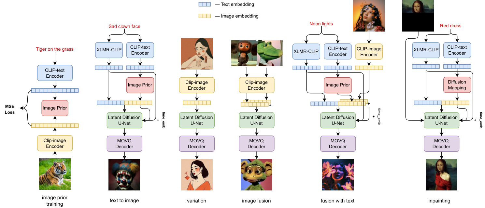

*Figure 1 · [Source](https://arxiv.org/abs/2310.03502)*

### Kandinsky 3

3.0B latent diffusion U-Net built from modified BigGAN-deep residual blocks, conditioned by cross-attention on a frozen 8.6B Flan-UL2 encoder, with a Sber-MoVQGAN decoder.

[Paper](https://arxiv.org/abs/2312.03511) · [GitHub](https://github.com/ai-forever/Kandinsky-3) · [Model card](https://huggingface.co/kandinsky-community/kandinsky-3) · [Details](models/latent-unet.md#kandinsky-3)

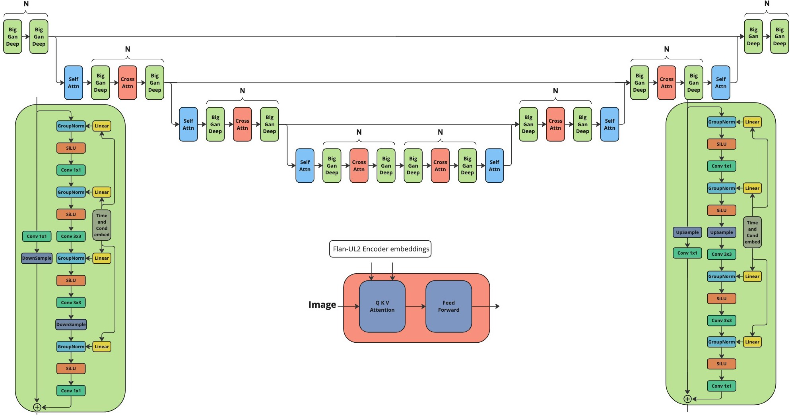

*Figure 2 · [Source](https://arxiv.org/abs/2312.03511)*

### Kandinsky 5.0 Image Lite

Kandinsky 5.0 Image Lite is the text-to-image member of Kandinsky Lab's Kandinsky 5.0 family of foundation models for image and video generation. It is a 6B-parameter CrossDiT -- a diffusion transformer whose blocks alternate self-attention over image tokens with cross-attention to text -- conditioned on Qwen2.5-VL token embeddings (passed through a dedicated linguistic token refiner) together with a pooled CLIP embedding, and it reuses the FLUX.1-dev VAE for image tokenization. The model is trained with flow matching rather than classic denoising diffusion. The same paper also introduces separate video generation models sharing family branding and some architectural ideas, but distinct video-specific components (3D VAE, temporal attention); this catalog entry covers only the image generation model, released with MIT-licensed code and weights.

[Paper](https://arxiv.org/abs/2511.14993) · [GitHub](https://github.com/kandinskylab/kandinsky-5) · [Model card](https://huggingface.co/kandinskylab/Kandinsky-5.0-T2I-Lite) · [Details](models/dit.md#kandinsky-5)

*Figure 10 · [Source](https://arxiv.org/abs/2511.14993)*

### Karlo

Open unCLIP-based model: a prior maps the prompt to a CLIP ViT-L/14 image embedding, a pixel diffusion decoder generates a 64×64 image, and a super-resolution module upsamples it to 256×256.

[GitHub](https://github.com/kakaobrain/karlo) · [Model card](https://huggingface.co/kakaobrain/karlo-v1-alpha) · [Details](models/pixel-diffusion.md#karlo)

*README figure: improved 64→256 super-resolution module · [Source](https://github.com/kakaobrain/karlo)*

### KOALA

KOALA (ETRI and KAIST, 2023) builds smaller SDXL-class text-to-image models that run on 8GB consumer GPUs. On top of BK-SDM-style block removal, it cuts the number of transformer layers in SDXL's lowest-resolution blocks from 10 to 6 (KOALA-1B) or 5 (KOALA-700M, which also drops the mid-block), roughly halving or thirding the U-Net. The paper draws three lessons for distilling such a student: matching the teacher's self-attention features works better than matching only each stage's last feature map, high-resolution images with detailed captions matter more than data volume, and a step-distilled teacher lets the student sample in fewer steps. The released KOALA-Turbo (512px) and KOALA-Lightning (1024px) models are distilled from SDXL-Turbo and SDXL-Lightning on LAION-POP; KOALA-Lightning-700M generates a 1024px image in about 0.66 s at 10 steps on an RTX 4090.

[Paper](https://arxiv.org/abs/2312.04005) · [GitHub](https://github.com/youngwanLEE/sdxl-koala) · [Model card](https://huggingface.co/etri-vilab/koala-lightning-700m) · [Project](https://youngwanlee.github.io/KOALA/) · [Details](models/efficient.md#koala)

*Figure 2 · [Source](https://arxiv.org/abs/2312.04005)*

### Kolors

Kolors is a bilingual (Chinese and English) text-to-image latent diffusion model from Kuaishou's Kolors team. Its technical report keeps the U-Net architecture of SDXL and replaces the CLIP text encoders with ChatGLM3-6B-Base, whose penultimate output conditions the model with prompts of up to 256 tokens. Training data are re-captioned with a multimodal LLM (CogVLM) and mixed half-and-half with original captions, training is split into a concept-learning phase on billions of image-text pairs and a quality-improvement phase on manually graded high-aesthetic data, and high-resolution training extends the noise schedule from 1,000 to 1,100 steps to reach a lower terminal SNR. The report highlights Chinese text rendering and introduces the KolorsPrompts benchmark.

[Paper](https://github.com/Kwai-Kolors/Kolors/blob/master/imgs/Kolors_paper.pdf) · [GitHub](https://github.com/Kwai-Kolors/Kolors) · [Model card](https://huggingface.co/Kwai-Kolors/Kolors) · [Details](models/latent-unet.md#kolors)

*Editorial input/output diagram · [Source](https://github.com/Kwai-Kolors/Kolors)*

### Kolors 2.0

Kolors 2.0 is Kuaishou's closed image generation model, unveiled together with the Kling AI 2.0 video model at the "From Vision to Screen" launch event announced on 2025-04-15. Kuaishou's release says it improves prompt adherence, cinematic visual quality and artistic style expression over its predecessor. It adds controllable image editing on the Kling AI platform, including partial redrawing and expanding and the addition, modification and repair of image content, plus a stylized transcription function that restyles an uploaded image from a style description while keeping its content. Kuaishou gives no architecture details for Kolors 2.0.

[Announcement](https://www.nasdaq.com/press-release/kling-ai-advances-20-era-empowering-everyone-tell-great-stories-ai-2025-04-15) · [Details](models/api.md#kolors-2)

*Editorial input/output diagram · [Source](https://www.nasdaq.com/press-release/kling-ai-advances-20-era-empowering-everyone-tell-great-stories-ai-2025-04-15)*

### Krea 2

Krea 2 is Krea AI's first from-scratch text-to-image foundation model, using a single-stream MMDiT design where text and image tokens share the same attention and feed-forward weights rather than being processed on separate paths. It conditions on Qwen3-VL as a joint vision-language text encoder for richer multilingual understanding, and evaluated both the Qwen-Image and FLUX.2 autoencoders before settling on one for faster convergence. Krea trained the model through a full pipeline of pretraining, mid-training, supervised fine-tuning, preference optimization and reinforcement learning, releasing an undistilled Raw checkpoint and a distilled, few-step Turbo checkpoint under a gated community license, with inference code on GitHub under Apache-2.0.

[Announcement](https://www.krea.ai/blog/krea-2-technical-report) · [GitHub](https://github.com/krea-ai/krea-2) · [Model card 1](https://huggingface.co/krea/Krea-2-Raw) · [Model card 2](https://huggingface.co/krea/Krea-2-Turbo) · [Details](models/dit.md#krea-2)

*Blog — 'Single-stream MMDiT' figure · [Source](https://www.krea.ai/blog/krea-2-technical-report)*

### L-Verse

L-Verse (LG AI Research) pairs an improved image tokenizer, AugVAE, with a single transformer that can translate in both directions between image and text. Segment embeddings tell the model which modality is the given reference and which is the target, so one set of weights performs both text-to-image generation and captioning, evaluated on MS-COCO and Conceptual Captions.

[Paper](https://arxiv.org/abs/2111.11133) · GitHub: no author-linked repository found · [Details](models/ar-token.md#l-verse)

*Figure 2 · [Source](https://arxiv.org/abs/2111.11133)*

### Latent Consistency Models (LCM)

Latent Consistency Models (Tsinghua University, 2023) carry consistency models from pixel space to the latent space of Stable Diffusion. Instead of iterating a sampler for tens of steps, the distilled network directly predicts the endpoint of the guided reverse-diffusion ODE, so a 768×768 image can be generated in two to four steps (or one, at lower quality). Distillation is one-stage: the guidance scale is fed to the student as an extra input, and a skipping-step schedule speeds up training to about 32 A100 GPU hours. A follow-up report, LCM-LoRA, trains the same distillation as LoRA parameters for SD 1.5, SSD-1B and SDXL and uses them as a plug-in accelerator.

[Paper 1](https://arxiv.org/abs/2310.04378) · [Paper 2](https://arxiv.org/abs/2311.05556) · [GitHub](https://github.com/luosiallen/latent-consistency-model) · [Model card 1](https://huggingface.co/SimianLuo/LCM_Dreamshaper_v7) · [Model card 2](https://huggingface.co/latent-consistency/lcm-sdxl) · [Details](models/efficient.md#lcm)

*Editorial input/output diagram · [Source](https://arxiv.org/abs/2310.04378)*

### Latent Diffusion Models (LDM)

Time-conditional U-Net denoiser in the latent space of a pretrained autoencoder, with text injected through cross-attention from a jointly trained transformer encoder.

[Paper](https://arxiv.org/abs/2112.10752) · [GitHub](https://github.com/CompVis/latent-diffusion) · [Details](models/latent-unet.md#ldm)

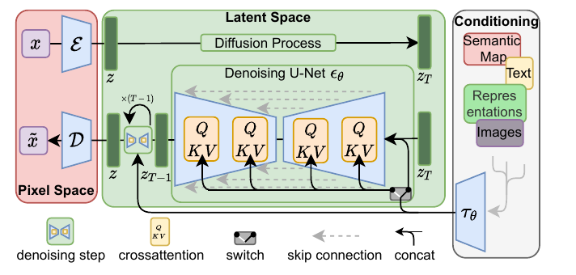

*Figure 3 (PDF p. 4) · [Source](https://arxiv.org/abs/2112.10752)*

### Lavida-O

Lavida-O, from Adobe Research, is a unified masked diffusion model (MDM) that extends prior multimodal MDMs such as MMaDA and Muddit beyond simple low-resolution generation to object grounding, instruction-based image editing and 1024px text-to-image synthesis, all in one framework. It is built on LaViDa, an understanding-only masked diffusion model, and adds image generation through an Elastic Mixture-of-Transformers architecture that keeps the generation branch small and lets text and image tokens interact only in early layers, avoiding the cost of duplicating a full dense model. Lavida-O also introduces planning and iterative self-reflection during generation and editing, letting its own understanding capability critique and refine its outputs. The paper reports state-of-the-art results among masked diffusion models on RefCOCO grounding, GenEval text-to-image generation and ImgEdit editing, beating AR and continuous-diffusion baselines including Qwen2.5-VL and FLUX.1 Kontext-dev with up to 6.8x faster inference.

[Paper](https://arxiv.org/abs/2509.19244) · [GitHub](https://github.com/adobe-research/LaVida-O) · [Model card](https://huggingface.co/jacklishufan/LaViDa-O-v1.0) · [Details](models/unified.md#lavida-o)

*Figure 2 · [Source](https://arxiv.org/abs/2509.19244)*

### LaVIT

LaVIT (Language-VIsion Transformer), from Peking University and Kuaishou Technology, treats images as a foreign language that an LLM can read and write. Its dynamic visual tokenizer passes EVA-CLIP ViT patch features through a token selector that keeps informative patches and a token merger that folds discarded patches into them, then quantizes the retained tokens with a learnable codebook, so the number of visual tokens varies with image content. The LLM is trained with one next image/text token objective, and generated visual tokens are decoded into images by a conditional denoising U-Net. The model handles visual understanding and text-to-image or multimodal-prompt image generation.

[Paper](https://arxiv.org/abs/2309.04669) · [GitHub](https://github.com/jy0205/LaVIT) · [Model card](https://huggingface.co/rain1011/LaVIT-7B-v2) · [Details](models/unified.md#lavit)

*Figure 2 · [Source](https://arxiv.org/abs/2309.04669)*

### LI-DiT

LI-DiT is a 2024 research study on why large language models make poor prompt encoders for diffusion transformers despite their stronger language understanding, and what fixes that. The authors identify two causes: a mismatch between an LLM's training objective and what a diffusion model needs from text features, and a positional bias introduced by the LLM's causal attention mask. They address both with instruction-based prompting and a token-refiner module that restores full (non-causal) attention over the LLM's output before it conditions a DiT-style diffusion transformer through cross-attention. Using frozen LLaMA3-8B and Qwen1.5-7B encoders this way, the 10B-parameter LI-DiT model reportedly outperforms Stable Diffusion 3, DALL-E 3 and Midjourney V6 in the paper's human evaluation, though no code or weights were released.

[Paper](https://arxiv.org/abs/2406.11831) · [Details](models/dit.md#li-dit)

*Figure 5 · [Source](https://arxiv.org/abs/2406.11831)*

### Liquid

Liquid, from ByteDance, HUST and HKU, argues that visual understanding and generation can be added to an LLM without special vision components by simply extending the vocabulary with image codes. Text is BPE-tokenized and images are converted into discrete tokens by a VQVAE image tokenizer; both token streams share one vocabulary that an otherwise-unmodified autoregressive LLM predicts next-token by next-token, so text-to-image generation, image understanding and text generation are all the same task for the model, and existing LLM scaling behavior is shown to transfer to visual generation.

[Paper](https://arxiv.org/abs/2412.04332) · [GitHub](https://github.com/FoundationVision/Liquid) · [Model card](https://huggingface.co/Junfeng5/Liquid_V1_7B) · [Details](models/unified.md#liquid)

*Figure 2 · [Source](https://arxiv.org/abs/2412.04332)*

### LLaDA2.0-Uni

LLaDA2.0-Uni, from Ant Group's inclusionAI, is a unified masked discrete-diffusion language model (dLLM) for multimodal understanding, text-to-image generation and image editing. It argues prior unified masked-diffusion models (MMaDA, Lumina-DiMOO) lag behind AR-based unified models because their reconstruction-focused VQ tokenizers lack semantic richness and over-compress images; LLaDA2.0-Uni instead introduces SigLIP-VQ, a fully semantic discrete tokenizer, so that both text and images can be optimized under one shared block-wise masked diffusion objective inside a 16B MoE dLLM backbone (LLaDA2.0-mini). A dedicated diffusion decoder, optimized through distillation to run in just 8 inference steps, turns the backbone's predicted semantic image tokens into high-fidelity pixels. The paper reports understanding performance competitive with specialized VLMs like Qwen2.5-VL, strong text-to-image generation, flexible single/multi-reference image editing, and native support for interleaved generation and reasoning.

[Paper](https://arxiv.org/abs/2604.20796) · [GitHub](https://github.com/inclusionAI/LLaDA2.0-Uni) · [Model card](https://huggingface.co/inclusionAI/LLaDA2.0-Uni) · [Details](models/unified.md#llada2-uni)

*Figure 4 · [Source](https://arxiv.org/abs/2604.20796)*

### LlamaGen

LlamaGen (HKU and ByteDance, 2024) shows that a standard Llama-architecture transformer, without any image-specific architectural changes, can do competitive text-to-image generation as next-token prediction over discrete VQGAN tokens. The authors study image tokenizer design, model scaling from 100M to 3.1B parameters, and training-data quality, and release two 775M-parameter text-conditional checkpoints trained in two stages on web and high-aesthetic data.

[Paper](https://arxiv.org/abs/2406.06525) · [GitHub](https://github.com/FoundationVision/LlamaGen) · [Model card](https://huggingface.co/FoundationVision/LlamaGen) · [Details](models/ar-token.md#llamagen)

*Editorial input/output diagram · [Source](https://arxiv.org/abs/2406.06525)*

### LongCat-Image

LongCat-Image is Meituan's open 6B-parameter text-to-image diffusion transformer, following the FLUX-style pattern of a smaller number of double-stream blocks (where text and image tokens are processed on separate paths joined by attention) feeding into a larger number of single-stream blocks that process both modalities together. It replaces the usual CLIP/T5 combination with a single Qwen2.5-VL-7B vision-language model as text encoder and handles in-image text rendering through simple character-level tokenization of quoted text rather than a dedicated glyph module. Its VAE is derived from FLUX.1-dev's with an added token-merging step for efficiency. A companion LongCat-Image-Edit model reuses the same backbone with reference-image conditioning for instruction-based editing. Both the technical report and open weights were released under Apache-2.0.

[Paper](https://arxiv.org/abs/2512.07584) · [GitHub](https://github.com/meituan-longcat/LongCat-Image) · [Model card](https://huggingface.co/meituan-longcat/LongCat-Image) · [Details](models/dit.md#longcat-image)

*Figure 12 · [Source](https://arxiv.org/abs/2512.07584)*

### LongCat-Next

LongCat-Next, from Meituan's LongCat team, is a native multimodal foundation model built under a proposed Discrete Native Autoregression (DiNA) paradigm: rather than mixing autoregressive text prediction with a separate diffusion or continuous-embedding generator, every modality (text, vision, audio) is represented as discrete tokens in one shared vocabulary, and one modality-agnostic MoE decoder-only backbone (LongCat-Flash) predicts them all next-token-style. Its key vision component, dNaViT, is a paired tokenizer/de-tokenizer that converts images to and from hierarchical discrete tokens at arbitrary resolution using semantic-and-aligned encoders plus residual vector quantization, with up to 28x compression while preserving both semantics (for understanding) and reconstructable detail (for generation). The paper reports LongCat-Next surpassing existing unified frameworks such as Qwen3-Omni, beating specialized understanding models like Qwen3VL-A3B, and competing with FLUX.1-dev on high-fidelity text-to-image generation, particularly text rendering, plus RL post-training for image generation quality.

[Paper](https://arxiv.org/abs/2603.27538) · [GitHub](https://github.com/meituan-longcat/LongCat-Next) · [Model card](https://huggingface.co/meituan-longcat/LongCat-Next) · [Details](models/unified.md#longcat-next)

*Figure 2 · [Source](https://arxiv.org/abs/2603.27538)*

### Luma Uni-1

Uni-1 is Luma AI's first unified understanding and generation model, offered for image generation and editing in the Luma app. Luma says unified models represent different modalities in one interleaved sequence, and its Uni-1.1 API announcement (2026-05-05) describes the model as a decoder-only autoregressive transformer in which text and image tokens share a single sequence for both input and output. The documented interface covers text-to-image generation, up to nine reference images to preserve identity, composition or style, and natural-language editing such as background swaps, lighting changes and localized edits, plus control of camera angle, lighting and composition. The Uni-1.1 API offers Uni-1.1 and Uni-1.1 Max. No technical report has been published.

[Project](https://lumalabs.ai/uni-1) · [Announcement](https://lumalabs.ai/news/uni-1-1-api) · [Details](models/api.md#luma-uni-1)

*Editorial input/output diagram · [Source](https://lumalabs.ai/uni-1)*

### Lumina-DiMOO

Lumina-DiMOO, from the Lumina/Alpha-VLLM team, is an open unified model that uses fully discrete diffusion rather than autoregression or hybrid AR-diffusion for both text and image tokens. Starting from the pretrained LLaDA-Base diffusion LLM, it extends the vocabulary with discrete image tokens from an aMUSEd-VQ tokenizer and trains a single masked-token denoising objective shared across modalities, which the paper reports yields much faster sampling (32x over the autoregressive Lumina-mGPT 2.0, plus a further 2x from a training-free Max-Logit Cache) than prior unified paradigms. It supports text-to-image generation at arbitrary and high resolution and a range of image-to-image tasks (editing, inpainting, subject-driven and controllable generation, style transfer) alongside image understanding, and reports first place on the open-source UniGenBench leaderboard at the time of the report.

[Paper](https://arxiv.org/abs/2510.06308) · [GitHub](https://github.com/Alpha-VLLM/Lumina-DiMOO) · [Model card](https://huggingface.co/Alpha-VLLM/Lumina-DiMOO) · [Details](models/unified.md#lumina-dimoo)

*Figure 3 · [Source](https://arxiv.org/abs/2510.06308)*

### Lumina-Image 2.0

Lumina-Image 2.0 is Alpha-VLLM's follow-up to the Lumina-Next diffusion transformer, redesigning how text and image tokens interact. Instead of cross-attention or the two-stream joint-attention blocks used by Stable Diffusion 3 and FLUX, it concatenates Gemma2-encoded text tokens and noised image tokens into a single sequence and lets one set of self-attention layers ('Unified Next-DiT') attend across both, which the authors argue improves text-image interaction and simplifies extending the model to new tasks. Training data quality comes from a purpose-built captioning pipeline (UniCap) that fine-tunes vision-language models to produce detailed, multi-granularity, bilingual captions rather than relying on off-the-shelf alt text. The 2.6B-parameter model and code were released under Apache-2.0.

[Paper](https://arxiv.org/abs/2503.21758) · [GitHub](https://github.com/Alpha-VLLM/Lumina-Image-2.0) · [Model card](https://huggingface.co/Alpha-VLLM/Lumina-Image-2.0) · [Details](models/dit.md#lumina-image-2)

*Figure 2 · [Source](https://arxiv.org/abs/2503.21758)*

### Lumina-mGPT

Lumina-mGPT (Shanghai AI Laboratory and collaborators, 2024) turns Meta's Chameleon multimodal transformer into a dedicated photorealistic text-to-image generator by continuing its autoregressive pretraining and adding resolution-control prompt designs, rather than training a new architecture from scratch. A single 7B decoder-only model handles flexible-resolution text-to-image generation alongside other tasks such as controllable and subject-driven generation.

[Paper](https://arxiv.org/abs/2408.02657) · [GitHub](https://github.com/Alpha-VLLM/Lumina-mGPT) · [Model card](https://huggingface.co/Alpha-VLLM/Lumina-mGPT-7B-768) · [Details](models/ar-token.md#lumina-mgpt)

*Editorial input/output diagram · [Source](https://arxiv.org/abs/2408.02657)*

### Lumina-mGPT 2.0

Lumina-mGPT 2.0 (Shanghai AI Laboratory and collaborators, 2025) rebuilds Lumina-mGPT as a stand-alone autoregressive image model trained from scratch, rather than fine-tuned from Chameleon, unifying text-to-image generation, subject-driven generation, multi-turn image editing, controllable generation and dense prediction in a single decoder-only transformer conditioned through system prompts and an SBER-MoVQGAN tokenizer.

[Paper](https://arxiv.org/abs/2507.17801) · [GitHub](https://github.com/Alpha-VLLM/Lumina-mGPT-2.0) · [Model card](https://huggingface.co/Alpha-VLLM/Lumina-mGPT-2.0) · [Details](models/ar-token.md#lumina-mgpt-2)

*Figure 2 · [Source](https://arxiv.org/abs/2507.17801)*

### Lumina-Next

Lumina-Next is the successor to Lumina-T2X from Shanghai AI Laboratory's Alpha-VLLM team. It replaces the Flag-DiT backbone with Next-DiT, which uses 3D rotary position embeddings instead of explicit line-break tokens, sandwich normalization to keep activations stable, and grouped-query attention for efficiency. Paired with the small Gemma-2B language model as text encoder, the 2B Next-DiT is reported to beat the earlier 5B Lumina-T2I at lower cost, and new RoPE scaling rules, sampling schedules and token pooling let it extrapolate to 2K resolution and sample in few steps without retraining.

[Paper](https://arxiv.org/abs/2406.18583) · [GitHub](https://github.com/Alpha-VLLM/Lumina-T2X) · [Model card](https://huggingface.co/Alpha-VLLM/Lumina-Next-SFT) · [Details](models/dit.md#lumina-next)

*Figure 2 · [Source](https://arxiv.org/abs/2406.18583)*

### Lumina-T2X (Lumina-T2I)

Lumina-T2X is a framework from Shanghai AI Laboratory's Alpha-VLLM team for generating images, video, multi-view images and audio with one flow-based diffusion transformer design, Flag-DiT. Its text-to-image instance, Lumina-T2I, scales a DiT to 5B parameters with LLM-style stabilizers (RMSNorm, key-query normalization, rotary embeddings), trains it with flow matching, and conditions it on a large language model through gated, zero-initialized attention. Encoding images as token sequences with explicit line-break tokens lets the model generate at aspect ratios and resolutions beyond those seen in training.

[Paper](https://arxiv.org/abs/2405.05945) · [GitHub](https://github.com/Alpha-VLLM/Lumina-T2X) · [Model card](https://huggingface.co/Alpha-VLLM/Lumina-T2I) · [Details](models/dit.md#lumina-t2x)

*Figure 3 · [Source](https://arxiv.org/abs/2405.05945)*

### LWM

LWM (Large World Model), from UC Berkeley, is a general-purpose autoregressive transformer trained on long video-and-language sequences to build a 'world model' with up to a 1M-token context. Every modality is discretized to a shared vocabulary: text uses a BPE tokenizer and each video frame (or standalone image) is tokenized into 256 discrete tokens by a VQGAN, so the same next-token-prediction transformer can answer long-document and long-video questions, and, run in the other direction, generate images and videos from text prompts.

[Paper](https://arxiv.org/abs/2402.08268) · [GitHub](https://github.com/LargeWorldModel/LWM) · [Details](models/unified.md#lwm)

*Figure 3 · [Source](https://arxiv.org/abs/2402.08268)*

### M6

M6 (Alibaba and Tsinghua, 2021) is a large Chinese multimodal pretrained model scaled to 10 and 100 billion parameters. Beyond understanding and captioning tasks, the authors fine-tune it for text-guided image generation by teaching it to emit discrete image codes after a text prompt, demonstrating e-commerce product images and clip art generated from Chinese product titles.

[Paper](https://arxiv.org/abs/2103.00823) · GitHub: no author-linked repository found · [Details](models/ar-token.md#m6)

*Figure 3 · [Source](https://arxiv.org/abs/2103.00823)*

### M6-UFC

M6-UFC (Alibaba and Tsinghua, 2021) unifies text-to-image generation with image-conditioned controllable synthesis by putting textual, visual and preservation control signals into one token sequence for a single bidirectional transformer, then decoding the target image tokens with an iterative non-autoregressive procedure (PNAG) that refines only the least confident tokens at each step, rather than a fixed left-to-right order.

[Paper](https://arxiv.org/abs/2105.14211) · GitHub: no author-linked repository found · [Details](models/masked.md#m6-ufc)

*Figure 2 · [Source](https://arxiv.org/abs/2105.14211)*

### Mage-Flow

Mage-Flow is a Microsoft text-to-image and editing foundation model built around two efficiency-focused components: Mage-VAE, a lightweight pixel-diffusion autoencoder distilled to reproduce the FLUX.2-VAE latent space at a fraction of its compute cost, and a native-resolution MMDiT that packs variable-length text and image token sequences from different-sized images into one batch rather than forcing a fixed resolution bucket. Text (and, for editing, reference images) are encoded by Qwen3-VL-4B-Instruct, and the 4B-parameter transformer is trained with rectified flow matching. The family ships a standard Base checkpoint, an RL-aligned variant post-trained for prompt following and aesthetics, and a 4-step distilled Turbo variant for fast inference. The model card is gated behind Hugging Face authentication and no public code repository was found, so this catalog could not verify its license.

[Paper](https://arxiv.org/abs/2607.19064) · [Details](models/dit.md#mage-flow)

*Figure 5 · [Source](https://arxiv.org/abs/2607.19064)*

### MAI-Image

MAI-Image is Microsoft AI's in-house image model line. MAI-Image-1, announced on 2025-10-13 as Microsoft's first image generation model developed entirely in-house, targeted photorealistic scenes and fast iteration and shipped in Bing Image Creator and Copilot. MAI-Image-2 (March 2026) emphasized text rendering for infographics, slides and diagrams, and photorealism, with API access through Microsoft Foundry; MAI-Image-2-Efficient (April 2026) is a faster, cheaper variant. MAI-Image-2.5 (June 2026) added precise localized editing of images with text and reference-image inputs, and MAI-Image-2.6 with a Flash variant (September 2026) added multi-reference editing, web grounding and higher resolutions. Microsoft publishes no architecture for these models.

[Announcement 1](https://microsoft.ai/news/introducing-mai-image-1-debuting-in-the-top-10-on-lmarena/) · [Announcement 2](https://microsoft.ai/news/introducing-mai-image-2/) · [Announcement 3](https://microsoft.ai/news/mai-image-2-efficient/) · [Announcement 4](https://microsoft.ai/news/introducing-mai-image-2-5/) · [Announcement 5](https://microsoft.ai/news/pushing-the-quality-cost-frontier-with-mai-image-2-6/) · [Details](models/api.md#mai-image)

*Editorial input/output diagram · [Source](https://microsoft.ai/news/introducing-mai-image-2/)*

### Make-A-Scene

Make-A-Scene (Meta AI, ECCV 2022) extends DALL·E-style autoregressive text-to-image transformers with an optional scene layout: a token sequence for a segmentation map can be interleaved between the text and image tokens, giving users explicit control over object placement and shape while still allowing pure text-to-image generation when no layout is supplied. The paper also introduces a face-aware token-space loss and a classifier-free-style domain adaptation step to improve generated faces and photorealism.

[Paper](https://arxiv.org/abs/2203.13131) · GitHub: no author-linked repository found · [Details](models/ar-token.md#make-a-scene)

*Figure 6 · [Source](https://arxiv.org/abs/2203.13131)*

### MammothModa2

MammothModa2 (Mammoth2), from ByteDance, is a unified autoregressive-diffusion (AR-Diffusion) model that couples an AR pathway for semantic planning with a diffusion decoder for high-fidelity pixel synthesis, aiming to combine AR's instruction-following strength with diffusion's texture quality. Built on the Qwen3-VL-8B vision-language backbone, it adds dedicated MoE-style generation experts (hard-routed, only in deeper layers) that model discrete visual tokens from a new tokenizer, MammothTok, without disturbing the original understanding experts. An AR-Diffusion feature alignment module aggregates multi-layer AR hidden states and injects them as in-context conditioning into a single-stream DiT. Trained end-to-end with joint next-token-prediction and flow-matching objectives, then supervised fine-tuning and DiffusionNFT reinforcement learning on both generation and editing, Mammoth2 reports 0.87 on GenEval, 87.2 on DPGBench and 4.06 on ImgEdit using about 60M supervised generation samples and no pretrained generator.

[Paper](https://arxiv.org/abs/2511.18262) · [GitHub](https://github.com/bytedance/mammothmoda) · [Model card](https://huggingface.co/bytedance-research/MammothModa) · [Details](models/unified.md#mammothmoda2)

*Figure 2 · [Source](https://arxiv.org/abs/2511.18262)*

### Manzano

Manzano is Apple's unified multimodal model, designed to reduce the understanding/generation trade-off common in unified LLMs by using a hybrid image tokenizer rather than two unrelated tokenizers. A single ViT vision encoder feeds a continuous adapter (for image-to-text understanding) and a discrete FSQ adapter (for text-to-image generation), so both representations share a common semantic space instead of mixing a high-level semantic tokenizer with a low-level spatial VQ tokenizer. The unified autoregressive LLM decoder predicts high-level text and image tokens with a single next-token objective, and a separately scaled DiT-Air diffusion decoder renders the generated image tokens into pixels. The paper reports state-of-the-art results among unified models, particularly on text-rich understanding benchmarks, minimal task conflict between understanding and generation, and consistent gains when scaling the LLM decoder from 300M to 30B and the diffusion decoder up to 3.52B.

[Paper](https://arxiv.org/abs/2509.16197) · [Details](models/unified.md#manzano)

*Figure 3 · [Source](https://arxiv.org/abs/2509.16197)*

### MARS

MARS (2024) adds text-to-image generation to a frozen large language model (Qwen-7B) by inserting a Semantic Vision-Language Integration Expert, a mixture-of-experts layer that gives visual tokens their own attention and feed-forward pathways while leaving the original text experts untouched, so the model keeps the LLM's language ability while learning to autoregressively generate VQGAN image tokens. Trained bilingually on Chinese and English captions, the authors report competitive MS-COCO FID at a fraction of Stable Diffusion 1.5's training cost.

[Paper](https://arxiv.org/abs/2407.07614) · GitHub: no author-linked repository found · [Details](models/ar-token.md#mars-t2i)

*Figure 3 · [Source](https://arxiv.org/abs/2407.07614)*

### Matryoshka Diffusion Models

Single end-to-end pixel-space diffusion model that jointly denoises several resolutions with a NestedUNet, in which lower-resolution UNets are nested inside higher-resolution ones and share features and parameters.

[Paper](https://arxiv.org/abs/2310.15111) · [GitHub](https://github.com/apple-aiml-research/ml-mdm) · [Details](models/pixel-diffusion.md#matryoshka-diffusion)

*Figure 3 · [Source](https://arxiv.org/abs/2310.15111)*

### Meissonic

Meissonic (2024) revisits masked generative transformers (in the style of MUSE) as an efficient path to high-resolution text-to-image generation, combining MM-DiT-style multi-modal/single-modal transformer blocks, rotary position embeddings and feature compression to generate 1024px images from a 1B-parameter model trained with under 50 H100 GPU-days, positioning masked-token prediction as a lower-cost alternative to diffusion transformers at comparable resolution.

[Paper](https://arxiv.org/abs/2410.08261) · [GitHub](https://github.com/viiika/Meissonic) · [Model card](https://huggingface.co/MeissonFlow/Meissonic) · [Details](models/masked.md#meissonic)

*Figure 2 · [Source](https://arxiv.org/abs/2410.08261)*

### MetaMorph

MetaMorph, from FAIR Meta AI, NYU and Meta Reality Labs, shows that a pretrained LLM can gain image-generation ability mainly through instruction tuning rather than a heavily redesigned architecture. Visual-Predictive Instruction Tuning (VPiT) finetunes the LLM to autoregressively output a mix of text tokens and continuous visual tokens from unified vision-language instruction data; at inference, an adapted diffusion model (originally pretrained separately) decodes the predicted visual tokens into a final image, so the LLM's own semantic knowledge and reasoning transfer into what it generates.

[Paper](https://arxiv.org/abs/2412.14164) · [GitHub](https://github.com/facebookresearch/metamorph) · [Details](models/unified.md#metamorph)

*Figure 1 · [Source](https://arxiv.org/abs/2412.14164)*

### MetaQuery

MetaQuery, from Meta and New York University, turns an understanding-only multimodal LLM into a unified model by appending a set of learnable queries whose output states condition a text-to-image diffusion decoder. The MLLM stays frozen, so its understanding performance is preserved, and training needs only image-caption pairs and the standard diffusion objective; the paper trains Base, Large and X-Large models on LLaVA-OneVision 0.5B and Qwen2.5-VL 3B and 7B backbones. It reports text-to-image results on GenEval, DPG-Bench and MJHQ, knowledge- and reasoning-augmented generation, image reconstruction, and, after brief fine-tuning or instruction tuning on 2.4M naturally occurring image pairs, image editing and subject-driven generation.

[Paper](https://arxiv.org/abs/2504.06256) · [GitHub](https://github.com/facebookresearch/metaquery) · [Details](models/unified.md#metaquery)

*Figure 1 · [Source](https://arxiv.org/abs/2504.06256)*

### Midjourney

Midjourney is a closed text-to-image service offered through its web app and Discord. The developer publishes version announcements and usage documentation but no model architecture, so this card records only the documented interface. Prompts can be combined with image prompts, style references, moodboards, personalization and, for V7, Omni-Reference images. V7 (alpha April 2025) added a fast, cheaper Draft Mode and became the default in June 2025. V8 (alpha March 2026) added a native 2K `--hd` mode and better text rendering, V8.1 became the default in June 2026, and a V8.2 edit model (August 2026) edits uploaded images from text instructions, including inpainting and outpainting.

[Announcement 1](https://updates.midjourney.com/v7-alpha/) · [Announcement 2](https://updates.midjourney.com/omni-reference-oref/) · [Announcement 3](https://updates.midjourney.com/v7-is-now-the-default-model/) · [Announcement 4](https://updates.midjourney.com/v8-alpha/) · [Announcement 5](https://updates.midjourney.com/v8-1-is-now-the-default-model/) · [Announcement 6](https://updates.midjourney.com/edit-model-for-v8/) · [Details](models/api.md#midjourney)

*Editorial input/output diagram · [Source](https://updates.midjourney.com/v8-alpha/)*

### Ming-Omni

Ming-Omni, from Ant Group's inclusionAI, is a unified model that perceives images, text, audio and video and generates text, speech and images from one framework, which the authors describe as the first open-source model to match GPT-4o's modality coverage. Its language backbone, Ling, is a MoE architecture with dedicated per-modality routers (text, vision, audio) that resolve representational and convergence-rate conflicts between modalities during joint pretraining. Image and speech generation are added afterward: an audio decoder (following CosyVoice, with BPE-compressed audio tokens) produces speech, and Ming-Lite-Uni's lightweight bridging framework produces images while keeping the perception MLLM frozen. The paper reports a GenEval score of 0.64 and FID of 4.85 for image generation, and demonstrates instruction-based text-to-image generation, editing and style transfer.

[Paper](https://arxiv.org/abs/2506.09344) · [GitHub](https://github.com/inclusionAI/Ming) · [Model card](https://huggingface.co/inclusionAI/Ming-Lite-Omni) · [Details](models/unified.md#ming-omni)

*Figure 2 · [Source](https://arxiv.org/abs/2506.09344)*

### Ming-UniVision

Ming-UniVision, from Ant Group's inclusionAI, builds a unified multimodal model (Ming-UniVision-16B-A3B, a 16B-parameter MoE LLM with 3B active) around MingTok, a new continuous visual tokenizer meant to close the gap between representations tuned for understanding and for generation. Because MingTok produces one visual latent space usable for both image-to-text and text-to-image tasks, the paper casts image understanding and image synthesis in the same next-token-prediction paradigm, letting a single autoregressive model switch between understanding, generation and multi-round in-context editing without separate tokenizers or dual-branch AR-diffusion designs. The paper reports over 3.5x faster text-to-image generation than an SD-VAE-based baseline and up to 66% fewer input visual tokens than comparable unified architectures, plus qualitative multi-step editing and a "visualized chain-of-thought" generation mode.

[Paper](https://arxiv.org/abs/2510.06590) · [GitHub](https://github.com/inclusionAI/Ming-UniVision) · [Model card](https://huggingface.co/inclusionAI/Ming-UniVision-16B-A3B) · [Details](models/unified.md#ming-univision)

*Figure 3 (PDF p. 7) · [Source](https://arxiv.org/abs/2510.06590)*

### MiniMax Image-01

Image-01 is MiniMax's first text-to-image model, launched on its API platform on 2025-02-28. MiniMax says it draws on prompt-adherence know-how from its Hailuo video models and supports several aspect ratios with up to nine images per request. The API documents a text-to-image endpoint with optional prompt optimization, custom sizes from 512 to 2048 pixels and seeds, and an image-to-image endpoint in which a character (portrait) reference image guides generation, available for `image-01` and `image-01-live`. No architecture is published.

[Announcement](https://www.minimax.io/news/image-01) · [Docs 1](https://platform.minimax.io/docs/api-reference/image-generation-t2i) · [Docs 2](https://platform.minimax.io/docs/api-reference/image-generation-i2i) · [Details](models/api.md#minimax-image-01)

*Editorial input/output diagram · [Source](https://www.minimax.io/news/image-01)*

### MirrorGAN

Three-stage cascaded attentional GAN with global (sentence) and local (word) attention, plus a pretrained image-captioning module that redescribes the generated image for a text-reconstruction loss.

[Paper](https://arxiv.org/abs/1903.05854) · [GitHub](https://github.com/qiaott/MirrorGAN) · [Details](models/gan.md#mirrorgan)

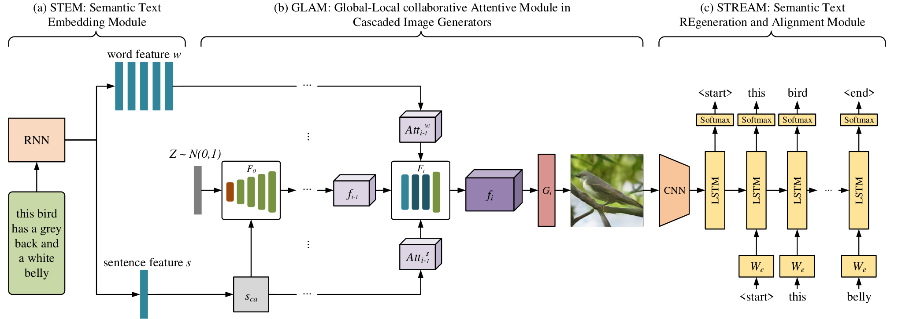

*Figure 2 · [Source](https://arxiv.org/abs/1903.05854)*

### MM-Interleaved

MM-Interleaved, from OpenGVLab (Shanghai AI Laboratory) with CUHK, Tsinghua, SenseTime and others, is an end-to-end generative model for interleaved image-text data. Each image enters the LLM as a small number of Perceiver-Resampler tokens; to recover details lost by this compression, a Multi-Modal Feature Synchronizer (MMFS) based on deformable sparse attention lets intermediate LLM layers and the diffusion decoder's U-Net attend directly to multi-scale feature maps of all previous images. When the LLM emits a begin-of-image token, its output features, resampled to 77 condition tokens, drive a diffusion model that generates the next image. The model covers captioning, visual question answering, text-to-image generation, segmentation-to-image translation and visual storytelling.

[Paper](https://arxiv.org/abs/2401.10208) · [GitHub](https://github.com/OpenGVLab/MM-Interleaved) · [Details](models/unified.md#mm-interleaved)

*Figure 4 · [Source](https://arxiv.org/abs/2401.10208)*

### MMaDA

MMaDA (Multimodal Large Diffusion Language Model), from the Gen-Verse team, unifies textual reasoning, multimodal understanding and text-to-image generation in one discrete-diffusion foundation model rather than pairing an autoregressive language model with a separate diffusion generator. Where prior unified models (Show-o, Transfusion) keep autoregressive text modeling and diffusion-based vision modeling as distinct branches, MMaDA applies the same masked discrete-diffusion formulation and architecture to both text and image tokens. Training follows pretraining, a mixed long chain-of-thought finetuning stage that aligns reasoning formats across text and image tasks, and UniGRPO, a policy-gradient RL algorithm adapted to diffusion models with diversified rewards. The paper reports MMaDA-8B beating LLaMA-3-7B and Qwen2-7B on textual reasoning, Show-o and SEED-X on multimodal understanding, and SDXL and Janus on text-to-image generation.

[Paper](https://arxiv.org/abs/2505.15809) · [GitHub](https://github.com/Gen-Verse/MMaDA) · [Model card](https://huggingface.co/Gen-Verse/MMaDA-8B-MixCoT) · [Details](models/unified.md#mmada)

*Figure 2 · [Source](https://arxiv.org/abs/2505.15809)*

### Mobile-O

Mobile-O (MBZUAI with CMU and Linköping University, 2026) is a unified multimodal understanding and image-generation model small enough, about 1.6B parameters in total, to run fully on a phone. Instead of the learnable query tokens used by larger unified models, its Mobile Conditioning Projector (about 2.4M parameters) takes a learned, temperature-weighted fusion of the VLM's final layers, compresses and refines it with depthwise-separable 1D convolutions and channel attention, and feeds it to every cross-attention layer of the SANA diffusion decoder. Training proceeds in three stages: alignment pre-training of the DiT and projector on about 9M text-image pairs with the VLM frozen, supervised fine-tuning on about 105K curated pairs, and a unified post-training stage on quadruplets (generation prompt, image, question, answer) that improves understanding and generation together. The paper reports 0.74 on GenEval and about 3 seconds per 512×512 image on an iPhone.

[Paper](https://arxiv.org/abs/2602.20161) · [GitHub](https://github.com/Amshaker/Mobile-O) · [Model card](https://huggingface.co/Amshaker/Mobile-O-0.5B) · [Details](models/efficient.md#mobile-o)

*Figure 2 · [Source](https://arxiv.org/abs/2602.20161)*

### MobileDiffusion

MobileDiffusion (Google, 2023) is a text-to-image diffusion model designed from scratch for phones, reaching about 0.2 seconds for a 512×512 image on an iPhone 15 Pro. Its UNet was found through a systematic study that moves transformer blocks to the low-resolution bottleneck, removes self-attention at higher resolutions, replaces most convolutions with separable ones and prunes the VAE decoder, arriving at about 400M parameters. The model is first trained as an ordinary latent diffusion model and then adversarially fine-tuned with UFOGen's diffusion-GAN objective so that it generates in one step while staying compatible with plugins, LoRA fine-tuning and inpainting built on the base model.

[Paper](https://arxiv.org/abs/2311.16567) · GitHub: no author-linked repository found · [Details](models/efficient.md#mobilediffusion)

*Figure 2 (PDF p. 5) · [Source](https://arxiv.org/abs/2311.16567)*

### Mogao

Mogao is a ByteDance Seed unified model aimed at interleaved multimodal generation: it can read and write arbitrary sequences of text and images causally, combining autoregressive text generation with diffusion-based image synthesis in one transformer. Its design adds a deep-fusion (MMDiT-inspired) block structure, dual visual encoders that give conditioning images both ViT and VAE representations, an interleaved 3D rotary position embedding, and multimodal classifier-free guidance. The paper reports multimodal understanding and text-to-image results, interleaved generation, and qualitative zero-shot image editing without editing-specific training data.

[Paper](https://arxiv.org/abs/2505.05472) · GitHub: no author-linked repository found · [Details](models/unified.md#mogao)

*Figure 3 · [Source](https://arxiv.org/abs/2505.05472)*

### MonoFormer

MonoFormer, from a group at Zhejiang University and Alibaba, uses a single transformer for both text-to-text autoregression and text-to-image diffusion, switching only the attention mask and training objective per modality rather than training two separate networks. A pretrained LLM initializes the shared backbone so it retains language understanding, and the same weights are trained with a causal mask and next-token loss on text and a bidirectional mask and denoising loss on noised image latents, achieving image generation quality comparable to dedicated diffusion models while keeping text generation ability.

[Paper](https://arxiv.org/abs/2409.16280) · [GitHub](https://github.com/MonoFormer/MonoFormer) · [Details](models/unified.md#monoformer)

*Figure 1 (PDF p. 2) · [Source](https://arxiv.org/abs/2409.16280)*

### Muse

Muse (Google Research, 2023) generates images by masked-token modeling rather than diffusion or autoregression: a transformer conditioned on a frozen T5-XXL text encoder predicts discrete VQGAN tokens for all masked positions in parallel, refining the image over a handful of steps, and a second masked transformer upsamples the result in token space. The authors report faster inference than comparable diffusion or autoregressive models at similar quality, but did not release code, weights or a public demo.

[Paper](https://arxiv.org/abs/2301.00704) · GitHub: no author-linked repository found · [Details](models/masked.md#muse)

*Figure 3 · [Source](https://arxiv.org/abs/2301.00704)*

### Muse Image

Muse Image is the image generation model from Meta Superintelligence Labs, announced on 2026-07-07 together with the separate Muse Video model and deployed in Meta AI. Meta says it follows instructions faithfully, edits images precisely by changing only what the user asks for, and composes people, objects, clothing, styles and environments from many reference images. Meta also describes agentic behaviour: the model learns to write and execute code for accurate plots and QR codes, to search the web to ground images in factual and real-time information, and to reflect on and refine its work within its chain of thought. It is available in the Meta AI app and website, Instagram Stories in the US and WhatsApp in some countries; no API or technical report is announced.

[Announcement 1](https://ai.meta.com/blog/introducing-muse-image-muse-video-msl/) · [Announcement 2](https://about.fb.com/news/2026/07/introducing-muse-image-meta-ai/) · [Details](models/api.md#muse-image)

*Editorial input/output diagram · [Source](https://ai.meta.com/blog/introducing-muse-image-muse-video-msl/)*

### NExT-GPT

NExT-GPT, from NUS's NExT++ Research Center, is an any-to-any multimodal LLM that perceives and generates text, images, video and audio by wrapping a frozen LLM with lightweight, trainable alignment layers on both sides, so only a small fraction of parameters is trained. Frozen modality-specific encoders and input projections align each input modality into the LLM's semantic space; on the output side, trainable output projections turn the LLM's hidden states into conditioning signals for frozen, pretrained diffusion decoders (a Stable-Diffusion-based image decoder among them), so text-to-image generation and other modality conversions are produced through these off-the-shelf decoders rather than a decoder trained from scratch.

[Paper](https://arxiv.org/abs/2309.05519) · [GitHub](https://github.com/NExT-GPT/NExT-GPT) · [Details](models/unified.md#next-gpt)

*Figure 1 · [Source](https://arxiv.org/abs/2309.05519)*

### NextFlow

NextFlow, from ByteDance, is a unified decoder-only autoregressive transformer trained on 6 trillion interleaved text-image tokens that activates multimodal understanding, text-to-image generation and instruction-based editing in one model. Its central design choice is to keep next-token prediction for text but replace raster-scan next-token image generation with next-scale prediction (coarse-to-fine, VAR-style), which the paper reports generates 1024x1024 images in about 5 seconds and with 6x fewer FLOPs than MMDiT-based diffusion models at that resolution. A dual-codebook tokenizer decouples semantic and pixel-level visual features to keep both conceptual alignment and fine detail. The paper introduces a scale-reweighting training objective and self-correction with residual features to stabilize next-scale training at 6T-token scale, plus a prefix-tuning GRPO strategy that focuses reinforcement learning on coarse-scale prefixes. NextFlow reports state-of-the-art results among unified models, rivaling specialized diffusion models on DPG (88.32) and setting a new state of the art on the authors' own EditCanvas editing benchmark (ImgEdit 4.49).

[Paper](https://arxiv.org/abs/2601.02204) · [GitHub](https://github.com/ByteVisionLab/NextFlow) · [Details](models/unified.md#nextflow)

*Figure 1 (PDF p. 1) · [Source](https://arxiv.org/abs/2601.02204)*

### NextStep-1

NextStep-1 (StepFun) applies plain next-token prediction to a sequence of discrete text tokens followed by continuous image tokens, without vector quantization and without a large diffusion decoder. A 14B causal transformer, initialized from Qwen2.5-14B and using standard 1D RoPE, reads the prompt and previously generated image patches; its hidden state conditions a small MLP flow-matching head that turns noise into the next image patch. Images come from a tokenizer fine-tuned from the FLUX.1-dev VAE, whose 16-channel latents are channel-normalized and noise-perturbed during training to keep the latent space robust, then packed 2×2 into 64-channel tokens. An editing model (NextStep-1-Large-Edit) extends the same architecture to instruction-based image editing, and the later NextStep-1.1 release adds extended training and flow-based RL post-training.

[Paper](https://arxiv.org/abs/2508.10711) · [GitHub](https://github.com/stepfun-ai/NextStep-1) · [Model card](https://huggingface.co/stepfun-ai/NextStep-1-Large) · [Details](models/continuous-ar.md#nextstep-1)

*Figure 2 · [Source](https://arxiv.org/abs/2508.10711)*

### Nexus-Gen

Nexus-Gen, from Zhejiang University and Alibaba's ModelScope/AIOS teams, unifies image understanding, generation and editing by having an autoregressive model and a diffusion decoder share one continuous image embedding space, rather than pairing an AR model with a plain VAE (which limits synthesis quality) or leaving embedding error accumulation unaddressed as in SEED-X/MetaMorph-style AR+diffusion designs. Built on Qwen2.5-VL-7B-Instruct, the model reuses its vision-transformer embedding space for both understanding input and generation/editing output. Because directly autoregressing continuous embeddings token-by-token accumulates prediction error, the paper introduces prefilled autoregression, which fills the sequence with learnable placeholder embeddings so training and inference behave consistently. Two FLUX.1-Dev-based decoders (generation and editing) turn the predicted 81-token embeddings into images. Trained on a purpose-built 26.3M-sample dataset across three stages, Nexus-Gen reports 45.7 on MMMU and 0.81 on GenEval, with all models, data and code released.

[Paper](https://arxiv.org/abs/2504.21356) · [GitHub](https://github.com/modelscope/Nexus-Gen) · [Model card](https://huggingface.co/modelscope/Nexus-Gen) · [Details](models/unified.md#nexus-gen)

*Figure 1 · [Source](https://arxiv.org/abs/2504.21356)*

### NÜWA

NÜWA (Microsoft Research Asia and Peking University; ECCV 2022) is a visual synthesis model that treats text, images and videos as 3D token grids and generates visual tokens autoregressively with a local 3D attention mechanism. One pretrained model covers eight tasks, including text-to-image generation, sketch-to-image, image completion and zero-shot text-guided image manipulation, alongside text-to-video and video prediction.

[Paper](https://arxiv.org/abs/2111.12417) · [GitHub](https://github.com/microsoft/NUWA) · [Details](models/ar-token.md#nuwa)

*Figure 2 · [Source](https://arxiv.org/abs/2111.12417)*

### Obj-GAN

Two-step object-driven GAN: an attentive seq2seq box generator and a bidirectional convolutional-LSTM shape generator build a semantic layout, then a multistage attentive generator renders a 256×256 image.

[Paper](https://arxiv.org/abs/1902.10740) · [GitHub](https://github.com/jamesli1618/Obj-GAN) · [Details](models/gan.md#obj-gan)

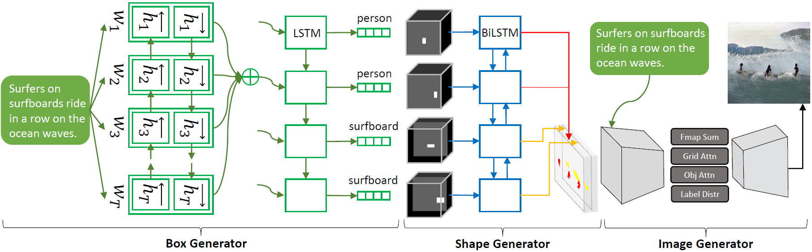

*Figure 2 · [Source](https://arxiv.org/abs/1902.10740)*

### OFA

OFA, from DAMO Academy at Alibaba, is a task-agnostic and modality-agnostic sequence-to-sequence framework. Text, images and spatial regions are all represented as tokens in one shared vocabulary (subwords, image-quantization codes and discretized coordinates), so a single Transformer encoder-decoder handles image captioning, visual question answering, visual grounding, image classification and text-to-image generation by simply changing the instruction and target sequence, with no task-specific output heads.

[Paper](https://arxiv.org/abs/2202.03052) · [GitHub](https://github.com/OFA-Sys/OFA) · [Details](models/unified.md#ofa)

*Figure 2 · [Source](https://arxiv.org/abs/2202.03052)*

### OmniGen

OmniGen, from BAAI, is a unified image-generation model that accepts free-form interleaved text-and-image instructions and produces an image without task-specific plugins such as ControlNet or IP-Adapter. Text is tokenized normally and any input images are encoded into patch embeddings by a frozen VAE; a single transformer attends over text tokens, image-condition embeddings and noisy latent tokens together and iteratively denoises the latter with a rectified-flow objective, so the same weights cover text-to-image generation, instruction-based editing, subject-driven generation and several traditional vision tasks.

[Paper](https://arxiv.org/abs/2409.11340) · [GitHub](https://github.com/VectorSpaceLab/OmniGen) · [Details](models/unified.md#omnigen)

*Figure 2 · [Source](https://arxiv.org/abs/2409.11340)*

### OmniGen2

OmniGen2 is an open generative model from the OmniGen team (VectorSpaceLab) for text-to-image generation, instruction-based image editing and in-context (subject-driven) generation. Unlike OmniGen v1, which used one shared transformer, it decouples text and image generation: a vision-language model reads the multimodal context and emits a special token that triggers image generation, and a separately parameterized diffusion transformer, trained from scratch, synthesizes the image conditioned on the VLM's hidden states and on VAE features of reference images. The paper introduces the OmniContext benchmark for in-context generation and aligns the model with a staged Flow-GRPO curriculum over editing, text-to-image and in-context tasks.

[Paper](https://arxiv.org/abs/2506.18871) · [GitHub](https://github.com/VectorSpaceLab/OmniGen2) · [Model card](https://huggingface.co/OmniGen2/OmniGen2) · [Details](models/unified.md#omnigen2)

*Figure 2 · [Source](https://arxiv.org/abs/2506.18871)*

### OneCAT

OneCAT unifies multimodal understanding, text-to-image generation and instruction-based image editing in a single decoder-only autoregressive transformer with no external vision encoder or tokenizer needed at inference. Raw images are patchified directly into continuous tokens for understanding and editing conditioning, while a Modality-MoE architecture (three specialized FFN experts for text, understanding and generation, sharing attention/QKV) routes tokens to the right expert. Rather than next-token diffusion or continuous-token diffusion heads, OneCAT embeds Visual-Autoregressive-style next-scale prediction directly in the LLM via a scale-aware adapter, generating images coarse-to-fine without a diffusion sampler. The paper reports state-of-the-art results among unified models on understanding, generation and editing benchmarks, along with substantial inference speedups from removing external encoders and diffusion sampling, especially at high resolution.

[Paper](https://arxiv.org/abs/2509.03498) · [GitHub](https://github.com/onecat-ai/OneCAT) · [Model card](https://huggingface.co/onecat-ai/OneCAT-3B) · [Details](models/unified.md#onecat)

*Figure 3 · [Source](https://arxiv.org/abs/2509.03498)*

### Orthus

Orthus, from SJTU, is a unified multimodal model that keeps continuous, lossless image representations instead of vector-quantizing them, while still using a single autoregressive transformer backbone shared with text. Text is tokenized normally and images are embedded as continuous patch features from a vision encoder; the shared transformer predicts the next element of the sequence, routing text positions to a language-modeling head and image positions to a diffusion head that models the next patch feature conditionally, so text-to-image generation, visual understanding and interleaved image-text generation share one backbone with modality-specific output heads.

[Paper](https://arxiv.org/abs/2412.00127) · [GitHub](https://github.com/SJTU-DENG-Lab/Orthus) · [Details](models/unified.md#orthus)

*Figure 2 · [Source](https://arxiv.org/abs/2412.00127)*

### Ovis-Image

Ovis-Image is a 7B-class (10B total, including its frozen encoders) open text-to-image model from the Ovis team, built by adapting the Ovis-U1 unified understanding/generation framework into a dedicated generation model with a larger MMDiT backbone. It conditions on the team's own Ovis2.5-2B vision-language model as text encoder, chosen because its multimodal pretraining already aligns text and image representations, and reuses FLUX.1-schnell's VAE unchanged. The paper's main claim is that a carefully designed, text-rendering-focused training recipe -- rather than a new architectural component -- lets a comparatively small model match the legible-text quality of much larger systems such as Qwen-Image, while remaining efficient enough to run on a single high-end GPU.

[Paper](https://arxiv.org/abs/2511.22982) · [GitHub](https://github.com/ATH-MaaS/Ovis-Image) · [Model card](https://huggingface.co/ATH-MaaS/Ovis-Image-7B) · [Details](models/dit.md#ovis-image)

*Figure 2 · [Source](https://arxiv.org/abs/2511.22982)*

### Ovis-U1

Ovis-U1 is Alibaba's 3-billion-parameter unified model built on the Ovis series, adding text-to-image generation and instruction-based image editing to multimodal understanding. Unlike approaches that freeze a pretrained multimodal LLM and bolt on a generator, Ovis-U1 is trained from a language model with unified data from the start, which the report shows improves both understanding and generation over single-task training. It reports 69.6 on OpenCompass, 83.72/0.89 on DPG-Bench/GenEval for text-to-image generation, and 4.00/6.42 on ImgEdit-Bench/GEdit-Bench-EN for editing.

[Paper](https://arxiv.org/abs/2506.23044) · [GitHub](https://github.com/AIDC-AI/Ovis-U1) · [Model card](https://huggingface.co/AIDC-AI/Ovis-U1-3B) · [Details](models/unified.md#ovis-u1)

*Figure 2 · [Source](https://arxiv.org/abs/2506.23044)*

### Paella

Paella (LAION and Technical University of Darmstadt, 2022) is a fast text-to-image model that operates on VQGAN latent tokens with a convolutional network instead of a transformer, and samples by repeatedly predicting all tokens and randomly renoising a portion of them back to noise rather than permanently unmasking tokens, converging in about 12 steps. Besides text-to-image generation, the same trained model supports image-conditioned generation and zero-shot image variation through CLIP image embeddings.

[Paper](https://arxiv.org/abs/2211.07292) · [GitHub](https://github.com/dome272/Paella) · [Model card](https://huggingface.co/dome272/Paella) · [Details](models/masked.md#paella)

*Figure 2 · [Source](https://arxiv.org/abs/2211.07292)*

### PanGu-Draw

Bilingual latent diffusion model (5B in its largest version) whose denoising is split in time between two SDXL-style U-Nets: a structure generator for high-noise timesteps and a texture generator for low-noise timesteps.

[Paper](https://arxiv.org/abs/2312.16486) · [Details](models/latent-unet.md#pangu-draw)

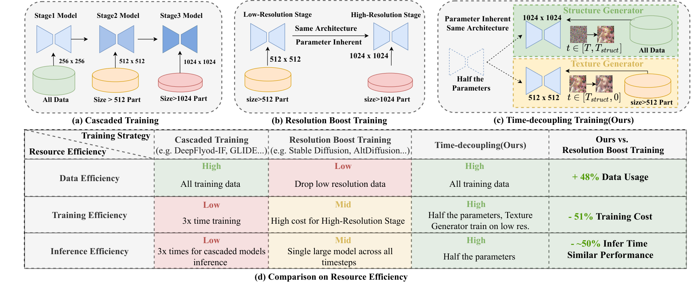

*Figure 1 · [Source](https://arxiv.org/abs/2312.16486)*

### Parallel Multiscale PixelCNN

This DeepMind paper by Reed et al. makes PixelCNN practical at high resolution by modelling groups of pixels as conditionally independent given a lower-resolution image. Generation starts from a tiny 4 × 4 image and repeatedly doubles resolution, sampling pixel groups in parallel, which reduces sampling cost from linear to logarithmic in the number of pixels. Among its benchmarks are text-conditioned bird, human and COCO scene synthesis up to 256 × 256, where the caption is combined with keypoints or segmentation masks.

[Paper](https://arxiv.org/abs/1703.03664) · GitHub: no author-linked repository found · [Details](models/early.md#multiscale-pixelcnn)

*Figure 3 (PDF p. 3) · [Source](https://arxiv.org/abs/1703.03664)*

### Parti

Parti (Google Research, 2022) treats text-to-image generation as sequence-to-sequence translation from text tokens to image tokens, the same recipe that scaled large language models. A ViT-VQGAN tokenizer represents images as discrete tokens, and encoder-decoder Transformers from 350M to 20B parameters are trained to predict those tokens from a text prompt, with the paper showing that image fidelity and prompt adherence keep improving as the decoder is scaled to 20B. Only the PartiPrompts benchmark and project data cards were released; model weights and code are not public.

[Paper](https://arxiv.org/abs/2206.10789) · [GitHub](https://github.com/google-research/parti) · [Details](models/ar-token.md#parti)

*Figure 3 · [Source](https://arxiv.org/abs/2206.10789)*

### PixArt-α

Latent diffusion transformer with T5 cross-attention in every block.

[Paper](https://arxiv.org/abs/2310.00426) · [GitHub](https://github.com/PixArt-alpha/PixArt-alpha) · [Model card](https://huggingface.co/PixArt-alpha/PixArt-XL-2-1024-MS) · [Details](models/dit.md#pixart-alpha)

*Figure 4 · [Source](https://arxiv.org/abs/2310.00426)*

### PixArt-δ

PixArt-δ (Huawei Noah's Ark Lab with Tsinghua, HKU and Hugging Face, 2024) applies Latent Consistency Model distillation to the PixArt-α diffusion transformer. The resulting PixArt-LCM generates 1024×1024 images in two to four steps, about 0.5 seconds on an A100 and seven times faster than PixArt-α, and the distillation fits on 32GB V100 GPUs within a day. The same report introduces a ControlNet-Transformer design for adding spatial control to transformer denoisers.

[Paper](https://arxiv.org/abs/2401.05252) · [GitHub](https://github.com/PixArt-alpha/PixArt-alpha) · [Model card](https://huggingface.co/PixArt-alpha/PixArt-LCM-XL-2-1024-MS) · [Details](models/efficient.md#pixart-delta)

*Figure 1 · [Source](https://arxiv.org/abs/2401.05252)*

### PixArt-Σ

PixArt-Σ is the successor to PixArt-α from Huawei Noah's Ark Lab and academic partners. Rather than training from scratch, it upgrades the PixArt-α diffusion transformer in stages (a stronger VAE, higher-quality and longer captions, higher resolutions) and adds key-value token compression to self-attention so that attention cost stays manageable at 2K and 4K. With about 0.6B parameters, it keeps PixArt-α's cross-attention to T5 text features and generates images directly at up to roughly 4K resolution in one sampling process.

[Paper](https://arxiv.org/abs/2403.04692) · [GitHub](https://github.com/PixArt-alpha/PixArt-sigma) · [Model card](https://huggingface.co/PixArt-alpha/PixArt-Sigma-XL-2-1024-MS) · [Details](models/dit.md#pixart-sigma)

*Figure 7 · [Source](https://arxiv.org/abs/2403.04692)*

### PixelFlow

PixelFlow (HKU and Adobe) generates images directly in raw pixels instead of an autoencoder latent, so the whole model is trained end to end. Its cost stays manageable because early, high-noise steps run at low resolution: the generation interval is split into stages, and at each stage the still-noisy result of the previous stage is upsampled and used as the starting point for flow matching at the next resolution. A single DiT-XL-style transformer handles every stage, with a resolution embedding, 2D RoPE and sequence packing for mixed resolutions. For text-to-image generation, cross-attention to Flan-T5-XL embeddings follows every self-attention layer; the paper reports benchmark results for a 512×512 model and also shows 1024×1024 samples.

[Paper](https://arxiv.org/abs/2504.07963) · [GitHub](https://github.com/ShoufaChen/PixelFlow) · [Model card](https://huggingface.co/ShoufaChen/PixelFlow-Text2Image) · [Details](models/pixel-diffusion.md#pixelflow)

*Figure 2 · [Source](https://arxiv.org/abs/2504.07963)*

### Playground v2

Playground v2 is a latent diffusion text-to-image model from Playground that its model card says follows the same architecture as Stable Diffusion XL, with OpenCLIP ViT-G and CLIP ViT-L as fixed text encoders. Playground v2.5 keeps that architecture and changes the training recipe to improve aesthetic quality: it trains from scratch with the EDM framework and a noise schedule skewed toward higher noise for vivid color and contrast, uses balanced aspect-ratio buckets for multi-aspect generation, and applies supervised fine-tuning on curated data for human preference alignment. Both weight releases are on Hugging Face under Playground community licenses.

[Paper](https://arxiv.org/abs/2402.17245) · [Model card 1](https://huggingface.co/playgroundai/playground-v2-1024px-aesthetic) · [Model card 2](https://huggingface.co/playgroundai/playground-v2.5-1024px-aesthetic) · GitHub: no author-linked repository found · [Details](models/latent-unet.md#playground-v2)

*Editorial input/output diagram · [Source](https://huggingface.co/playgroundai/playground-v2-1024px-aesthetic)*

### Playground v3

Playground v3 is Playground's third-generation text-to-image model and a departure from its earlier SDXL-based versions. Its central idea, Deep-Fusion, is to build the image transformer as a mirror of a large language model: each image block has the same shape as a Llama3-8B layer and reads that layer's hidden states through joint attention, so the diffusion model draws on the LLM's internal representations at every depth rather than only its final output. Combined with a 16-channel VAE, detailed synthetic captions and a 24B-parameter backbone, the paper reports strong prompt following, text rendering and graphic-design ability.

[Paper](https://arxiv.org/abs/2409.10695) · GitHub: no author-linked repository found · [Details](models/dit.md#playground-v3)

*Figure 2 · [Source](https://arxiv.org/abs/2409.10695)*

### PUMA

PUMA (emPowering Unified MLLM with Multi-grAnular visual generation), from a group including Fudan University and Shanghai AI Lab, unifies multimodal understanding and generation by representing an image at five feature granularities, from one coarse token to hundreds of fine-grained tokens. A single autoregressive multimodal LLM takes multi-granular image features and text as input and predicts a text-token classification loss for text and a regression loss for continuous image features, so the coarse granularities support diverse text-to-image generation while the finest granularity, decoded by a diffusion-based decoder, supports detail-preserving image editing and conditional generation.

[Paper](https://arxiv.org/abs/2410.13861) · [GitHub](https://github.com/rongyaofang/PUMA) · [Details](models/unified.md#puma)

*Figure 2 · [Source](https://arxiv.org/abs/2410.13861)*

### Qwen-Image

Qwen-Image is Alibaba's 20B-parameter open text-to-image foundation model, built as a double-stream MMDiT transformer conditioned on a frozen Qwen2.5-VL vision-language model rather than a text-only encoder. The team argues that because Qwen2.5-VL's language and visual representation spaces are already aligned through its own multimodal pretraining, it transfers better as a diffusion conditioner than a pure LLM, and pairs it with a new MSRoPE positional scheme designed to keep image and text token positions consistent under resolution changes. Its VAE reuses a video autoencoder's architecture but retrains the decoder for image fidelity, particularly for rendered text. A heavy curriculum of synthetic text-rendering data lets Qwen-Image generate paragraph-length legible text inside images, a documented weak point of most other text-to-image models. It was released with Apache-2.0 code and weights.

[Paper](https://arxiv.org/abs/2508.02324) · [GitHub](https://github.com/QwenLM/Qwen-Image) · [Model card 1](https://huggingface.co/Qwen/Qwen-Image) · [Model card 2](https://huggingface.co/Qwen/Qwen-Image-2512) · [Details](models/dit.md#qwen-image)

*Figure 6 · [Source](https://arxiv.org/abs/2508.02324)*

### Qwen-Image-2.0

Qwen-Image-2.0 is Alibaba's second-generation text-to-image and editing foundation model, redesigning Qwen-Image's double-stream MMDiT into a single shared transformer stream that processes text and image tokens together, paired with a new frozen Qwen3-VL condition encoder and a more aggressively compressed VAE. The technical report frames it as an 'omni-capable' model that unifies high-fidelity generation with precise, instruction-driven multi-image editing in one architecture, and reports large human-evaluation gains over the original Qwen-Image on both tasks, particularly long, multilingual in-image text. The open-weight Qwen-Image-2.1 release brings a smaller, 7B-parameter single-stream version of this architecture with efficiency optimizations and native transparent (RGBA) image support, under a research-only license.

[Paper](https://arxiv.org/abs/2605.10730) · [GitHub](https://github.com/QwenLM/Qwen-Image-2.1) · [Model card](https://huggingface.co/Qwen/Qwen-Image-2.1) · [Announcement](https://qwen.ai/blog?id=qwen-image-2.0) · [Details](models/dit.md#qwen-image-2)

*Figure 8 · [Source](https://arxiv.org/abs/2605.10730)*

### RAPHAEL

Latent diffusion U-Net of 16 transformer blocks, each with self-attention, cross-attention to OpenCLIP-g/14 text tokens, a time-MoE layer and a space-MoE layer.

[Paper](https://arxiv.org/abs/2305.18295) · [Details](models/latent-unet.md#raphael)

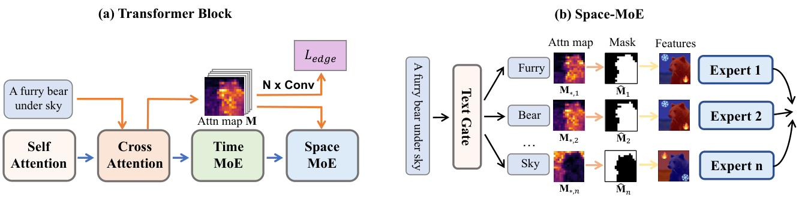

*Figure 3 · [Source](https://arxiv.org/abs/2305.18295)*

### Re-Imagen

Retrieval-augmented Imagen-style cascade (64×64 text-to-image model plus 256×256 and 1024×1024 super-resolution models) whose U-Net attends to encoded retrieved image-text neighbors between its downsampling and upsampling stacks.

[Paper](https://arxiv.org/abs/2209.14491) · GitHub: no author-linked repository found · [Details](models/pixel-diffusion.md#re-imagen)

*Figure 3 · [Source](https://arxiv.org/abs/2209.14491)*

### Recraft

Recraft is a design-oriented image generation service and API whose models produce both raster images and editable vector graphics. Recraft V3 (October 2024) was introduced with long-text rendering, control over text position and size, brand-style consistency from a set of example images, and editing tools such as inpainting, outpainting and area modification. Recraft V4 (February 2026) came in standard and Pro (2048×2048) raster versions and matching vector versions that output layered SVG files, and V4.1 (May 2026) added V4.1, V4.1 Vector and V4.1 Utility versions. The API documents text-to-image and image-to-image with prompts for V3 and later, and mask-based inpainting, outpainting and background replacement for V3. Recraft does not publish model architectures.

[Announcement 1](https://www.recraft.ai/blog/recraft-introduces-a-revolutionary-ai-model-that-thinks-in-design-language) · [Announcement 2](https://www.recraft.ai/blog/introducing-recraft-v4-design-taste-meets-image-generation) · [Announcement 3](https://www.recraft.ai/blog/recraft-v4-1-more-beautiful-by-nature) · [Docs 1](https://www.recraft.ai/docs/recraft-models/recraft-V4) · [Docs 2](https://www.recraft.ai/docs/api-reference/endpoints) · [Details](models/api.md#recraft)

*Editorial input/output diagram · [Source](https://www.recraft.ai/docs/api-reference/endpoints)*

### Retrieval-Augmented Diffusion Models (RDM)

Semi-parametric latent diffusion model whose U-Net is conditioned by cross-attention on CLIP embeddings of nearest neighbours retrieved from an external image database, enabling text-to-image by conditioning on CLIP text embeddings.

[Paper](https://arxiv.org/abs/2204.11824) · [GitHub 1](https://github.com/CompVis/retrieval-augmented-diffusion-models) · [GitHub 2](https://github.com/CompVis/latent-diffusion) · [Details](models/latent-unet.md#rdm)

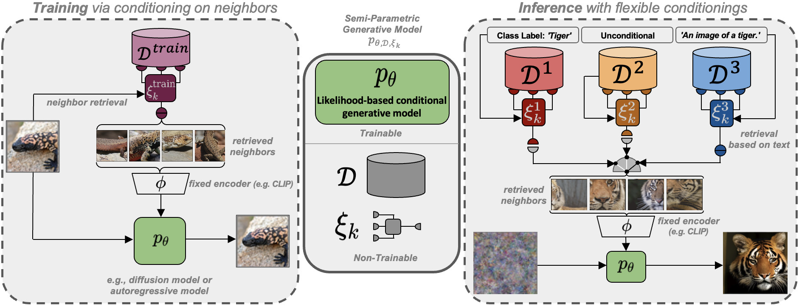

*Figure 3 · [Source](https://arxiv.org/abs/2204.11824)*

### Reve Image

Reve Image is the image model line from Reve AI, served through reve.com and an API. The relaunched product of September 2025 bundled text-to-image generation, natural-language editing of generated and uploaded images, remixing of several images into one composition and an API beta, and Reve's first editing model followed in October 2025. Reve v1.5 (February 2026) generates 4K images and, according to Reve, works in native pixel space rather than an autoencoder latent. Reve 2.0 (June 2026) and 2.1 (July 2026) build every image from a "layout", a structured, hierarchical map of regions, text and objects that users and agents can edit. Reve describes a "Large Layout Model" trained from open-source LLMs that turns layouts, instructions and images into a layout and then renders the final pixels. The Reve 2.1 API (July 2026) exposes both simple create and edit endpoints and endpoints that separate layout creation, editing and rendering.

[Announcement 1](https://blog.reve.com/posts/the-new-reve/) · [Announcement 2](https://blog.reve.com/posts/reve-editing-model/) · [Announcement 3](https://blog.reve.com/posts/reve-1.5-is-here/) · [Announcement 4](https://blog.reve.com/posts/announcing-reve-2.0/) · [Announcement 5](https://blog.reve.com/posts/the-layout-bet/) · [Announcement 6](https://blog.reve.com/posts/launching-reve-2.1/) · [Announcement 7](https://blog.reve.com/posts/the-reve-api/) · [Announcement 8](https://blog.reve.com/posts/a-new-chapter-for-reve/) · [Details](models/api.md#reve-image)

*Editorial input/output diagram · [Source](https://blog.reve.com/posts/the-new-reve/)*

### ruDALL-E

ruDALL-E is Sber AI and SberDevices' open reproduction of OpenAI's DALL·E for Russian prompts, released in November 2021. A transformer predicts discrete VQ-GAN image tokens after the text tokens, and the generation pipeline adds ruCLIP reranking and Real-ESRGAN upscaling. The 1.3-billion-parameter Malevich (XL) model was released openly, while the 12-billion-parameter Kandinsky (XXL) model was described alongside it.

[Announcement 1](https://habr.com/ru/company/sberdevices/blog/586926/) · [Announcement 2](https://habr.com/ru/company/sberbank/blog/589673/) · [GitHub](https://github.com/ai-forever/ru-dalle) · [Model card](https://huggingface.co/ai-forever/rudalle-Malevich) · [Details](models/ar-token.md#rudall-e)

*Editorial input/output diagram · [Source](https://github.com/ai-forever/ru-dalle)*

### SANA

SANA is NVIDIA's efficiency-focused text-to-image model, designed to produce high-resolution images quickly enough to run on a laptop GPU. It combines three ideas: an autoencoder that compresses images 32× so far fewer tokens reach the transformer, a diffusion transformer whose attention is linear rather than quadratic in the number of tokens (with convolutional feed-forward layers that make positional embeddings unnecessary), and a small decoder-only LLM, Gemma-2, as text encoder, prompted with in-context instructions. With 0.6B to 1.6B parameters, the paper reports quality competitive with much larger models at far higher throughput and generation up to 4K resolution.

[Paper](https://arxiv.org/abs/2410.10629) · [GitHub](https://github.com/NVlabs/Sana) · [Model card](https://huggingface.co/Efficient-Large-Model/Sana_1600M_1024px) · [Details](models/dit.md#sana)

*Figure 5 · [Source](https://arxiv.org/abs/2410.10629)*

### SANA 1.5

SANA 1.5 is NVIDIA's follow-up to SANA that studies how to scale a linear diffusion transformer cheaply. Instead of training a larger model from scratch, it grows the 1.6B SANA model to 4.8B parameters by stacking new, identity-initialized blocks on top of the pre-trained ones and training with a memory-saving 8-bit optimizer. The resulting deep model can then be pruned back to smaller sizes for deployment, and at inference time quality can be traded for compute by generating several candidates and letting a vision-language model pick the best, which the paper shows lifts benchmark alignment scores substantially.

[Paper](https://arxiv.org/abs/2501.18427) · [GitHub](https://github.com/NVlabs/Sana) · [Model card](https://huggingface.co/Efficient-Large-Model/SANA1.5_4.8B_1024px) · [Details](models/dit.md#sana-1-5)

*Figure 1 · [Source](https://arxiv.org/abs/2501.18427)*

### SANA-Sprint

SANA-Sprint (NVIDIA, MIT, Tsinghua and Hugging Face, 2025) makes the SANA text-to-image transformer generate 1024×1024 images in one to four steps, about 0.1 s on an H100. Continuous-time consistency models require a TrigFlow parameterization, so the paper converts the pretrained flow-matching SANA model to TrigFlow by transforming its inputs and outputs mathematically instead of pretraining a new model. The student is then trained with an sCM loss that keeps it consistent with the teacher's trajectory and a LADD-style GAN loss, with discriminator heads on the frozen teacher's features, that sharpens one-step samples. A single model serves all step counts from one to four. The paper also combines SANA-Sprint with ControlNet for interactive generation.

[Paper](https://arxiv.org/abs/2503.09641) · [GitHub](https://github.com/NVlabs/Sana) · [Model card](https://huggingface.co/Efficient-Large-Model/Sana_Sprint_1.6B_1024px) · [Project](https://nvlabs.github.io/Sana/Sprint/) · [Details](models/efficient.md#sana-sprint)

*Figure 2 · [Source](https://arxiv.org/abs/2503.09641)*

### SD-GAN

Siamese pair of three-stage stacked GANs trained with contrastive losses, whose generators are modulated by semantic-conditioned batch normalization.

[Paper](https://arxiv.org/abs/1904.01480) · GitHub: no author-linked repository found · [Details](models/gan.md#sd-gan)

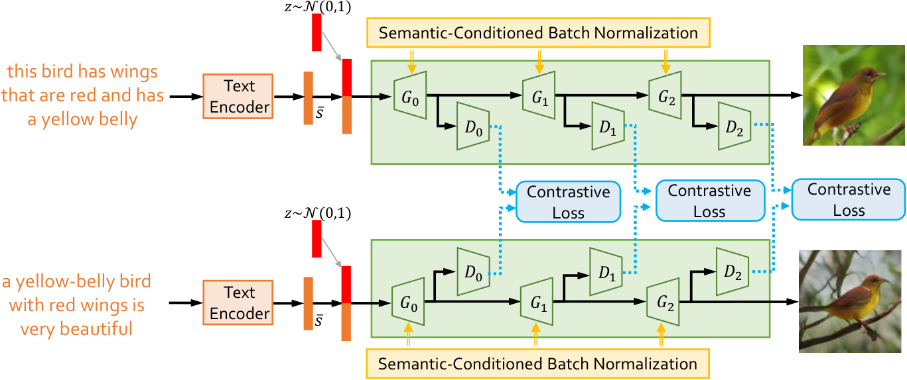

*Figure 2 · [Source](https://arxiv.org/abs/1904.01480)*

### SD3-Turbo (Latent Adversarial Diffusion Distillation)

Latent Adversarial Diffusion Distillation (LADD, Stability AI, 2024) is the successor to ADD and was used to distill the 8B Stable Diffusion 3 transformer into SD3-Turbo, a multi-aspect-ratio megapixel generator that samples in four steps without classifier-free guidance. Instead of decoding to pixels and judging images with a fixed DINOv2 network, LADD re-noises the student's latents, passes them through the frozen teacher, and trains independent discriminator heads on the teacher's token sequence after each attention block. Training data are latents generated by the teacher at a fixed guidance scale, so no real images or decoder passes are needed.

[Paper](https://arxiv.org/abs/2403.12015) · GitHub: no author-linked repository found · [Details](models/efficient.md#sd3-turbo)

*Figure 3 · [Source](https://arxiv.org/abs/2403.12015)*

### SDXL

2.6B-parameter latent diffusion U-Net conditioned on concatenated CLIP ViT-L and OpenCLIP ViT-bigG text features, with size/crop micro-conditioning and an optional latent refinement model.

[Paper](https://arxiv.org/abs/2307.01952) · [Announcement](https://stability.ai/news/stable-diffusion-sdxl-1-announcement) · [GitHub](https://github.com/Stability-AI/generative-models) · [Model card](https://huggingface.co/stabilityai/stable-diffusion-xl-base-1.0) · [Details](models/latent-unet.md#sdxl)

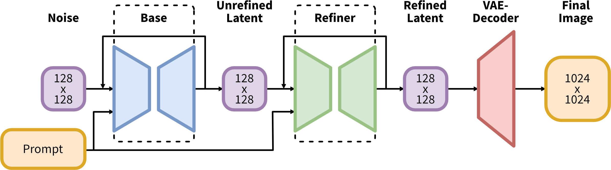

*Figure 1 (right panel) · [Source](https://arxiv.org/abs/2307.01952)*

### SDXL Turbo (Adversarial Diffusion Distillation)

Adversarial Diffusion Distillation (ADD, Stability AI, 2023) turns a pretrained latent diffusion model into a one- to four-step text-to-image generator. The student starts from the pretrained U-Net weights and is trained on two signals at once: a discriminator built from a frozen pretrained vision transformer with small trainable heads pushes single-step outputs toward real-image fidelity, and a frozen diffusion teacher, applied to re-noised student outputs, provides a score-distillation target for text alignment and quality. The released SDXL Turbo applies ADD to SDXL 1.0; SD Turbo applies it to Stable Diffusion 2.1.

[Paper](https://arxiv.org/abs/2311.17042) · [Announcement](https://stability.ai/news/stability-ai-sdxl-turbo) · [Model card 1](https://huggingface.co/stabilityai/sdxl-turbo) · [Model card 2](https://huggingface.co/stabilityai/sd-turbo) · [GitHub](https://github.com/Stability-AI/generative-models) · [Details](models/efficient.md#sdxl-turbo)

*Figure 2 · [Source](https://arxiv.org/abs/2311.17042)*

### SDXL-Lightning

SDXL-Lightning (ByteDance, 2024) distills SDXL into 1024px generators that need one to eight sampling steps. It follows progressive distillation, where each student learns to reproduce several teacher steps in one, but replaces the usual mean-squared-error target, which the paper shows produces blurry images at low step counts, with an adversarial loss. The discriminator is built from a copy of SDXL's own U-Net encoder and mid-block, so it works directly on noisy latents at any timestep and accepts the text condition. The models are released both as full U-Net checkpoints and as LoRA modules that can be applied to other SDXL-based models.

[Paper](https://arxiv.org/abs/2402.13929) · [Model card](https://huggingface.co/ByteDance/SDXL-Lightning) · GitHub: no author-linked repository found · [Details](models/efficient.md#sdxl-lightning)

*Editorial input/output diagram · [Source](https://arxiv.org/abs/2402.13929)*

### SDXS

SDXS (Xiaomi, 2024) reduces both model size and step count. The VAE decoder is replaced by a tiny convolutional decoder trained to reproduce the original decoder's outputs with a distillation and GAN loss, and the U-Net is shrunk with BK-SDM-style block removal and knowledge distillation (SD 2.1-base loses its mid-stage, innermost stages and highest-resolution transformer blocks; SDXL loses most transformer blocks). The small U-Net is then turned into a one-step generator: a warmup matches features of its one-step outputs to multi-step teacher outputs with an SSIM-based feature loss, and training continues with Diff-Instruct-style score distillation on low-noise timesteps while feature matching covers the high-noise segment. The paper reports about 100 FPS at 512px and 30 FPS at 1024px on one GPU.

[Paper](https://arxiv.org/abs/2403.16627) · [GitHub](https://github.com/IDKiro/sdxs) · [Model card](https://huggingface.co/IDKiro/sdxs-512-0.9) · [Details](models/efficient.md#sdxs)

*Figure 3 · [Source](https://arxiv.org/abs/2403.16627)*

### SEED-LLaMA

SEED-LLaMA, from Tencent AI Lab and ARC Lab (Tencent PCG), teaches a pretrained LLM to both see and draw using the SEED image tokenizer. SEED turns an image into 32 discrete codes with 1D causal dependency and high-level semantics: a BLIP-2 ViT encoder feeds a Causal Q-Former whose outputs are vector-quantized. The LLM is pretrained on interleaved text and SEED codes with a single next-word objective and then instruction-tuned. To generate an image, the predicted codes are mapped by an MLP to a generation embedding aligned with unCLIP Stable Diffusion, and the off-the-shelf SD U-Net decodes it. The paper demonstrates text-to-image generation, comprehension and multi-turn in-context image and text generation.

[Paper](https://arxiv.org/abs/2310.01218) · [GitHub](https://github.com/AILab-CVC/SEED) · [Model card](https://huggingface.co/AILab-CVC/seed-llama-8b-sft) · [Details](models/unified.md#seed-llama)

*Figure 4 (PDF p. 5) · [Source](https://arxiv.org/abs/2310.01218)*

### SEED-X

SEED-X, from Tencent AI Lab and ARC Lab (Tencent PCG), is a unified multimodal foundation model for multi-granularity comprehension and generation. Images are divided into sub-images to support arbitrary sizes and aspect ratios and fed to the LLM as ViT features. For generation, a fixed set of learnable queries is appended and their output hidden states are trained to regress the ViT features of the target image; a visual de-tokenizer built on SDXL then turns these features into an image. A second-stage de-tokenizer also accepts a condition image in latent space so that edits preserve low-level details. Instruction tuning yields a general assistant (SEED-X-I) and task models such as SEED-X-Edit for high-precision editing, plus story, slide and try-on variants.

[Paper](https://arxiv.org/abs/2404.14396) · [GitHub](https://github.com/AILab-CVC/SEED-X) · [Model card](https://huggingface.co/AILab-CVC/SEED-X-17B) · [Details](models/unified.md#seed-x)

*Figure 4 · [Source](https://arxiv.org/abs/2404.14396)*

### Seedream 2.0

Seedream 2.0 is ByteDance's bilingual (Chinese and English) text-to-image foundation model, built as an MMDiT diffusion transformer that conditions jointly on a self-developed decoder-only LLM text encoder and a Glyph-ByT5 encoder dedicated to rendering legible text inside images. Its own VAE and a new Scaled RoPE positional scheme are meant to keep quality consistent at resolutions beyond what the model was trained on. The technical report emphasizes native, balanced Chinese-English understanding and aesthetic alignment through large-scale knowledge injection and active-learning-based data curation, and Seedream 3.0 (also in this catalog) reports that it inherits this same core MMDiT design. No public weights or code are available; the model is served only through ByteDance's own products.

[Paper](https://arxiv.org/abs/2503.07703) · [Details](models/dit.md#seedream-2)

*Figure 10 · [Source](https://arxiv.org/abs/2503.07703)*

### Seedream 3.0

Seedream 3.0 is ByteDance's next Seedream generation, explicitly built on the same MMDiT architecture as Seedream 2.0 but scaled up in parameters and trained with a more elaborate curriculum: resolution progressively raised from 256px pre-training to 2048px fine-tuning with explicit size conditioning, a defect-aware data pipeline that expands training data using an automatic defect detector, a cross-modality RoPE for better text-image alignment, and a representation-alignment loss borrowed from DINOv2 features. Rather than introducing a new transformer design, the report focuses on training-time and data-quality improvements over Seedream 2.0, reporting gains in alignment, structural accuracy, aesthetics and text rendering. No public weights or code are available; the model is served only through ByteDance's own products.

[Paper](https://arxiv.org/abs/2504.11346) · [Details](models/dit.md#seedream-3)

*Editorial input/output diagram · [Source](https://arxiv.org/abs/2504.11346)*

### Seedream 4.0

Seedream 4.0 is ByteDance's unified text-to-image generation and multi-image editing system, built around a redesigned, more efficient diffusion transformer backbone that the technical report says substantially raises model capacity while cutting training and inference cost. Generation and editing share one model through a 'causal diffusion' post-training stage, so the same network can take a text prompt alone or a prompt plus one or several reference images and return one or multiple output images, evaluated as co-equal capabilities in the paper's benchmarks. A high-compression VAE and a Seed1.5-VL-based prompt/routing module keep image tokens few and route different input types, while adversarial distillation, quantization and speculative decoding push inference to roughly 1.4 seconds for a 2K image, over 10x faster than Seedream 3.0. Seedream 4.5 is a later product update of the same system rather than a new architecture. No public weights or code exist; the model is available only through ByteDance's API and products.

[Paper](https://arxiv.org/abs/2509.20427) · [Announcement](https://www.byteplus.com/en/blog/seedream4-5) · [Details](models/dit.md#seedream-4)

*Editorial input/output diagram · [Source](https://arxiv.org/abs/2509.20427)*

### Seedream 5.0

Seedream 5.0 is ByteDance Seed's closed image creation line released after Seedream 4.0. Seedream 5.0 Lite (announced 2026-02-13) is described as a unified multimodal image generation model with deep thinking and online search: it reasons through complex prompts step by step, uses real-time web search for time-sensitive content, follows reference images more closely and supports single-image editing and style transfer from references. Seedream 5.0 Pro (2026-07-08) targets information visualization and professional layouts, multilingual text rendering, realistic imagery and interactive precision editing with point and lasso selection, sketch rendering, color and material replacement, layer separation and multi-image fusion. No technical report or architecture details have been published for version 5.0.

[Announcement 1](https://seed.bytedance.com/en/blog/deeper-thinking-more-accurate-generation-introducing-seedream-5-0-lite) · [Announcement 2](https://seed.bytedance.com/en/blog/beyond-generation-it-understands-design-introducing-seedream-5-0-pro) · [Project](https://seed.bytedance.com/en/seedream5_0_lite) · [Details](models/api.md#seedream-5)

*Editorial input/output diagram · [Source](https://seed.bytedance.com/en/seedream5_0_lite)*

### SenseNova-U1

SenseNova-U1, from SenseTime's OpenSenseNova team, is a native unified multimodal model built on NEO-unify that dispenses with both a pretrained vision encoder for understanding and a VAE for generation, arguing that these separate, differently-trained components are the structural reason understanding and generation remain loosely coupled in most unified models. Instead, a near-lossless visual interface uses lightweight convolutional patch encoding/decoding layers to work directly on raw pixels and words, and a native Mixture-of-Transformers backbone (sharing self-attention but with separate understanding and generation FFN experts) jointly trains next-token cross-entropy for text with pixel-space flow matching for images at a 32x compression ratio. Two variants launch on dense (8B) and MoE (30B-A3B) understanding backbones. The paper reports performance rivaling top-tier understanding-only VLMs while achieving strong any-to-image generation, complex infographic generation, image editing and interleaved vision-language generation, plus preliminary results in vision-language-action and world-model scenarios.

[Paper](https://arxiv.org/abs/2605.12500) · [GitHub](https://github.com/OpenSenseNova/SenseNova-U1) · [Model card](https://huggingface.co/sensenova/SenseNova-U1-8B-MoT) · [Details](models/unified.md#sensenova-u1)

*Figure 4 · [Source](https://arxiv.org/abs/2605.12500)*

### Show-o

Show-o, from Show Lab (National University of Singapore) and ByteDance, unifies multimodal understanding and generation in one transformer. Text and images are both tokenized into discrete tokens; text is modeled autoregressively with causal attention, while image tokens are generated in parallel by iterative mask-token prediction with full attention inside the image. The same 1.3B model handles visual question answering and captioning, text-to-image generation, text-guided inpainting and extrapolation, and mixed-modality generation such as video keyframes with text descriptions.

[Paper](https://arxiv.org/abs/2408.12528) · [GitHub](https://github.com/showlab/Show-o) · [Model card](https://huggingface.co/showlab/show-o-512x512) · [Details](models/unified.md#show-o)

*Figure 2 · [Source](https://arxiv.org/abs/2408.12528)*

### Show-o2

Show-o2 is Show Lab's second-generation native unified multimodal model. Where Show-o predicted discrete image tokens with masked modeling, Show-o2 works in the continuous latent space of a 3D causal VAE, so the same model handles images and videos: a dual-path module fuses semantic features (SigLIP-distilled layers) and low-level projected latents into unified visual representations, and a language model with a language head and a flow head performs next-token prediction for text and flow matching for images and video. The paper reports multimodal understanding, text-to-image, text-to-video, image-to-video and mixed-modality (interleaved) generation, and a two-stage recipe that keeps the base LLM's language knowledge without a large text corpus.

[Paper](https://arxiv.org/abs/2506.15564) · [GitHub](https://github.com/showlab/Show-o) · [Model card](https://huggingface.co/showlab/show-o2-7B) · [Details](models/unified.md#show-o2)

*Figure 1 · [Source](https://arxiv.org/abs/2506.15564)*

### SimpleAR

SimpleAR (2025) is a deliberately plain autoregressive text-to-image baseline: a Qwen-architecture decoder-only transformer predicts discrete Cosmos-Tokenizer image tokens after text tokens with no bespoke visual modules, and the authors show that adding supervised fine-tuning on curated data and a GRPO reinforcement-learning stage with CLIP-based rewards lets a 0.5-1.5B model reach competitive GenEval and DPG scores, while vLLM serving makes 1024px sampling practical in seconds.

[Paper](https://arxiv.org/abs/2504.11455) · [GitHub](https://github.com/wdrink/SimpleAR) · [Details](models/ar-token.md#simplear)

*Editorial input/output diagram · [Source](https://arxiv.org/abs/2504.11455)*

### Skywork UniPic

Skywork UniPic is a 1.5B-parameter unified autoregressive model from Skywork AI that supports image understanding, text-to-image generation and instruction-based image editing without task-specific adapters. Unlike Harmon, which shares one MAR encoder for both generation and understanding, UniPic decouples the two: a MAR encoder-decoder pair handles pixel-level generation while a separate SigLIP2 encoder handles semantic understanding, both routed through one shared language model. The paper reports 0.86 on GenEval, 85.5 on DPG-Bench, and 5.83/3.49 on GEditBench-EN/ImgEdit-Bench for editing, generating 1024x1024 images in under 15 GB of GPU memory, with roughly one-tenth the parameters of comparable unified models such as BAGEL.

[Paper](https://arxiv.org/abs/2508.03320) · [GitHub](https://github.com/SkyworkAI/UniPic) · [Model card](https://huggingface.co/Skywork/Skywork-UniPic-1.5B) · [Details](models/unified.md#skywork-unipic)

*Figure 2 · [Source](https://arxiv.org/abs/2508.03320)*

### SnapFusion

SnapFusion (Snap Inc. and Northeastern University, 2023) runs text-to-image diffusion on a phone in under two seconds for a 512×512 image. Starting from Stable Diffusion v1.5, it searches for a faster U-Net by robust training with stochastic block skipping followed by architecture evolving that removes or adds cross-attention and ResNet blocks according to their measured on-device latency and effect on quality. The VAE decoder is shrunk by 50% channel pruning and distilled from the original decoder. Step distillation in v-prediction, with a loss that applies classifier-free guidance to teacher and student, brings sampling down to eight steps, and the paper reports better FID and CLIP scores than SD v1.5 with 50 steps on MS-COCO.

[Paper](https://arxiv.org/abs/2306.00980) · [GitHub](https://github.com/snap-research/SnapFusion) · [Project](https://snap-research.github.io/SnapFusion) · [Details](models/efficient.md#snapfusion)

*Figure 3 (PDF p. 4) · [Source](https://arxiv.org/abs/2306.00980)*

### SnapGen

SnapGen (Snap Inc. with the University of Melbourne, HKUST and MBZUAI, 2024) is a small text-to-image model that generates 1024×1024 images on an iPhone 16 Pro Max in about 1.4 seconds. Instead of compressing an existing model, it designs a new UNet starting from a thinned SDXL layout: self-attention only at the lowest resolution, expanded separable convolutions, a narrower feed-forward ratio, multi-query attention with QK RMSNorm and RoPE, and conditioning inserted from the first stage. A decoder 35.9× smaller than the SD3/SDXL decoder makes high-resolution decoding feasible on the phone. The model is trained with flow matching so that it can learn from SD3.5-Large through output- and feature-level distillation with timestep-aware loss scaling, and is then distilled to a few steps with an adversarial objective whose discriminator uses SD3.5-Large-Turbo features.

[Paper](https://arxiv.org/abs/2412.09619) · [Project](https://snap-research.github.io/snapgen) · GitHub: no author-linked repository found · [Details](models/efficient.md#snapgen)

*Figure 2 (PDF p. 4) · [Source](https://arxiv.org/abs/2412.09619)*

### SSD-1B

SSD-1B (Segmind with Hugging Face, 2024) is a compressed version of SDXL. Following BK-SDM, it removes redundant parts of the SDXL U-Net, but at a finer grain: individual transformer blocks inside the attention layers, the mid-block's attention layers and its second residual block. The pruned network is retrained to imitate the teacher's noise prediction and the features of every attention and ResNet layer, with the teacher switched in succession from SDXL base to the fine-tuned ZavyChromaXL and JuggernautXL. SSD-1B has a 1.3B-parameter U-Net, about half of SDXL's, and the smaller Segmind-Vega has 0.74B; the report cites up to 60% and 100% speedups, respectively, at the same step count.

[Paper](https://arxiv.org/abs/2401.02677) · [GitHub](https://github.com/segmind/SSD-1B) · [Model card 1](https://huggingface.co/segmind/SSD-1B) · [Model card 2](https://huggingface.co/segmind/Segmind-Vega) · [Details](models/efficient.md#ssd-1b)

*Figure 2 · [Source](https://arxiv.org/abs/2401.02677)*

### Stable Diffusion 1.x

Latent diffusion model with an 860M U-Net conditioned through cross-attention on the non-pooled embeddings of a frozen CLIP ViT-L/14 text encoder.

[Announcement](https://stability.ai/news/stable-diffusion-public-release) · [GitHub](https://github.com/CompVis/stable-diffusion) · [Model card](https://huggingface.co/CompVis/stable-diffusion-v1-4) · [Paper](https://arxiv.org/abs/2112.10752) · [Details](models/latent-unet.md#stable-diffusion-1)

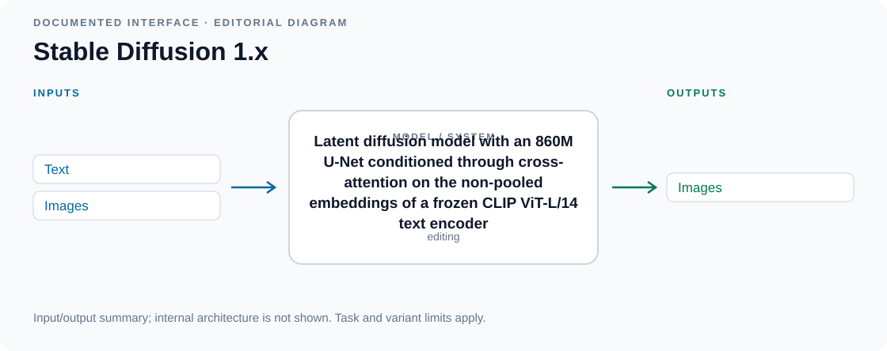

*Editorial input/output diagram · [Source](https://github.com/CompVis/stable-diffusion)*

### Stable Diffusion 2.x

Latent diffusion U-Net (865M parameters) conditioned through cross-attention on an OpenCLIP ViT-H text encoder.

[Announcement 1](https://stability.ai/news/stable-diffusion-v2-release) · [Announcement 2](https://stability.ai/news/stablediffusion2-1-release7-dec-2022) · [Paper](https://arxiv.org/abs/2307.01952) · GitHub: no author-linked repository found · [Details](models/latent-unet.md#stable-diffusion-2)

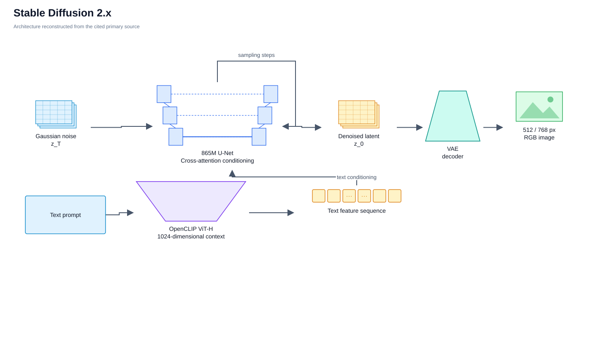

*Editorial input/output diagram · [Source](https://stability.ai/news/stable-diffusion-v2-release)*

### Stable Diffusion 3

Stable Diffusion 3 is Stability AI's third-generation text-to-image family and the paper that introduced the MM-DiT backbone. Instead of injecting text through cross-attention, it treats text and image latents as two token streams with their own weights that meet in a shared attention operation, trained with a rectified-flow objective and a noise-schedule sampling that favours intermediate timesteps. Three frozen text encoders (two CLIP models and T5-XXL) provide both a pooled vector for modulation and a token sequence for the joint attention. The architecture was scaled to 8B parameters in the paper and released as SD3 Medium and later as the SD3.5 Large, Large Turbo and Medium checkpoints.

[Paper](https://arxiv.org/abs/2403.03206) · [Announcement 1](https://stability.ai/news/stable-diffusion-3) · [Announcement 2](https://stability.ai/news/introducing-stable-diffusion-3-5) · [GitHub](https://github.com/Stability-AI/sd3.5) · [Model card](https://huggingface.co/stabilityai/stable-diffusion-3.5-medium) · [Details](models/dit.md#stable-diffusion-3)

*Figure 2 (PDF p. 5) · [Source](https://arxiv.org/abs/2403.03206)*

### StackGAN

Two-stage conditional GAN: a Stage-I generator sketches a 64×64 image from text and noise, and a Stage-II encoder–residual–decoder generator refines it to 256×256 conditioned on the text again.

[Paper](https://arxiv.org/abs/1612.03242) · [GitHub](https://github.com/hanzhanggit/StackGAN) · [Details](models/gan.md#stackgan)

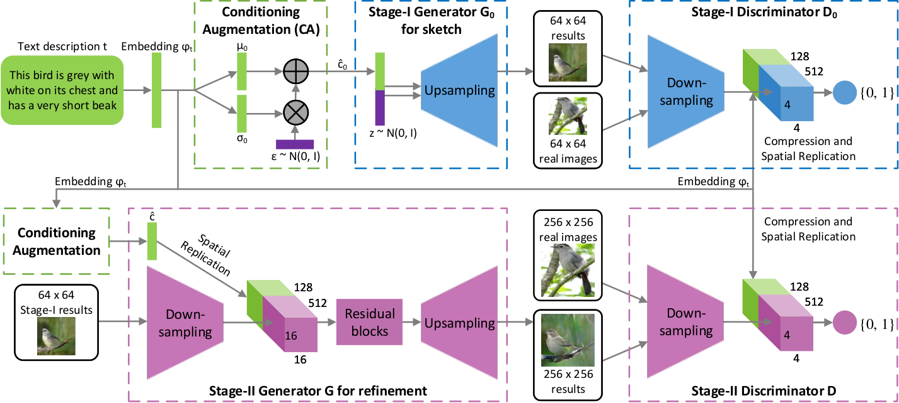

*Figure 2 · [Source](https://arxiv.org/abs/1612.03242)*

### StackGAN++ (StackGAN-v2)

End-to-end tree-structured GAN whose shared trunk branches into generators at 64×64, 128×128 and 256×256, each paired with its own discriminator.

[Paper](https://arxiv.org/abs/1710.10916) · [GitHub](https://github.com/hanzhanggit/StackGAN-v2) · [Details](models/gan.md#stackgan-v2)

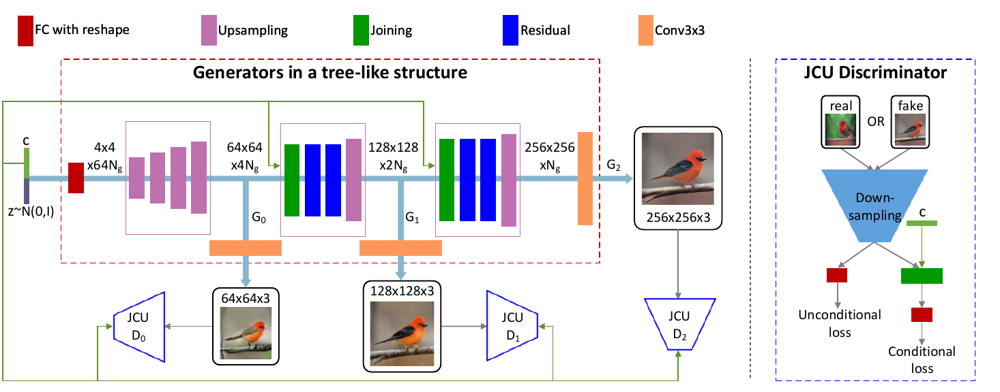

*Fig. 2 (PDF p. 6) · [Source](https://arxiv.org/abs/1710.10916)*

### STAR

STAR (2024) adapts VAR-style next-scale autoregressive image generation to open-domain text-to-image synthesis, adding text cross-attention at every scale and a normalized rotary position encoding so the same positional scheme works across the growing token-map resolutions of scale-wise generation, reaching 1024px outputs in about 2.2 seconds.

[Paper](https://arxiv.org/abs/2406.10797) · [GitHub](https://github.com/Davinci-XLab/STAR-T2I) · [Model card](https://huggingface.co/taocrayon/STAR) · [Details](models/ar-token.md#star-t2i)

*Figure 4 · [Source](https://arxiv.org/abs/2406.10797)*

### STARFlow

STARFlow (Apple) shows that normalizing flows can scale to high-resolution text-to-image generation. The model is a single invertible flow trained by exact maximum likelihood on continuous autoencoder latents, without quantization or iterative denoising. Each flow block is an autoregressive transformer; almost all capacity sits in one deep block that behaves like a Gaussian language model over latent tokens and is the only block that sees the caption, while a few cheap shallow blocks refine local detail. Sampling runs the deep block autoregressively from Gaussian noise, then the shallow blocks, and a decoder fine-tuned on noise-injected latents maps the result to pixels. A revised classifier-free guidance algorithm for autoregressive flows improves quality at high guidance weights. The text-to-image model has 3.8B parameters and supports variable aspect ratios.

[Paper](https://arxiv.org/abs/2506.06276) · [GitHub](https://github.com/apple-aiml-research/ml-starflow) · [Model card](https://huggingface.co/apple/starflow) · [Details](models/continuous-ar.md#starflow)

*Figure 4 (PDF p. 5) · [Source](https://arxiv.org/abs/2506.06276)*

### STARFlow2

STARFlow2, from Apple, unifies multimodal understanding and text-to-image generation by observing that autoregressive normalizing flows (TARFlow-style models) share the same causal-mask, KV-cache and left-to-right structure as language-model transformers, making them a natural fit for unifying continuous image generation with discrete text generation in one purely causal, single-pass model, unlike diffusion-based unified models. Its Pretzel architecture vertically interleaves a pretrained, largely frozen VLM stream with a TARFlow stream that operates on continuous latents from a Feature Auto-Encoder (FAE) trained on DINOv2 features; the two streams exchange information through zero-initialized residual skip connections so training starts from the pretrained VLM and flow behaviors and gradually learns cross-modal corrections. A three-stage training pipeline first trains the flow for text-to-image generation with the VLM frozen, then aligns the visual adapter for image-to-text understanding, and finally activates the vertical skip connections to jointly optimize understanding, generation, editing and interleaved generation. STARFlow2 reports 0.82 on GenEval and 84.14 on DPG-Bench for text-to-image generation.

[Paper](https://arxiv.org/abs/2605.08029) · [GitHub](https://github.com/apple/ml-starflow) · [Details](models/unified.md#starflow2)

*Figure 2 · [Source](https://arxiv.org/abs/2605.08029)*

### SwiftBrush

SwiftBrush (VinAI Research, 2023) distills Stable Diffusion 2.1 into a one-step text-to-image generator without any training images. It borrows Variational Score Distillation from text-to-3D generation (ProlificDreamer): the student turns noise and a prompt into an image, the image is re-noised, and the student is updated with the difference between the frozen teacher's noise prediction and that of a LoRA teacher that is trained alternately to model the student's output distribution. Only text prompts are needed. SwiftBrush v2 (2024) initializes the student from SD Turbo, adds a clamped CLIP loss for text alignment, trains full and LoRA versions and merges them by weight interpolation, and reports a one-step student that surpasses its SD 2.1 teacher on zero-shot COCO FID.

[Paper 1](https://arxiv.org/abs/2312.05239) · [Paper 2](https://arxiv.org/abs/2408.14176) · [GitHub 1](https://github.com/VinAIResearch/SwiftBrush) · [GitHub 2](https://github.com/VinAIResearch/SwiftBrushV2) · [Details](models/efficient.md#swiftbrush)

*Figure 2 (PDF p. 6) · [Source](https://arxiv.org/abs/2312.05239)*

### Switti

Switti (Yandex Research, 2024) is a scale-wise (VAR-style) autoregressive text-to-image transformer that drops causal attention across scales in favor of non-causal, scale-local attention, since it finds later scales already encode information from earlier ones through upsampling. Combined with disabling classifier-free guidance at the final high-resolution scales, this yields roughly 30% faster 1024px sampling than a causal scale-wise baseline with comparable or better quality.

[Paper](https://arxiv.org/abs/2412.01819) · [GitHub](https://github.com/yandex-research/switti) · [Model card](https://huggingface.co/yresearch/Switti) · [Details](models/ar-token.md#switti)

*Figure 2 (PDF p. 4) · [Source](https://arxiv.org/abs/2412.01819)*

### SynerGen-VL

SynerGen-VL, from a group including Tsinghua and SenseTime, is an encoder-free unified model: rather than using a separate vision encoder for understanding, it tokenizes images directly with a VQ tokenizer for both understanding and generation. To keep sequences short despite high-resolution images, a token-folding mechanism merges several adjacent discrete image tokens into one embedding before the transformer and unfolds them again afterward; a mixture of vision-specific expert feed-forward networks alongside the shared text FFN improves capacity for visual modeling without a separate vision backbone, and next-token prediction alone drives both image understanding and text-to-image generation.

[Paper](https://arxiv.org/abs/2412.09604) · GitHub: no author-linked repository found · [Details](models/unified.md#synergen-vl)

*Figure 3 · [Source](https://arxiv.org/abs/2412.09604)*

### TAC-GAN

AC-GAN variant conditioned on Skip-Thought text embeddings, whose discriminator predicts both real/fake and the image class.

[Paper](https://arxiv.org/abs/1703.06412) · [GitHub](https://github.com/dashayushman/TAC-GAN) · [Details](models/gan.md#tac-gan)

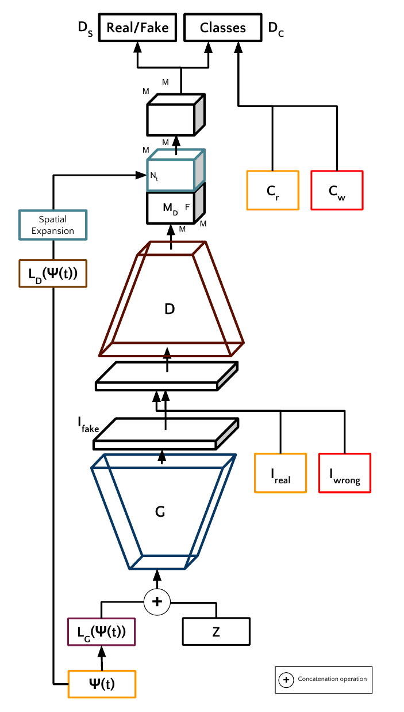

*Figure 2 (PDF p. 2) · [Source](https://arxiv.org/abs/1703.06412)*

### Taiyi-Diffusion-XL

Taiyi-Diffusion-XL (Taiyi-XL) is a Chinese-English bilingual text-to-image model from IDEA-CCNL built by continued pre-training of Stable Diffusion XL. The team first extends an English CLIP model with the most frequently used Chinese characters in its tokenizer and embedding layers and with expanded absolute position encoding, trains it contrastively on bilingual data such as LAION and Wukong, and then swaps it in as SDXL's text encoder. The U-Net and text encoder are trained together at mixed 512×512 and 1024×1024 resolutions and aspect ratios on images re-captioned by a large vision-language model. The technical report shows gains over earlier Chinese and bilingual open models on COCO and COCO-CN, and the 3.5B checkpoint and training code are public.

[Paper](https://arxiv.org/abs/2401.14688) · [Model card](https://huggingface.co/IDEA-CCNL/Taiyi-Stable-Diffusion-XL-3.5B) · [GitHub](https://github.com/IDEA-CCNL/Taiyi-Diffusion-XL) · [Details](models/latent-unet.md#taiyi-diffusion-xl)

*Figure 2 · [Source](https://arxiv.org/abs/2401.14688)*

### Tar

Tar ("Vision as a Dialect") unifies visual understanding and generation by making images literally speak the LLM's language: its Text-Aligned Tokenizer (TA-Tok) converts images into discrete tokens from a codebook initialized from an LLM's text-embedding vocabulary and adapted to vision through learnable projections, so image and text tokens share one embedding space without modality-specific encoders. A single autoregressive multimodal LLM (built on Qwen2.5-Instruct) then predicts both text and text-aligned image tokens with one next-token objective, and a separate generative de-tokenizer (either an autoregressive LlamaGen-style model or a diffusion model built on SANA) decodes the predicted image tokens back into pixels. The paper reports competitive results on visual understanding and text-to-image generation benchmarks, plus emergent compositional abilities such as subject-driven generation and style transfer.

[Paper](https://arxiv.org/abs/2506.18898) · [GitHub](https://github.com/csuhan/Tar) · [Model card](https://huggingface.co/csuhan/Tar-7B) · [Details](models/unified.md#tar)

*Figure 2 · [Source](https://arxiv.org/abs/2506.18898)*

### Text-SeGAN

TAC-GAN variant whose discriminator predicts image source (real/fake) and semantic relevance to the text instead of a class label.

[Paper](https://arxiv.org/abs/1812.05083) · GitHub: no author-linked repository found · [Details](models/gan.md#text-segan)

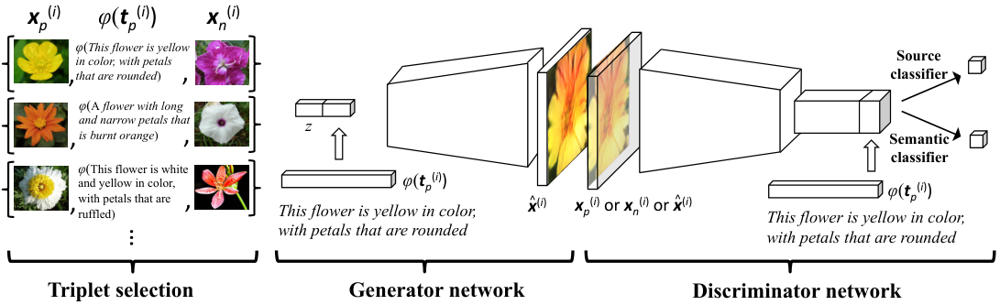

*Figure 3 · [Source](https://arxiv.org/abs/1812.05083)*

### Text2Scene

Text2Scene (CVPR 2019) generates scenes from text by predicting a sequence of objects and their attributes instead of synthesizing pixels with a GAN. At each step it attends to different words to decide what to add and where, producing clip-art scenes, object layouts, or photographic composites assembled from retrieved image segments; this makes the output interpretable object by object.

[Paper](https://arxiv.org/abs/1809.01110) · [GitHub](https://github.com/uvavision/Text2Scene) · [Details](models/early.md#text2scene)

*Figure 2 · [Source](https://arxiv.org/abs/1809.01110)*

### Transfusion

Transfusion is a training recipe from Meta, Waymo and USC for one multimodal model over discrete and continuous data. A single transformer, trained from scratch, predicts the next token for text and denoises continuous image patches with a diffusion loss in the same sequence, so no image quantization is needed. At inference the model samples text token by token and, on emitting a begin-of-image token, switches to diffusion mode to denoise a block of image patches before returning to text. The paper scales it to 7B parameters on 2T multimodal tokens and reports text-to-image generation, image captioning and text benchmarks from the same model.

[Paper](https://arxiv.org/abs/2408.11039) · GitHub: no author-linked repository found · [Details](models/unified.md#transfusion)

*Figure 1 · [Source](https://arxiv.org/abs/2408.11039)*

### UFOGen

UFOGen (Google, 2023) is a one-step text-to-image model that combines diffusion models with a GAN objective. It builds on earlier diffusion-GAN hybrids (DDGAN, SIDDM), which learn large denoising steps adversarially, and modifies the generator parameterization and reconstruction term so that one forward pass from pure noise produces an image. For text-to-image generation, both the generator and the discriminator start from Stable Diffusion 1.5 weights and operate in its latent space, which the paper identifies as key to training a diffusion-GAN at web scale.

[Paper](https://arxiv.org/abs/2311.09257) · GitHub: no author-linked repository found · [Details](models/efficient.md#ufogen)

*Figure 3 · [Source](https://arxiv.org/abs/2311.09257)*

### UMT-BITG (Unifying Multimodal Transformer)

This ACM Multimedia 2021 paper from Sun Yat-sen University and Microsoft Research Asia trains one transformer for both image captioning and text-to-image generation. For generation it fills in a small grid of discrete visual cluster tokens by iterative masked prediction, then renders the grid with a GAN generator; a CLIP-based training loss improves text-image consistency over its predecessor X-LXMERT on MS-COCO.

[Paper](https://arxiv.org/abs/2110.09753) · [GitHub](https://github.com/researchmm/generate-it) · [Details](models/masked.md#generate-it)

*Figure 2 · [Source](https://arxiv.org/abs/2110.09753)*

### UniDiffuser

UniDiffuser, from Tsinghua University, is a diffusion framework that fits every distribution relevant to paired image-text data (image, text, text-to-image, image-to-text and joint image-text generation) with one transformer. It generalizes standard diffusion by perturbing both image and text latents simultaneously and letting each modality carry its own timestep, so setting one modality's timestep to zero recovers ordinary conditional generation such as text-to-image, while other timestep choices give joint or unconditional generation, all without extra network overhead.

[Paper](https://arxiv.org/abs/2303.06555) · [GitHub](https://github.com/thu-ml/unidiffuser) · [Model card](https://huggingface.co/thu-ml/unidiffuser-v1) · [Details](models/unified.md#unidiffuser)

*Figure 4 · [Source](https://arxiv.org/abs/2303.06555)*

### Unified-IO

Unified-IO, from the Allen Institute for AI, is a sequence-to-sequence model that casts a large set of vision, language and multimodal tasks, including image generation, segmentation, depth estimation and captioning, as text-to-sequence problems over one shared vocabulary. Any task input or output that is not natively text (images, dense per-pixel maps, sparse structures) is converted into discrete tokens, so the same encoder-decoder transformer, trained jointly on over 90 datasets, can generate text or images depending on the requested task and prompt.

[Paper](https://arxiv.org/abs/2206.08916) · [GitHub](https://github.com/allenai/unified-io-inference) · [Details](models/unified.md#unified-io)

*Figure 2 · [Source](https://arxiv.org/abs/2206.08916)*

### Unified-IO 2

Unified-IO 2, from the Allen Institute for AI, is an autoregressive encoder-decoder model trained from scratch on text, images, audio and action with a single transformer. Every modality is converted into a sequence of discrete tokens in a shared vocabulary, so the same architecture can generate text, images or audio depending on the requested task, using a multimodal mixture-of-denoisers objective across 120 finetuning datasets. Image generation is one of its documented tasks, alongside image editing, depth and surface-normal prediction, and captioning.

[Paper](https://arxiv.org/abs/2312.17172) · [GitHub](https://github.com/allenai/unified-io-2) · [Details](models/unified.md#unified-io-2)

*Figure 2 · [Source](https://arxiv.org/abs/2312.17172)*

### UniWorld-V1

UniWorld-V1, from Peking University's Yuan group and collaborators, is a unified framework for image understanding, text-to-image generation, image manipulation and image perception tasks such as detection or segmentation rendered as images. Motivated by experiments suggesting that GPT-4o-Image relies on semantic encoders rather than VAEs, it conditions a FLUX diffusion transformer on features from a frozen multimodal LLM (high-level semantics) and from a SigLIP2 encoder (low-level control for reference images). Trained on only 2.7M samples, it is reported to be competitive with BAGEL on image editing benchmarks and scores 0.79 on GenEval.

[Paper](https://arxiv.org/abs/2506.03147) · [GitHub](https://github.com/PKU-YuanGroup/UniWorld) · [Model card](https://huggingface.co/LanguageBind/UniWorld-V1) · [Details](models/unified.md#uniworld)

*Figure 3 · [Source](https://arxiv.org/abs/2506.03147)*

### UPainting

Text-conditional U-Net diffusion model with a jointly fine-tuned pretrained transformer language model encoder, combined at inference with image-text matching (CLIP) guidance.

[Paper](https://arxiv.org/abs/2210.16031) · [Details](models/latent-unet.md#upainting)

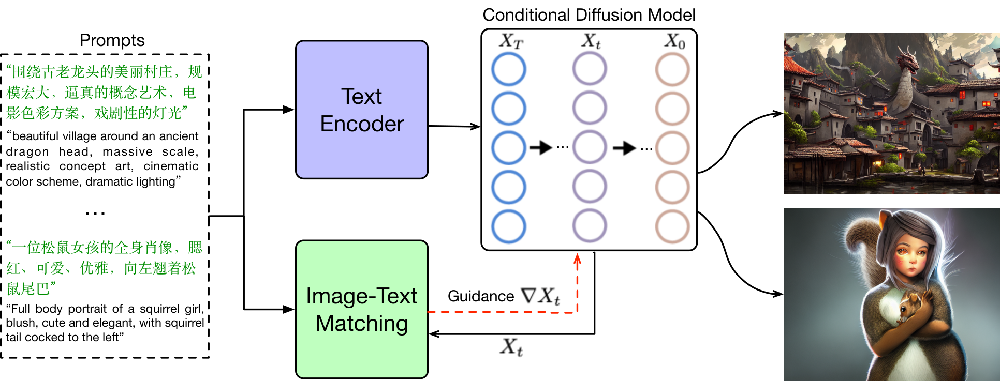

*Figure 2 · [Source](https://arxiv.org/abs/2210.16031)*

### Versatile Diffusion

Multi-flow latent diffusion U-Net with shared global layers and swappable data layers (image ResBlocks or text FCResBlocks) and context layers (CLIP image or text cross-attention), covering text-to-image, image variation, image-to-text and text variation.

[Paper](https://arxiv.org/abs/2211.08332) · [GitHub](https://github.com/SHI-Labs/Versatile-Diffusion) · [Model card](https://huggingface.co/shi-labs/versatile-diffusion) · [Details](models/latent-unet.md#versatile-diffusion)

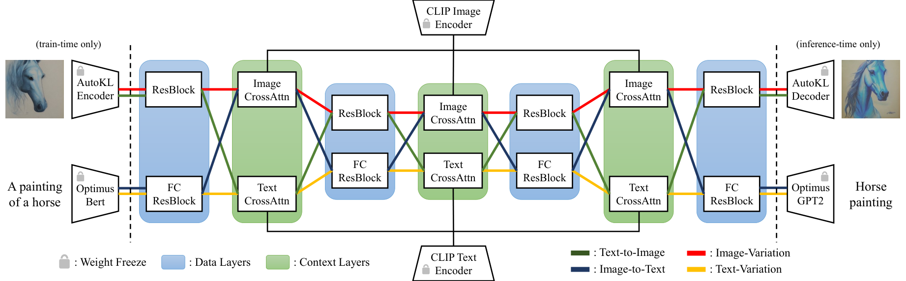

*Figure 3 · [Source](https://arxiv.org/abs/2211.08332)*

### VILA-U

VILA-U, from Tsinghua, MIT, NVIDIA, UC Berkeley and UC San Diego, is a unified foundation model for video, image and language understanding and generation that uses a single next-token prediction framework without a diffusion model. Its unified vision tower discretizes SigLIP-based vision features with residual quantization and is trained with both image reconstruction and text-image contrastive losses, so the same discrete tokens serve perception and generation. The LLM predicts visual token positions autoregressively while a depth transformer predicts the stacked residual codes, and the RQ-VAE-style decoder turns them back into images or video frames.

[Paper](https://arxiv.org/abs/2409.04429) · [GitHub](https://github.com/mit-han-lab/vila-u) · [Model card](https://huggingface.co/mit-han-lab/vila-u-7b-256) · [Details](models/unified.md#vila-u)

*Figure 1 · [Source](https://arxiv.org/abs/2409.04429)*

### VL-GPT

VL-GPT, from Xi'an Jiaotong University, Tencent AI Lab, ARC Lab (Tencent PCG) and HKU, is a generative pretrained transformer for vision-language understanding and generation. Its image tokenizer-detokenizer framework encodes an image into a short sequence of continuous visual embeddings and reconstructs it in pixel space; the embeddings are supervised to carry both image detail and caption semantics. These embeddings and text tokens form one multimodal sequence on which the LLM is trained to predict the next token or embedding, so generated embeddings can be decoded into images. The paper reports captioning, visual question answering, text-to-image generation and in-context multimodal tasks.

[Paper](https://arxiv.org/abs/2312.09251) · [GitHub](https://github.com/AILab-CVC/VL-GPT) · [Details](models/unified.md#vl-gpt)

*Figure 1 · [Source](https://arxiv.org/abs/2312.09251)*

### VQ-Diffusion

VQ-Diffusion (Microsoft Research, 2021) applies denoising diffusion to the discrete token space of a VQ-VAE instead of continuous pixels or latents, using a mask-and-replace corruption process that makes corrupted positions explicit to a transformer denoiser conditioned on text through cross-attention. Because the model is trained to reconstruct tokens from partially masked or corrupted versions of an image, it supports text-guided local image editing as well as text-to-image generation, and the paper reports it avoids the unidirectional bias and error accumulation of autoregressive token models.

[Paper](https://arxiv.org/abs/2111.14822) · [GitHub](https://github.com/microsoft/VQ-Diffusion) · [Details](models/masked.md#vq-diffusion)

*Figure 1 · [Source](https://arxiv.org/abs/2111.14822)*

### Würstchen

Three-stage cascade: a text-conditional ConvNeXt diffusion model generates 16×24×24 semantic latents (Stage C), a latent diffusion U-Net decodes them into VQGAN latents (Stage B), and an f4 VQGAN decoder produces the image (Stage A).

[Paper](https://arxiv.org/abs/2306.00637) · [GitHub 1](https://github.com/dome272/Wuerstchen) · [Model card 1](https://huggingface.co/warp-ai/wuerstchen) · [Announcement](https://stability.ai/news/introducing-stable-cascade) · [GitHub 2](https://github.com/Stability-AI/StableCascade) · [Model card 2](https://huggingface.co/stabilityai/stable-cascade) · [Details](models/latent-unet.md#wuerstchen)

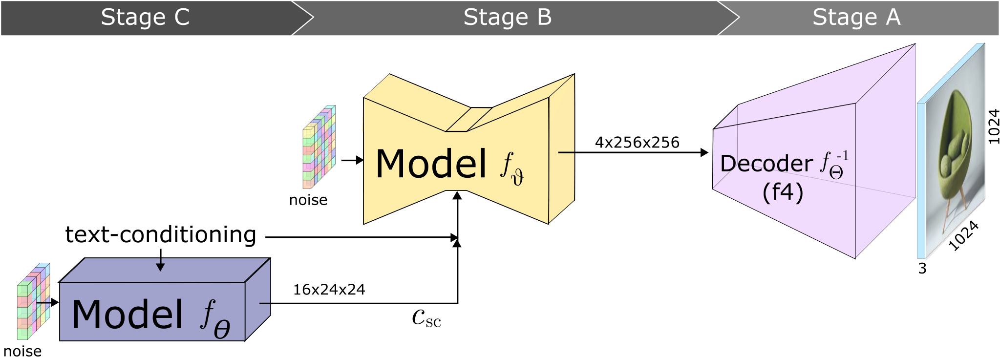

*Figure 2 · [Source](https://arxiv.org/abs/2306.00637)*

### X-LXMERT

X-LXMERT (AI2 and UNC Chapel Hill, EMNLP 2020) asks whether a bidirectional vision-language transformer built for understanding tasks (LXMERT) can also generate images. The authors discretize image regions into visual clusters and add masked visual-token training, so the resulting model can synthesize a coarse token grid from a caption via iterative mask-predict decoding, which a separate GAN-based generator converts into a full image, alongside LXMERT's original captioning and QA abilities.

[Paper](https://arxiv.org/abs/2009.11278) · [GitHub](https://github.com/allenai/x-lxmert) · [Details](models/masked.md#x-lxmert)

*Figure 1 · [Source](https://arxiv.org/abs/2009.11278)*

### X-Omni

X-Omni, from Tencent Hunyuan, argues that discrete autoregressive image generation can be competitive again when combined with reinforcement learning. One autoregressive model handles language and images as next-token prediction over text tokens and semantic image tokens from a frozen SigLIP-VQ tokenizer, and an offline diffusion decoder reconstructs pixels from the generated tokens. GRPO with a reward mix of human-preference, unified-reward, VLM-judged text-image alignment and OCR accuracy scores reduces the artifacts that come from the mismatch between generated tokens and the decoder. The paper reports strong instruction following and long-text rendering in English and Chinese, and introduces LongText-Bench.

[Paper](https://arxiv.org/abs/2507.22058) · [GitHub](https://github.com/X-Omni-Team/X-Omni) · [Model card](https://huggingface.co/X-Omni/X-Omni-En) · [Details](models/unified.md#x-omni)

*Figure 3 · [Source](https://arxiv.org/abs/2507.22058)*

### Z-Image

Z-Image is Alibaba Tongyi's compact, 6.15B-parameter text-to-image foundation model built around a single-stream diffusion transformer (S3-DiT) rather than the dual-stream-then-single-stream designs common in comparable open DiTs. It conditions on a small Qwen3-4B language model for bilingual text understanding and reuses the FLUX VAE for image tokenization, aiming for strong quality and efficiency at a fraction of the parameter count of contemporaries. A distilled Z-Image-Turbo variant combines a decoupled distribution-matching distillation method with reinforcement learning to reach sub-second, 8-step generation on enterprise GPUs, while Z-Image-Edit extends the same backbone with a SigLIP-2 semantic encoder for reference-image editing. Code and both released checkpoints use the Apache-2.0 license.

[Paper](https://arxiv.org/abs/2511.22699) · [GitHub](https://github.com/Tongyi-MAI/Z-Image) · [Model card](https://huggingface.co/Tongyi-MAI/Z-Image-Turbo) · [Details](models/dit.md#z-image)

*Figure 10 · [Source](https://arxiv.org/abs/2511.22699)*

---

Catalog format adapted from [Awesome TTS Architectures](https://github.com/kadirnar/awesome-tts-architectures). [JSON catalog](data/models.json) · [Apache 2.0](LICENSE) · [Third-party figure notice](assets/architectures/FIGURE_NOTICE.md)
