# Text-to-image model descriptions

<!-- Generated by scripts/catalog.py from data/models.json and data/figures.json. Edit the JSON, then regenerate. -->

[← All models](../README.md#models)

**285 model families and releases · Reviewed 2026-09-29**

Short explanations of the catalog's described models, including later releases of older paper families. Each entry includes an image and links to primary sources. Editorial input/output diagrams are labeled. Verified source dates are listed in the [timeline](timeline.md); undated records remain undated.

Model index

- [Adobe Firefly Image](#adobe-firefly)
- [alignDRAW](#aligndraw)
- [Amazon Titan Image Generator](#amazon-titan-image-generator)
- [aMUSEd](#amused)
- [AR-Omni](#ar-omni)
- [ARM](#arm)
- [ART (Anonymous Region Transformer)](#art-multilayer)
- [AuraFlow](#auraflow)
- [B-cos Diffusion Models](#b-cos-diffusion)
- [BAGEL](#bagel)
- [BIT (Bidirectional Image-Text Diffusion Bridges)](#bit)
- [BitDance](#bitdance)
- [BK-SDM](#bk-sdm)
- [BLIP3-o](#blip3-o)
- [BLIP3o-NEXT](#blip3o-next)
- [BLM-SGAN](#blm-sgan)
- [Boogu-Image-0.1](#boogu-image)
- [Bridge](#bridge)
- [CAR (Channel-wise Autoregressive)](#car)
- [Chameleon](#chameleon)
- [CM3](#cm3)
- [CoDi](#codi)
- [CogView](#cogview)
- [CogView-3Plus](#cogview3-plus)
- [CogView2](#cogview2)
- [CogView3](#cogview3)
- [CogView4](#cogview4)
- [Cosmos 3](#cosmos3)
- [DALL·E](#dall-e)
- [DALL·E 3](#dall-e-3)
- [DALL·E Mini](#dall-e-mini)
- [DART](#dart)
- [DC-AR](#dc-ar)
- [DeCo](#deco)
- [DeepGen 1.0](#deepgen-1)
- [Diffusion Fuzzy System (DFS)](#diffusion-fuzzy-system)
- [DiT-Air](#dit-air)
- [DMD2 (Distribution Matching Distillation)](#dmd2)
- [DREAM](#dream)
- [DreamLite](#dreamlite)
- [DreamLLM](#dreamllm)
- [DuetGen](#duetgen)
- [DuoGen](#duogen)
- [E-MMDiT (AMD Nitro-E)](#e-mmdit)
- [Emu (BAAI)](#emu-baai)
- [Emu2](#emu2)
- [Emu3](#emu3)
- [Emu3.5](#emu3-5)
- [ERNIE-Image](#ernie-image)
- [ERNIE-ViLG](#ernie-vilg)
- [FIBO](#fibo)
- [FLAT](#flat)
- [FlowInOne](#flowinone)
- [FlowTok](#flowtok)
- [Fluid](#fluid)
- [FLUX.1](#flux-1)
- [FLUX.1 Kontext](#flux-1-kontext)
- [FLUX.2](#flux-2)
- [FoX](#fox)
- [Gemini native image generation](#gemini-image)
- [GenTron](#gentron)
- [GILL](#gill)
- [GLM-Image](#glm-image)
- [Goku](#goku)
- [GoT](#got)
- [GPT Image 1](#gpt-image-1)
- [GPT Image 2](#gpt-image-2)
- [GRN (Generative Refinement Networks)](#grn)
- [Grok Aurora](#grok-aurora)
- [Grok Imagine Image](#grok-imagine-image)
- [HART](#hart)
- [Hi-MAR](#hi-mar)
- [HiDream-I1](#hidream-i1)
- [HiDream-O1-Image](#hidream-o1-image)
- [Home-made Diffusion Model (HDM)](#hdm)
- [Hunyuan-DiT](#hunyuan-dit)
- [HunyuanImage 3.0](#hunyuanimage-3)
- [HunyuanImage-2.1](#hunyuanimage-2-1)
- [Hyper-SD](#hyper-sd)
- [i1](#i1)
- [Ideogram](#ideogram)
- [Ideogram 4.0](#ideogram-4)
- [ILLUME](#illume)
- [ILLUME+](#illume-plus)
- [ILLUME-X](#illume-x)
- [ImageBART](#imagebart)
- [Imagen 2](#imagen-2)
- [Imagen 3](#imagen-3)
- [Imagen 4](#imagen-4)
- [Imagine Flash](#imagine-flash)
- [Infinity](#infinity)
- [InfinityStar](#infinitystar)
- [InstaFlow](#instaflow)
- [Instella-T2I](#instella-t2i)
- [InternVL-U](#internvl-u)
- [Janus](#janus)
- [Janus-Pro](#janus-pro)
- [JanusFlow](#janusflow)
- [JEPA-T](#jepa-t)
- [JetFormer](#jetformer)
- [JoyAI-Image](#joyai-image)
- [JuZhou 1.0](#juzhou-1)
- [Kandinsky 5.0 Image Lite](#kandinsky-5)
- [KNN-Diffusion](#knn-diffusion)
- [KOALA](#koala)
- [Kolors](#kolors)
- [Kolors 2.0](#kolors-2)
- [Krea 2](#krea-2)
- [L-Verse](#l-verse)
- [LaDe](#lade)
- [Latent Consistency Models (LCM)](#lcm)
- [Lavida-O](#lavida-o)
- [LaVIT](#lavit)
- [LaytonGen](#laytongen)
- [Lens](#lens)
- [LI-DiT](#li-dit)
- [Libra-2](#libra-2)
- [LightFusion](#lightfusion)
- [LightGen](#lightgen)
- [LINA](#lina)
- [Liquid](#liquid)
- [LLaDA-Image](#llada-image)
- [LLaDA-o](#llada-o)
- [LLaDA2.0-Uni](#llada2-uni)
- [LlamaGen](#llamagen)
- [LongCat-Image](#longcat-image)
- [LongCat-Next](#longcat-next)
- [LongTextAR](#longtextar)
- [Luma Uni-1](#luma-uni-1)
- [Lumina-DiMOO](#lumina-dimoo)
- [Lumina-Image 2.0](#lumina-image-2)
- [Lumina-mGPT](#lumina-mgpt)
- [Lumina-mGPT 2.0](#lumina-mgpt-2)
- [Lumina-Next](#lumina-next)
- [Lumina-T2X (Lumina-T2I)](#lumina-t2x)
- [LWM](#lwm)
- [M6](#m6)
- [M6-UFC](#m6-ufc)
- [Mage-Flow](#mage-flow)
- [MAI-Image](#mai-image)
- [Make-A-Scene](#make-a-scene)
- [MammothModa2](#mammothmoda2)
- [Manzano](#manzano)
- [MARS](#mars-t2i)
- [MaskGen](#maskgen)
- [MaskGIL](#maskgil)
- [MedUnifier](#medunifier)
- [Meissonic](#meissonic)
- [MetaMorph](#metamorph)
- [MetaQuery](#metaquery)
- [Midjourney](#midjourney)
- [MindOmni](#mindomni)
- [Ming-Lite-Uni](#ming-lite-uni)
- [Ming-Omni](#ming-omni)
- [Ming-UniVision](#ming-univision)
- [MiniMax Image-01](#minimax-image-01)
- [MM-Interleaved](#mm-interleaved)
- [MMaDA](#mmada)
- [MMCORE](#mmcore)
- [MMFace-DiT](#mmface-dit)
- [Mobile-O](#mobile-o)
- [MobileDiffusion](#mobilediffusion)
- [Mogao](#mogao)
- [MonoFormer](#monoformer)
- [Moonworks Lunara](#moonworks-lunara)
- [MoS (Mixture of States)](#mos)
- [Muddit](#muddit)
- [Mural](#mural)
- [Muse](#muse)
- [Muse Image](#muse-image)
- [NAMI](#nami)
- [Nemotron-Labs-Diffusion-Image](#nemotron-labs-diffusion-image)
- [NeoBabel](#neobabel)
- [NExT-GPT](#next-gpt)
- [NextFlow](#nextflow)
- [NextStep-1](#nextstep-1)
- [Nexus](#nexus)
- [Nexus-Gen](#nexus-gen)
- [Normalizing Trajectory Models](#ntm)
- [Nucleus-Image](#nucleus-image)
- [NÜWA](#nuwa)
- [oboro:](#oboro)
- [OFA](#ofa)
- [Omni-Dish](#omni-dish)
- [OmniGen](#omnigen)
- [OmniGen-AR](#omnigen-ar)
- [OmniGen2](#omnigen2)
- [OmniMamba](#omnimamba)
- [OneCAT](#onecat)
- [OneFlow](#oneflow)
- [Orthus](#orthus)
- [Ovis-Image](#ovis-image)
- [Ovis-U1](#ovis-u1)
- [Paella](#paella)
- [PAR (Panoramic AutoRegressive)](#par-panorama)
- [Parallel Multiscale PixelCNN](#multiscale-pixelcnn)
- [Paris](#paris)
- [Parti](#parti)
- [PixArt-δ](#pixart-delta)
- [PixArt-Σ](#pixart-sigma)
- [PixelDiT](#pixeldit)
- [PixelFlow](#pixelflow)
- [PixNerd](#pixnerd)
- [Playground v2](#playground-v2)
- [Playground v3](#playground-v3)
- [ProxT2I](#proxt2i)
- [PS-VAE](#ps-vae)
- [PSP-DiT](#psp-dit)
- [PUMA](#puma)
- [Query-Kontext](#query-kontext)
- [Qwen-Image](#qwen-image)
- [Qwen-Image-2.0](#qwen-image-2)
- [Qwen-Image-Flash](#qwen-image-flash)
- [Recraft](#recraft)
- [Reve Image](#reve-image)
- [ruDALL-E](#rudall-e)
- [SANA](#sana)
- [SANA 1.5](#sana-1-5)
- [SANA-Sprint](#sana-sprint)
- [SD3-Turbo (Latent Adversarial Diffusion Distillation)](#sd3-turbo)
- [SDXL Turbo (Adversarial Diffusion Distillation)](#sdxl-turbo)
- [SDXL-Lightning](#sdxl-lightning)
- [SDXS](#sdxs)
- [SEED-LLaMA](#seed-llama)
- [SEED-X](#seed-x)
- [Seedream 2.0](#seedream-2)
- [Seedream 3.0](#seedream-3)
- [Seedream 4.0](#seedream-4)
- [Seedream 5.0](#seedream-5)
- [SeFi-Image](#sefi-image)
- [Self-E](#self-e)
- [SenseNova-U1](#sensenova-u1)
- [Show-o](#show-o)
- [Show-o2](#show-o2)
- [SimpleAR](#simplear)
- [Skywork UniPic](#skywork-unipic)
- [Skywork UniPic 2.0](#skywork-unipic-2)
- [SnapFusion](#snapfusion)
- [SnapGen](#snapgen)
- [SSD-1B](#ssd-1b)
- [Stable Diffusion 3](#stable-diffusion-3)
- [STAR](#star-t2i)
- [STARFlow](#starflow)
- [STARFlow2](#starflow2)
- [SVG-T2I](#svg-t2i)
- [Swift-Image](#swift-image)
- [SwiftBrush](#swiftbrush)
- [Switti](#switti)
- [SynerGen-VL](#synergen-vl)
- [Taiyi-Diffusion-XL](#taiyi-diffusion-xl)
- [Tar](#tar)
- [TerraDiT](#terradit)
- [Text2Earth](#text2earth)
- [Text2Scene](#text2scene)
- [TMDM-3B](#tmdm-3b)
- [Transfusion](#transfusion)
- [Transition Matching (DTM, ARTM, FHTM)](#transition-matching)
- [UFOGen](#ufogen)
- [UGen](#ugen)
- [UMT-BITG (Unifying Multimodal Transformer)](#generate-it)
- [UniAlignment](#unialignment)
- [UniCMs](#unicms)
- [UniDiffuser](#unidiffuser)
- [UniDisc](#unidisc)
- [Unified-IO](#unified-io)
- [Unified-IO 2](#unified-io-2)
- [UniFusion](#unifusion)
- [UniGen-1.5](#unigen-1-5)
- [UniGen-AR](#unigen-ar)
- [UniModel](#unimodel)
- [UniPath](#unipath)
- [UniSpace](#unispace)
- [UniVG](#univg)
- [UniWorld-Design](#uniworld-design)
- [UniWorld-V1](#uniworld)
- [VARGPT-v1.1](#vargpt-v1-1)
- [VILA-U](#vila-u)
- [VL-GPT](#vl-gpt)
- [VQ-Diffusion](#vq-diffusion)
- [VUGEN](#vugen)
- [X-Fusion](#x-fusion)
- [X-LXMERT](#x-lxmert)
- [X-Omni](#x-omni)
- [Z-Image](#z-image)
- [Z-Image Turbo++](#z-image-turbo-pp)

## Descriptions

### Adobe Firefly Image

Adobe Firefly is Adobe's family of generative models, announced on 2023-03-21 with a first model for text-to-image generation and text effects that Adobe says was trained on Adobe Stock, openly licensed and public-domain content. Successive Firefly Image models followed: Image 2 (October 2023) with Generative Match for style guidance from an uploaded reference image, Image 3 (April 2024) with Structure Reference and Style Reference, Image 4 and 4 Ultra (April 2025) with output up to 2K, and Image 5 (October 2025, public beta) with native 4MP output and Prompt to Edit, which edits an image from a plain-language instruction. The models are offered in the Firefly app, Adobe's Creative Cloud products and the Firefly API; Adobe does not publish their architecture.

[Architecture and figure](../models/api.md#adobe-firefly) · [Announcement 1](https://news.adobe.com/news/news-details/2023/Adobe-Unveils-Firefly-a-Family-of-new-Creative-Generative-AI/default.aspx) · [Announcement 2](https://news.adobe.com/news/news-details/2023/adobe-releases-next-generation-of-firefly-models) · [Announcement 3](https://news.adobe.com/news/news-details/2024/adobe-introduces-firefly-image-3-foundation-model-to-take-creative-exploration-and-ideation-to-new-heights) · [Announcement 4](https://news.adobe.com/news/2025/04/adobe-revolutionizes-ai-assisted-creativity-firefly) · [Announcement 5](https://news.adobe.com/news/2025/10/adobe-max-2025-firefly) · [Docs 1](https://developer.adobe.com/firefly-services/docs/firefly-api/) · [Docs 2](https://developer.adobe.com/firefly-services/docs/firefly-api/guides/how-tos/firefly-generate-image-api-tutorial)

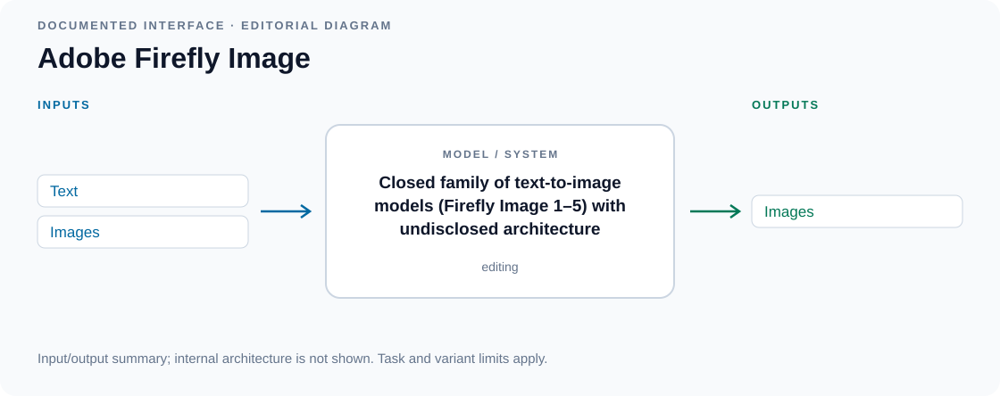

*Editorial input/output diagram · [Source](https://news.adobe.com/news/2025/10/adobe-max-2025-firefly)*

### alignDRAW

alignDRAW (ICLR 2016) is one of the first neural models to generate images from free-form captions. It extends the DRAW recurrent VAE so that each drawing step attends to the relevant words of the caption, accumulating patches on a canvas; trained on Microsoft COCO at 32 × 32 pixels, it produces blurry but compositionally novel scenes such as a stop sign flying in blue skies.

[Architecture and figure](../models/early.md#aligndraw) · [Paper](https://arxiv.org/abs/1511.02793) · [GitHub](https://github.com/mansimov/text2image)

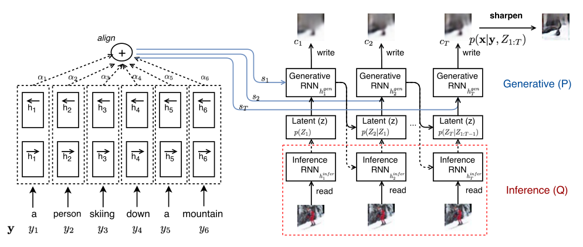

*Figure 2 · [Source](https://arxiv.org/abs/1511.02793)*

### Amazon Titan Image Generator

Amazon Titan Image Generator is Amazon's image generation model on Amazon Bedrock, announced in public preview on 2023-11-29 (`amazon.titan-image-generator-v1`, later documented as G1). It generates images from English prompts and edits uploaded images through inpainting and outpainting with a user mask or a text-derived mask from a built-in segmentation model, image variations from one to five input images, and mask-free text-prompted editing. Titan Image Generator v2, generally available from August 2024, adds image conditioning on a reference image's layout, color-palette guidance, background removal and subject-consistency fine-tuning. All outputs carry an invisible watermark and C2PA metadata. AWS does not publish the model architecture.

[Architecture and figure](../models/api.md#amazon-titan-image-generator) · [Announcement 1](https://aws.amazon.com/blogs/aws/amazon-titan-image-generator-multimodal-embeddings-and-text-models-are-now-available-in-amazon-bedrock/) · [Announcement 2](https://aws.amazon.com/blogs/aws/amazon-titan-image-generator-v2-is-now-available-in-amazon-bedrock/) · [Docs](https://docs.aws.amazon.com/bedrock/latest/userguide/titan-image-models.html)

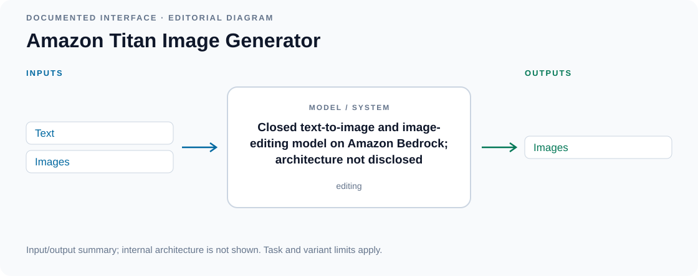

*Editorial input/output diagram · [Source](https://docs.aws.amazon.com/bedrock/latest/userguide/titan-image-models.html)*

### aMUSEd

aMUSEd (Hugging Face, STUDIO EY and Amazon, 2024) is an open, 10x-smaller reproduction of Google's unreleased Muse model, replacing Muse's frozen T5-XXL text encoder with a smaller CLIP-L/14 encoder and using a single U-ViT masked-token transformer instead of a two-stage base-plus-super-resolution pipeline. The 256px and 512px checkpoints prioritize fast, low-resource inference and are released with training and inference code.

[Architecture and figure](../models/masked.md#amused) · [Paper](https://arxiv.org/abs/2401.01808) · [GitHub](https://github.com/huggingface/open-muse) · [Model card](https://huggingface.co/amused/amused-256)

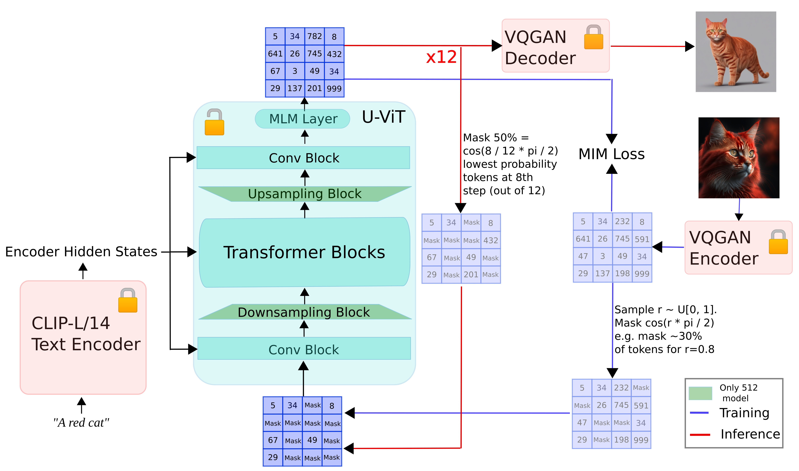

*Figure 1 · [Source](https://arxiv.org/abs/2401.01808)*

### AR-Omni

AR-Omni is a unified autoregressive model for 'omni' multimodal understanding and generation, handling text, image and speech within one Transformer decoder and shared token vocabulary rather than routing modalities to separate expert modules. Initialized from the Anole interleaved image-text model and extended to speech, it addresses modality imbalance with task-aware loss reweighting, improves visual quality with a perceptual alignment loss, and manages the stability-creativity trade-off in generation with finite-state decoding. The paper reports strong performance across text, image and speech tasks while keeping real-time capability, including a 0.88 real-time factor for speech generation.

[Architecture and figure](../models/unified.md#ar-omni) · [Paper](https://arxiv.org/abs/2601.17761) · [GitHub](https://github.com/ModalityDance/AR-Omni) · [Project](https://modalitydance.github.io/AR-Omni/)

*Figure 1 · [Source](https://arxiv.org/abs/2601.17761)*

### ARM

ARM unifies image understanding, text-to-image generation and instruction-based editing within one next-token-prediction framework built around a discrete semantic visual tokenizer. The tokenizer projects frozen SigLIP2 features through Finite Scalar Quantization into a 65K-token discrete codebook, trained jointly with caption, pixel-reconstruction, contrastive and feature-distillation losses so the tokens carry both semantic and low-level information; a FLUX.1-dev-initialized latent diffusion decoder reconstructs pixels from the tokens. A 7B autoregressive transformer initialized from Qwen2.5-7B, with an added linear head for visual-token prediction, is pretrained on 2.5T multimodal tokens and then optimized with reinforcement learning, which the authors report substantially improves text-to-image and editing metrics (WISE score 0.50 to 0.56) and induces cross-task synergy between the two.

[Architecture and figure](../models/unified.md#arm) · [Paper](https://arxiv.org/abs/2606.11188) · [GitHub](https://github.com/wdrink/ARM)

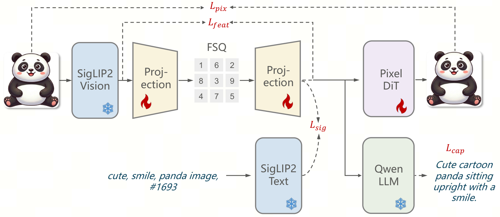

*Figure 2 · [Source](https://arxiv.org/abs/2606.11188)*

### ART (Anonymous Region Transformer)

ART (Microsoft Research Asia with Tsinghua, Peking and USTC) generates multi-layer transparent images, such as graphic designs, from a global text prompt and an anonymous region layout: a set of bounding boxes with no per-region captions, so the model decides which text content belongs in which region. An MMDiT based on FLUX.1-dev is turned into a multi-layer generator by encoding each token's width, height and layer index in a layout-conditional 3D RoPE; a layer-wise region crop keeps only the visual tokens inside each region, which the authors report to be over 12 times faster than full attention and makes 50-plus layers practical. A separate multi-layer transparency autoencoder encodes and decodes the RGBA layers jointly with a ViT built on the frozen FLUX VAE. Layouts can be predicted from the prompt by a fine-tuned Llama-3.1-8B planner. The system is trained on a private dataset of about one million multi-layer transparent designs.

[Architecture and figure](../models/dit.md#art-multilayer) · [Paper](https://arxiv.org/abs/2502.18364) · [GitHub](https://github.com/microsoft/art-msra)

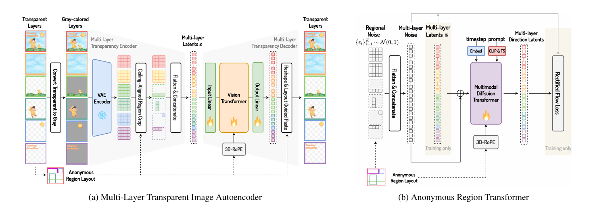

*Figure 4 (PDF p. 4) · [Source](https://arxiv.org/abs/2502.18364)*

### AuraFlow

AuraFlow is an open text-to-image model from fal, developed with researcher Simo Ryu and released as v0.1 in July 2024 as the largest fully open flow-based text-to-image model at the time. It is a rectified-flow transformer that starts from the MMDiT design of Stable Diffusion 3 but keeps only a few joint text-image blocks, replacing the rest with plain DiT blocks for better hardware efficiency, and is scaled to 6.8B parameters with a wide, shallow shape. The launch post attributes its prompt following to fully synthetic captions and reports competitive GenEval scores; later v0.2 and v0.3 checkpoints continued training and aesthetic fine-tuning.

[Architecture and figure](../models/dit.md#auraflow) · [Announcement](https://blog.fal.ai/auraflow/) · [Model card 1](https://huggingface.co/fal/AuraFlow) · [Model card 2](https://huggingface.co/fal/AuraFlow-v0.3) · GitHub: no author-linked repository found

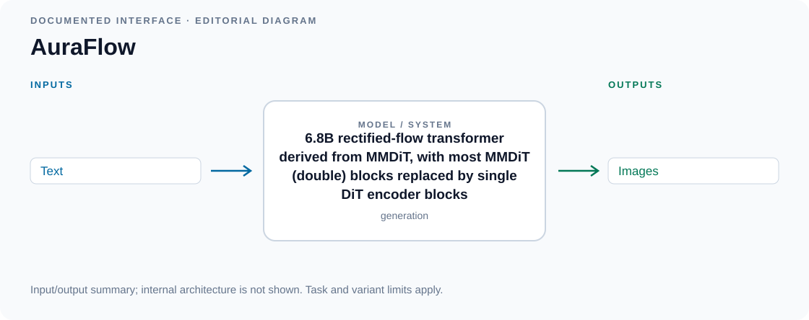

*Source-based architecture diagram · [Source](https://huggingface.co/fal/AuraFlow)*

### B-cos Diffusion Models

This paper extends B-cos networks, which make a model's output a dynamic linear function of its input to give faithful explanations, to text-to-image diffusion. The authors build the Stable Diffusion 2.1 U-Net from B-cos modules, drop the VAE to keep the explanation in pixel space, and train variants that predict the clean image x0 or the noise epsilon and that use either a B-cos token embedding or the frozen CLIP text encoder. Because the denoiser is interpretable by construction, the model can show which pixel regions each prompt token influenced and can flag prompt elements that the generated image failed to represent.

[Architecture and figure](../models/pixel-diffusion.md#b-cos-diffusion) · [Paper](https://arxiv.org/abs/2507.03846) · GitHub: no author-linked repository found

*Figure 4 (PDF p. 9) · [Source](https://arxiv.org/abs/2507.03846)*

### BAGEL

BAGEL (Scalable Generative Cognitive Model) is ByteDance Seed's open unified model for multimodal understanding and generation, with 7B active and 14B total parameters. One decoder-only transformer, split into an understanding expert and a generation expert that attend to the same interleaved token sequence, predicts text by next-token prediction and images by rectified flow over VAE latents. It is pretrained on trillions of tokens of text, image-text pairs and interleaved web and video data, and the paper reports text-to-image results on GenEval and WISE, image editing on GEdit-Bench and an intelligent-editing benchmark, and optional reasoning (thinking) before generation or editing.

[Architecture and figure](../models/unified.md#bagel) · [Paper](https://arxiv.org/abs/2505.14683) · [GitHub](https://github.com/ByteDance-Seed/Bagel) · [Model card](https://huggingface.co/ByteDance-Seed/BAGEL-7B-MoT)

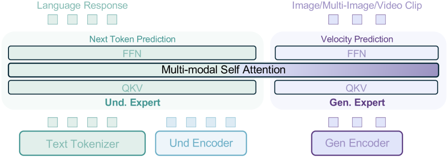

*Figure 2 · [Source](https://arxiv.org/abs/2505.14683)*

### BIT (Bidirectional Image-Text Diffusion Bridges)

BIT (Bidirectional Image-Text Diffusion Bridges), from Stanford University, reframes text-to-image diffusion as a bidirectional bridge between text and image data rather than a one-way noise-to-image process. Instead of starting from Gaussian noise and injecting a text prompt as side conditioning, BIT constructs a stochastic process that interpolates directly between continuous text-token representations and image pixels, so the same DiT-XL/2 network can run forward (text-to-image) or its analytically derived time-reversal (image-to-text captioning). The authors argue this source-aware, reversible path supports richer sampling algorithms — such as retracing a generation to recover an approximate caption, or generating semantically related image variants — and show it is competitive with standard diffusion and flow-matching baselines on text-to-image and image-to-text benchmarks as well as on a scientific cell-fate modeling task.

[Architecture and figure](../models/dit.md#bit) · [Paper](https://arxiv.org/abs/2608.27885) · [GitHub](https://github.com/gabeguo/bit_diffusion) · [Project](https://bit-diffusion.github.io)

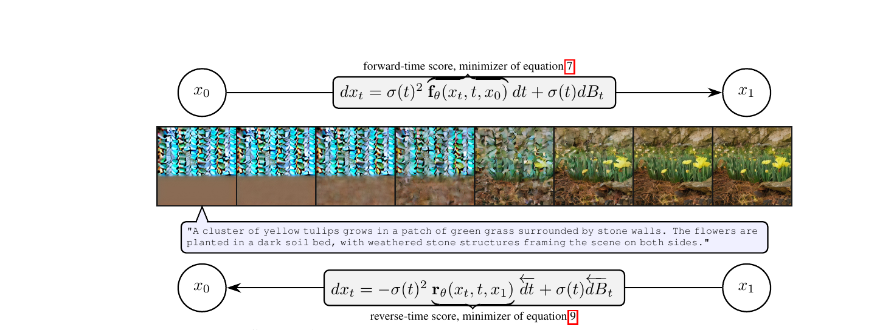

*Figure 1 (PDF p. 3) · [Source](https://arxiv.org/abs/2608.27885)*

### BitDance

BitDance (ByteDance with CUHK and other institutions) is an autoregressive image generator whose visual tokens are binary vectors from a lookup-free quantization tokenizer with vocabularies up to 2^256 states. Because a softmax over that many indices is impractical, a small DiT-style diffusion head treats each token as a vertex of a hypercube, generates it with rectified-flow sampling in continuous space conditioned on the transformer's hidden state, and snaps the result back to ±1. The same head samples a whole p×p patch of tokens at once (next-patch diffusion), under a block-wise causal mask, so many tokens are produced per step. For text-to-image generation a 14B model initialized from Qwen3-14B serves as both text encoder and image generator, uses a 16×-downsampling tokenizer and generates up to 1024×1024 images, with 16 or, after a short distillation stage, 64 tokens per step; the paper reports over 30× speedup over prior next-token AR models at 1024px.

[Architecture and figure](../models/continuous-ar.md#bitdance) · [Paper](https://arxiv.org/abs/2602.14041) · [GitHub](https://github.com/shallowdream204/BitDance) · [Model card](https://huggingface.co/shallowdream204/BitDance-14B-64x)

*Figure 4 (PDF p. 6) · [Source](https://arxiv.org/abs/2602.14041)*

### BK-SDM

BK-SDM (Nota Inc., 2023) compresses Stable Diffusion architecturally rather than by reducing steps. Pairs of residual and cross-attention blocks are removed from the down and up stages of the U-Net; the Small variant also removes the mid-stage, and Tiny removes the innermost stages as well, giving 30–50% reductions in size, compute and latency. The pruned U-Net is initialized from the original weights and retrained to imitate the original U-Net's noise predictions and intermediate feature maps, which the paper shows works with only 0.22M LAION image-text pairs and about 13 A100 days. The same recipe is applied to SD v1.4 and SD v2.1-base, and the compressed models are also used for DreamBooth personalization, image-to-image translation and on-device deployment.

[Architecture and figure](../models/efficient.md#bk-sdm) · [Paper](https://arxiv.org/abs/2305.15798) · [GitHub](https://github.com/Nota-NetsPresso/BK-SDM) · [Model card](https://huggingface.co/nota-ai/bk-sdm-small)

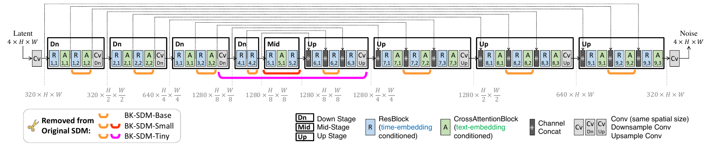

*Figure 3 (PDF p. 5) · [Source](https://arxiv.org/abs/2305.15798)*

### BLIP3-o

BLIP3-o is an open family of unified multimodal models from Salesforce Research and collaborators that adds image generation to a frozen Qwen2.5-VL understanding model. Instead of generating VAE latents, a diffusion transformer generates semantically rich CLIP image features conditioned on the language model's outputs, and a diffusion decoder turns those features into an image. The paper compares CLIP and VAE targets with MSE and flow-matching objectives, argues for sequential training (understanding first, then generation), and releases code, weights, pretraining captions and the BLIP3o-60k instruction-tuning set.

[Architecture and figure](../models/unified.md#blip3-o) · [Paper](https://arxiv.org/abs/2505.09568) · [GitHub](https://github.com/JiuhaiChen/BLIP3o) · [Model card](https://huggingface.co/BLIP3o/BLIP3o-Model-8B)

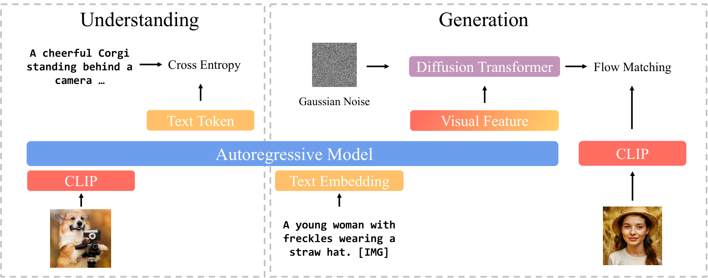

*Figure 1 · [Source](https://arxiv.org/abs/2505.09568)*

### BLIP3o-NEXT

BLIP3o-NEXT is the successor to BLIP3-o in the BLIP3 series, positioned as a native image generation model that handles text-to-image generation and image editing in one Autoregressive + Diffusion architecture of about 3B parameters. Unlike BLIP3-o, the autoregressive model now predicts discrete image tokens, which makes GRPO reinforcement learning with verifiable rewards (GenEval-style composition and text rendering) directly applicable, and a diffusion transformer conditioned on the tokens' hidden states renders the final image. The paper also describes consistency techniques for editing, including a reconstruction task and VAE-latent conditioning of the diffusion model.

[Architecture and figure](../models/continuous-ar.md#blip3o-next) · [Paper](https://arxiv.org/abs/2510.15857) · [GitHub](https://github.com/JiuhaiChen/BLIP3o) · [Model card](https://huggingface.co/BLIP3o/BLIP3o-NEXT-SFT-3B)

*Figure 1 · [Source](https://arxiv.org/abs/2510.15857)*

### BLM-SGAN

BLM-SGAN (Bidirectional Language-Modeling Semantic-Spatial GAN) revisits the standard SSA-GAN-style one-stage text-to-image GAN pipeline and replaces its sequential LSTM-based text encoder with BERT, arguing that bidirectional attention over the full caption yields richer contextual word and sentence features than left-to-right recurrent encoding. Sentence features modulate a stack of 7 SSACN blocks that progressively upsample a noise vector to a 256x256 image, while word features are fed spatially to the same blocks and to the discriminator; the discriminator is trained with a Matching-Aware Gradient Penalty. Evaluated on the CUB bird dataset, the model reaches an Inception Score of 5.45, ahead of prior GAN baselines such as SSA-GAN, DF-GAN and AttnGAN under the same protocol.

[Architecture and figure](../models/gan.md#blm-sgan) · [Paper](https://arxiv.org/abs/2606.08847) · [GitHub](https://github.com/haidy-maher/BLM-SGAN-Text-to-Image-Generation)

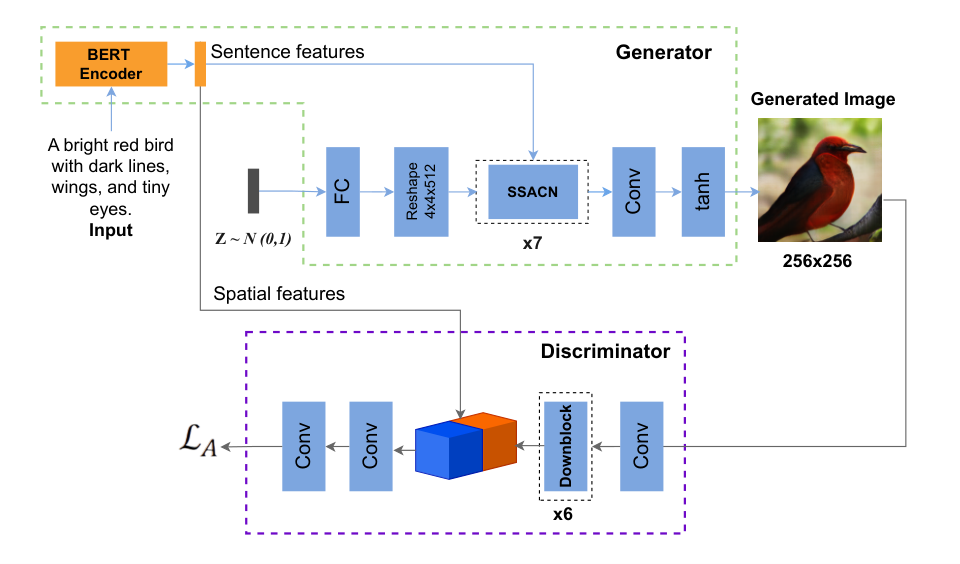

*Figure 2 · [Source](https://arxiv.org/abs/2606.08847)*

### Boogu-Image-0.1

Boogu-Image-0.1 is an open-source unified image generation and instruction-editing model family that argues open text-to-image models can close the gap to closed-source systems primarily by strengthening instruction understanding — via a stronger Qwen3-VL-8B encoder, agentic prompt rewriting, model routing between Base/Turbo variants, and inference-time reflection — together with data-quality and training-pipeline improvements, rather than through architectural scale. Trained from scratch on 208.62M unique images at a reported cost of about $400K, it reports performance competitive with or approaching leading closed-source systems on the authors' Boogu Arena and on Qwen-Image-Bench, and releases weights, code and training recipes under Apache-2.0.

[Architecture and figure](../models/dit.md#boogu-image) · [Paper](https://arxiv.org/abs/2607.13125) · [GitHub](https://github.com/Boogu-Project/Boogu-Image) · [Model card](https://huggingface.co/Boogu/Boogu-Image-0.1-Base)

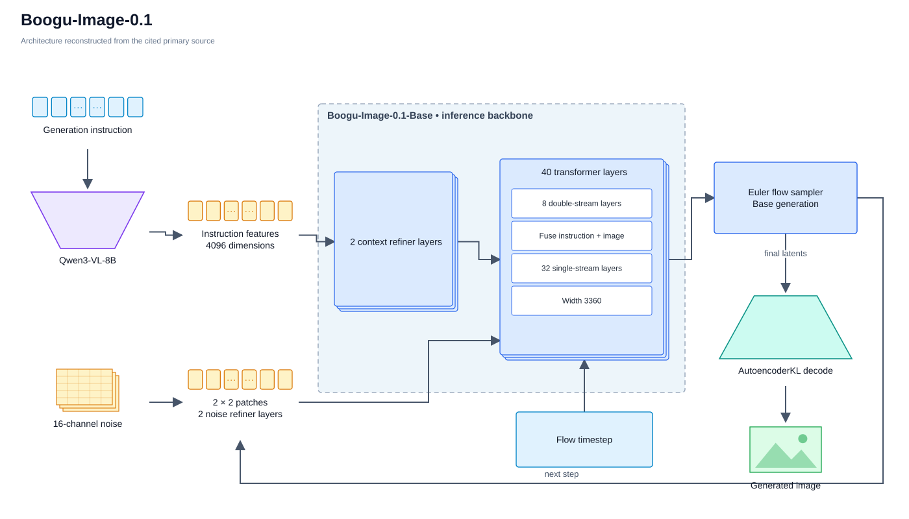

*Source-based architecture diagram · [Source](https://huggingface.co/Boogu/Boogu-Image-0.1-Base)*

### Bridge

Bridge (University of Maryland, CUHK MMLab and ByteDance) adds image generation to a pre-trained understanding MLLM while staying purely autoregressive. It copies the InternVL3-8B language backbone into a trainable generation expert and keeps the original model, including its continuous vision encoder, frozen as the understanding expert, with hard routing of tokens between experts and joint causal attention. Images for generation are represented as a short run of semantic tokens followed by pixel tokens, which the authors compare to chain-of-thought and which adds only 7.9% to the sequence length over pixel tokens alone. Training has three stages (large pretraining, a 60M-sample refinement and 28M-sample SFT) and an optional upscaling module raises 512px outputs to 1024px. The paper reports GenEval 0.82, DPG-Bench 85.51 and WISE 0.69, plus understanding results inherited from InternVL3 and ImgEdit editing.

[Architecture and figure](../models/unified.md#bridge) · [Paper](https://arxiv.org/abs/2510.01546) · [GitHub](https://github.com/hywang66/Bridge) · [Project](https://hywang66.github.io/bridge/)

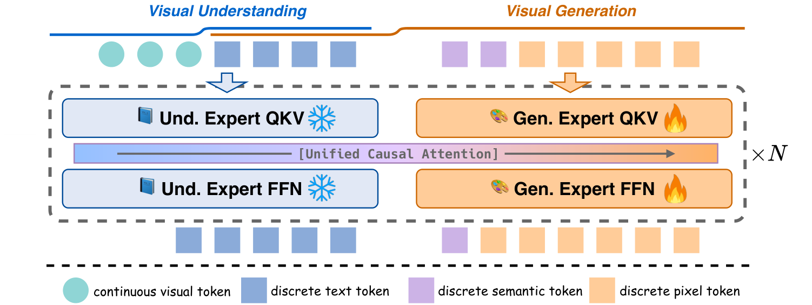

*Figure 2 · [Source](https://arxiv.org/abs/2510.01546)*

### CAR (Channel-wise Autoregressive)

CAR reframes autoregressive image generation around channels instead of spatial patches. Its Channel-wise Vector Quantization (CVQ) tokenizer quantizes each h x w channel slice of the encoder's feature map against a codebook of h x w matrices, achieving full codebook utilization and better reconstruction than conventional patch-wise VQ. The Channel-wise Autoregressive (CAR) model then predicts these channel tokens one at a time, conditioned on text through a pretrained Qwen3-4B or Qwen3-8B backbone, so generation proceeds from broad global structure (few channels) to progressively enriched visual detail (many channels), evaluated purely on text-to-image benchmarks.

[Architecture and figure](../models/ar-token.md#car) · [Paper](https://arxiv.org/abs/2605.26089) · [GitHub](https://github.com/songweii/CVQ)

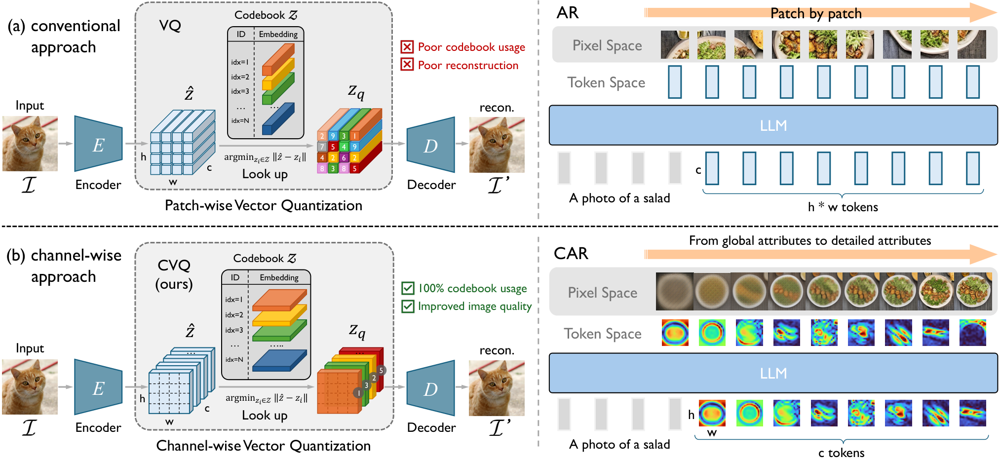

*Figure 3 · [Source](https://arxiv.org/abs/2605.26089)*

### Chameleon

Chameleon is Meta FAIR's family of early-fusion, token-based mixed-modal models. Images are quantized into discrete tokens that share a single vocabulary with text, so one autoregressive transformer trained from scratch on interleaved image-text data can read and write arbitrary sequences of text and images, including text-to-image generation, captioning, visual question answering and long-form mixed-modal documents. The paper documents image generation, but the publicly released 7B and 34B checkpoints were published without image generation: Meta's release announcement states that the image generation model was not released and that the released models produce text-only output.

[Architecture and figure](../models/unified.md#chameleon) · [Paper 1](https://arxiv.org/abs/2405.09818) · [GitHub 1](https://github.com/facebookresearch/chameleon) · [Announcement](https://ai.meta.com/blog/meta-fair-research-new-releases/) · [Paper 2](https://arxiv.org/abs/2407.06135) · [GitHub 2](https://github.com/GAIR-NLP/anole)

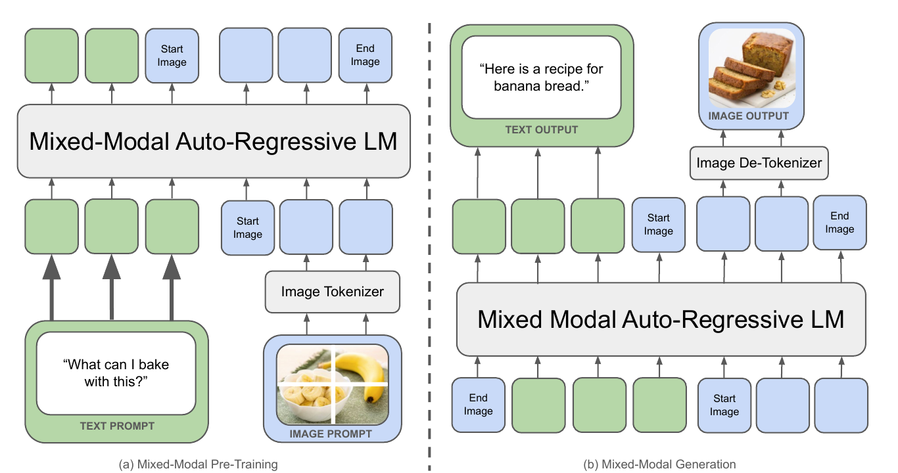

*Figure 1 (PDF p. 2) · [Source](https://arxiv.org/abs/2405.09818)*

### CM3

CM3 (Causally-Masked Multimodal Modeling), from Meta AI, extends structured-document pretraining to full HTML documents including images and hyperlinks. Every  tag's image is resized and tokenized into discrete VQGAN codes that are inserted as text into the tag's src attribute, so a single decoder-only transformer trained purely with next-token prediction over document structure can later be prompted, zero-shot, to generate an image for a caption by producing an  tag whose predicted tokens are decoded back to pixels.

[Architecture and figure](../models/unified.md#cm3) · [Paper](https://arxiv.org/abs/2201.07520) · GitHub: no author-linked repository found

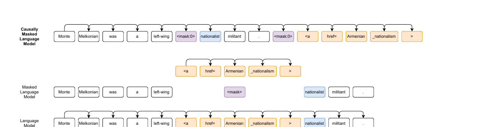

*Figure 1 (PDF p. 3) · [Source](https://arxiv.org/abs/2201.07520)*

### CoDi

CoDi (Composable Diffusion), from the University of North Carolina and Microsoft Azure Cognitive Services Research, is an any-to-any generative model that produces any combination of text, image, video and audio outputs from any combination of input modalities in a single generation pass, including modality pairs never seen jointly in training. It starts from individually pretrained latent diffusion models per modality, aligns their conditioning encoders in a shared 'bridging alignment' space, and then couples the modality-specific UNets with cross-modal attention so that, for example, a text prompt can drive synchronized video-plus-audio generation or joint image-text-audio generation.

[Architecture and figure](../models/unified.md#codi) · [Paper](https://arxiv.org/abs/2305.11846) · [GitHub](https://github.com/microsoft/i-Code)

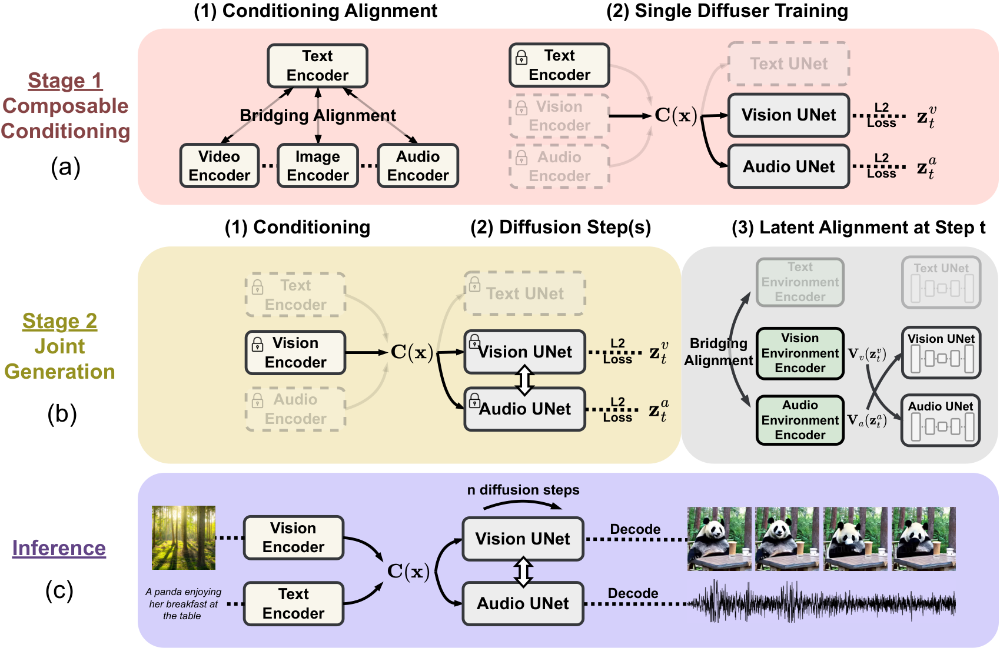

*Figure 2 · [Source](https://arxiv.org/abs/2305.11846)*

### CogView

CogView (Tsinghua, Alibaba DAMO and BAAI; NeurIPS 2021) is a Chinese text-to-image model built on a 4-billion-parameter transformer that predicts VQ-VAE image tokens after the prompt. Besides generation, the same pretrained model is fine-tuned for super-resolution, captioning-based self-reranking and style learning, and the paper contributes two techniques, PB-relax and Sandwich-LN, for stable large-transformer training.

[Architecture and figure](../models/ar-token.md#cogview) · [Paper](https://arxiv.org/abs/2105.13290) · [GitHub](https://github.com/zai-org/CogView)

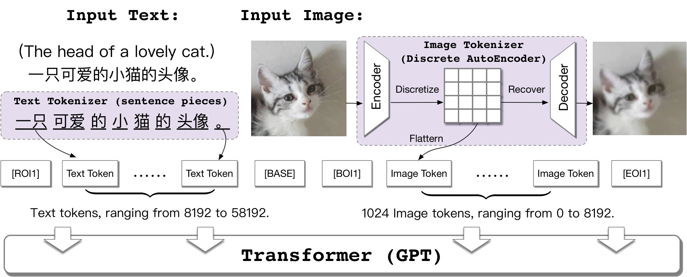

*Figure 3 · [Source](https://arxiv.org/abs/2105.13290)*

### CogView-3Plus

CogView-3Plus is the diffusion-transformer line of Zhipu AI's CogView text-to-image models, open-sourced alongside CogView3 in September 2024. Where CogView3 used a cascade of diffusion stages, CogView-3Plus moves to a single diffusion transformer conditioned on T5-XXL text features. The released 3B-parameter checkpoint generates images between 512 and 2048 pixels per side. The released pipeline combines the T5 encoder, a CogView3-Plus diffusion transformer, DDIM sampling and an AutoencoderKL decoder.

[Architecture and figure](../models/dit.md#cogview3-plus) · [GitHub](https://github.com/zai-org/CogView4) · [Model card](https://huggingface.co/zai-org/CogView3-Plus-3B)

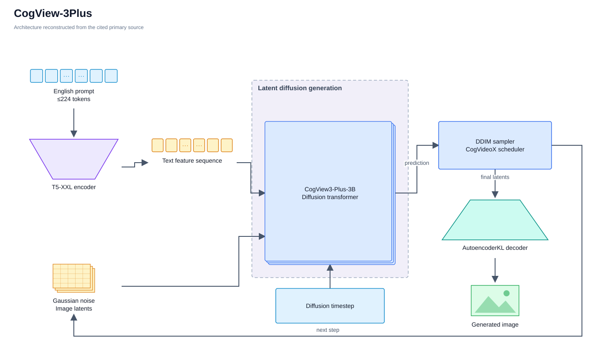

*Source-based architecture diagram · [Source](https://huggingface.co/zai-org/CogView3-Plus-3B)*

### CogView2

CogView2 (Tsinghua and Zhipu AI, 2022) speeds up CogView-style autoregressive image generation by replacing single-pass left-to-right decoding with a hierarchical pipeline: a bidirectional-infilling transformer (CogLM) first produces a small 20×20 token image, and local-attention super-resolution transformers then upsample it to 480×480 in a few parallel passes, cutting inference time relative to the original CogView while supporting bilingual Chinese/English prompts and text-guided image completion.

[Architecture and figure](../models/ar-token.md#cogview2) · [Paper](https://arxiv.org/abs/2204.14217) · [GitHub](https://github.com/zai-org/CogView2)

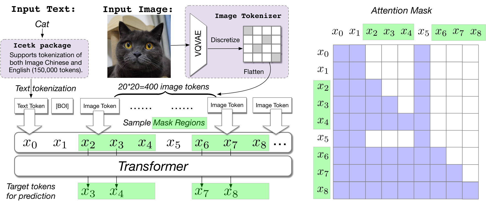

*Figure 2 · [Source](https://arxiv.org/abs/2204.14217)*

### CogView3

CogView3, from Zhipu AI and Tsinghua University, is the first text-to-image system to apply relay diffusion. A 3-billion-parameter U-Net diffusion model works in the 8× compressed latent space of a KL-regularized autoencoder, conditioned on a frozen T5-XXL encoder with prompts of up to 225 tokens that are first expanded by a language model. The base stage generates 512×512 images; the super-resolution stage encodes the bilinearly upsampled result, adds noise from an intermediate point and denoises and deblurs it with a linear blurring schedule to reach 1024×1024, and it can be applied iteratively for 2048×2048. Training uses LAION-2B with captions rewritten by a fine-tuned CogVLM recaptioner. The paper reports that CogView3 beats SDXL in human evaluation at about half its inference time, and a progressively distilled variant needs about a tenth of SDXL's inference time.

[Architecture and figure](../models/latent-unet.md#cogview3) · [Paper](https://arxiv.org/abs/2403.05121) · [GitHub](https://github.com/zai-org/CogView4)

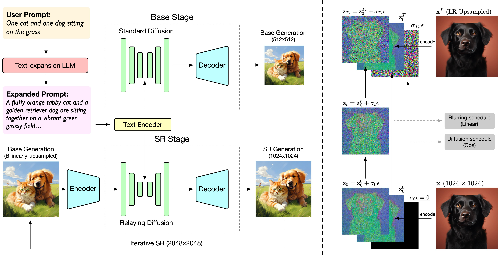

*Figure 3 · [Source](https://arxiv.org/abs/2403.05121)*

### CogView4

CogView4 is Zhipu AI's 6B-parameter open text-to-image model, the successor to CogView-3Plus. Its main change is the text side: it replaces the English-only T5 encoder with the bilingual GLM-4-9B language model, so it accepts long Chinese or English prompts and can render Chinese characters in images. Trained on captions and images of arbitrary length and resolution, it generates at flexible sizes up to about two megapixels. It was released under Apache-2.0 with diffusers support; no technical report describes its internals.

[Architecture and figure](../models/dit.md#cogview4) · [GitHub](https://github.com/zai-org/CogView4) · [Model card](https://huggingface.co/zai-org/CogView4-6B) · [Docs](https://docs.bigmodel.cn/cn/guide/models/image-generation/cogview-4)

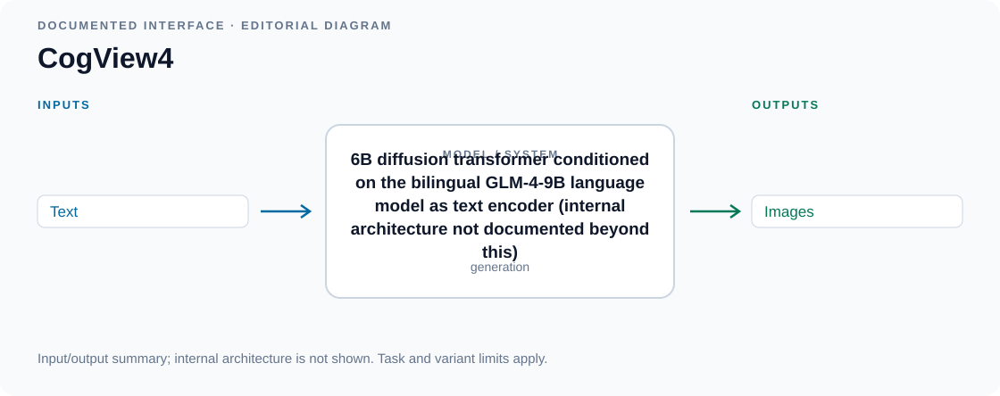

*Source-based architecture diagram · [Source](https://huggingface.co/zai-org/CogView4-6B)*

### Cosmos 3

Cosmos 3 is NVIDIA's family of omnimodal world models for Physical AI, which jointly process and generate language, images, video, audio and robot or vehicle actions in one Mixture-of-Transformers model. Text is produced by next-token prediction in a reasoner tower, while images, video, audio and actions are produced by iterative denoising in a generator tower that attends to the reasoner's context. Text-to-image is one of its generation modes, and NVIDIA released Cosmos3-Super-Text2Image, a 64B checkpoint specialized for text-to-image by two-stage fine-tuning, which the technical report describes as ranked first among open-weight models on the Artificial Analysis text-to-image leaderboard at the time of writing.

[Architecture and figure](../models/unified.md#cosmos3) · [Model card](https://huggingface.co/nvidia/Cosmos3-Super-Text2Image) · [Paper 1](https://research.nvidia.com/labs/cosmos-lab/cosmos3/technical-report.pdf) · [GitHub](https://github.com/NVIDIA/cosmos) · [Paper 2](https://arxiv.org/abs/2606.02800)

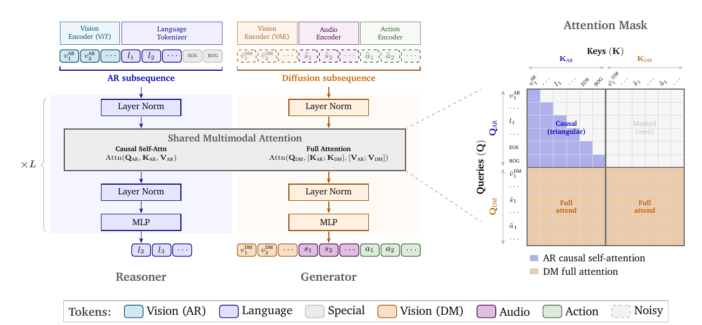

*Figure 5 (PDF p. 11) · [Source](https://research.nvidia.com/labs/cosmos-lab/cosmos3/technical-report.pdf)*

### DALL·E

DALL·E (OpenAI, 2021) showed that a single large autoregressive transformer, trained on hundreds of millions of web image-text pairs, can generate images from free text zero-shot. Images are first compressed into discrete tokens by a discrete VAE, then a 12-billion-parameter transformer predicts those tokens after the caption; candidate images are reranked with CLIP. Only the image tokenizer was publicly released.

[Architecture and figure](../models/ar-token.md#dall-e) · [Paper](https://arxiv.org/abs/2102.12092) · [GitHub](https://github.com/openai/DALL-E)

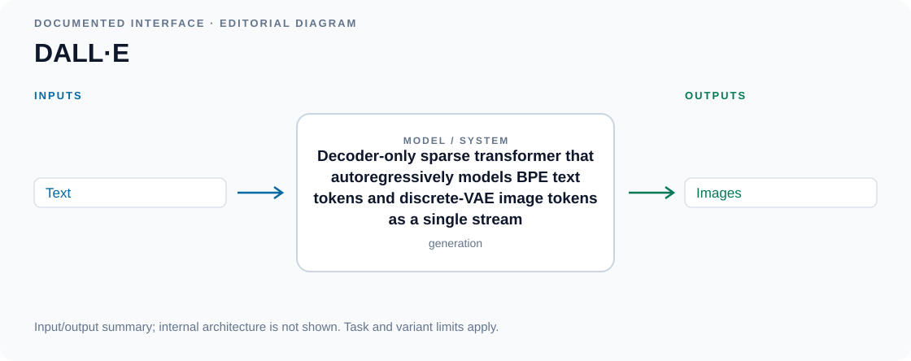

*Source-based architecture diagram · [Source](https://arxiv.org/abs/2102.12092)*

### DALL·E 3

DALL·E 3 is OpenAI's third-generation text-to-image system, released in ChatGPT and, from November 2023, in the OpenAI Images API. Its accompanying paper argues that prompt following improves when a text-to-image model is trained on highly descriptive captions produced by a bespoke image captioner, and shows that a language model can "upsample" short prompts into detailed ones at inference. The system card describes a deployment in which GPT-4 in ChatGPT rewrites user requests into the prompts sent to DALL·E 3, plus prompt and output classifiers. The API accepted text only and supported image generation, not edits or variations; OpenAI removed the `dall-e-3` snapshot from the API on 2026-05-12.

[Architecture and figure](../models/api.md#dall-e-3) · [Paper](https://cdn.openai.com/papers/dall-e-3.pdf) · [Model card](https://cdn.openai.com/papers/DALL_E_3_System_Card.pdf) · [Docs 1](https://developers.openai.com/api/docs/models/dall-e-3) · [Docs 2](https://developers.openai.com/api/docs/changelog)

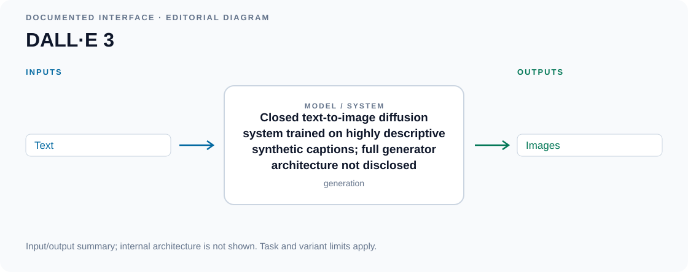

*Editorial input/output diagram · [Source](https://cdn.openai.com/papers/DALL_E_3_System_Card.pdf)*

### DALL·E Mini

DALL·E Mini is an open-source attempt to reproduce OpenAI's DALL·E, developed by a community team whose README acknowledges the Hugging Face Flax/JAX community week and Google TPU Research Cloud. A BART encoder reads the prompt and a BART decoder generates VQGAN image tokens that are decoded into an image. The larger DALL·E Mega shares the design, the Craiyon web service hosts the model, and code and weights are released under Apache 2.0.

[Architecture and figure](../models/ar-token.md#dall-e-mini) · [GitHub](https://github.com/borisdayma/dalle-mini) · [Model card 1](https://huggingface.co/dalle-mini/dalle-mini) · [Model card 2](https://huggingface.co/dalle-mini/dalle-mega) · [Announcement](https://wandb.ai/dalle-mini/dalle-mini/reports/DALL-E-Mini-Explained-with-Demo--Vmlldzo4NjIxODA)

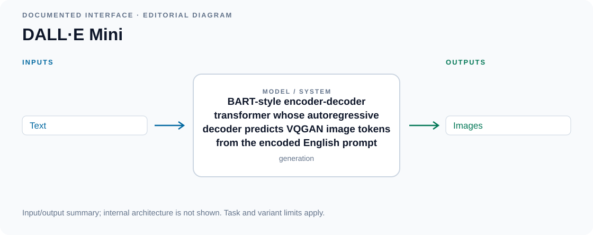

*Source-based architecture diagram · [Source](https://huggingface.co/dalle-mini/dalle-mini)*

### DART

DART (Apple, with CUHK and Mila) merges autoregression and diffusion. Instead of denoising from only the current noisy image, as Markovian diffusion does, its transformer sees the concatenated sequence of all earlier noisy versions of the image and predicts the next, cleaner one, using a chunk-based causal mask and KV caching like a language model; no image quantization is involved. Two extensions add token-level autoregression inside each denoising step (DART-AR) and a small flow-matching head that models each token's distribution (DART-FM). Matryoshka-DART handles several resolutions in one sequence, and Kaleido-DART jointly trains discrete text-token prediction. Text-to-image models are trained on CC12M, mostly at 256×256 with 512×512 fine-tuning for Matryoshka-DART.

[Architecture and figure](../models/continuous-ar.md#dart) · [Paper](https://arxiv.org/abs/2410.08159) · GitHub: no author-linked repository found

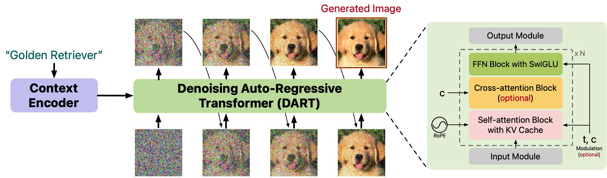

*Figure 2 · [Source](https://arxiv.org/abs/2410.08159)*

### DC-AR

DC-AR (NVIDIA and MIT, ICCV 2025) combines MaskGIT-style masked prediction with a hybrid tokenizer. DC-HT compresses images 32x per side, trained in three adaptation stages, and decodes both its quantized discrete tokens and the continuous latent. DC-AR first generates all discrete tokens through an iterative unmasking schedule that fixes structure, then produces the continuous residual tokens, which only refine detail, through a lightweight diffusion head conditioned on the transformer's hidden states; the two are summed and decoded. Because the transformer works on discrete tokens only, the paper reports high-resolution text-to-image generation in 12 unmasking steps plus 20 diffusion steps for the head.

[Architecture and figure](../models/masked.md#dc-ar) · [Paper](https://arxiv.org/abs/2507.04947) · [GitHub](https://github.com/dc-ai-projects/DC-AR) · [Model card](https://huggingface.co/dc-ai/dc-ar-512)

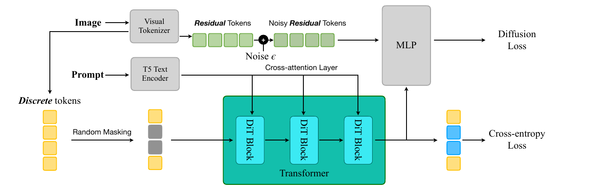

*Figure 4 (PDF p. 5) · [Source](https://arxiv.org/abs/2507.04947)*

### DeCo

DeCo (Peking University, Nanjing University and Huawei, 2025) is an end-to-end pixel diffusion framework that splits the generation of low-frequency semantics and high-frequency detail between two modules. The DiT works on patchified, downsampled input and supplies semantic guidance; a small stack of linear, attention-free decoder blocks operates at full pixel resolution and predicts the final velocity, so no VAE is used. A frequency-aware flow-matching loss converts the velocity to the DCT domain in YCbCr space and weights frequency bands with JPEG quantization-table priors, emphasizing visually salient frequencies. The paper reports FID 1.62 (256x256) and 2.22 (512x512) on class-conditional ImageNet and trains a text-to-image variant that reaches 0.86 on GenEval and 81.4 on DPG-Bench.

[Architecture and figure](../models/pixel-diffusion.md#deco) · [Paper](https://arxiv.org/abs/2511.19365) · [GitHub](https://github.com/Zehong-Ma/DeCo) · [Model card](https://huggingface.co/zehongma/DeCo)

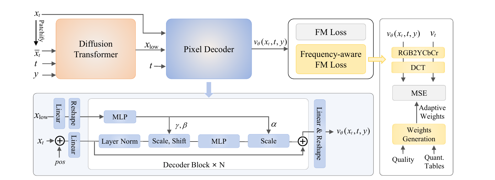

*Figure 3 (PDF p. 4) · [Source](https://arxiv.org/abs/2511.19365)*

### DeepGen 1.0

DeepGen 1.0 is a compact, 5B-parameter unified model for text-to-image generation and editing that the authors position against much larger unified models (reporting gains over the 80B HunyuanImage on the WISE benchmark). Rather than relying on the VLM's final-layer output alone, its Stacked Channel Bridging (SCB) framework samples hidden states from six layers spanning the low, middle and high depth of a Qwen2.5-VL-3B backbone, lets them interact with a set of learnable 'think tokens' through self-attention as an implicit chain-of-thought, and fuses the selected states through a channel-wise concatenation, MLP and Transformer connector before handing them to an SD3.5-Medium (2B) diffusion transformer decoder. Editing is supported by concatenating a reference image's VAE latents with the target image's noise tokens in the DiT input sequence.

[Architecture and figure](../models/dit.md#deepgen-1) · [Paper](https://arxiv.org/abs/2602.12205) · [GitHub](https://github.com/DeepGenTeam/DeepGen) · [Model card](https://huggingface.co/deepgenteam/DeepGen-1.0)

*Figure 3 · [Source](https://arxiv.org/abs/2602.12205)*

### Diffusion Fuzzy System (DFS)

The Diffusion Fuzzy System (Jiangnan University and collaborators, 2025; the manuscript carries an IEEE Transactions on Fuzzy Systems identifier) builds a multi-path latent diffusion model in which each diffusion path learns one class of image features and fuzzy rules coordinate the paths. K-medoids clustering picks representative images that define fuzzy sets; membership degrees of the noisy latent to each set, computed from feature and semantic similarity, weight the path outputs at every denoising step through rule chains of forward and reverse cascaded rules. An encoder and decoder compress 256x256 images into 32x32 latents to keep the multi-path cost down. In the text-to-image setting the noise predictor receives noise and text embeddings, and the paper reports results on LSUN Bedroom, LSUN Church and MS COCO against single-path and multi-path diffusion baselines.

[Architecture and figure](../models/latent-unet.md#diffusion-fuzzy-system) · [Paper](https://arxiv.org/abs/2512.01533) · GitHub: no author-linked repository found

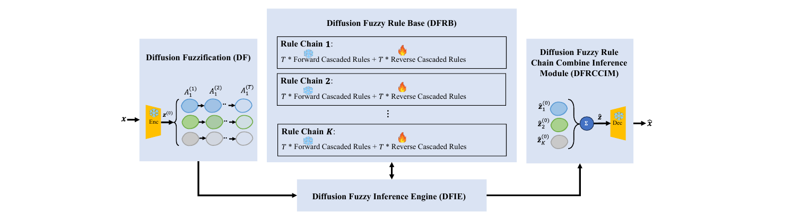

*Figure 2 (PDF p. 3) · [Source](https://arxiv.org/abs/2512.01533)*

### DiT-Air

DiT-Air (Apple) is an empirical study of architectural choices for text-to-image diffusion transformers — comparing PixArt-style, MMDiT-style and a standard DiT that simply concatenates text and noise inputs. The authors find the standard DiT variant matches specialized architectures while being far more parameter-efficient at scale, and use a layer-wise parameter-sharing strategy to shrink an MMDiT-equivalent model by 66% with little performance impact. Building on an analysis of text encoders and VAEs, they introduce DiT-Air and the smaller DiT-Air-Lite, which reach state-of-the-art GenEval and T2I-CompBench results after supervised and reward fine-tuning.

[Architecture and figure](../models/dit.md#dit-air) · [Paper](https://arxiv.org/abs/2503.10618) · GitHub: no author-linked repository found

*Figure 4 (Simple DiT variant) · [Source](https://arxiv.org/abs/2503.10618)*

### DMD2 (Distribution Matching Distillation)

Distribution Matching Distillation (MIT and Adobe Research) turns a diffusion model into a one-step generator by matching output distributions rather than individual sampling trajectories. DMD (2023) minimizes an approximate KL divergence whose gradient is the difference between two scores: that of the frozen teacher (real distribution) and that of a second diffusion model trained online on the generator's samples (fake distribution); it also needed an LPIPS regression loss on precomputed teacher noise–image pairs. DMD2 (2024) removes the regression loss and its costly dataset, stabilizes training by updating the fake-score model more often than the generator, adds a GAN loss against real images so the student can surpass the teacher, and supports multi-step students trained on simulated inference-time inputs. Released DMD2 models distill SDXL into one- and four-step generators at 1024px.

[Architecture and figure](../models/efficient.md#dmd2) · [Paper 1](https://arxiv.org/abs/2311.18828) · [Paper 2](https://arxiv.org/abs/2405.14867) · [GitHub](https://github.com/tianweiy/DMD2) · [Model card](https://huggingface.co/tianweiy/DMD2)

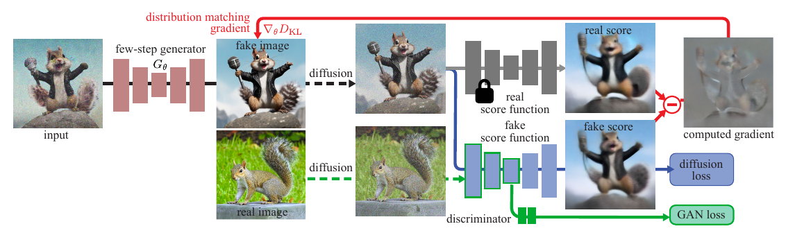

*Figure 3 (PDF p. 6) · [Source](https://arxiv.org/abs/2405.14867)*

### DREAM

DREAM unifies text-image contrastive representation learning and text-to-image generation in one encoder, which is normally difficult because contrastive alignment wants mostly-visible tokens while generative modeling wants heavily-masked ones. Its 'Masking Warmup' schedule shifts the center of the per-step masking-ratio distribution from low to high over roughly 36 epochs of training so that both low- and high-masking regimes coexist throughout training, letting a single MAR-style ViT encoder and FLUID-style decoder serve both a CLIP contrastive loss (via a CLIP-style text encoder) and a diffusion generation loss (via a frozen T5-XXL text encoder and a six-layer diffusion MLP head predicting Stable Diffusion VAE latents). At inference, 'Semantically Aligned Decoding' spawns several partially-decoded candidates and uses the model's own encoder to score and select the best trajectory from as little as 12.5% of the image decoded.

[Architecture and figure](../models/continuous-ar.md#dream) · [Paper](https://arxiv.org/abs/2603.02667) · [GitHub](https://github.com/chaoli-charlie/dream)

*Figure 2 · [Source](https://arxiv.org/abs/2603.02667)*

### DreamLite

DreamLite is billed as the first unified on-device diffusion model to support both text-to-image generation and text-guided image editing from a single 0.39B-parameter network, small enough to run in under a second on a Xiaomi 14 phone. Its backbone is a mobile U-Net systematically pruned and re-architected from SnapGen's 2.5B design (fewer transformer blocks, smaller channel widths, separable convolutions, multi-query attention with one KV head), paired with a Qwen3-VL-2B text/instruction encoder and a 2.5M-parameter TinyVAE. Generation and editing share the same network through an in-context conditioning trick: the model always denoises a horizontally concatenated (target | condition) pair, using a blank panel as the condition for generation and the source image for editing, with an explicit [Generate] or [Edit] task token disambiguating the two modes.

[Architecture and figure](../models/efficient.md#dreamlite) · [Paper](https://arxiv.org/abs/2603.28713) · [GitHub](https://github.com/ByteVisionLab/DreamLite) · [Project](https://carlofkl.github.io/dreamlite/)

*Figure 2 · [Source](https://arxiv.org/abs/2603.28713)*

### DreamLLM

DreamLLM, from Xi'an Jiaotong University, MEGVII, Tsinghua and others, is a learning framework for multimodal LLMs that both comprehend and create images and interleaved documents. Instead of forcing the LLM's outputs to match CLIP embeddings, it appends a set of learnable dream queries whose LLM outputs are projected into the conditioning space of a frozen Stable Diffusion decoder, which is trained through score distillation in pixel space. A special <dream> token lets the model decide where images go within text, so interleaved generative pretraining on web documents yields free-form interleaved image-text generation as well as text-to-image synthesis and visual understanding.

[Architecture and figure](../models/unified.md#dreamllm) · [Paper](https://arxiv.org/abs/2309.11499) · [GitHub](https://github.com/RunpeiDong/DreamLLM)

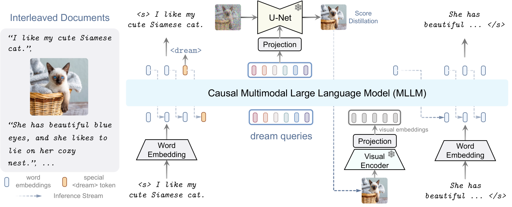

*Figure 2 · [Source](https://arxiv.org/abs/2309.11499)*

### DuetGen

DuetGen is a visual text generation system for producing text-rich images (e.g. posters, signage) that jointly trains an autoregressive layout planner with a diffusion-transformer renderer under a framework the authors call DeepFusion, rather than optimizing planning and rendering as separate stages. A 2B-parameter AR planner predicts where text should appear and what it should say, and a 4B single-stream DiT renders the image conditioned on the planner's representations, with rendering-loss gradients flowing back into the planner so its layout representations are shaped by what the renderer can actually realize. A Phase-Aware Attention Modulation mechanism strengthens the binding between image regions and their intended text content and coordinates at inference.

[Architecture and figure](../models/continuous-ar.md#duetgen) · [Paper](https://arxiv.org/abs/2609.22916) · GitHub: no author-linked repository found

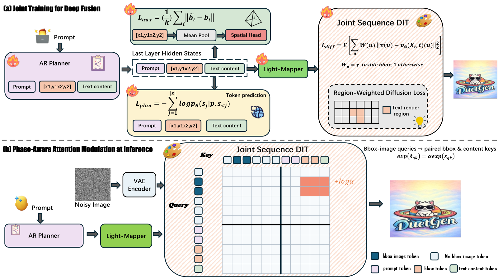

*Figure 2 · [Source](https://arxiv.org/abs/2609.22916)*

### DuoGen

DuoGen (NVIDIA) is a unified system for interleaved text-and-image generation: producing multi-step, multi-image sequences such as illustrated how-to instructions rather than a single image per prompt. A pretrained multimodal LLM (Qwen2.5-VL-7B) reads the conversation and previously generated images and decides, token by token, whether to keep writing text or trigger image synthesis; when it does, a diffusion transformer initialized from a video-generation model (Cosmos Predict 2.5) renders the next image conditioned on the MLLM's hidden states and on all prior images in the sequence, stacked as VAE latents along a temporal axis. The paper argues that a video-pretrained backbone gives better cross-image visual consistency than an image-only DiT, and trains the system in two stages that first teach the MLLM when to generate images and then align the connector and DiT to the MLLM on large-scale image/video transition data.

[Architecture and figure](../models/unified.md#duogen) · [Paper](https://arxiv.org/abs/2602.00508) · [Project](https://research.nvidia.com/labs/dir/duogen/) · GitHub: no author-linked repository found

*Figure 3 · [Source](https://arxiv.org/abs/2602.00508)*

### E-MMDiT (AMD Nitro-E)

E-MMDiT (AMD, 2025), released as Nitro-E, is a small MMDiT-style text-to-image model designed around token reduction so that it can be trained cheaply and run fast. Images are encoded by the highly compressive DC-AE (32× downsampling) and prompts by Llama 3.2-1B. Inside the transformer, a multi-path compression module condenses image tokens by 2× and 4× for the middle blocks and a reconstructor restores them, with positional embeddings re-injected (Position Reinforcement) to keep spatial coherence; Alternating Subregion Attention restricts attention to alternating token subregions, and AdaLN-affine computes modulation parameters cheaply. The 512px model was trained on about 25M public images in 1.5 days on one node of eight AMD MI300X GPUs and reaches 0.66 GenEval (0.72 after GRPO post-training). Distilled checkpoints sample in four steps and roughly double throughput.

[Architecture and figure](../models/efficient.md#e-mmdit) · [Paper](https://arxiv.org/abs/2510.27135) · [GitHub](https://github.com/AMD-AGI/Nitro-E) · [Model card](https://huggingface.co/amd/Nitro-E)

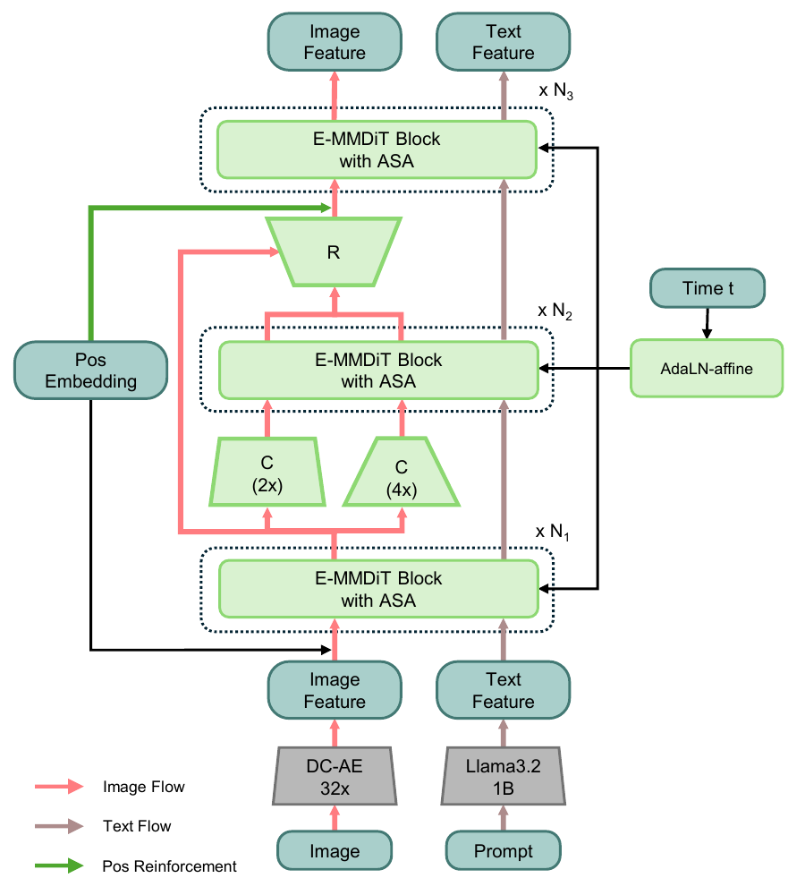

*Figure 3 (PDF p. 3) · [Source](https://arxiv.org/abs/2510.27135)*

### Emu (BAAI)

Emu is BAAI's generative multimodal foundation model trained with one autoregressive objective over interleaved image, text and video data. Images are encoded by EVA-CLIP and compressed by a Causal Transformer into a fixed number of visual embeddings that sit alongside text tokens in a LLaMA sequence; the model is trained to classify the next text token or regress the next visual embedding. Generated visual embeddings condition a latent diffusion decoder, initialized from Stable Diffusion, that renders the image. The same model performs captioning, image and video question answering, in-context image-to-text and text-to-image generation. It is unrelated to Meta's Emu text-to-image model.

[Architecture and figure](../models/unified.md#emu-baai) · [Paper](https://arxiv.org/abs/2307.05222) · [GitHub](https://github.com/baaivision/Emu)

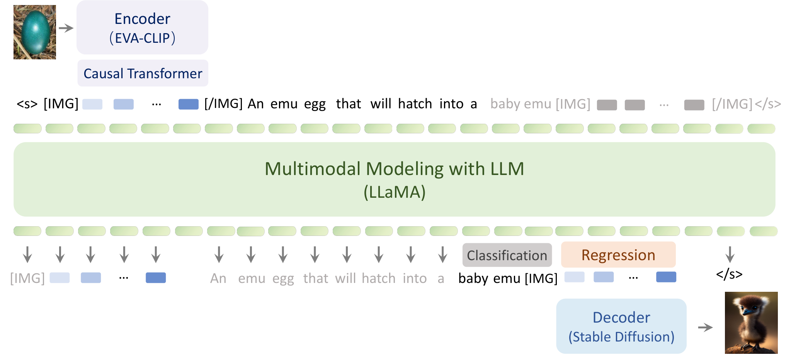

*Figure 2 · [Source](https://arxiv.org/abs/2307.05222)*

### Emu2

Emu2 is BAAI's 37-billion-parameter successor to Emu, trained with a unified predict-the-next-multimodal-element objective over text, image-text pairs and interleaved image-text-video sequences. Each image is encoded by EVA-02-CLIP and pooled into 64 continuous visual embeddings interleaved with text tokens; the model classifies text tokens and regresses visual embeddings, which an SDXL-initialized diffusion decoder turns back into images. Unlike Emu, the visual decoder is trained as a stand-alone detokenizer without the language model. Instruction tuning yields Emu2-Chat for multimodal dialogue and Emu2-Gen, which accepts mixes of text, locations and images for text-to-image, grounded, subject-driven generation and editing.

[Architecture and figure](../models/unified.md#emu2) · [Paper](https://arxiv.org/abs/2312.13286) · [GitHub](https://github.com/baaivision/Emu) · [Model card](https://huggingface.co/BAAI/Emu2-Gen)

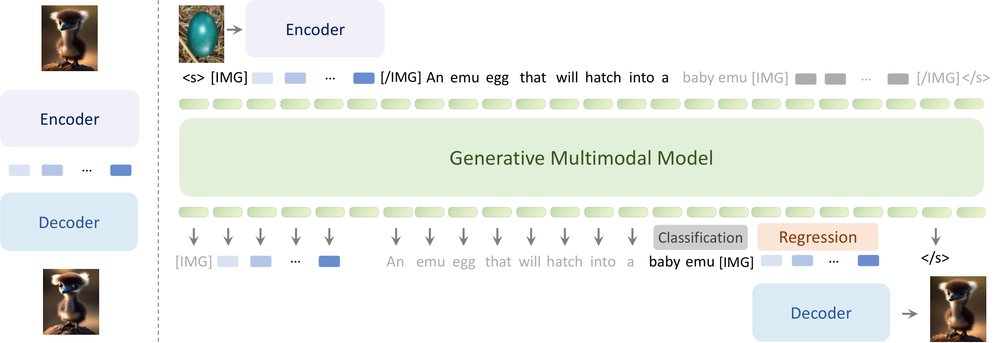

*Figure 2 · [Source](https://arxiv.org/abs/2312.13286)*

### Emu3

Emu3 is BAAI's suite of multimodal models trained solely with next-token prediction. Images, videos and text are all tokenized into a discrete space, and a single transformer is trained from scratch on mixed multimodal sequences, with no diffusion model or CLIP encoder in the pipeline. Text-to-image generation, vision-language understanding and causal text-to-video generation or video extension are all performed by predicting the next token. The released post-trained models are split by task: Emu3-Gen for image generation and Emu3-Chat for vision-language understanding.

[Architecture and figure](../models/unified.md#emu3) · [Paper](https://arxiv.org/abs/2409.18869) · [GitHub](https://github.com/baaivision/Emu3) · [Model card](https://huggingface.co/BAAI/Emu3-Gen)

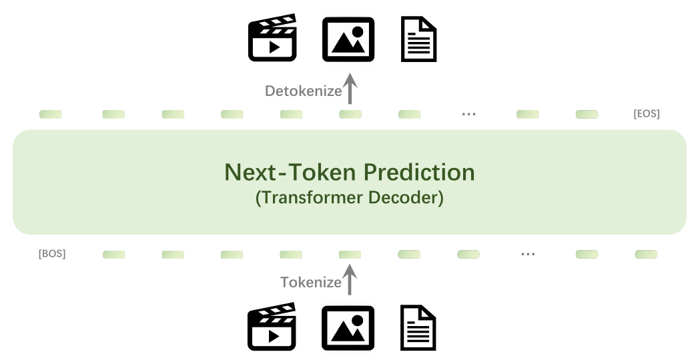

*Figure 1 (PDF p. 1) · [Source](https://arxiv.org/abs/2409.18869)*

### Emu3.5

Emu3.5 is BAAI's successor to Emu3, described as a native multimodal world model that predicts the next state across vision and language. A single 34B decoder-only transformer is pretrained end-to-end with next-token prediction on about 13 trillion tokens of interleaved vision-language data, mostly frames and transcripts of internet videos, then fine-tuned and trained with large-scale reinforcement learning. It generates interleaved text and images, including text-to-image and any-to-image (X2I) generation and editing, and the paper reports image generation and editing results comparable to Gemini 2.5 Flash Image. For speed, DiDA converts token-by-token image decoding into bidirectional parallel prediction, about 20x faster per image.

[Architecture and figure](../models/unified.md#emu3-5) · [Paper](https://arxiv.org/abs/2510.26583) · [GitHub](https://github.com/baaivision/Emu3.5) · [Model card](https://huggingface.co/BAAI/Emu3.5-Image)

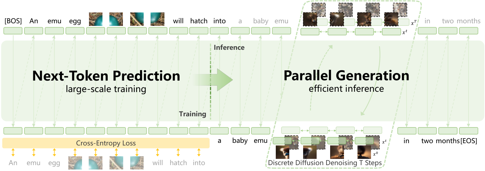

*Figure 3 · [Source](https://arxiv.org/abs/2510.26583)*

### ERNIE-Image

ERNIE-Image is Baidu's open 8B-parameter text-to-image model, built as a single-stream diffusion transformer that deliberately pairs a compact 3B Ministral-3 language model as text encoder with the FLUX.2 project's open-source VAE, rather than pursuing a larger or novel backbone. Its technical report focuses on data and training choices instead of architectural novelty: captions are generated by a vision-language model instructed to describe in-image text carefully, so the model targets text-rich, layout-sensitive content such as slides, posters and documents, and training resolution is staged upward from 256px to 1024px. The team reports state-of-the-art results among open-weight text-to-image models at its release. Code and weights are released under Apache-2.0.

[Architecture and figure](../models/dit.md#ernie-image) · [Paper](https://arxiv.org/abs/2605.25347) · [GitHub](https://github.com/baidu/ERNIE-Image) · [Model card](https://huggingface.co/baidu/ERNIE-Image)

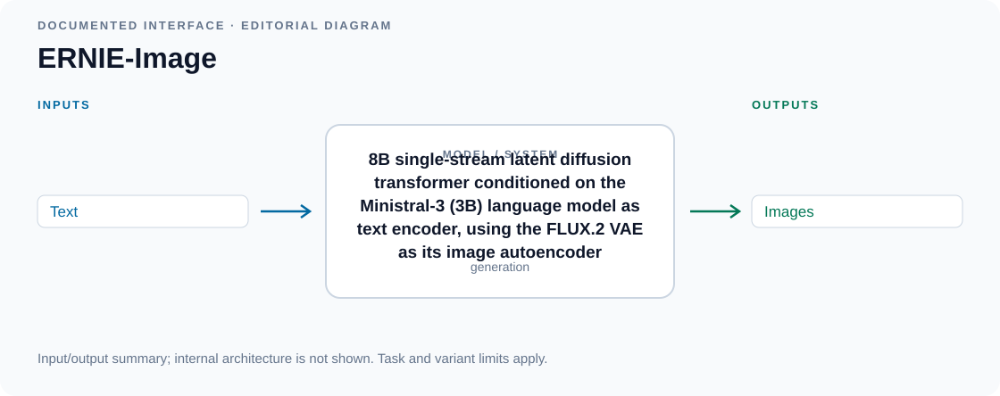

*Source-based architecture diagram · [Source](https://arxiv.org/abs/2605.25347)*

### ERNIE-ViLG

ERNIE-ViLG (Baidu, 2021) is a 10-billion-parameter Chinese model that treats both text-to-image generation and image captioning as autoregressive sequence generation in one transformer. Images are represented as VQGAN tokens; for generation the model predicts these tokens after the prompt and the VQGAN decoder renders the image. It was trained on 145 million Chinese image-text pairs.

[Architecture and figure](../models/ar-token.md#ernie-vilg) · [Paper](https://arxiv.org/abs/2112.15283) · GitHub: no author-linked repository found

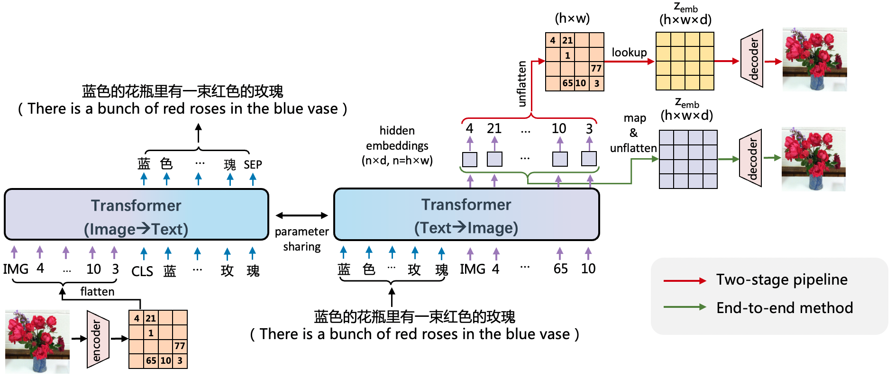

*Figure 1 · [Source](https://arxiv.org/abs/2112.15283)*

### FIBO

FIBO (Bria AI) is an open-source text-to-image model trained exclusively on long, structured JSON captions with fine-grained attributes, aiming to close the gap between the brief prompts most models are trained on and the richer control professional users want. Its DimFusion mechanism injects intermediate-layer representations from the SmolLM3-3B text encoder along the embedding dimension rather than concatenating them into the token sequence, keeping sequence length fixed while improving prompt alignment. The authors also introduce a Text-as-a-Bottleneck Reconstruction protocol to evaluate controllability, and report state-of-the-art prompt alignment among open-source models; weights are published on Hugging Face and code on GitHub.

[Architecture and figure](../models/dit.md#fibo) · [Paper](https://arxiv.org/abs/2511.06876) · [GitHub](https://github.com/Bria-AI/FIBO) · [Model card](https://huggingface.co/briaai/FIBO)

*Figure 2 · [Source](https://arxiv.org/abs/2511.06876)*

### FLAT

FLAT (Meta AI) is a representation-pretraining framework that jointly optimizes one shared multimodal encoder with downstream text-to-image and image-to-text decoders, so the same continuous representation serves as both a discriminative retrieval embedding and a generative conditioning signal. Images and text are mapped into a unified, variable-length continuous 1D sequence space using register tokens and nested dropout over a prefix length K, trained with combined contrastive and bidirectional generative objectives; a rectified-flow-matching decoder produces images and an autoregressive decoder produces captions. The paper reports competitive cross-modal retrieval alongside a text-to-image GenEval score of 71.1 zero-shot from pretraining (83.1 after task-specific fine-tuning).

[Architecture and figure](../models/unified.md#flat) · [Paper](https://arxiv.org/abs/2609.16591) · GitHub: no author-linked repository found

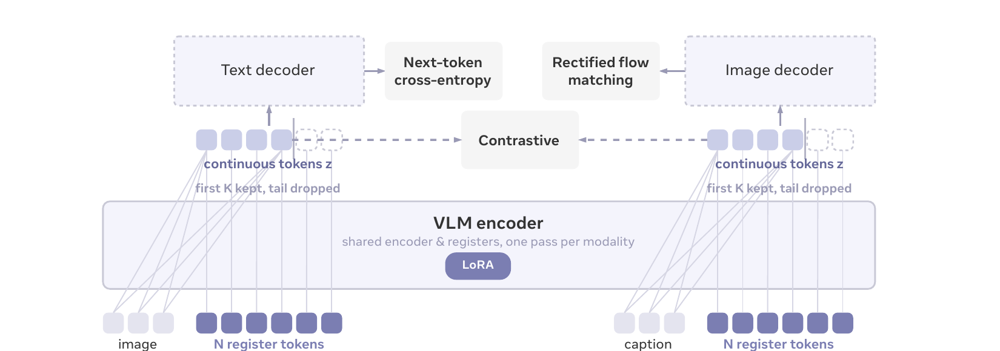

*Figure 1 (PDF p. 3) · [Source](https://arxiv.org/abs/2609.16591)*

### FlowInOne

FlowInOne reframes multimodal image generation as a purely visual, image-in/image-out process: instead of separate text encoders and task-specific branches for generation, layout-guided synthesis, editing and visual instruction following, every input -- text, arrows, masks, markers, source images -- is rendered onto a single canvas image, encoded by a SigLIP vision transformer, and consumed by one flow-matching model. A Dual-Path Spatially-Adaptive Modulation mechanism inside the transformer gates, per token, how much the model relies on the preserved input structure versus the instruction signal; pure generation bypasses cross-attention entirely to avoid injecting irrelevant conditioning noise, while editing selectively admits source-image priors. The 1.2B-parameter model is initialized from CrossFlow and trained with a combined flow-matching, CLIP-contrastive and KL-divergence loss.

[Architecture and figure](../models/dit.md#flowinone) · [Paper](https://arxiv.org/abs/2604.06757) · [GitHub](https://github.com/CSU-JPG/FlowInOne) · [Project](https://csu-jpg.github.io/FlowInOne.github.io/)

*Figure 3 · [Source](https://arxiv.org/abs/2604.06757)*

### FlowTok

FlowTok is a minimal framework for cross-modal generation that flows directly between text and image modalities through flow matching, rather than treating text as a conditioning signal that guides denoising from Gaussian noise. Images are encoded into a compact 1D token representation (built on TA-TiTok), reducing the latent space by 3.3x at 256px resolution compared to 2D latents and removing the need for complex conditioning or noise scheduling. The same formulation extends naturally to image-to-text generation, giving one lightweight model both directions with fewer training resources and faster sampling than comparable diffusion-based systems.

[Architecture and figure](../models/dit.md#flowtok) · [Paper](https://arxiv.org/abs/2503.10772) · [GitHub](https://github.com/TACJu/FlowTok)

*Figure 4 · [Source](https://arxiv.org/abs/2503.10772)*

### Fluid

Fluid (Google DeepMind and MIT) studies why autoregressive image models scale worse than language models by comparing discrete versus continuous tokens and raster versus random generation order in a controlled text-to-image setup. Continuous tokens gave clearly better visual quality, and random-order models with bidirectional attention scored higher on GenEval than raster-order causal models, so the final Fluid model combines both: it predicts masked continuous tokens in random order, one or several at a time, and models each token with a small diffusion head following the MAR diffusion-loss approach. The largest model has 10.5B parameters and is trained on WebLI at 256×256.

[Architecture and figure](../models/continuous-ar.md#fluid) · [Paper](https://arxiv.org/abs/2410.13863) · GitHub: no author-linked repository found

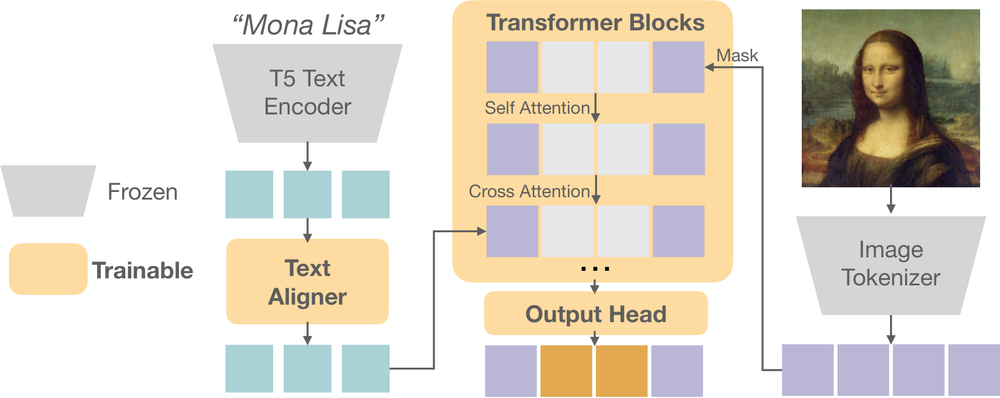

*Figure 3 · [Source](https://arxiv.org/abs/2410.13863)*

### FLUX.1

FLUX.1 is the first model family from Black Forest Labs, founded by researchers behind latent diffusion and Stable Diffusion 3. It is a 12B-parameter rectified-flow transformer that starts with MM-DiT-style double-stream blocks, where text and image tokens keep separate weights but share attention, and continues with a deeper stack of single-stream blocks that process both token types together with fused attention and MLP layers. It works in the latent space of a 16-channel autoencoder and uses rotary position embeddings. The family was released as an API-only [pro] model, a guidance-distilled open-weight [dev] model for non-commercial use, and a few-step Apache-licensed [schnell] model.

[Architecture and figure](../models/dit.md#flux-1) · [Announcement](https://bfl.ai/announcements/24-08-01-bfl) · [Paper](https://arxiv.org/abs/2506.15742) · [GitHub](https://github.com/black-forest-labs/flux) · [Model card 1](https://huggingface.co/black-forest-labs/FLUX.1-dev) · [Model card 2](https://huggingface.co/black-forest-labs/FLUX.1-schnell)

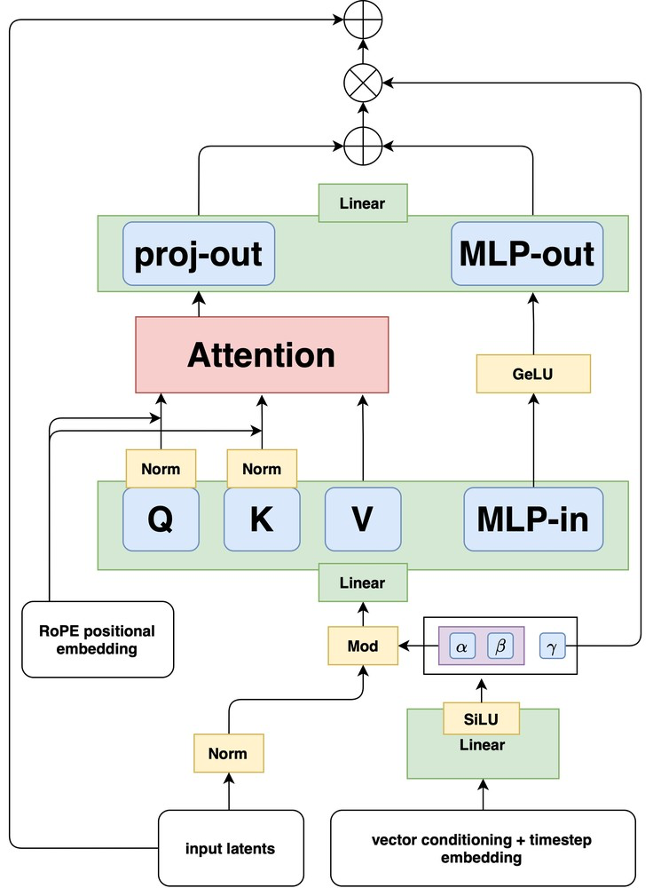

*Figure 3 (FLUX.1 Kontext paper) · [Source](https://arxiv.org/abs/2506.15742)*

### FLUX.1 Kontext

FLUX.1 Kontext is Black Forest Labs' in-context image generation and editing model built on FLUX.1. Instead of adding adapters, it feeds the latent tokens of one or more reference images into the same transformer sequence as the image being generated, marking them apart with a positional offset, so one network can edit an image from a text instruction, carry a character or style into new scenes, or generate from text alone when no image is given. Adversarial distillation keeps generation and editing at interactive speeds, and the model is designed for repeated, multi-turn edits with little drift. The [pro] and [max] versions are available through the API, while [dev] is an open-weight editing model.

[Architecture and figure](../models/dit.md#flux-1-kontext) · [Paper](https://arxiv.org/abs/2506.15742) · [Announcement](https://bfl.ai/announcements/flux-1-kontext) · [GitHub](https://github.com/black-forest-labs/flux) · [Model card](https://huggingface.co/black-forest-labs/FLUX.1-Kontext-dev)

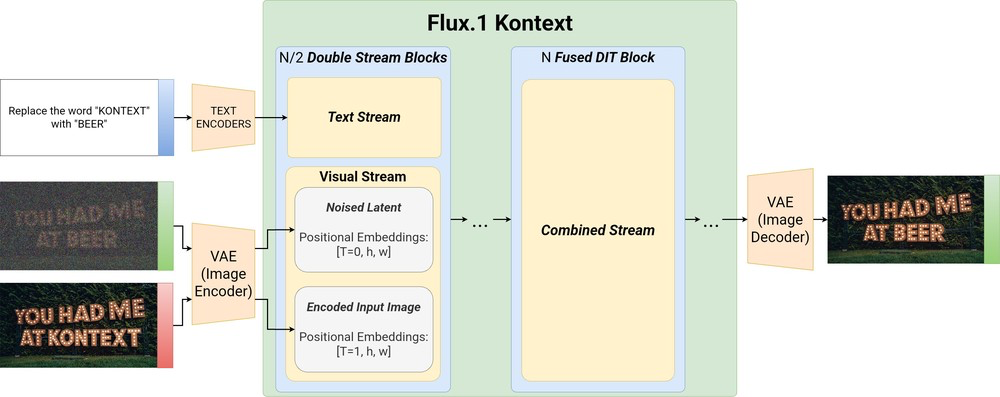

*Figure 4 · [Source](https://arxiv.org/abs/2506.15742)*

### FLUX.2

FLUX.2 is Black Forest Labs' next-generation image model family after FLUX.1, pairing a large vision-language model (Mistral-3 24B) with a rectified-flow diffusion transformer so that world knowledge and language understanding from the VLM inform the transformer's spatial and compositional generation. It is designed from the start to generate and edit in one model, including combining up to ten reference images into a single new image. The family spans closed API tiers ([pro], [flex], [max]) and open-weight tiers: a 32B [dev] model and smaller, faster, step-distilled [klein] models at 4B and 9B parameters, with licensing that varies by checkpoint from Apache-2.0 to a non-commercial research license. No technical paper accompanies the release, so this entry is based on Black Forest Labs' own announcement and documentation.

[Architecture and figure](../models/dit.md#flux-2) · [Announcement 1](https://bfl.ai/blog/flux-2) · [Announcement 2](https://bfl.ai/blog/flux2-klein-towards-interactive-visual-intelligence) · [GitHub](https://github.com/black-forest-labs/flux2) · [Model card](https://huggingface.co/black-forest-labs/FLUX.2-dev)

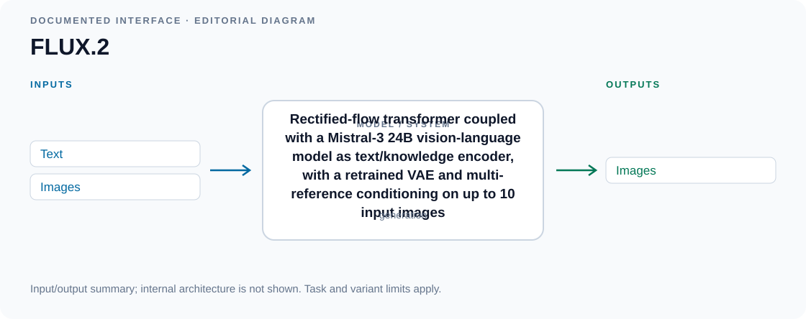

*Source-based architecture diagram · [Source](https://github.com/black-forest-labs/flux2)*

### FoX

FoX (Zhejiang University and Alibaba Group) is a unified generative model aimed at complex compositional text-to-image prompts. Its backbone, FoXperts, routes tokens to three expert sets by function instead of by modality: a Linguistic Expert shared by text understanding and generation, a Semantic Vision Expert for image understanding and a Generative Vision Expert for image generation, each with its own attention projections, FFN and layer norm and linked by a shared multimodal attention layer. Images are encoded with the SD3 VAE, 2x2 patches are merged into tokens in Transfusion fashion, and generation is trained with rectified-flow noise prediction. On top of this the paper introduces a Multimodal Chain of Thought for images, in which the model plans a dense caption and object layout, draws the image, predicts an artifact map of defective regions and inpaints those regions; the steps are trained as decoupled tasks so no multi-step data tuples are needed. The paper reports 0.77 on GenEval with 1.3B parameters and competitive MME, MMBench and VQAv2 understanding scores.

[Architecture and figure](../models/unified.md#fox) · [Paper](https://arxiv.org/abs/2503.01298) · GitHub: no author-linked repository found

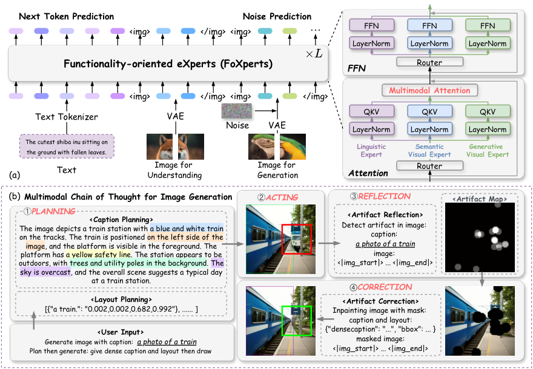

*Figure 2 · [Source](https://arxiv.org/abs/2503.01298)*

### Gemini native image generation

Gemini native image generation lets Gemini models output images directly, first as an experiment in Gemini 2.0 Flash (March 2025) and then as dedicated image models branded Nano Banana: Gemini 2.5 Flash Image (August 2025), Gemini 3 Pro Image ("Nano Banana Pro", November 2025), Gemini 3.1 Flash Image ("Nano Banana 2", February 2026) and Gemini 3.1 Flash-Lite Image ("Nano Banana 2 Lite", GA July 2026). The Gemini API documents text-to-image generation, editing of a supplied image from text instructions, multi-turn conversational editing, multiple reference images and, for some models, interleaved text and image output. Google's model cards say each image model is based on a Gemini language model (for example, Gemini 3 Pro Image on Gemini 3 Pro) and refer to those models' cards for architecture; how images are generated is not described.

[Architecture and figure](../models/api.md#gemini-image) · [Announcement 1](https://developers.googleblog.com/en/experiment-with-gemini-20-flash-native-image-generation/) · [Announcement 2](https://developers.googleblog.com/en/introducing-gemini-2-5-flash-image/) · [Announcement 3](https://blog.google/innovation-and-ai/products/nano-banana-pro/) · [Announcement 4](https://blog.google/innovation-and-ai/technology/ai/nano-banana-2/) · [Announcement 5](https://cloud.google.com/blog/products/ai-machine-learning/nano-banana-2-lite-and-gemini-omni-flash-available) · [Model card 1](https://storage.googleapis.com/deepmind-media/Model-Cards/Gemini-3-Pro-Image-Model-Card.pdf) · [Model card 2](https://storage.googleapis.com/deepmind-media/Model-Cards/Gemini-3-1-Flash-Image-Model-Card.pdf) · [Model card 3](https://storage.googleapis.com/deepmind-media/Model-Cards/Gemini-3-1-Flash-Lite-Image-Model-Card.pdf) · [Docs](https://ai.google.dev/gemini-api/docs/image-generation)

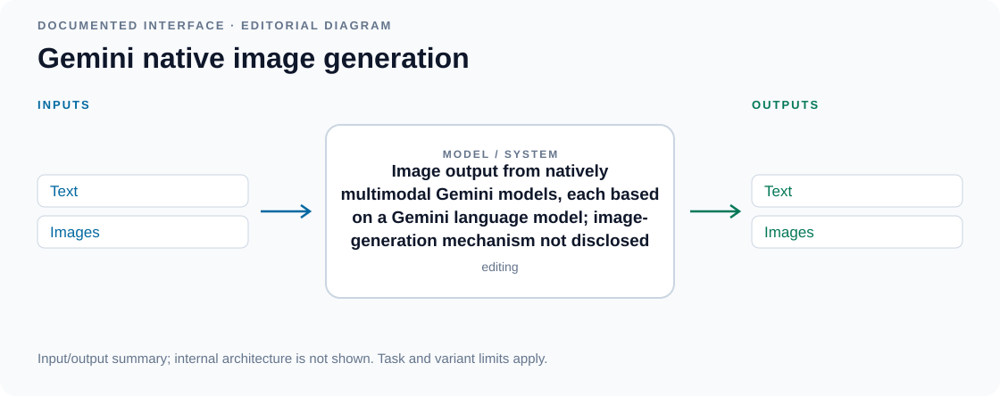

*Editorial input/output diagram · [Source](https://ai.google.dev/gemini-api/docs/image-generation)*

### GenTron

GenTron is a 2023 study from Adobe and Johns Hopkins that adapts the class-conditional DiT transformer diffusion model to open-ended text-to-image generation. Its main contribution is a conditioning ablation: rather than the adaLN mechanism DiT uses for class labels, GenTron injects text through cross-attention layers while keeping adaLN for the diffusion timestep, and shows this produces better text alignment. Scaling the resulting transformer from about 900M to 3.1B parameters improves image quality, and in a human study GenTron's images were preferred over SDXL's on both visual quality and text alignment. The paper also extends the same design to text-to-video generation, which is outside this catalog's scope.

[Architecture and figure](../models/dit.md#gentron) · [Paper](https://arxiv.org/abs/2312.04557)

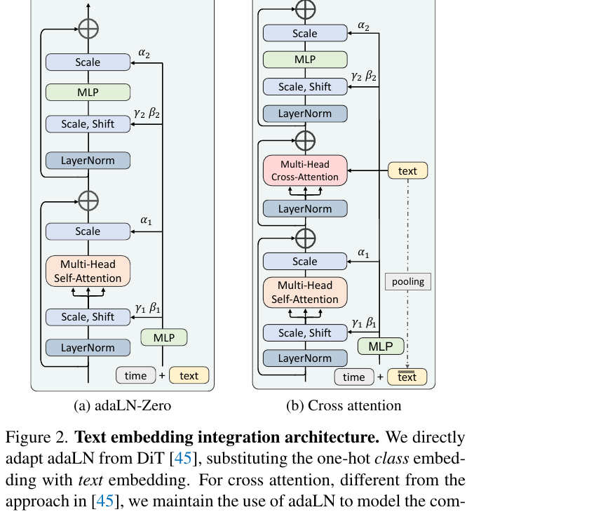

*Figure 2 (PDF p. 3) · [Source](https://arxiv.org/abs/2312.04557)*

### GILL

GILL (Generating Images with Large Language Models), from CMU, efficiently grounds a frozen autoregressive LLM in visual generation without training or running the image generator during training. A linear layer maps a pretrained visual encoder's image features into the LLM's embedding space so it can process interleaved image-and-text inputs, while on the output side the LLM learns to emit special [IMG] placeholder tokens whose hidden states are mapped, via a learned GILLMapper and an MSE loss against the frozen SD text encoder's own embeddings, into conditioning vectors for an off-the-shelf, frozen Stable Diffusion decoder; a separate retrieval head lets GILL alternatively retrieve rather than generate an image when appropriate.

[Architecture and figure](../models/unified.md#gill) · [Paper](https://arxiv.org/abs/2305.17216) · [GitHub](https://github.com/kohjingyu/gill)

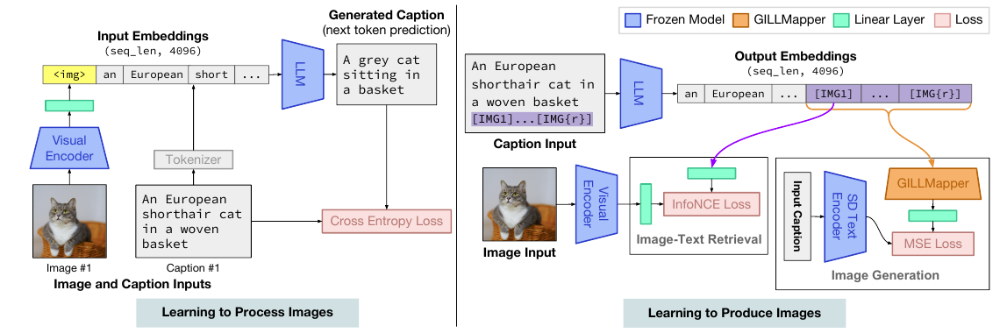

*Figure 2 (PDF p. 3) · [Source](https://arxiv.org/abs/2305.17216)*

### GLM-Image

GLM-Image (Z.ai) splits image generation into a semantic stage and a detail stage. The autoregressive part, built on the GLM-4-9B-0414 language model with an added vision embedding layer and a vision LM head, generates semantic-VQ tokens from the X-Omni tokenizer scheme; it first produces about 256 low-resolution layout tokens and then 1K–4K higher-resolution tokens. A 7B single-stream DiT decoder trained with flow matching receives these tokens, projected and concatenated with the VAE latent along the channel dimension, and adds the high-frequency detail; it needs no prompt text encoder, only a lightweight Glyph-ByT5 module for rendering text in the image. Final outputs range from 1024 to 2048 px. The same model also handles image-to-image tasks such as editing, style transfer and identity-preserving or multi-subject generation, and both stages are post-trained separately with GRPO-based reinforcement learning.

[Architecture and figure](../models/continuous-ar.md#glm-image) · [Announcement](https://z.ai/blog/glm-image) · [GitHub](https://github.com/zai-org/GLM-Image) · [Model card](https://huggingface.co/zai-org/GLM-Image)

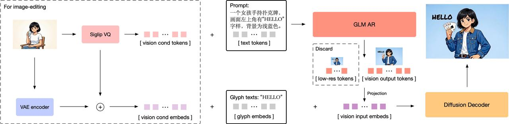

*README architecture figure (architecture_1) · [Source](https://github.com/zai-org/GLM-Image)*

### Goku

Goku (HKU and ByteDance) is a family of joint image-and-video generation models built on rectified-flow transformers. Images and videos are encoded by one jointly trained 3D image-video VAE (8x8 spatial compression for images, plus 4x temporal compression for video) and packed into a single token sequence in the Patch n' Pack manner, so one network with full attention generates both. Each block follows GenTron: self-attention, cross-attention to Flan-T5 text embeddings, an FFN and adaLN-Zero timestep modulation, with added 3D RoPE and query-key RMSNorm. Training runs in stages: text-to-image pretraining, joint image-video learning at progressively higher resolution, then modality-specific fine-tuning. The paper reports 0.76 on GenEval and 83.65 on DPG-Bench for text-to-image, alongside 84.85 on VBench for text-to-video.

[Architecture and figure](../models/dit.md#goku) · [Paper](https://arxiv.org/abs/2502.04896) · [GitHub](https://github.com/Saiyan-World/goku) · [Project](https://saiyan-world.github.io/goku/)

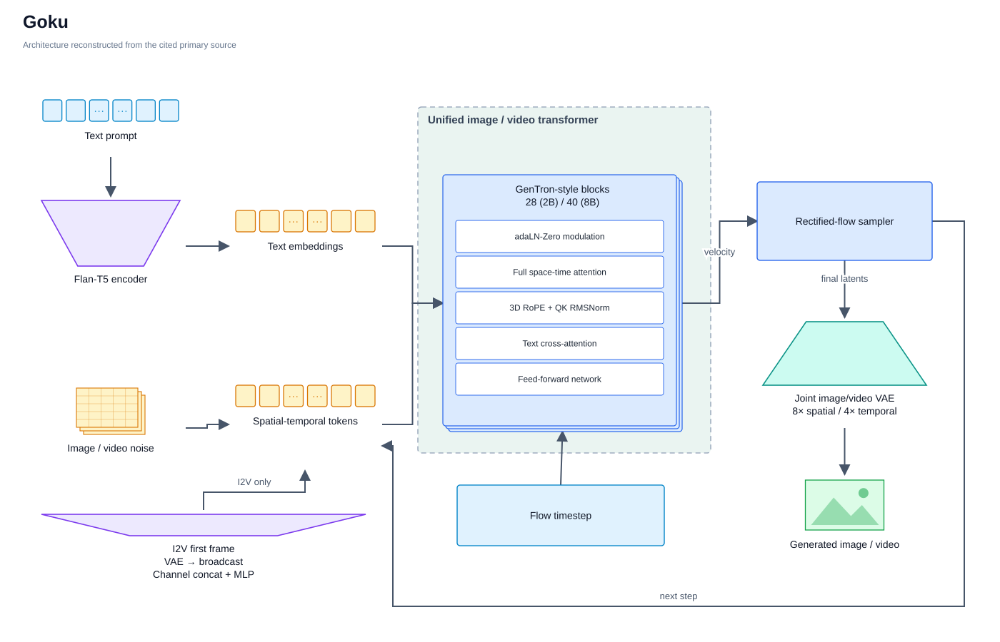

*Source-based architecture diagram · [Source](https://arxiv.org/abs/2502.04896)*

### GoT

GoT (Generation Chain-of-Thought; CUHK MMLab, HKU, SenseTime and collaborators) makes an MLLM reason about a prompt before an image is drawn. Given a caption or an editing instruction, the MLLM writes a step-by-step description of objects, attributes and relations with explicit bounding-box coordinates. Its hidden states for 64 special image tokens become semantic guidance for the diffusion module, and the boxes are rendered as colour-coded masks that serve as spatial guidance. For editing, the source image is a third, reference-image pathway in the manner of InstructPix2Pix. The diffusion module follows SDXL and is optimized together with the MLLM through a joint cross-entropy and diffusion loss. Users can edit the generated chain, such as moving a box, to change the image. The authors build over 8M GoT-annotated image pairs for training.

[Architecture and figure](../models/latent-unet.md#got) · [Paper](https://arxiv.org/abs/2503.10639) · [GitHub](https://github.com/rongyaofang/GoT) · [Model card](https://huggingface.co/LucasFang/GoT-6B)

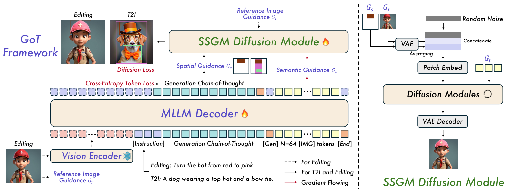

*Figure 3 · [Source](https://arxiv.org/abs/2503.10639)*

### GPT Image 1

GPT Image 1 (`gpt-image-1`) is OpenAI's image generation model added to the API on 2025-04-23. OpenAI's model documentation describes it as a natively multimodal language model that accepts text and image inputs and produces images, served through the Images API generation and edit endpoints and through batch processing, with inpainting support. A cost-efficient `gpt-image-1-mini` followed in October 2025, and `gpt-image-1.5` in December 2025 with better instruction following. OpenAI publishes no architecture details for these models, so the card records only the documented interface.

[Architecture and figure](../models/api.md#gpt-image-1) · [Docs 1](https://developers.openai.com/api/docs/models/gpt-image-1) · [Docs 2](https://developers.openai.com/api/docs/models/gpt-image-1-mini) · [Docs 3](https://developers.openai.com/api/docs/models/gpt-image-1.5) · [Announcement](https://developers.openai.com/api/docs/changelog)

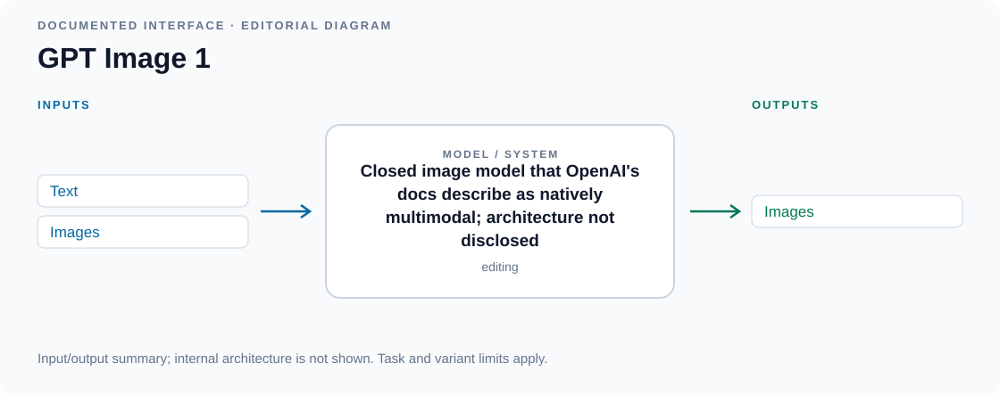

*Editorial input/output diagram · [Source](https://developers.openai.com/api/docs/models/gpt-image-1)*

### GPT Image 2

GPT Image 2 (`gpt-image-2`) is the OpenAI image model released in the API on 2026-04-21 as a new model for image generation and editing, succeeding the GPT Image 1 line. OpenAI's changelog lists flexible image sizes, high-fidelity image inputs, token-based pricing and batch support; transparent backgrounds were added in preview in August 2026. On 2026-09-08 OpenAI released two point versions, GPT Image 2.5 Sunburst (aimed at editing precision) and GPT Image 2.5 Flare (fast everyday generation). All accept text and image input and return images; no architecture is published.

[Architecture and figure](../models/api.md#gpt-image-2) · [Docs 1](https://developers.openai.com/api/docs/models/gpt-image-2) · [Docs 2](https://developers.openai.com/api/docs/models/gpt-image-2.5-sunburst) · [Docs 3](https://developers.openai.com/api/docs/models/gpt-image-2.5-flare) · [Announcement](https://developers.openai.com/api/docs/changelog)

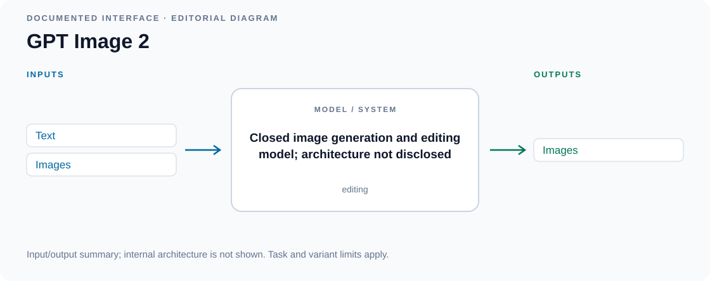

*Editorial input/output diagram · [Source](https://developers.openai.com/api/docs/models/gpt-image-2)*

### GRN (Generative Refinement Networks)

Generative Refinement Networks (GRN) propose a visual-synthesis paradigm distinct from standard masked or autoregressive token prediction. A Hierarchical Binary Quantization (HBQ) tokenizer refines each VAE feature element through several rounds of binary quantization with exponentially decaying error, reaching near-lossless reconstruction at higher compression than typical discrete tokenizers, in either an integer-index (GRNind) or direct-bit-prediction (GRNbit) variant. Generation starts from a random token map and, at each step, a transformer predicts a complete token map conditioned on the current partial map; the sampler then fills newly confident predictions, keeps some prior predictions, and erases and re-randomizes others, so every step simultaneously fills, refines and erases the image (unlike strictly monotonic masked-generation samplers). An entropy-guided, complexity-aware schedule allocates more refinement steps to harder samples.

[Architecture and figure](../models/masked.md#grn) · [Paper](https://arxiv.org/abs/2604.13030) · [GitHub](https://github.com/bytedance/GRN)

*Figure 4 (PDF p. 5) · [Source](https://arxiv.org/abs/2604.13030)*

### Grok Aurora

Aurora is the image generation model xAI introduced in Grok on the X platform on 2024-12-09. xAI's announcement describes it as an autoregressive mixture-of-experts network trained on billions of internet examples to predict the next token from interleaved text and image data, and highlights photorealistic rendering and close adherence to text instructions. The same post says the model natively supports multimodal input for taking inspiration from or directly editing user-provided images, but that editing would be released to X users later. Beyond this description xAI has published no technical report, so the card records the announced interface.

[Architecture and figure](../models/api.md#grok-aurora) · [Announcement](https://x.ai/news/grok-image-generation-release)

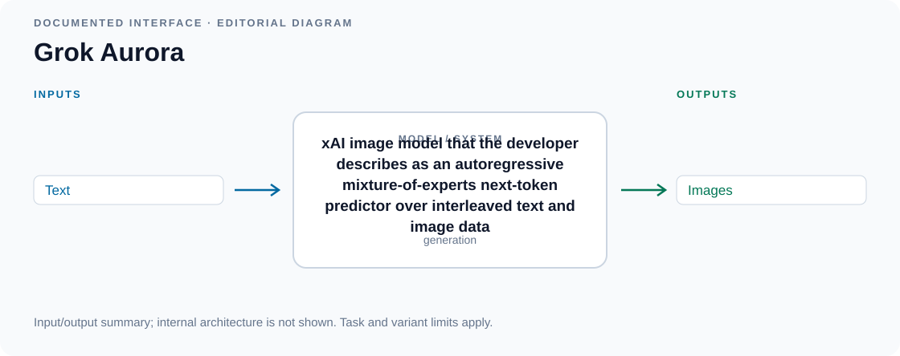

*Source-based architecture diagram · [Source](https://x.ai/news/grok-image-generation-release)*

### Grok Imagine Image

Grok Imagine Image is xAI's line of image models served in the Grok Imagine app and the xAI Imagine API. The API documents text-to-image generation of up to 10 images per request at 1K or 2K resolution, and natural-language editing with up to five source images for combining subjects, transferring styles and composing scenes. Imagine Image 2.0 (`grok-imagine-image-2.0`), announced on 2026-08-07, emphasizes instruction following, typography and layout, region edits via a magic wand and segmentation, smart resizing and background removal. xAI does not publish the architecture of these models.

[Architecture and figure](../models/api.md#grok-imagine-image) · [Announcement](https://x.ai/news/grok-imagine-image-2) · [Docs 1](https://docs.x.ai/docs/guides/image-generations) · [Docs 2](https://docs.x.ai/developers/model-capabilities/images/generation) · [Docs 3](https://docs.x.ai/docs/models)

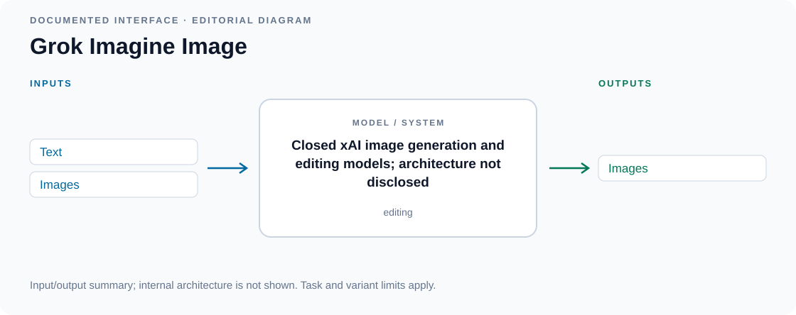

*Editorial input/output diagram · [Source](https://docs.x.ai/docs/guides/image-generations)*

### HART

HART (Hybrid Autoregressive Transformer, from MIT, NVIDIA and Tsinghua) generates 1024×1024 images directly with an autoregressive model. Its hybrid tokenizer splits an autoencoder's continuous latent into the sum of discrete multi-scale VAR tokens, which capture overall structure, and a continuous residual that holds fine detail. A VAR-style transformer predicts the discrete tokens scale by scale, with text tokens from a frozen Qwen2-1.5B language model concatenated in front and visible to all visual tokens, and a lightweight MLP diffusion head predicts the residual in 8 sampling steps, conditioned on the transformer's final hidden states and the last discrete tokens. The paper reports quality comparable to diffusion models of similar size with 4.5–7.7× higher throughput.

[Architecture and figure](../models/continuous-ar.md#hart) · [Paper](https://arxiv.org/abs/2410.10812) · [GitHub](https://github.com/mit-han-lab/hart) · [Model card](https://huggingface.co/mit-han-lab/hart-0.7b-1024px)

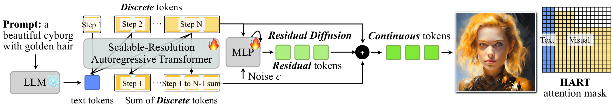

*Figure 6 · [Source](https://arxiv.org/abs/2410.10812)*

### Hi-MAR

Hi-MAR (HiDream.ai, ICML 2025) extends the masked autoregressive (MAR) model with a coarse-to-fine hierarchy. In the first phase the transformer predicts a few low-resolution image tokens that capture global structure; the conditional tokens it outputs, rather than the clean low-resolution tokens, are fed to the second phase to avoid a train-inference mismatch. A scale-aware transformer block signals which phase is running, and the usual per-token MLP diffusion head of MAR is replaced in the second phase by a Diffusion Transformer head that models the interdependence of all tokens. The paper evaluates class-conditional ImageNet generation at three sizes and a small text-to-image model on MS-COCO.

[Architecture and figure](../models/continuous-ar.md#hi-mar) · [Paper](https://arxiv.org/abs/2505.20288) · [GitHub](https://github.com/HiDream-ai/himar) · [Model card](https://huggingface.co/HiDream-ai/Hi-MAR)

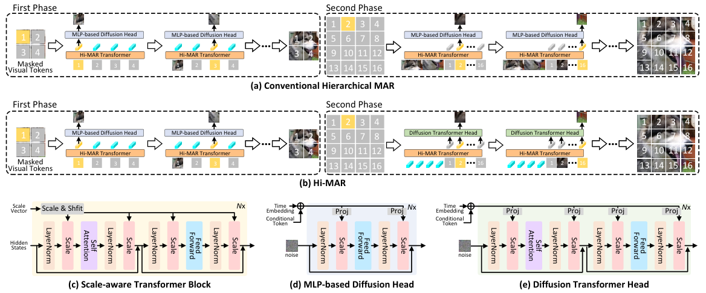

*Figure 2 · [Source](https://arxiv.org/abs/2505.20288)*

### HiDream-I1

HiDream-I1 is a 17B-parameter open text-to-image diffusion transformer from HiDream-ai that combines a dual-stream-then-single-stream DiT backbone (in the style of FLUX/SD3) with sparse Mixture-of-Experts feed-forward layers, so only a subset of experts activates per token despite the large parameter count. It conditions on three complementary text representations at once: pooled long-context CLIP embeddings for global style through adaptive layer norm, T5-XXL token embeddings, and features drawn from multiple layers of a frozen Llama-3.1-8B-Instruct language model. The Full/Dev/Fast variants trade off inference steps and distillation for speed, and the model was released under the MIT license for both code and weights.

[Architecture and figure](../models/dit.md#hidream-i1) · [Paper](https://arxiv.org/abs/2505.22705) · [GitHub](https://github.com/HiDream-ai/HiDream-I1) · [Model card](https://huggingface.co/HiDream-ai/HiDream-I1-Full)

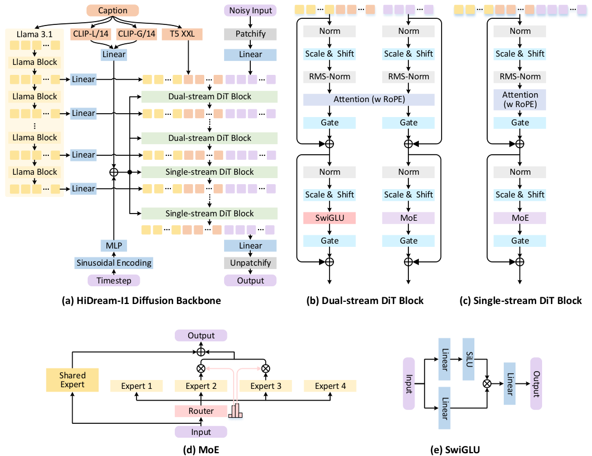

*Figure 3 · [Source](https://arxiv.org/abs/2505.22705)*

### HiDream-O1-Image

HiDream.ai's HiDream-O1-Image drops both the VAE and the separate text encoder. Text is tokenized with the backbone's own vocabulary, optional reference or source images are encoded with SigLIP2 into condition tokens, and the noisy target image is patchified directly from pixels; all three token types are concatenated and processed by one transformer, which predicts clean image patches. Text and condition tokens use causal attention while generation tokens attend to everything. The released 8B model is initialized from Qwen3-VL-8B-Instruct and trained with flow matching plus LPIPS and DINO perceptual losses, progressing from 512² to 1024² and above 2048² images. One model covers text-to-image generation, instruction-based editing and subject-driven personalization, and a Gemma-based prompt agent rewrites user prompts before generation.

[Architecture and figure](../models/pixel-diffusion.md#hidream-o1-image) · [Paper](https://arxiv.org/abs/2605.11061) · [GitHub](https://github.com/HiDream-ai/HiDream-O1-Image) · [Model card](https://huggingface.co/HiDream-ai/HiDream-O1-Image)

*Figure 7 · [Source](https://arxiv.org/abs/2605.11061)*

### Home-made Diffusion Model (HDM)

HDM (Shih-Ying Yeh, Kohaku-Lab) is a small text-to-image model designed to be trained on consumer hardware. Its Cross-U-Transformer replaces the concatenation or addition used for skip connections in U-shaped transformers with cross-attention between matching encoder and decoder depths. Training combines TREAD token routing for faster convergence, a shifted square crop strategy with position maps that allows arbitrary aspect ratios without bucketing, and progressive resolution scaling from 256 to 1024 pixels. The 343M-parameter XUT-base model is trained on the Danbooru2023 anime dataset with natural-language captions for a reported cost of 535 to 620 US dollars on four RTX 5090 GPUs, and shows emergent camera-like control through the position map.

[Architecture and figure](../models/dit.md#hdm) · [Paper](https://arxiv.org/abs/2509.06068) · [GitHub](https://github.com/KohakuBlueleaf/HDM) · [Model card](https://huggingface.co/KBlueLeaf/HDM-xut-340M-anime)

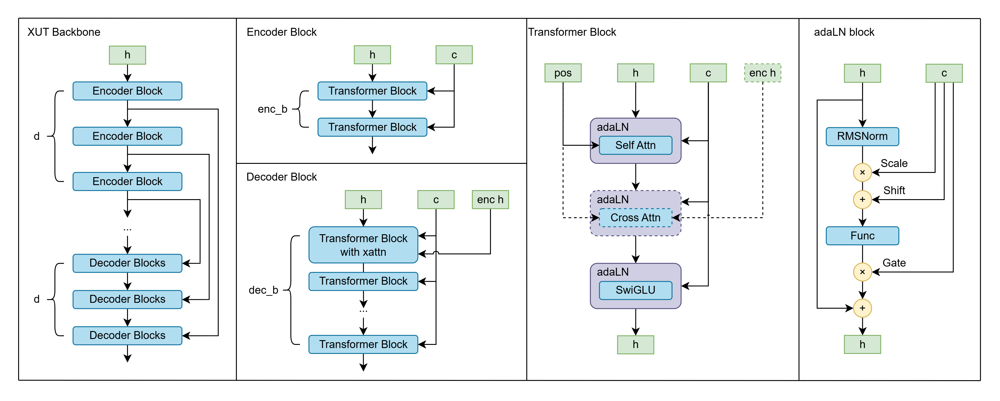

*Figure 2 · [Source](https://arxiv.org/abs/2509.06068)*

### Hunyuan-DiT

Hunyuan-DiT is Tencent's bilingual text-to-image diffusion transformer, built for fine-grained understanding of Chinese as well as English prompts. It keeps a transformer backbone but borrows the long skip connections of a U-Net, injects text through cross-attention from two encoders (a bilingual CLIP and a multilingual T5), and uses rotary position embeddings adapted to multiple resolutions. The report also describes a recaptioning data pipeline and an optional multimodal LLM that rewrites user prompts and enables multi-turn, dialogue-driven generation.

[Architecture and figure](../models/dit.md#hunyuan-dit) · [Paper](https://arxiv.org/abs/2405.08748) · [GitHub](https://github.com/Tencent-Hunyuan/HunyuanDiT) · [Model card](https://huggingface.co/Tencent-Hunyuan/HunyuanDiT)

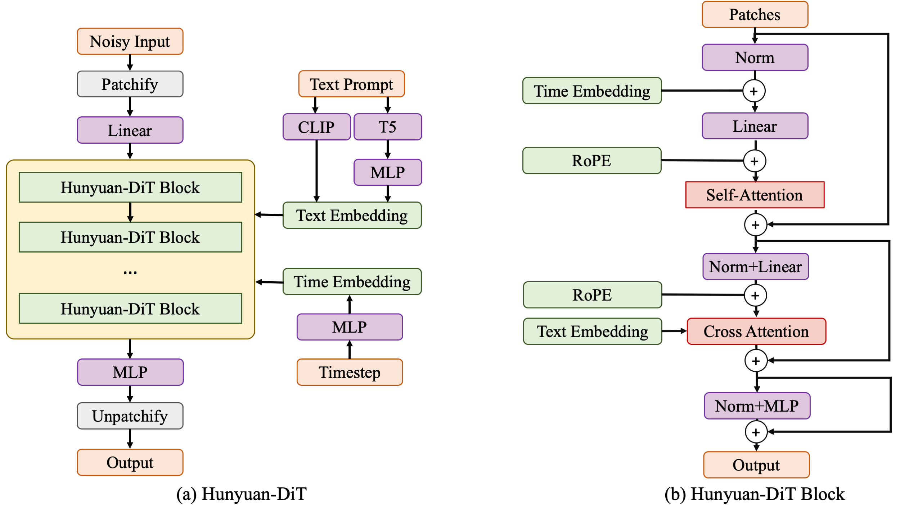

*Figure 7 · [Source](https://arxiv.org/abs/2405.08748)*

### HunyuanImage 3.0

HunyuanImage 3.0 is Tencent Hunyuan's native multimodal model that unifies understanding and generation in one autoregressive framework; the report describes its image generation module as the largest open-source image generative model to date. Built on the Hunyuan-A13B Mixture-of-Experts language model, it models text tokens autoregressively and image tokens with diffusion prediction in the same sequence, uses a native chain-of-thought schema, and can choose image size and aspect ratio itself through special tokens. The technical report covers data curation, progressive pretraining and post-training (SFT, DPO, MixGRPO, SRPO, ReDA); the initial release is the image generation model, and a later Instruct checkpoint adds reasoning, prompt rewriting and image-to-image generation including editing and multi-image fusion.

[Architecture and figure](../models/unified.md#hunyuanimage-3) · [Paper](https://arxiv.org/abs/2509.23951) · [GitHub](https://github.com/Tencent-Hunyuan/HunyuanImage-3.0) · [Model card](https://huggingface.co/tencent/HunyuanImage-3.0)

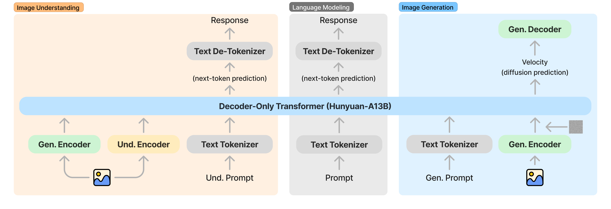

*Figure 3 · [Source](https://arxiv.org/abs/2509.23951)*

### HunyuanImage-2.1

HunyuanImage-2.1 is Tencent's open 17B-parameter text-to-image model built to generate natively at 2K resolution. Its diffusion transformer mixes dual-stream blocks (separate processing paths for image and text tokens) for the first third of its depth with single-stream blocks for the rest, and conditions on two text encoders at once: a multimodal large language model for semantic alignment and a character-aware ByT5 encoder to improve legible text rendering in multiple languages. A second-stage refiner model cleans up detail and artifacts after the base generation step. The project reported a top rank among open text-to-image models on a public arena leaderboard at release. No architecture paper accompanies the open-source release, so its internals are documented only at README/model-card level.

[Architecture and figure](../models/dit.md#hunyuanimage-2-1) · [GitHub](https://github.com/Tencent-Hunyuan/HunyuanImage-2.1) · [Model card](https://huggingface.co/tencent/HunyuanImage-2.1)

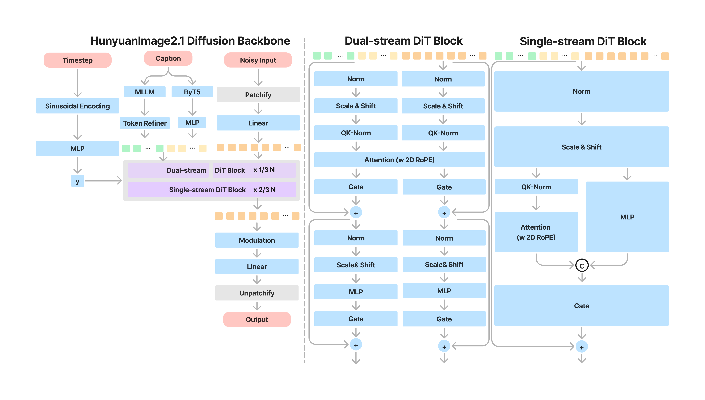

*README — framework_overall.png · [Source](https://github.com/Tencent-Hunyuan/HunyuanImage-2.1)*

### Hyper-SD

Hyper-SD (ByteDance, 2024) accelerates SD 1.5 and SDXL to one to eight sampling steps. Its core method, Trajectory Segmented Consistency Distillation (TSCD), splits the diffusion timeline into segments, enforces consistency inside each segment, and progressively merges segments (8 → 4 → 2 → 1) so that the student keeps close to the teacher's ODE trajectory. Feedback learning from aesthetic reward models and an instance-segmentation model then improves quality, and Distribution Matching Distillation strengthens one-step generation. Most checkpoints are LoRA modules, including a unified one-step LoRA usable at 1–8 steps with the TCD scheduler; a dedicated one-step SDXL U-Net is also released.

[Architecture and figure](../models/efficient.md#hyper-sd) · [Paper](https://arxiv.org/abs/2404.13686) · [Model card](https://huggingface.co/ByteDance/Hyper-SD) · [Project](https://hyper-sd.github.io/) · GitHub: no author-linked repository found

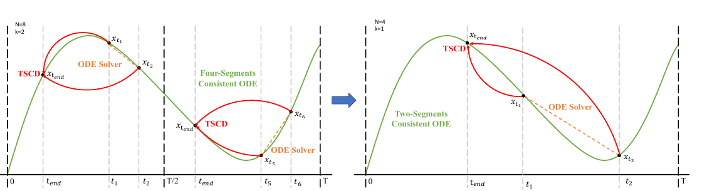

*Figure 2 (PDF p. 5) · [Source](https://arxiv.org/abs/2404.13686)*

### i1

i1 is a fully open, from-scratch text-to-image diffusion model built from a systematic, 300+ experiment study of modeling and data design choices for text-to-image diffusion training. Rather than introducing new network modules, the authors combine the best-performing choices they identify — an encoder-decoder T5Gemma text encoder with a large adapter, long skip connections on a dual-stream MMDiT, and equal-weighted mixing of curated real, synthetic and text-rendering datasets — into a 3B-parameter model trained on 12 public datasets (162.9M images) with synthetic captions from Qwen3-VL. The authors open-source the model, code and data, reporting the model outperforms the best other fully open text-to-image model by 29.5 points on average across benchmarks.

[Architecture and figure](../models/dit.md#i1) · [Paper](https://arxiv.org/abs/2606.11289) · [GitHub](https://github.com/zlab-princeton/i1) · [Model card](https://huggingface.co/zlab-princeton/i1-3B)

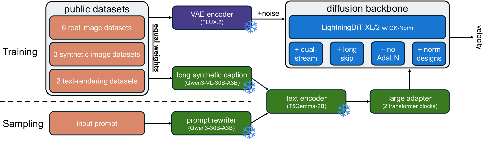

*Figure 4 · [Source](https://arxiv.org/abs/2606.11289)*

### Ideogram

Ideogram is a text-to-image service and API known for rendering legible text, logos and graphic-design layouts. The company announced Ideogram in August 2023 and released closed model versions 0.1, 1.0 (February 2024), 2.0 (August 2024) and 3.0 (March 2025). Ideogram 3.0 added Style References (up to three uploaded images) and reusable style codes. The API documents generation, mask-and-prompt inpainting, remix, reframe and background replacement with these models, but the architectures of the closed versions are not published. The open-weight Ideogram 4.0 is a separate card.

[Architecture and figure](../models/api.md#ideogram) · [Announcement 1](https://docs.ideogram.ai/about-ideogram/blog-posts) · [Announcement 2](https://ideogram.ai/models/3.0/) · [Docs 1](https://developer.ideogram.ai/api-reference/legacy-endpoints/generate) · [Docs 2](https://developer.ideogram.ai/api-reference/generate-images/generate-v3) · [Docs 3](https://developer.ideogram.ai/api-reference/edit-images/inpaint-v3)

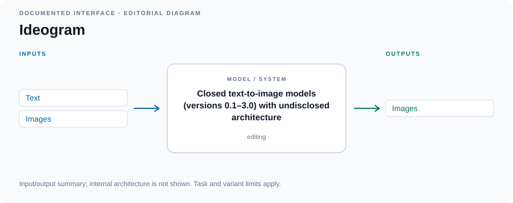

*Editorial input/output diagram · [Source](https://developer.ideogram.ai/api-reference/generate-images/generate-v3)*

### Ideogram 4.0

Ideogram 4.0 is Ideogram's first open-weight text-to-image foundation model, trained from scratch as a 34-layer single-stream diffusion transformer. It conditions on a frozen Qwen3-VL-8B-Instruct vision-language model, drawing on hidden states from many of its intermediate layers rather than just its final output, and decodes flow-matching latents through a frozen KL autoencoder. The release follows the single-stream DiT pattern used by several other recent open text-to-image models, and ships with fp8 and nf4 quantized checkpoints plus open inference code, though the weights themselves are limited to non-commercial use.

[Architecture and figure](../models/dit.md#ideogram-4) · [Announcement](https://ideogram.ai/blog/ideogram-4.0/) · [GitHub](https://github.com/ideogram-oss/ideogram4) · [Model card](https://huggingface.co/ideogram-ai/ideogram-4-fp8)

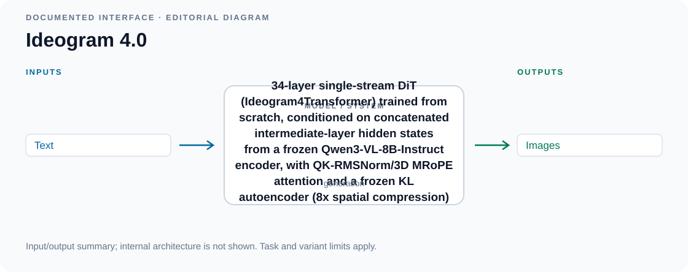

*Source-based architecture diagram · [Source](https://github.com/ideogram-oss/ideogram4)*

### ILLUME

ILLUME, from a group including vivo AI Lab, unifies multimodal understanding and generation in one MLLM by using different visual representations for the two directions: input images are embedded as continuous features through a vision encoder and adapter for understanding, while generated images are predicted as discrete tokens from a semantic vision tokenizer whose codebook is trained with both reconstruction and semantic supervision. A diffusion-based decoder (denoising U-Net plus upsampling) converts the predicted discrete tokens back into a higher-resolution image, and a self-enhancing multimodal alignment scheme with progressive training improves data efficiency compared to prior unified models.

[Architecture and figure](../models/unified.md#illume) · [Paper](https://arxiv.org/abs/2412.06673) · GitHub: no author-linked repository found

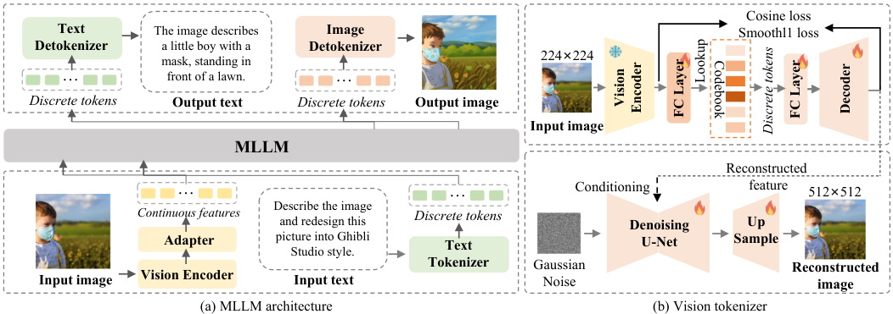

*Figure 3 · [Source](https://arxiv.org/abs/2412.06673)*

### ILLUME+

ILLUME+ is an enhanced version of ILLUME that adds a dual vision tokenizer and a diffusion decoder to close the gap between unified models' understanding, generation and editing abilities. Its DualViTok tokenizer has a semantic branch (a pretrained text-aligned QwenViT encoder, quantized and reconstructed for image-text alignment) and a pixel branch (a MoVQGAN-based encoder that additionally consumes the quantized semantic features to preserve texture), so the same tokenizer captures both deep semantics and fine-grained detail needed for editing. Rather than decoupling input and output representations like the Janus series, ILLUME+ uses continuous pre-quantized features as MLLM input and predicts discrete coarse-to-fine (semantic-then-pixel) tokens as output through one unified LM head, and an optional diffusion U-Net decoder refines those tokens into higher-fidelity, higher-resolution images. The 3B-LLM model is reported competitive with larger unified and specialist models on understanding, generation (up to 1024x1024) and editing benchmarks.

[Architecture and figure](../models/unified.md#illume-plus) · [Paper](https://arxiv.org/abs/2504.01934) · [GitHub](https://github.com/illume-unified-mllm/ILLUME_plus) · [Model card](https://huggingface.co/ILLUME-MLLM/illume_plus-qwen2_5-3b-hf)

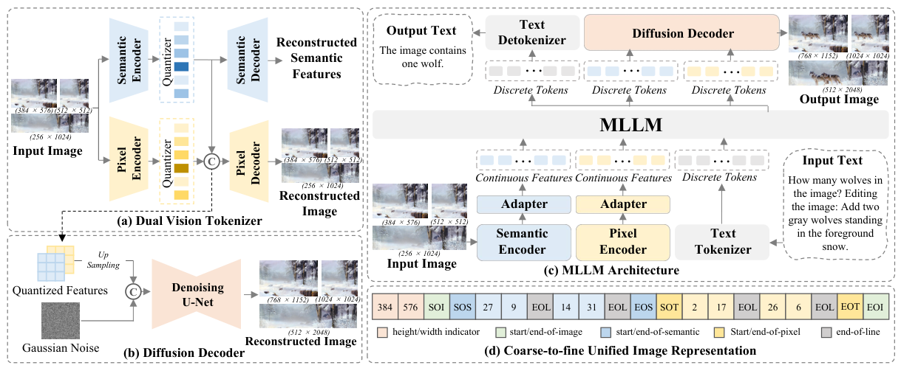

*Figure 3 · [Source](https://arxiv.org/abs/2504.01934)*

### ILLUME-X

ILLUME-X (Harbin Institute of Technology and Huawei Noah's Ark Lab) is a unified multimodal model aimed specifically at free-form, N-to-M interleaved text-image generation — producing arbitrary sequences of text and image outputs, such as illustrated step-by-step instructions or per-object image decompositions, rather than a single fixed-modality output. It combines separate understanding and generation attention branches sharing one multi-modal self-attention over a joint text/VAE/ViT token sequence, trained with a progressive strategy and a specialized attention mask over a curated 100K-sample interleaved dataset. The authors also propose ILScore, an evaluation protocol for cross-modal continuity and per-modality quality in interleaved generation.

[Architecture and figure](../models/unified.md#illume-x) · [Paper](https://arxiv.org/abs/2606.30054) · [GitHub](https://github.com/ChonghuinanWang/ILLUME-X)

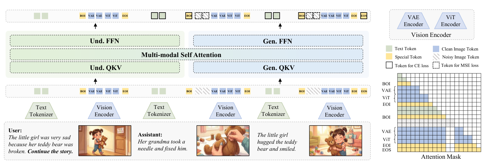

*Figure 2 · [Source](https://arxiv.org/abs/2606.30054)*

### ImageBART

ImageBART (Heidelberg University, NeurIPS 2021) addresses the one-directional, single-scale context of autoregressive image transformers by combining them with a discrete diffusion process. Image tokens are gradually corrupted, and a few transformers learn to restore them stage by stage, each seeing the whole coarser image. With text conditioning trained on Conceptual Captions it generates images from prompts and can edit masked regions of an existing image according to text.

[Architecture and figure](../models/ar-token.md#imagebart) · [Paper](https://arxiv.org/abs/2108.08827) · [GitHub](https://github.com/CompVis/imagebart)

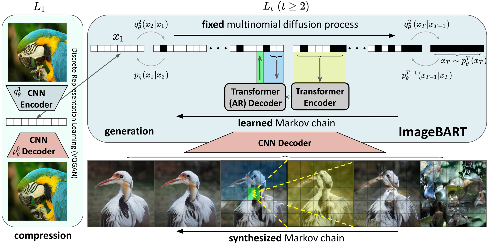

*Figure 1 · [Source](https://arxiv.org/abs/2108.08827)*

### Imagen 2

Imagen 2 is Google's second-generation Imagen model, made generally available on Vertex AI in December 2023 and later used in Bard, ImageFX and Search. Google's announcements highlight photorealistic generation, text and logo rendering, and multilingual prompts; Google's consumer blog describes it only as a diffusion-based model, with no technical report. On Vertex AI it was offered as `imagegeneration@005` and `imagegeneration@006`, and the 006 editing model added mask-based inpainting, outpainting and product-image editing. Google deprecated Imagen 2 on Vertex AI in June 2025 and removed it in September 2025.

[Architecture and figure](../models/api.md#imagen-2) · [Announcement 1](https://cloud.google.com/blog/products/ai-machine-learning/imagen-2-on-vertex-ai-is-now-generally-available) · [Announcement 2](https://blog.google/technology/ai/google-imagen-2/) · [Docs](https://docs.cloud.google.com/vertex-ai/generative-ai/docs/release-notes)

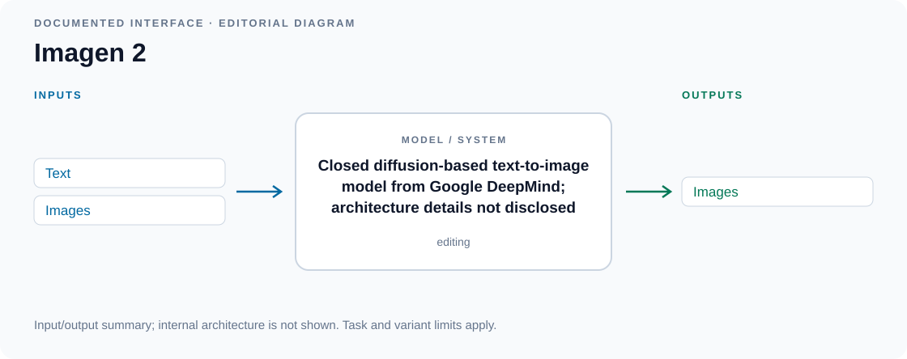

*Editorial input/output diagram · [Source](https://cloud.google.com/blog/products/ai-machine-learning/imagen-2-on-vertex-ai-is-now-generally-available)*

### Imagen 3

Imagen 3 is Google's third-generation Imagen model, described in a technical report submitted to arXiv in August 2024. The report calls it a latent diffusion model that generates 1024×1024 images from text, optionally followed by 2×, 4× or 8× upsampling, and trained on filtered image–text data paired with both original and Gemini-generated synthetic captions. Most of the report covers human and automatic evaluations and safety and responsibility work rather than the network design. On Vertex AI, Imagen 3 generation models reached general availability in 2024, and a separate `imagen-3.0-capability` model added mask-based editing and reference-image customization.

[Architecture and figure](../models/api.md#imagen-3) · [Paper](https://arxiv.org/abs/2408.07009) · [Docs](https://docs.cloud.google.com/vertex-ai/generative-ai/docs/release-notes)

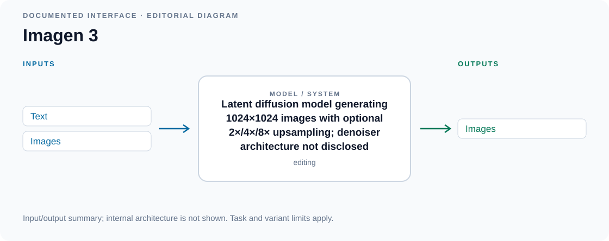

*Editorial input/output diagram · [Source](https://arxiv.org/abs/2408.07009)*

### Imagen 4

Imagen 4 is Google's fourth-generation Imagen model, announced at Google I/O on 2025-05-20 for the Gemini app, Whisk, Vertex AI and Workspace. Google highlights finer detail, better spelling and typography, and output up to 2K resolution. Its model card describes it as a latent diffusion model trained on filtered images with Gemini-generated synthetic captions, and lists text or image files as inputs. The family reached general availability in the Gemini API and Vertex AI in August 2025 as Imagen 4, Imagen 4 Fast and Imagen 4 Ultra. Google deprecated the Vertex AI Imagen endpoints in March 2026 and recommends Gemini 2.5 Flash Image instead.

[Architecture and figure](../models/api.md#imagen-4) · [Model card](https://storage.googleapis.com/deepmind-media/Model-Cards/Imagen-4-Model-Card.pdf) · [Announcement 1](https://blog.google/technology/ai/generative-media-models-io-2025/) · [Announcement 2](https://developers.googleblog.com/announcing-imagen-4-fast-and-imagen-4-family-generally-available-in-the-gemini-api/) · [Docs](https://docs.cloud.google.com/vertex-ai/generative-ai/docs/release-notes)

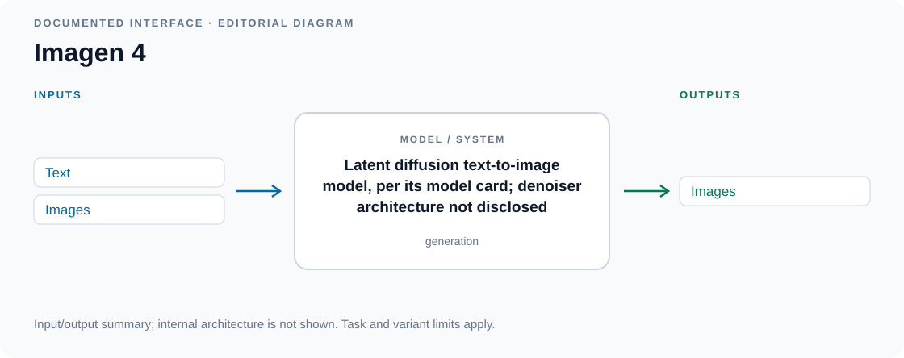

*Editorial input/output diagram · [Source](https://storage.googleapis.com/deepmind-media/Model-Cards/Imagen-4-Model-Card.pdf)*

### Imagine Flash

Imagine Flash (Meta GenAI, 2024) accelerates Meta's Emu text-to-image diffusion model to one, two or three sampling steps. Its main idea, backward distillation, trains the student on latents produced by its own backward (denoising) trajectory rather than on forward-noised real images, removing the mismatch between training inputs and what the student sees at inference. A Shifted Reconstruction Loss makes the teacher's target depend on the timestep, transferring global structure at high noise and fine detail at low noise, and an inference-time Noise Correction addresses singularities in noise prediction. The paper reports quality comparable to the 25-step Emu teacher with three steps.

[Architecture and figure](../models/efficient.md#imagine-flash) · [Paper](https://arxiv.org/abs/2405.05224) · GitHub: no author-linked repository found

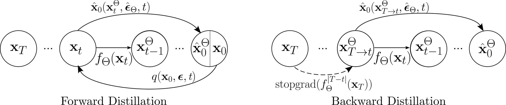

*Figure 3 · [Source](https://arxiv.org/abs/2405.05224)*

### Infinity

Infinity (ByteDance, 2024) scales up VAR-style next-scale autoregressive image generation to open-vocabulary text-to-image synthesis by replacing VAR's small per-scale codebook with bitwise, binary-spherical-quantized tokens and an Infinite-Vocabulary Classifier, letting the tokenizer vocabulary grow to 2^64 without an intractable softmax. A Bitwise Self-Correction training trick further closes the train-inference gap from teacher forcing, and the resulting 2B model generates 1024px images with strong text rendering and prompt following.

[Architecture and figure](../models/ar-token.md#infinity) · [Paper](https://arxiv.org/abs/2412.04431) · [GitHub](https://github.com/FoundationVision/Infinity) · [Model card](https://huggingface.co/FoundationVision/Infinity)

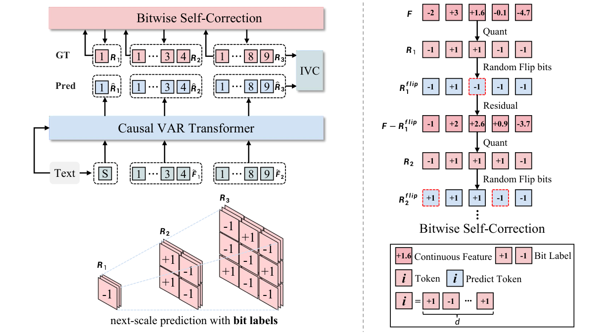

*Figure 3 · [Source](https://arxiv.org/abs/2412.04431)*

### InfinityStar

InfinityStar (ByteDance, NeurIPS 2025) builds on the Infinity bitwise next-scale design and extends it to video with a spacetime pyramid: an image pyramid for the first frame is followed by clip pyramids of 5-second clips, all predicted by one autoregressive transformer over discrete tokens. A single model performs text-to-image, text-to-video, image-to-video and video extrapolation, the last two without task-specific training. The paper adds a discrete video tokenizer initialized from a continuous one, stochastic quantizer depth in tokenizer training, semantic-scale repetition for early scales, and spacetime sparse attention that attends only to the last scale of the preceding clip. InfinityStar-T2I scores 0.79 on GenEval and 86.55 on DPG-Bench, and the video model reaches 83.74 on VBench.

[Architecture and figure](../models/ar-token.md#infinitystar) · [Paper](https://arxiv.org/abs/2511.04675) · [GitHub](https://github.com/FoundationVision/InfinityStar) · [Model card](https://huggingface.co/FoundationVision/InfinityStar)

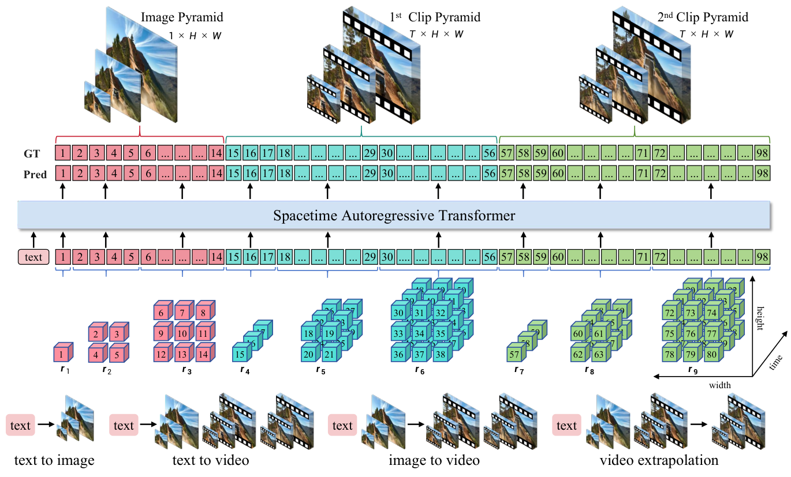

*Figure 1 · [Source](https://arxiv.org/abs/2511.04675)*

### InstaFlow

InstaFlow (UT Austin and collaborators, 2023) turns Stable Diffusion into a one-step generator using Rectified Flow. A reflow stage retrains the SD U-Net on noise–image pairs produced by the teacher so that the text-conditioned probability-flow trajectories become straighter and the noise-to-image coupling becomes simpler; a distillation stage then trains a student to map noise to the image in a single step. The paper shows that direct one-step distillation of SD produces blurry images, whereas distilling after reflow works. InstaFlow-0.9B keeps the SD 1.5 U-Net, and InstaFlow-1.7B uses a Stacked U-Net of two U-Nets in series.

[Architecture and figure](../models/efficient.md#instaflow) · [Paper](https://arxiv.org/abs/2309.06380) · [GitHub](https://github.com/gnobitab/InstaFlow) · [Model card](https://huggingface.co/XCLiu/instaflow_0_9B_from_sd_1_5)

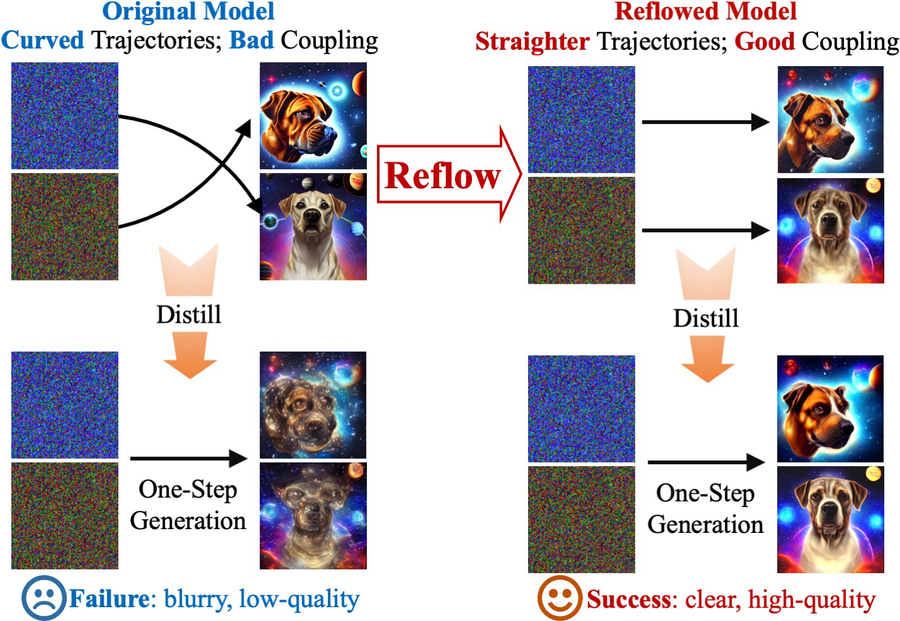

*Figure 3 · [Source](https://arxiv.org/abs/2309.06380)*

### Instella-T2I

Instella-T2I (AMD GenAI, 2025) is the first text-to-image model of the AMD Instella family and was trained on AMD Instinct MI300X GPUs. Its tokenizer encodes an image as a 1D sequence of binary vectors instead of one-hot codebook indices, so a 1024x1024 image needs only 128 tokens, a 32-fold reduction relative to standard VQ-VAEs. The generator is a decoder-style transformer whose every block receives image features from the previous block and text features from the same depth of a frozen language model. The same architecture is trained with a continuous-time Bernoulli diffusion objective and with a causal autoregressive objective. The paper reports competitive results without private data or post-training, with about 0.4 s for 20 sampling steps of the diffusion model.

[Architecture and figure](../models/dit.md#instella-t2i) · [Paper](https://arxiv.org/abs/2506.21022) · [GitHub](https://github.com/AMD-AGI/Instella-T2I)

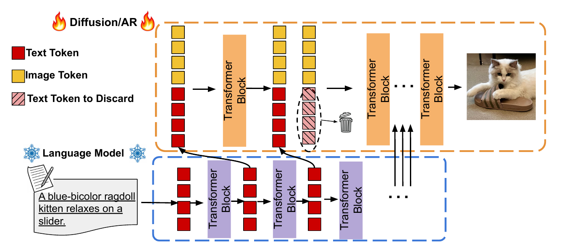

*Figure 3 (PDF p. 8) · [Source](https://arxiv.org/abs/2506.21022)*

### InternVL-U

InternVL-U is a unified multimodal model built on InternVL 3.5 that argues unified models should not force text and images through one homogeneous pipeline. Its design follows three principles: unified contextual modeling with modality-adaptive generation (a shared autoregressive context space, but a hybrid AR-for-text + flow-matching-for-images generative objective instead of tokenizing everything the same way), structural efficiency through modality-specific modules (a pretrained ViT-based encoder for context, plus a dedicated MMDiT generation head rather than a monolithic transformer), and decoupled visual representations (semantic ViT features for understanding, a separate VAE latent for generation, avoiding a single encoder having to serve both roles). Through three-stage progressive training, InternVL-U inherits InternVL 3.5's understanding and reasoning ability while gaining text-to-image generation and instruction-based editing, and can apply self-reflection reasoning from the MLLM to its generation and editing outputs.

[Architecture and figure](../models/unified.md#internvl-u) · [Paper](https://arxiv.org/abs/2603.09877) · [GitHub](https://github.com/OpenGVLab/InternVL-U) · [Model card](https://huggingface.co/InternVL-U/InternVL-U)

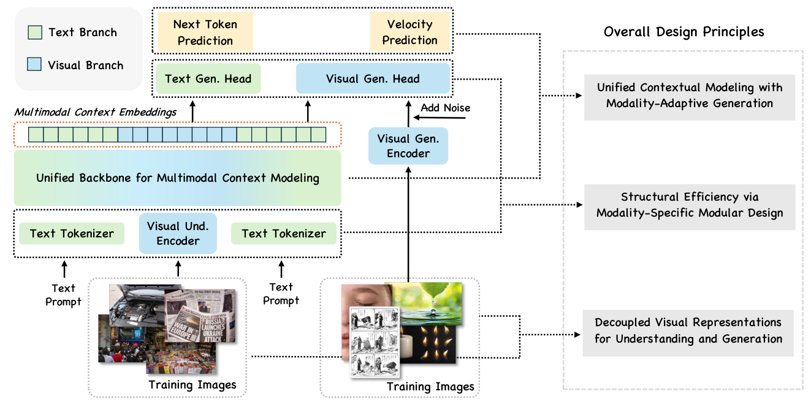

*Figure 3 · [Source](https://arxiv.org/abs/2603.09877)*

### Janus

Janus, from DeepSeek-AI with HKU and Peking University, is an autoregressive framework for unified multimodal understanding and generation. Its key idea is to decouple visual encoding: images for understanding are encoded by a SigLIP semantic encoder, while images for generation are represented as discrete VQ tokenizer IDs, yet both pathways feed a single shared autoregressive transformer. Text is predicted by the LLM's built-in head and image tokens by a separate, newly initialized image head; generated token IDs are decoded to pixels by the VQ decoder. The released 1.3B model handles visual question answering and text-to-image generation at 384×384.

[Architecture and figure](../models/unified.md#janus) · [Paper](https://arxiv.org/abs/2410.13848) · [GitHub](https://github.com/deepseek-ai/Janus) · [Model card](https://huggingface.co/deepseek-ai/Janus-1.3B)

*Figure 2 · [Source](https://arxiv.org/abs/2410.13848)*

### Janus-Pro

Janus-Pro is DeepSeek's scaled-up successor to Janus, a unified model for multimodal understanding and text-to-image generation. It keeps the Janus architecture, in which one autoregressive language-model transformer reads images through a SigLIP encoder for understanding and writes images as discrete VQ tokens for generation, and changes the training recipe, adds roughly 72 million synthetic aesthetic text-to-image samples, and scales the language model from 1.5B to 7B parameters. The paper reports improved instruction following on GenEval and DPG-Bench and more stable generation for short prompts.

[Architecture and figure](../models/unified.md#janus-pro) · [Paper](https://arxiv.org/abs/2501.17811) · [GitHub](https://github.com/deepseek-ai/Janus) · [Model card](https://huggingface.co/deepseek-ai/Janus-Pro-7B)

*Figure 3 · [Source](https://arxiv.org/abs/2501.17811)*

### JanusFlow

JanusFlow, from DeepSeek-AI with Peking University, HKU and Tsinghua, integrates rectified flow directly into an autoregressive language model. For understanding, a SigLIP encoder feeds image features to the LLM, which answers by next-token prediction. For generation, the LLM takes the text prompt and a noisy SDXL-VAE latent, processed by a small generation encoder, and a generation decoder turns its outputs into velocity vectors; the latent is updated iteratively from noise until t = 1 and decoded by the VAE. Understanding and generation encoders are decoupled, and a representation-alignment loss ties the LLM's intermediate generation features to the understanding encoder's features. The released 1.3B model works at 384×384.

[Architecture and figure](../models/unified.md#janusflow) · [Paper](https://arxiv.org/abs/2411.07975) · [GitHub](https://github.com/deepseek-ai/Janus) · [Model card](https://huggingface.co/deepseek-ai/JanusFlow-1.3B)

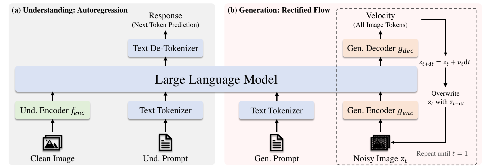

*Figure 2 · [Source](https://arxiv.org/abs/2411.07975)*

### JEPA-T

JEPA-T is a token-based text-to-image model that applies a joint-embedding predictive architecture to conditional image generation. Images are encoded to continuous VAE tokens and a high fraction of them is masked; a context encoder processes the visible tokens together with a learnable buffer and the projected CLIP text embedding, and a predictor reconstructs the masked tokens against an EMA target encoder. Text is injected at two points: added at the predictor input and through cross-attention after the predictor, and the raw text embedding is also fused before the flow-matching loss. Training combines the JEPA consistency loss with conditional flow matching. The paper reports ImageNet-1K 256x256 FID 1.42 and IS 298.3 for the base model and claims class-conditional and free-text generation from the same network.

[Architecture and figure](../models/continuous-ar.md#jepa-t) · [Paper](https://arxiv.org/abs/2510.00974) · [GitHub](https://github.com/justin-herry/JEPA-T)

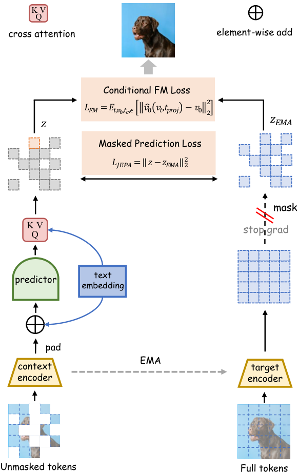

*Figure 2 · [Source](https://arxiv.org/abs/2510.00974)*

### JetFormer

JetFormer (Google DeepMind) is trained end to end to maximize the likelihood of raw images and text, with no separately pretrained image encoder, VAE or tokenizer. A transformer-based normalizing flow maps image patches losslessly to soft tokens; the same flow serves as image encoder for understanding and, inverted, as image decoder for generation. The autoregressive transformer predicts text tokens with a softmax and soft image tokens with a Gaussian mixture, trained on WebLI image-text pairs in both orders so that one model does text-to-image generation and image-to-text tasks such as captioning and VQA at 256×256. A noise curriculum that adds strong pixel noise early in training steers the model toward high-level image structure.

[Architecture and figure](../models/continuous-ar.md#jetformer) · [Paper](https://arxiv.org/abs/2411.19722) · [GitHub](https://github.com/google-research/big_vision)

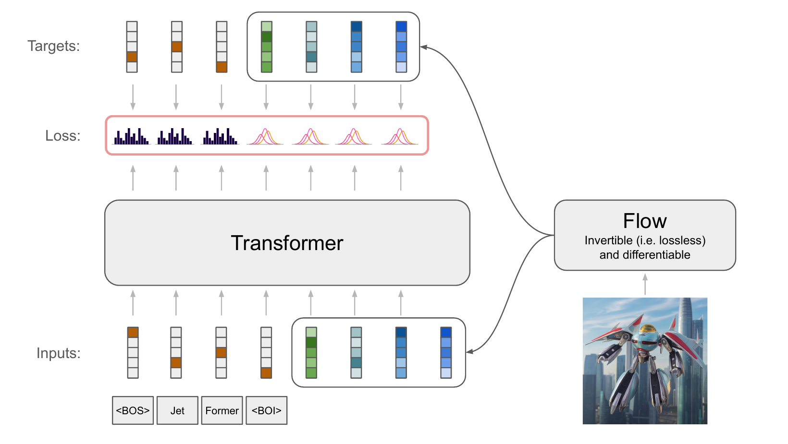

*Figure 1 (PDF p. 2) · [Source](https://arxiv.org/abs/2411.19722)*

### JoyAI-Image

JoyAI-Image, from JD.com's JD Open Source team, is a unified model for visual understanding, text-to-image generation and instruction-guided image editing built around spatial intelligence. A spatially enhanced MLLM serves both as the understanding engine and as the interface that turns prompts and source images into semantically and spatially grounded conditioning signals, which a 16B-parameter dual-stream MMDiT (following the Qwen-Image style but with MRoPE replacing MSRoPE) consumes to synthesize or edit images through iterative denoising. Training is progressive: the MLLM is first fine-tuned for spatial understanding, the MMDiT is then trained from scratch for generation using MLLM-derived priors, and the whole system is finally optimized for instruction-based editing. The paper emphasizes a bidirectional loop between enhanced spatial understanding, controllable spatial editing (e.g. camera viewpoint changes) and novel-view-assisted reasoning, reporting state-of-the-art or highly competitive results on understanding, generation, long-text rendering and editing benchmarks.

[Architecture and figure](../models/unified.md#joyai-image) · [Paper](https://arxiv.org/abs/2605.04128) · [GitHub](https://github.com/jd-opensource/JoyAI-Image) · [Model card](https://huggingface.co/jdopensource/JoyAI-Image-Edit)

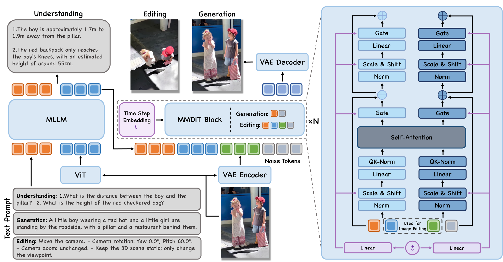

*Figure 4 · [Source](https://arxiv.org/abs/2605.04128)*

### JuZhou 1.0

JuZhou 1.0 is an edge-native Chinese text-to-image foundation model designed for fully offline, on-device generation rather than server-side deployment. Its compact ~0.387B-parameter stack pairs a small U-Net denoiser — whose early blocks drop self-attention to save compute while later blocks keep both self- and cross-attention — with a redesigned, highly compact VAE decoder (1.90M parameters) built from attention-free depthwise-pointwise convolutions. Chinese-CLIP ViT-H/14 replaces the usual English CLIP text towers for native Chinese semantic alignment, with a Qwen3-1.7B prompt refiner improving raw prompts before encoding; training uses rectified flow with DMD2 distillation for 4-step sampling and runs entirely on domestically developed Sugon K100 accelerators rather than NVIDIA hardware. Despite its small size, the base model reports a GenEval score of 0.69 (0.70 in the revised arXiv version), ahead of the much larger SDXL and SD3-Medium, and the pipeline runs on Android and iOS with an accompanying app.

[Architecture and figure](../models/efficient.md#juzhou-1) · [Paper](https://arxiv.org/abs/2606.28421) · [GitHub](https://github.com/HswAI2026/JuZhou-V1)

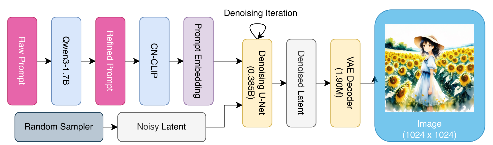

*Figure 4 · [Source](https://arxiv.org/abs/2606.28421)*

### Kandinsky 5.0 Image Lite

Kandinsky 5.0 Image Lite is the text-to-image member of Kandinsky Lab's Kandinsky 5.0 family of foundation models for image and video generation. It is a 6B-parameter CrossDiT -- a diffusion transformer whose blocks alternate self-attention over image tokens with cross-attention to text -- conditioned on Qwen2.5-VL token embeddings (passed through a dedicated linguistic token refiner) together with a pooled CLIP embedding, and it reuses the FLUX.1-dev VAE for image tokenization. The model is trained with flow matching rather than classic denoising diffusion. The same paper also introduces separate video generation models sharing family branding and some architectural ideas, but distinct video-specific components (3D VAE, temporal attention); this catalog entry covers only the image generation model, released with MIT-licensed code and weights.

[Architecture and figure](../models/dit.md#kandinsky-5) · [Paper](https://arxiv.org/abs/2511.14993) · [GitHub](https://github.com/kandinskylab/kandinsky-5) · [Model card](https://huggingface.co/kandinskylab/Kandinsky-5.0-T2I-Lite)

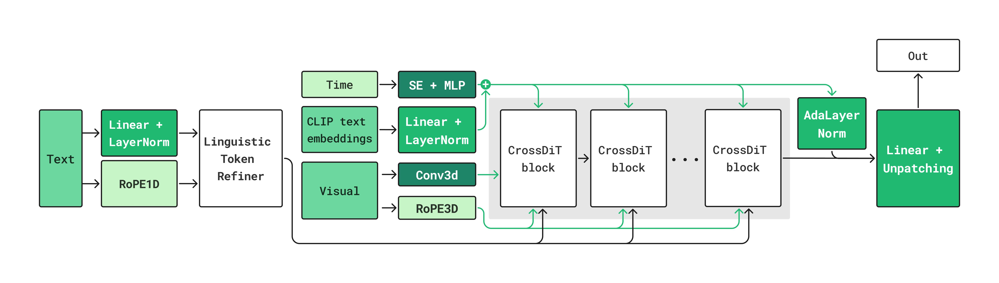

*Figure 10 · [Source](https://arxiv.org/abs/2511.14993)*

### KNN-Diffusion

KNN-Diffusion (Meta AI) trains a text-to-image model without any paired or unpaired text. A non-trainable retrieval model holds CLIP image embeddings in a kNN index; during training the generator is conditioned on an image's CLIP embedding and its k nearest neighbors, and at inference the CLIP text embedding and the neighbors retrieved with it replace them, so the neighbors bridge the gap between image and text embedding distributions. The authors apply the idea to two diffusion backbones: a discrete model that follows VQ-Diffusion over VQGAN tokens (the main 400M-parameter model, described as a tenth the size of baselines such as CogView, DALL-E and GLIDE) and a continuous pixel-space decoder re-implemented from DALL-E 2 without a prior, upsampled by separate super-resolution models. Swapping the retrieval index at inference generates out-of-distribution images, and a mask-free extension replaces a random local area with its nearest neighbor during training to enable text-driven local semantic manipulation.

[Architecture and figure](../models/masked.md#knn-diffusion) · [Paper](https://arxiv.org/abs/2204.02849) · GitHub: no author-linked repository found

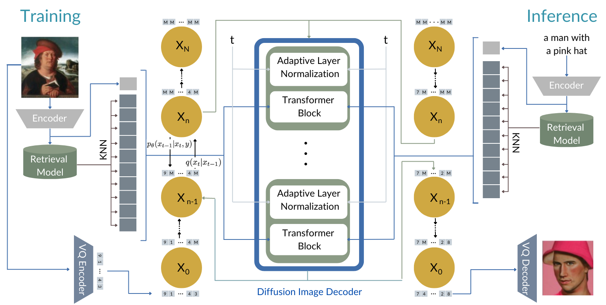

*Figure 5 · [Source](https://arxiv.org/abs/2204.02849)*

### KOALA

KOALA (ETRI and KAIST, 2023) builds smaller SDXL-class text-to-image models that run on 8GB consumer GPUs. On top of BK-SDM-style block removal, it cuts the number of transformer layers in SDXL's lowest-resolution blocks from 10 to 6 (KOALA-1B) or 5 (KOALA-700M, which also drops the mid-block), roughly halving or thirding the U-Net. The paper draws three lessons for distilling such a student: matching the teacher's self-attention features works better than matching only each stage's last feature map, high-resolution images with detailed captions matter more than data volume, and a step-distilled teacher lets the student sample in fewer steps. The released KOALA-Turbo (512px) and KOALA-Lightning (1024px) models are distilled from SDXL-Turbo and SDXL-Lightning on LAION-POP; KOALA-Lightning-700M generates a 1024px image in about 0.66 s at 10 steps on an RTX 4090.

[Architecture and figure](../models/efficient.md#koala) · [Paper](https://arxiv.org/abs/2312.04005) · [GitHub](https://github.com/youngwanLEE/sdxl-koala) · [Model card](https://huggingface.co/etri-vilab/koala-lightning-700m) · [Project](https://youngwanlee.github.io/KOALA/)

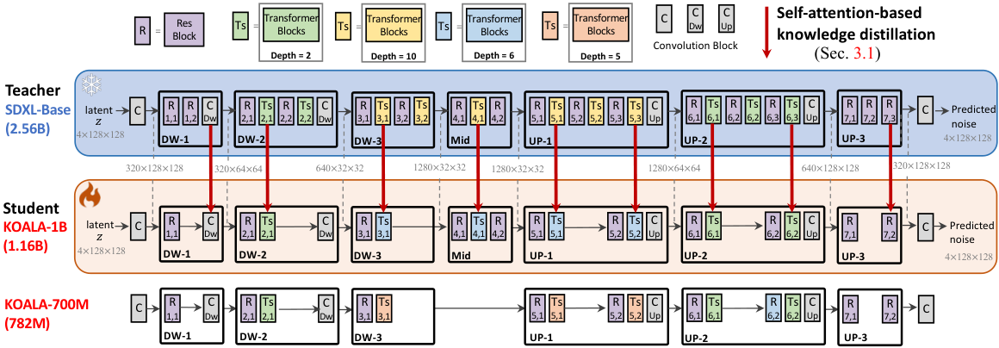

*Figure 2 · [Source](https://arxiv.org/abs/2312.04005)*

### Kolors

Kolors is a bilingual (Chinese and English) text-to-image latent diffusion model from Kuaishou's Kolors team. Its technical report keeps the U-Net architecture of SDXL and replaces the CLIP text encoders with ChatGLM3-6B-Base, whose penultimate output conditions the model with prompts of up to 256 tokens. Training data are re-captioned with a multimodal LLM (CogVLM) and mixed half-and-half with original captions, training is split into a concept-learning phase on billions of image-text pairs and a quality-improvement phase on manually graded high-aesthetic data, and high-resolution training extends the noise schedule from 1,000 to 1,100 steps to reach a lower terminal SNR. The report highlights Chinese text rendering and introduces the KolorsPrompts benchmark.

[Architecture and figure](../models/latent-unet.md#kolors) · [Paper](https://github.com/Kwai-Kolors/Kolors/blob/master/imgs/Kolors_paper.pdf) · [GitHub](https://github.com/Kwai-Kolors/Kolors) · [Model card](https://huggingface.co/Kwai-Kolors/Kolors)

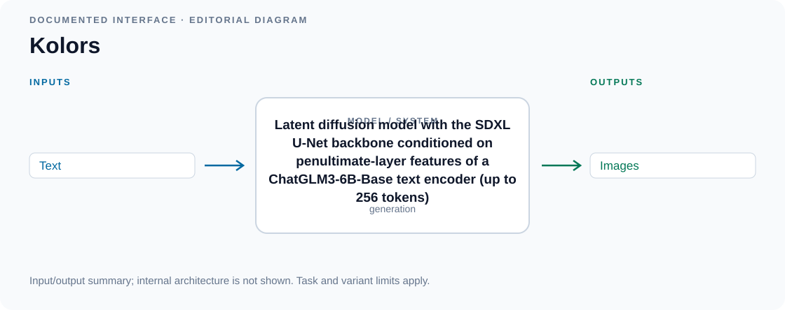

*Source-based architecture diagram · [Source](https://github.com/Kwai-Kolors/Kolors)*

### Kolors 2.0

Kolors 2.0 is Kuaishou's closed image generation model, unveiled together with the Kling AI 2.0 video model at the "From Vision to Screen" launch event announced on 2025-04-15. Kuaishou's release says it improves prompt adherence, cinematic visual quality and artistic style expression over its predecessor. It adds controllable image editing on the Kling AI platform, including partial redrawing and expanding and the addition, modification and repair of image content, plus a stylized transcription function that restyles an uploaded image from a style description while keeping its content. Kuaishou gives no architecture details for Kolors 2.0.

[Architecture and figure](../models/api.md#kolors-2) · [Announcement](https://www.nasdaq.com/press-release/kling-ai-advances-20-era-empowering-everyone-tell-great-stories-ai-2025-04-15)

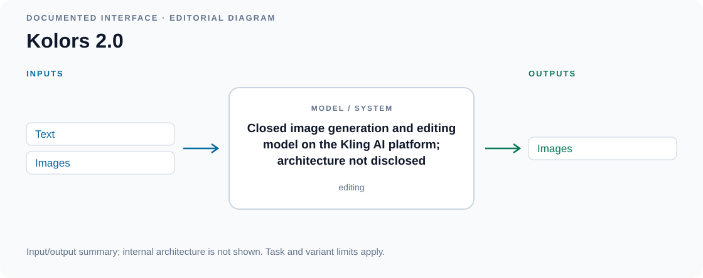

*Editorial input/output diagram · [Source](https://www.nasdaq.com/press-release/kling-ai-advances-20-era-empowering-everyone-tell-great-stories-ai-2025-04-15)*

### Krea 2

Krea 2 is Krea AI's first from-scratch text-to-image foundation model, using a single-stream MMDiT design where text and image tokens share the same attention and feed-forward weights rather than being processed on separate paths. It conditions on Qwen3-VL as a joint vision-language text encoder for richer multilingual understanding, and evaluated both the Qwen-Image and FLUX.2 autoencoders before settling on one for faster convergence. Krea trained the model through a full pipeline of pretraining, mid-training, supervised fine-tuning, preference optimization and reinforcement learning, releasing an undistilled Raw checkpoint and a distilled, few-step Turbo checkpoint under a gated community license, with inference code on GitHub under Apache-2.0.

[Architecture and figure](../models/dit.md#krea-2) · [Announcement](https://www.krea.ai/blog/krea-2-technical-report) · [GitHub](https://github.com/krea-ai/krea-2) · [Model card 1](https://huggingface.co/krea/Krea-2-Raw) · [Model card 2](https://huggingface.co/krea/Krea-2-Turbo)

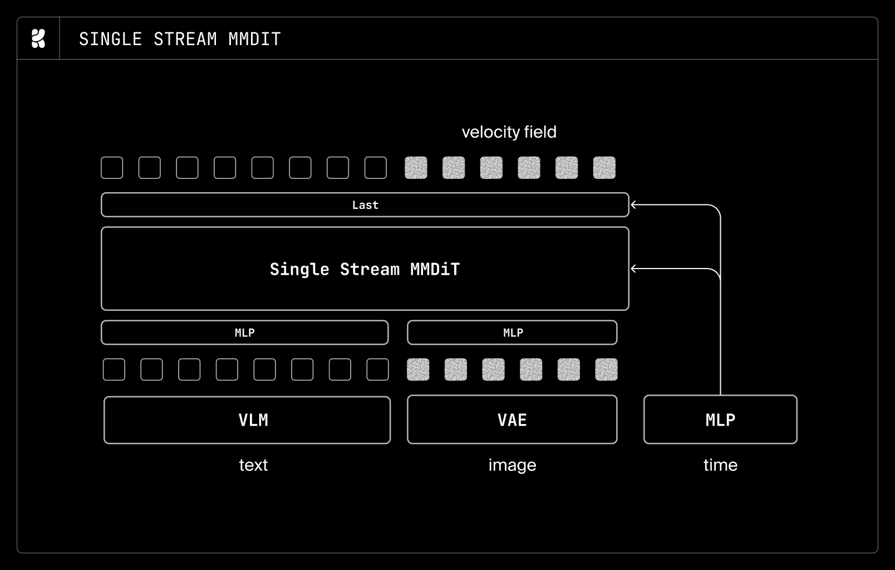

*Blog — 'Single-stream MMDiT' figure · [Source](https://www.krea.ai/blog/krea-2-technical-report)*

### L-Verse

L-Verse (LG AI Research) pairs an improved image tokenizer, AugVAE, with a single transformer that can translate in both directions between image and text. Segment embeddings tell the model which modality is the given reference and which is the target, so one set of weights performs both text-to-image generation and captioning, evaluated on MS-COCO and Conceptual Captions.

[Architecture and figure](../models/ar-token.md#l-verse) · [Paper](https://arxiv.org/abs/2111.11133) · GitHub: no author-linked repository found

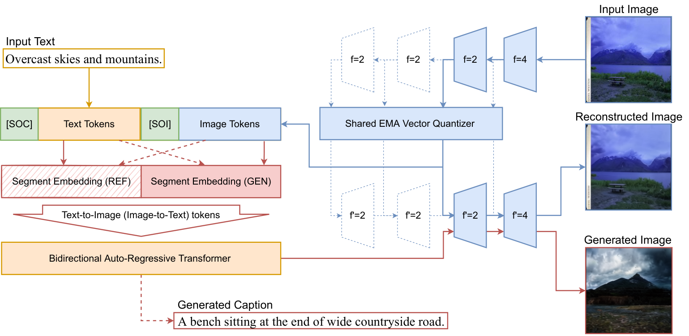

*Figure 2 · [Source](https://arxiv.org/abs/2111.11133)*

### LaDe

LaDe generates editable, layered graphic designs (e.g. an advertisement as separate background, subject and text layers) from a short prompt, rather than a single flattened image. A GPT-4o-mini prompt expander turns a brief request into a structured description (scene, per-layer captions, design type) encoded by FlanT5-XXL; an 11B latent diffusion transformer with a novel 4D RoPE positional scheme -- spanning spatial coordinates, layer index and a token-role flag -- then jointly denoises the composited design and each of its RGBA layers, decoded through a VAE fine-tuned to reconstruct alpha channels. Setting the number of layers to zero reduces the same model to plain text-to-image generation, and the model also supports the reverse task of decomposing an existing design image into its constituent layers.

[Architecture and figure](../models/dit.md#lade) · [Paper](https://arxiv.org/abs/2603.17965) · GitHub: no author-linked repository found

*Figure 5 · [Source](https://arxiv.org/abs/2603.17965)*

### Latent Consistency Models (LCM)

Latent Consistency Models (Tsinghua University, 2023) carry consistency models from pixel space to the latent space of Stable Diffusion. Instead of iterating a sampler for tens of steps, the distilled network directly predicts the endpoint of the guided reverse-diffusion ODE, so a 768×768 image can be generated in two to four steps (or one, at lower quality). Distillation is one-stage: the guidance scale is fed to the student as an extra input, and a skipping-step schedule speeds up training to about 32 A100 GPU hours. A follow-up report, LCM-LoRA, trains the same distillation as LoRA parameters for SD 1.5, SSD-1B and SDXL and uses them as a plug-in accelerator.

[Architecture and figure](../models/efficient.md#lcm) · [Paper 1](https://arxiv.org/abs/2310.04378) · [Paper 2](https://arxiv.org/abs/2311.05556) · [GitHub](https://github.com/luosiallen/latent-consistency-model) · [Model card 1](https://huggingface.co/SimianLuo/LCM_Dreamshaper_v7) · [Model card 2](https://huggingface.co/latent-consistency/lcm-sdxl)

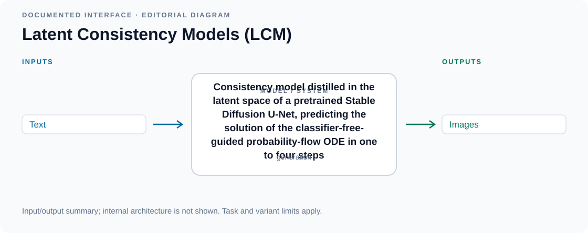

*Source-based architecture diagram · [Source](https://arxiv.org/abs/2310.04378)*

### Lavida-O

Lavida-O, from Adobe Research, is a unified masked diffusion model (MDM) that extends prior multimodal MDMs such as MMaDA and Muddit beyond simple low-resolution generation to object grounding, instruction-based image editing and 1024px text-to-image synthesis, all in one framework. It is built on LaViDa, an understanding-only masked diffusion model, and adds image generation through an Elastic Mixture-of-Transformers architecture that keeps the generation branch small and lets text and image tokens interact only in early layers, avoiding the cost of duplicating a full dense model. Lavida-O also introduces planning and iterative self-reflection during generation and editing, letting its own understanding capability critique and refine its outputs. The paper reports state-of-the-art results among masked diffusion models on RefCOCO grounding, GenEval text-to-image generation and ImgEdit editing, beating AR and continuous-diffusion baselines including Qwen2.5-VL and FLUX.1 Kontext-dev with up to 6.8x faster inference.

[Architecture and figure](../models/unified.md#lavida-o) · [Paper](https://arxiv.org/abs/2509.19244) · [GitHub](https://github.com/adobe-research/LaVida-O) · [Model card](https://huggingface.co/jacklishufan/LaViDa-O-v1.0)

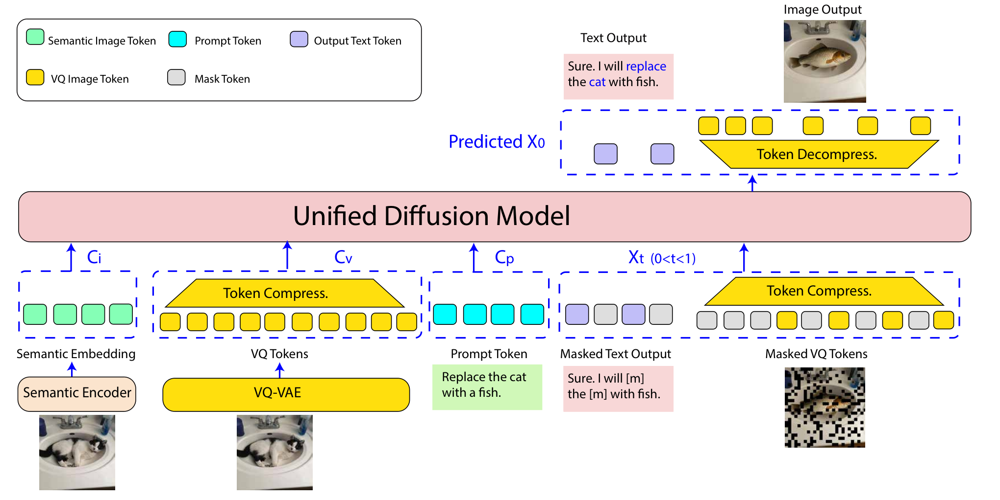

*Figure 2 · [Source](https://arxiv.org/abs/2509.19244)*

### LaVIT

LaVIT (Language-VIsion Transformer), from Peking University and Kuaishou Technology, treats images as a foreign language that an LLM can read and write. Its dynamic visual tokenizer passes EVA-CLIP ViT patch features through a token selector that keeps informative patches and a token merger that folds discarded patches into them, then quantizes the retained tokens with a learnable codebook, so the number of visual tokens varies with image content. The LLM is trained with one next image/text token objective, and generated visual tokens are decoded into images by a conditional denoising U-Net. The model handles visual understanding and text-to-image or multimodal-prompt image generation.

[Architecture and figure](../models/unified.md#lavit) · [Paper](https://arxiv.org/abs/2309.04669) · [GitHub](https://github.com/jy0205/LaVIT) · [Model card](https://huggingface.co/rain1011/LaVIT-7B-v2)

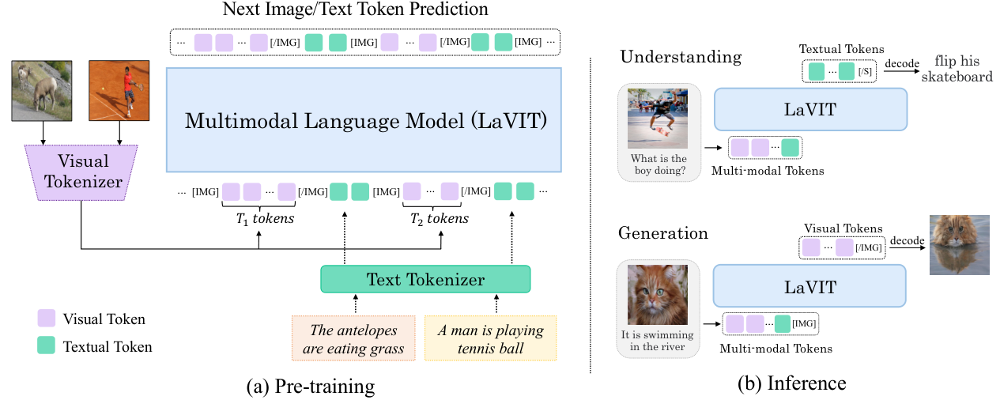

*Figure 2 · [Source](https://arxiv.org/abs/2309.04669)*

### LaytonGen

LaytonGen (OPPO AI Center, Nankai and Tsinghua) is the text-to-image generator built on Layton, a tokenizer that represents a 1024x1024 image with only 256 discrete tokens. Layton quantizes features from a downsampled input with a LlamaGen-initialized encoder and codebook, and decodes them with a pretrained latent diffusion model whose frozen blocks are paired with trainable cloned blocks through zero convolutions (the LADD structure); a few-step consistency variant of the LDM (Hyper-SD or TLCM) lets the decoder be trained with a pixel reconstruction loss in one or two steps. LaytonGen then trains an autoregressive transformer with cross-entropy on the 256 tokens, taking text features from Flan-T5-XL through an MLP. Training images are 40M FLUX.1-dev samples re-captioned with Qwen2-VL and filtered with ImageReward and MPS. The paper reports a GenEval score of 0.73, compared with 0.32 for LlamaGen and a lower value for Show-o.

[Architecture and figure](../models/ar-token.md#laytongen) · [Paper](https://arxiv.org/abs/2503.08377) · GitHub: no author-linked repository found

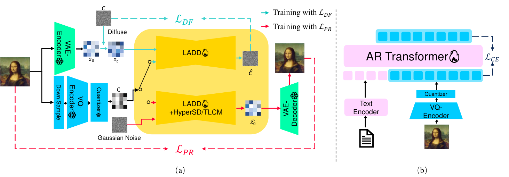

*Figure 2 · [Source](https://arxiv.org/abs/2503.08377)*

### Lens

Lens (Microsoft) targets training efficiency for foundational text-to-image models by prioritizing caption quality and batch information density over parameter count. Its 3.8B-parameter MMDiT backbone reuses a frozen large mixture-of-experts language model, GPT-OSS, as text encoder, concatenating features from several intermediate layers through a linear adapter rather than training a dedicated encoder, and is trained on Lens-800M, 800M image-text pairs with long, dense GPT-4.1-generated captions across varied resolutions and aspect ratios in every batch. The authors report Lens matches or exceeds text-to-image models with more than 6B parameters while needing only about 19.3% of the training compute of Z-Image, generates 1024-resolution images in 3.15 seconds on one H100, and reaches 0.84-second 4-step generation with a distilled turbo variant; an optional independent Reasoner module rewrites prompts before generation.

[Architecture and figure](../models/dit.md#lens) · [Paper](https://arxiv.org/abs/2605.21573) · GitHub: no author-linked repository found

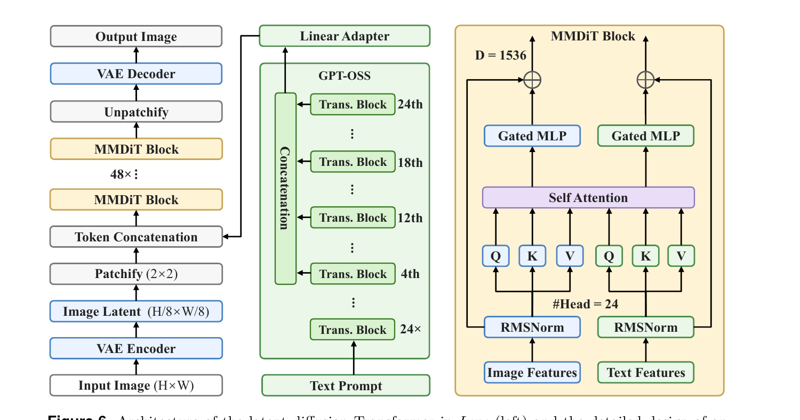

*Figure 6 (PDF p. 7) · [Source](https://arxiv.org/abs/2605.21573)*

### LI-DiT

LI-DiT is a 2024 research study on why large language models make poor prompt encoders for diffusion transformers despite their stronger language understanding, and what fixes that. The authors identify two causes: a mismatch between an LLM's training objective and what a diffusion model needs from text features, and a positional bias introduced by the LLM's causal attention mask. They address both with instruction-based prompting and a token-refiner module that restores full (non-causal) attention over the LLM's output before it conditions a DiT-style diffusion transformer through cross-attention. Using frozen LLaMA3-8B and Qwen1.5-7B encoders this way, the 10B-parameter LI-DiT model reportedly outperforms Stable Diffusion 3, DALL-E 3 and Midjourney V6 in the paper's human evaluation, though no code or weights were released.

[Architecture and figure](../models/dit.md#li-dit) · [Paper](https://arxiv.org/abs/2406.11831)

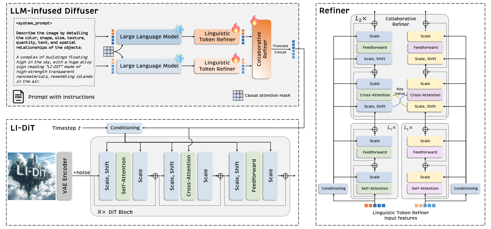

*Figure 5 · [Source](https://arxiv.org/abs/2406.11831)*

### Libra-2

Libra-2 extends the Libra family's decoupled vision-language design from image understanding only (Libra-1) to unified image-to-text understanding and text-to-image generation. Libra keeps one dedicated vision system and one dedicated language system rather than a single shared backbone, connecting them through cross-modal bridges (low-rank projections) and switch attention/switch FFN modules that route computation between self-modal and cross-modal pathways so each modality's own processing is not disturbed by the other. A continuous-space visual tokenizer combines a VAE encoder with CLIP semantic features through cross-attention, and a unified rotary positional encoding (UniRoPE) handles both 2D image and 1D text positions in one sequence; the language branch (initialized from LLaMA3.2-1B-Instruct) is trained with causal attention while the vision branch, trained from scratch, uses masked generation supervision, with the authors reporting that coupling understanding and generation in this decoupled design yields mutual improvements on both.

[Architecture and figure](../models/unified.md#libra-2) · [Paper](https://arxiv.org/abs/2608.20382) · [GitHub](https://github.com/YifanXu74/Libra)

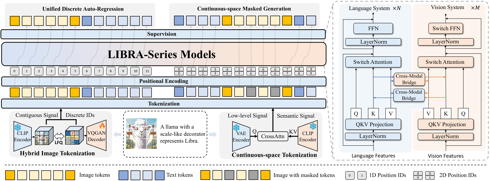

*Fig. 2 · [Source](https://arxiv.org/abs/2608.20382)*

### LightFusion

LightFusion (UC Santa Cruz, Tsinghua, Monash and ByteDance Seed, 2025) builds a unified multimodal model by fusing two publicly released models instead of training from scratch. Qwen2.5-VL-7B handles text and ViT tokens and keeps its understanding ability, while the Wan2.2-TI2V-5B diffusion transformer handles VAE tokens for generation. Multimodal self-attention blocks, zero-initialized so that both models start unchanged, are interleaved across all layers and let every token type attend to the others, so the generator receives hidden states from all VLM layers rather than only the last one. For editing, the source image enters as both ViT tokens and VAE tokens. The model is trained on about 35B tokens and reports 0.91 on GenEval and 82.16 on DPG-Bench.

[Architecture and figure](../models/unified.md#lightfusion) · [Paper](https://arxiv.org/abs/2510.22946) · GitHub: no author-linked repository found

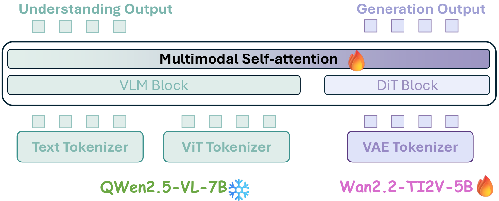

*Figure 2 · [Source](https://arxiv.org/abs/2510.22946)*

### LightGen

LightGen (HKUST and Everlyn AI) is a compact text-to-image model trained to show that image generation does not need hundreds of millions of images or billions of parameters. It builds on Fluid's masked autoregressive design: images are encoded to continuous latents by a frozen VAE, patchified and randomly masked, a masked encoder-decoder predicts semantic tokens, and a tiny diffusion MLP turns them into image tokens under a diffusion loss. Text from a frozen T5-XXL encoder is aligned by a trainable text aligner and enters as keys and values of a cross-attention step, and interpolated positional embeddings allow several resolutions. The training data are synthetic: captions from understanding models are rendered into images by strong text-to-image models, giving about 2M images, and a final Direct Preference Optimization stage targets positional accuracy and fine detail. The paper reports GenEval 0.62 at 512x512 with 0.7B parameters and demonstrates zero-shot inpainting.

[Architecture and figure](../models/continuous-ar.md#lightgen) · [Paper](https://arxiv.org/abs/2503.08619) · [GitHub](https://github.com/XianfengWu01/LightGen) · [Model card](https://huggingface.co/Beckham808/LightGen)

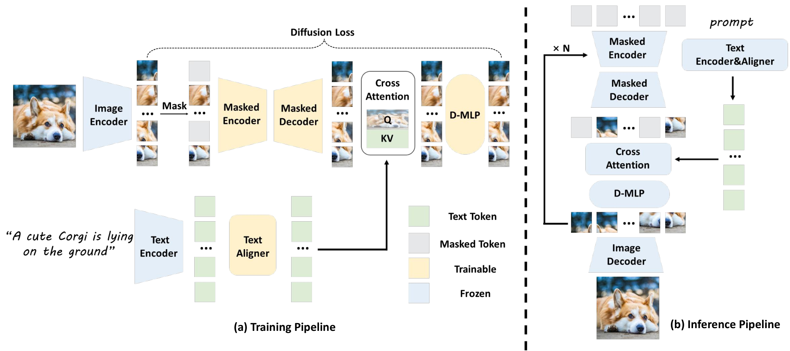

*Figure 2 · [Source](https://arxiv.org/abs/2503.08619)*

### LINA

LINA studies how to design compute-efficient linear attention for continuous-token autoregressive text-to-image models, an approach otherwise bottlenecked by high computational cost. Through a systematic scaling analysis the authors find that division-based (not subtraction-based) normalization scales better for linear generative transformers, that depthwise convolution for locality is important for autoregressive image generation, and they extend gating mechanisms from causal to bidirectional linear attention with a new KV gate that assigns token-wise memory weights similar to forget gates in language models. Built on these findings, LINA is a full text-to-image system generating high-fidelity 1024x1024 images, achieving 2.18 FID on class-conditional ImageNet and 0.74 GenEval, with a single linear-attention module cutting FLOPs by about 61% versus softmax attention.

[Architecture and figure](../models/continuous-ar.md#lina) · [Paper](https://arxiv.org/abs/2601.22630) · [GitHub](https://github.com/techmonsterwang/LINA)

*Figure 2 · [Source](https://arxiv.org/abs/2601.22630)*

### Liquid

Liquid, from ByteDance, HUST and HKU, argues that visual understanding and generation can be added to an LLM without special vision components by simply extending the vocabulary with image codes. Text is BPE-tokenized and images are converted into discrete tokens by a VQVAE image tokenizer; both token streams share one vocabulary that an otherwise-unmodified autoregressive LLM predicts next-token by next-token, so text-to-image generation, image understanding and text generation are all the same task for the model, and existing LLM scaling behavior is shown to transfer to visual generation.

[Architecture and figure](../models/unified.md#liquid) · [Paper](https://arxiv.org/abs/2412.04332) · [GitHub](https://github.com/FoundationVision/Liquid) · [Model card](https://huggingface.co/Junfeng5/Liquid_V1_7B)

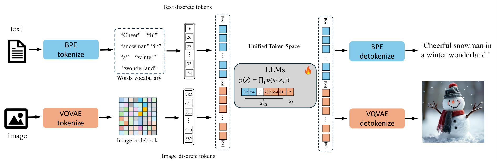

*Figure 2 · [Source](https://arxiv.org/abs/2412.04332)*

### LLaDA-Image

LLaDA-Image (Ant Group's inclusionAI) is a text-to-image and instruction-editing system that pairs a 6B diffusion transformer trained from scratch with a frozen multimodal understanding module built on the LLaDA2.0-Mini diffusion language model, connected through cross-attention and a lightweight connector rather than sharing weights end-to-end. It reuses a FLUX.2 VAE for image tokenization and trains with parameter-free RMSNorm and the Muon optimizer on a large image-only-then-paired-data curriculum, reporting open-source state-of-the-art scores on Qwen-Image-Bench; a distilled LLaDA-Image-Turbo variant reduces sampling to 2-4 steps. The authors release model weights, training code and training recipes.

[Architecture and figure](../models/dit.md#llada-image) · [Paper](https://arxiv.org/abs/2609.03796) · [GitHub](https://github.com/inclusionAI/LLaDA-Image)

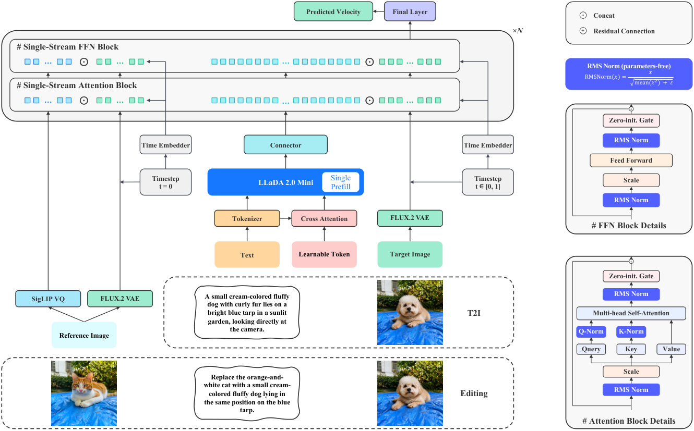

*Figure 3 · [Source](https://arxiv.org/abs/2609.03796)*

### LLaDA-o

LLaDA-o extends the LLaDA masked-diffusion language model into a unified multimodal system by decoupling understanding and generation into two diffusion processes that nonetheless share one attention backbone, rather than bolting a separate diffusion decoder onto a frozen LLM. A discrete masked-diffusion 'understanding expert', initialized from LLaDA-8B-Instruct, handles text and visual tokens for comprehension tasks, while a continuous rectified-flow 'generation expert' -- initialized from the same architecture with newly added time-embedding parameters -- denoises FLUX-VAE image latents for text-to-image generation. The two experts interact only through a shared, efficient attention mechanism (intra-modality bidirectional attention) that keeps cross-modal conditioning global while avoiding the training conflicts the authors report from a single shared token stream.

[Architecture and figure](../models/unified.md#llada-o) · [Paper](https://arxiv.org/abs/2603.01068) · [GitHub](https://github.com/ML-GSAI/LLaDA-o)

*Figure 2 (PDF p. 4) · [Source](https://arxiv.org/abs/2603.01068)*

### LLaDA2.0-Uni

LLaDA2.0-Uni, from Ant Group's inclusionAI, is a unified masked discrete-diffusion language model (dLLM) for multimodal understanding, text-to-image generation and image editing. It argues prior unified masked-diffusion models (MMaDA, Lumina-DiMOO) lag behind AR-based unified models because their reconstruction-focused VQ tokenizers lack semantic richness and over-compress images; LLaDA2.0-Uni instead introduces SigLIP-VQ, a fully semantic discrete tokenizer, so that both text and images can be optimized under one shared block-wise masked diffusion objective inside a 16B MoE dLLM backbone (LLaDA2.0-mini). A dedicated diffusion decoder, optimized through distillation to run in just 8 inference steps, turns the backbone's predicted semantic image tokens into high-fidelity pixels. The paper reports understanding performance competitive with specialized VLMs like Qwen2.5-VL, strong text-to-image generation, flexible single/multi-reference image editing, and native support for interleaved generation and reasoning.

[Architecture and figure](../models/unified.md#llada2-uni) · [Paper](https://arxiv.org/abs/2604.20796) · [GitHub](https://github.com/inclusionAI/LLaDA2.0-Uni) · [Model card](https://huggingface.co/inclusionAI/LLaDA2.0-Uni)

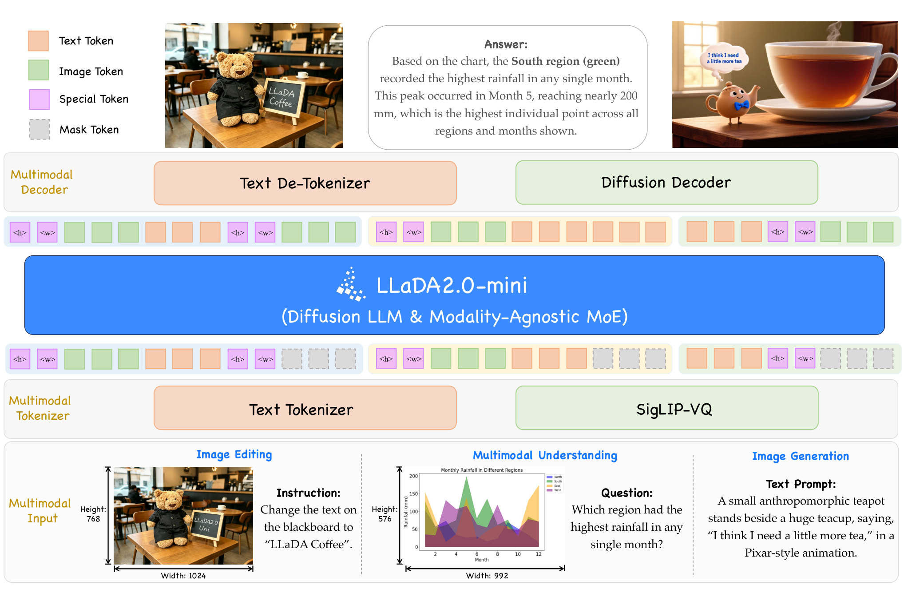

*Figure 4 · [Source](https://arxiv.org/abs/2604.20796)*

### LlamaGen

LlamaGen (HKU and ByteDance, 2024) shows that a standard Llama-architecture transformer, without any image-specific architectural changes, can do competitive text-to-image generation as next-token prediction over discrete VQGAN tokens. The authors study image tokenizer design, model scaling from 100M to 3.1B parameters, and training-data quality, and release two 775M-parameter text-conditional checkpoints trained in two stages on web and high-aesthetic data.

[Architecture and figure](../models/ar-token.md#llamagen) · [Paper](https://arxiv.org/abs/2406.06525) · [GitHub](https://github.com/FoundationVision/LlamaGen) · [Model card](https://huggingface.co/FoundationVision/LlamaGen)

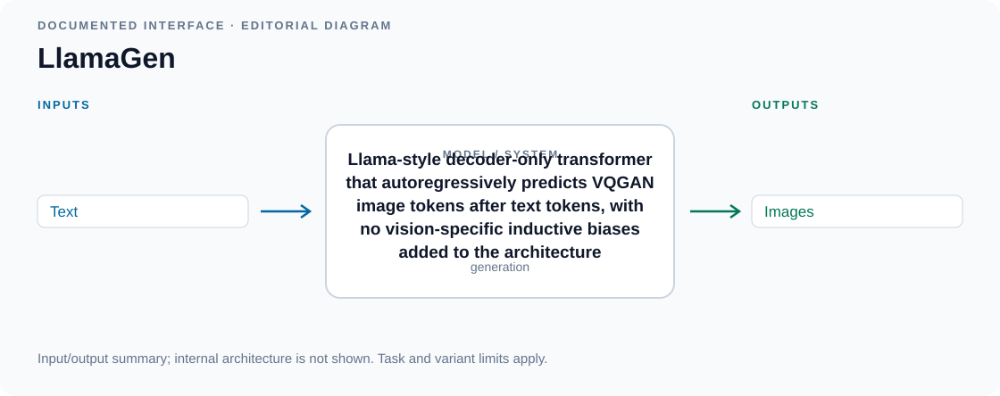

*Source-based architecture diagram · [Source](https://arxiv.org/abs/2406.06525)*

### LongCat-Image

LongCat-Image is Meituan's open 6B-parameter text-to-image diffusion transformer, following the FLUX-style pattern of a smaller number of double-stream blocks (where text and image tokens are processed on separate paths joined by attention) feeding into a larger number of single-stream blocks that process both modalities together. It replaces the usual CLIP/T5 combination with a single Qwen2.5-VL-7B vision-language model as text encoder and handles in-image text rendering through simple character-level tokenization of quoted text rather than a dedicated glyph module. Its VAE is derived from FLUX.1-dev's with an added token-merging step for efficiency. A companion LongCat-Image-Edit model reuses the same backbone with reference-image conditioning for instruction-based editing. Both the technical report and open weights were released under Apache-2.0.

[Architecture and figure](../models/dit.md#longcat-image) · [Paper](https://arxiv.org/abs/2512.07584) · [GitHub](https://github.com/meituan-longcat/LongCat-Image) · [Model card](https://huggingface.co/meituan-longcat/LongCat-Image)

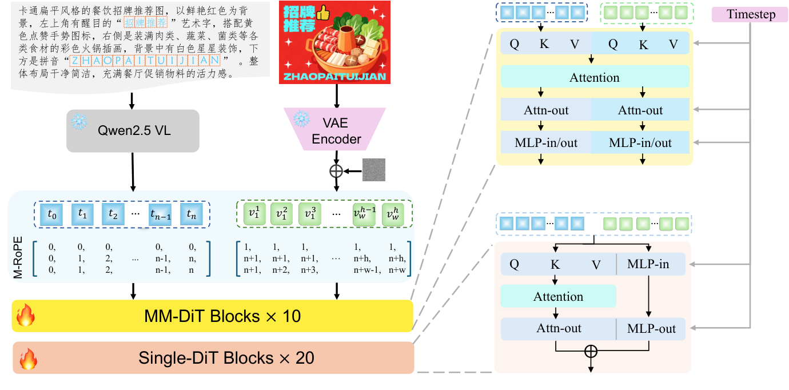

*Figure 12 · [Source](https://arxiv.org/abs/2512.07584)*

### LongCat-Next

LongCat-Next, from Meituan's LongCat team, is a native multimodal foundation model built under a proposed Discrete Native Autoregression (DiNA) paradigm: rather than mixing autoregressive text prediction with a separate diffusion or continuous-embedding generator, every modality (text, vision, audio) is represented as discrete tokens in one shared vocabulary, and one modality-agnostic MoE decoder-only backbone (LongCat-Flash) predicts them all next-token-style. Its key vision component, dNaViT, is a paired tokenizer/de-tokenizer that converts images to and from hierarchical discrete tokens at arbitrary resolution using semantic-and-aligned encoders plus residual vector quantization, with up to 28x compression while preserving both semantics (for understanding) and reconstructable detail (for generation). The paper reports LongCat-Next surpassing existing unified frameworks such as Qwen3-Omni, beating specialized understanding models like Qwen3VL-A3B, and competing with FLUX.1-dev on high-fidelity text-to-image generation, particularly text rendering, plus RL post-training for image generation quality.

[Architecture and figure](../models/unified.md#longcat-next) · [Paper](https://arxiv.org/abs/2603.27538) · [GitHub](https://github.com/meituan-longcat/LongCat-Next) · [Model card](https://huggingface.co/meituan-longcat/LongCat-Next)

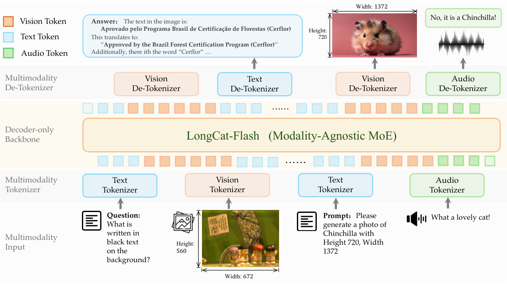

*Figure 2 · [Source](https://arxiv.org/abs/2603.27538)*

### LongTextAR

LongTextAR (Central South University and Microsoft) targets images containing paragraphs of text, such as slides and documents, which short-prompt text-to-image systems render poorly. The authors first find that VQ image tokenizers in autoregressive models, such as Chameleon's, lose text detail, and then train TextBinarizer, a binary tokenizer that avoids a codebook embedding and reconstructs dense text better. The autoregressive model uses a Llama2-based language model with a 65,536-entry BPE vocabulary whose first entries are allocated to the visual tokens; only the visual-token embeddings are updated, so the language model's text handling is kept. The paper reports gains over SD3.5 Large and GPT-4o with DALL-E 3 on long-text OCR accuracy and F-measure, controllable font, size, colour and alignment, and an interleaved slide-generation demonstration.

[Architecture and figure](../models/ar-token.md#longtextar) · [Paper](https://arxiv.org/abs/2503.20198) · [Project](https://fingerrec.github.io/longtextar) · GitHub: no author-linked repository found

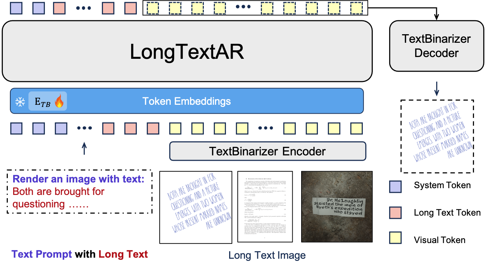

*Figure 3 · [Source](https://arxiv.org/abs/2503.20198)*

### Luma Uni-1

Uni-1 is Luma AI's first unified understanding and generation model, offered for image generation and editing in the Luma app. Luma says unified models represent different modalities in one interleaved sequence, and its Uni-1.1 API announcement (2026-05-05) describes the model as a decoder-only autoregressive transformer in which text and image tokens share a single sequence for both input and output. The documented interface covers text-to-image generation, up to nine reference images to preserve identity, composition or style, and natural-language editing such as background swaps, lighting changes and localized edits, plus control of camera angle, lighting and composition. The Uni-1.1 API offers Uni-1.1 and Uni-1.1 Max. No technical report has been published.

[Architecture and figure](../models/api.md#luma-uni-1) · [Project](https://lumalabs.ai/uni-1) · [Announcement](https://lumalabs.ai/news/uni-1-1-api)

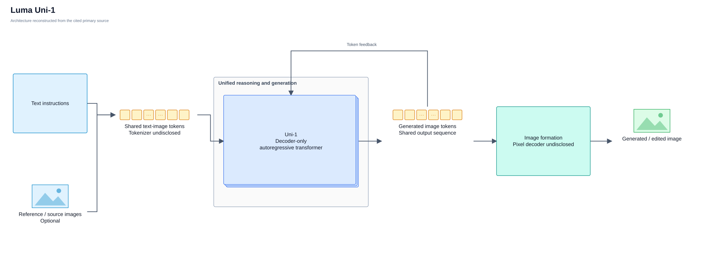

*Source-based architecture diagram · [Source](https://lumalabs.ai/news/uni-1-1-api)*

### Lumina-DiMOO

Lumina-DiMOO, from the Lumina/Alpha-VLLM team, is an open unified model that uses fully discrete diffusion rather than autoregression or hybrid AR-diffusion for both text and image tokens. Starting from the pretrained LLaDA-Base diffusion LLM, it extends the vocabulary with discrete image tokens from an aMUSEd-VQ tokenizer and trains a single masked-token denoising objective shared across modalities, which the paper reports yields much faster sampling (32x over the autoregressive Lumina-mGPT 2.0, plus a further 2x from a training-free Max-Logit Cache) than prior unified paradigms. It supports text-to-image generation at arbitrary and high resolution and a range of image-to-image tasks (editing, inpainting, subject-driven and controllable generation, style transfer) alongside image understanding, and reports first place on the open-source UniGenBench leaderboard at the time of the report.

[Architecture and figure](../models/unified.md#lumina-dimoo) · [Paper](https://arxiv.org/abs/2510.06308) · [GitHub](https://github.com/Alpha-VLLM/Lumina-DiMOO) · [Model card](https://huggingface.co/Alpha-VLLM/Lumina-DiMOO)

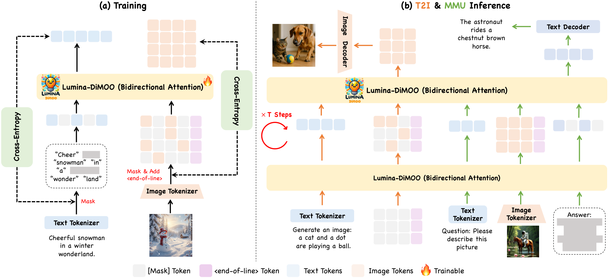

*Figure 3 · [Source](https://arxiv.org/abs/2510.06308)*

### Lumina-Image 2.0

Lumina-Image 2.0 is Alpha-VLLM's follow-up to the Lumina-Next diffusion transformer, redesigning how text and image tokens interact. Instead of cross-attention or the two-stream joint-attention blocks used by Stable Diffusion 3 and FLUX, it concatenates Gemma2-encoded text tokens and noised image tokens into a single sequence and lets one set of self-attention layers ('Unified Next-DiT') attend across both, which the authors argue improves text-image interaction and simplifies extending the model to new tasks. Training data quality comes from a purpose-built captioning pipeline (UniCap) that fine-tunes vision-language models to produce detailed, multi-granularity, bilingual captions rather than relying on off-the-shelf alt text. The 2.6B-parameter model and code were released under Apache-2.0.

[Architecture and figure](../models/dit.md#lumina-image-2) · [Paper](https://arxiv.org/abs/2503.21758) · [GitHub](https://github.com/Alpha-VLLM/Lumina-Image-2.0) · [Model card](https://huggingface.co/Alpha-VLLM/Lumina-Image-2.0)

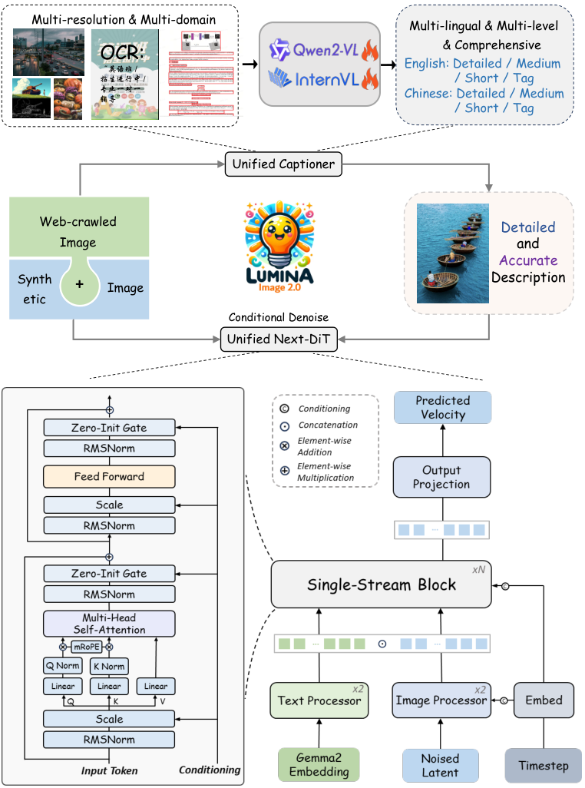

*Figure 2 · [Source](https://arxiv.org/abs/2503.21758)*

### Lumina-mGPT

Lumina-mGPT (Shanghai AI Laboratory and collaborators, 2024) turns Meta's Chameleon multimodal transformer into a dedicated photorealistic text-to-image generator by continuing its autoregressive pretraining and adding resolution-control prompt designs, rather than training a new architecture from scratch. A single 7B decoder-only model handles flexible-resolution text-to-image generation alongside other tasks such as controllable and subject-driven generation.

[Architecture and figure](../models/ar-token.md#lumina-mgpt) · [Paper](https://arxiv.org/abs/2408.02657) · [GitHub](https://github.com/Alpha-VLLM/Lumina-mGPT) · [Model card](https://huggingface.co/Alpha-VLLM/Lumina-mGPT-7B-768)

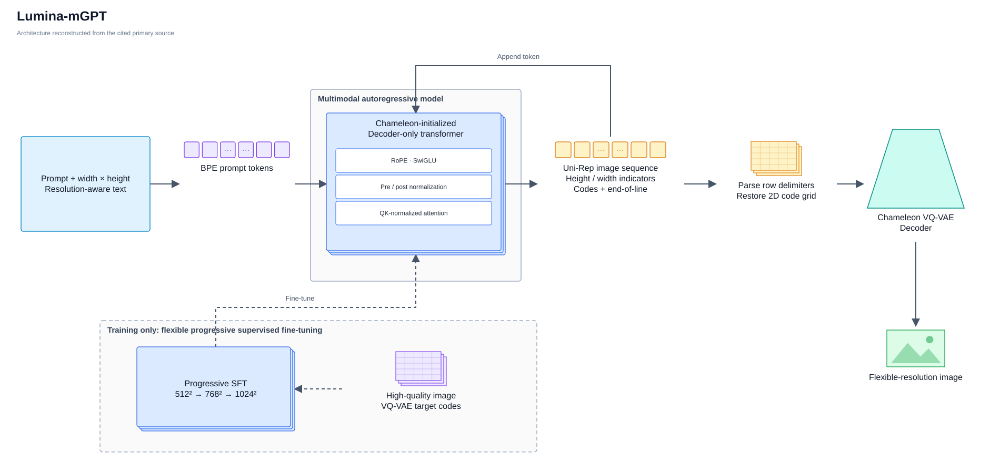

*Source-based architecture diagram · [Source](https://arxiv.org/abs/2408.02657)*

### Lumina-mGPT 2.0

Lumina-mGPT 2.0 (Shanghai AI Laboratory and collaborators, 2025) rebuilds Lumina-mGPT as a stand-alone autoregressive image model trained from scratch, rather than fine-tuned from Chameleon, unifying text-to-image generation, subject-driven generation, multi-turn image editing, controllable generation and dense prediction in a single decoder-only transformer conditioned through system prompts and an SBER-MoVQGAN tokenizer.

[Architecture and figure](../models/ar-token.md#lumina-mgpt-2) · [Paper](https://arxiv.org/abs/2507.17801) · [GitHub](https://github.com/Alpha-VLLM/Lumina-mGPT-2.0) · [Model card](https://huggingface.co/Alpha-VLLM/Lumina-mGPT-2.0)

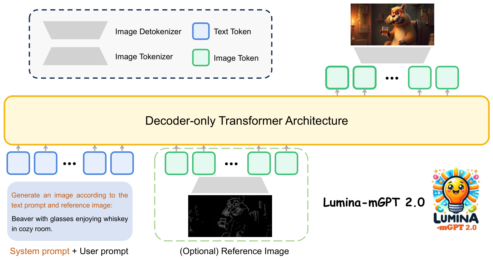

*Figure 2 · [Source](https://arxiv.org/abs/2507.17801)*

### Lumina-Next

Lumina-Next is the successor to Lumina-T2X from Shanghai AI Laboratory's Alpha-VLLM team. It replaces the Flag-DiT backbone with Next-DiT, which uses 3D rotary position embeddings instead of explicit line-break tokens, sandwich normalization to keep activations stable, and grouped-query attention for efficiency. Paired with the small Gemma-2B language model as text encoder, the 2B Next-DiT is reported to beat the earlier 5B Lumina-T2I at lower cost, and new RoPE scaling rules, sampling schedules and token pooling let it extrapolate to 2K resolution and sample in few steps without retraining.

[Architecture and figure](../models/dit.md#lumina-next) · [Paper](https://arxiv.org/abs/2406.18583) · [GitHub](https://github.com/Alpha-VLLM/Lumina-T2X) · [Model card](https://huggingface.co/Alpha-VLLM/Lumina-Next-SFT)

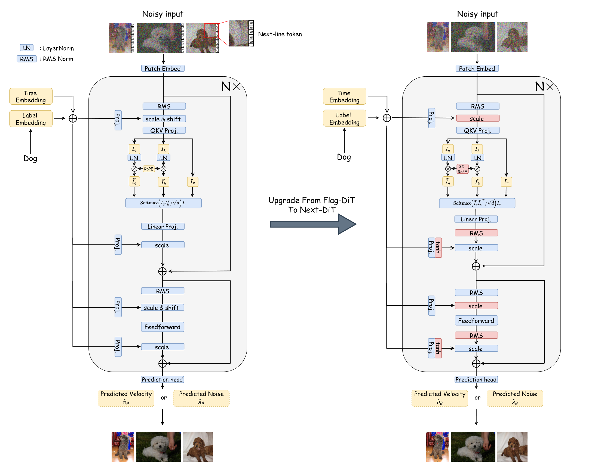

*Figure 2 · [Source](https://arxiv.org/abs/2406.18583)*

### Lumina-T2X (Lumina-T2I)

Lumina-T2X is a framework from Shanghai AI Laboratory's Alpha-VLLM team for generating images, video, multi-view images and audio with one flow-based diffusion transformer design, Flag-DiT. Its text-to-image instance, Lumina-T2I, scales a DiT to 5B parameters with LLM-style stabilizers (RMSNorm, key-query normalization, rotary embeddings), trains it with flow matching, and conditions it on a large language model through gated, zero-initialized attention. Encoding images as token sequences with explicit line-break tokens lets the model generate at aspect ratios and resolutions beyond those seen in training.

[Architecture and figure](../models/dit.md#lumina-t2x) · [Paper](https://arxiv.org/abs/2405.05945) · [GitHub](https://github.com/Alpha-VLLM/Lumina-T2X) · [Model card](https://huggingface.co/Alpha-VLLM/Lumina-T2I)

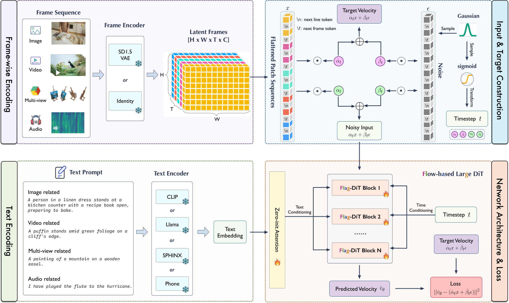

*Figure 3 · [Source](https://arxiv.org/abs/2405.05945)*

### LWM

LWM (Large World Model), from UC Berkeley, is a general-purpose autoregressive transformer trained on long video-and-language sequences to build a 'world model' with up to a 1M-token context. Every modality is discretized to a shared vocabulary: text uses a BPE tokenizer and each video frame (or standalone image) is tokenized into 256 discrete tokens by a VQGAN, so the same next-token-prediction transformer can answer long-document and long-video questions, and, run in the other direction, generate images and videos from text prompts.

[Architecture and figure](../models/unified.md#lwm) · [Paper](https://arxiv.org/abs/2402.08268) · [GitHub](https://github.com/LargeWorldModel/LWM)

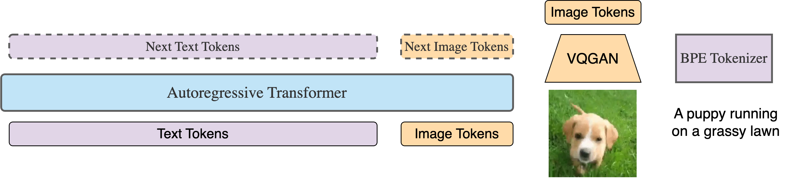

*Figure 3 · [Source](https://arxiv.org/abs/2402.08268)*

### M6

M6 (Alibaba and Tsinghua, 2021) is a large Chinese multimodal pretrained model scaled to 10 and 100 billion parameters. Beyond understanding and captioning tasks, the authors fine-tune it for text-guided image generation by teaching it to emit discrete image codes after a text prompt, demonstrating e-commerce product images and clip art generated from Chinese product titles.

[Architecture and figure](../models/ar-token.md#m6) · [Paper](https://arxiv.org/abs/2103.00823) · GitHub: no author-linked repository found

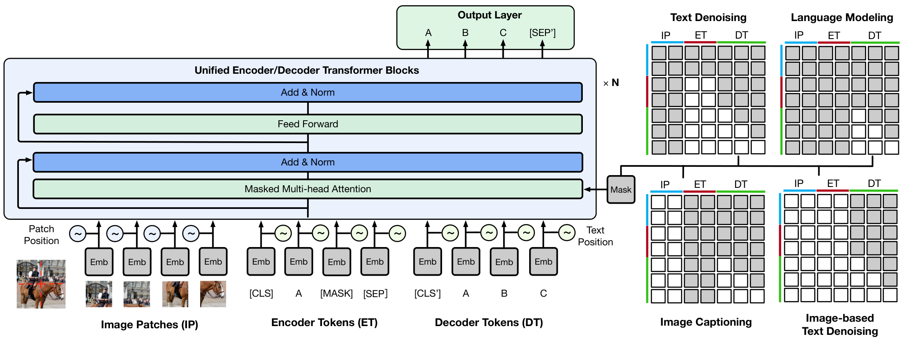

*Figure 3 · [Source](https://arxiv.org/abs/2103.00823)*

### M6-UFC

M6-UFC (Alibaba and Tsinghua, 2021) unifies text-to-image generation with image-conditioned controllable synthesis by putting textual, visual and preservation control signals into one token sequence for a single bidirectional transformer, then decoding the target image tokens with an iterative non-autoregressive procedure (PNAG) that refines only the least confident tokens at each step, rather than a fixed left-to-right order.

[Architecture and figure](../models/masked.md#m6-ufc) · [Paper](https://arxiv.org/abs/2105.14211) · GitHub: no author-linked repository found

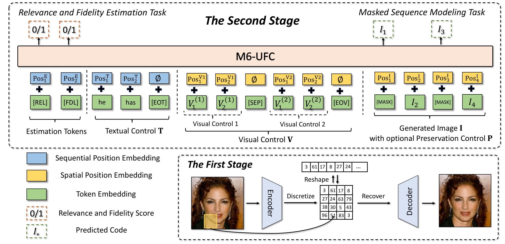

*Figure 2 · [Source](https://arxiv.org/abs/2105.14211)*

### Mage-Flow

Mage-Flow is a Microsoft text-to-image and editing foundation model built around two efficiency-focused components: Mage-VAE, a lightweight pixel-diffusion autoencoder distilled to reproduce the FLUX.2-VAE latent space at a fraction of its compute cost, and a native-resolution MMDiT that packs variable-length text and image token sequences from different-sized images into one batch rather than forcing a fixed resolution bucket. Text (and, for editing, reference images) are encoded by Qwen3-VL-4B-Instruct, and the 4B-parameter transformer is trained with rectified flow matching. The family ships a standard Base checkpoint, an RL-aligned variant post-trained for prompt following and aesthetics, and a 4-step distilled Turbo variant for fast inference. An editing model, Mage-Flow-Edit, shares the architecture. Code is released in the microsoft/Mage repository under MIT; the model card is gated behind Hugging Face authentication, so the weight license is not recorded.

[Architecture and figure](../models/dit.md#mage-flow) · [Paper](https://arxiv.org/abs/2607.19064) · [GitHub](https://github.com/microsoft/Mage) · [Project](https://microsoft.github.io/Mage)

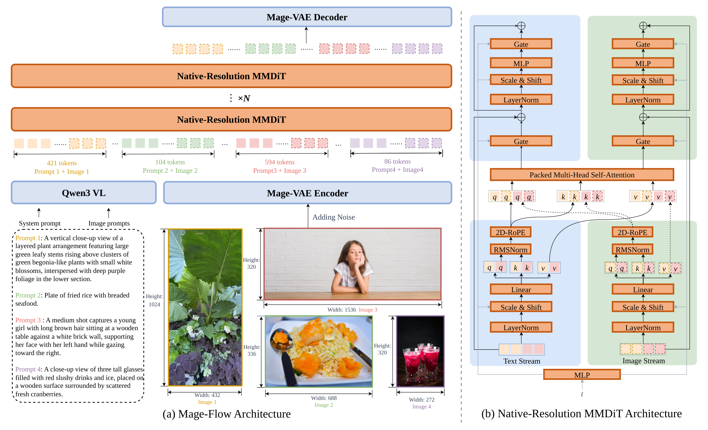

*Figure 5 · [Source](https://arxiv.org/abs/2607.19064)*

### MAI-Image

MAI-Image is Microsoft AI's in-house image model line. MAI-Image-1, announced on 2025-10-13 as Microsoft's first image generation model developed entirely in-house, targeted photorealistic scenes and fast iteration and shipped in Bing Image Creator and Copilot. MAI-Image-2 (March 2026) emphasized text rendering for infographics, slides and diagrams, and photorealism, with API access through Microsoft Foundry; MAI-Image-2-Efficient (April 2026) is a faster, cheaper variant. MAI-Image-2.5 (June 2026) added precise localized editing of images with text and reference-image inputs, and MAI-Image-2.6 with a Flash variant (September 2026) added multi-reference editing, web grounding and higher resolutions. Microsoft publishes no architecture for these models.

[Architecture and figure](../models/api.md#mai-image) · [Announcement 1](https://microsoft.ai/news/introducing-mai-image-1-debuting-in-the-top-10-on-lmarena/) · [Announcement 2](https://microsoft.ai/news/introducing-mai-image-2/) · [Announcement 3](https://microsoft.ai/news/mai-image-2-efficient/) · [Announcement 4](https://microsoft.ai/news/introducing-mai-image-2-5/) · [Announcement 5](https://microsoft.ai/news/pushing-the-quality-cost-frontier-with-mai-image-2-6/)

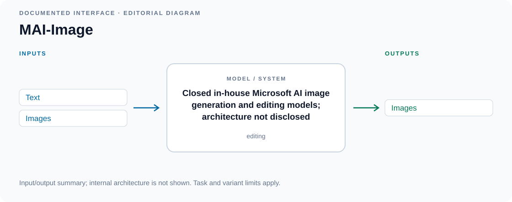

*Editorial input/output diagram · [Source](https://microsoft.ai/news/introducing-mai-image-2/)*

### Make-A-Scene

Make-A-Scene (Meta AI, ECCV 2022) extends DALL·E-style autoregressive text-to-image transformers with an optional scene layout: a token sequence for a segmentation map can be interleaved between the text and image tokens, giving users explicit control over object placement and shape while still allowing pure text-to-image generation when no layout is supplied. The paper also introduces a face-aware token-space loss and a classifier-free-style domain adaptation step to improve generated faces and photorealism.

[Architecture and figure](../models/ar-token.md#make-a-scene) · [Paper](https://arxiv.org/abs/2203.13131) · GitHub: no author-linked repository found

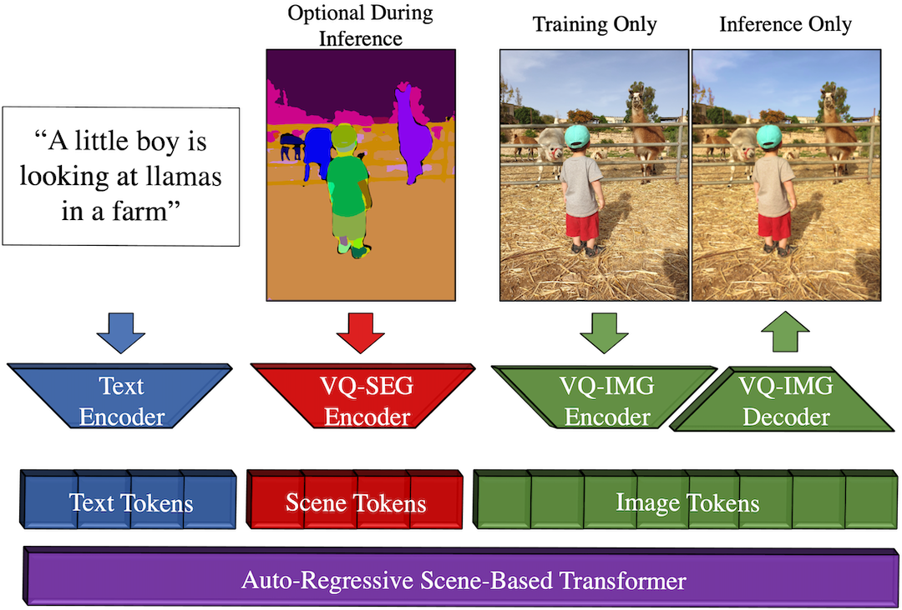

*Figure 6 · [Source](https://arxiv.org/abs/2203.13131)*

### MammothModa2

MammothModa2 (Mammoth2), from ByteDance, is a unified autoregressive-diffusion (AR-Diffusion) model that couples an AR pathway for semantic planning with a diffusion decoder for high-fidelity pixel synthesis, aiming to combine AR's instruction-following strength with diffusion's texture quality. Built on the Qwen3-VL-8B vision-language backbone, it adds dedicated MoE-style generation experts (hard-routed, only in deeper layers) that model discrete visual tokens from a new tokenizer, MammothTok, without disturbing the original understanding experts. An AR-Diffusion feature alignment module aggregates multi-layer AR hidden states and injects them as in-context conditioning into a single-stream DiT. Trained end-to-end with joint next-token-prediction and flow-matching objectives, then supervised fine-tuning and DiffusionNFT reinforcement learning on both generation and editing, Mammoth2 reports 0.87 on GenEval, 87.2 on DPGBench and 4.06 on ImgEdit using about 60M supervised generation samples and no pretrained generator.

[Architecture and figure](../models/unified.md#mammothmoda2) · [Paper](https://arxiv.org/abs/2511.18262) · [GitHub](https://github.com/bytedance/mammothmoda) · [Model card](https://huggingface.co/bytedance-research/MammothModa)

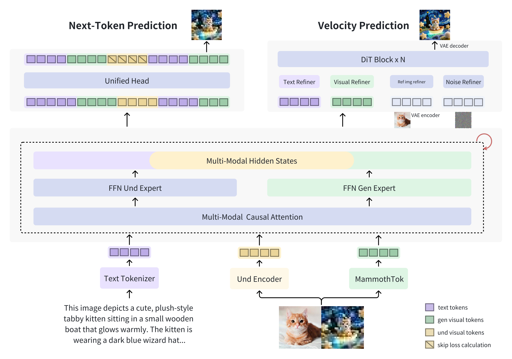

*Figure 2 · [Source](https://arxiv.org/abs/2511.18262)*

### Manzano

Manzano is Apple's unified multimodal model, designed to reduce the understanding/generation trade-off common in unified LLMs by using a hybrid image tokenizer rather than two unrelated tokenizers. A single ViT vision encoder feeds a continuous adapter (for image-to-text understanding) and a discrete FSQ adapter (for text-to-image generation), so both representations share a common semantic space instead of mixing a high-level semantic tokenizer with a low-level spatial VQ tokenizer. The unified autoregressive LLM decoder predicts high-level text and image tokens with a single next-token objective, and a separately scaled DiT-Air diffusion decoder renders the generated image tokens into pixels. The paper reports state-of-the-art results among unified models, particularly on text-rich understanding benchmarks, minimal task conflict between understanding and generation, and consistent gains when scaling the LLM decoder from 300M to 30B and the diffusion decoder up to 3.52B.

[Architecture and figure](../models/unified.md#manzano) · [Paper](https://arxiv.org/abs/2509.16197) · GitHub: no author-linked repository found

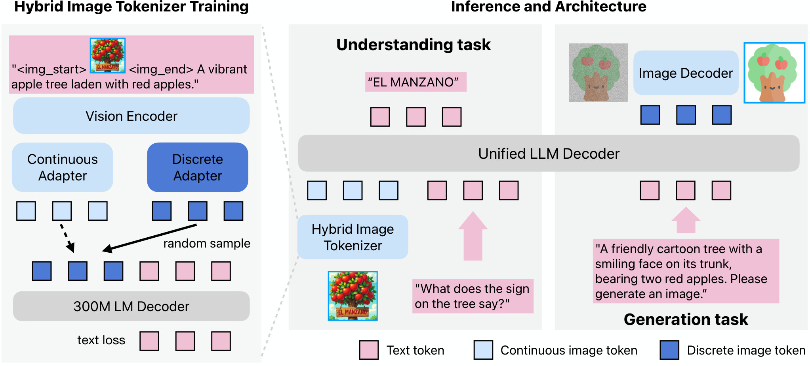

*Figure 3 · [Source](https://arxiv.org/abs/2509.16197)*

### MARS

MARS (2024) adds text-to-image generation to a frozen large language model (Qwen-7B) by inserting a Semantic Vision-Language Integration Expert, a mixture-of-experts layer that gives visual tokens their own attention and feed-forward pathways while leaving the original text experts untouched, so the model keeps the LLM's language ability while learning to autoregressively generate VQGAN image tokens. Trained bilingually on Chinese and English captions, the authors report competitive MS-COCO FID at a fraction of Stable Diffusion 1.5's training cost.

[Architecture and figure](../models/ar-token.md#mars-t2i) · [Paper](https://arxiv.org/abs/2407.07614) · [GitHub](https://github.com/fusiming3/MARS)

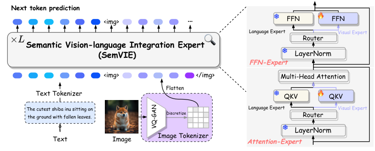

*Figure 3 · [Source](https://arxiv.org/abs/2407.07614)*

### MaskGen

MaskGen is a family of text-to-image masked generative models trained exclusively on publicly available data, introduced alongside TA-TiTok, a text-aware 1-dimensional image tokenizer. TA-TiTok injects textual information during tokenizer decoding and supports either discrete or continuous 1D tokens without the two-stage distillation used by prior 1D tokenizers. MaskGen combines this compact tokenizer with an MM-DiT-style masked prediction backbone, aesthetic-score conditioning and caption recaptioning, and the authors report performance competitive with models trained on proprietary data despite using only open datasets.

[Architecture and figure](../models/masked.md#maskgen) · [Paper](https://arxiv.org/abs/2501.07730) · [Project](https://tacju.github.io/projects/maskgen) · GitHub: no author-linked repository found

*Figure 3 · [Source](https://arxiv.org/abs/2501.07730)*

### MaskGIL

MaskGIL (Masked Generative Image LLaMA; Shanghai AI Laboratory with Nanjing University and collaborators) revisits masked autoregressive image generation, which decodes many image tokens per step but had trailed standard next-token models. The authors first compare four discrete image tokenizers and then turn a LLaMA decoder into a bidirectional model with 2D rotary position embeddings, trained with masked token prediction. Class-conditional models from 111M to 1.4B parameters reach an ImageNet 256x256 FID of 3.71 in 8 inference steps, against 256 steps for comparable autoregressive models. A 775M text-driven variant generates images at several resolutions from text. The paper also shows a scheme that starts generation with an autoregressive model and lets the masked model complete the tokens, applied to Lumina-mGPT, and a speech-to-image demonstration that transcribes speech with Whisper before generating.

[Architecture and figure](../models/masked.md#maskgil) · [Paper](https://arxiv.org/abs/2507.13032) · [GitHub](https://github.com/synbol/MaskGIL)

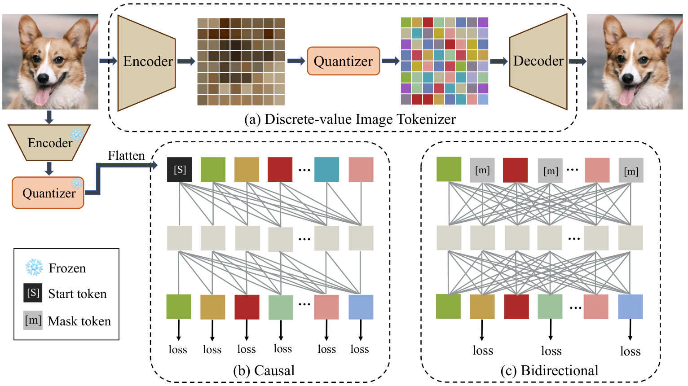

*Figure 2 · [Source](https://arxiv.org/abs/2507.13032)*

### MedUnifier

MedUnifier (MedVisAI Lab, NTU and A*STAR) is a unified vision-and-language pre-training model for chest radiology that adds text-grounded image generation to the usual understanding objectives. A BERT-style encoder fuses learnable query embeddings with ViT-g visual features and report text, with different self-attention masks for image-text contrastive learning, image-text matching and causal report generation. For generation, the model uses discrete visual representations: latent adapters turn the encoder's text-informed top-level features and the bottom-level local features concatenated with the text representation into feature maps, which are vector-quantized by a two-level hierarchical VQ-VAE and decoded to a radiograph. New images are produced by sampling the two quantized latent levels from PixelSNAIL priors and decoding them. The model is pre-trained on MIMIC-CXR and evaluated on classification, retrieval, report generation and image generation.

[Architecture and figure](../models/unified.md#medunifier) · [Paper](https://arxiv.org/abs/2503.01019) · GitHub: no author-linked repository found

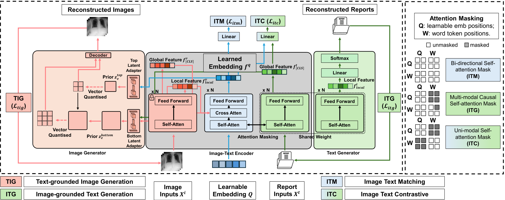

*Figure 2 · [Source](https://arxiv.org/abs/2503.01019)*

### Meissonic

Meissonic (2024) revisits masked generative transformers (in the style of MUSE) as an efficient path to high-resolution text-to-image generation, combining MM-DiT-style multi-modal/single-modal transformer blocks, rotary position embeddings and feature compression to generate 1024px images from a 1B-parameter model trained with under 50 H100 GPU-days, positioning masked-token prediction as a lower-cost alternative to diffusion transformers at comparable resolution.

[Architecture and figure](../models/masked.md#meissonic) · [Paper](https://arxiv.org/abs/2410.08261) · [GitHub](https://github.com/viiika/Meissonic) · [Model card](https://huggingface.co/MeissonFlow/Meissonic)

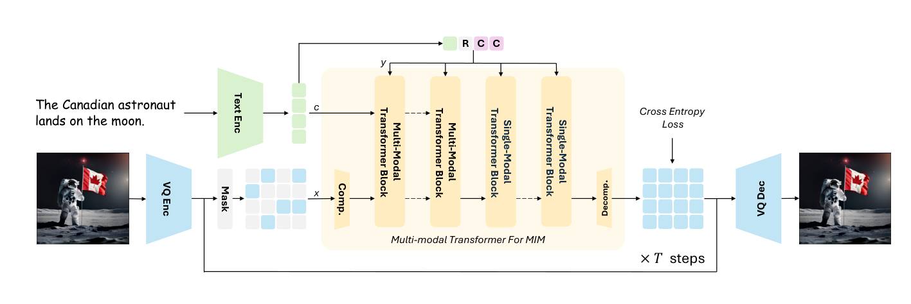

*Figure 2 · [Source](https://arxiv.org/abs/2410.08261)*

### MetaMorph

MetaMorph, from FAIR Meta AI, NYU and Meta Reality Labs, shows that a pretrained LLM can gain image-generation ability mainly through instruction tuning rather than a heavily redesigned architecture. Visual-Predictive Instruction Tuning (VPiT) finetunes the LLM to autoregressively output a mix of text tokens and continuous visual tokens from unified vision-language instruction data; at inference, an adapted diffusion model (originally pretrained separately) decodes the predicted visual tokens into a final image, so the LLM's own semantic knowledge and reasoning transfer into what it generates.

[Architecture and figure](../models/unified.md#metamorph) · [Paper](https://arxiv.org/abs/2412.14164) · [GitHub](https://github.com/facebookresearch/metamorph)

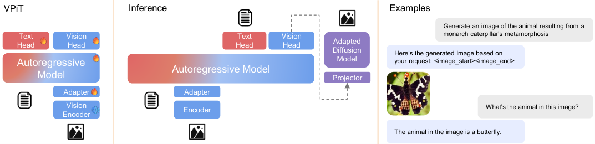

*Figure 1 · [Source](https://arxiv.org/abs/2412.14164)*

### MetaQuery

MetaQuery, from Meta and New York University, turns an understanding-only multimodal LLM into a unified model by appending a set of learnable queries whose output states condition a text-to-image diffusion decoder. The MLLM stays frozen, so its understanding performance is preserved, and training needs only image-caption pairs and the standard diffusion objective; the paper trains Base, Large and X-Large models on LLaVA-OneVision 0.5B and Qwen2.5-VL 3B and 7B backbones. It reports text-to-image results on GenEval, DPG-Bench and MJHQ, knowledge- and reasoning-augmented generation, image reconstruction, and, after brief fine-tuning or instruction tuning on 2.4M naturally occurring image pairs, image editing and subject-driven generation.

[Architecture and figure](../models/unified.md#metaquery) · [Paper](https://arxiv.org/abs/2504.06256) · [GitHub](https://github.com/facebookresearch/metaquery)

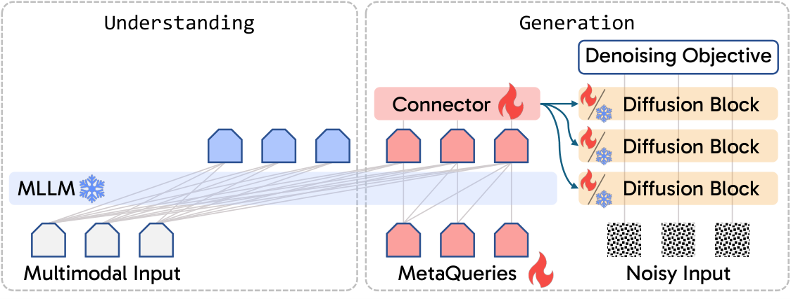

*Figure 1 · [Source](https://arxiv.org/abs/2504.06256)*

### Midjourney

Midjourney is a closed text-to-image service offered through its web app and Discord. The developer publishes version announcements and usage documentation but no model architecture, so this card records only the documented interface. Prompts can be combined with image prompts, style references, moodboards, personalization and, for V7, Omni-Reference images. V7 (alpha April 2025) added a fast, cheaper Draft Mode and became the default in June 2025. V8 (alpha March 2026) added a native 2K `--hd` mode and better text rendering, V8.1 became the default in June 2026, and a V8.2 edit model (August 2026) edits uploaded images from text instructions, including inpainting and outpainting.

[Architecture and figure](../models/api.md#midjourney) · [Announcement 1](https://updates.midjourney.com/v7-alpha/) · [Announcement 2](https://updates.midjourney.com/omni-reference-oref/) · [Announcement 3](https://updates.midjourney.com/v7-is-now-the-default-model/) · [Announcement 4](https://updates.midjourney.com/v8-alpha/) · [Announcement 5](https://updates.midjourney.com/v8-1-is-now-the-default-model/) · [Announcement 6](https://updates.midjourney.com/edit-model-for-v8/)

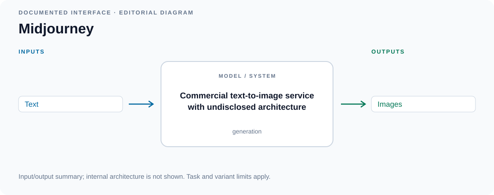

*Editorial input/output diagram · [Source](https://updates.midjourney.com/v8-alpha/)*

### MindOmni

MindOmni (Tsinghua, Tencent ARC Lab, CUHK and HKU, 2025) is a unified multimodal model aimed at reasoning generation, where the model thinks in text before it produces an image. It is built from Qwen2.5-VL for understanding and reasoning and the OmniGen diffusion decoder for rendering, bridged by a two-layer decoder connector. After pretraining and a supervised stage with chain-of-thought instruction data, the paper applies Reasoning Generation Policy Optimization (RGPO), a GRPO-style algorithm with multimodal feedback and KL regularization on both text and image outputs, so that the generated reasoning guides the rewritten prompt that the diffusion decoder renders. The same model answers visual questions and edits images.

[Architecture and figure](../models/unified.md#mindomni) · [Paper](https://arxiv.org/abs/2505.13031) · [GitHub](https://github.com/TencentARC/MindOmni) · [Model card](https://huggingface.co/EasonXiao-888/MindOmni)

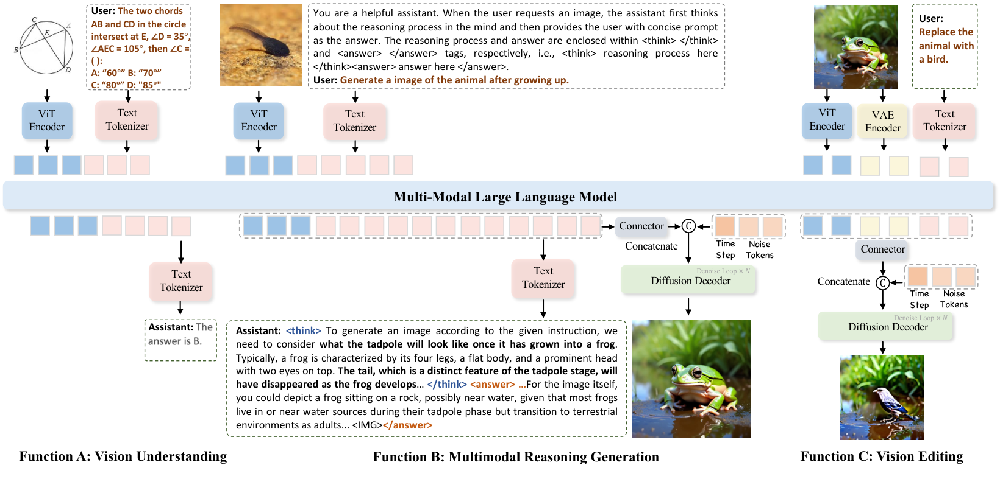

*Figure 2 · [Source](https://arxiv.org/abs/2505.13031)*

### Ming-Lite-Uni

Ming-Lite-Uni (Inclusion AI, Ant Group, 2025) is an alpha-stage open-source unified model that keeps a native multimodal autoregressive model frozen for understanding and attaches a trainable diffusion generator to it. The paper presents an integration of MetaQueries and M2-omni with two additions: sets of learnable query tokens at several scales, each marked by start and end tokens, and a multi-scale representation alignment loss that ties intermediate DiT states to the final semantic representation. The connector maps the MLLM output for these queries into the conditioning of the diffusion transformer, which is the only part trained for generation. The model handles text-to-image generation, instruction-based image editing and style transfer in conversational use, and is evaluated on understanding benchmarks and on GenEval.

[Architecture and figure](../models/unified.md#ming-lite-uni) · [Paper](https://arxiv.org/abs/2505.02471) · [GitHub](https://github.com/inclusionAI/Ming/tree/Ming-Lite-Omni-Preview/Ming-unify) · [Model card](https://huggingface.co/inclusionAI/Ming-Lite-Uni)

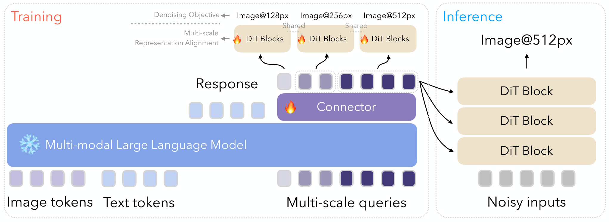

*Figure 2 · [Source](https://arxiv.org/abs/2505.02471)*

### Ming-Omni

Ming-Omni, from Ant Group's inclusionAI, is a unified model that perceives images, text, audio and video and generates text, speech and images from one framework, which the authors describe as the first open-source model to match GPT-4o's modality coverage. Its language backbone, Ling, is a MoE architecture with dedicated per-modality routers (text, vision, audio) that resolve representational and convergence-rate conflicts between modalities during joint pretraining. Image and speech generation are added afterward: an audio decoder (following CosyVoice, with BPE-compressed audio tokens) produces speech, and Ming-Lite-Uni's lightweight bridging framework produces images while keeping the perception MLLM frozen. The paper reports a GenEval score of 0.64 and FID of 4.85 for image generation, and demonstrates instruction-based text-to-image generation, editing and style transfer.

[Architecture and figure](../models/unified.md#ming-omni) · [Paper](https://arxiv.org/abs/2506.09344) · [GitHub](https://github.com/inclusionAI/Ming) · [Model card](https://huggingface.co/inclusionAI/Ming-Lite-Omni)

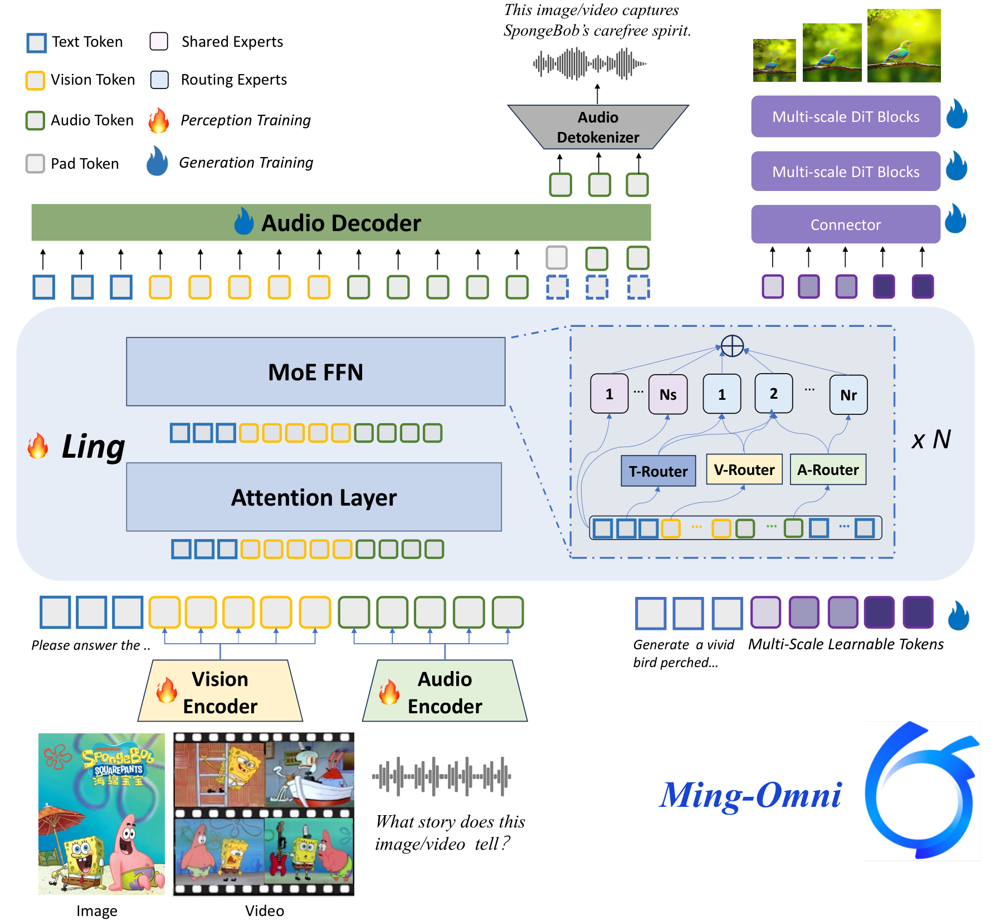

*Figure 2 · [Source](https://arxiv.org/abs/2506.09344)*

### Ming-UniVision

Ming-UniVision, from Ant Group's inclusionAI, builds a unified multimodal model (Ming-UniVision-16B-A3B, a 16B-parameter MoE LLM with 3B active) around MingTok, a new continuous visual tokenizer meant to close the gap between representations tuned for understanding and for generation. Because MingTok produces one visual latent space usable for both image-to-text and text-to-image tasks, the paper casts image understanding and image synthesis in the same next-token-prediction paradigm, letting a single autoregressive model switch between understanding, generation and multi-round in-context editing without separate tokenizers or dual-branch AR-diffusion designs. The paper reports over 3.5x faster text-to-image generation than an SD-VAE-based baseline and up to 66% fewer input visual tokens than comparable unified architectures, plus qualitative multi-step editing and a "visualized chain-of-thought" generation mode.

[Architecture and figure](../models/unified.md#ming-univision) · [Paper](https://arxiv.org/abs/2510.06590) · [GitHub](https://github.com/inclusionAI/Ming-UniVision) · [Model card](https://huggingface.co/inclusionAI/Ming-UniVision-16B-A3B)

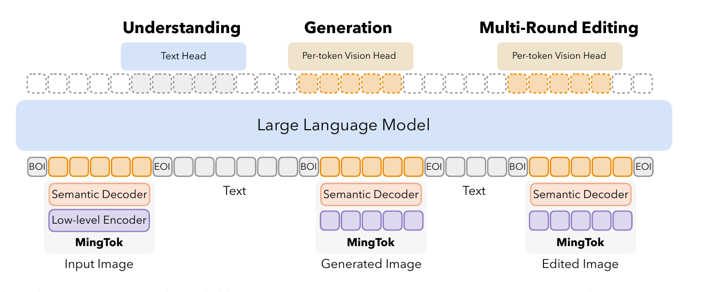

*Figure 3 (PDF p. 7) · [Source](https://arxiv.org/abs/2510.06590)*

### MiniMax Image-01

Image-01 is MiniMax's first text-to-image model, launched on its API platform on 2025-02-28. MiniMax says it draws on prompt-adherence know-how from its Hailuo video models and supports several aspect ratios with up to nine images per request. The API documents a text-to-image endpoint with optional prompt optimization, custom sizes from 512 to 2048 pixels and seeds, and an image-to-image endpoint in which a character (portrait) reference image guides generation, available for `image-01` and `image-01-live`. No architecture is published.

[Architecture and figure](../models/api.md#minimax-image-01) · [Announcement](https://www.minimax.io/news/image-01) · [Docs 1](https://platform.minimax.io/docs/api-reference/image-generation-t2i) · [Docs 2](https://platform.minimax.io/docs/api-reference/image-generation-i2i)

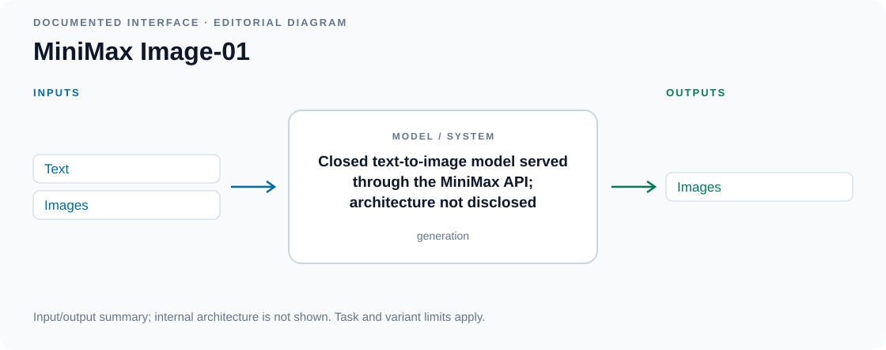

*Editorial input/output diagram · [Source](https://www.minimax.io/news/image-01)*

### MM-Interleaved

MM-Interleaved, from OpenGVLab (Shanghai AI Laboratory) with CUHK, Tsinghua, SenseTime and others, is an end-to-end generative model for interleaved image-text data. Each image enters the LLM as a small number of Perceiver-Resampler tokens; to recover details lost by this compression, a Multi-Modal Feature Synchronizer (MMFS) based on deformable sparse attention lets intermediate LLM layers and the diffusion decoder's U-Net attend directly to multi-scale feature maps of all previous images. When the LLM emits a begin-of-image token, its output features, resampled to 77 condition tokens, drive a diffusion model that generates the next image. The model covers captioning, visual question answering, text-to-image generation, segmentation-to-image translation and visual storytelling.

[Architecture and figure](../models/unified.md#mm-interleaved) · [Paper](https://arxiv.org/abs/2401.10208) · [GitHub](https://github.com/OpenGVLab/MM-Interleaved)

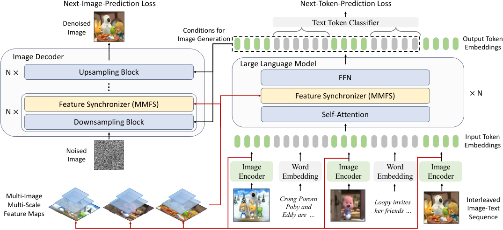

*Figure 4 · [Source](https://arxiv.org/abs/2401.10208)*

### MMaDA

MMaDA (Multimodal Large Diffusion Language Model), from the Gen-Verse team, unifies textual reasoning, multimodal understanding and text-to-image generation in one discrete-diffusion foundation model rather than pairing an autoregressive language model with a separate diffusion generator. Where prior unified models (Show-o, Transfusion) keep autoregressive text modeling and diffusion-based vision modeling as distinct branches, MMaDA applies the same masked discrete-diffusion formulation and architecture to both text and image tokens. Training follows pretraining, a mixed long chain-of-thought finetuning stage that aligns reasoning formats across text and image tasks, and UniGRPO, a policy-gradient RL algorithm adapted to diffusion models with diversified rewards. The paper reports MMaDA-8B beating LLaMA-3-7B and Qwen2-7B on textual reasoning, Show-o and SEED-X on multimodal understanding, and SDXL and Janus on text-to-image generation.

[Architecture and figure](../models/unified.md#mmada) · [Paper](https://arxiv.org/abs/2505.15809) · [GitHub](https://github.com/Gen-Verse/MMaDA) · [Model card](https://huggingface.co/Gen-Verse/MMaDA-8B-MixCoT)

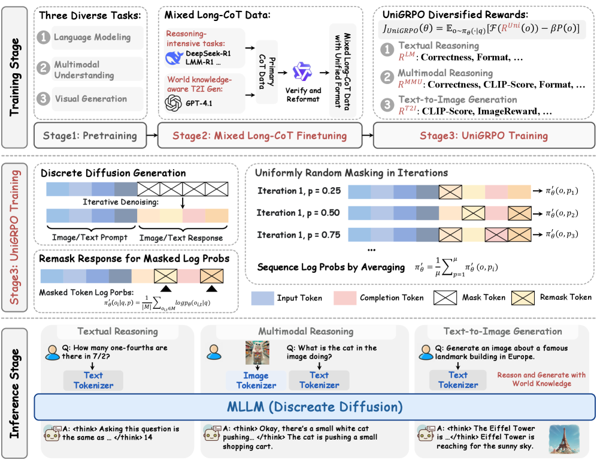

*Figure 2 · [Source](https://arxiv.org/abs/2505.15809)*

### MMCORE

MMCORE (ByteDance) transfers the reasoning ability of a multimodal large language model into text-to-image generation and editing without deep-fusing an autoregressive model and a diffusion model end to end. A pre-trained MLLM is fine-tuned autoregressively to produce a fixed set of learnable query tokens that summarize the prompt and, for editing, any reference images; these compact visual-language embeddings condition a separately pre-trained MMDiT generator alongside the raw text embeddings, with a block-causal attention mask letting each generated frame attend to the VAE latents and embeddings of all preceding images. The system is trained in stages (MLLM fine-tuning, then diffusion-head SFT and RLHF) and supports text-to-image synthesis, multi-image editing and spatial reasoning/grounding without requiring deep architectural fusion between the two backbones.

[Architecture and figure](../models/dit.md#mmcore) · [Paper](https://arxiv.org/abs/2604.19902) · GitHub: no author-linked repository found

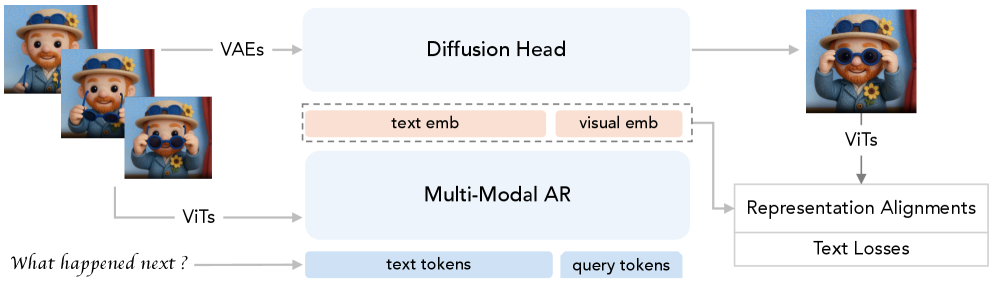

*Figure 5 · [Source](https://arxiv.org/abs/2604.19902)*

### MMFace-DiT

MMFace-DiT is an end-to-end diffusion transformer for multimodal face generation, built to avoid the ControlNet-style auxiliary modules that the authors argue limit how tightly spatial and textual conditioning can be fused. A dual-stream DiT-XL backbone (1.345B parameters, 28 blocks, FLUX VAE latent space) processes image and text tokens in parallel, joined by a shared RoPE attention layer that acts as the central cross-modal fusion point, with a Modality Embedder letting a single trained model switch between mask-conditioned and sketch-conditioned synthesis without retraining. Text conditioning comes from a Stable-Diffusion-2.1-base CLIP encoder, supplying both pooled and token-level embeddings.

[Architecture and figure](../models/dit.md#mmface-dit) · [Paper](https://arxiv.org/abs/2603.29029) · [GitHub](https://github.com/Bharath-K3/MMFace-DiT) · [Project](https://vcbsl.github.io/MMFace-DiT/)

*Figure 2 · [Source](https://arxiv.org/abs/2603.29029)*

### Mobile-O

Mobile-O (MBZUAI with CMU and Linköping University, 2026) is a unified multimodal understanding and image-generation model small enough, about 1.6B parameters in total, to run fully on a phone. Instead of the learnable query tokens used by larger unified models, its Mobile Conditioning Projector (about 2.4M parameters) takes a learned, temperature-weighted fusion of the VLM's final layers, compresses and refines it with depthwise-separable 1D convolutions and channel attention, and feeds it to every cross-attention layer of the SANA diffusion decoder. Training proceeds in three stages: alignment pre-training of the DiT and projector on about 9M text-image pairs with the VLM frozen, supervised fine-tuning on about 105K curated pairs, and a unified post-training stage on quadruplets (generation prompt, image, question, answer) that improves understanding and generation together. The paper reports 0.74 on GenEval and about 3 seconds per 512×512 image on an iPhone.

[Architecture and figure](../models/efficient.md#mobile-o) · [Paper](https://arxiv.org/abs/2602.20161) · [GitHub](https://github.com/Amshaker/Mobile-O) · [Model card](https://huggingface.co/Amshaker/Mobile-O-0.5B)

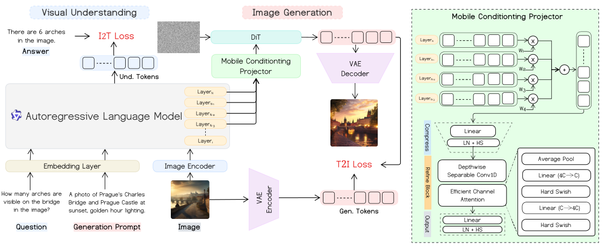

*Figure 2 · [Source](https://arxiv.org/abs/2602.20161)*

### MobileDiffusion

MobileDiffusion (Google, 2023) is a text-to-image diffusion model designed from scratch for phones, reaching about 0.2 seconds for a 512×512 image on an iPhone 15 Pro. Its UNet was found through a systematic study that moves transformer blocks to the low-resolution bottleneck, removes self-attention at higher resolutions, replaces most convolutions with separable ones and prunes the VAE decoder, arriving at about 400M parameters. The model is first trained as an ordinary latent diffusion model and then adversarially fine-tuned with UFOGen's diffusion-GAN objective so that it generates in one step while staying compatible with plugins, LoRA fine-tuning and inpainting built on the base model.

[Architecture and figure](../models/efficient.md#mobilediffusion) · [Paper](https://arxiv.org/abs/2311.16567) · GitHub: no author-linked repository found

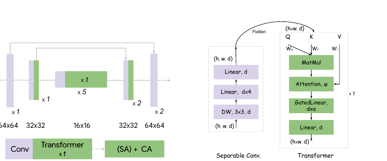

*Figure 2 (PDF p. 5) · [Source](https://arxiv.org/abs/2311.16567)*

### Mogao

Mogao is a ByteDance Seed unified model aimed at interleaved multimodal generation: it can read and write arbitrary sequences of text and images causally, combining autoregressive text generation with diffusion-based image synthesis in one transformer. Its design adds a deep-fusion (MMDiT-inspired) block structure, dual visual encoders that give conditioning images both ViT and VAE representations, an interleaved 3D rotary position embedding, and multimodal classifier-free guidance. The paper reports multimodal understanding and text-to-image results, interleaved generation, and qualitative zero-shot image editing without editing-specific training data.

[Architecture and figure](../models/unified.md#mogao) · [Paper](https://arxiv.org/abs/2505.05472) · GitHub: no author-linked repository found

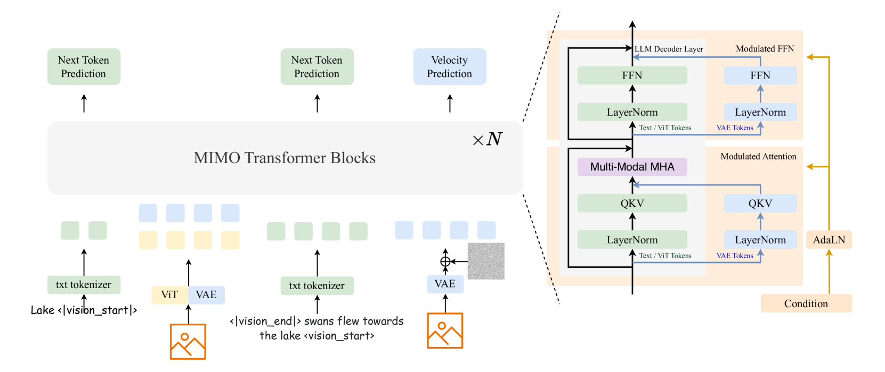

*Figure 3 · [Source](https://arxiv.org/abs/2505.05472)*

### MonoFormer

MonoFormer, from a group at Zhejiang University and Alibaba, uses a single transformer for both text-to-text autoregression and text-to-image diffusion, switching only the attention mask and training objective per modality rather than training two separate networks. A pretrained LLM initializes the shared backbone so it retains language understanding, and the same weights are trained with a causal mask and next-token loss on text and a bidirectional mask and denoising loss on noised image latents, achieving image generation quality comparable to dedicated diffusion models while keeping text generation ability.

[Architecture and figure](../models/unified.md#monoformer) · [Paper](https://arxiv.org/abs/2409.16280) · [GitHub](https://github.com/MonoFormer/MonoFormer)

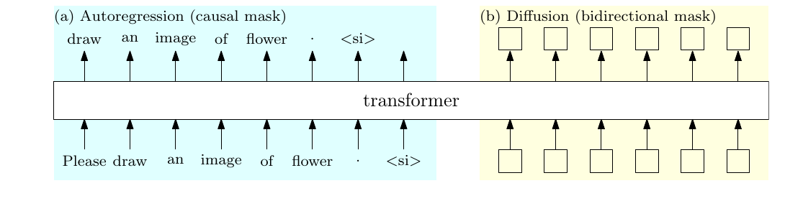

*Figure 1 (PDF p. 2) · [Source](https://arxiv.org/abs/2409.16280)*

### Moonworks Lunara

Moonworks Lunara, from the startup Moonworks, is a text-to-image model built around a novel Diffusion Mixture Transformer (DMT) architecture and framed around what the authors call Artistic Intelligence — generation that preserves semantic, artistic and compositional structure while leaving room for creative variation. Text (and optional image) input is routed through dedicated art-conception and compositional-attention stages into per-style latent-mixture denoising experts, and the model is trained with an iterative algorithm that actively selects informative generated samples and injects curated human-created art into the training distribution over successive rounds. The paper reports Lunara ranking first in aesthetic quality and competitive on content-integrity metrics against comparable sub-10B models, with sub-10-second inference.

[Architecture and figure](../models/dit.md#moonworks-lunara) · [Paper](https://arxiv.org/abs/2609.22272) · GitHub: no author-linked repository found

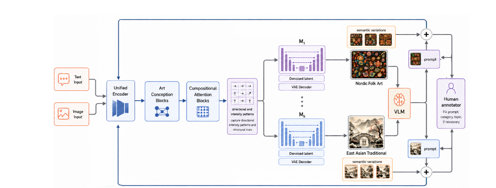

*Figure 4 (PDF p. 7) · [Source](https://arxiv.org/abs/2609.22272)*

### MoS (Mixture of States)

Mixture of States (Meta AI and KAUST, 2025) replaces cross-attention or full self-attention between a language model and a diffusion transformer with a small router that decides which hidden states of the understanding tower reach which layers of the generation tower. The router is a lightweight transformer of about 100M parameters that takes the denoising timestep, the noisy image latent and the context tokens, outputs per-token layer-to-layer affinities, and keeps the top-k states with an epsilon-greedy training strategy. The paper trains MoS-Image for text-to-image generation and MoS-Edit for instruction-based editing in 3B and 5B generation-tower sizes, reporting results that match or surpass models up to four times larger.

[Architecture and figure](../models/dit.md#mos) · [Paper](https://arxiv.org/abs/2511.12207) · GitHub: no author-linked repository found

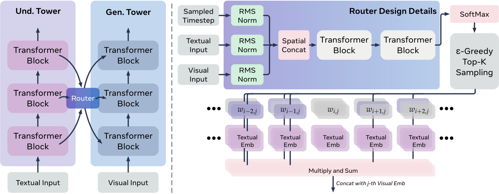

*Figure 3 · [Source](https://arxiv.org/abs/2511.12207)*

### Muddit

Muddit ("Meissonic II") is a second-generation unified discrete diffusion model for fast, parallel generation across text and image modalities. Unlike prior unified diffusion models trained from scratch, it integrates the strong visual priors of the pretrained Meissonic text-to-image backbone with a lightweight text decoder, enabling text-to-image generation, image-to-text captioning and visual question answering under one non-autoregressive architecture. The authors report Muddit matches or exceeds significantly larger autoregressive unified models in quality and efficiency, arguing that discrete diffusion with strong visual priors is a scalable backbone for unified generation.

[Architecture and figure](../models/unified.md#muddit) · [Paper](https://arxiv.org/abs/2505.23606) · [GitHub](https://github.com/M-E-AGI-Lab/Muddit) · [Model card](https://huggingface.co/MeissonFlow/Muddit)

*Figure 2 · [Source](https://arxiv.org/abs/2505.23606)*

### Mural

Mural shows that knowledge from a frozen, text-only large language model remains transferable to text-to-image generation without multimodal pretraining or explicit reasoning supervision. Using a Mixture-of-Transformers design, a frozen Qwen2.5 or Qwen2.5-VL LLM and a trainable diffusion image-generation expert process a concatenated token sequence with layer-wise shared self-attention — causal for text, bidirectional for image tokens — while every other component (layer norms, QKV/FFN weights) stays modality-specific; only the image-generation expert is trained, with a flow-matching loss on FLUX.1 VAE latents and no loss on text tokens. Trained solely on standard English text-image pairs, Mural exhibits emergent capabilities absent from its training data, including cross-lingual generation, hex-color-guided composition and emoji-based scene construction, which the authors attribute to knowledge transfer through the shared attention mechanism rather than explicit multimodal training.

[Architecture and figure](../models/unified.md#mural) · [Paper](https://arxiv.org/abs/2606.29013) · GitHub: no author-linked repository found

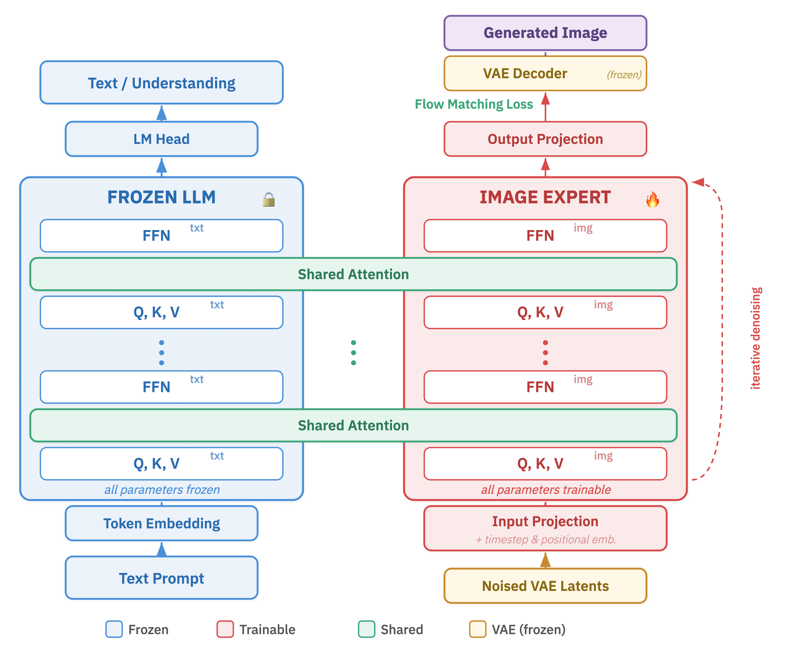

*Figure 1 · [Source](https://arxiv.org/abs/2606.29013)*

### Muse

Muse (Google Research, 2023) generates images by masked-token modeling rather than diffusion or autoregression: a transformer conditioned on a frozen T5-XXL text encoder predicts discrete VQGAN tokens for all masked positions in parallel, refining the image over a handful of steps, and a second masked transformer upsamples the result in token space. The authors report faster inference than comparable diffusion or autoregressive models at similar quality, but did not release code, weights or a public demo.

[Architecture and figure](../models/masked.md#muse) · [Paper](https://arxiv.org/abs/2301.00704) · GitHub: no author-linked repository found

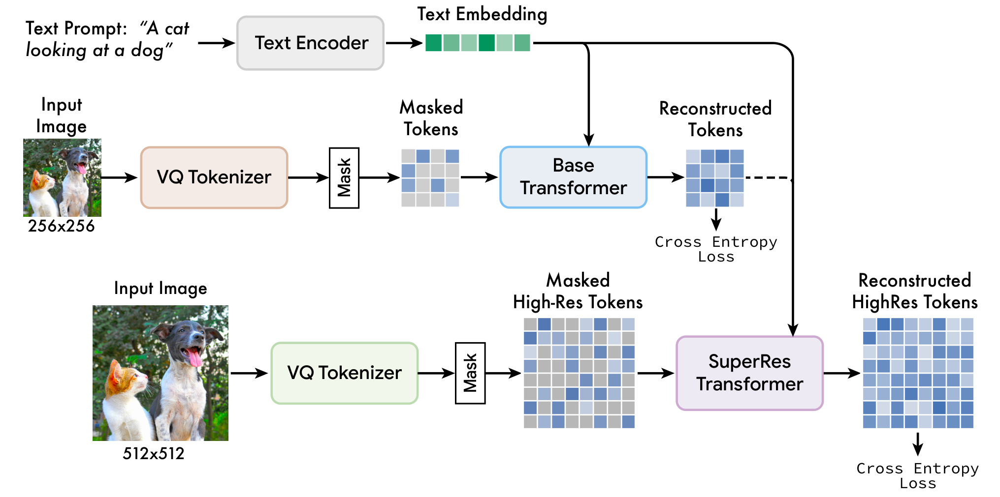

*Figure 3 · [Source](https://arxiv.org/abs/2301.00704)*

### Muse Image

Muse Image is the image generation model from Meta Superintelligence Labs, announced on 2026-07-07 together with the separate Muse Video model and deployed in Meta AI. Meta says it follows instructions faithfully, edits images precisely by changing only what the user asks for, and composes people, objects, clothing, styles and environments from many reference images. Meta also describes agentic behaviour: the model learns to write and execute code for accurate plots and QR codes, to search the web to ground images in factual and real-time information, and to reflect on and refine its work within its chain of thought. It is available in the Meta AI app and website, Instagram Stories in the US and WhatsApp in some countries; no API or technical report is announced.

[Architecture and figure](../models/api.md#muse-image) · [Announcement 1](https://ai.meta.com/blog/introducing-muse-image-muse-video-msl/) · [Announcement 2](https://about.fb.com/news/2026/07/introducing-muse-image-meta-ai/)

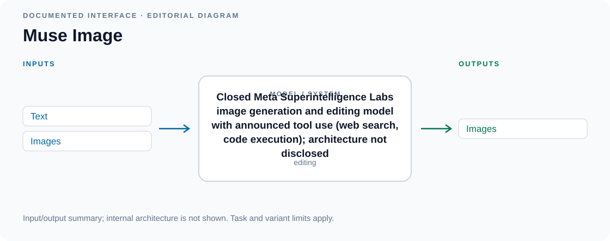

*Editorial input/output diagram · [Source](https://ai.meta.com/blog/introducing-muse-image-muse-video-msl/)*

### NAMI

NAMI (360 AI Research and Tsinghua University) is a 2B-parameter text-to-image model built to cut the inference cost of large flow transformers. It splits the rectified flow into time windows, one per resolution, in the manner of pyramid flow matching. Early windows run at low resolution with only a subset of the transformer layers, since they mainly set layout and coarse concepts, and more layers are added as resolution rises. A BridgeFlow module aligns the upsampled end point of one stage with the starting point of the next. Training uses multiple resolutions per batch. The paper reports a 64% reduction in 1024-pixel inference time against a same-size Flux-style baseline and also introduces the NAMI-1K human-preference benchmark.

[Architecture and figure](../models/dit.md#nami) · [Paper](https://arxiv.org/abs/2503.09242) · GitHub: no author-linked repository found

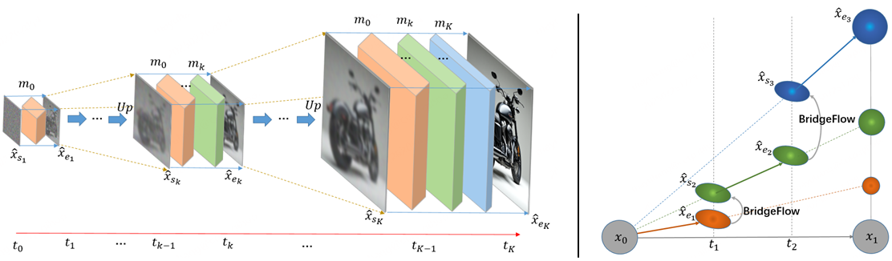

*Figure 4 · [Source](https://arxiv.org/abs/2503.09242)*

### Nemotron-Labs-Diffusion-Image

Nemotron-Labs-Diffusion-Image (NVIDIA) is a masked discrete diffusion model for high-resolution text-to-image synthesis that targets two limitations of prior masked-token diffusion models: the inability to revise tokens once unmasked, and sparse training signal as tokenizer vocabularies grow. It adds a token-editing mechanism so the model can dynamically correct previously unmasked image tokens during sampling, and a Grouped Cross-Entropy objective that spreads training signal to semantically neighboring tokens in the codebook. The paper reports state-of-the-art masked-diffusion results at 1024px and strong quality in as few as one to five sampling steps.

[Architecture and figure](../models/masked.md#nemotron-labs-diffusion-image) · [Paper](https://arxiv.org/abs/2606.29814) · GitHub: no author-linked repository found

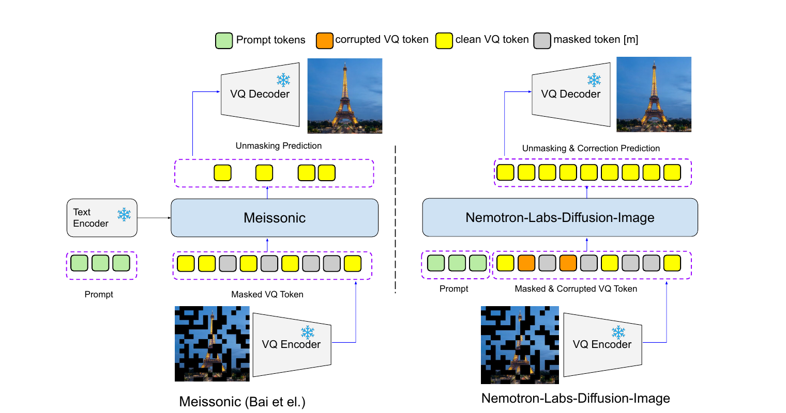

*Figure 3 (PDF p. 5) · [Source](https://arxiv.org/abs/2606.29814)*

### NeoBabel

NeoBabel (Cohere Labs and University of Amsterdam, 2025) is a multilingual text-to-image model that accepts prompts in English, Chinese, Dutch, French, Hindi and Persian directly rather than through translation. It builds on the Gemma-2 multilingual language model and its tokenizer, adds discrete image tokens in a shared embedding space, and unmasks image tokens in parallel in the manner of Show-o. Training combines large multilingual pretraining on image-text pairs in three stages with two stages of instruction tuning, and merges checkpoints along the training trajectory. The paper introduces multilingual versions of GenEval and DPG-Bench (m-GenEval, m-DPG) and cross-lingual consistency and code-switching metrics, and also shows multilingual text-guided inpainting and extrapolation.

[Architecture and figure](../models/masked.md#neobabel) · [Paper](https://arxiv.org/abs/2507.06137) · [GitHub](https://github.com/mmderakhshani/NeoBabel) · [Project](https://Neo-Babel.github.io)

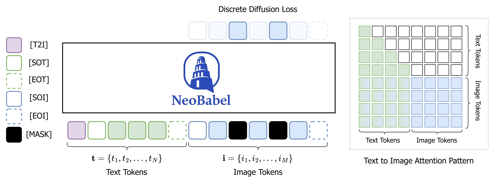

*Figure 2 · [Source](https://arxiv.org/abs/2507.06137)*

### NExT-GPT

NExT-GPT, from NUS's NExT++ Research Center, is an any-to-any multimodal LLM that perceives and generates text, images, video and audio by wrapping a frozen LLM with lightweight, trainable alignment layers on both sides, so only a small fraction of parameters is trained. Frozen modality-specific encoders and input projections align each input modality into the LLM's semantic space; on the output side, trainable output projections turn the LLM's hidden states into conditioning signals for frozen, pretrained diffusion decoders (a Stable-Diffusion-based image decoder among them), so text-to-image generation and other modality conversions are produced through these off-the-shelf decoders rather than a decoder trained from scratch.

[Architecture and figure](../models/unified.md#next-gpt) · [Paper](https://arxiv.org/abs/2309.05519) · [GitHub](https://github.com/NExT-GPT/NExT-GPT)

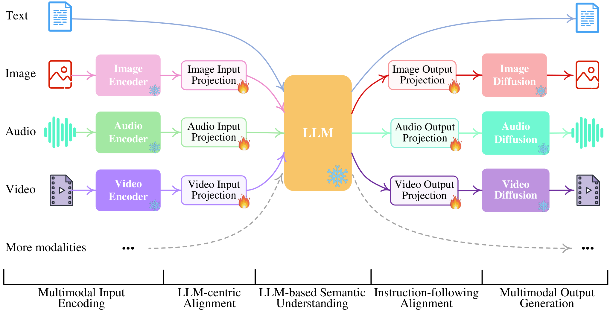

*Figure 1 · [Source](https://arxiv.org/abs/2309.05519)*

### NextFlow

NextFlow, from ByteDance, is a unified decoder-only autoregressive transformer trained on 6 trillion interleaved text-image tokens that activates multimodal understanding, text-to-image generation and instruction-based editing in one model. Its central design choice is to keep next-token prediction for text but replace raster-scan next-token image generation with next-scale prediction (coarse-to-fine, VAR-style), which the paper reports generates 1024x1024 images in about 5 seconds and with 6x fewer FLOPs than MMDiT-based diffusion models at that resolution. A dual-codebook tokenizer decouples semantic and pixel-level visual features to keep both conceptual alignment and fine detail. The paper introduces a scale-reweighting training objective and self-correction with residual features to stabilize next-scale training at 6T-token scale, plus a prefix-tuning GRPO strategy that focuses reinforcement learning on coarse-scale prefixes. NextFlow reports state-of-the-art results among unified models, rivaling specialized diffusion models on DPG (88.32) and setting a new state of the art on the authors' own EditCanvas editing benchmark (ImgEdit 4.49).

[Architecture and figure](../models/unified.md#nextflow) · [Paper](https://arxiv.org/abs/2601.02204) · [GitHub](https://github.com/ByteVisionLab/NextFlow)

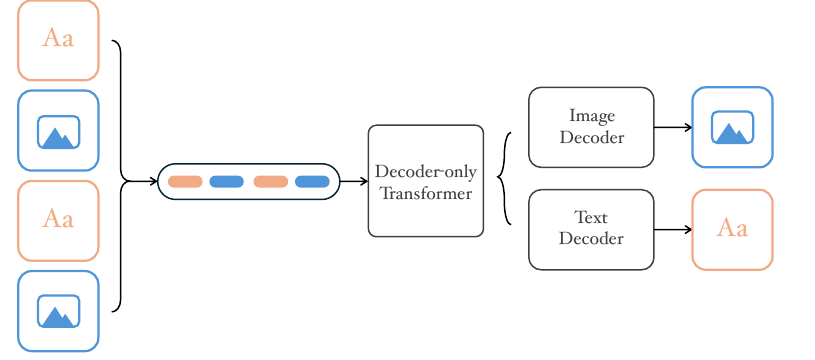

*Figure 1 (PDF p. 1) · [Source](https://arxiv.org/abs/2601.02204)*

### NextStep-1

NextStep-1 (StepFun) applies plain next-token prediction to a sequence of discrete text tokens followed by continuous image tokens, without vector quantization and without a large diffusion decoder. A 14B causal transformer, initialized from Qwen2.5-14B and using standard 1D RoPE, reads the prompt and previously generated image patches; its hidden state conditions a small MLP flow-matching head that turns noise into the next image patch. Images come from a tokenizer fine-tuned from the FLUX.1-dev VAE, whose 16-channel latents are channel-normalized and noise-perturbed during training to keep the latent space robust, then packed 2×2 into 64-channel tokens. An editing model (NextStep-1-Large-Edit) extends the same architecture to instruction-based image editing, and the later NextStep-1.1 release adds extended training and flow-based RL post-training.

[Architecture and figure](../models/continuous-ar.md#nextstep-1) · [Paper](https://arxiv.org/abs/2508.10711) · [GitHub](https://github.com/stepfun-ai/NextStep-1) · [Model card](https://huggingface.co/stepfun-ai/NextStep-1-Large)

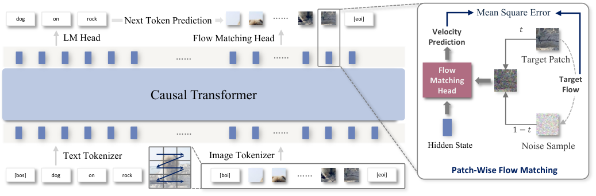

*Figure 2 · [Source](https://arxiv.org/abs/2508.10711)*

### Nexus

Nexus is a text-to-image rectified-flow diffusion transformer designed around the joint optimization of three efficiency techniques that prior work has mostly explored separately: sparse Mixture-of-Experts feed-forward layers, linear-complexity Gated DeltaNet attention in place of quadratic self-attention, and per-expert low-bit quantization. The combination targets the compute, sequence-length and memory bottlenecks that limit high-resolution diffusion transformers on edge hardware, and the paper reports generation quality comparable to SDXL and SD3 with markedly better latency and memory scaling.

[Architecture and figure](../models/dit.md#nexus) · [Paper](https://arxiv.org/abs/2608.16104) · GitHub: no author-linked repository found

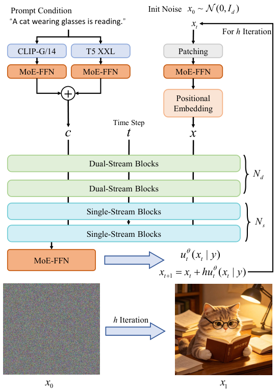

*Figure 2 · [Source](https://arxiv.org/abs/2608.16104)*

### Nexus-Gen

Nexus-Gen, from Zhejiang University and Alibaba's ModelScope/AIOS teams, unifies image understanding, generation and editing by having an autoregressive model and a diffusion decoder share one continuous image embedding space, rather than pairing an AR model with a plain VAE (which limits synthesis quality) or leaving embedding error accumulation unaddressed as in SEED-X/MetaMorph-style AR+diffusion designs. Built on Qwen2.5-VL-7B-Instruct, the model reuses its vision-transformer embedding space for both understanding input and generation/editing output. Because directly autoregressing continuous embeddings token-by-token accumulates prediction error, the paper introduces prefilled autoregression, which fills the sequence with learnable placeholder embeddings so training and inference behave consistently. Two FLUX.1-Dev-based decoders (generation and editing) turn the predicted 81-token embeddings into images. Trained on a purpose-built 26.3M-sample dataset across three stages, Nexus-Gen reports 45.7 on MMMU and 0.81 on GenEval, with all models, data and code released.

[Architecture and figure](../models/unified.md#nexus-gen) · [Paper](https://arxiv.org/abs/2504.21356) · [GitHub](https://github.com/modelscope/Nexus-Gen) · [Model card](https://huggingface.co/modelscope/Nexus-Gen)

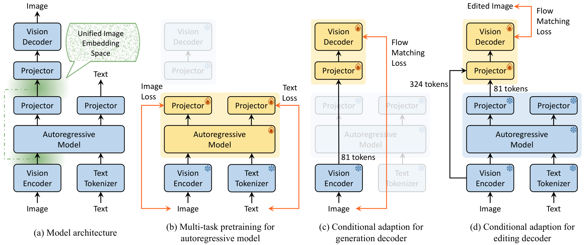

*Figure 1 · [Source](https://arxiv.org/abs/2504.21356)*

### Normalizing Trajectory Models

Normalizing Trajectory Models (NTM, Apple) recast few-step diffusion sampling as a single invertible flow trained by exact maximum likelihood rather than distillation, consistency training or adversarial objectives. Building on STARFlow's TarFlow-style autoregressive flow blocks, NTM combines a few shallow, shared invertible Transporter blocks within each denoising step with a deep, non-causal Predictor transformer that attends across the whole trajectory, so the model can be trained end to end from scratch or by fine-tuning a pretrained flow-matching backbone. Because the trajectory likelihood stays tractable, the frozen model can also act as a supervisory score for self-distillation, training a lightweight denoiser that reaches comparable text-to-image quality in four steps while preserving the exact-likelihood framework throughout.

[Architecture and figure](../models/continuous-ar.md#ntm) · [Paper](https://arxiv.org/abs/2605.08078) · [GitHub](https://github.com/apple-aiml-research/ml-starflow)

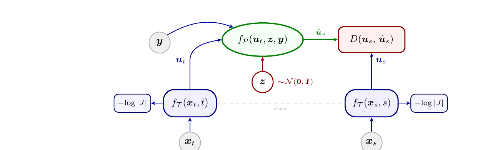

*Figure 3 (PDF p. 4) · [Source](https://arxiv.org/abs/2605.08078)*

### Nucleus-Image

Nucleus-Image studies sparse mixture-of-experts scaling as a path to high-quality text-to-image diffusion, reaching 17B total parameters across 64 routed experts per layer while activating only about 2B parameters per forward pass through Expert-Choice Routing. Text conditioning is handled by joint attention with text-key/value sharing across denoising timesteps rather than by folding text tokens into the main transformer backbone, and a decoupled routing design is used to keep timestep-conditioned modulation stable under sparsification. The authors describe it as the first fully open-source MoE diffusion model at competitive quality, releasing the training recipe.

[Architecture and figure](../models/dit.md#nucleus-image) · [Paper](https://arxiv.org/abs/2604.12163) · [GitHub](https://github.com/WithNucleusAI/Nucleus-Image) · [Model card](https://huggingface.co/NucleusAI/Nucleus-Image)

*Source-based architecture diagram · [Source](https://arxiv.org/abs/2604.12163)*

### NÜWA

NÜWA (Microsoft Research Asia and Peking University; ECCV 2022) is a visual synthesis model that treats text, images and videos as 3D token grids and generates visual tokens autoregressively with a local 3D attention mechanism. One pretrained model covers eight tasks, including text-to-image generation, sketch-to-image, image completion and zero-shot text-guided image manipulation, alongside text-to-video and video prediction.

[Architecture and figure](../models/ar-token.md#nuwa) · [Paper](https://arxiv.org/abs/2111.12417) · [GitHub](https://github.com/microsoft/NUWA)

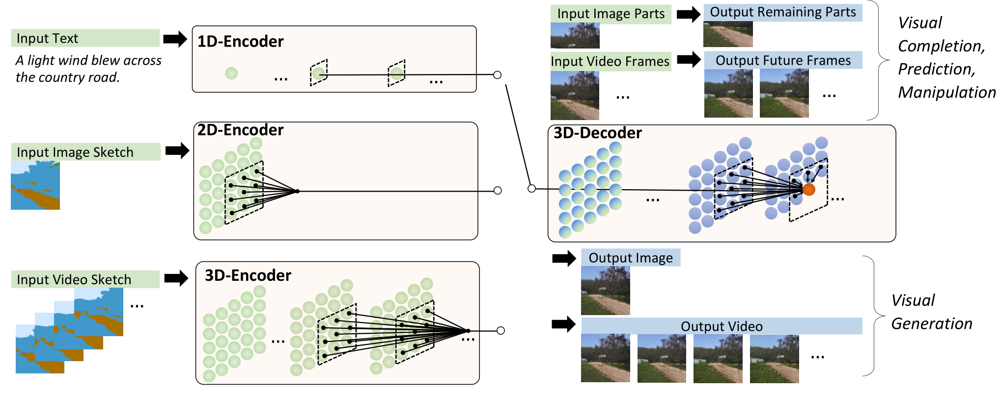

*Figure 2 · [Source](https://arxiv.org/abs/2111.12417)*

### oboro:

oboro: is a text-to-image foundation model built from scratch in Japan under the METI/NEDO GENIAC program, trained only on copyright-cleared images to support the country's anime and creative industries. Its Multi-Multi-Head (MMH) attention assigns a different number of attention heads to each DiT block (from 8/16 heads in early layers up to 24/48 in later ones) to encourage role differentiation between layers, and the model is designed to reach high image quality from a comparatively limited, deduplicated dataset (Megalith-10m with Florence-2 captions). The authors present it as the first fully Japan-developed, open-source, commercially oriented image-generation model, releasing weights and inference code.

[Architecture and figure](../models/dit.md#oboro) · [Paper](https://arxiv.org/abs/2511.08168) · [Model card](https://huggingface.co/aihub-geniac/oboro) · GitHub: no author-linked repository found

*Figure 1 · [Source](https://arxiv.org/abs/2511.08168)*

### OFA

OFA, from DAMO Academy at Alibaba, is a task-agnostic and modality-agnostic sequence-to-sequence framework. Text, images and spatial regions are all represented as tokens in one shared vocabulary (subwords, image-quantization codes and discretized coordinates), so a single Transformer encoder-decoder handles image captioning, visual question answering, visual grounding, image classification and text-to-image generation by simply changing the instruction and target sequence, with no task-specific output heads.

[Architecture and figure](../models/unified.md#ofa) · [Paper](https://arxiv.org/abs/2202.03052) · [GitHub](https://github.com/OFA-Sys/OFA)

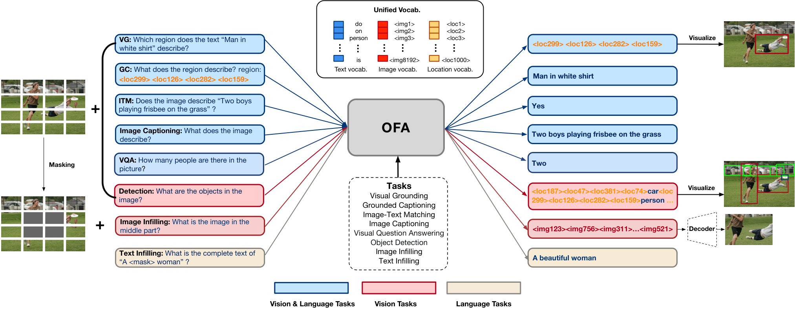

*Figure 2 · [Source](https://arxiv.org/abs/2202.03052)*

### Omni-Dish

Omni-Dish (Meituan and Beihang University) is described as the first text-to-image model tailored to Chinese dishes. It adopts the FLUX architecture at 7B parameters, swaps the text encoder for Qwen2.5-7B so that Chinese prompts work, and trains on about 100M dish name-image pairs after name correction and quality tagging. Training first teaches dish concepts from names with tags, then adds VLLM recaptions, then fine-tunes on manually annotated high-quality data and applies DPO on human preferences. At inference a library of high-quality captions and an LLM expand a short dish name into a detailed caption. For editing, Concept-Enhanced Prompt-to-Prompt builds source-target pairs from the model, and an editing model with extra input channels for the source image is trained on them mixed with general editing data.

[Architecture and figure](../models/dit.md#omni-dish) · [Paper](https://arxiv.org/abs/2504.09948) · [GitHub](https://github.com/LiuHuijie6410/OmniDish) · [Project](https://liuhuijie6410.github.io/OmniDish/)

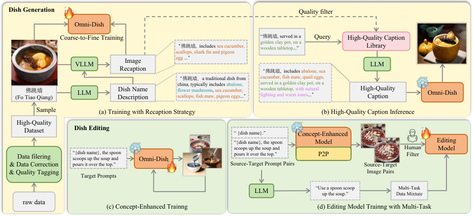

*Figure 4 · [Source](https://arxiv.org/abs/2504.09948)*

### OmniGen

OmniGen, from BAAI, is a unified image-generation model that accepts free-form interleaved text-and-image instructions and produces an image without task-specific plugins such as ControlNet or IP-Adapter. Text is tokenized normally and any input images are encoded into patch embeddings by a frozen VAE; a single transformer attends over text tokens, image-condition embeddings and noisy latent tokens together and iteratively denoises the latter with a rectified-flow objective, so the same weights cover text-to-image generation, instruction-based editing, subject-driven generation and several traditional vision tasks.

[Architecture and figure](../models/dit.md#omnigen) · [Paper](https://arxiv.org/abs/2409.11340) · [GitHub](https://github.com/VectorSpaceLab/OmniGen)

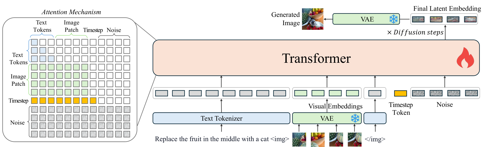

*Figure 2 · [Source](https://arxiv.org/abs/2409.11340)*

### OmniGen-AR

OmniGen-AR unifies text-to-image generation, image editing and other conditional image synthesis tasks (depth-to-image, segmentation-to-image) inside one autoregressive, next-token-prediction framework. Text and visual conditions share a single vocabulary built from a Qwen2.5 text tokenizer and a Cosmos-DV image/video tokenizer, and are fed through one decoder-only transformer initialized from Qwen2.5. The paper's main technical contribution, Disentangled Causal Attention, splits the causal attention mask into a condition-specific and a content-specific component during training so that generation targets cannot shortcut information from condition tokens, applied stochastically (10% of steps) as a regularizer while inference keeps standard causal decoding; a three-stage curriculum (single-image, image-video joint, multi-task) trains the 0.5B and 1.5B variants on a broad mixture of captioned image, video and instruction-editing datasets.

[Architecture and figure](../models/ar-token.md#omnigen-ar) · [Paper](https://arxiv.org/abs/2606.09156) · GitHub: no author-linked repository found

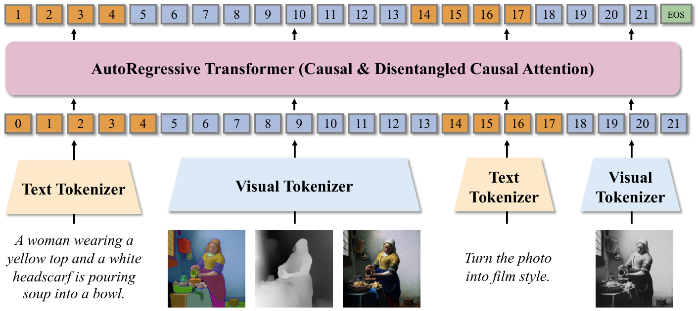

*Figure 2 · [Source](https://arxiv.org/abs/2606.09156)*

### OmniGen2

OmniGen2 is an open generative model from the OmniGen team (VectorSpaceLab) for text-to-image generation, instruction-based image editing and in-context (subject-driven) generation. Unlike OmniGen v1, which used one shared transformer, it decouples text and image generation: a vision-language model reads the multimodal context and emits a special token that triggers image generation, and a separately parameterized diffusion transformer, trained from scratch, synthesizes the image conditioned on the VLM's hidden states and on VAE features of reference images. The paper introduces the OmniContext benchmark for in-context generation and aligns the model with a staged Flow-GRPO curriculum over editing, text-to-image and in-context tasks.

[Architecture and figure](../models/unified.md#omnigen2) · [Paper](https://arxiv.org/abs/2506.18871) · [GitHub](https://github.com/VectorSpaceLab/OmniGen2) · [Model card](https://huggingface.co/OmniGen2/OmniGen2)

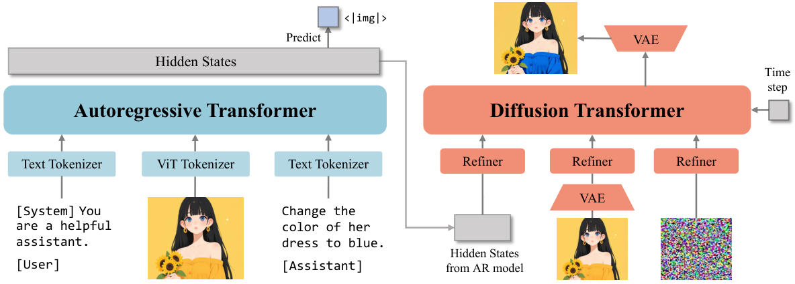

*Figure 2 · [Source](https://arxiv.org/abs/2506.18871)*

### OmniMamba

OmniMamba (HUST and Horizon Robotics) is presented as the first unified multimodal understanding and generation model built on a linear-complexity state space model. A single Mamba-2-1.3B backbone predicts the next token for both text and images. Understanding inputs go through DINOv2 and SigLIP encoders and an MLP, while generation uses the discrete VQ tokenizer from LlamaGen. Decoupled vocabularies with separate text and image output heads constrain each modality's output space, and rank-8 task-specific LoRA modules (0.65% extra parameters) are switched between understanding and text-to-image tasks. Training is split into a module-specific pre-training stage with the Mamba-2 weights frozen and a joint fine-tuning stage, which addresses the imbalance between understanding and generation data. The paper trains on 2M image-text pairs and reports speedups of up to 119.2x and 63% lower GPU memory against Show-o for long-sequence generation.

[Architecture and figure](../models/unified.md#omnimamba) · [Paper](https://arxiv.org/abs/2503.08686) · [GitHub](https://github.com/hustvl/OmniMamba) · [Model card](https://huggingface.co/hustvl/OmniMamba)

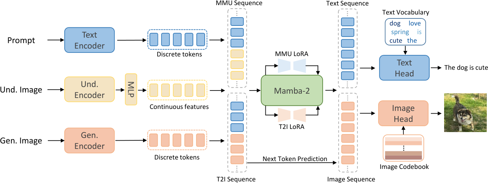

*Figure 2 · [Source](https://arxiv.org/abs/2503.08686)*

### OneCAT

OneCAT unifies multimodal understanding, text-to-image generation and instruction-based image editing in a single decoder-only autoregressive transformer with no external vision encoder or tokenizer needed at inference. Raw images are patchified directly into continuous tokens for understanding and editing conditioning, while a Modality-MoE architecture (three specialized FFN experts for text, understanding and generation, sharing attention/QKV) routes tokens to the right expert. Rather than next-token diffusion or continuous-token diffusion heads, OneCAT embeds Visual-Autoregressive-style next-scale prediction directly in the LLM via a scale-aware adapter, generating images coarse-to-fine without a diffusion sampler. The paper reports state-of-the-art results among unified models on understanding, generation and editing benchmarks, along with substantial inference speedups from removing external encoders and diffusion sampling, especially at high resolution.

[Architecture and figure](../models/unified.md#onecat) · [Paper](https://arxiv.org/abs/2509.03498) · [GitHub](https://github.com/onecat-ai/OneCAT) · [Model card](https://huggingface.co/onecat-ai/OneCAT-3B)

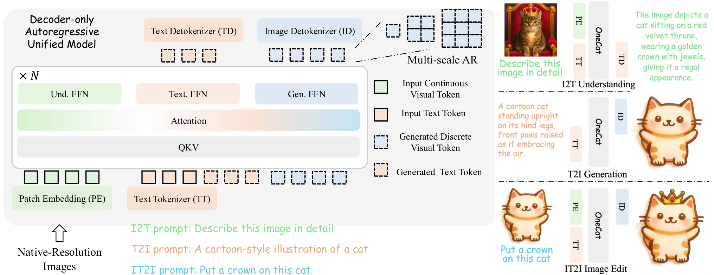

*Figure 3 · [Source](https://arxiv.org/abs/2509.03498)*

### OneFlow

OneFlow (FAIR at Meta) is a multimodal model that drops the fixed left-to-right ordering of autoregressive systems. Text is generated by Edit Flows, a continuous-time Markov chain that inserts tokens into variable-length sequences, while images are generated by flow matching on continuous latents, and both processes run together so text and images in an interleaved sequence are produced concurrently, with content tokens inserted before filler. A mixed-modal training scheme lets the model generate clean text and an image concurrently. In controlled experiments from 1B to 8B parameters against an autoregressive plus flow-matching baseline built on Transfusion and a LLaDA-style masked diffusion baseline, the paper reports better scaling on text-to-image (DPG-Bench, FID), captioning and visual question answering with up to 50% fewer training FLOPs.

[Architecture and figure](../models/unified.md#oneflow) · [Paper](https://arxiv.org/abs/2510.03506) · GitHub: no author-linked repository found

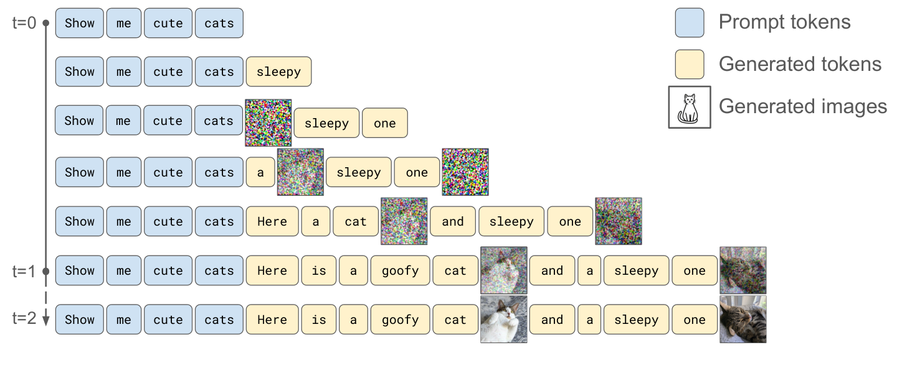

*Figure 1 · [Source](https://arxiv.org/abs/2510.03506)*

### Orthus

Orthus, from SJTU, is a unified multimodal model that keeps continuous, lossless image representations instead of vector-quantizing them, while still using a single autoregressive transformer backbone shared with text. Text is tokenized normally and images are embedded as continuous patch features from a vision encoder; the shared transformer predicts the next element of the sequence, routing text positions to a language-modeling head and image positions to a diffusion head that models the next patch feature conditionally, so text-to-image generation, visual understanding and interleaved image-text generation share one backbone with modality-specific output heads.

[Architecture and figure](../models/unified.md#orthus) · [Paper](https://arxiv.org/abs/2412.00127) · [GitHub](https://github.com/SJTU-DENG-Lab/Orthus)

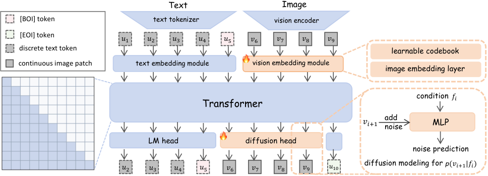

*Figure 2 · [Source](https://arxiv.org/abs/2412.00127)*

### Ovis-Image

Ovis-Image is a 7B-class (10B total, including its frozen encoders) open text-to-image model from the Ovis team, built by adapting the Ovis-U1 unified understanding/generation framework into a dedicated generation model with a larger MMDiT backbone. It conditions on the team's own Ovis2.5-2B vision-language model as text encoder, chosen because its multimodal pretraining already aligns text and image representations, and reuses FLUX.1-schnell's VAE unchanged. The paper's main claim is that a carefully designed, text-rendering-focused training recipe -- rather than a new architectural component -- lets a comparatively small model match the legible-text quality of much larger systems such as Qwen-Image, while remaining efficient enough to run on a single high-end GPU.

[Architecture and figure](../models/dit.md#ovis-image) · [Paper](https://arxiv.org/abs/2511.22982) · [GitHub](https://github.com/ATH-MaaS/Ovis-Image) · [Model card](https://huggingface.co/ATH-MaaS/Ovis-Image-7B)

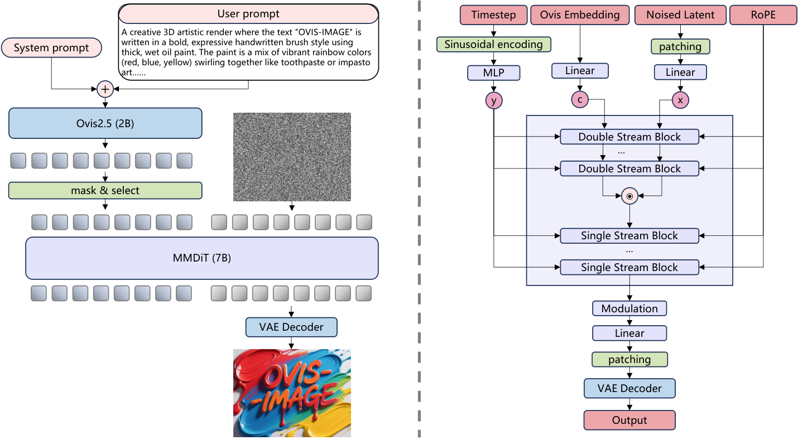

*Figure 2 · [Source](https://arxiv.org/abs/2511.22982)*

### Ovis-U1

Ovis-U1 is Alibaba's 3-billion-parameter unified model built on the Ovis series, adding text-to-image generation and instruction-based image editing to multimodal understanding. Unlike approaches that freeze a pretrained multimodal LLM and bolt on a generator, Ovis-U1 is trained from a language model with unified data from the start, which the report shows improves both understanding and generation over single-task training. It reports 69.6 on OpenCompass, 83.72/0.89 on DPG-Bench/GenEval for text-to-image generation, and 4.00/6.42 on ImgEdit-Bench/GEdit-Bench-EN for editing.

[Architecture and figure](../models/unified.md#ovis-u1) · [Paper](https://arxiv.org/abs/2506.23044) · [GitHub](https://github.com/AIDC-AI/Ovis-U1) · [Model card](https://huggingface.co/AIDC-AI/Ovis-U1-3B)

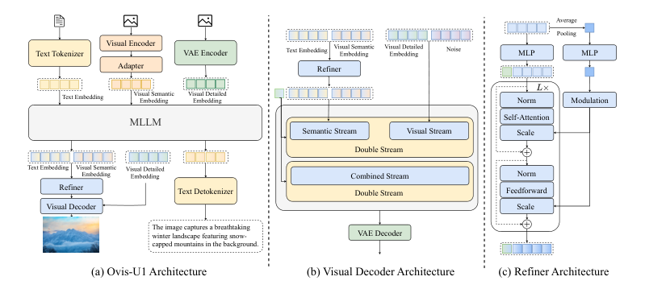

*Figure 2 · [Source](https://arxiv.org/abs/2506.23044)*

### Paella

Paella (LAION and Technical University of Darmstadt, 2022) is a fast text-to-image model that operates on VQGAN latent tokens with a convolutional network instead of a transformer, and samples by repeatedly predicting all tokens and randomly renoising a portion of them back to noise rather than permanently unmasking tokens, converging in about 12 steps. Besides text-to-image generation, the same trained model supports image-conditioned generation and zero-shot image variation through CLIP image embeddings.

[Architecture and figure](../models/masked.md#paella) · [Paper](https://arxiv.org/abs/2211.07292) · [GitHub](https://github.com/dome272/Paella) · [Model card](https://huggingface.co/dome272/Paella)

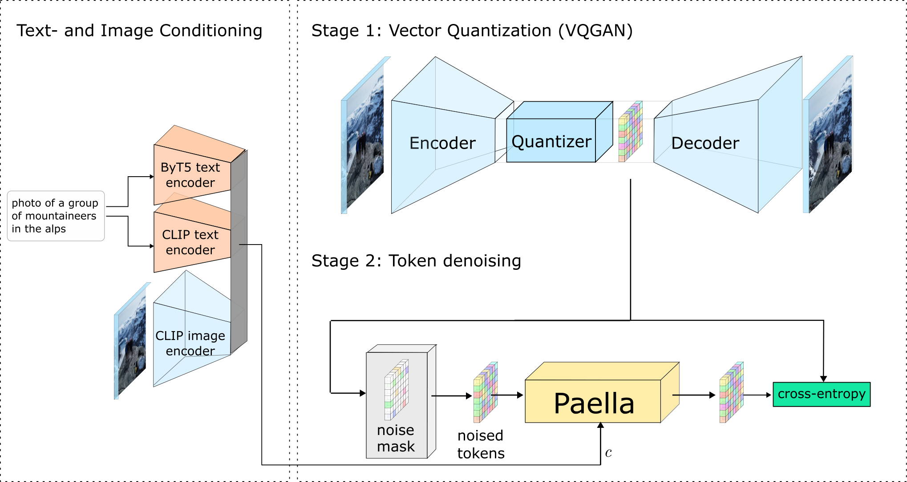

*Figure 2 · [Source](https://arxiv.org/abs/2211.07292)*

### PAR (Panoramic AutoRegressive)

PAR (NeurIPS 2025) targets 360-degree panorama generation with one model for text-to-panorama and panorama outpainting. The paper argues that diffusion models violate their i.i.d. Gaussian noise assumption on equirectangular projections and that existing systems use separate models for text and image conditioning. PAR instead masks and predicts latent tokens in arbitrary order, so known regions (an input image) and a text prompt are handled by the same masked autoregressive architecture. A consistency loss aligns predictions under cyclic horizontal shifts of the panorama, which are semantically equivalent, and circular padding applied before the VAE encoder and after the latent is decoded removes the seam at the image edge. The authors also show text-guided panorama editing.

[Architecture and figure](../models/continuous-ar.md#par-panorama) · [Paper](https://arxiv.org/abs/2505.16862) · [GitHub](https://github.com/wang-chaoyang/par) · [Project](https://wang-chaoyang.github.io/project/par)

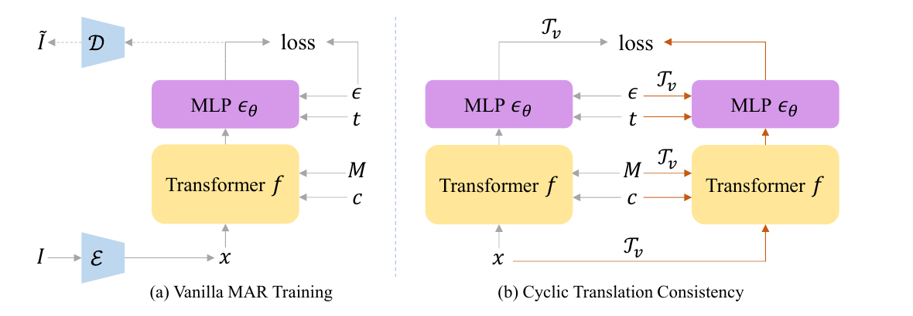

*Figure 2 (PDF p. 5) · [Source](https://arxiv.org/abs/2505.16862)*

### Parallel Multiscale PixelCNN

This DeepMind paper by Reed et al. makes PixelCNN practical at high resolution by modelling groups of pixels as conditionally independent given a lower-resolution image. Generation starts from a tiny 4 × 4 image and repeatedly doubles resolution, sampling pixel groups in parallel, which reduces sampling cost from linear to logarithmic in the number of pixels. Among its benchmarks are text-conditioned bird, human and COCO scene synthesis up to 256 × 256, where the caption is combined with keypoints or segmentation masks.

[Architecture and figure](../models/early.md#multiscale-pixelcnn) · [Paper](https://arxiv.org/abs/1703.03664) · GitHub: no author-linked repository found

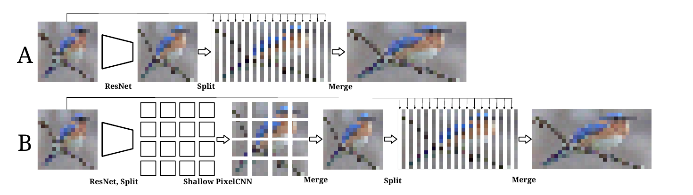

*Figure 3 (PDF p. 3) · [Source](https://arxiv.org/abs/1703.03664)*

### Paris

Paris (Bagel Labs) is presented as the first publicly released diffusion model pre-trained entirely through decentralized computation. The training set of 11M LAION-Aesthetic images is clustered with DINOv2 features into 8 semantic groups, and each expert, a DiT-XL/2 with PixArt-alpha style conditioning optimizations, trains on its own cluster with no gradient, parameter or activation exchange, on heterogeneous hardware. A separate transformer router, trained afterwards to predict the cluster of a noisy latent, orchestrates the experts at inference, with top-1, top-2 or all-expert weighted combinations of their flow predictions. The report states that this reaches quality comparable to centrally trained baselines using 14x less data and 16x fewer GPU-days than the earlier decentralized diffusion baseline.

[Architecture and figure](../models/dit.md#paris) · [Paper](https://arxiv.org/abs/2510.03434) · [GitHub](https://github.com/bageldotcom/paris) · [Model card](https://huggingface.co/bageldotcom/paris)

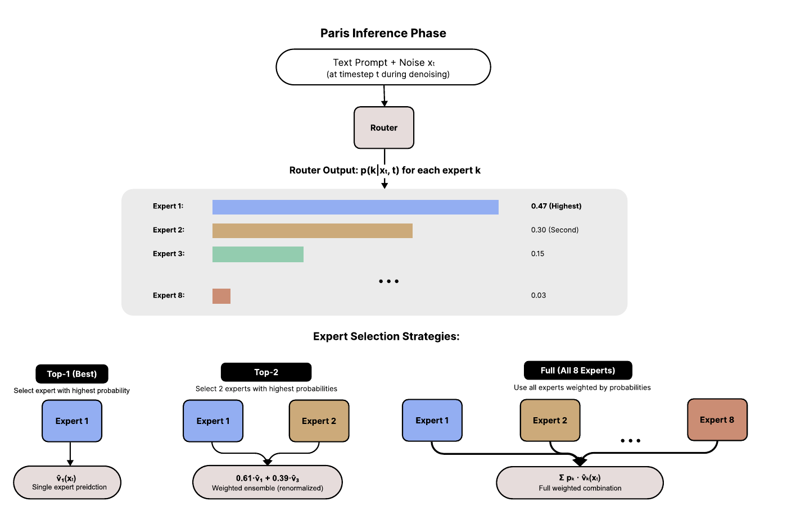

*Figure 2 (PDF p. 6) · [Source](https://arxiv.org/abs/2510.03434)*

### Parti

Parti (Google Research, 2022) treats text-to-image generation as sequence-to-sequence translation from text tokens to image tokens, the same recipe that scaled large language models. A ViT-VQGAN tokenizer represents images as discrete tokens, and encoder-decoder Transformers from 350M to 20B parameters are trained to predict those tokens from a text prompt, with the paper showing that image fidelity and prompt adherence keep improving as the decoder is scaled to 20B. Only the PartiPrompts benchmark and project data cards were released; model weights and code are not public.

[Architecture and figure](../models/ar-token.md#parti) · [Paper](https://arxiv.org/abs/2206.10789) · [GitHub](https://github.com/google-research/parti)

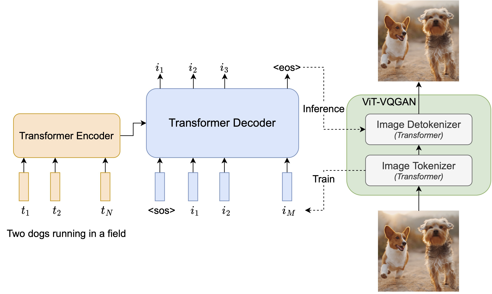

*Figure 3 · [Source](https://arxiv.org/abs/2206.10789)*

### PixArt-δ

PixArt-δ (Huawei Noah's Ark Lab with Tsinghua, HKU and Hugging Face, 2024) applies Latent Consistency Model distillation to the PixArt-α diffusion transformer. The resulting PixArt-LCM generates 1024×1024 images in two to four steps, about 0.5 seconds on an A100 and seven times faster than PixArt-α, and the distillation fits on 32GB V100 GPUs within a day. The same report introduces a ControlNet-Transformer design for adding spatial control to transformer denoisers.

[Architecture and figure](../models/efficient.md#pixart-delta) · [Paper](https://arxiv.org/abs/2401.05252) · [GitHub](https://github.com/PixArt-alpha/PixArt-alpha) · [Model card](https://huggingface.co/PixArt-alpha/PixArt-LCM-XL-2-1024-MS)

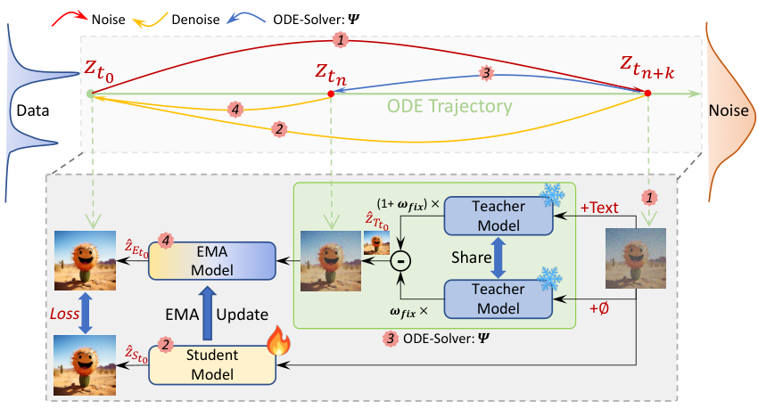

*Figure 1 · [Source](https://arxiv.org/abs/2401.05252)*

### PixArt-Σ

PixArt-Σ is the successor to PixArt-α from Huawei Noah's Ark Lab and academic partners. Rather than training from scratch, it upgrades the PixArt-α diffusion transformer in stages (a stronger VAE, higher-quality and longer captions, higher resolutions) and adds key-value token compression to self-attention so that attention cost stays manageable at 2K and 4K. With about 0.6B parameters, it keeps PixArt-α's cross-attention to T5 text features and generates images directly at up to roughly 4K resolution in one sampling process.

[Architecture and figure](../models/dit.md#pixart-sigma) · [Paper](https://arxiv.org/abs/2403.04692) · [GitHub](https://github.com/PixArt-alpha/PixArt-sigma) · [Model card](https://huggingface.co/PixArt-alpha/PixArt-Sigma-XL-2-1024-MS)

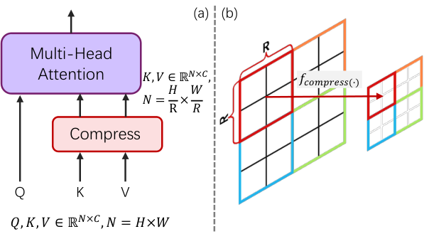

*Figure 7 · [Source](https://arxiv.org/abs/2403.04692)*

### PixelDiT

PixelDiT (NVIDIA and University of Rochester, 2025) trains a diffusion transformer directly on pixels instead of in an autoencoder latent space. A patch-level pathway of DiT blocks processes coarse patch tokens to learn global semantics, and a pixel-level pathway of Pixel Transformer (PiT) blocks refines texture on per-pixel tokens. Pixel-wise AdaLN gives each pixel its own modulation computed from the semantic tokens, and pixel token compaction reduces the pixel tokens before global attention so that attention stays affordable at high resolution. The paper reports FID 1.61 on ImageNet 256 and 1.81 on ImageNet 512, and a text-to-image variant, PixelDiT-T2I, trained at 1024x1024 in pixel space that reaches 0.74 on GenEval and 83.5 on DPG-Bench.

[Architecture and figure](../models/pixel-diffusion.md#pixeldit) · [Paper](https://arxiv.org/abs/2511.20645) · [GitHub](https://github.com/NVlabs/PixelDiT) · [Model card](https://huggingface.co/nvidia/PixelDiT-1300M-1024px) · [Project](https://pixeldit.github.io)

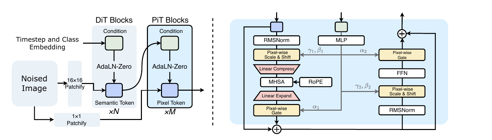

*Figure 2 (PDF p. 3) · [Source](https://arxiv.org/abs/2511.20645)*

### PixelFlow

PixelFlow (HKU and Adobe) generates images directly in raw pixels instead of an autoencoder latent, so the whole model is trained end to end. Its cost stays manageable because early, high-noise steps run at low resolution: the generation interval is split into stages, and at each stage the still-noisy result of the previous stage is upsampled and used as the starting point for flow matching at the next resolution. A single DiT-XL-style transformer handles every stage, with a resolution embedding, 2D RoPE and sequence packing for mixed resolutions. For text-to-image generation, cross-attention to Flan-T5-XL embeddings follows every self-attention layer; the paper reports benchmark results for a 512×512 model and also shows 1024×1024 samples.

[Architecture and figure](../models/pixel-diffusion.md#pixelflow) · [Paper](https://arxiv.org/abs/2504.07963) · [GitHub](https://github.com/ShoufaChen/PixelFlow) · [Model card](https://huggingface.co/ShoufaChen/PixelFlow-Text2Image)

*Figure 2 · [Source](https://arxiv.org/abs/2504.07963)*

### PixNerd

PixNerd (Nanjing University, ByteDance Seed and NUS) removes the VAE from diffusion transformers without a cascaded or multi-scale pipeline. It keeps the token count of a latent diffusion transformer by using large pixel patches and decodes each patch with a neural field, where the transformer predicts per-patch MLP weights that map pixel coordinate encodings and noisy pixel values to velocity, instead of a single linear layer that cannot capture fine detail. The model is trained end to end with flow matching and representation alignment. On ImageNet, PixNerd-XL/16 reaches FID 2.15 at 256x256 and 2.84 at 512x512, and the paper extends the design to text-to-image with a 1.2B PixNerd-XXL/16 trained on about 45M recaptioned images, reporting 0.73 on GenEval and 80.9 on DPG-Bench.

[Architecture and figure](../models/pixel-diffusion.md#pixnerd) · [Paper](https://arxiv.org/abs/2507.23268) · [GitHub](https://github.com/MCG-NJU/PixNerd) · [Model card](https://huggingface.co/MCG-NJU/PixNerd-XXL-P16-T2I)

*Figure 1 (PDF p. 1) · [Source](https://arxiv.org/abs/2507.23268)*

### Playground v2

Playground v2 is a latent diffusion text-to-image model from Playground that its model card says follows the same architecture as Stable Diffusion XL, with OpenCLIP ViT-G and CLIP ViT-L as fixed text encoders. Playground v2.5 keeps that architecture and changes the training recipe to improve aesthetic quality: it trains from scratch with the EDM framework and a noise schedule skewed toward higher noise for vivid color and contrast, uses balanced aspect-ratio buckets for multi-aspect generation, and applies supervised fine-tuning on curated data for human preference alignment. Both weight releases are on Hugging Face under Playground community licenses.

[Architecture and figure](../models/latent-unet.md#playground-v2) · [Paper](https://arxiv.org/abs/2402.17245) · [Model card 1](https://huggingface.co/playgroundai/playground-v2-1024px-aesthetic) · [Model card 2](https://huggingface.co/playgroundai/playground-v2.5-1024px-aesthetic) · GitHub: no author-linked repository found

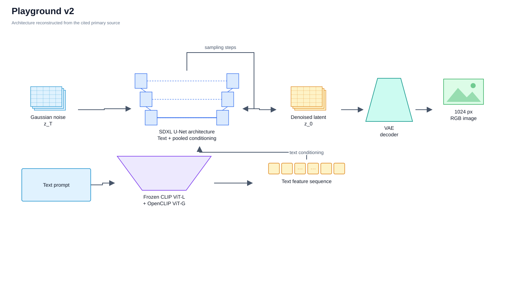

*Source-based architecture diagram · [Source](https://huggingface.co/playgroundai/playground-v2-1024px-aesthetic)*

### Playground v3

Playground v3 is Playground's third-generation text-to-image model and a departure from its earlier SDXL-based versions. Its central idea, Deep-Fusion, is to build the image transformer as a mirror of a large language model: each image block has the same shape as a Llama3-8B layer and reads that layer's hidden states through joint attention, so the diffusion model draws on the LLM's internal representations at every depth rather than only its final output. Combined with a 16-channel VAE, detailed synthetic captions and a 24B-parameter backbone, the paper reports strong prompt following, text rendering and graphic-design ability.

[Architecture and figure](../models/dit.md#playground-v3) · [Paper](https://arxiv.org/abs/2409.10695) · GitHub: no author-linked repository found

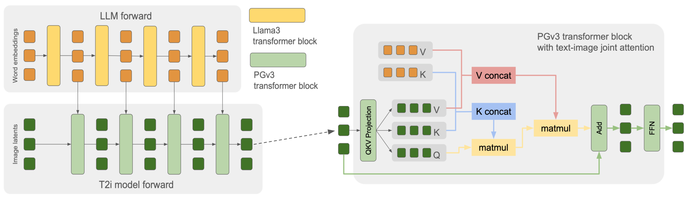

*Figure 2 · [Source](https://arxiv.org/abs/2409.10695)*

### ProxT2I

ProxT2I proposes a text-to-image diffusion model built on backward (implicit) discretizations of the reverse diffusion process rather than the forward, explicit discretizations used by standard score-based samplers. It replaces the learned score function with learned, conditional proximal operators, which the authors argue gives more stable, efficient sampling in few steps, and further tunes the resulting samplers with reinforcement learning against human-preference reward models. The paper trains its U-ViT backbone from scratch on a newly introduced 15M-image human-portrait dataset with fine-grained captions (LAION-Face-T2I-15M), reporting sampling efficiency and preference-alignment gains over score-based baselines at comparable or lower compute and model size.

[Architecture and figure](../models/dit.md#proxt2i) · [Paper](https://arxiv.org/abs/2511.18742) · GitHub: no author-linked repository found

*Source-based architecture diagram · [Source](https://arxiv.org/abs/2511.18742)*

### PS-VAE

PS-VAE addresses two obstacles in adapting representation-encoder features (rather than plain VAE latents) as generative latents: the discriminative feature space is poorly regularized, causing off-manifold samples with inaccurate structure, and the encoder's weak pixel reconstruction limits fine-grained geometry and texture. The paper introduces a semantic-pixel reconstruction objective that compresses both semantic content and fine-grained detail into a compact 96-channel, 16x16-downsampled latent, then builds a unified text-to-image and image-editing model on top of it. The authors report state-of-the-art reconstruction, faster convergence and substantial gains on both text-to-image and editing benchmarks compared to other feature spaces.

[Architecture and figure](../models/dit.md#ps-vae) · [Paper](https://arxiv.org/abs/2512.17909) · [Project](https://jshilong.github.io/PS-VAE-PAGE/) · GitHub: no author-linked repository found

*Figure 5 · [Source](https://arxiv.org/abs/2512.17909)*

### PSP-DiT

Panoptic Scene Program Diffusion Transformer (PSP-DiT) targets compositional text-to-image prompts — those requiring correct object counts, attribute ownership, spatial ordering and role-sensitive relations — by making a panoptic scene program (a structured graph of instances, attributes, relations and counts) a first-class latent that the diffusion transformer denoises jointly with the image, rather than an external layout signal or a post-hoc parse of the output. Coupled transformer streams for the image and scene-program latents exchange information through bidirectional cross-attention, and grounding plus cycle-consistency objectives tie the scene program to visual support in the generated image. The paper reports gains over a strong flat-text DiT baseline concentrated on counting, attribute binding, relational and long structured prompts, with modest added inference cost.

[Architecture and figure](../models/dit.md#psp-dit) · [Paper](https://arxiv.org/abs/2609.31780) · GitHub: no author-linked repository found

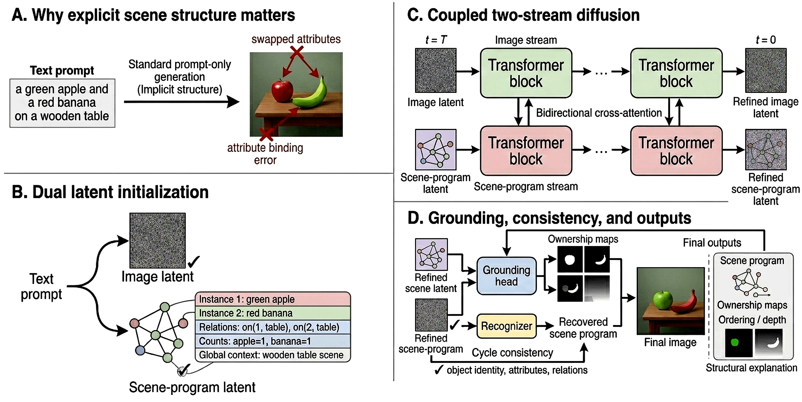

*Figure 1 · [Source](https://arxiv.org/abs/2609.31780)*

### PUMA

PUMA (emPowering Unified MLLM with Multi-grAnular visual generation), from a group including Fudan University and Shanghai AI Lab, unifies multimodal understanding and generation by representing an image at five feature granularities, from one coarse token to hundreds of fine-grained tokens. A single autoregressive multimodal LLM takes multi-granular image features and text as input and predicts a text-token classification loss for text and a regression loss for continuous image features, so the coarse granularities support diverse text-to-image generation while the finest granularity, decoded by a diffusion-based decoder, supports detail-preserving image editing and conditional generation.

[Architecture and figure](../models/unified.md#puma) · [Paper](https://arxiv.org/abs/2410.13861) · [GitHub](https://github.com/rongyaofang/PUMA)

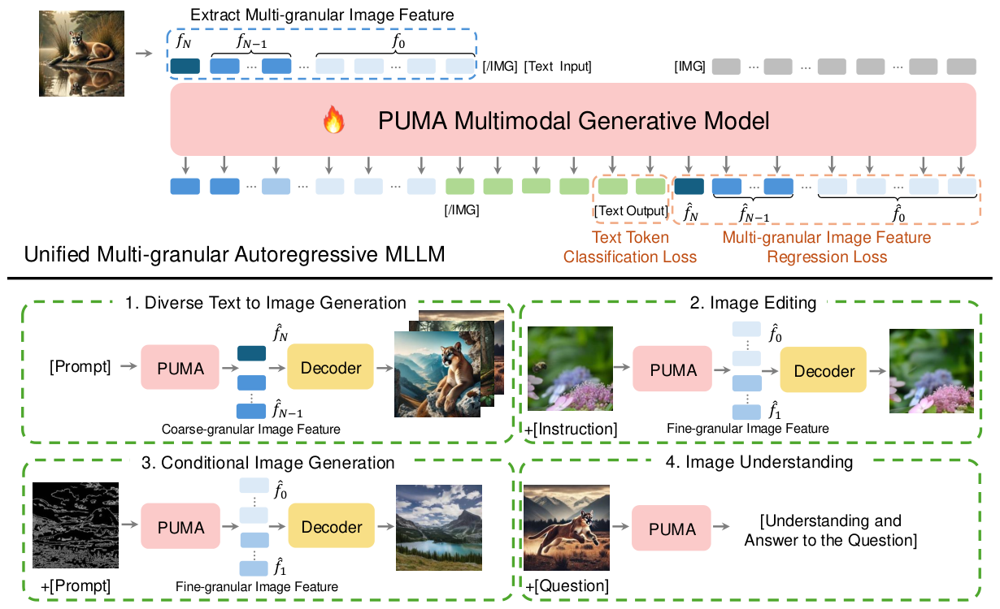

*Figure 2 · [Source](https://arxiv.org/abs/2410.13861)*

### Query-Kontext

Query-Kontext (Baidu VIS and NUS) separates multimodal generative reasoning from high-fidelity rendering in a unified image generation and editing system. A VLM, Qwen2.5-VL-7B with LoRA, encodes the text prompt, any input images and learnable query tokens into a short sequence of kontext tokens that carry semantic cues and coarse image conditions for the diffusion model. Training has three stages: first the VLM is bridged to a lightweight 870M diffusion head, then the head is replaced by a roughly 10x larger in-house MMDiT with the VLM frozen, and finally a low-level image encoder and LoRA on the diffusion model add fine detail for identity preservation. A shifted rotary position embedding separates source images (negative coordinates) from reference images (positive coordinates). The paper reports GenEval 0.88 and results on GEdit-Bench, DreamBooth and DreamBench.

[Architecture and figure](../models/dit.md#query-kontext) · [Paper](https://arxiv.org/abs/2509.26641) · GitHub: no author-linked repository found

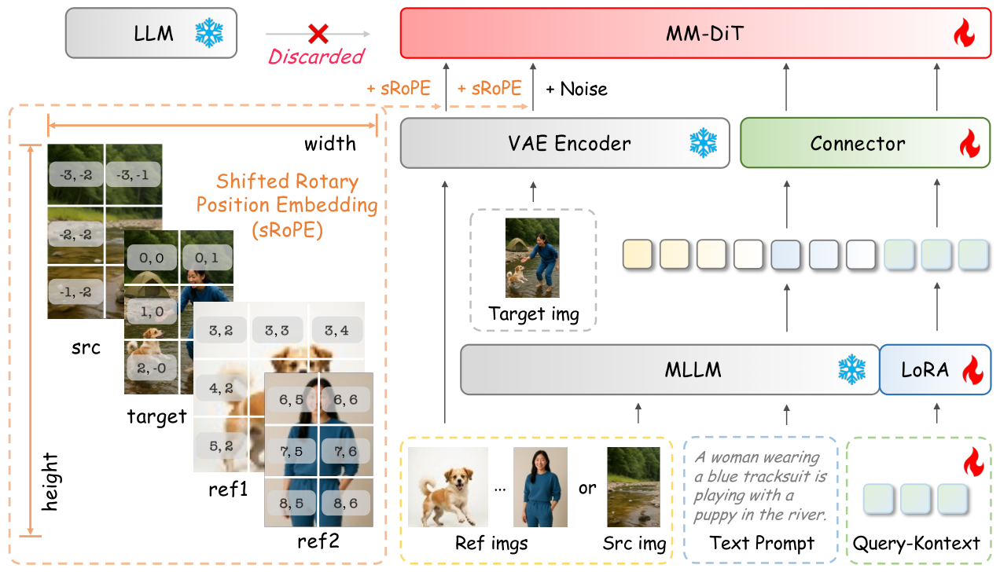

*Figure 2 · [Source](https://arxiv.org/abs/2509.26641)*

### Qwen-Image

Qwen-Image is Alibaba's 20B-parameter open text-to-image foundation model, built as a double-stream MMDiT transformer conditioned on a frozen Qwen2.5-VL vision-language model rather than a text-only encoder. The team argues that because Qwen2.5-VL's language and visual representation spaces are already aligned through its own multimodal pretraining, it transfers better as a diffusion conditioner than a pure LLM, and pairs it with a new MSRoPE positional scheme designed to keep image and text token positions consistent under resolution changes. Its VAE reuses a video autoencoder's architecture but retrains the decoder for image fidelity, particularly for rendered text. A heavy curriculum of synthetic text-rendering data lets Qwen-Image generate paragraph-length legible text inside images, a documented weak point of most other text-to-image models. It was released with Apache-2.0 code and weights.

[Architecture and figure](../models/dit.md#qwen-image) · [Paper](https://arxiv.org/abs/2508.02324) · [GitHub](https://github.com/QwenLM/Qwen-Image) · [Model card 1](https://huggingface.co/Qwen/Qwen-Image) · [Model card 2](https://huggingface.co/Qwen/Qwen-Image-2512)

*Figure 6 · [Source](https://arxiv.org/abs/2508.02324)*

### Qwen-Image-2.0

Qwen-Image-2.0 is Alibaba's second-generation text-to-image and editing foundation model, redesigning Qwen-Image's double-stream MMDiT into a single shared transformer stream that processes text and image tokens together, paired with a new frozen Qwen3-VL condition encoder and a more aggressively compressed VAE. The technical report frames it as an 'omni-capable' model that unifies high-fidelity generation with precise, instruction-driven multi-image editing in one architecture, and reports large human-evaluation gains over the original Qwen-Image on both tasks, particularly long, multilingual in-image text. The open-weight Qwen-Image-2.1 release brings a smaller, 7B-parameter single-stream version of this architecture with efficiency optimizations and native transparent (RGBA) image support, under a research-only license.

[Architecture and figure](../models/dit.md#qwen-image-2) · [Paper](https://arxiv.org/abs/2605.10730) · [GitHub](https://github.com/QwenLM/Qwen-Image-2.1) · [Model card](https://huggingface.co/Qwen/Qwen-Image-2.1) · [Announcement](https://qwen.ai/blog?id=qwen-image-2.0)

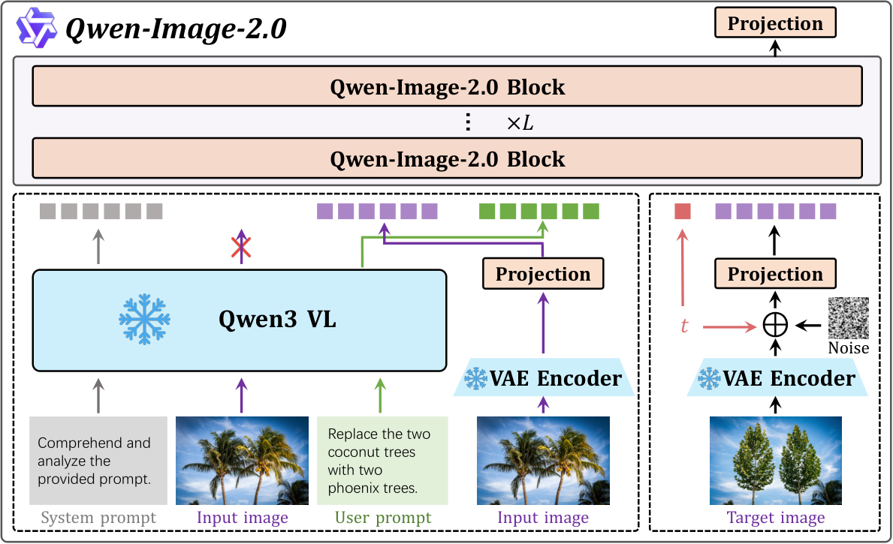

*Figure 8 · [Source](https://arxiv.org/abs/2605.10730)*

### Qwen-Image-Flash

Qwen-Image-Flash studies how to distill Qwen-Image-2.0 into a fast, few-step (4-NFE) model covering both text-to-image generation and instruction-based editing under the Distribution Matching Distillation (DMD) framework. Rather than proposing new network modules, the paper systematically revisits three practical levers of the distillation recipe: training-data composition (finding single-category data generalizes better than indiscriminately broad category mixes), teacher guidance (anchoring the first distillation steps to the base teacher and introducing a specialized teacher's guidance only at the final step, rather than supervising every step with a post-trained teacher), and task mixture (a balanced 5:5 text-to-image-to-editing ratio outperforming generation-dominant mixtures for unified few-step editing). The result is a single few-step student that handles both generation and editing from one set of weights.

[Architecture and figure](../models/efficient.md#qwen-image-flash) · [Paper](https://arxiv.org/abs/2606.03746) · GitHub: no author-linked repository found

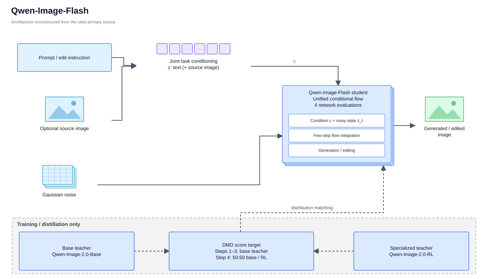

*Source-based architecture diagram · [Source](https://arxiv.org/abs/2606.03746)*

### Recraft

Recraft is a design-oriented image generation service and API whose models produce both raster images and editable vector graphics. Recraft V3 (October 2024) was introduced with long-text rendering, control over text position and size, brand-style consistency from a set of example images, and editing tools such as inpainting, outpainting and area modification. Recraft V4 (February 2026) came in standard and Pro (2048×2048) raster versions and matching vector versions that output layered SVG files, and V4.1 (May 2026) added V4.1, V4.1 Vector and V4.1 Utility versions. The API documents text-to-image and image-to-image with prompts for V3 and later, and mask-based inpainting, outpainting and background replacement for V3. Recraft does not publish model architectures.

[Architecture and figure](../models/api.md#recraft) · [Announcement 1](https://www.recraft.ai/blog/recraft-introduces-a-revolutionary-ai-model-that-thinks-in-design-language) · [Announcement 2](https://www.recraft.ai/blog/introducing-recraft-v4-design-taste-meets-image-generation) · [Announcement 3](https://www.recraft.ai/blog/recraft-v4-1-more-beautiful-by-nature) · [Docs 1](https://www.recraft.ai/docs/recraft-models/recraft-V4) · [Docs 2](https://www.recraft.ai/docs/api-reference/endpoints)

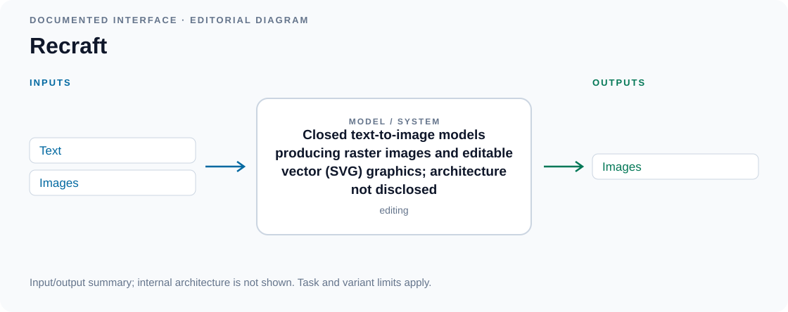

*Editorial input/output diagram · [Source](https://www.recraft.ai/docs/api-reference/endpoints)*

### Reve Image

Reve Image is the image model line from Reve AI, served through reve.com and an API. The relaunched product of September 2025 bundled text-to-image generation, natural-language editing of generated and uploaded images, remixing of several images into one composition and an API beta, and Reve's first editing model followed in October 2025. Reve v1.5 (February 2026) generates 4K images and, according to Reve, works in native pixel space rather than an autoencoder latent. Reve 2.0 (June 2026) and 2.1 (July 2026) build every image from a "layout", a structured, hierarchical map of regions, text and objects that users and agents can edit. Reve describes a "Large Layout Model" trained from open-source LLMs that turns layouts, instructions and images into a layout and then renders the final pixels. The Reve 2.1 API (July 2026) exposes both simple create and edit endpoints and endpoints that separate layout creation, editing and rendering.

[Architecture and figure](../models/api.md#reve-image) · [Announcement 1](https://blog.reve.com/posts/the-new-reve/) · [Announcement 2](https://blog.reve.com/posts/reve-editing-model/) · [Announcement 3](https://blog.reve.com/posts/reve-1.5-is-here/) · [Announcement 4](https://blog.reve.com/posts/announcing-reve-2.0/) · [Announcement 5](https://blog.reve.com/posts/the-layout-bet/) · [Announcement 6](https://blog.reve.com/posts/launching-reve-2.1/) · [Announcement 7](https://blog.reve.com/posts/the-reve-api/) · [Announcement 8](https://blog.reve.com/posts/a-new-chapter-for-reve/)

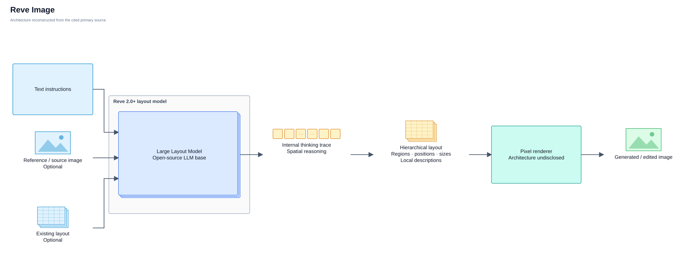

*Source-based architecture diagram · [Source](https://blog.reve.com/posts/the-layout-bet/)*

### ruDALL-E

ruDALL-E is Sber AI and SberDevices' open reproduction of OpenAI's DALL·E for Russian prompts, released in November 2021. A transformer predicts discrete VQ-GAN image tokens after the text tokens, and the generation pipeline adds ruCLIP reranking and Real-ESRGAN upscaling. The 1.3-billion-parameter Malevich (XL) model was released openly, while the 12-billion-parameter Kandinsky (XXL) model was described alongside it.

[Architecture and figure](../models/ar-token.md#rudall-e) · [Announcement 1](https://habr.com/ru/company/sberdevices/blog/586926/) · [Announcement 2](https://habr.com/ru/company/sberbank/blog/589673/) · [GitHub](https://github.com/ai-forever/ru-dalle) · [Model card](https://huggingface.co/ai-forever/rudalle-Malevich)

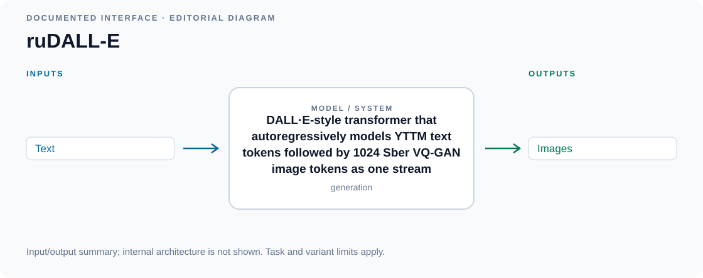

*Source-based architecture diagram · [Source](https://github.com/ai-forever/ru-dalle)*

### SANA

SANA is NVIDIA's efficiency-focused text-to-image model, designed to produce high-resolution images quickly enough to run on a laptop GPU. It combines three ideas: an autoencoder that compresses images 32× so far fewer tokens reach the transformer, a diffusion transformer whose attention is linear rather than quadratic in the number of tokens (with convolutional feed-forward layers that make positional embeddings unnecessary), and a small decoder-only LLM, Gemma-2, as text encoder, prompted with in-context instructions. With 0.6B to 1.6B parameters, the paper reports quality competitive with much larger models at far higher throughput and generation up to 4K resolution.

[Architecture and figure](../models/dit.md#sana) · [Paper](https://arxiv.org/abs/2410.10629) · [GitHub](https://github.com/NVlabs/Sana) · [Model card](https://huggingface.co/Efficient-Large-Model/Sana_1600M_1024px)

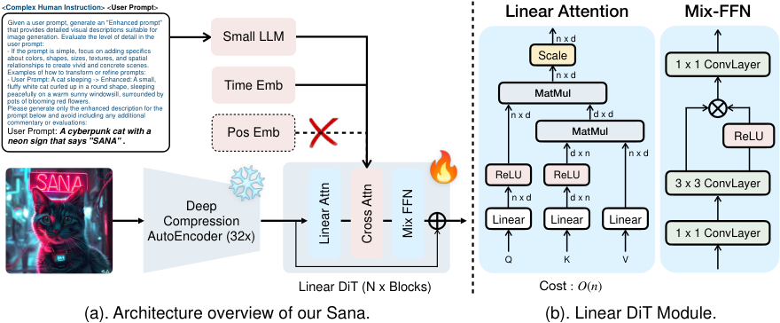

*Figure 5 · [Source](https://arxiv.org/abs/2410.10629)*

### SANA 1.5

SANA 1.5 is NVIDIA's follow-up to SANA that studies how to scale a linear diffusion transformer cheaply. Instead of training a larger model from scratch, it grows the 1.6B SANA model to 4.8B parameters by stacking new, identity-initialized blocks on top of the pre-trained ones and training with a memory-saving 8-bit optimizer. The resulting deep model can then be pruned back to smaller sizes for deployment, and at inference time quality can be traded for compute by generating several candidates and letting a vision-language model pick the best, which the paper shows lifts benchmark alignment scores substantially.

[Architecture and figure](../models/dit.md#sana-1-5) · [Paper](https://arxiv.org/abs/2501.18427) · [GitHub](https://github.com/NVlabs/Sana) · [Model card](https://huggingface.co/Efficient-Large-Model/SANA1.5_4.8B_1024px)

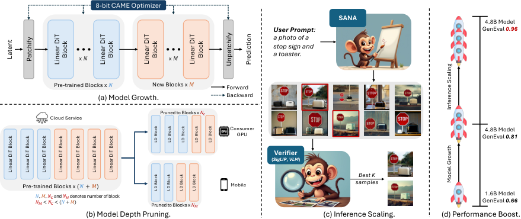

*Figure 1 · [Source](https://arxiv.org/abs/2501.18427)*

### SANA-Sprint

SANA-Sprint (NVIDIA, MIT, Tsinghua and Hugging Face, 2025) makes the SANA text-to-image transformer generate 1024×1024 images in one to four steps, about 0.1 s on an H100. Continuous-time consistency models require a TrigFlow parameterization, so the paper converts the pretrained flow-matching SANA model to TrigFlow by transforming its inputs and outputs mathematically instead of pretraining a new model. The student is then trained with an sCM loss that keeps it consistent with the teacher's trajectory and a LADD-style GAN loss, with discriminator heads on the frozen teacher's features, that sharpens one-step samples. A single model serves all step counts from one to four. The paper also combines SANA-Sprint with ControlNet for interactive generation.

[Architecture and figure](../models/efficient.md#sana-sprint) · [Paper](https://arxiv.org/abs/2503.09641) · [GitHub](https://github.com/NVlabs/Sana) · [Model card](https://huggingface.co/Efficient-Large-Model/Sana_Sprint_1.6B_1024px) · [Project](https://nvlabs.github.io/Sana/Sprint/)

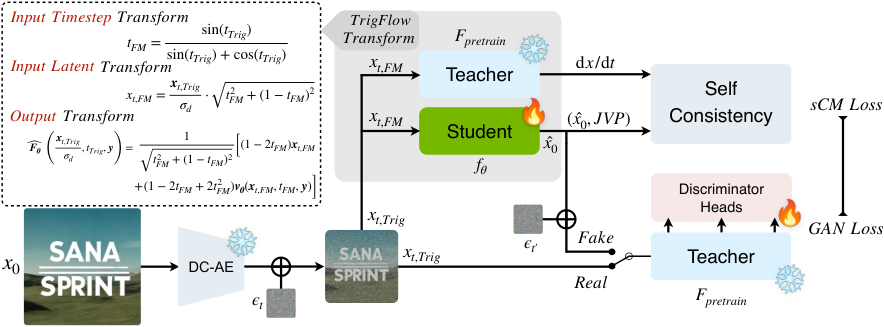

*Figure 2 · [Source](https://arxiv.org/abs/2503.09641)*

### SD3-Turbo (Latent Adversarial Diffusion Distillation)

Latent Adversarial Diffusion Distillation (LADD, Stability AI, 2024) is the successor to ADD and was used to distill the 8B Stable Diffusion 3 transformer into SD3-Turbo, a multi-aspect-ratio megapixel generator that samples in four steps without classifier-free guidance. Instead of decoding to pixels and judging images with a fixed DINOv2 network, LADD re-noises the student's latents, passes them through the frozen teacher, and trains independent discriminator heads on the teacher's token sequence after each attention block. Training data are latents generated by the teacher at a fixed guidance scale, so no real images or decoder passes are needed.

[Architecture and figure](../models/efficient.md#sd3-turbo) · [Paper](https://arxiv.org/abs/2403.12015) · GitHub: no author-linked repository found

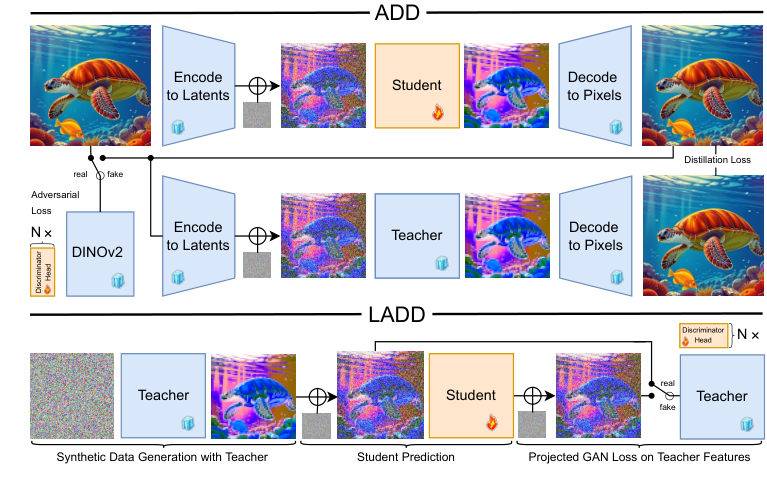

*Figure 3 · [Source](https://arxiv.org/abs/2403.12015)*

### SDXL Turbo (Adversarial Diffusion Distillation)

Adversarial Diffusion Distillation (ADD, Stability AI, 2023) turns a pretrained latent diffusion model into a one- to four-step text-to-image generator. The student starts from the pretrained U-Net weights and is trained on two signals at once: a discriminator built from a frozen pretrained vision transformer with small trainable heads pushes single-step outputs toward real-image fidelity, and a frozen diffusion teacher, applied to re-noised student outputs, provides a score-distillation target for text alignment and quality. The released SDXL Turbo applies ADD to SDXL 1.0; SD Turbo applies it to Stable Diffusion 2.1.

[Architecture and figure](../models/efficient.md#sdxl-turbo) · [Paper](https://arxiv.org/abs/2311.17042) · [Announcement](https://stability.ai/news/stability-ai-sdxl-turbo) · [Model card 1](https://huggingface.co/stabilityai/sdxl-turbo) · [Model card 2](https://huggingface.co/stabilityai/sd-turbo) · [GitHub](https://github.com/Stability-AI/generative-models)

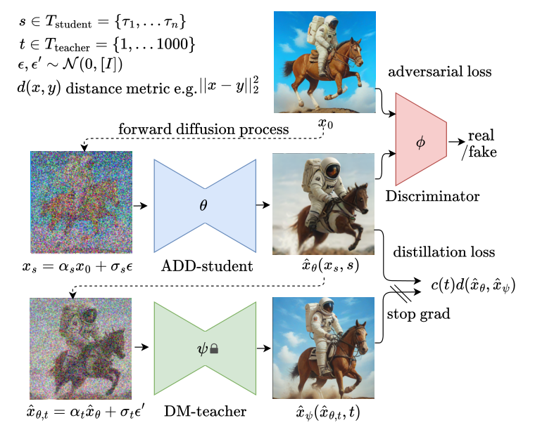

*Figure 2 · [Source](https://arxiv.org/abs/2311.17042)*

### SDXL-Lightning

SDXL-Lightning (ByteDance, 2024) distills SDXL into 1024px generators that need one to eight sampling steps. It follows progressive distillation, where each student learns to reproduce several teacher steps in one, but replaces the usual mean-squared-error target, which the paper shows produces blurry images at low step counts, with an adversarial loss. The discriminator is built from a copy of SDXL's own U-Net encoder and mid-block, so it works directly on noisy latents at any timestep and accepts the text condition. The models are released both as full U-Net checkpoints and as LoRA modules that can be applied to other SDXL-based models.

[Architecture and figure](../models/efficient.md#sdxl-lightning) · [Paper](https://arxiv.org/abs/2402.13929) · [Model card](https://huggingface.co/ByteDance/SDXL-Lightning) · GitHub: no author-linked repository found

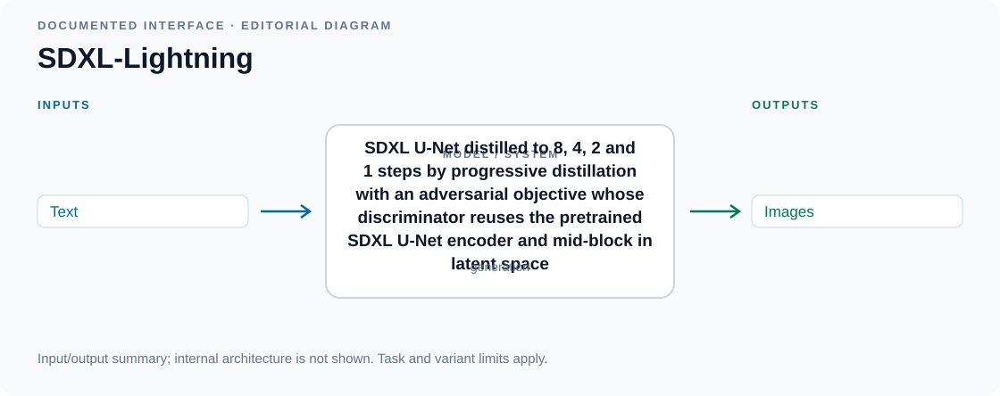

*Source-based architecture diagram · [Source](https://arxiv.org/abs/2402.13929)*

### SDXS

SDXS (Xiaomi, 2024) reduces both model size and step count. The VAE decoder is replaced by a tiny convolutional decoder trained to reproduce the original decoder's outputs with a distillation and GAN loss, and the U-Net is shrunk with BK-SDM-style block removal and knowledge distillation (SD 2.1-base loses its mid-stage, innermost stages and highest-resolution transformer blocks; SDXL loses most transformer blocks). The small U-Net is then turned into a one-step generator: a warmup matches features of its one-step outputs to multi-step teacher outputs with an SSIM-based feature loss, and training continues with Diff-Instruct-style score distillation on low-noise timesteps while feature matching covers the high-noise segment. The paper reports about 100 FPS at 512px and 30 FPS at 1024px on one GPU.

[Architecture and figure](../models/efficient.md#sdxs) · [Paper](https://arxiv.org/abs/2403.16627) · [GitHub](https://github.com/IDKiro/sdxs) · [Model card](https://huggingface.co/IDKiro/sdxs-512-0.9)

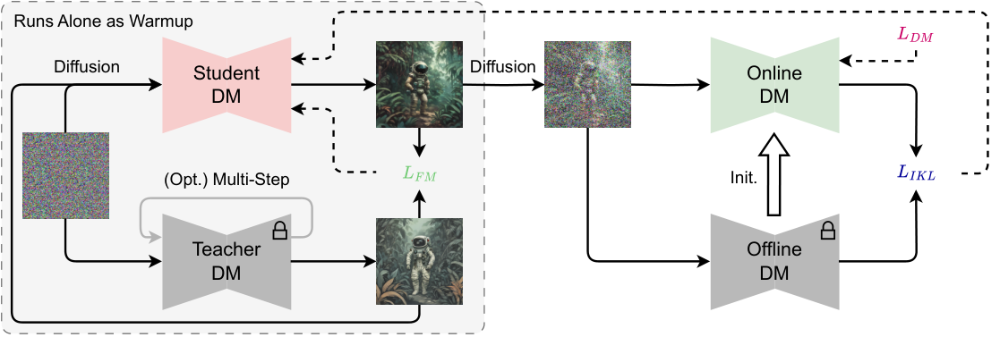

*Figure 3 · [Source](https://arxiv.org/abs/2403.16627)*

### SEED-LLaMA

SEED-LLaMA, from Tencent AI Lab and ARC Lab (Tencent PCG), teaches a pretrained LLM to both see and draw using the SEED image tokenizer. SEED turns an image into 32 discrete codes with 1D causal dependency and high-level semantics: a BLIP-2 ViT encoder feeds a Causal Q-Former whose outputs are vector-quantized. The LLM is pretrained on interleaved text and SEED codes with a single next-word objective and then instruction-tuned. To generate an image, the predicted codes are mapped by an MLP to a generation embedding aligned with unCLIP Stable Diffusion, and the off-the-shelf SD U-Net decodes it. The paper demonstrates text-to-image generation, comprehension and multi-turn in-context image and text generation.

[Architecture and figure](../models/unified.md#seed-llama) · [Paper](https://arxiv.org/abs/2310.01218) · [GitHub](https://github.com/AILab-CVC/SEED) · [Model card](https://huggingface.co/AILab-CVC/seed-llama-8b-sft)

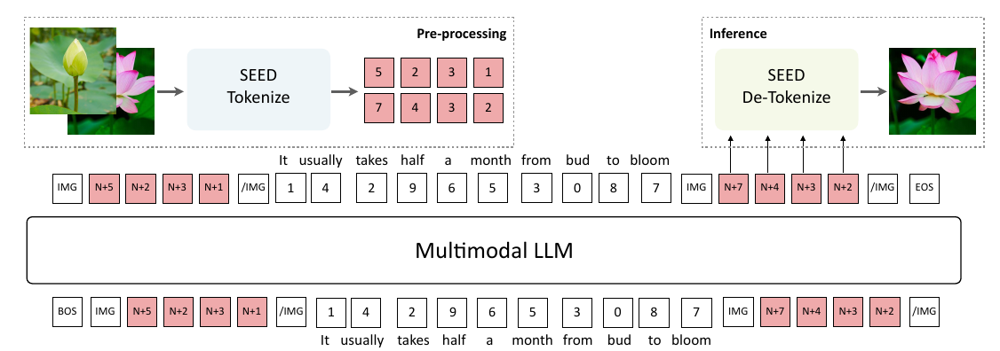

*Figure 4 (PDF p. 5) · [Source](https://arxiv.org/abs/2310.01218)*

### SEED-X

SEED-X, from Tencent AI Lab and ARC Lab (Tencent PCG), is a unified multimodal foundation model for multi-granularity comprehension and generation. Images are divided into sub-images to support arbitrary sizes and aspect ratios and fed to the LLM as ViT features. For generation, a fixed set of learnable queries is appended and their output hidden states are trained to regress the ViT features of the target image; a visual de-tokenizer built on SDXL then turns these features into an image. A second-stage de-tokenizer also accepts a condition image in latent space so that edits preserve low-level details. Instruction tuning yields a general assistant (SEED-X-I) and task models such as SEED-X-Edit for high-precision editing, plus story, slide and try-on variants.

[Architecture and figure](../models/unified.md#seed-x) · [Paper](https://arxiv.org/abs/2404.14396) · [GitHub](https://github.com/AILab-CVC/SEED-X) · [Model card](https://huggingface.co/AILab-CVC/SEED-X-17B)

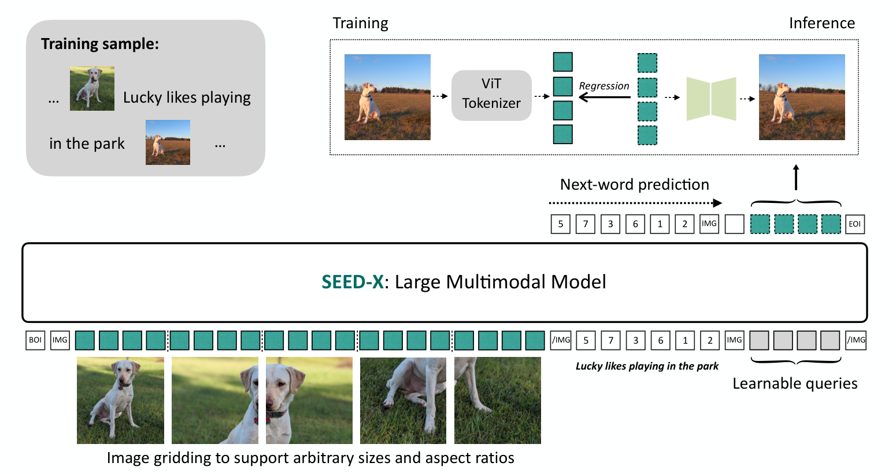

*Figure 4 · [Source](https://arxiv.org/abs/2404.14396)*

### Seedream 2.0

Seedream 2.0 is ByteDance's bilingual (Chinese and English) text-to-image foundation model, built as an MMDiT diffusion transformer that conditions jointly on a self-developed decoder-only LLM text encoder and a Glyph-ByT5 encoder dedicated to rendering legible text inside images. Its own VAE and a new Scaled RoPE positional scheme are meant to keep quality consistent at resolutions beyond what the model was trained on. The technical report emphasizes native, balanced Chinese-English understanding and aesthetic alignment through large-scale knowledge injection and active-learning-based data curation, and Seedream 3.0 (also in this catalog) reports that it inherits this same core MMDiT design. No public weights or code are available; the model is served only through ByteDance's own products.

[Architecture and figure](../models/dit.md#seedream-2) · [Paper](https://arxiv.org/abs/2503.07703) · GitHub: no author-linked repository found

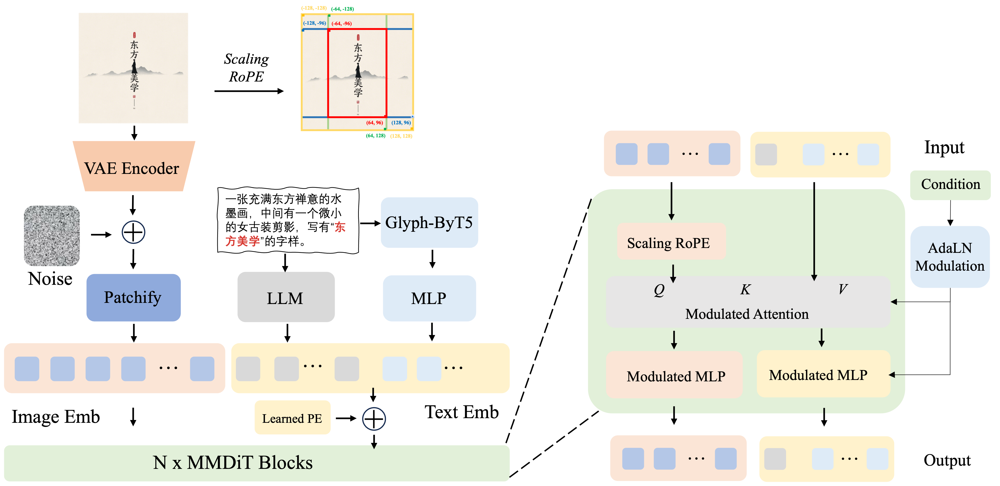

*Figure 10 · [Source](https://arxiv.org/abs/2503.07703)*

### Seedream 3.0

Seedream 3.0 is ByteDance's next Seedream generation, explicitly built on the same MMDiT architecture as Seedream 2.0 but scaled up in parameters and trained with a more elaborate curriculum: resolution progressively raised from 256px pre-training to 2048px fine-tuning with explicit size conditioning, a defect-aware data pipeline that expands training data using an automatic defect detector, a cross-modality RoPE for better text-image alignment, and a representation-alignment loss borrowed from DINOv2 features. Rather than introducing a new transformer design, the report focuses on training-time and data-quality improvements over Seedream 2.0, reporting gains in alignment, structural accuracy, aesthetics and text rendering. No public weights or code are available; the model is served only through ByteDance's own products.

[Architecture and figure](../models/dit.md#seedream-3) · [Paper](https://arxiv.org/abs/2504.11346)

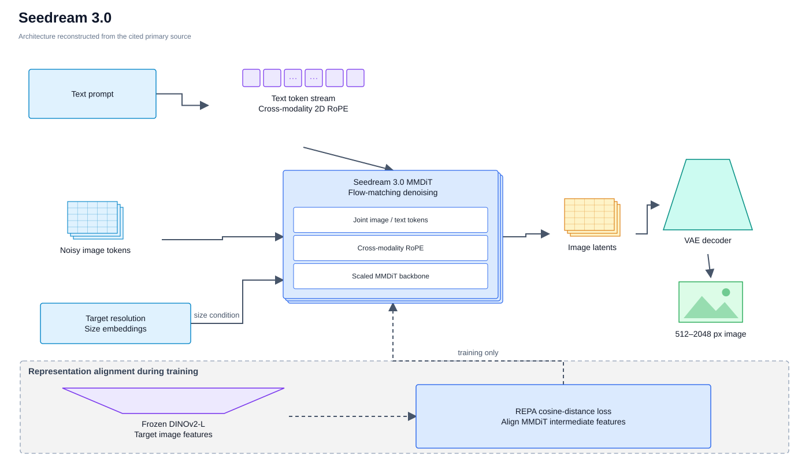

*Source-based architecture diagram · [Source](https://arxiv.org/abs/2504.11346)*

### Seedream 4.0

Seedream 4.0 is ByteDance's unified text-to-image generation and multi-image editing system, built around a redesigned, more efficient diffusion transformer backbone that the technical report says substantially raises model capacity while cutting training and inference cost. Generation and editing share one model through a 'causal diffusion' post-training stage, so the same network can take a text prompt alone or a prompt plus one or several reference images and return one or multiple output images, evaluated as co-equal capabilities in the paper's benchmarks. A high-compression VAE and a Seed1.5-VL-based prompt/routing module keep image tokens few and route different input types, while adversarial distillation, quantization and speculative decoding push inference to roughly 1.4 seconds for a 2K image, over 10x faster than Seedream 3.0. Seedream 4.5 is a later product update of the same system rather than a new architecture. No public weights or code exist; the model is available only through ByteDance's API and products.

[Architecture and figure](../models/dit.md#seedream-4) · [Paper](https://arxiv.org/abs/2509.20427) · [Announcement](https://www.byteplus.com/en/blog/seedream4-5) · GitHub: no author-linked repository found

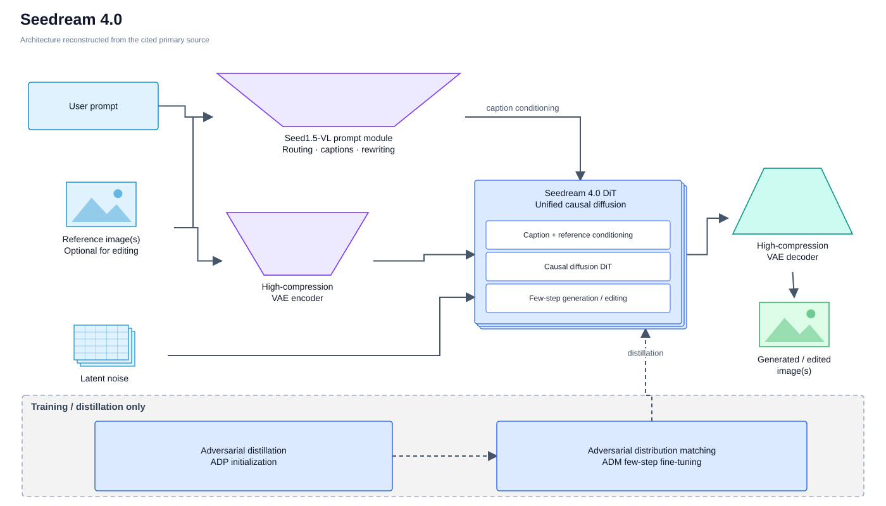

*Source-based architecture diagram · [Source](https://arxiv.org/abs/2509.20427)*

### Seedream 5.0

Seedream 5.0 is ByteDance Seed's closed image creation line released after Seedream 4.0. Seedream 5.0 Lite (announced 2026-02-13) is described as a unified multimodal image generation model with deep thinking and online search: it reasons through complex prompts step by step, uses real-time web search for time-sensitive content, follows reference images more closely and supports single-image editing and style transfer from references. Seedream 5.0 Pro (2026-07-08) targets information visualization and professional layouts, multilingual text rendering, realistic imagery and interactive precision editing with point and lasso selection, sketch rendering, color and material replacement, layer separation and multi-image fusion. No technical report or architecture details have been published for version 5.0.

[Architecture and figure](../models/api.md#seedream-5) · [Announcement 1](https://seed.bytedance.com/en/blog/deeper-thinking-more-accurate-generation-introducing-seedream-5-0-lite) · [Announcement 2](https://seed.bytedance.com/en/blog/beyond-generation-it-understands-design-introducing-seedream-5-0-pro) · [Project](https://seed.bytedance.com/en/seedream5_0_lite)

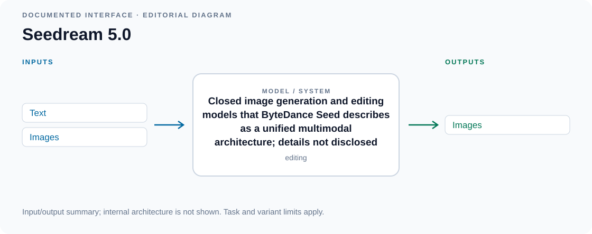

*Editorial input/output diagram · [Source](https://seed.bytedance.com/en/seedream5_0_lite)*

### SeFi-Image

SeFi-Image is a family of text-to-image foundation models (1B/2B/5B parameters) built around Semantic-First Diffusion (SFD), a latent diffusion paradigm that asynchronously denoises separate semantic and texture latent streams instead of a single latent. Semantic structure, encoded by a dedicated transformer-based Semantic VAE over DINOv2-Large features, is resolved ahead of pixel-level texture (encoded by a fine-tuned FLUX.2 texture VAE) via distinct per-stream timesteps, so texture generation always has a cleaner structural anchor; a FLUX.2-style double-/single-stream DiT conditioned on Qwen3-VL text embeddings predicts velocities for both latents jointly. The authors report the 5B model reaches quality comparable to or exceeding Qwen-Image and Z-Image using only 125K A800 GPU hours, roughly 10-20% of Z-Image's training compute, and release DMD2-distilled few-step turbo variants for lighter-weight deployment.

[Architecture and figure](../models/dit.md#sefi-image) · [Paper](https://arxiv.org/abs/2606.22568) · [GitHub](https://github.com/jmliu206/SeFi-Image)

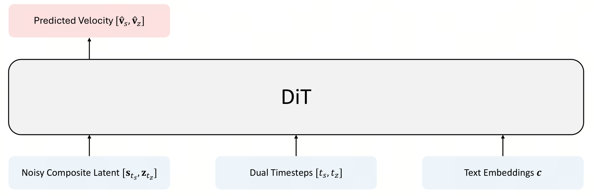

*Figure 7 · [Source](https://arxiv.org/abs/2606.22568)*

### Self-E

Self-E (Self-Evaluating Model) is presented as the first from-scratch, any-step text-to-image model: a single trained network that works across the full range of inference step counts, from ultra-fast few-step sampling to high-quality 50-step sampling, without pretrained-teacher distillation. It combines instantaneous local supervision (standard denoising loss) with a self-driven global matching objective in which the model evaluates and refines its own generated samples, unlike diffusion/flow-matching models that rely solely on local supervision or distillation methods that require a separate teacher. The authors report performance that improves monotonically with more inference steps while remaining competitive with state-of-the-art flow-matching models at 50 steps.

[Architecture and figure](../models/efficient.md#self-e) · [Paper](https://arxiv.org/abs/2512.22374) · GitHub: no author-linked repository found

*Figure 2 · [Source](https://arxiv.org/abs/2512.22374)*

### SenseNova-U1

SenseNova-U1, from SenseTime's OpenSenseNova team, is a native unified multimodal model built on NEO-unify that dispenses with both a pretrained vision encoder for understanding and a VAE for generation, arguing that these separate, differently-trained components are the structural reason understanding and generation remain loosely coupled in most unified models. Instead, a near-lossless visual interface uses lightweight convolutional patch encoding/decoding layers to work directly on raw pixels and words, and a native Mixture-of-Transformers backbone (sharing self-attention but with separate understanding and generation FFN experts) jointly trains next-token cross-entropy for text with pixel-space flow matching for images at a 32x compression ratio. Two variants launch on dense (8B) and MoE (30B-A3B) understanding backbones. The paper reports performance rivaling top-tier understanding-only VLMs while achieving strong any-to-image generation, complex infographic generation, image editing and interleaved vision-language generation, plus preliminary results in vision-language-action and world-model scenarios.

[Architecture and figure](../models/unified.md#sensenova-u1) · [Paper](https://arxiv.org/abs/2605.12500) · [GitHub](https://github.com/OpenSenseNova/SenseNova-U1) · [Model card](https://huggingface.co/sensenova/SenseNova-U1-8B-MoT)

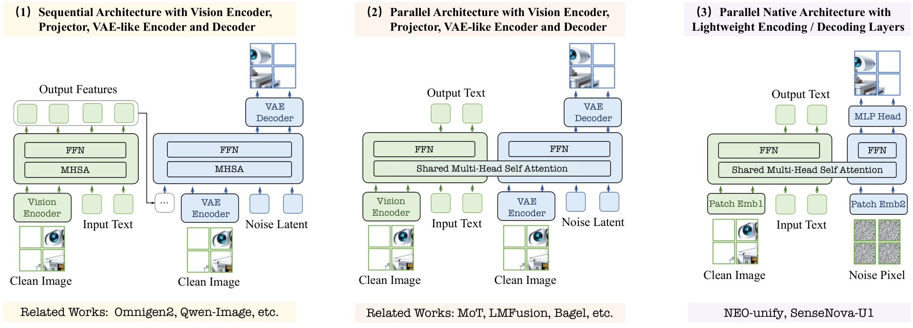

*Figure 4 · [Source](https://arxiv.org/abs/2605.12500)*

### Show-o

Show-o, from Show Lab (National University of Singapore) and ByteDance, unifies multimodal understanding and generation in one transformer. Text and images are both tokenized into discrete tokens; text is modeled autoregressively with causal attention, while image tokens are generated in parallel by iterative mask-token prediction with full attention inside the image. The same 1.3B model handles visual question answering and captioning, text-to-image generation, text-guided inpainting and extrapolation, and mixed-modality generation such as video keyframes with text descriptions.

[Architecture and figure](../models/unified.md#show-o) · [Paper](https://arxiv.org/abs/2408.12528) · [GitHub](https://github.com/showlab/Show-o) · [Model card](https://huggingface.co/showlab/show-o-512x512)

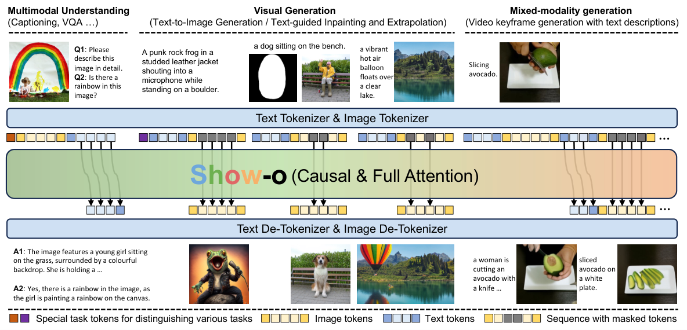

*Figure 2 · [Source](https://arxiv.org/abs/2408.12528)*

### Show-o2

Show-o2 is Show Lab's second-generation native unified multimodal model. Where Show-o predicted discrete image tokens with masked modeling, Show-o2 works in the continuous latent space of a 3D causal VAE, so the same model handles images and videos: a dual-path module fuses semantic features (SigLIP-distilled layers) and low-level projected latents into unified visual representations, and a language model with a language head and a flow head performs next-token prediction for text and flow matching for images and video. The paper reports multimodal understanding, text-to-image, text-to-video, image-to-video and mixed-modality (interleaved) generation, and a two-stage recipe that keeps the base LLM's language knowledge without a large text corpus.

[Architecture and figure](../models/unified.md#show-o2) · [Paper](https://arxiv.org/abs/2506.15564) · [GitHub](https://github.com/showlab/Show-o) · [Model card](https://huggingface.co/showlab/show-o2-7B)

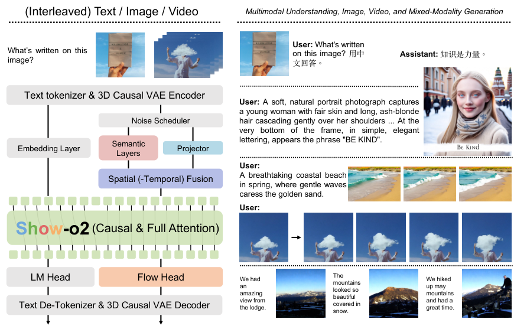

*Figure 1 · [Source](https://arxiv.org/abs/2506.15564)*

### SimpleAR

SimpleAR (2025) is a deliberately plain autoregressive text-to-image baseline: a Qwen-architecture decoder-only transformer predicts discrete Cosmos-Tokenizer image tokens after text tokens with no bespoke visual modules, and the authors show that adding supervised fine-tuning on curated data and a GRPO reinforcement-learning stage with CLIP-based rewards lets a 0.5-1.5B model reach competitive GenEval and DPG scores, while vLLM serving makes 1024px sampling practical in seconds.

[Architecture and figure](../models/ar-token.md#simplear) · [Paper](https://arxiv.org/abs/2504.11455) · [GitHub](https://github.com/wdrink/SimpleAR)

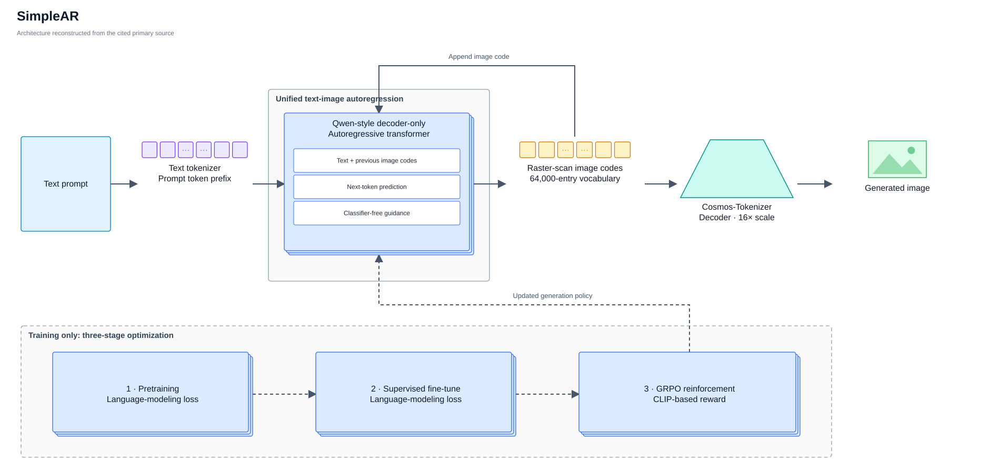

*Source-based architecture diagram · [Source](https://arxiv.org/abs/2504.11455)*

### Skywork UniPic

Skywork UniPic is a 1.5B-parameter unified autoregressive model from Skywork AI that supports image understanding, text-to-image generation and instruction-based image editing without task-specific adapters. Unlike Harmon, which shares one MAR encoder for both generation and understanding, UniPic decouples the two: a MAR encoder-decoder pair handles pixel-level generation while a separate SigLIP2 encoder handles semantic understanding, both routed through one shared language model. The paper reports 0.86 on GenEval, 85.5 on DPG-Bench, and 5.83/3.49 on GEditBench-EN/ImgEdit-Bench for editing, generating 1024x1024 images in under 15 GB of GPU memory, with roughly one-tenth the parameters of comparable unified models such as BAGEL.

[Architecture and figure](../models/unified.md#skywork-unipic) · [Paper](https://arxiv.org/abs/2508.03320) · [GitHub](https://github.com/SkyworkAI/UniPic) · [Model card](https://huggingface.co/Skywork/Skywork-UniPic-1.5B)

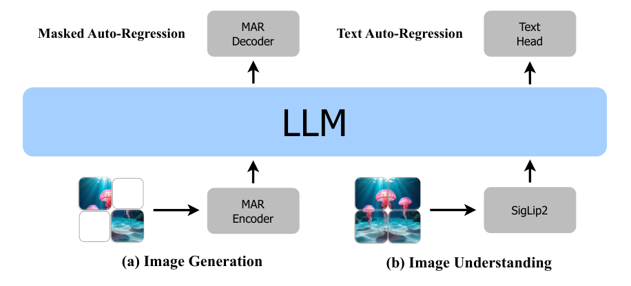

*Figure 2 · [Source](https://arxiv.org/abs/2508.03320)*

### Skywork UniPic 2.0

Skywork UniPic 2.0 (Skywork AI) is a follow-up to the autoregressive Skywork UniPic that switches to a diffusion generator. UniPic2-SD3.5M-Kontext is a 2B model based on SD3.5-Medium that is retrained on text-to-image and editing data, with reference-image latents injected into the DiT's self-attention sequence so one model handles both tasks. It is then post-trained with Progressive Dual-Task Reinforcement, which reinforces editing first and text-to-image second with GRPO and avoids cross-task interference. UniPic2-MetaQuery then connects the Kontext model to a frozen Qwen2.5-VL-7B through learnable queries and a connector, giving a unified model for understanding, generation and editing. The report gives GenEval 0.89 for the 2B Kontext model and 0.90 for UniPic2-MetaQuery.

[Architecture and figure](../models/unified.md#skywork-unipic-2) · [Paper](https://arxiv.org/abs/2509.04548) · [GitHub](https://github.com/SkyworkAI/UniPic/tree/main/UniPic-2) · [Model card](https://huggingface.co/Skywork/UniPic2-Metaquery-9B) · [Project](https://unipic-v2.github.io)

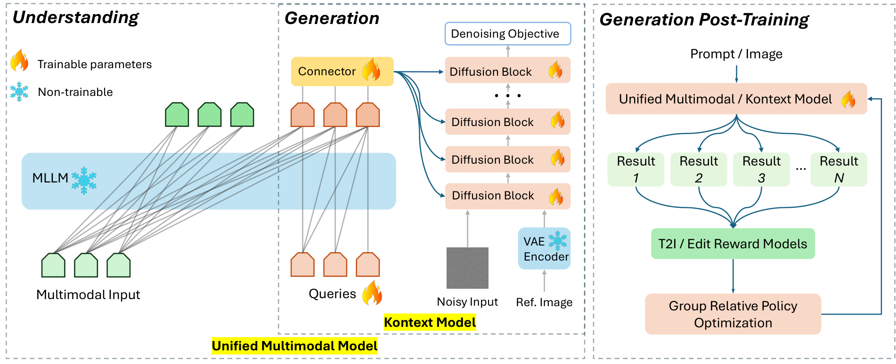

*Figure 2 · [Source](https://arxiv.org/abs/2509.04548)*

### SnapFusion

SnapFusion (Snap Inc. and Northeastern University, 2023) runs text-to-image diffusion on a phone in under two seconds for a 512×512 image. Starting from Stable Diffusion v1.5, it searches for a faster U-Net by robust training with stochastic block skipping followed by architecture evolving that removes or adds cross-attention and ResNet blocks according to their measured on-device latency and effect on quality. The VAE decoder is shrunk by 50% channel pruning and distilled from the original decoder. Step distillation in v-prediction, with a loss that applies classifier-free guidance to teacher and student, brings sampling down to eight steps, and the paper reports better FID and CLIP scores than SD v1.5 with 50 steps on MS-COCO.

[Architecture and figure](../models/efficient.md#snapfusion) · [Paper](https://arxiv.org/abs/2306.00980) · [GitHub](https://github.com/snap-research/SnapFusion) · [Project](https://snap-research.github.io/SnapFusion)

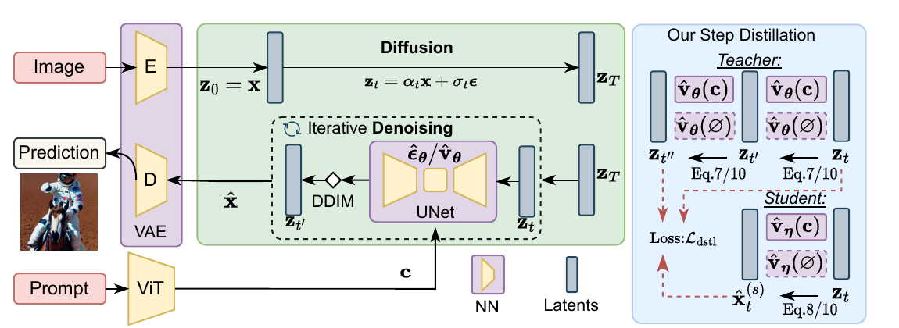

*Figure 3 (PDF p. 4) · [Source](https://arxiv.org/abs/2306.00980)*

### SnapGen

SnapGen (Snap Inc. with the University of Melbourne, HKUST and MBZUAI, 2024) is a small text-to-image model that generates 1024×1024 images on an iPhone 16 Pro Max in about 1.4 seconds. Instead of compressing an existing model, it designs a new UNet starting from a thinned SDXL layout: self-attention only at the lowest resolution, expanded separable convolutions, a narrower feed-forward ratio, multi-query attention with QK RMSNorm and RoPE, and conditioning inserted from the first stage. A decoder 35.9× smaller than the SD3/SDXL decoder makes high-resolution decoding feasible on the phone. The model is trained with flow matching so that it can learn from SD3.5-Large through output- and feature-level distillation with timestep-aware loss scaling, and is then distilled to a few steps with an adversarial objective whose discriminator uses SD3.5-Large-Turbo features.

[Architecture and figure](../models/efficient.md#snapgen) · [Paper](https://arxiv.org/abs/2412.09619) · [Project](https://snap-research.github.io/snapgen) · GitHub: no author-linked repository found

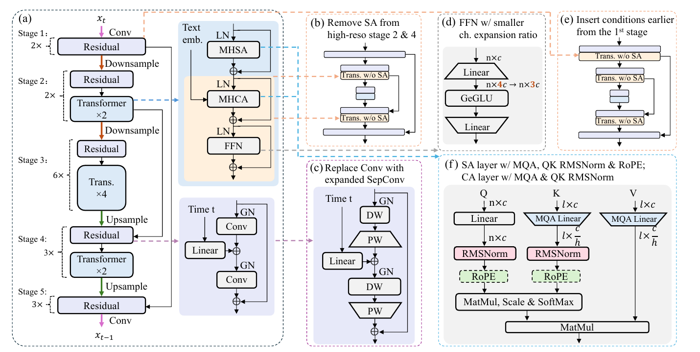

*Figure 2 (PDF p. 4) · [Source](https://arxiv.org/abs/2412.09619)*

### SSD-1B

SSD-1B (Segmind with Hugging Face, 2024) is a compressed version of SDXL. Following BK-SDM, it removes redundant parts of the SDXL U-Net, but at a finer grain: individual transformer blocks inside the attention layers, the mid-block's attention layers and its second residual block. The pruned network is retrained to imitate the teacher's noise prediction and the features of every attention and ResNet layer, with the teacher switched in succession from SDXL base to the fine-tuned ZavyChromaXL and JuggernautXL. SSD-1B has a 1.3B-parameter U-Net, about half of SDXL's, and the smaller Segmind-Vega has 0.74B; the report cites up to 60% and 100% speedups, respectively, at the same step count.

[Architecture and figure](../models/efficient.md#ssd-1b) · [Paper](https://arxiv.org/abs/2401.02677) · [GitHub](https://github.com/segmind/SSD-1B) · [Model card 1](https://huggingface.co/segmind/SSD-1B) · [Model card 2](https://huggingface.co/segmind/Segmind-Vega)

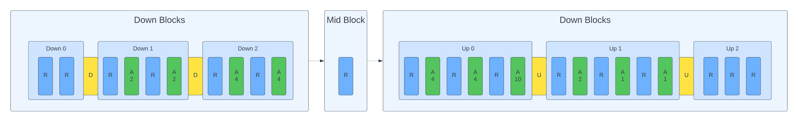

*Figure 2 · [Source](https://arxiv.org/abs/2401.02677)*

### Stable Diffusion 3

Stable Diffusion 3 is Stability AI's third-generation text-to-image family and the paper that introduced the MM-DiT backbone. Instead of injecting text through cross-attention, it treats text and image latents as two token streams with their own weights that meet in a shared attention operation, trained with a rectified-flow objective and a noise-schedule sampling that favours intermediate timesteps. Three frozen text encoders (two CLIP models and T5-XXL) provide both a pooled vector for modulation and a token sequence for the joint attention. The architecture was scaled to 8B parameters in the paper and released as SD3 Medium and later as the SD3.5 Large, Large Turbo and Medium checkpoints.

[Architecture and figure](../models/dit.md#stable-diffusion-3) · [Paper](https://arxiv.org/abs/2403.03206) · [Announcement 1](https://stability.ai/news/stable-diffusion-3) · [Announcement 2](https://stability.ai/news/introducing-stable-diffusion-3-5) · [GitHub](https://github.com/Stability-AI/sd3.5) · [Model card](https://huggingface.co/stabilityai/stable-diffusion-3.5-medium)

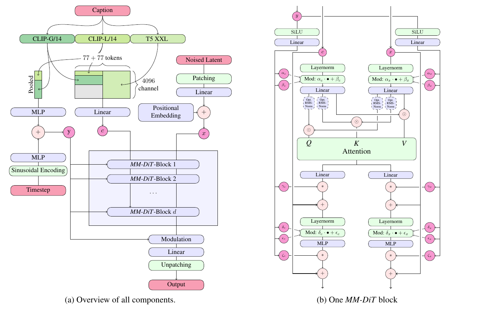

*Figure 2 (PDF p. 5) · [Source](https://arxiv.org/abs/2403.03206)*

### STAR

STAR (2024) adapts VAR-style next-scale autoregressive image generation to open-domain text-to-image synthesis, adding text cross-attention at every scale and a normalized rotary position encoding so the same positional scheme works across the growing token-map resolutions of scale-wise generation, reaching 1024px outputs in about 2.2 seconds.

[Architecture and figure](../models/ar-token.md#star-t2i) · [Paper](https://arxiv.org/abs/2406.10797) · [GitHub](https://github.com/Davinci-XLab/STAR-T2I) · [Model card](https://huggingface.co/taocrayon/STAR)

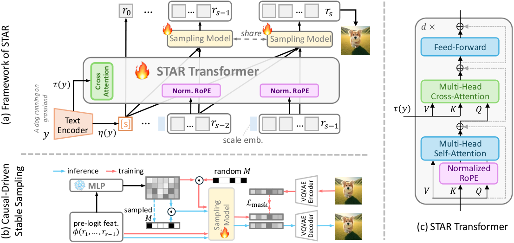

*Figure 4 · [Source](https://arxiv.org/abs/2406.10797)*

### STARFlow

STARFlow (Apple) shows that normalizing flows can scale to high-resolution text-to-image generation. The model is a single invertible flow trained by exact maximum likelihood on continuous autoencoder latents, without quantization or iterative denoising. Each flow block is an autoregressive transformer; almost all capacity sits in one deep block that behaves like a Gaussian language model over latent tokens and is the only block that sees the caption, while a few cheap shallow blocks refine local detail. Sampling runs the deep block autoregressively from Gaussian noise, then the shallow blocks, and a decoder fine-tuned on noise-injected latents maps the result to pixels. A revised classifier-free guidance algorithm for autoregressive flows improves quality at high guidance weights. The text-to-image model has 3.8B parameters and supports variable aspect ratios.

[Architecture and figure](../models/continuous-ar.md#starflow) · [Paper](https://arxiv.org/abs/2506.06276) · [GitHub](https://github.com/apple-aiml-research/ml-starflow) · [Model card](https://huggingface.co/apple/starflow)

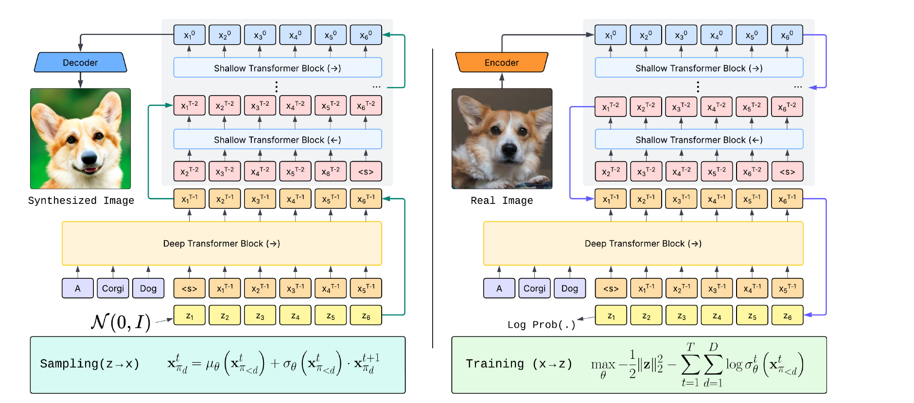

*Figure 4 (PDF p. 5) · [Source](https://arxiv.org/abs/2506.06276)*

### STARFlow2

STARFlow2, from Apple, unifies multimodal understanding and text-to-image generation by observing that autoregressive normalizing flows (TARFlow-style models) share the same causal-mask, KV-cache and left-to-right structure as language-model transformers, making them a natural fit for unifying continuous image generation with discrete text generation in one purely causal, single-pass model, unlike diffusion-based unified models. Its Pretzel architecture vertically interleaves a pretrained, largely frozen VLM stream with a TARFlow stream that operates on continuous latents from a Feature Auto-Encoder (FAE) trained on DINOv2 features; the two streams exchange information through zero-initialized residual skip connections so training starts from the pretrained VLM and flow behaviors and gradually learns cross-modal corrections. A three-stage training pipeline first trains the flow for text-to-image generation with the VLM frozen, then aligns the visual adapter for image-to-text understanding, and finally activates the vertical skip connections to jointly optimize understanding, generation, editing and interleaved generation. STARFlow2 reports 0.82 on GenEval and 84.14 on DPG-Bench for text-to-image generation.

[Architecture and figure](../models/unified.md#starflow2) · [Paper](https://arxiv.org/abs/2605.08029) · [GitHub](https://github.com/apple/ml-starflow)

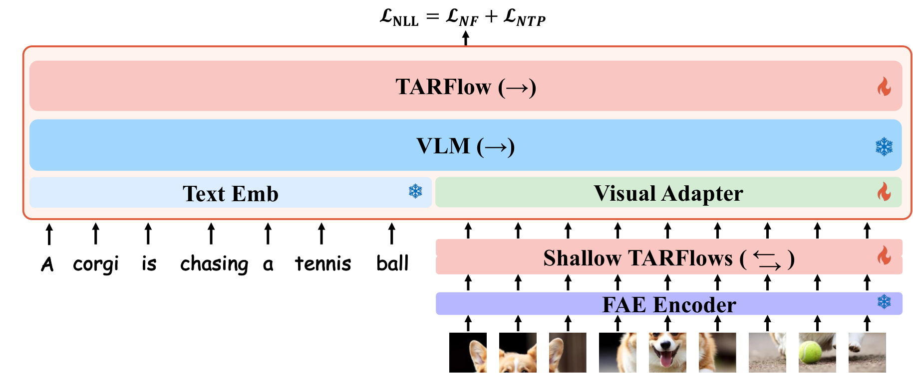

*Figure 2 · [Source](https://arxiv.org/abs/2605.08029)*

### SVG-T2I

SVG-T2I scales the SVG (Self-supervised representations for Visual Generation) framework to full text-to-image synthesis, training a diffusion transformer entirely within a visual-foundation-model (DINOv3) feature space rather than a traditional VAE latent space. The authors argue this validates the representational power of self-supervised visual features for generative modeling, and release the complete stack — autoencoder, generation model, training, inference and evaluation pipelines, and pretrained weights — reaching competitive GenEval and DPG-Bench scores.

[Architecture and figure](../models/dit.md#svg-t2i) · [Paper](https://arxiv.org/abs/2512.11749) · [GitHub](https://github.com/KlingTeam/SVG-T2I)

*Figure 2 · [Source](https://arxiv.org/abs/2512.11749)*

### Swift-Image

Swift-Image studies how far a small, compute-constrained unified generator can be pushed through training engineering rather than scale. Its 6B single-stream diffusion transformer is conditioned on a Qwen3-VL encoder and a FLUX.2 autoencoder, trained with a progressive pipeline that grows from broad semantic coverage to high-resolution, unified generation-and-editing supervision, then post-trained with parallel expert reinforcement learning and multi-teacher on-policy distillation. A separate Prompt Enhancer model handles reasoning about user intent so the diffusion transformer can focus on rendering, and structural pruning plus few-step distillation give compressed 3B and low-step variants; the paper reports leading open-source aggregate performance at only 6B parameters and 243K GPU training hours.

[Architecture and figure](../models/dit.md#swift-image) · [Paper](https://arxiv.org/abs/2608.20334) · GitHub: no author-linked repository found

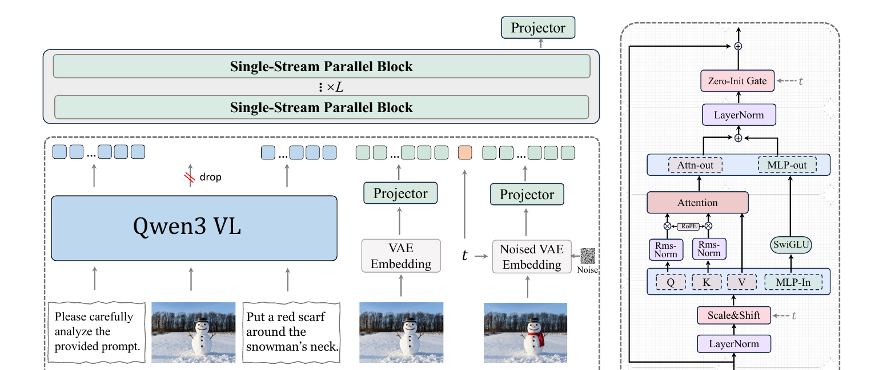

*Figure 5 (PDF p. 6) · [Source](https://arxiv.org/abs/2608.20334)*

### SwiftBrush

SwiftBrush (VinAI Research, 2023) distills Stable Diffusion 2.1 into a one-step text-to-image generator without any training images. It borrows Variational Score Distillation from text-to-3D generation (ProlificDreamer): the student turns noise and a prompt into an image, the image is re-noised, and the student is updated with the difference between the frozen teacher's noise prediction and that of a LoRA teacher that is trained alternately to model the student's output distribution. Only text prompts are needed. SwiftBrush v2 (2024) initializes the student from SD Turbo, adds a clamped CLIP loss for text alignment, trains full and LoRA versions and merges them by weight interpolation, and reports a one-step student that surpasses its SD 2.1 teacher on zero-shot COCO FID.

[Architecture and figure](../models/efficient.md#swiftbrush) · [Paper 1](https://arxiv.org/abs/2312.05239) · [Paper 2](https://arxiv.org/abs/2408.14176) · [GitHub 1](https://github.com/VinAIResearch/SwiftBrush) · [GitHub 2](https://github.com/VinAIResearch/SwiftBrushV2)

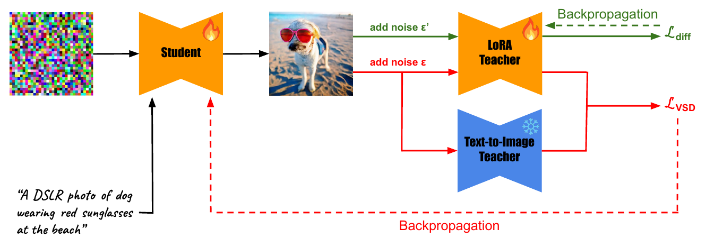

*Figure 2 (PDF p. 6) · [Source](https://arxiv.org/abs/2312.05239)*

### Switti

Switti (Yandex Research, 2024) is a scale-wise (VAR-style) autoregressive text-to-image transformer that drops causal attention across scales in favor of non-causal, scale-local attention, since it finds later scales already encode information from earlier ones through upsampling. Combined with disabling classifier-free guidance at the final high-resolution scales, this yields roughly 30% faster 1024px sampling than a causal scale-wise baseline with comparable or better quality.

[Architecture and figure](../models/ar-token.md#switti) · [Paper](https://arxiv.org/abs/2412.01819) · [GitHub](https://github.com/yandex-research/switti) · [Model card](https://huggingface.co/yresearch/Switti)

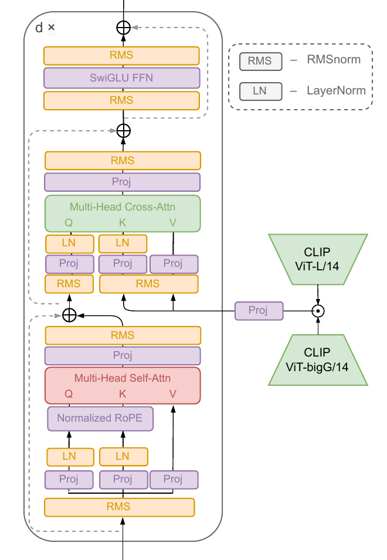

*Figure 2 (PDF p. 4) · [Source](https://arxiv.org/abs/2412.01819)*

### SynerGen-VL

SynerGen-VL, from a group including Tsinghua and SenseTime, is an encoder-free unified model: rather than using a separate vision encoder for understanding, it tokenizes images directly with a VQ tokenizer for both understanding and generation. To keep sequences short despite high-resolution images, a token-folding mechanism merges several adjacent discrete image tokens into one embedding before the transformer and unfolds them again afterward; a mixture of vision-specific expert feed-forward networks alongside the shared text FFN improves capacity for visual modeling without a separate vision backbone, and next-token prediction alone drives both image understanding and text-to-image generation.

[Architecture and figure](../models/unified.md#synergen-vl) · [Paper](https://arxiv.org/abs/2412.09604) · GitHub: no author-linked repository found

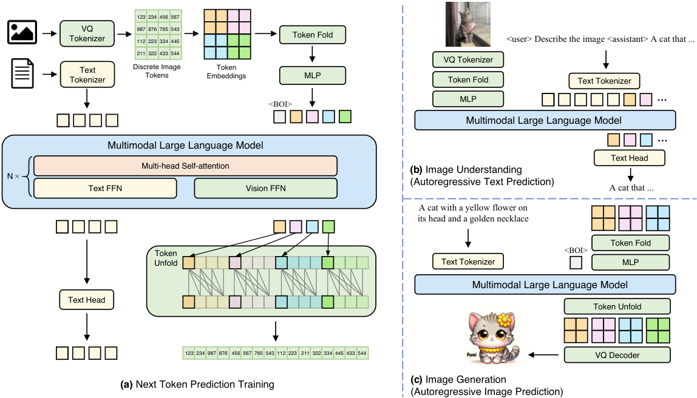

*Figure 3 · [Source](https://arxiv.org/abs/2412.09604)*

### Taiyi-Diffusion-XL

Taiyi-Diffusion-XL (Taiyi-XL) is a Chinese-English bilingual text-to-image model from IDEA-CCNL built by continued pre-training of Stable Diffusion XL. The team first extends an English CLIP model with the most frequently used Chinese characters in its tokenizer and embedding layers and with expanded absolute position encoding, trains it contrastively on bilingual data such as LAION and Wukong, and then swaps it in as SDXL's text encoder. The U-Net and text encoder are trained together at mixed 512×512 and 1024×1024 resolutions and aspect ratios on images re-captioned by a large vision-language model. The technical report shows gains over earlier Chinese and bilingual open models on COCO and COCO-CN, and the 3.5B checkpoint and training code are public.

[Architecture and figure](../models/latent-unet.md#taiyi-diffusion-xl) · [Paper](https://arxiv.org/abs/2401.14688) · [Model card](https://huggingface.co/IDEA-CCNL/Taiyi-Stable-Diffusion-XL-3.5B) · [GitHub](https://github.com/IDEA-CCNL/Taiyi-Diffusion-XL)

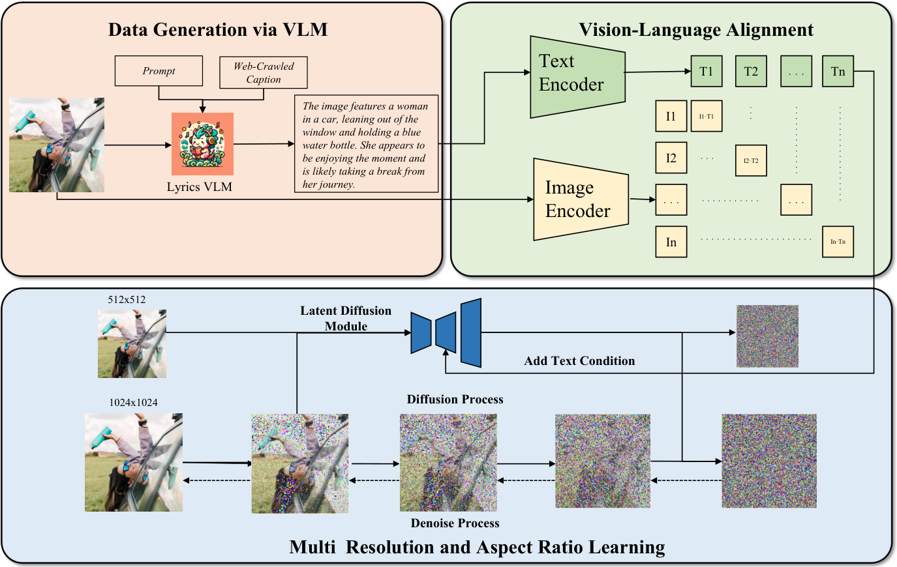

*Figure 2 · [Source](https://arxiv.org/abs/2401.14688)*

### Tar

Tar ("Vision as a Dialect") unifies visual understanding and generation by making images literally speak the LLM's language: its Text-Aligned Tokenizer (TA-Tok) converts images into discrete tokens from a codebook initialized from an LLM's text-embedding vocabulary and adapted to vision through learnable projections, so image and text tokens share one embedding space without modality-specific encoders. A single autoregressive multimodal LLM (built on Qwen2.5-Instruct) then predicts both text and text-aligned image tokens with one next-token objective, and a separate generative de-tokenizer (either an autoregressive LlamaGen-style model or a diffusion model built on SANA) decodes the predicted image tokens back into pixels. The paper reports competitive results on visual understanding and text-to-image generation benchmarks, plus emergent compositional abilities such as subject-driven generation and style transfer.

[Architecture and figure](../models/unified.md#tar) · [Paper](https://arxiv.org/abs/2506.18898) · [GitHub](https://github.com/csuhan/Tar) · [Model card](https://huggingface.co/csuhan/Tar-7B-v0.1)

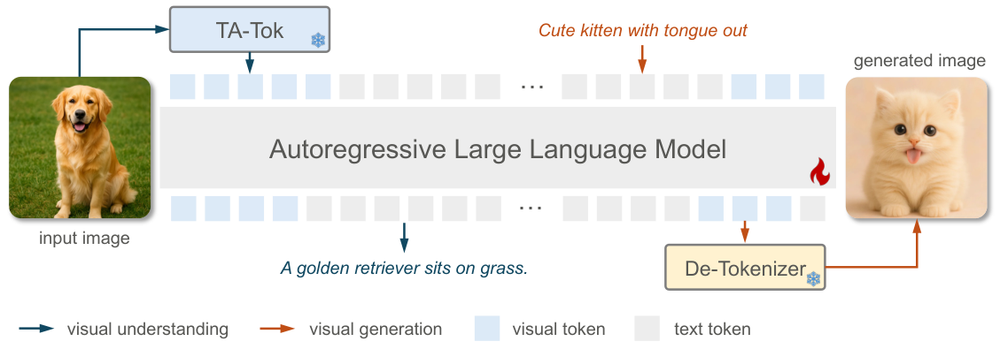

*Figure 2 · [Source](https://arxiv.org/abs/2506.18898)*

### TerraDiT

TerraDiT is a diffusion transformer trained from scratch for text-to-satellite-image synthesis, aimed at replacing the dense pixel-level layout maps used by prior remote-sensing generators with lightweight point queries. The base TerraDiT-XL/2-alpha model follows a SiT-style DiT design (28 blocks, hidden size 1152, patch size 2) conditioned on LongCLIP text embeddings of GPT-4o-generated satellite-image captions. A second variant, TerraDiT-XL/2-Sigma, adds an Adaptive Local Attention block that lets a small number of user-supplied point locations (with semantic tags) steer generation: a MetaRBF module turns each point into a spatial prior that multiplicatively regularizes the block's cross-attention map, giving spatial control without a dense conditioning map.

[Architecture and figure](../models/dit.md#terradit) · [Paper](https://arxiv.org/abs/2603.02172) · [GitHub](https://github.com/mvrl/TerraDiT)

*Figure 3 · [Source](https://arxiv.org/abs/2603.02172)*

### Text2Earth

Text2Earth (Beihang University, with NUS) is a text-driven remote sensing image generator trained on Git-10M, a global-scale dataset of 10.5 million remote-sensing image-text pairs that records resolution and geospatial metadata. The model is a latent diffusion system: a VAE compresses images, an OpenCLIP ViT-H encoder supplies text embeddings through cross-attention, and a denoising U-Net predicts noise. Its distinguishing mechanism is a resolution guidance module that projects the requested ground resolution into an embedding added to the timestep embedding, so users can specify the image resolution. A dynamic condition adaptation strategy randomly drops the text and resolution conditions in training and mixes conditional and null predictions at sampling, in the manner of classifier-free guidance. A second variant takes a masked image concatenated to the latent for text-driven editing, inpainting and iterative outpainting of unbounded scenes.

[Architecture and figure](../models/latent-unet.md#text2earth) · [Paper](https://arxiv.org/abs/2501.00895) · [GitHub](https://github.com/Chen-Yang-Liu/Text2Earth) · [Model card](https://huggingface.co/lcybuaa/Text2Earth) · [Project](https://chen-yang-liu.github.io/Text2Earth/)

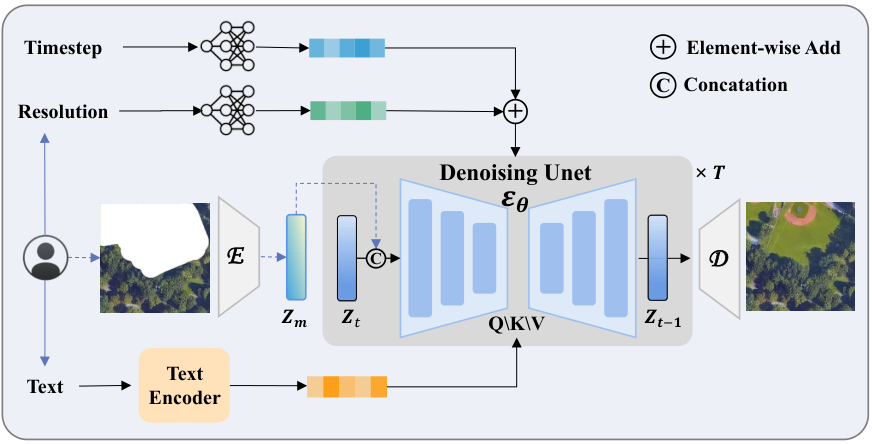

*Figure 7 · [Source](https://arxiv.org/abs/2501.00895)*

### Text2Scene

Text2Scene (CVPR 2019) generates scenes from text by predicting a sequence of objects and their attributes instead of synthesizing pixels with a GAN. At each step it attends to different words to decide what to add and where, producing clip-art scenes, object layouts, or photographic composites assembled from retrieved image segments; this makes the output interpretable object by object.

[Architecture and figure](../models/early.md#text2scene) · [Paper](https://arxiv.org/abs/1809.01110) · [GitHub](https://github.com/uvavision/Text2Scene)

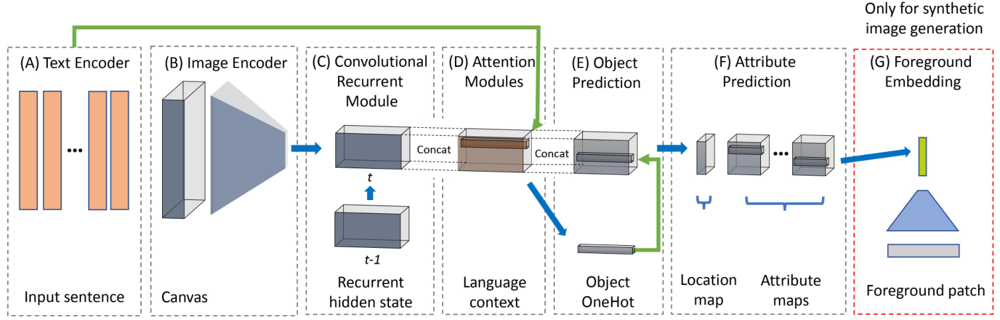

*Figure 2 · [Source](https://arxiv.org/abs/1809.01110)*

### TMDM-3B

This paper conducts a systematic, large-scale study of the design space of tri-modal (text, image, audio) masked diffusion models -- scaling laws, noise schedules and batch-size effects -- and trains a 3B-parameter model (the paper's Section 7.1 calls it the 'Unified 3B Tri-modal MDM') from scratch for 1M steps on 6.4T tokens as its main empirical vehicle. The model packs text, image-caption and audio-transcription sequences and denoises them with one bidirectional transformer under a shared masking schedule, supporting conditional generation across modalities including text-to-image generation, image captioning, text-to-speech and automatic speech recognition from a single set of weights.

[Architecture and figure](../models/unified.md#tmdm-3b) · [Paper](https://arxiv.org/abs/2602.21472) · GitHub: no author-linked repository found

*Figure 2 · [Source](https://arxiv.org/abs/2602.21472)*

### Transfusion

Transfusion is a training recipe from Meta, Waymo and USC for one multimodal model over discrete and continuous data. A single transformer, trained from scratch, predicts the next token for text and denoises continuous image patches with a diffusion loss in the same sequence, so no image quantization is needed. At inference the model samples text token by token and, on emitting a begin-of-image token, switches to diffusion mode to denoise a block of image patches before returning to text. The paper scales it to 7B parameters on 2T multimodal tokens and reports text-to-image generation, image captioning and text benchmarks from the same model.

[Architecture and figure](../models/unified.md#transfusion) · [Paper](https://arxiv.org/abs/2408.11039) · GitHub: no author-linked repository found

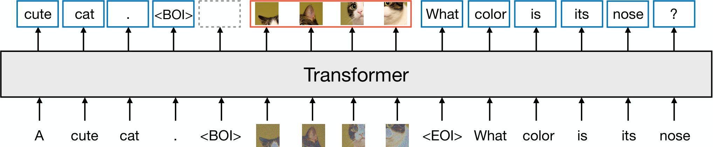

*Figure 1 · [Source](https://arxiv.org/abs/2408.11039)*

### Transition Matching (DTM, ARTM, FHTM)

Transition Matching (Weizmann Institute and FAIR at Meta, 2025) is a framework that unifies diffusion or flow models and continuous autoregressive generation by decomposing generation into a small number of Markov transitions with non-deterministic kernels. Difference Transition Matching (DTM) learns the transition probability between consecutive states with a backbone and a small flow head and converges to flow matching as the number of steps grows. Autoregressive Transition Matching (ARTM) and Full History Transition Matching (FHTM) apply the same idea to partially causal and fully causal token models, trained with an independent linear supervision process. The paper compares the variants with flow matching and MAR baselines under one architecture, data and hyper-parameter setting for text-to-image generation.

[Architecture and figure](../models/continuous-ar.md#transition-matching) · [Paper](https://arxiv.org/abs/2506.23589) · GitHub: no author-linked repository found

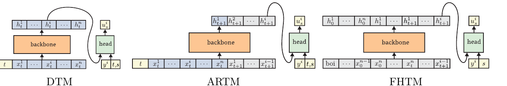

*Figure 5 (PDF p. 6) · [Source](https://arxiv.org/abs/2506.23589)*

### UFOGen

UFOGen (Google, 2023) is a one-step text-to-image model that combines diffusion models with a GAN objective. It builds on earlier diffusion-GAN hybrids (DDGAN, SIDDM), which learn large denoising steps adversarially, and modifies the generator parameterization and reconstruction term so that one forward pass from pure noise produces an image. For text-to-image generation, both the generator and the discriminator start from Stable Diffusion 1.5 weights and operate in its latent space, which the paper identifies as key to training a diffusion-GAN at web scale.

[Architecture and figure](../models/efficient.md#ufogen) · [Paper](https://arxiv.org/abs/2311.09257) · GitHub: no author-linked repository found

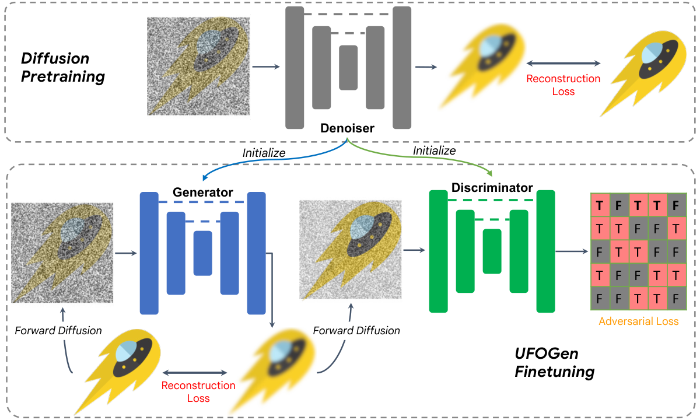

*Figure 3 · [Source](https://arxiv.org/abs/2311.09257)*

### UGen

UGen (Baidu) is a unified autoregressive model for text processing, image understanding and text-to-image generation that keeps the plain decoder-only design and changes how the vocabulary is trained. Text and images are converted to discrete tokens (an SBER-MoVQGAN with a 16,384-entry codebook and 8× compression for 256×256 images), and one transformer predicts all of them. Starting from a TinyLlama checkpoint, the new visual embeddings are initialized randomly. Because training with the full visual vocabulary hurts the other tasks, progressive vocabulary learning activates the visual token IDs in stages during training. The paper reports a 13.3% overall improvement over a vanilla unified autoregressive baseline and competitive results against task-specific models.

[Architecture and figure](../models/unified.md#ugen) · [Paper](https://arxiv.org/abs/2503.21193) · GitHub: no author-linked repository found

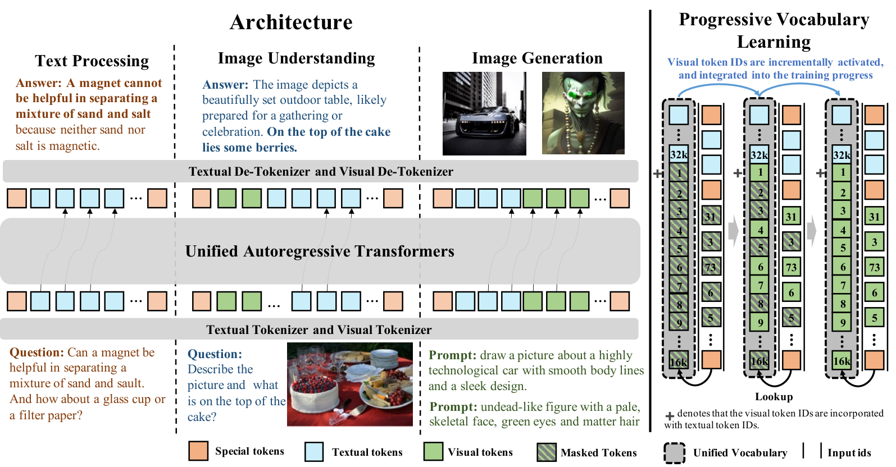

*Figure 2 · [Source](https://arxiv.org/abs/2503.21193)*

### UMT-BITG (Unifying Multimodal Transformer)

This ACM Multimedia 2021 paper from Sun Yat-sen University and Microsoft Research Asia trains one transformer for both image captioning and text-to-image generation. For generation it fills in a small grid of discrete visual cluster tokens by iterative masked prediction, then renders the grid with a GAN generator; a CLIP-based training loss improves text-image consistency over its predecessor X-LXMERT on MS-COCO.

[Architecture and figure](../models/masked.md#generate-it) · [Paper](https://arxiv.org/abs/2110.09753) · [GitHub](https://github.com/researchmm/generate-it)

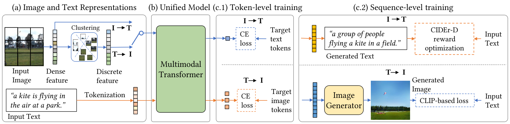

*Figure 2 · [Source](https://arxiv.org/abs/2110.09753)*

### UniAlignment

UniAlignment (UCAS, Institute of Automation CAS and Ant Group) unifies image generation, understanding, editing and perception in one diffusion transformer without an external vision-language model at inference. A dual-stream design lets the same DiT weights parameterize a continuous flow-matching process for images and a discrete masked-diffusion process for text, in the manner of DualDiffusion. Two training-only objectives address the conflict between the streams: a contrastive loss between the output embeddings of the image and text branches (cross-modal alignment) and a REPA-style loss that matches intermediate DiT features to embeddings from a pretrained vision-language encoder (intrinsic-modal alignment). The 2B model is trained in several stages and evaluated on GenEval, DPG-Bench, editing, understanding benchmarks and the new SemGen-Bench.

[Architecture and figure](../models/unified.md#unialignment) · [Paper](https://arxiv.org/abs/2509.23760) · GitHub: no author-linked repository found

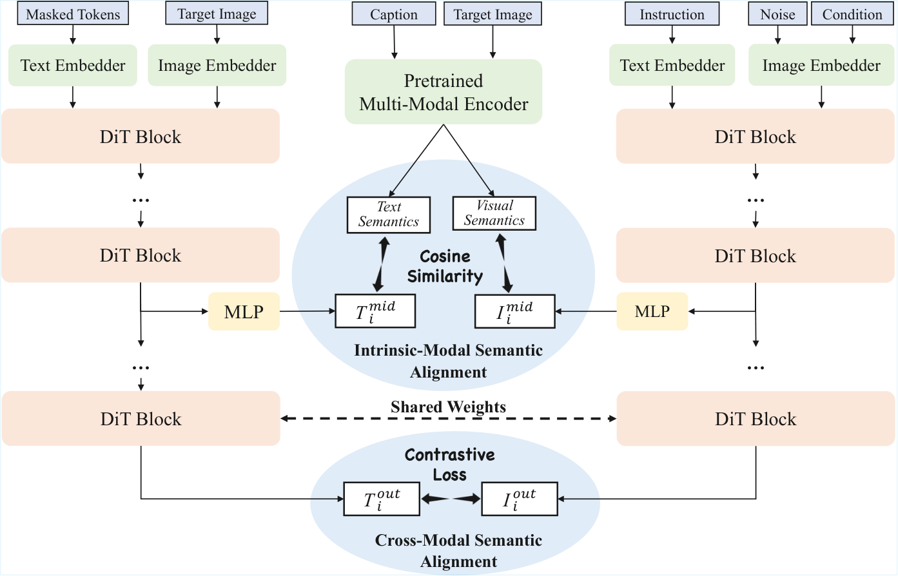

*Figure 3 · [Source](https://arxiv.org/abs/2509.23760)*

### UniCMs

UniCMs (Shanghai Jiao Tong University, Huawei and Tongji University) is a unified consistency model for efficient text-to-image generation and image-to-text understanding. The difficulty it addresses is that consistency distillation needs a denoising-style trajectory for every modality. The paper keeps discrete tokens for both: image tokens follow standard mask-based discrete diffusion, while the text trajectory is the parallel (Jacobi) decoding trace of an autoregressive language model, so text also becomes a sequence of progressively corrected tokens. Starting from Show-o's architecture and weights, the model is trained on trajectories collected from Show-o with a unified consistency objective, trajectory segmentation, trajectory regeneration in a second stage and a regularization term against trivial collapse. At 512 pixels it samples images in a few steps without classifier-free guidance and reports better GenEval, ImageReward and CLIP Score than SD3 at about one eighth of the sampling time, plus 1.5x faster long-text generation than Show-o.

[Architecture and figure](../models/unified.md#unicms) · [Paper](https://arxiv.org/abs/2502.05415) · [GitHub](https://github.com/zhijie-group/UniCMs) · [Model card](https://huggingface.co/SJTU-DENG-Lab/UniCMs-512)

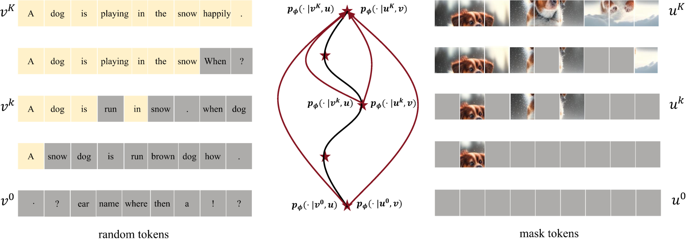

*Figure 2 · [Source](https://arxiv.org/abs/2502.05415)*

### UniDiffuser

UniDiffuser, from Tsinghua University, is a diffusion framework that fits every distribution relevant to paired image-text data (image, text, text-to-image, image-to-text and joint image-text generation) with one transformer. It generalizes standard diffusion by perturbing both image and text latents simultaneously and letting each modality carry its own timestep, so setting one modality's timestep to zero recovers ordinary conditional generation such as text-to-image, while other timestep choices give joint or unconditional generation, all without extra network overhead.

[Architecture and figure](../models/unified.md#unidiffuser) · [Paper](https://arxiv.org/abs/2303.06555) · [GitHub](https://github.com/thu-ml/unidiffuser) · [Model card](https://huggingface.co/thu-ml/unidiffuser-v1)

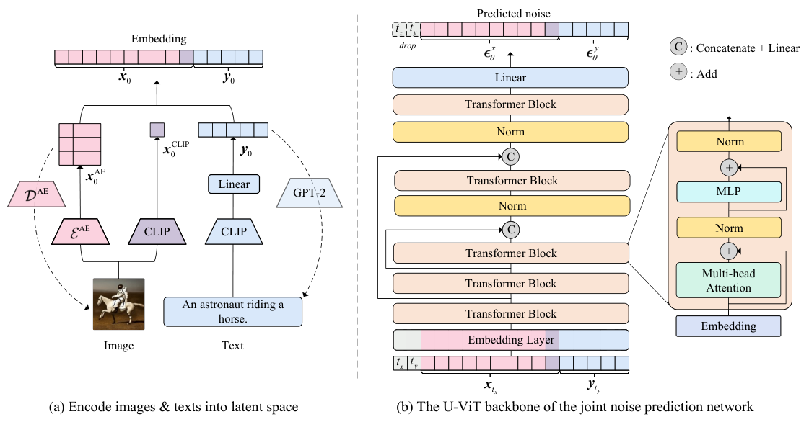

*Figure 4 · [Source](https://arxiv.org/abs/2303.06555)*

### UniDisc

UniDisc (Carnegie Mellon University) replaces the autoregressive objective of unified multimodal models with masked discrete diffusion over a joint text and image vocabulary. Text is tokenized with a Llama tokenizer and 256×256 images with a lookup-free-quantization tokenizer. A bidirectional transformer with 2D RoPE for image tokens, 1D RoPE for text and modality embeddings predicts masked tokens of both modalities, and classifier-free guidance comes from masking an entire modality during training. The same model generates an image from text, a caption from an image, or inpaints image and text jointly, and the authors compare it with a matched autoregressive baseline in scaling, FID/CLIP, inference-cost and reasoning tests.

[Architecture and figure](../models/unified.md#unidisc) · [Paper](https://arxiv.org/abs/2503.20853) · [GitHub](https://github.com/alexanderswerdlow/unidisc) · [Project](https://unidisc.github.io) · [Model card](https://huggingface.co/aswerdlow/unidisc_interleaved)

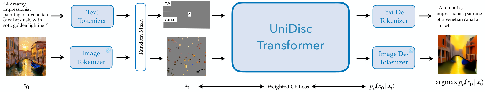

*Figure 2 · [Source](https://arxiv.org/abs/2503.20853)*

### Unified-IO

Unified-IO, from the Allen Institute for AI, is a sequence-to-sequence model that casts a large set of vision, language and multimodal tasks, including image generation, segmentation, depth estimation and captioning, as text-to-sequence problems over one shared vocabulary. Any task input or output that is not natively text (images, dense per-pixel maps, sparse structures) is converted into discrete tokens, so the same encoder-decoder transformer, trained jointly on over 90 datasets, can generate text or images depending on the requested task and prompt.

[Architecture and figure](../models/unified.md#unified-io) · [Paper](https://arxiv.org/abs/2206.08916) · [GitHub](https://github.com/allenai/unified-io-inference)

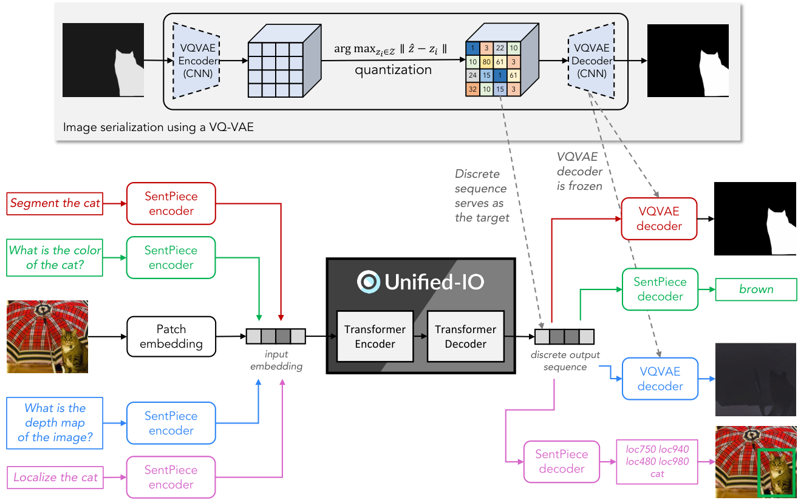

*Figure 2 · [Source](https://arxiv.org/abs/2206.08916)*

### Unified-IO 2

Unified-IO 2, from the Allen Institute for AI, is an autoregressive encoder-decoder model trained from scratch on text, images, audio and action with a single transformer. Every modality is converted into a sequence of discrete tokens in a shared vocabulary, so the same architecture can generate text, images or audio depending on the requested task, using a multimodal mixture-of-denoisers objective across 120 finetuning datasets. Image generation is one of its documented tasks, alongside image editing, depth and surface-normal prediction, and captioning.

[Architecture and figure](../models/unified.md#unified-io-2) · [Paper](https://arxiv.org/abs/2312.17172) · [GitHub](https://github.com/allenai/unified-io-2)

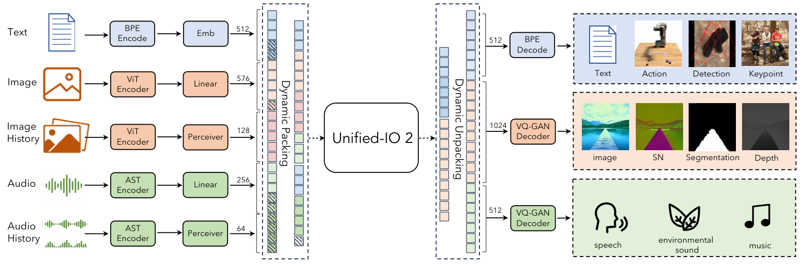

*Figure 2 · [Source](https://arxiv.org/abs/2312.17172)*

### UniFusion

UniFusion (Adobe Applied Research, 2025) conditions a diffusion transformer on a frozen vision-language model that encodes both text prompts and reference images, instead of using separate text and image encoders. A learnable Layerwise Attention Pooling (LAP) module, two transformer blocks followed by a fully connected layer, pools features from several VLM layers so that the DiT receives both high-level semantics and low-level detail. At inference the VLM can rewrite the user prompt in-model, and the DiT is conditioned only on the image and rewritten tokens (the paper's Verifi mechanism). The final model pairs an 8B DiT with an 8B VLM, was trained on about 830 million samples, and handles text-to-image generation, single-image editing and, zero-shot, multi-reference generation with one set of weights.

[Architecture and figure](../models/dit.md#unifusion) · [Paper](https://arxiv.org/abs/2510.12789) · [Project](https://thekevinli.github.io/unifusion/) · GitHub: no author-linked repository found

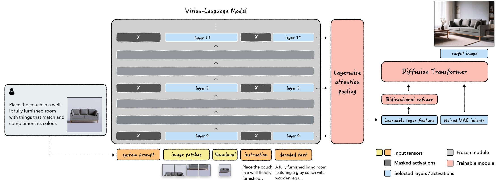

*Figure 4 · [Source](https://arxiv.org/abs/2510.12789)*

### UniGen-1.5

UniGen-1.5 (Apple and Fudan University, 2025) extends the earlier UniGen unified model to image editing while keeping one 7B LLM for understanding, text-to-image generation and editing. Understanding uses continuous SigLIP2 features; generation uses MAGVITv2 discrete tokens at 384x384 that the LLM predicts as masked tokens over several decoding turns. For editing, the condition image enters as both semantic SigLIP2 features and low-level discrete tokens. The paper adds a unified reinforcement learning stage that uses shared reward models for generation and editing, and a short Edit Instruction Alignment stage before it. It reports 0.89 on GenEval, 86.83 on DPG-Bench and 4.31 on ImgEdit.

[Architecture and figure](../models/unified.md#unigen-1-5) · [Paper](https://arxiv.org/abs/2511.14760) · GitHub: no author-linked repository found

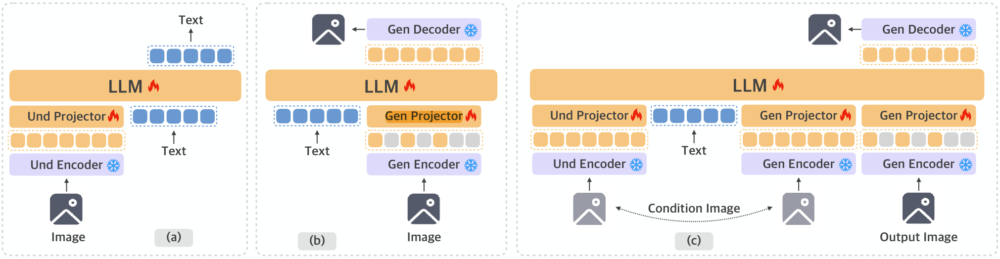

*Figure 2 · [Source](https://arxiv.org/abs/2511.14760)*

### UniGen-AR

UniGen-AR (Carnegie Mellon University, UIUC and Toyota Research Institute) targets Unified Visual Generation — one model producing text-to-image generation, editing, restoration and perception outputs — while avoiding the inference latency of diffusion-based unified models. It pairs a general-purpose multimodal language model, which encodes instructions and control signals, with an efficient next-scale visual autoregressive decoder in the style of Infinity, combining MLLM-based conditioning flexibility with VAR's parallel-scale sampling efficiency. The paper reports up to 19x lower inference latency than diffusion-based unified baselines across more than 15 tasks spanning four task families.

[Architecture and figure](../models/ar-token.md#unigen-ar) · [Paper](https://arxiv.org/abs/2607.24157) · [Project](https://zpbao.github.io/projects/unigenar) · GitHub: no author-linked repository found

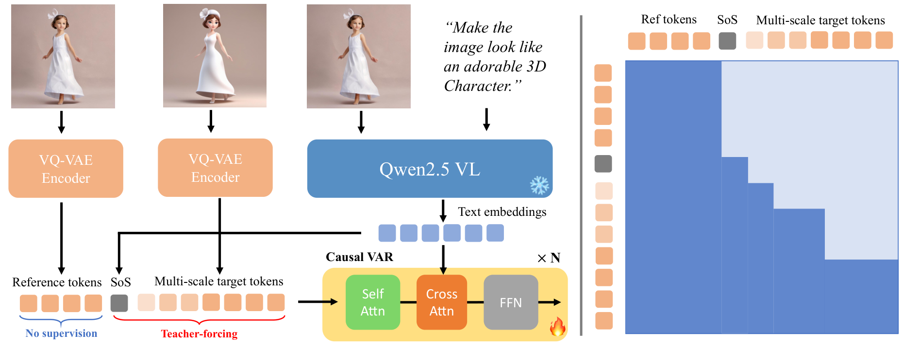

*Figure 2 · [Source](https://arxiv.org/abs/2607.24157)*

### UniModel

UniModel (TeleAI, China Telecom, 2025) proposes a visual-only way to unify image generation and understanding. Text prompts, captions and answers are rendered as images on a clean canvas, so every input and output is RGB pixels. For text-to-image generation the model takes the painted-text image as the condition and synthesizes an RGB image; for understanding it takes an RGB image and produces a painted-text image. Both directions share one MMDiT architecture, one rectified-flow loss and two learnable task embeddings, with input-output pairs swapped at random during training. The paper shows qualitative text-to-image and image-to-painted-text results and image-caption-image cycles, and states that direct quantitative comparison is not feasible because no other model accepts painted text as input.

[Architecture and figure](../models/dit.md#unimodel) · [Paper](https://arxiv.org/abs/2511.16917) · GitHub: no author-linked repository found

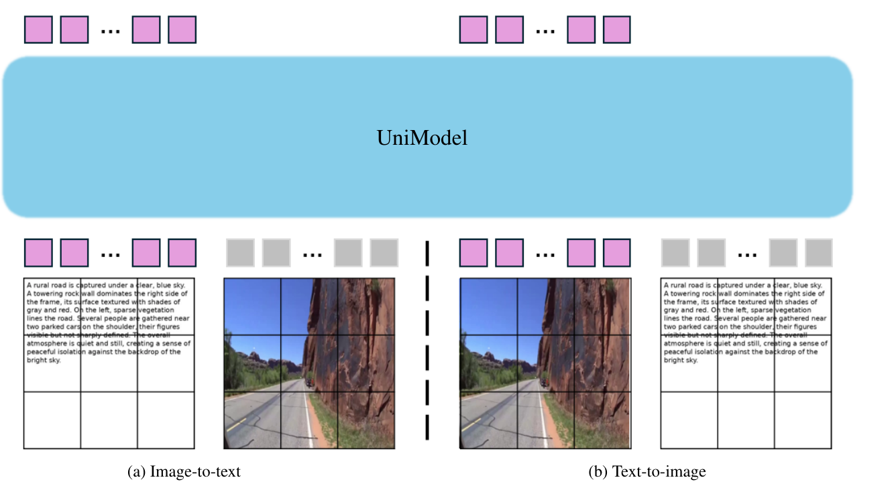

*Figure 2 (PDF p. 4) · [Source](https://arxiv.org/abs/2511.16917)*

### UniPath

UniPath (Fudan University, Fysics AI and collaborators, CVPR 2026) generates pathology images from text with Multi-Stream Control. A Raw-Text stream passes the prompt embedding; a High-Level Semantics stream appends learnable queries to the prompt in a frozen pathology MLLM and projects the final hidden states into paraphrase-robust Diagnostic Semantic Tokens, and the MLLM also expands prompts into diagnosis-aware attribute bundles; a Prototype stream retrieves component-level morphology prototypes from a bank (K_m = 16 per prompt) for finer control. The three condition sets are fused into one sequence for the DiT. The authors build a 2.65M image-text corpus with a 68K high-quality subset and a four-tier evaluation hierarchy, reporting a Patho-FID of 80.9.

[Architecture and figure](../models/dit.md#unipath) · [Paper](https://arxiv.org/abs/2512.21058) · [GitHub](https://github.com/Hanminghao/UniPath) · [Model card](https://huggingface.co/minghaofdu/UniPath-7B)

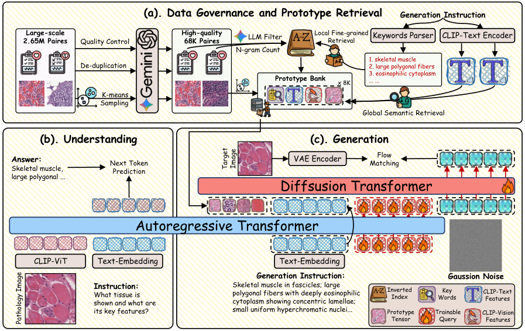

*Figure 2 · [Source](https://arxiv.org/abs/2512.21058)*

### UniSpace

UniSpace asks whether multimodal understanding, text-to-image generation and editing can share one visual representation built from a pretrained semantic ViT, instead of pairing a semantic encoder with a separate VAE for pixel-level generation. The authors show a frozen semantic ViT's blocks are not inherently unable to preserve fine detail — the original patch embedding is the bottleneck — and introduce Patch Reparameterization, adding a reconstruction-aware patch embedding alongside the original semantic one. This unified representation is scaled into UniSpace, an 8B Mixture-of-Transformer-Experts model that performs understanding, generation and editing without a separate VAE pathway.

[Architecture and figure](../models/unified.md#unispace) · [Paper](https://arxiv.org/abs/2608.08676) · [GitHub](https://github.com/yjb6/UniSpace)

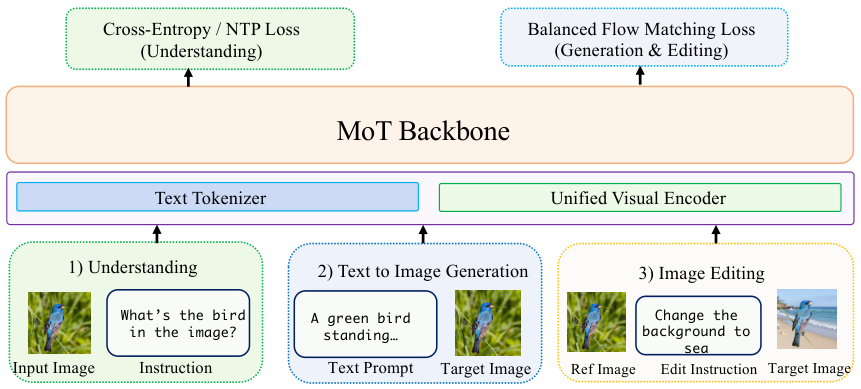

*Figure 3 · [Source](https://arxiv.org/abs/2608.08676)*

### UniVG

UniVG (Apple) is a generalist diffusion model that serves text-to-image generation, inpainting and outpainting, instruction-based editing, identity-preserving generation, layout-guided generation, depth estimation, pose estimation and referring segmentation with one set of weights. It keeps the MM-DiT design nearly unchanged: the noisy latent is concatenated along channels with the VAE latent of an input image and a resized mask, and other conditions such as layout or a face embedding replace placeholder tokens in the prompt embeddings. Training is progressive: text-to-image foundation training from scratch, multi-task training, then a separate stage for identity preservation to avoid forgetting. The paper studies data mixing and finds that editing and text-to-image can coexist without loss in text-to-image quality.

[Architecture and figure](../models/dit.md#univg) · [Paper](https://arxiv.org/abs/2503.12652) · GitHub: no author-linked repository found

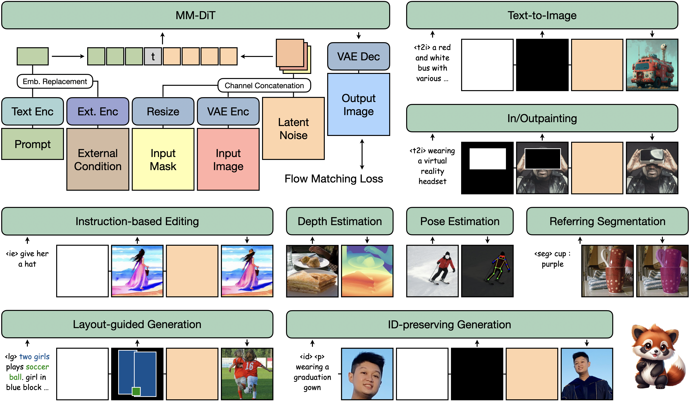

*Figure 2 · [Source](https://arxiv.org/abs/2503.12652)*

### UniWorld-Design

UniWorld-Design (Peking University and Rabbitpre AI) reframes image generation around semantic RGBA layers rather than flat pixels, so that generation, decomposition and editing operate on independently addressable, complete visual objects instead of a monolithic raster. It comprises two flow-matching models sharing an RGBA-extended autoencoder: Text-to-RGBA generates standalone transparent design assets directly from a prompt, and Image-to-Layer uses a new Layer-Instruction Binding MMDiT to decompose a finished image into an ordered stack of complete semantic RGBA layers, following instructions for top-level decomposition, recursive refinement, or targeted extraction of a specific element. The paper reports improvements over Qwen-Image-Layered on per-layer fidelity and transparency, and the highest CLIP Score among compared text-to-RGBA generators.

[Architecture and figure](../models/dit.md#uniworld-design) · [Paper](https://arxiv.org/abs/2608.03971) · [Project](https://rabbitvis.rabbitpre.com/blog) · GitHub: no author-linked repository found

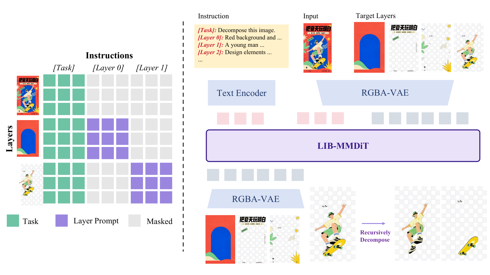

*Figure 3 · [Source](https://arxiv.org/abs/2608.03971)*

### UniWorld-V1

UniWorld-V1, from Peking University's Yuan group and collaborators, is a unified framework for image understanding, text-to-image generation, image manipulation and image perception tasks such as detection or segmentation rendered as images. Motivated by experiments suggesting that GPT-4o-Image relies on semantic encoders rather than VAEs, it conditions a FLUX diffusion transformer on features from a frozen multimodal LLM (high-level semantics) and from a SigLIP2 encoder (low-level control for reference images). Trained on only 2.7M samples, it is reported to be competitive with BAGEL on image editing benchmarks and scores 0.79 on GenEval.

[Architecture and figure](../models/unified.md#uniworld) · [Paper](https://arxiv.org/abs/2506.03147) · [GitHub](https://github.com/PKU-YuanGroup/UniWorld) · [Model card](https://huggingface.co/LanguageBind/UniWorld-V1)

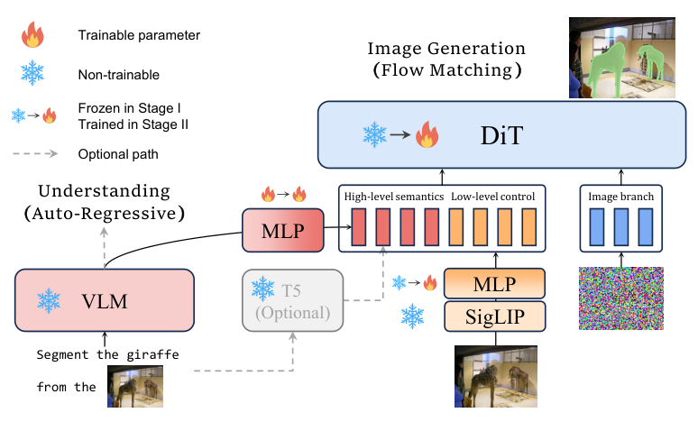

*Figure 3 · [Source](https://arxiv.org/abs/2506.03147)*

### VARGPT-v1.1

VARGPT-v1.1 (Peking University and CUHK) is a unified visual autoregressive model that understands images by next-token prediction and generates them by next-scale prediction in the style of VAR and Infinity. It upgrades the earlier VARGPT with a Qwen2-7B backbone, a multi-scale bitwise tokenizer with an infinite-vocabulary classifier, and an extra 2B visual decoder initialized from Infinity-2B. Training runs in stages: pretraining of the generation mapper, supervised fine-tuning at 256 and then 512 pixels, and iterative rounds of instruction tuning and direct preference optimization with 8.3M visual-generation instruction pairs. A further SFT on about 11K StyleBooth pairs gives image editing without architectural change. The paper reports results on multimodal understanding benchmarks and on GenEval and DPG-Bench.

[Architecture and figure](../models/unified.md#vargpt-v1-1) · [Paper](https://arxiv.org/abs/2504.02949) · [GitHub](https://github.com/VARGPT-family/VARGPT-v1.1) · [Model card](https://huggingface.co/VARGPT-family/VARGPT-v1.1) · [Project](https://vargpt1-1.github.io/)

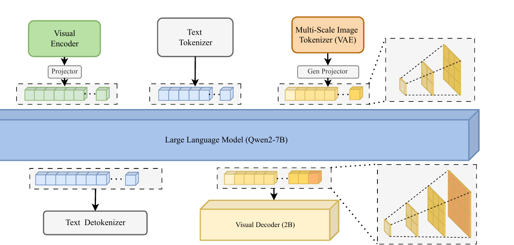

*Figure 4 (PDF p. 4) · [Source](https://arxiv.org/abs/2504.02949)*

### VILA-U

VILA-U, from Tsinghua, MIT, NVIDIA, UC Berkeley and UC San Diego, is a unified foundation model for video, image and language understanding and generation that uses a single next-token prediction framework without a diffusion model. Its unified vision tower discretizes SigLIP-based vision features with residual quantization and is trained with both image reconstruction and text-image contrastive losses, so the same discrete tokens serve perception and generation. The LLM predicts visual token positions autoregressively while a depth transformer predicts the stacked residual codes, and the RQ-VAE-style decoder turns them back into images or video frames.

[Architecture and figure](../models/unified.md#vila-u) · [Paper](https://arxiv.org/abs/2409.04429) · [GitHub](https://github.com/mit-han-lab/vila-u) · [Model card](https://huggingface.co/mit-han-lab/vila-u-7b-256)

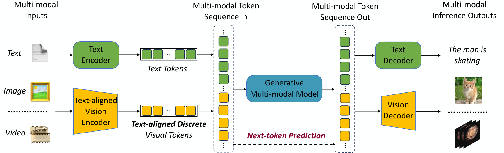

*Figure 1 · [Source](https://arxiv.org/abs/2409.04429)*

### VL-GPT

VL-GPT, from Xi'an Jiaotong University, Tencent AI Lab, ARC Lab (Tencent PCG) and HKU, is a generative pretrained transformer for vision-language understanding and generation. Its image tokenizer-detokenizer framework encodes an image into a short sequence of continuous visual embeddings and reconstructs it in pixel space; the embeddings are supervised to carry both image detail and caption semantics. These embeddings and text tokens form one multimodal sequence on which the LLM is trained to predict the next token or embedding, so generated embeddings can be decoded into images. The paper reports captioning, visual question answering, text-to-image generation and in-context multimodal tasks.

[Architecture and figure](../models/unified.md#vl-gpt) · [Paper](https://arxiv.org/abs/2312.09251) · [GitHub](https://github.com/AILab-CVC/VL-GPT)

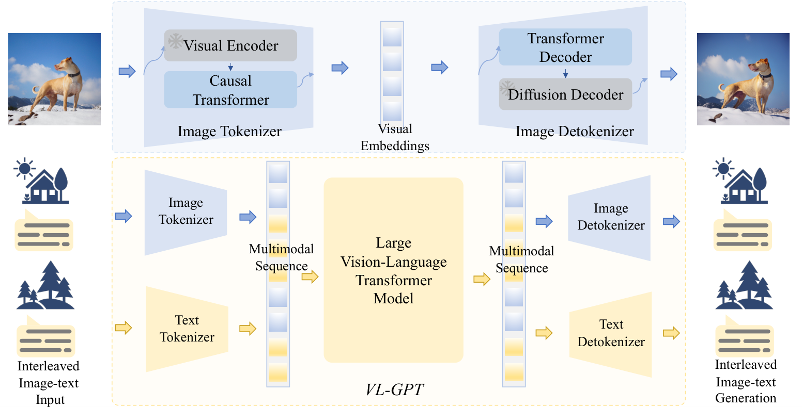

*Figure 1 · [Source](https://arxiv.org/abs/2312.09251)*

### VQ-Diffusion

VQ-Diffusion (Microsoft Research, 2021) applies denoising diffusion to the discrete token space of a VQ-VAE instead of continuous pixels or latents, using a mask-and-replace corruption process that makes corrupted positions explicit to a transformer denoiser conditioned on text through cross-attention. Because the model is trained to reconstruct tokens from partially masked or corrupted versions of an image, it supports text-guided local image editing as well as text-to-image generation, and the paper reports it avoids the unidirectional bias and error accumulation of autoregressive token models.

[Architecture and figure](../models/masked.md#vq-diffusion) · [Paper](https://arxiv.org/abs/2111.14822) · [GitHub](https://github.com/microsoft/VQ-Diffusion)

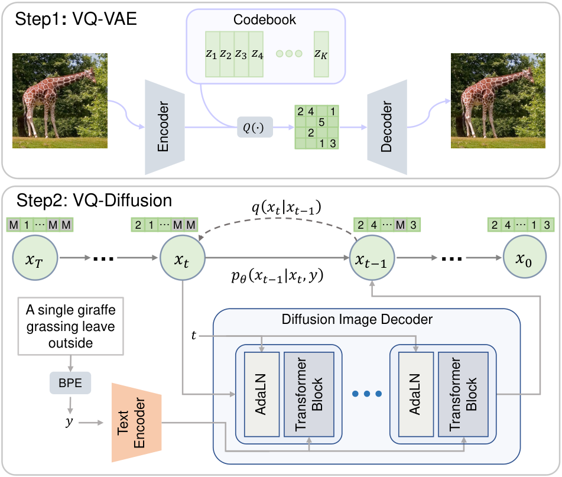

*Figure 1 · [Source](https://arxiv.org/abs/2111.14822)*

### VUGEN

VUGEN (Meta FAIR) gives a vision-language model image generation by working in the space of the VLM's own visual understanding features. A learned dimension reducer compresses the high-dimensional output of the VLM's understanding encoder into a low-dimensional, tractable latent while a pixel decoder is jointly trained to reconstruct the image from it. The VLM then gets a new image generation tower, a copy of its transformer weights, trained with rectified flow matching to sample in the reduced space conditioned on the text prompt, with the original tower frozen so understanding is unchanged. A pixel-space diffusion decoder, distilled to a single step, maps the generated features to images and is found on par with or better than a VAE-based latent diffusion decoder. The paper reports DPG-Bench 71.17 to 74.32 and COCO FID 11.86 to 9.06 against its baseline.

[Architecture and figure](../models/dit.md#vugen) · [Paper](https://arxiv.org/abs/2510.06529) · GitHub: no author-linked repository found

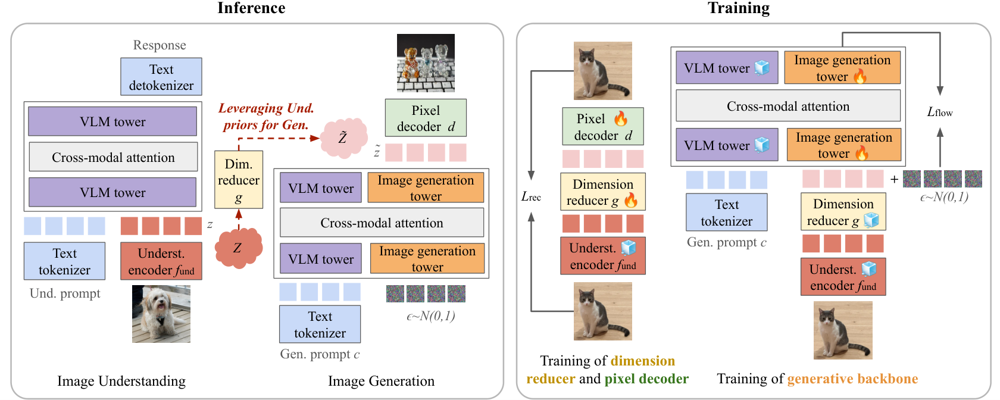

*Figure 1 · [Source](https://arxiv.org/abs/2510.06529)*

### X-Fusion

X-Fusion (UCLA, UW-Madison and Adobe Research) adds image understanding and generation to a pretrained LLM without changing its language weights. Each transformer layer has the frozen text block and a separate trainable vision block copied from it, and their outputs are merged per token according to modality. Images are encoded by the SD1.5 VAE, patchified and processed with a flow-matching loss in the style of Stable Diffusion 3, while text is trained with the usual next-token loss. The paper compares this dual-tower design with single-tower, gated-layer and dual-projection alternatives on LLaMA-3.2-1B and reports the best generation and understanding quality for the dual tower. It also studies data mix, noise in image-to-text samples and feature alignment, and shows editing, VQA and localization after fine-tuning.

[Architecture and figure](../models/unified.md#x-fusion) · [Paper](https://arxiv.org/abs/2504.20996) · [Project](https://sichengmo.github.io/XFusion/) · GitHub: no author-linked repository found

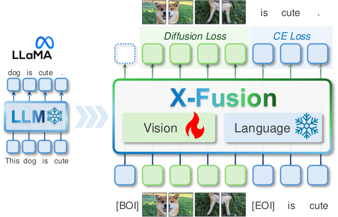

*Figure 1 · [Source](https://arxiv.org/abs/2504.20996)*

### X-LXMERT

X-LXMERT (AI2 and UNC Chapel Hill, EMNLP 2020) asks whether a bidirectional vision-language transformer built for understanding tasks (LXMERT) can also generate images. The authors discretize image regions into visual clusters and add masked visual-token training, so the resulting model can synthesize a coarse token grid from a caption via iterative mask-predict decoding, which a separate GAN-based generator converts into a full image, alongside LXMERT's original captioning and QA abilities.

[Architecture and figure](../models/masked.md#x-lxmert) · [Paper](https://arxiv.org/abs/2009.11278) · [GitHub](https://github.com/allenai/x-lxmert)

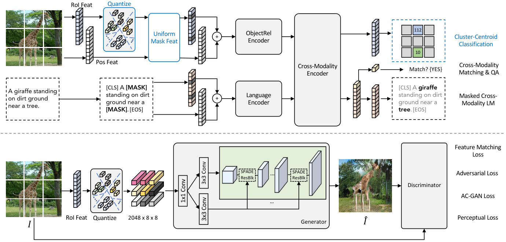

*Figure 1 · [Source](https://arxiv.org/abs/2009.11278)*

### X-Omni

X-Omni, from Tencent Hunyuan, argues that discrete autoregressive image generation can be competitive again when combined with reinforcement learning. One autoregressive model handles language and images as next-token prediction over text tokens and semantic image tokens from a frozen SigLIP-VQ tokenizer, and an offline diffusion decoder reconstructs pixels from the generated tokens. GRPO with a reward mix of human-preference, unified-reward, VLM-judged text-image alignment and OCR accuracy scores reduces the artifacts that come from the mismatch between generated tokens and the decoder. The paper reports strong instruction following and long-text rendering in English and Chinese, and introduces LongText-Bench.

[Architecture and figure](../models/unified.md#x-omni) · [Paper](https://arxiv.org/abs/2507.22058) · [GitHub](https://github.com/X-Omni-Team/X-Omni) · [Model card](https://huggingface.co/X-Omni/X-Omni-En)

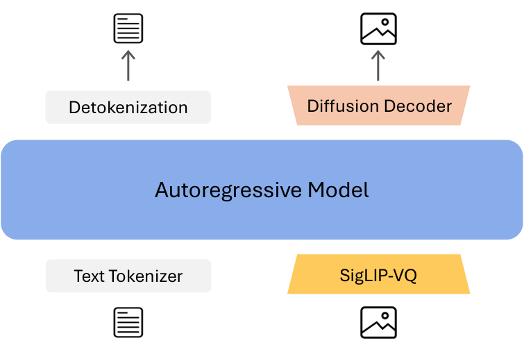

*Figure 3 · [Source](https://arxiv.org/abs/2507.22058)*

### Z-Image

Z-Image is Alibaba Tongyi's compact, 6.15B-parameter text-to-image foundation model built around a single-stream diffusion transformer (S3-DiT) rather than the dual-stream-then-single-stream designs common in comparable open DiTs. It conditions on a small Qwen3-4B language model for bilingual text understanding and reuses the FLUX VAE for image tokenization, aiming for strong quality and efficiency at a fraction of the parameter count of contemporaries. A distilled Z-Image-Turbo variant combines a decoupled distribution-matching distillation method with reinforcement learning to reach sub-second, 8-step generation on enterprise GPUs, while Z-Image-Edit extends the same backbone with a SigLIP-2 semantic encoder for reference-image editing. Code and both released checkpoints use the Apache-2.0 license.

[Architecture and figure](../models/dit.md#z-image) · [Paper](https://arxiv.org/abs/2511.22699) · [GitHub](https://github.com/Tongyi-MAI/Z-Image) · [Model card](https://huggingface.co/Tongyi-MAI/Z-Image-Turbo)

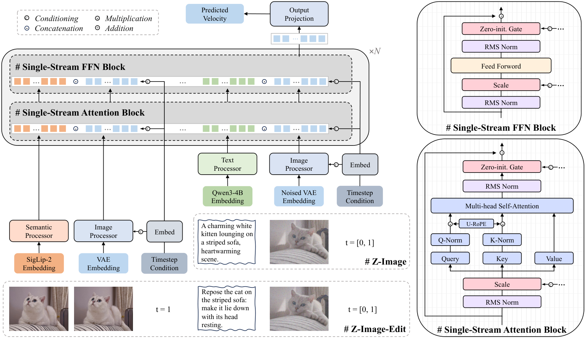

*Figure 10 · [Source](https://arxiv.org/abs/2511.22699)*

### Z-Image Turbo++

Z-Image Turbo++ pushes Z-Image Turbo's 8-step distilled sampling down to 2 steps. The authors identify that naive 2-step distillation suffers from increased task difficulty and limited capacity, and address this with three tailored choices: step-decoupled parameterization, which gives each of the two denoising steps its own set of weights (both initialized from the 8-step teacher) rather than sharing one network; distribution-aligned adversarial learning, which trains the GAN discriminator against teacher-generated images as the 'real' distribution instead of external photographs, giving the generator an achievable target; and end-to-end training with an explicit step-1 loss so gradients from final image quality reach the first step while keeping its intermediate output meaningful on its own. The combined recipe is reported to substantially narrow the quality gap between 2-step and 8-step generation.

[Architecture and figure](../models/efficient.md#z-image-turbo-pp) · [Paper](https://arxiv.org/abs/2606.12575) · GitHub: no author-linked repository found

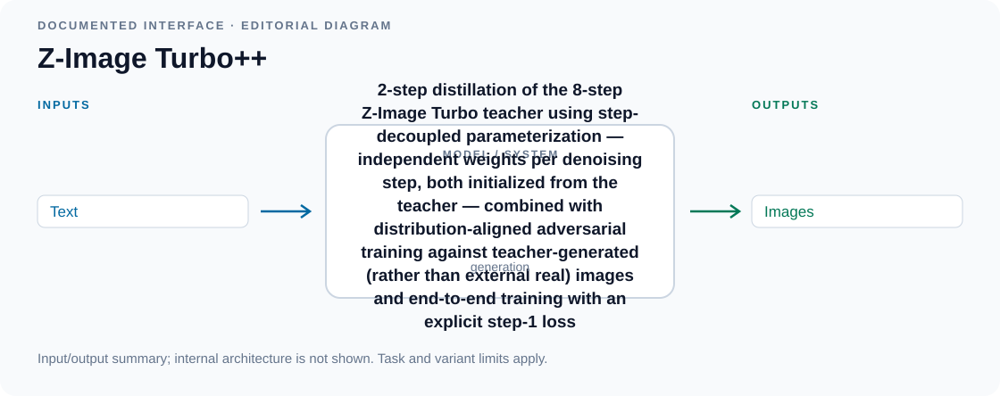

*Source-based architecture diagram · [Source](https://arxiv.org/abs/2606.12575)*
