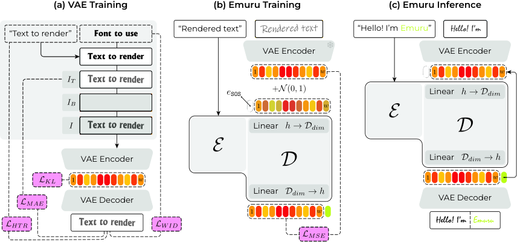

# arXiv text-to-image papers · Models from 2025 onward

<!-- Generated by scripts/catalog.py from data/t2i-arxiv-daily.json, data/models.json and data/figures.json. -->

[← Complete catalog](../README.md#models)

**124 model families · 124 papers · 92 new catalog entries · Reviewed 2026-09-29**

Screens all **4220 papers** returned by the pinned arXiv API query `(abs:"text-to-image" OR ti:"image generation" OR ti:"image synthesis") AND submittedDate:[202501010000 TO 202609292359]`, retrieved on 2026-09-29 (snapshot SHA-256 `d9bb13e3c0f2…`). Inclusion requires a text-to-image model, distinct generation architecture or named generation system whose paper was first submitted on or after **January 1, 2025**. A later revision of a 2024 paper does not qualify. Earlier entries and releases without an arXiv paper are covered by the complete catalog.

Datasets, benchmarks, guidance and control methods, personalization, editing-only methods, safety and concept erasure, acceleration techniques and methods without a distinct generation system are excluded. Closely related releases and renamed papers share a card. Descriptive names are used when a paper does not give its system a brand name.

Every family below has a description, a local image and paper links. **80** have author-linked GitHub sources; **44** have no author-linked repository found in the reviewed sources. A missing link is a review result, not a claim that no repository exists. **116** images come from primary sources; **8** are labeled editorial input/output diagrams.

Dates are first paper submission dates, not verified software release dates. Withdrawals and renamed papers are noted on the affected cards. [Full screening and repository evidence](../data/t2i-arxiv-daily.json) · [Figure credits](../assets/architectures/CREDITS.md).

Screening counts

| Decision | Papers |
| --- | ---: |
| Included | 124 |
| Component, guidance, control, personalization, editing, safety, acceleration or training method without a distinct generation system | 1839 |
| Dataset, benchmark, evaluation or analysis without a distinct text-to-image system | 773 |
| No distinct text-to-image system identified in the reviewed source | 5 |
| Image understanding, retrieval, video, 3D or application outside the text-to-image scope | 1157 |
| Not yet screened | 322 |

Model index

- [PSP-DiT](#psp-dit)
- [DuetGen](#duetgen)
- [FLAT](#flat)
- [Moonworks Lunara](#moonworks-lunara)
- [LLaDA-Image](#llada-image)
- [BIT (Bidirectional Image-Text Diffusion Bridges)](#bit)
- [Swift-Image](#swift-image)
- [Nexus](#nexus)
- [UniSpace](#unispace)
- [UniWorld-Design](#uniworld-design)
- [UniGen-AR](#unigen-ar)
- [Mage-Flow](#mage-flow)
- [Boogu-Image-0.1](#boogu-image)
- [Nemotron-Labs-Diffusion-Image](#nemotron-labs-diffusion-image)
- [Libra-2](#libra-2)
- [ILLUME-X](#illume-x)
- [Mural](#mural)
- [JuZhou 1.0](#juzhou-1)
- [SeFi-Image](#sefi-image)
- [Z-Image Turbo++](#z-image-turbo-pp)
- [i1](#i1)
- [ARM](#arm)
- [OmniGen-AR](#omnigen-ar)
- [BLM-SGAN](#blm-sgan)
- [Qwen-Image-Flash](#qwen-image-flash)
- [Cosmos 3](#cosmos3)
- [ERNIE-Image](#ernie-image)
- [CAR (Channel-wise Autoregressive)](#car)
- [Lens](#lens)
- [HiDream-O1-Image](#hidream-o1-image)
- [Normalizing Trajectory Models](#ntm)
- [JoyAI-Image](#joyai-image)
- [MMCORE](#mmcore)
- [Nucleus-Image](#nucleus-image)
- [GRN (Generative Refinement Networks)](#grn)
- [FlowInOne](#flowinone)
- [MMFace-DiT](#mmface-dit)
- [DreamLite](#dreamlite)
- [LaDe](#lade)
- [DREAM](#dream)
- [TerraDiT](#terradit)
- [LLaDA-o](#llada-o)
- [TMDM-3B](#tmdm-3b)
- [BitDance](#bitdance)
- [DeepGen 1.0](#deepgen-1)
- [DuoGen](#duogen)
- [LINA](#lina)
- [AR-Omni](#ar-omni)
- [Self-E](#self-e)
- [UniPath](#unipath)
- [PS-VAE](#ps-vae)
- [SVG-T2I](#svg-t2i)
- [LongCat-Image](#longcat-image)
- [Diffusion Fuzzy System (DFS)](#diffusion-fuzzy-system)
- [Ovis-Image](#ovis-image)
- [Z-Image](#z-image)
- [PixelDiT](#pixeldit)
- [ProxT2I](#proxt2i)
- [DeCo](#deco)
- [MammothModa2](#mammothmoda2)
- [UniModel](#unimodel)
- [UniGen-1.5](#unigen-1-5)
- [MoS (Mixture of States)](#mos)
- [oboro:](#oboro)
- [FIBO](#fibo)
- [InfinityStar](#infinitystar)
- [E-MMDiT (AMD Nitro-E)](#e-mmdit)
- [Emu3.5](#emu3-5)
- [LightFusion](#lightfusion)
- [BLIP3o-NEXT](#blip3o-next)
- [UniFusion](#unifusion)
- [VUGEN](#vugen)
- [Lumina-DiMOO](#lumina-dimoo)
- [Paris](#paris)
- [OneFlow](#oneflow)
- [Bridge](#bridge)
- [JEPA-T](#jepa-t)
- [Query-Kontext](#query-kontext)
- [UniAlignment](#unialignment)
- [Seedream 4.0](#seedream-4)
- [Lavida-O](#lavida-o)
- [Manzano](#manzano)
- [Home-made Diffusion Model (HDM)](#hdm)
- [Skywork UniPic 2.0](#skywork-unipic-2)
- [NextStep-1](#nextstep-1)
- [Skywork UniPic](#skywork-unipic)
- [Qwen-Image](#qwen-image)
- [PixNerd](#pixnerd)
- [X-Omni](#x-omni)
- [Lumina-mGPT 2.0](#lumina-mgpt-2)
- [MaskGIL](#maskgil)
- [NeoBabel](#neobabel)
- [DC-AR](#dc-ar)
- [B-cos Diffusion Models](#b-cos-diffusion)
- [Transition Matching (DTM, ARTM, FHTM)](#transition-matching)
- [Ovis-U1](#ovis-u1)
- [Instella-T2I](#instella-t2i)
- [OmniGen2](#omnigen2)
- [UniWorld-V1](#uniworld)
- [Muddit](#muddit)
- [HiDream-I1](#hidream-i1)
- [Hi-MAR](#hi-mar)
- [PAR (Panoramic AutoRegressive)](#par-panorama)
- [MMaDA](#mmada)
- [MindOmni](#mindomni)
- [Mogao](#mogao)
- [Ming-Lite-Uni](#ming-lite-uni)
- [X-Fusion](#x-fusion)
- [SimpleAR](#simplear)
- [Omni-Dish](#omni-dish)
- [PixelFlow](#pixelflow)
- [VARGPT-v1.1](#vargpt-v1-1)
- [UGen](#ugen)
- [Lumina-Image 2.0](#lumina-image-2)
- [UniDisc](#unidisc)
- [LongTextAR](#longtextar)
- [Emuru](#emuru)
- [UniVG](#univg)
- [GoT](#got)
- [FlowTok](#flowtok)
- [DiT-Air](#dit-air)
- [SANA-Sprint](#sana-sprint)
- [NAMI](#nami)
- [MaskGen](#maskgen)

## Models

### PSP-DiT

**First paper submission:** 2026-09-24 · [Architecture card](../models/dit.md#psp-dit)

Panoptic Scene Program Diffusion Transformer (PSP-DiT) targets compositional text-to-image prompts — those requiring correct object counts, attribute ownership, spatial ordering and role-sensitive relations — by making a panoptic scene program (a structured graph of instances, attributes, relations and counts) a first-class latent that the diffusion transformer denoises jointly with the image, rather than an external layout signal or a post-hoc parse of the output. Coupled transformer streams for the image and scene-program latents exchange information through bidirectional cross-attention, and grounding plus cycle-consistency objectives tie the scene program to visual support in the generated image. The paper reports gains over a strong flat-text DiT baseline concentrated on counting, attribute binding, relational and long structured prompts, with modest added inference cost.

[Paper](https://arxiv.org/abs/2609.31780) · GitHub: no author-linked repository found

*Figure 1 · [Image source](https://arxiv.org/abs/2609.31780)*

### DuetGen

**First paper submission:** 2026-09-19 · [Architecture card](../models/continuous-ar.md#duetgen)

DuetGen is a visual text generation system for producing text-rich images (e.g. posters, signage) that jointly trains an autoregressive layout planner with a diffusion-transformer renderer under a framework the authors call DeepFusion, rather than optimizing planning and rendering as separate stages. A 2B-parameter AR planner predicts where text should appear and what it should say, and a 4B single-stream DiT renders the image conditioned on the planner's representations, with rendering-loss gradients flowing back into the planner so its layout representations are shaped by what the renderer can actually realize. A Phase-Aware Attention Modulation mechanism strengthens the binding between image regions and their intended text content and coordinates at inference.

[Paper](https://arxiv.org/abs/2609.22916) · GitHub: no author-linked repository found

*Figure 2 · [Image source](https://arxiv.org/abs/2609.22916)*

### FLAT

**First paper submission:** 2026-09-15 · [Architecture card](../models/unified.md#flat)

FLAT (Meta AI) is a representation-pretraining framework that jointly optimizes one shared multimodal encoder with downstream text-to-image and image-to-text decoders, so the same continuous representation serves as both a discriminative retrieval embedding and a generative conditioning signal. Images and text are mapped into a unified, variable-length continuous 1D sequence space using register tokens and nested dropout over a prefix length K, trained with combined contrastive and bidirectional generative objectives; a rectified-flow-matching decoder produces images and an autoregressive decoder produces captions. The paper reports competitive cross-modal retrieval alongside a text-to-image GenEval score of 71.1 zero-shot from pretraining (83.1 after task-specific fine-tuning).

[Paper](https://arxiv.org/abs/2609.16591) · GitHub: no author-linked repository found

*Figure 1 (PDF p. 3) · [Image source](https://arxiv.org/abs/2609.16591)*

### Moonworks Lunara

**First paper submission:** 2026-09-11 · [Architecture card](../models/dit.md#moonworks-lunara)

Moonworks Lunara, from the startup Moonworks, is a text-to-image model built around a novel Diffusion Mixture Transformer (DMT) architecture and framed around what the authors call Artistic Intelligence — generation that preserves semantic, artistic and compositional structure while leaving room for creative variation. Text (and optional image) input is routed through dedicated art-conception and compositional-attention stages into per-style latent-mixture denoising experts, and the model is trained with an iterative algorithm that actively selects informative generated samples and injects curated human-created art into the training distribution over successive rounds. The paper reports Lunara ranking first in aesthetic quality and competitive on content-integrity metrics against comparable sub-10B models, with sub-10-second inference.

[Paper](https://arxiv.org/abs/2609.22272) · GitHub: no author-linked repository found

*Figure 4 (PDF p. 7) · [Image source](https://arxiv.org/abs/2609.22272)*

### LLaDA-Image

**First paper submission:** 2026-09-03 · [Architecture card](../models/dit.md#llada-image)

LLaDA-Image (Ant Group's inclusionAI) is a text-to-image and instruction-editing system that pairs a 6B diffusion transformer trained from scratch with a frozen multimodal understanding module built on the LLaDA2.0-Mini diffusion language model, connected through cross-attention and a lightweight connector rather than sharing weights end-to-end. It reuses a FLUX.2 VAE for image tokenization and trains with parameter-free RMSNorm and the Muon optimizer on a large image-only-then-paired-data curriculum, reporting open-source state-of-the-art scores on Qwen-Image-Bench; a distilled LLaDA-Image-Turbo variant reduces sampling to 2-4 steps. The authors release model weights, training code and training recipes.

[Paper](https://arxiv.org/abs/2609.03796) · [GitHub](https://github.com/inclusionAI/LLaDA-Image)

*Figure 3 · [Image source](https://arxiv.org/abs/2609.03796)*

### BIT (Bidirectional Image-Text Diffusion Bridges)

**First paper submission:** 2026-08-28 · [Architecture card](../models/dit.md#bit)

BIT (Bidirectional Image-Text Diffusion Bridges), from Stanford University, reframes text-to-image diffusion as a bidirectional bridge between text and image data rather than a one-way noise-to-image process. Instead of starting from Gaussian noise and injecting a text prompt as side conditioning, BIT constructs a stochastic process that interpolates directly between continuous text-token representations and image pixels, so the same DiT-XL/2 network can run forward (text-to-image) or its analytically derived time-reversal (image-to-text captioning). The authors argue this source-aware, reversible path supports richer sampling algorithms — such as retracing a generation to recover an approximate caption, or generating semantically related image variants — and show it is competitive with standard diffusion and flow-matching baselines on text-to-image and image-to-text benchmarks as well as on a scientific cell-fate modeling task.

[Paper](https://arxiv.org/abs/2608.27885) · [GitHub](https://github.com/gabeguo/bit_diffusion) · [Project](https://bit-diffusion.github.io)

*Figure 1 (PDF p. 3) · [Image source](https://arxiv.org/abs/2608.27885)*

### Swift-Image

**First paper submission:** 2026-08-20 · [Architecture card](../models/dit.md#swift-image)

Swift-Image studies how far a small, compute-constrained unified generator can be pushed through training engineering rather than scale. Its 6B single-stream diffusion transformer is conditioned on a Qwen3-VL encoder and a FLUX.2 autoencoder, trained with a progressive pipeline that grows from broad semantic coverage to high-resolution, unified generation-and-editing supervision, then post-trained with parallel expert reinforcement learning and multi-teacher on-policy distillation. A separate Prompt Enhancer model handles reasoning about user intent so the diffusion transformer can focus on rendering, and structural pruning plus few-step distillation give compressed 3B and low-step variants; the paper reports leading open-source aggregate performance at only 6B parameters and 243K GPU training hours.

[Paper](https://arxiv.org/abs/2608.20334) · GitHub: no author-linked repository found

*Figure 5 (PDF p. 6) · [Image source](https://arxiv.org/abs/2608.20334)*

### Nexus

**First paper submission:** 2026-08-17 · [Architecture card](../models/dit.md#nexus)

Nexus is a text-to-image rectified-flow diffusion transformer designed around the joint optimization of three efficiency techniques that prior work has mostly explored separately: sparse Mixture-of-Experts feed-forward layers, linear-complexity Gated DeltaNet attention in place of quadratic self-attention, and per-expert low-bit quantization. The combination targets the compute, sequence-length and memory bottlenecks that limit high-resolution diffusion transformers on edge hardware, and the paper reports generation quality comparable to SDXL and SD3 with markedly better latency and memory scaling.

[Paper](https://arxiv.org/abs/2608.16104) · GitHub: no author-linked repository found

*Figure 2 · [Image source](https://arxiv.org/abs/2608.16104)*

### UniSpace

**First paper submission:** 2026-08-09 · [Architecture card](../models/unified.md#unispace)

UniSpace asks whether multimodal understanding, text-to-image generation and editing can share one visual representation built from a pretrained semantic ViT, instead of pairing a semantic encoder with a separate VAE for pixel-level generation. The authors show a frozen semantic ViT's blocks are not inherently unable to preserve fine detail — the original patch embedding is the bottleneck — and introduce Patch Reparameterization, adding a reconstruction-aware patch embedding alongside the original semantic one. This unified representation is scaled into UniSpace, an 8B Mixture-of-Transformer-Experts model that performs understanding, generation and editing without a separate VAE pathway.

[Paper](https://arxiv.org/abs/2608.08676) · [GitHub](https://github.com/yjb6/UniSpace)

*Figure 3 · [Image source](https://arxiv.org/abs/2608.08676)*

### UniWorld-Design

**First paper submission:** 2026-08-04 · [Architecture card](../models/dit.md#uniworld-design)

UniWorld-Design (Peking University and Rabbitpre AI) reframes image generation around semantic RGBA layers rather than flat pixels, so that generation, decomposition and editing operate on independently addressable, complete visual objects instead of a monolithic raster. It comprises two flow-matching models sharing an RGBA-extended autoencoder: Text-to-RGBA generates standalone transparent design assets directly from a prompt, and Image-to-Layer uses a new Layer-Instruction Binding MMDiT to decompose a finished image into an ordered stack of complete semantic RGBA layers, following instructions for top-level decomposition, recursive refinement, or targeted extraction of a specific element. The paper reports improvements over Qwen-Image-Layered on per-layer fidelity and transparency, and the highest CLIP Score among compared text-to-RGBA generators.

[Paper](https://arxiv.org/abs/2608.03971) · [Project](https://rabbitvis.rabbitpre.com/blog) · GitHub: no author-linked repository found

*Figure 3 · [Image source](https://arxiv.org/abs/2608.03971)*

### UniGen-AR

**First paper submission:** 2026-07-27 · [Architecture card](../models/ar-token.md#unigen-ar)

UniGen-AR (Carnegie Mellon University, UIUC and Toyota Research Institute) targets Unified Visual Generation — one model producing text-to-image generation, editing, restoration and perception outputs — while avoiding the inference latency of diffusion-based unified models. It pairs a general-purpose multimodal language model, which encodes instructions and control signals, with an efficient next-scale visual autoregressive decoder in the style of Infinity, combining MLLM-based conditioning flexibility with VAR's parallel-scale sampling efficiency. The paper reports up to 19x lower inference latency than diffusion-based unified baselines across more than 15 tasks spanning four task families.

[Paper](https://arxiv.org/abs/2607.24157) · [Project](https://zpbao.github.io/projects/unigenar) · GitHub: no author-linked repository found

*Figure 2 · [Image source](https://arxiv.org/abs/2607.24157)*

### Mage-Flow

**First paper submission:** 2026-07-21 · [Architecture card](../models/dit.md#mage-flow)

Mage-Flow is a Microsoft text-to-image and editing foundation model built around two efficiency-focused components: Mage-VAE, a lightweight pixel-diffusion autoencoder distilled to reproduce the FLUX.2-VAE latent space at a fraction of its compute cost, and a native-resolution MMDiT that packs variable-length text and image token sequences from different-sized images into one batch rather than forcing a fixed resolution bucket. Text (and, for editing, reference images) are encoded by Qwen3-VL-4B-Instruct, and the 4B-parameter transformer is trained with rectified flow matching. The family ships a standard Base checkpoint, an RL-aligned variant post-trained for prompt following and aesthetics, and a 4-step distilled Turbo variant for fast inference. An editing model, Mage-Flow-Edit, shares the architecture. Code is released in the microsoft/Mage repository under MIT; the model card is gated behind Hugging Face authentication, so the weight license is not recorded.

[Paper](https://arxiv.org/abs/2607.19064) · [GitHub](https://github.com/microsoft/Mage) · [Project](https://microsoft.github.io/Mage)

*Figure 5 · [Image source](https://arxiv.org/abs/2607.19064)*

### Boogu-Image-0.1

**First paper submission:** 2026-07-14 · [Architecture card](../models/dit.md#boogu-image)

Boogu-Image-0.1 is an open-source unified image generation and instruction-editing model family that argues open text-to-image models can close the gap to closed-source systems primarily by strengthening instruction understanding — via a stronger Qwen3-VL-8B encoder, agentic prompt rewriting, model routing between Base/Turbo variants, and inference-time reflection — together with data-quality and training-pipeline improvements, rather than through architectural scale. Trained from scratch on 208.62M unique images at a reported cost of about $400K, it reports performance competitive with or approaching leading closed-source systems on the authors' Boogu Arena and on Qwen-Image-Bench, and releases weights, code and training recipes under Apache-2.0.

[Paper](https://arxiv.org/abs/2607.13125) · [GitHub](https://github.com/Boogu-Project/Boogu-Image) · [Model card](https://huggingface.co/Boogu/Boogu-Image-0.1-Base)

*Editorial input/output diagram · [Image source](https://arxiv.org/abs/2607.13125)*

### Nemotron-Labs-Diffusion-Image

**First paper submission:** 2026-06-29 · [Architecture card](../models/masked.md#nemotron-labs-diffusion-image)

Nemotron-Labs-Diffusion-Image (NVIDIA) is a masked discrete diffusion model for high-resolution text-to-image synthesis that targets two limitations of prior masked-token diffusion models: the inability to revise tokens once unmasked, and sparse training signal as tokenizer vocabularies grow. It adds a token-editing mechanism so the model can dynamically correct previously unmasked image tokens during sampling, and a Grouped Cross-Entropy objective that spreads training signal to semantically neighboring tokens in the codebook. The paper reports state-of-the-art masked-diffusion results at 1024px and strong quality in as few as one to five sampling steps.

[Paper](https://arxiv.org/abs/2606.29814) · GitHub: no author-linked repository found

*Figure 3 (PDF p. 5) · [Image source](https://arxiv.org/abs/2606.29814)*

### Libra-2

**First paper submission:** 2026-06-29 · [Architecture card](../models/unified.md#libra-2)

Libra-2 extends the Libra family's decoupled vision-language design from image understanding only (Libra-1) to unified image-to-text understanding and text-to-image generation. Libra keeps one dedicated vision system and one dedicated language system rather than a single shared backbone, connecting them through cross-modal bridges (low-rank projections) and switch attention/switch FFN modules that route computation between self-modal and cross-modal pathways so each modality's own processing is not disturbed by the other. A continuous-space visual tokenizer combines a VAE encoder with CLIP semantic features through cross-attention, and a unified rotary positional encoding (UniRoPE) handles both 2D image and 1D text positions in one sequence; the language branch (initialized from LLaMA3.2-1B-Instruct) is trained with causal attention while the vision branch, trained from scratch, uses masked generation supervision, with the authors reporting that coupling understanding and generation in this decoupled design yields mutual improvements on both.

[Paper](https://arxiv.org/abs/2608.20382) · [GitHub](https://github.com/YifanXu74/Libra)

*Fig. 2 · [Image source](https://arxiv.org/abs/2608.20382)*

### ILLUME-X

**First paper submission:** 2026-06-29 · [Architecture card](../models/unified.md#illume-x)

ILLUME-X (Harbin Institute of Technology and Huawei Noah's Ark Lab) is a unified multimodal model aimed specifically at free-form, N-to-M interleaved text-image generation — producing arbitrary sequences of text and image outputs, such as illustrated step-by-step instructions or per-object image decompositions, rather than a single fixed-modality output. It combines separate understanding and generation attention branches sharing one multi-modal self-attention over a joint text/VAE/ViT token sequence, trained with a progressive strategy and a specialized attention mask over a curated 100K-sample interleaved dataset. The authors also propose ILScore, an evaluation protocol for cross-modal continuity and per-modality quality in interleaved generation.

[Paper](https://arxiv.org/abs/2606.30054) · [GitHub](https://github.com/ChonghuinanWang/ILLUME-X)

*Figure 2 · [Image source](https://arxiv.org/abs/2606.30054)*

### Mural

**First paper submission:** 2026-06-27 · [Architecture card](../models/unified.md#mural)

Mural shows that knowledge from a frozen, text-only large language model remains transferable to text-to-image generation without multimodal pretraining or explicit reasoning supervision. Using a Mixture-of-Transformers design, a frozen Qwen2.5 or Qwen2.5-VL LLM and a trainable diffusion image-generation expert process a concatenated token sequence with layer-wise shared self-attention — causal for text, bidirectional for image tokens — while every other component (layer norms, QKV/FFN weights) stays modality-specific; only the image-generation expert is trained, with a flow-matching loss on FLUX.1 VAE latents and no loss on text tokens. Trained solely on standard English text-image pairs, Mural exhibits emergent capabilities absent from its training data, including cross-lingual generation, hex-color-guided composition and emoji-based scene construction, which the authors attribute to knowledge transfer through the shared attention mechanism rather than explicit multimodal training.

[Paper](https://arxiv.org/abs/2606.29013) · GitHub: no author-linked repository found

*Figure 1 · [Image source](https://arxiv.org/abs/2606.29013)*

### JuZhou 1.0

**First paper submission:** 2026-06-25 · [Architecture card](../models/efficient.md#juzhou-1)

JuZhou 1.0 is an edge-native Chinese text-to-image foundation model designed for fully offline, on-device generation rather than server-side deployment. Its compact ~0.387B-parameter stack pairs a small U-Net denoiser — whose early blocks drop self-attention to save compute while later blocks keep both self- and cross-attention — with a redesigned, highly compact VAE decoder (1.90M parameters) built from attention-free depthwise-pointwise convolutions. Chinese-CLIP ViT-H/14 replaces the usual English CLIP text towers for native Chinese semantic alignment, with a Qwen3-1.7B prompt refiner improving raw prompts before encoding; training uses rectified flow with DMD2 distillation for 4-step sampling and runs entirely on domestically developed Sugon K100 accelerators rather than NVIDIA hardware. Despite its small size, the base model reports a GenEval score of 0.69 (0.70 in the revised arXiv version), ahead of the much larger SDXL and SD3-Medium, and the pipeline runs on Android and iOS with an accompanying app.

[Paper](https://arxiv.org/abs/2606.28421) · [GitHub](https://github.com/HswAI2026/JuZhou-V1)

*Figure 4 · [Image source](https://arxiv.org/abs/2606.28421)*

### SeFi-Image

**First paper submission:** 2026-06-21 · [Architecture card](../models/dit.md#sefi-image)

SeFi-Image is a family of text-to-image foundation models (1B/2B/5B parameters) built around Semantic-First Diffusion (SFD), a latent diffusion paradigm that asynchronously denoises separate semantic and texture latent streams instead of a single latent. Semantic structure, encoded by a dedicated transformer-based Semantic VAE over DINOv2-Large features, is resolved ahead of pixel-level texture (encoded by a fine-tuned FLUX.2 texture VAE) via distinct per-stream timesteps, so texture generation always has a cleaner structural anchor; a FLUX.2-style double-/single-stream DiT conditioned on Qwen3-VL text embeddings predicts velocities for both latents jointly. The authors report the 5B model reaches quality comparable to or exceeding Qwen-Image and Z-Image using only 125K A800 GPU hours, roughly 10-20% of Z-Image's training compute, and release DMD2-distilled few-step turbo variants for lighter-weight deployment.

[Paper](https://arxiv.org/abs/2606.22568) · [GitHub](https://github.com/jmliu206/SeFi-Image)

*Figure 7 · [Image source](https://arxiv.org/abs/2606.22568)*

### Z-Image Turbo++

**First paper submission:** 2026-06-10 · [Architecture card](../models/efficient.md#z-image-turbo-pp)

Z-Image Turbo++ pushes Z-Image Turbo's 8-step distilled sampling down to 2 steps. The authors identify that naive 2-step distillation suffers from increased task difficulty and limited capacity, and address this with three tailored choices: step-decoupled parameterization, which gives each of the two denoising steps its own set of weights (both initialized from the 8-step teacher) rather than sharing one network; distribution-aligned adversarial learning, which trains the GAN discriminator against teacher-generated images as the 'real' distribution instead of external photographs, giving the generator an achievable target; and end-to-end training with an explicit step-1 loss so gradients from final image quality reach the first step while keeping its intermediate output meaningful on its own. The combined recipe is reported to substantially narrow the quality gap between 2-step and 8-step generation.

[Paper](https://arxiv.org/abs/2606.12575) · GitHub: no author-linked repository found

*Editorial input/output diagram · [Image source](https://arxiv.org/abs/2606.12575)*

### i1

**First paper submission:** 2026-06-09 · [Architecture card](../models/dit.md#i1)

i1 is a fully open, from-scratch text-to-image diffusion model built from a systematic, 300+ experiment study of modeling and data design choices for text-to-image diffusion training. Rather than introducing new network modules, the authors combine the best-performing choices they identify — an encoder-decoder T5Gemma text encoder with a large adapter, long skip connections on a dual-stream MMDiT, and equal-weighted mixing of curated real, synthetic and text-rendering datasets — into a 3B-parameter model trained on 12 public datasets (162.9M images) with synthetic captions from Qwen3-VL. The authors open-source the model, code and data, reporting the model outperforms the best other fully open text-to-image model by 29.5 points on average across benchmarks.

[Paper](https://arxiv.org/abs/2606.11289) · [GitHub](https://github.com/zlab-princeton/i1) · [Model card](https://huggingface.co/zlab-princeton/i1-3B)

*Figure 4 · [Image source](https://arxiv.org/abs/2606.11289)*

### ARM

**First paper submission:** 2026-06-09 · [Architecture card](../models/unified.md#arm)

ARM unifies image understanding, text-to-image generation and instruction-based editing within one next-token-prediction framework built around a discrete semantic visual tokenizer. The tokenizer projects frozen SigLIP2 features through Finite Scalar Quantization into a 65K-token discrete codebook, trained jointly with caption, pixel-reconstruction, contrastive and feature-distillation losses so the tokens carry both semantic and low-level information; a FLUX.1-dev-initialized latent diffusion decoder reconstructs pixels from the tokens. A 7B autoregressive transformer initialized from Qwen2.5-7B, with an added linear head for visual-token prediction, is pretrained on 2.5T multimodal tokens and then optimized with reinforcement learning, which the authors report substantially improves text-to-image and editing metrics (WISE score 0.50 to 0.56) and induces cross-task synergy between the two.

[Paper](https://arxiv.org/abs/2606.11188) · [GitHub](https://github.com/wdrink/ARM)

*Figure 2 · [Image source](https://arxiv.org/abs/2606.11188)*

### OmniGen-AR

**First paper submission:** 2026-06-08 · [Architecture card](../models/ar-token.md#omnigen-ar)

OmniGen-AR unifies text-to-image generation, image editing and other conditional image synthesis tasks (depth-to-image, segmentation-to-image) inside one autoregressive, next-token-prediction framework. Text and visual conditions share a single vocabulary built from a Qwen2.5 text tokenizer and a Cosmos-DV image/video tokenizer, and are fed through one decoder-only transformer initialized from Qwen2.5. The paper's main technical contribution, Disentangled Causal Attention, splits the causal attention mask into a condition-specific and a content-specific component during training so that generation targets cannot shortcut information from condition tokens, applied stochastically (10% of steps) as a regularizer while inference keeps standard causal decoding; a three-stage curriculum (single-image, image-video joint, multi-task) trains the 0.5B and 1.5B variants on a broad mixture of captioned image, video and instruction-editing datasets.

[Paper](https://arxiv.org/abs/2606.09156) · GitHub: no author-linked repository found

*Figure 2 · [Image source](https://arxiv.org/abs/2606.09156)*

### BLM-SGAN

**First paper submission:** 2026-06-07 · [Architecture card](../models/gan.md#blm-sgan)

BLM-SGAN (Bidirectional Language-Modeling Semantic-Spatial GAN) revisits the standard SSA-GAN-style one-stage text-to-image GAN pipeline and replaces its sequential LSTM-based text encoder with BERT, arguing that bidirectional attention over the full caption yields richer contextual word and sentence features than left-to-right recurrent encoding. Sentence features modulate a stack of 7 SSACN blocks that progressively upsample a noise vector to a 256x256 image, while word features are fed spatially to the same blocks and to the discriminator; the discriminator is trained with a Matching-Aware Gradient Penalty. Evaluated on the CUB bird dataset, the model reaches an Inception Score of 5.45, ahead of prior GAN baselines such as SSA-GAN, DF-GAN and AttnGAN under the same protocol.

[Paper](https://arxiv.org/abs/2606.08847) · [GitHub](https://github.com/haidy-maher/BLM-SGAN-Text-to-Image-Generation)

*Figure 2 · [Image source](https://arxiv.org/abs/2606.08847)*

### Qwen-Image-Flash

**First paper submission:** 2026-06-02 · [Architecture card](../models/efficient.md#qwen-image-flash)

Qwen-Image-Flash studies how to distill Qwen-Image-2.0 into a fast, few-step (4-NFE) model covering both text-to-image generation and instruction-based editing under the Distribution Matching Distillation (DMD) framework. Rather than proposing new network modules, the paper systematically revisits three practical levers of the distillation recipe: training-data composition (finding single-category data generalizes better than indiscriminately broad category mixes), teacher guidance (anchoring the first distillation steps to the base teacher and introducing a specialized teacher's guidance only at the final step, rather than supervising every step with a post-trained teacher), and task mixture (a balanced 5:5 text-to-image-to-editing ratio outperforming generation-dominant mixtures for unified few-step editing). The result is a single few-step student that handles both generation and editing from one set of weights.

[Paper](https://arxiv.org/abs/2606.03746) · GitHub: no author-linked repository found

*Editorial input/output diagram · [Image source](https://arxiv.org/abs/2606.03746)*

### Cosmos 3

**First paper submission:** 2026-06-01 · [Architecture card](../models/unified.md#cosmos3)

Cosmos 3 is NVIDIA's family of omnimodal world models for Physical AI, which jointly process and generate language, images, video, audio and robot or vehicle actions in one Mixture-of-Transformers model. Text is produced by next-token prediction in a reasoner tower, while images, video, audio and actions are produced by iterative denoising in a generator tower that attends to the reasoner's context. Text-to-image is one of its generation modes, and NVIDIA released Cosmos3-Super-Text2Image, a 64B checkpoint specialized for text-to-image by two-stage fine-tuning, which the technical report describes as ranked first among open-weight models on the Artificial Analysis text-to-image leaderboard at the time of writing.

[Model card](https://huggingface.co/nvidia/Cosmos3-Super-Text2Image) · [Paper 1](https://research.nvidia.com/labs/cosmos-lab/cosmos3/technical-report.pdf) · [GitHub](https://github.com/NVIDIA/cosmos) · [Paper 2](https://arxiv.org/abs/2606.02800)

*Figure 5 (PDF p. 11) · [Image source](https://research.nvidia.com/labs/cosmos-lab/cosmos3/technical-report.pdf)*

### ERNIE-Image

**First paper submission:** 2026-05-25 · [Architecture card](../models/dit.md#ernie-image)

ERNIE-Image is Baidu's open 8B-parameter text-to-image model, built as a single-stream diffusion transformer that deliberately pairs a compact 3B Ministral-3 language model as text encoder with the FLUX.2 project's open-source VAE, rather than pursuing a larger or novel backbone. Its technical report focuses on data and training choices instead of architectural novelty: captions are generated by a vision-language model instructed to describe in-image text carefully, so the model targets text-rich, layout-sensitive content such as slides, posters and documents, and training resolution is staged upward from 256px to 1024px. The team reports state-of-the-art results among open-weight text-to-image models at its release. Code and weights are released under Apache-2.0.

[Paper](https://arxiv.org/abs/2605.25347) · [GitHub](https://github.com/baidu/ERNIE-Image) · [Model card](https://huggingface.co/baidu/ERNIE-Image)

*Editorial input/output diagram · [Image source](https://arxiv.org/abs/2605.25347)*

### CAR (Channel-wise Autoregressive)

**First paper submission:** 2026-05-25 · [Architecture card](../models/ar-token.md#car)

CAR reframes autoregressive image generation around channels instead of spatial patches. Its Channel-wise Vector Quantization (CVQ) tokenizer quantizes each h x w channel slice of the encoder's feature map against a codebook of h x w matrices, achieving full codebook utilization and better reconstruction than conventional patch-wise VQ. The Channel-wise Autoregressive (CAR) model then predicts these channel tokens one at a time, conditioned on text through a pretrained Qwen3-4B or Qwen3-8B backbone, so generation proceeds from broad global structure (few channels) to progressively enriched visual detail (many channels), evaluated purely on text-to-image benchmarks.

[Paper](https://arxiv.org/abs/2605.26089) · [GitHub](https://github.com/songweii/CVQ)

*Figure 3 · [Image source](https://arxiv.org/abs/2605.26089)*

### Lens

**First paper submission:** 2026-05-20 · [Architecture card](../models/dit.md#lens)

Lens (Microsoft) targets training efficiency for foundational text-to-image models by prioritizing caption quality and batch information density over parameter count. Its 3.8B-parameter MMDiT backbone reuses a frozen large mixture-of-experts language model, GPT-OSS, as text encoder, concatenating features from several intermediate layers through a linear adapter rather than training a dedicated encoder, and is trained on Lens-800M, 800M image-text pairs with long, dense GPT-4.1-generated captions across varied resolutions and aspect ratios in every batch. The authors report Lens matches or exceeds text-to-image models with more than 6B parameters while needing only about 19.3% of the training compute of Z-Image, generates 1024-resolution images in 3.15 seconds on one H100, and reaches 0.84-second 4-step generation with a distilled turbo variant; an optional independent Reasoner module rewrites prompts before generation.

[Paper](https://arxiv.org/abs/2605.21573) · GitHub: no author-linked repository found

*Figure 6 (PDF p. 7) · [Image source](https://arxiv.org/abs/2605.21573)*

### HiDream-O1-Image

**First paper submission:** 2026-05-11 · [Architecture card](../models/pixel-diffusion.md#hidream-o1-image)

HiDream.ai's HiDream-O1-Image drops both the VAE and the separate text encoder. Text is tokenized with the backbone's own vocabulary, optional reference or source images are encoded with SigLIP2 into condition tokens, and the noisy target image is patchified directly from pixels; all three token types are concatenated and processed by one transformer, which predicts clean image patches. Text and condition tokens use causal attention while generation tokens attend to everything. The released 8B model is initialized from Qwen3-VL-8B-Instruct and trained with flow matching plus LPIPS and DINO perceptual losses, progressing from 512² to 1024² and above 2048² images. One model covers text-to-image generation, instruction-based editing and subject-driven personalization, and a Gemma-based prompt agent rewrites user prompts before generation.

[Paper](https://arxiv.org/abs/2605.11061) · [GitHub](https://github.com/HiDream-ai/HiDream-O1-Image) · [Model card](https://huggingface.co/HiDream-ai/HiDream-O1-Image)

*Figure 7 · [Image source](https://arxiv.org/abs/2605.11061)*

### Normalizing Trajectory Models

**First paper submission:** 2026-05-08 · [Architecture card](../models/continuous-ar.md#ntm)

Normalizing Trajectory Models (NTM, Apple) recast few-step diffusion sampling as a single invertible flow trained by exact maximum likelihood rather than distillation, consistency training or adversarial objectives. Building on STARFlow's TarFlow-style autoregressive flow blocks, NTM combines a few shallow, shared invertible Transporter blocks within each denoising step with a deep, non-causal Predictor transformer that attends across the whole trajectory, so the model can be trained end to end from scratch or by fine-tuning a pretrained flow-matching backbone. Because the trajectory likelihood stays tractable, the frozen model can also act as a supervisory score for self-distillation, training a lightweight denoiser that reaches comparable text-to-image quality in four steps while preserving the exact-likelihood framework throughout.

[Paper](https://arxiv.org/abs/2605.08078) · [GitHub](https://github.com/apple-aiml-research/ml-starflow)

*Figure 3 (PDF p. 4) · [Image source](https://arxiv.org/abs/2605.08078)*

### JoyAI-Image

**First paper submission:** 2026-05-05 · [Architecture card](../models/unified.md#joyai-image)

JoyAI-Image, from JD.com's JD Open Source team, is a unified model for visual understanding, text-to-image generation and instruction-guided image editing built around spatial intelligence. A spatially enhanced MLLM serves both as the understanding engine and as the interface that turns prompts and source images into semantically and spatially grounded conditioning signals, which a 16B-parameter dual-stream MMDiT (following the Qwen-Image style but with MRoPE replacing MSRoPE) consumes to synthesize or edit images through iterative denoising. Training is progressive: the MLLM is first fine-tuned for spatial understanding, the MMDiT is then trained from scratch for generation using MLLM-derived priors, and the whole system is finally optimized for instruction-based editing. The paper emphasizes a bidirectional loop between enhanced spatial understanding, controllable spatial editing (e.g. camera viewpoint changes) and novel-view-assisted reasoning, reporting state-of-the-art or highly competitive results on understanding, generation, long-text rendering and editing benchmarks.

[Paper](https://arxiv.org/abs/2605.04128) · [GitHub](https://github.com/jd-opensource/JoyAI-Image) · [Model card](https://huggingface.co/jdopensource/JoyAI-Image-Edit)

*Figure 4 · [Image source](https://arxiv.org/abs/2605.04128)*

### MMCORE

**First paper submission:** 2026-04-21 · [Architecture card](../models/dit.md#mmcore)

MMCORE (ByteDance) transfers the reasoning ability of a multimodal large language model into text-to-image generation and editing without deep-fusing an autoregressive model and a diffusion model end to end. A pre-trained MLLM is fine-tuned autoregressively to produce a fixed set of learnable query tokens that summarize the prompt and, for editing, any reference images; these compact visual-language embeddings condition a separately pre-trained MMDiT generator alongside the raw text embeddings, with a block-causal attention mask letting each generated frame attend to the VAE latents and embeddings of all preceding images. The system is trained in stages (MLLM fine-tuning, then diffusion-head SFT and RLHF) and supports text-to-image synthesis, multi-image editing and spatial reasoning/grounding without requiring deep architectural fusion between the two backbones.

[Paper](https://arxiv.org/abs/2604.19902) · GitHub: no author-linked repository found

*Figure 5 · [Image source](https://arxiv.org/abs/2604.19902)*

### Nucleus-Image

**First paper submission:** 2026-04-14 · [Architecture card](../models/dit.md#nucleus-image)

Nucleus-Image studies sparse mixture-of-experts scaling as a path to high-quality text-to-image diffusion, reaching 17B total parameters across 64 routed experts per layer while activating only about 2B parameters per forward pass through Expert-Choice Routing. Text conditioning is handled by joint attention with text-key/value sharing across denoising timesteps rather than by folding text tokens into the main transformer backbone, and a decoupled routing design is used to keep timestep-conditioned modulation stable under sparsification. The authors describe it as the first fully open-source MoE diffusion model at competitive quality, releasing the training recipe.

[Paper](https://arxiv.org/abs/2604.12163) · [GitHub](https://github.com/WithNucleusAI/Nucleus-Image) · [Model card](https://huggingface.co/NucleusAI/Nucleus-Image)

*Editorial input/output diagram · [Image source](https://arxiv.org/abs/2604.12163)*

### GRN (Generative Refinement Networks)

**First paper submission:** 2026-04-14 · [Architecture card](../models/masked.md#grn)

Generative Refinement Networks (GRN) propose a visual-synthesis paradigm distinct from standard masked or autoregressive token prediction. A Hierarchical Binary Quantization (HBQ) tokenizer refines each VAE feature element through several rounds of binary quantization with exponentially decaying error, reaching near-lossless reconstruction at higher compression than typical discrete tokenizers, in either an integer-index (GRNind) or direct-bit-prediction (GRNbit) variant. Generation starts from a random token map and, at each step, a transformer predicts a complete token map conditioned on the current partial map; the sampler then fills newly confident predictions, keeps some prior predictions, and erases and re-randomizes others, so every step simultaneously fills, refines and erases the image (unlike strictly monotonic masked-generation samplers). An entropy-guided, complexity-aware schedule allocates more refinement steps to harder samples.

[Paper](https://arxiv.org/abs/2604.13030) · [GitHub](https://github.com/bytedance/GRN)

*Figure 4 (PDF p. 5) · [Image source](https://arxiv.org/abs/2604.13030)*

### FlowInOne

**First paper submission:** 2026-04-08 · [Architecture card](../models/dit.md#flowinone)

FlowInOne reframes multimodal image generation as a purely visual, image-in/image-out process: instead of separate text encoders and task-specific branches for generation, layout-guided synthesis, editing and visual instruction following, every input -- text, arrows, masks, markers, source images -- is rendered onto a single canvas image, encoded by a SigLIP vision transformer, and consumed by one flow-matching model. A Dual-Path Spatially-Adaptive Modulation mechanism inside the transformer gates, per token, how much the model relies on the preserved input structure versus the instruction signal; pure generation bypasses cross-attention entirely to avoid injecting irrelevant conditioning noise, while editing selectively admits source-image priors. The 1.2B-parameter model is initialized from CrossFlow and trained with a combined flow-matching, CLIP-contrastive and KL-divergence loss.

[Paper](https://arxiv.org/abs/2604.06757) · [GitHub](https://github.com/CSU-JPG/FlowInOne) · [Project](https://csu-jpg.github.io/FlowInOne.github.io/)

*Figure 3 · [Image source](https://arxiv.org/abs/2604.06757)*

### MMFace-DiT

**First paper submission:** 2026-03-30 · [Architecture card](../models/dit.md#mmface-dit)

MMFace-DiT is an end-to-end diffusion transformer for multimodal face generation, built to avoid the ControlNet-style auxiliary modules that the authors argue limit how tightly spatial and textual conditioning can be fused. A dual-stream DiT-XL backbone (1.345B parameters, 28 blocks, FLUX VAE latent space) processes image and text tokens in parallel, joined by a shared RoPE attention layer that acts as the central cross-modal fusion point, with a Modality Embedder letting a single trained model switch between mask-conditioned and sketch-conditioned synthesis without retraining. Text conditioning comes from a Stable-Diffusion-2.1-base CLIP encoder, supplying both pooled and token-level embeddings.

[Paper](https://arxiv.org/abs/2603.29029) · [GitHub](https://github.com/Bharath-K3/MMFace-DiT) · [Project](https://vcbsl.github.io/MMFace-DiT/)

*Figure 2 · [Image source](https://arxiv.org/abs/2603.29029)*

### DreamLite

**First paper submission:** 2026-03-30 · [Architecture card](../models/efficient.md#dreamlite)

DreamLite is billed as the first unified on-device diffusion model to support both text-to-image generation and text-guided image editing from a single 0.39B-parameter network, small enough to run in under a second on a Xiaomi 14 phone. Its backbone is a mobile U-Net systematically pruned and re-architected from SnapGen's 2.5B design (fewer transformer blocks, smaller channel widths, separable convolutions, multi-query attention with one KV head), paired with a Qwen3-VL-2B text/instruction encoder and a 2.5M-parameter TinyVAE. Generation and editing share the same network through an in-context conditioning trick: the model always denoises a horizontally concatenated (target | condition) pair, using a blank panel as the condition for generation and the source image for editing, with an explicit [Generate] or [Edit] task token disambiguating the two modes.

[Paper](https://arxiv.org/abs/2603.28713) · [GitHub](https://github.com/ByteVisionLab/DreamLite) · [Project](https://carlofkl.github.io/dreamlite/)

*Figure 2 · [Image source](https://arxiv.org/abs/2603.28713)*

### LaDe

**First paper submission:** 2026-03-18 · [Architecture card](../models/dit.md#lade)

LaDe generates editable, layered graphic designs (e.g. an advertisement as separate background, subject and text layers) from a short prompt, rather than a single flattened image. A GPT-4o-mini prompt expander turns a brief request into a structured description (scene, per-layer captions, design type) encoded by FlanT5-XXL; an 11B latent diffusion transformer with a novel 4D RoPE positional scheme -- spanning spatial coordinates, layer index and a token-role flag -- then jointly denoises the composited design and each of its RGBA layers, decoded through a VAE fine-tuned to reconstruct alpha channels. Setting the number of layers to zero reduces the same model to plain text-to-image generation, and the model also supports the reverse task of decomposing an existing design image into its constituent layers.

[Paper](https://arxiv.org/abs/2603.17965) · GitHub: no author-linked repository found

*Figure 5 · [Image source](https://arxiv.org/abs/2603.17965)*

### DREAM

**First paper submission:** 2026-03-03 · [Architecture card](../models/continuous-ar.md#dream)

DREAM unifies text-image contrastive representation learning and text-to-image generation in one encoder, which is normally difficult because contrastive alignment wants mostly-visible tokens while generative modeling wants heavily-masked ones. Its 'Masking Warmup' schedule shifts the center of the per-step masking-ratio distribution from low to high over roughly 36 epochs of training so that both low- and high-masking regimes coexist throughout training, letting a single MAR-style ViT encoder and FLUID-style decoder serve both a CLIP contrastive loss (via a CLIP-style text encoder) and a diffusion generation loss (via a frozen T5-XXL text encoder and a six-layer diffusion MLP head predicting Stable Diffusion VAE latents). At inference, 'Semantically Aligned Decoding' spawns several partially-decoded candidates and uses the model's own encoder to score and select the best trajectory from as little as 12.5% of the image decoded.

[Paper](https://arxiv.org/abs/2603.02667) · [GitHub](https://github.com/chaoli-charlie/dream)

*Figure 2 · [Image source](https://arxiv.org/abs/2603.02667)*

### TerraDiT

**First paper submission:** 2026-03-02 · [Architecture card](../models/dit.md#terradit)

TerraDiT is a diffusion transformer trained from scratch for text-to-satellite-image synthesis, aimed at replacing the dense pixel-level layout maps used by prior remote-sensing generators with lightweight point queries. The base TerraDiT-XL/2-alpha model follows a SiT-style DiT design (28 blocks, hidden size 1152, patch size 2) conditioned on LongCLIP text embeddings of GPT-4o-generated satellite-image captions. A second variant, TerraDiT-XL/2-Sigma, adds an Adaptive Local Attention block that lets a small number of user-supplied point locations (with semantic tags) steer generation: a MetaRBF module turns each point into a spatial prior that multiplicatively regularizes the block's cross-attention map, giving spatial control without a dense conditioning map.

[Paper](https://arxiv.org/abs/2603.02172) · [GitHub](https://github.com/mvrl/TerraDiT)

*Figure 3 · [Image source](https://arxiv.org/abs/2603.02172)*

### LLaDA-o

**First paper submission:** 2026-03-01 · [Architecture card](../models/unified.md#llada-o)

LLaDA-o extends the LLaDA masked-diffusion language model into a unified multimodal system by decoupling understanding and generation into two diffusion processes that nonetheless share one attention backbone, rather than bolting a separate diffusion decoder onto a frozen LLM. A discrete masked-diffusion 'understanding expert', initialized from LLaDA-8B-Instruct, handles text and visual tokens for comprehension tasks, while a continuous rectified-flow 'generation expert' -- initialized from the same architecture with newly added time-embedding parameters -- denoises FLUX-VAE image latents for text-to-image generation. The two experts interact only through a shared, efficient attention mechanism (intra-modality bidirectional attention) that keeps cross-modal conditioning global while avoiding the training conflicts the authors report from a single shared token stream.

[Paper](https://arxiv.org/abs/2603.01068) · [GitHub](https://github.com/ML-GSAI/LLaDA-o)

*Figure 2 (PDF p. 4) · [Image source](https://arxiv.org/abs/2603.01068)*

### TMDM-3B

**First paper submission:** 2026-02-25 · [Architecture card](../models/unified.md#tmdm-3b)

This paper conducts a systematic, large-scale study of the design space of tri-modal (text, image, audio) masked diffusion models -- scaling laws, noise schedules and batch-size effects -- and trains a 3B-parameter model (the paper's Section 7.1 calls it the 'Unified 3B Tri-modal MDM') from scratch for 1M steps on 6.4T tokens as its main empirical vehicle. The model packs text, image-caption and audio-transcription sequences and denoises them with one bidirectional transformer under a shared masking schedule, supporting conditional generation across modalities including text-to-image generation, image captioning, text-to-speech and automatic speech recognition from a single set of weights.

[Paper](https://arxiv.org/abs/2602.21472) · GitHub: no author-linked repository found

*Figure 2 · [Image source](https://arxiv.org/abs/2602.21472)*

### BitDance

**First paper submission:** 2026-02-15 · [Architecture card](../models/continuous-ar.md#bitdance)

BitDance (ByteDance with CUHK and other institutions) is an autoregressive image generator whose visual tokens are binary vectors from a lookup-free quantization tokenizer with vocabularies up to 2^256 states. Because a softmax over that many indices is impractical, a small DiT-style diffusion head treats each token as a vertex of a hypercube, generates it with rectified-flow sampling in continuous space conditioned on the transformer's hidden state, and snaps the result back to ±1. The same head samples a whole p×p patch of tokens at once (next-patch diffusion), under a block-wise causal mask, so many tokens are produced per step. For text-to-image generation a 14B model initialized from Qwen3-14B serves as both text encoder and image generator, uses a 16×-downsampling tokenizer and generates up to 1024×1024 images, with 16 or, after a short distillation stage, 64 tokens per step; the paper reports over 30× speedup over prior next-token AR models at 1024px.

[Paper](https://arxiv.org/abs/2602.14041) · [GitHub](https://github.com/shallowdream204/BitDance) · [Model card](https://huggingface.co/shallowdream204/BitDance-14B-64x)

*Figure 4 (PDF p. 6) · [Image source](https://arxiv.org/abs/2602.14041)*

### DeepGen 1.0

**First paper submission:** 2026-02-12 · [Architecture card](../models/dit.md#deepgen-1)

DeepGen 1.0 is a compact, 5B-parameter unified model for text-to-image generation and editing that the authors position against much larger unified models (reporting gains over the 80B HunyuanImage on the WISE benchmark). Rather than relying on the VLM's final-layer output alone, its Stacked Channel Bridging (SCB) framework samples hidden states from six layers spanning the low, middle and high depth of a Qwen2.5-VL-3B backbone, lets them interact with a set of learnable 'think tokens' through self-attention as an implicit chain-of-thought, and fuses the selected states through a channel-wise concatenation, MLP and Transformer connector before handing them to an SD3.5-Medium (2B) diffusion transformer decoder. Editing is supported by concatenating a reference image's VAE latents with the target image's noise tokens in the DiT input sequence.

[Paper](https://arxiv.org/abs/2602.12205) · [GitHub](https://github.com/DeepGenTeam/DeepGen) · [Model card](https://huggingface.co/deepgenteam/DeepGen-1.0)

*Figure 3 · [Image source](https://arxiv.org/abs/2602.12205)*

### DuoGen

**First paper submission:** 2026-01-31 · [Architecture card](../models/unified.md#duogen)

DuoGen (NVIDIA) is a unified system for interleaved text-and-image generation: producing multi-step, multi-image sequences such as illustrated how-to instructions rather than a single image per prompt. A pretrained multimodal LLM (Qwen2.5-VL-7B) reads the conversation and previously generated images and decides, token by token, whether to keep writing text or trigger image synthesis; when it does, a diffusion transformer initialized from a video-generation model (Cosmos Predict 2.5) renders the next image conditioned on the MLLM's hidden states and on all prior images in the sequence, stacked as VAE latents along a temporal axis. The paper argues that a video-pretrained backbone gives better cross-image visual consistency than an image-only DiT, and trains the system in two stages that first teach the MLLM when to generate images and then align the connector and DiT to the MLLM on large-scale image/video transition data.

[Paper](https://arxiv.org/abs/2602.00508) · [Project](https://research.nvidia.com/labs/dir/duogen/) · GitHub: no author-linked repository found

*Figure 3 · [Image source](https://arxiv.org/abs/2602.00508)*

### LINA

**First paper submission:** 2026-01-30 · [Architecture card](../models/continuous-ar.md#lina)

LINA studies how to design compute-efficient linear attention for continuous-token autoregressive text-to-image models, an approach otherwise bottlenecked by high computational cost. Through a systematic scaling analysis the authors find that division-based (not subtraction-based) normalization scales better for linear generative transformers, that depthwise convolution for locality is important for autoregressive image generation, and they extend gating mechanisms from causal to bidirectional linear attention with a new KV gate that assigns token-wise memory weights similar to forget gates in language models. Built on these findings, LINA is a full text-to-image system generating high-fidelity 1024x1024 images, achieving 2.18 FID on class-conditional ImageNet and 0.74 GenEval, with a single linear-attention module cutting FLOPs by about 61% versus softmax attention.

[Paper](https://arxiv.org/abs/2601.22630) · [GitHub](https://github.com/techmonsterwang/LINA)

*Figure 2 · [Image source](https://arxiv.org/abs/2601.22630)*

### AR-Omni

**First paper submission:** 2026-01-25 · [Architecture card](../models/unified.md#ar-omni)

AR-Omni is a unified autoregressive model for 'omni' multimodal understanding and generation, handling text, image and speech within one Transformer decoder and shared token vocabulary rather than routing modalities to separate expert modules. Initialized from the Anole interleaved image-text model and extended to speech, it addresses modality imbalance with task-aware loss reweighting, improves visual quality with a perceptual alignment loss, and manages the stability-creativity trade-off in generation with finite-state decoding. The paper reports strong performance across text, image and speech tasks while keeping real-time capability, including a 0.88 real-time factor for speech generation.

[Paper](https://arxiv.org/abs/2601.17761) · [GitHub](https://github.com/ModalityDance/AR-Omni) · [Project](https://modalitydance.github.io/AR-Omni/)

*Figure 1 · [Image source](https://arxiv.org/abs/2601.17761)*

### Self-E

**First paper submission:** 2025-12-26 · [Architecture card](../models/efficient.md#self-e)

Self-E (Self-Evaluating Model) is presented as the first from-scratch, any-step text-to-image model: a single trained network that works across the full range of inference step counts, from ultra-fast few-step sampling to high-quality 50-step sampling, without pretrained-teacher distillation. It combines instantaneous local supervision (standard denoising loss) with a self-driven global matching objective in which the model evaluates and refines its own generated samples, unlike diffusion/flow-matching models that rely solely on local supervision or distillation methods that require a separate teacher. The authors report performance that improves monotonically with more inference steps while remaining competitive with state-of-the-art flow-matching models at 50 steps.

[Paper](https://arxiv.org/abs/2512.22374) · GitHub: no author-linked repository found

*Figure 2 · [Image source](https://arxiv.org/abs/2512.22374)*

### UniPath

**First paper submission:** 2025-12-24 · [Architecture card](../models/dit.md#unipath)

UniPath (Fudan University, Fysics AI and collaborators, CVPR 2026) generates pathology images from text with Multi-Stream Control. A Raw-Text stream passes the prompt embedding; a High-Level Semantics stream appends learnable queries to the prompt in a frozen pathology MLLM and projects the final hidden states into paraphrase-robust Diagnostic Semantic Tokens, and the MLLM also expands prompts into diagnosis-aware attribute bundles; a Prototype stream retrieves component-level morphology prototypes from a bank (K_m = 16 per prompt) for finer control. The three condition sets are fused into one sequence for the DiT. The authors build a 2.65M image-text corpus with a 68K high-quality subset and a four-tier evaluation hierarchy, reporting a Patho-FID of 80.9.

[Paper](https://arxiv.org/abs/2512.21058) · [GitHub](https://github.com/Hanminghao/UniPath) · [Model card](https://huggingface.co/minghaofdu/UniPath-7B)

*Figure 2 · [Image source](https://arxiv.org/abs/2512.21058)*

### PS-VAE

**First paper submission:** 2025-12-19 · [Architecture card](../models/dit.md#ps-vae)

PS-VAE addresses two obstacles in adapting representation-encoder features (rather than plain VAE latents) as generative latents: the discriminative feature space is poorly regularized, causing off-manifold samples with inaccurate structure, and the encoder's weak pixel reconstruction limits fine-grained geometry and texture. The paper introduces a semantic-pixel reconstruction objective that compresses both semantic content and fine-grained detail into a compact 96-channel, 16x16-downsampled latent, then builds a unified text-to-image and image-editing model on top of it. The authors report state-of-the-art reconstruction, faster convergence and substantial gains on both text-to-image and editing benchmarks compared to other feature spaces.

[Paper](https://arxiv.org/abs/2512.17909) · [Project](https://jshilong.github.io/PS-VAE-PAGE/) · GitHub: no author-linked repository found

*Figure 5 · [Image source](https://arxiv.org/abs/2512.17909)*

### SVG-T2I

**First paper submission:** 2025-12-12 · [Architecture card](../models/dit.md#svg-t2i)

SVG-T2I scales the SVG (Self-supervised representations for Visual Generation) framework to full text-to-image synthesis, training a diffusion transformer entirely within a visual-foundation-model (DINOv3) feature space rather than a traditional VAE latent space. The authors argue this validates the representational power of self-supervised visual features for generative modeling, and release the complete stack — autoencoder, generation model, training, inference and evaluation pipelines, and pretrained weights — reaching competitive GenEval and DPG-Bench scores.

[Paper](https://arxiv.org/abs/2512.11749) · [GitHub](https://github.com/KlingTeam/SVG-T2I)

*Figure 2 · [Image source](https://arxiv.org/abs/2512.11749)*

### LongCat-Image

**First paper submission:** 2025-12-08 · [Architecture card](../models/dit.md#longcat-image)

LongCat-Image is Meituan's open 6B-parameter text-to-image diffusion transformer, following the FLUX-style pattern of a smaller number of double-stream blocks (where text and image tokens are processed on separate paths joined by attention) feeding into a larger number of single-stream blocks that process both modalities together. It replaces the usual CLIP/T5 combination with a single Qwen2.5-VL-7B vision-language model as text encoder and handles in-image text rendering through simple character-level tokenization of quoted text rather than a dedicated glyph module. Its VAE is derived from FLUX.1-dev's with an added token-merging step for efficiency. A companion LongCat-Image-Edit model reuses the same backbone with reference-image conditioning for instruction-based editing. Both the technical report and open weights were released under Apache-2.0.

[Paper](https://arxiv.org/abs/2512.07584) · [GitHub](https://github.com/meituan-longcat/LongCat-Image) · [Model card](https://huggingface.co/meituan-longcat/LongCat-Image)

*Figure 12 · [Image source](https://arxiv.org/abs/2512.07584)*

### Diffusion Fuzzy System (DFS)

**First paper submission:** 2025-12-01 · [Architecture card](../models/latent-unet.md#diffusion-fuzzy-system)

The Diffusion Fuzzy System (Jiangnan University and collaborators, 2025; the manuscript carries an IEEE Transactions on Fuzzy Systems identifier) builds a multi-path latent diffusion model in which each diffusion path learns one class of image features and fuzzy rules coordinate the paths. K-medoids clustering picks representative images that define fuzzy sets; membership degrees of the noisy latent to each set, computed from feature and semantic similarity, weight the path outputs at every denoising step through rule chains of forward and reverse cascaded rules. An encoder and decoder compress 256x256 images into 32x32 latents to keep the multi-path cost down. In the text-to-image setting the noise predictor receives noise and text embeddings, and the paper reports results on LSUN Bedroom, LSUN Church and MS COCO against single-path and multi-path diffusion baselines.

[Paper](https://arxiv.org/abs/2512.01533) · GitHub: no author-linked repository found

*Figure 2 (PDF p. 3) · [Image source](https://arxiv.org/abs/2512.01533)*

### Ovis-Image

**First paper submission:** 2025-11-28 · [Architecture card](../models/dit.md#ovis-image)

Ovis-Image is a 7B-class (10B total, including its frozen encoders) open text-to-image model from the Ovis team, built by adapting the Ovis-U1 unified understanding/generation framework into a dedicated generation model with a larger MMDiT backbone. It conditions on the team's own Ovis2.5-2B vision-language model as text encoder, chosen because its multimodal pretraining already aligns text and image representations, and reuses FLUX.1-schnell's VAE unchanged. The paper's main claim is that a carefully designed, text-rendering-focused training recipe -- rather than a new architectural component -- lets a comparatively small model match the legible-text quality of much larger systems such as Qwen-Image, while remaining efficient enough to run on a single high-end GPU.

[Paper](https://arxiv.org/abs/2511.22982) · [GitHub](https://github.com/ATH-MaaS/Ovis-Image) · [Model card](https://huggingface.co/ATH-MaaS/Ovis-Image-7B)

*Figure 2 · [Image source](https://arxiv.org/abs/2511.22982)*

### Z-Image

**First paper submission:** 2025-11-27 · [Architecture card](../models/dit.md#z-image)

Z-Image is Alibaba Tongyi's compact, 6.15B-parameter text-to-image foundation model built around a single-stream diffusion transformer (S3-DiT) rather than the dual-stream-then-single-stream designs common in comparable open DiTs. It conditions on a small Qwen3-4B language model for bilingual text understanding and reuses the FLUX VAE for image tokenization, aiming for strong quality and efficiency at a fraction of the parameter count of contemporaries. A distilled Z-Image-Turbo variant combines a decoupled distribution-matching distillation method with reinforcement learning to reach sub-second, 8-step generation on enterprise GPUs, while Z-Image-Edit extends the same backbone with a SigLIP-2 semantic encoder for reference-image editing. Code and both released checkpoints use the Apache-2.0 license.

[Paper](https://arxiv.org/abs/2511.22699) · [GitHub](https://github.com/Tongyi-MAI/Z-Image) · [Model card](https://huggingface.co/Tongyi-MAI/Z-Image-Turbo)

*Figure 10 · [Image source](https://arxiv.org/abs/2511.22699)*

### PixelDiT

**First paper submission:** 2025-11-25 · [Architecture card](../models/pixel-diffusion.md#pixeldit)

PixelDiT (NVIDIA and University of Rochester, 2025) trains a diffusion transformer directly on pixels instead of in an autoencoder latent space. A patch-level pathway of DiT blocks processes coarse patch tokens to learn global semantics, and a pixel-level pathway of Pixel Transformer (PiT) blocks refines texture on per-pixel tokens. Pixel-wise AdaLN gives each pixel its own modulation computed from the semantic tokens, and pixel token compaction reduces the pixel tokens before global attention so that attention stays affordable at high resolution. The paper reports FID 1.61 on ImageNet 256 and 1.81 on ImageNet 512, and a text-to-image variant, PixelDiT-T2I, trained at 1024x1024 in pixel space that reaches 0.74 on GenEval and 83.5 on DPG-Bench.

[Paper](https://arxiv.org/abs/2511.20645) · [GitHub](https://github.com/NVlabs/PixelDiT) · [Model card](https://huggingface.co/nvidia/PixelDiT-1300M-1024px) · [Project](https://pixeldit.github.io)

*Figure 2 (PDF p. 3) · [Image source](https://arxiv.org/abs/2511.20645)*

### ProxT2I

**First paper submission:** 2025-11-24 · [Architecture card](../models/dit.md#proxt2i)

ProxT2I proposes a text-to-image diffusion model built on backward (implicit) discretizations of the reverse diffusion process rather than the forward, explicit discretizations used by standard score-based samplers. It replaces the learned score function with learned, conditional proximal operators, which the authors argue gives more stable, efficient sampling in few steps, and further tunes the resulting samplers with reinforcement learning against human-preference reward models. The paper trains its U-ViT backbone from scratch on a newly introduced 15M-image human-portrait dataset with fine-grained captions (LAION-Face-T2I-15M), reporting sampling efficiency and preference-alignment gains over score-based baselines at comparable or lower compute and model size.

[Paper](https://arxiv.org/abs/2511.18742) · GitHub: no author-linked repository found

*Editorial input/output diagram · [Image source](https://arxiv.org/abs/2511.18742)*

### DeCo

**First paper submission:** 2025-11-24 · [Architecture card](../models/pixel-diffusion.md#deco)

DeCo (Peking University, Nanjing University and Huawei, 2025) is an end-to-end pixel diffusion framework that splits the generation of low-frequency semantics and high-frequency detail between two modules. The DiT works on patchified, downsampled input and supplies semantic guidance; a small stack of linear, attention-free decoder blocks operates at full pixel resolution and predicts the final velocity, so no VAE is used. A frequency-aware flow-matching loss converts the velocity to the DCT domain in YCbCr space and weights frequency bands with JPEG quantization-table priors, emphasizing visually salient frequencies. The paper reports FID 1.62 (256x256) and 2.22 (512x512) on class-conditional ImageNet and trains a text-to-image variant that reaches 0.86 on GenEval and 81.4 on DPG-Bench.

[Paper](https://arxiv.org/abs/2511.19365) · [GitHub](https://github.com/Zehong-Ma/DeCo) · [Model card](https://huggingface.co/zehongma/DeCo)

*Figure 3 (PDF p. 4) · [Image source](https://arxiv.org/abs/2511.19365)*

### MammothModa2

**First paper submission:** 2025-11-23 · [Architecture card](../models/unified.md#mammothmoda2)

MammothModa2 (Mammoth2), from ByteDance, is a unified autoregressive-diffusion (AR-Diffusion) model that couples an AR pathway for semantic planning with a diffusion decoder for high-fidelity pixel synthesis, aiming to combine AR's instruction-following strength with diffusion's texture quality. Built on the Qwen3-VL-8B vision-language backbone, it adds dedicated MoE-style generation experts (hard-routed, only in deeper layers) that model discrete visual tokens from a new tokenizer, MammothTok, without disturbing the original understanding experts. An AR-Diffusion feature alignment module aggregates multi-layer AR hidden states and injects them as in-context conditioning into a single-stream DiT. Trained end-to-end with joint next-token-prediction and flow-matching objectives, then supervised fine-tuning and DiffusionNFT reinforcement learning on both generation and editing, Mammoth2 reports 0.87 on GenEval, 87.2 on DPGBench and 4.06 on ImgEdit using about 60M supervised generation samples and no pretrained generator.

[Paper](https://arxiv.org/abs/2511.18262) · [GitHub](https://github.com/bytedance/mammothmoda) · [Model card](https://huggingface.co/bytedance-research/MammothModa)

*Figure 2 · [Image source](https://arxiv.org/abs/2511.18262)*

### UniModel

**First paper submission:** 2025-11-21 · [Architecture card](../models/dit.md#unimodel)

UniModel (TeleAI, China Telecom, 2025) proposes a visual-only way to unify image generation and understanding. Text prompts, captions and answers are rendered as images on a clean canvas, so every input and output is RGB pixels. For text-to-image generation the model takes the painted-text image as the condition and synthesizes an RGB image; for understanding it takes an RGB image and produces a painted-text image. Both directions share one MMDiT architecture, one rectified-flow loss and two learnable task embeddings, with input-output pairs swapped at random during training. The paper shows qualitative text-to-image and image-to-painted-text results and image-caption-image cycles, and states that direct quantitative comparison is not feasible because no other model accepts painted text as input.

[Paper](https://arxiv.org/abs/2511.16917) · GitHub: no author-linked repository found

*Figure 2 (PDF p. 4) · [Image source](https://arxiv.org/abs/2511.16917)*

### UniGen-1.5

**First paper submission:** 2025-11-18 · [Architecture card](../models/unified.md#unigen-1-5)

UniGen-1.5 (Apple and Fudan University, 2025) extends the earlier UniGen unified model to image editing while keeping one 7B LLM for understanding, text-to-image generation and editing. Understanding uses continuous SigLIP2 features; generation uses MAGVITv2 discrete tokens at 384x384 that the LLM predicts as masked tokens over several decoding turns. For editing, the condition image enters as both semantic SigLIP2 features and low-level discrete tokens. The paper adds a unified reinforcement learning stage that uses shared reward models for generation and editing, and a short Edit Instruction Alignment stage before it. It reports 0.89 on GenEval, 86.83 on DPG-Bench and 4.31 on ImgEdit.

[Paper](https://arxiv.org/abs/2511.14760) · GitHub: no author-linked repository found

*Figure 2 · [Image source](https://arxiv.org/abs/2511.14760)*

### MoS (Mixture of States)

**First paper submission:** 2025-11-15 · [Architecture card](../models/dit.md#mos)

Mixture of States (Meta AI and KAUST, 2025) replaces cross-attention or full self-attention between a language model and a diffusion transformer with a small router that decides which hidden states of the understanding tower reach which layers of the generation tower. The router is a lightweight transformer of about 100M parameters that takes the denoising timestep, the noisy image latent and the context tokens, outputs per-token layer-to-layer affinities, and keeps the top-k states with an epsilon-greedy training strategy. The paper trains MoS-Image for text-to-image generation and MoS-Edit for instruction-based editing in 3B and 5B generation-tower sizes, reporting results that match or surpass models up to four times larger.

[Paper](https://arxiv.org/abs/2511.12207) · GitHub: no author-linked repository found

*Figure 3 · [Image source](https://arxiv.org/abs/2511.12207)*

### oboro:

**First paper submission:** 2025-11-11 · [Architecture card](../models/dit.md#oboro)

oboro: is a text-to-image foundation model built from scratch in Japan under the METI/NEDO GENIAC program, trained only on copyright-cleared images to support the country's anime and creative industries. Its Multi-Multi-Head (MMH) attention assigns a different number of attention heads to each DiT block (from 8/16 heads in early layers up to 24/48 in later ones) to encourage role differentiation between layers, and the model is designed to reach high image quality from a comparatively limited, deduplicated dataset (Megalith-10m with Florence-2 captions). The authors present it as the first fully Japan-developed, open-source, commercially oriented image-generation model, releasing weights and inference code.

[Paper](https://arxiv.org/abs/2511.08168) · [Model card](https://huggingface.co/aihub-geniac/oboro) · GitHub: no author-linked repository found

*Figure 1 · [Image source](https://arxiv.org/abs/2511.08168)*

### FIBO

**First paper submission:** 2025-11-10 · [Architecture card](../models/dit.md#fibo)

FIBO (Bria AI) is an open-source text-to-image model trained exclusively on long, structured JSON captions with fine-grained attributes, aiming to close the gap between the brief prompts most models are trained on and the richer control professional users want. Its DimFusion mechanism injects intermediate-layer representations from the SmolLM3-3B text encoder along the embedding dimension rather than concatenating them into the token sequence, keeping sequence length fixed while improving prompt alignment. The authors also introduce a Text-as-a-Bottleneck Reconstruction protocol to evaluate controllability, and report state-of-the-art prompt alignment among open-source models; weights are published on Hugging Face and code on GitHub.

[Paper](https://arxiv.org/abs/2511.06876) · [GitHub](https://github.com/Bria-AI/FIBO) · [Model card](https://huggingface.co/briaai/FIBO)

*Figure 2 · [Image source](https://arxiv.org/abs/2511.06876)*

### InfinityStar

**First paper submission:** 2025-11-06 · [Architecture card](../models/ar-token.md#infinitystar)

InfinityStar (ByteDance, NeurIPS 2025) builds on the Infinity bitwise next-scale design and extends it to video with a spacetime pyramid: an image pyramid for the first frame is followed by clip pyramids of 5-second clips, all predicted by one autoregressive transformer over discrete tokens. A single model performs text-to-image, text-to-video, image-to-video and video extrapolation, the last two without task-specific training. The paper adds a discrete video tokenizer initialized from a continuous one, stochastic quantizer depth in tokenizer training, semantic-scale repetition for early scales, and spacetime sparse attention that attends only to the last scale of the preceding clip. InfinityStar-T2I scores 0.79 on GenEval and 86.55 on DPG-Bench, and the video model reaches 83.74 on VBench.

[Paper](https://arxiv.org/abs/2511.04675) · [GitHub](https://github.com/FoundationVision/InfinityStar) · [Model card](https://huggingface.co/FoundationVision/InfinityStar)

*Figure 1 · [Image source](https://arxiv.org/abs/2511.04675)*

### E-MMDiT (AMD Nitro-E)

**First paper submission:** 2025-10-31 · [Architecture card](../models/efficient.md#e-mmdit)

E-MMDiT (AMD, 2025), released as Nitro-E, is a small MMDiT-style text-to-image model designed around token reduction so that it can be trained cheaply and run fast. Images are encoded by the highly compressive DC-AE (32× downsampling) and prompts by Llama 3.2-1B. Inside the transformer, a multi-path compression module condenses image tokens by 2× and 4× for the middle blocks and a reconstructor restores them, with positional embeddings re-injected (Position Reinforcement) to keep spatial coherence; Alternating Subregion Attention restricts attention to alternating token subregions, and AdaLN-affine computes modulation parameters cheaply. The 512px model was trained on about 25M public images in 1.5 days on one node of eight AMD MI300X GPUs and reaches 0.66 GenEval (0.72 after GRPO post-training). Distilled checkpoints sample in four steps and roughly double throughput.

[Paper](https://arxiv.org/abs/2510.27135) · [GitHub](https://github.com/AMD-AGI/Nitro-E) · [Model card](https://huggingface.co/amd/Nitro-E)

*Figure 3 (PDF p. 3) · [Image source](https://arxiv.org/abs/2510.27135)*

### Emu3.5

**First paper submission:** 2025-10-30 · [Architecture card](../models/unified.md#emu3-5)

Emu3.5 is BAAI's successor to Emu3, described as a native multimodal world model that predicts the next state across vision and language. A single 34B decoder-only transformer is pretrained end-to-end with next-token prediction on about 13 trillion tokens of interleaved vision-language data, mostly frames and transcripts of internet videos, then fine-tuned and trained with large-scale reinforcement learning. It generates interleaved text and images, including text-to-image and any-to-image (X2I) generation and editing, and the paper reports image generation and editing results comparable to Gemini 2.5 Flash Image. For speed, DiDA converts token-by-token image decoding into bidirectional parallel prediction, about 20x faster per image.

[Paper](https://arxiv.org/abs/2510.26583) · [GitHub](https://github.com/baaivision/Emu3.5) · [Model card](https://huggingface.co/BAAI/Emu3.5-Image)

*Figure 3 · [Image source](https://arxiv.org/abs/2510.26583)*

### LightFusion

**First paper submission:** 2025-10-27 · [Architecture card](../models/unified.md#lightfusion)

LightFusion (UC Santa Cruz, Tsinghua, Monash and ByteDance Seed, 2025) builds a unified multimodal model by fusing two publicly released models instead of training from scratch. Qwen2.5-VL-7B handles text and ViT tokens and keeps its understanding ability, while the Wan2.2-TI2V-5B diffusion transformer handles VAE tokens for generation. Multimodal self-attention blocks, zero-initialized so that both models start unchanged, are interleaved across all layers and let every token type attend to the others, so the generator receives hidden states from all VLM layers rather than only the last one. For editing, the source image enters as both ViT tokens and VAE tokens. The model is trained on about 35B tokens and reports 0.91 on GenEval and 82.16 on DPG-Bench.

[Paper](https://arxiv.org/abs/2510.22946) · GitHub: no author-linked repository found

*Figure 2 · [Image source](https://arxiv.org/abs/2510.22946)*

### BLIP3o-NEXT

**First paper submission:** 2025-10-17 · [Architecture card](../models/continuous-ar.md#blip3o-next)

BLIP3o-NEXT is the successor to BLIP3-o in the BLIP3 series, positioned as a native image generation model that handles text-to-image generation and image editing in one Autoregressive + Diffusion architecture of about 3B parameters. Unlike BLIP3-o, the autoregressive model now predicts discrete image tokens, which makes GRPO reinforcement learning with verifiable rewards (GenEval-style composition and text rendering) directly applicable, and a diffusion transformer conditioned on the tokens' hidden states renders the final image. The paper also describes consistency techniques for editing, including a reconstruction task and VAE-latent conditioning of the diffusion model.

[Paper](https://arxiv.org/abs/2510.15857) · [GitHub](https://github.com/JiuhaiChen/BLIP3o) · [Model card](https://huggingface.co/BLIP3o/BLIP3o-NEXT-SFT-3B)

*Figure 1 · [Image source](https://arxiv.org/abs/2510.15857)*

### UniFusion

**First paper submission:** 2025-10-14 · [Architecture card](../models/dit.md#unifusion)

UniFusion (Adobe Applied Research, 2025) conditions a diffusion transformer on a frozen vision-language model that encodes both text prompts and reference images, instead of using separate text and image encoders. A learnable Layerwise Attention Pooling (LAP) module, two transformer blocks followed by a fully connected layer, pools features from several VLM layers so that the DiT receives both high-level semantics and low-level detail. At inference the VLM can rewrite the user prompt in-model, and the DiT is conditioned only on the image and rewritten tokens (the paper's Verifi mechanism). The final model pairs an 8B DiT with an 8B VLM, was trained on about 830 million samples, and handles text-to-image generation, single-image editing and, zero-shot, multi-reference generation with one set of weights.

[Paper](https://arxiv.org/abs/2510.12789) · [Project](https://thekevinli.github.io/unifusion/) · GitHub: no author-linked repository found

*Figure 4 · [Image source](https://arxiv.org/abs/2510.12789)*

### VUGEN

**First paper submission:** 2025-10-08 · [Architecture card](../models/dit.md#vugen)

VUGEN (Meta FAIR) gives a vision-language model image generation by working in the space of the VLM's own visual understanding features. A learned dimension reducer compresses the high-dimensional output of the VLM's understanding encoder into a low-dimensional, tractable latent while a pixel decoder is jointly trained to reconstruct the image from it. The VLM then gets a new image generation tower, a copy of its transformer weights, trained with rectified flow matching to sample in the reduced space conditioned on the text prompt, with the original tower frozen so understanding is unchanged. A pixel-space diffusion decoder, distilled to a single step, maps the generated features to images and is found on par with or better than a VAE-based latent diffusion decoder. The paper reports DPG-Bench 71.17 to 74.32 and COCO FID 11.86 to 9.06 against its baseline.

[Paper](https://arxiv.org/abs/2510.06529) · GitHub: no author-linked repository found

*Figure 1 · [Image source](https://arxiv.org/abs/2510.06529)*

### Lumina-DiMOO

**First paper submission:** 2025-10-07 · [Architecture card](../models/unified.md#lumina-dimoo)

Lumina-DiMOO, from the Lumina/Alpha-VLLM team, is an open unified model that uses fully discrete diffusion rather than autoregression or hybrid AR-diffusion for both text and image tokens. Starting from the pretrained LLaDA-Base diffusion LLM, it extends the vocabulary with discrete image tokens from an aMUSEd-VQ tokenizer and trains a single masked-token denoising objective shared across modalities, which the paper reports yields much faster sampling (32x over the autoregressive Lumina-mGPT 2.0, plus a further 2x from a training-free Max-Logit Cache) than prior unified paradigms. It supports text-to-image generation at arbitrary and high resolution and a range of image-to-image tasks (editing, inpainting, subject-driven and controllable generation, style transfer) alongside image understanding, and reports first place on the open-source UniGenBench leaderboard at the time of the report.

[Paper](https://arxiv.org/abs/2510.06308) · [GitHub](https://github.com/Alpha-VLLM/Lumina-DiMOO) · [Model card](https://huggingface.co/Alpha-VLLM/Lumina-DiMOO)

*Figure 3 · [Image source](https://arxiv.org/abs/2510.06308)*

### Paris

**First paper submission:** 2025-10-03 · [Architecture card](../models/dit.md#paris)

Paris (Bagel Labs) is presented as the first publicly released diffusion model pre-trained entirely through decentralized computation. The training set of 11M LAION-Aesthetic images is clustered with DINOv2 features into 8 semantic groups, and each expert, a DiT-XL/2 with PixArt-alpha style conditioning optimizations, trains on its own cluster with no gradient, parameter or activation exchange, on heterogeneous hardware. A separate transformer router, trained afterwards to predict the cluster of a noisy latent, orchestrates the experts at inference, with top-1, top-2 or all-expert weighted combinations of their flow predictions. The report states that this reaches quality comparable to centrally trained baselines using 14x less data and 16x fewer GPU-days than the earlier decentralized diffusion baseline.

[Paper](https://arxiv.org/abs/2510.03434) · [GitHub](https://github.com/bageldotcom/paris) · [Model card](https://huggingface.co/bageldotcom/paris)

*Figure 2 (PDF p. 6) · [Image source](https://arxiv.org/abs/2510.03434)*

### OneFlow

**First paper submission:** 2025-10-03 · [Architecture card](../models/unified.md#oneflow)

OneFlow (FAIR at Meta) is a multimodal model that drops the fixed left-to-right ordering of autoregressive systems. Text is generated by Edit Flows, a continuous-time Markov chain that inserts tokens into variable-length sequences, while images are generated by flow matching on continuous latents, and both processes run together so text and images in an interleaved sequence are produced concurrently, with content tokens inserted before filler. A mixed-modal training scheme lets the model generate clean text and an image concurrently. In controlled experiments from 1B to 8B parameters against an autoregressive plus flow-matching baseline built on Transfusion and a LLaDA-style masked diffusion baseline, the paper reports better scaling on text-to-image (DPG-Bench, FID), captioning and visual question answering with up to 50% fewer training FLOPs.

[Paper](https://arxiv.org/abs/2510.03506) · GitHub: no author-linked repository found

*Figure 1 · [Image source](https://arxiv.org/abs/2510.03506)*

### Bridge

**First paper submission:** 2025-10-02 · [Architecture card](../models/unified.md#bridge)

Bridge (University of Maryland, CUHK MMLab and ByteDance) adds image generation to a pre-trained understanding MLLM while staying purely autoregressive. It copies the InternVL3-8B language backbone into a trainable generation expert and keeps the original model, including its continuous vision encoder, frozen as the understanding expert, with hard routing of tokens between experts and joint causal attention. Images for generation are represented as a short run of semantic tokens followed by pixel tokens, which the authors compare to chain-of-thought and which adds only 7.9% to the sequence length over pixel tokens alone. Training has three stages (large pretraining, a 60M-sample refinement and 28M-sample SFT) and an optional upscaling module raises 512px outputs to 1024px. The paper reports GenEval 0.82, DPG-Bench 85.51 and WISE 0.69, plus understanding results inherited from InternVL3 and ImgEdit editing.

[Paper](https://arxiv.org/abs/2510.01546) · [GitHub](https://github.com/hywang66/Bridge) · [Project](https://hywang66.github.io/bridge/)

*Figure 2 · [Image source](https://arxiv.org/abs/2510.01546)*

### JEPA-T

**First paper submission:** 2025-10-01 · [Architecture card](../models/continuous-ar.md#jepa-t)

JEPA-T is a token-based text-to-image model that applies a joint-embedding predictive architecture to conditional image generation. Images are encoded to continuous VAE tokens and a high fraction of them is masked; a context encoder processes the visible tokens together with a learnable buffer and the projected CLIP text embedding, and a predictor reconstructs the masked tokens against an EMA target encoder. Text is injected at two points: added at the predictor input and through cross-attention after the predictor, and the raw text embedding is also fused before the flow-matching loss. Training combines the JEPA consistency loss with conditional flow matching. The paper reports ImageNet-1K 256x256 FID 1.42 and IS 298.3 for the base model and claims class-conditional and free-text generation from the same network.

[Paper](https://arxiv.org/abs/2510.00974) · [GitHub](https://github.com/justin-herry/JEPA-T)

*Figure 2 · [Image source](https://arxiv.org/abs/2510.00974)*

### Query-Kontext

**First paper submission:** 2025-09-30 · [Architecture card](../models/dit.md#query-kontext)

Query-Kontext (Baidu VIS and NUS) separates multimodal generative reasoning from high-fidelity rendering in a unified image generation and editing system. A VLM, Qwen2.5-VL-7B with LoRA, encodes the text prompt, any input images and learnable query tokens into a short sequence of kontext tokens that carry semantic cues and coarse image conditions for the diffusion model. Training has three stages: first the VLM is bridged to a lightweight 870M diffusion head, then the head is replaced by a roughly 10x larger in-house MMDiT with the VLM frozen, and finally a low-level image encoder and LoRA on the diffusion model add fine detail for identity preservation. A shifted rotary position embedding separates source images (negative coordinates) from reference images (positive coordinates). The paper reports GenEval 0.88 and results on GEdit-Bench, DreamBooth and DreamBench.

[Paper](https://arxiv.org/abs/2509.26641) · GitHub: no author-linked repository found

*Figure 2 · [Image source](https://arxiv.org/abs/2509.26641)*

### UniAlignment

**First paper submission:** 2025-09-28 · [Architecture card](../models/unified.md#unialignment)

UniAlignment (UCAS, Institute of Automation CAS and Ant Group) unifies image generation, understanding, editing and perception in one diffusion transformer without an external vision-language model at inference. A dual-stream design lets the same DiT weights parameterize a continuous flow-matching process for images and a discrete masked-diffusion process for text, in the manner of DualDiffusion. Two training-only objectives address the conflict between the streams: a contrastive loss between the output embeddings of the image and text branches (cross-modal alignment) and a REPA-style loss that matches intermediate DiT features to embeddings from a pretrained vision-language encoder (intrinsic-modal alignment). The 2B model is trained in several stages and evaluated on GenEval, DPG-Bench, editing, understanding benchmarks and the new SemGen-Bench.

[Paper](https://arxiv.org/abs/2509.23760) · GitHub: no author-linked repository found

*Figure 3 · [Image source](https://arxiv.org/abs/2509.23760)*

### Seedream 4.0

**First paper submission:** 2025-09-24 · [Architecture card](../models/dit.md#seedream-4)

Seedream 4.0 is ByteDance's unified text-to-image generation and multi-image editing system, built around a redesigned, more efficient diffusion transformer backbone that the technical report says substantially raises model capacity while cutting training and inference cost. Generation and editing share one model through a 'causal diffusion' post-training stage, so the same network can take a text prompt alone or a prompt plus one or several reference images and return one or multiple output images, evaluated as co-equal capabilities in the paper's benchmarks. A high-compression VAE and a Seed1.5-VL-based prompt/routing module keep image tokens few and route different input types, while adversarial distillation, quantization and speculative decoding push inference to roughly 1.4 seconds for a 2K image, over 10x faster than Seedream 3.0. Seedream 4.5 is a later product update of the same system rather than a new architecture. No public weights or code exist; the model is available only through ByteDance's API and products.

[Paper](https://arxiv.org/abs/2509.20427) · [Announcement](https://www.byteplus.com/en/blog/seedream4-5) · GitHub: no author-linked repository found

*Editorial input/output diagram · [Image source](https://arxiv.org/abs/2509.20427)*

### Lavida-O

**First paper submission:** 2025-09-23 · [Architecture card](../models/unified.md#lavida-o)

Lavida-O, from Adobe Research, is a unified masked diffusion model (MDM) that extends prior multimodal MDMs such as MMaDA and Muddit beyond simple low-resolution generation to object grounding, instruction-based image editing and 1024px text-to-image synthesis, all in one framework. It is built on LaViDa, an understanding-only masked diffusion model, and adds image generation through an Elastic Mixture-of-Transformers architecture that keeps the generation branch small and lets text and image tokens interact only in early layers, avoiding the cost of duplicating a full dense model. Lavida-O also introduces planning and iterative self-reflection during generation and editing, letting its own understanding capability critique and refine its outputs. The paper reports state-of-the-art results among masked diffusion models on RefCOCO grounding, GenEval text-to-image generation and ImgEdit editing, beating AR and continuous-diffusion baselines including Qwen2.5-VL and FLUX.1 Kontext-dev with up to 6.8x faster inference.

[Paper](https://arxiv.org/abs/2509.19244) · [GitHub](https://github.com/adobe-research/LaVida-O) · [Model card](https://huggingface.co/jacklishufan/LaViDa-O-v1.0)

*Figure 2 · [Image source](https://arxiv.org/abs/2509.19244)*

### Manzano

**First paper submission:** 2025-09-19 · [Architecture card](../models/unified.md#manzano)

Manzano is Apple's unified multimodal model, designed to reduce the understanding/generation trade-off common in unified LLMs by using a hybrid image tokenizer rather than two unrelated tokenizers. A single ViT vision encoder feeds a continuous adapter (for image-to-text understanding) and a discrete FSQ adapter (for text-to-image generation), so both representations share a common semantic space instead of mixing a high-level semantic tokenizer with a low-level spatial VQ tokenizer. The unified autoregressive LLM decoder predicts high-level text and image tokens with a single next-token objective, and a separately scaled DiT-Air diffusion decoder renders the generated image tokens into pixels. The paper reports state-of-the-art results among unified models, particularly on text-rich understanding benchmarks, minimal task conflict between understanding and generation, and consistent gains when scaling the LLM decoder from 300M to 30B and the diffusion decoder up to 3.52B.

[Paper](https://arxiv.org/abs/2509.16197) · GitHub: no author-linked repository found

*Figure 3 · [Image source](https://arxiv.org/abs/2509.16197)*

### Home-made Diffusion Model (HDM)

**First paper submission:** 2025-09-07 · [Architecture card](../models/dit.md#hdm)

HDM (Shih-Ying Yeh, Kohaku-Lab) is a small text-to-image model designed to be trained on consumer hardware. Its Cross-U-Transformer replaces the concatenation or addition used for skip connections in U-shaped transformers with cross-attention between matching encoder and decoder depths. Training combines TREAD token routing for faster convergence, a shifted square crop strategy with position maps that allows arbitrary aspect ratios without bucketing, and progressive resolution scaling from 256 to 1024 pixels. The 343M-parameter XUT-base model is trained on the Danbooru2023 anime dataset with natural-language captions for a reported cost of 535 to 620 US dollars on four RTX 5090 GPUs, and shows emergent camera-like control through the position map.

[Paper](https://arxiv.org/abs/2509.06068) · [GitHub](https://github.com/KohakuBlueleaf/HDM) · [Model card](https://huggingface.co/KBlueLeaf/HDM-xut-340M-anime)

*Figure 2 · [Image source](https://arxiv.org/abs/2509.06068)*

### Skywork UniPic 2.0

**First paper submission:** 2025-09-04 · [Architecture card](../models/unified.md#skywork-unipic-2)

Skywork UniPic 2.0 (Skywork AI) is a follow-up to the autoregressive Skywork UniPic that switches to a diffusion generator. UniPic2-SD3.5M-Kontext is a 2B model based on SD3.5-Medium that is retrained on text-to-image and editing data, with reference-image latents injected into the DiT's self-attention sequence so one model handles both tasks. It is then post-trained with Progressive Dual-Task Reinforcement, which reinforces editing first and text-to-image second with GRPO and avoids cross-task interference. UniPic2-MetaQuery then connects the Kontext model to a frozen Qwen2.5-VL-7B through learnable queries and a connector, giving a unified model for understanding, generation and editing. The report gives GenEval 0.89 for the 2B Kontext model and 0.90 for UniPic2-MetaQuery.

[Paper](https://arxiv.org/abs/2509.04548) · [GitHub](https://github.com/SkyworkAI/UniPic/tree/main/UniPic-2) · [Model card](https://huggingface.co/Skywork/UniPic2-Metaquery-9B) · [Project](https://unipic-v2.github.io)

*Figure 2 · [Image source](https://arxiv.org/abs/2509.04548)*

### NextStep-1

**First paper submission:** 2025-08-14 · [Architecture card](../models/continuous-ar.md#nextstep-1)

NextStep-1 (StepFun) applies plain next-token prediction to a sequence of discrete text tokens followed by continuous image tokens, without vector quantization and without a large diffusion decoder. A 14B causal transformer, initialized from Qwen2.5-14B and using standard 1D RoPE, reads the prompt and previously generated image patches; its hidden state conditions a small MLP flow-matching head that turns noise into the next image patch. Images come from a tokenizer fine-tuned from the FLUX.1-dev VAE, whose 16-channel latents are channel-normalized and noise-perturbed during training to keep the latent space robust, then packed 2×2 into 64-channel tokens. An editing model (NextStep-1-Large-Edit) extends the same architecture to instruction-based image editing, and the later NextStep-1.1 release adds extended training and flow-based RL post-training.

[Paper](https://arxiv.org/abs/2508.10711) · [GitHub](https://github.com/stepfun-ai/NextStep-1) · [Model card](https://huggingface.co/stepfun-ai/NextStep-1-Large)

*Figure 2 · [Image source](https://arxiv.org/abs/2508.10711)*

### Skywork UniPic

**First paper submission:** 2025-08-05 · [Architecture card](../models/unified.md#skywork-unipic)

Skywork UniPic is a 1.5B-parameter unified autoregressive model from Skywork AI that supports image understanding, text-to-image generation and instruction-based image editing without task-specific adapters. Unlike Harmon, which shares one MAR encoder for both generation and understanding, UniPic decouples the two: a MAR encoder-decoder pair handles pixel-level generation while a separate SigLIP2 encoder handles semantic understanding, both routed through one shared language model. The paper reports 0.86 on GenEval, 85.5 on DPG-Bench, and 5.83/3.49 on GEditBench-EN/ImgEdit-Bench for editing, generating 1024x1024 images in under 15 GB of GPU memory, with roughly one-tenth the parameters of comparable unified models such as BAGEL.

[Paper](https://arxiv.org/abs/2508.03320) · [GitHub](https://github.com/SkyworkAI/UniPic) · [Model card](https://huggingface.co/Skywork/Skywork-UniPic-1.5B)

*Figure 2 · [Image source](https://arxiv.org/abs/2508.03320)*

### Qwen-Image

**First paper submission:** 2025-08-04 · [Architecture card](../models/dit.md#qwen-image)

Qwen-Image is Alibaba's 20B-parameter open text-to-image foundation model, built as a double-stream MMDiT transformer conditioned on a frozen Qwen2.5-VL vision-language model rather than a text-only encoder. The team argues that because Qwen2.5-VL's language and visual representation spaces are already aligned through its own multimodal pretraining, it transfers better as a diffusion conditioner than a pure LLM, and pairs it with a new MSRoPE positional scheme designed to keep image and text token positions consistent under resolution changes. Its VAE reuses a video autoencoder's architecture but retrains the decoder for image fidelity, particularly for rendered text. A heavy curriculum of synthetic text-rendering data lets Qwen-Image generate paragraph-length legible text inside images, a documented weak point of most other text-to-image models. It was released with Apache-2.0 code and weights.

[Paper](https://arxiv.org/abs/2508.02324) · [GitHub](https://github.com/QwenLM/Qwen-Image) · [Model card 1](https://huggingface.co/Qwen/Qwen-Image) · [Model card 2](https://huggingface.co/Qwen/Qwen-Image-2512)

*Figure 6 · [Image source](https://arxiv.org/abs/2508.02324)*

### PixNerd

**First paper submission:** 2025-07-31 · [Architecture card](../models/pixel-diffusion.md#pixnerd)

PixNerd (Nanjing University, ByteDance Seed and NUS) removes the VAE from diffusion transformers without a cascaded or multi-scale pipeline. It keeps the token count of a latent diffusion transformer by using large pixel patches and decodes each patch with a neural field, where the transformer predicts per-patch MLP weights that map pixel coordinate encodings and noisy pixel values to velocity, instead of a single linear layer that cannot capture fine detail. The model is trained end to end with flow matching and representation alignment. On ImageNet, PixNerd-XL/16 reaches FID 2.15 at 256x256 and 2.84 at 512x512, and the paper extends the design to text-to-image with a 1.2B PixNerd-XXL/16 trained on about 45M recaptioned images, reporting 0.73 on GenEval and 80.9 on DPG-Bench.

[Paper](https://arxiv.org/abs/2507.23268) · [GitHub](https://github.com/MCG-NJU/PixNerd) · [Model card](https://huggingface.co/MCG-NJU/PixNerd-XXL-P16-T2I)

*Figure 1 (PDF p. 1) · [Image source](https://arxiv.org/abs/2507.23268)*

### X-Omni

**First paper submission:** 2025-07-29 · [Architecture card](../models/unified.md#x-omni)

X-Omni, from Tencent Hunyuan, argues that discrete autoregressive image generation can be competitive again when combined with reinforcement learning. One autoregressive model handles language and images as next-token prediction over text tokens and semantic image tokens from a frozen SigLIP-VQ tokenizer, and an offline diffusion decoder reconstructs pixels from the generated tokens. GRPO with a reward mix of human-preference, unified-reward, VLM-judged text-image alignment and OCR accuracy scores reduces the artifacts that come from the mismatch between generated tokens and the decoder. The paper reports strong instruction following and long-text rendering in English and Chinese, and introduces LongText-Bench.

[Paper](https://arxiv.org/abs/2507.22058) · [GitHub](https://github.com/X-Omni-Team/X-Omni) · [Model card](https://huggingface.co/X-Omni/X-Omni-En)

*Figure 3 · [Image source](https://arxiv.org/abs/2507.22058)*

### Lumina-mGPT 2.0

**First paper submission:** 2025-07-23 · [Architecture card](../models/ar-token.md#lumina-mgpt-2)

Lumina-mGPT 2.0 (Shanghai AI Laboratory and collaborators, 2025) rebuilds Lumina-mGPT as a stand-alone autoregressive image model trained from scratch, rather than fine-tuned from Chameleon, unifying text-to-image generation, subject-driven generation, multi-turn image editing, controllable generation and dense prediction in a single decoder-only transformer conditioned through system prompts and an SBER-MoVQGAN tokenizer.

[Paper](https://arxiv.org/abs/2507.17801) · [GitHub](https://github.com/Alpha-VLLM/Lumina-mGPT-2.0) · [Model card](https://huggingface.co/Alpha-VLLM/Lumina-mGPT-2.0)

*Figure 2 · [Image source](https://arxiv.org/abs/2507.17801)*

### MaskGIL

**First paper submission:** 2025-07-17 · [Architecture card](../models/masked.md#maskgil)

MaskGIL (Masked Generative Image LLaMA; Shanghai AI Laboratory with Nanjing University and collaborators) revisits masked autoregressive image generation, which decodes many image tokens per step but had trailed standard next-token models. The authors first compare four discrete image tokenizers and then turn a LLaMA decoder into a bidirectional model with 2D rotary position embeddings, trained with masked token prediction. Class-conditional models from 111M to 1.4B parameters reach an ImageNet 256x256 FID of 3.71 in 8 inference steps, against 256 steps for comparable autoregressive models. A 775M text-driven variant generates images at several resolutions from text. The paper also shows a scheme that starts generation with an autoregressive model and lets the masked model complete the tokens, applied to Lumina-mGPT, and a speech-to-image demonstration that transcribes speech with Whisper before generating.

[Paper](https://arxiv.org/abs/2507.13032) · [GitHub](https://github.com/synbol/MaskGIL)

*Figure 2 · [Image source](https://arxiv.org/abs/2507.13032)*

### NeoBabel

**First paper submission:** 2025-07-08 · [Architecture card](../models/masked.md#neobabel)

NeoBabel (Cohere Labs and University of Amsterdam, 2025) is a multilingual text-to-image model that accepts prompts in English, Chinese, Dutch, French, Hindi and Persian directly rather than through translation. It builds on the Gemma-2 multilingual language model and its tokenizer, adds discrete image tokens in a shared embedding space, and unmasks image tokens in parallel in the manner of Show-o. Training combines large multilingual pretraining on image-text pairs in three stages with two stages of instruction tuning, and merges checkpoints along the training trajectory. The paper introduces multilingual versions of GenEval and DPG-Bench (m-GenEval, m-DPG) and cross-lingual consistency and code-switching metrics, and also shows multilingual text-guided inpainting and extrapolation.

[Paper](https://arxiv.org/abs/2507.06137) · [GitHub](https://github.com/mmderakhshani/NeoBabel) · [Project](https://Neo-Babel.github.io)

*Figure 2 · [Image source](https://arxiv.org/abs/2507.06137)*

### DC-AR

**First paper submission:** 2025-07-07 · [Architecture card](../models/masked.md#dc-ar)

DC-AR (NVIDIA and MIT, ICCV 2025) combines MaskGIT-style masked prediction with a hybrid tokenizer. DC-HT compresses images 32x per side, trained in three adaptation stages, and decodes both its quantized discrete tokens and the continuous latent. DC-AR first generates all discrete tokens through an iterative unmasking schedule that fixes structure, then produces the continuous residual tokens, which only refine detail, through a lightweight diffusion head conditioned on the transformer's hidden states; the two are summed and decoded. Because the transformer works on discrete tokens only, the paper reports high-resolution text-to-image generation in 12 unmasking steps plus 20 diffusion steps for the head.

[Paper](https://arxiv.org/abs/2507.04947) · [GitHub](https://github.com/dc-ai-projects/DC-AR) · [Model card](https://huggingface.co/dc-ai/dc-ar-512)

*Figure 4 (PDF p. 5) · [Image source](https://arxiv.org/abs/2507.04947)*

### B-cos Diffusion Models

**First paper submission:** 2025-07-05 · [Architecture card](../models/pixel-diffusion.md#b-cos-diffusion)

This paper extends B-cos networks, which make a model's output a dynamic linear function of its input to give faithful explanations, to text-to-image diffusion. The authors build the Stable Diffusion 2.1 U-Net from B-cos modules, drop the VAE to keep the explanation in pixel space, and train variants that predict the clean image x0 or the noise epsilon and that use either a B-cos token embedding or the frozen CLIP text encoder. Because the denoiser is interpretable by construction, the model can show which pixel regions each prompt token influenced and can flag prompt elements that the generated image failed to represent.

[Paper](https://arxiv.org/abs/2507.03846) · GitHub: no author-linked repository found

*Figure 4 (PDF p. 9) · [Image source](https://arxiv.org/abs/2507.03846)*

### Transition Matching (DTM, ARTM, FHTM)

**First paper submission:** 2025-06-30 · [Architecture card](../models/continuous-ar.md#transition-matching)

Transition Matching (Weizmann Institute and FAIR at Meta, 2025) is a framework that unifies diffusion or flow models and continuous autoregressive generation by decomposing generation into a small number of Markov transitions with non-deterministic kernels. Difference Transition Matching (DTM) learns the transition probability between consecutive states with a backbone and a small flow head and converges to flow matching as the number of steps grows. Autoregressive Transition Matching (ARTM) and Full History Transition Matching (FHTM) apply the same idea to partially causal and fully causal token models, trained with an independent linear supervision process. The paper compares the variants with flow matching and MAR baselines under one architecture, data and hyper-parameter setting for text-to-image generation.

[Paper](https://arxiv.org/abs/2506.23589) · GitHub: no author-linked repository found

*Figure 5 (PDF p. 6) · [Image source](https://arxiv.org/abs/2506.23589)*

### Ovis-U1

**First paper submission:** 2025-06-29 · [Architecture card](../models/unified.md#ovis-u1)

Ovis-U1 is Alibaba's 3-billion-parameter unified model built on the Ovis series, adding text-to-image generation and instruction-based image editing to multimodal understanding. Unlike approaches that freeze a pretrained multimodal LLM and bolt on a generator, Ovis-U1 is trained from a language model with unified data from the start, which the report shows improves both understanding and generation over single-task training. It reports 69.6 on OpenCompass, 83.72/0.89 on DPG-Bench/GenEval for text-to-image generation, and 4.00/6.42 on ImgEdit-Bench/GEdit-Bench-EN for editing.

[Paper](https://arxiv.org/abs/2506.23044) · [GitHub](https://github.com/AIDC-AI/Ovis-U1) · [Model card](https://huggingface.co/AIDC-AI/Ovis-U1-3B)

*Figure 2 · [Image source](https://arxiv.org/abs/2506.23044)*

### Instella-T2I

**First paper submission:** 2025-06-26 · [Architecture card](../models/dit.md#instella-t2i)

Instella-T2I (AMD GenAI, 2025) is the first text-to-image model of the AMD Instella family and was trained on AMD Instinct MI300X GPUs. Its tokenizer encodes an image as a 1D sequence of binary vectors instead of one-hot codebook indices, so a 1024x1024 image needs only 128 tokens, a 32-fold reduction relative to standard VQ-VAEs. The generator is a decoder-style transformer whose every block receives image features from the previous block and text features from the same depth of a frozen language model. The same architecture is trained with a continuous-time Bernoulli diffusion objective and with a causal autoregressive objective. The paper reports competitive results without private data or post-training, with about 0.4 s for 20 sampling steps of the diffusion model.

[Paper](https://arxiv.org/abs/2506.21022) · [GitHub](https://github.com/AMD-AGI/Instella-T2I)

*Figure 3 (PDF p. 8) · [Image source](https://arxiv.org/abs/2506.21022)*

### OmniGen2

**First paper submission:** 2025-06-23 · [Architecture card](../models/unified.md#omnigen2)

OmniGen2 is an open generative model from the OmniGen team (VectorSpaceLab) for text-to-image generation, instruction-based image editing and in-context (subject-driven) generation. Unlike OmniGen v1, which used one shared transformer, it decouples text and image generation: a vision-language model reads the multimodal context and emits a special token that triggers image generation, and a separately parameterized diffusion transformer, trained from scratch, synthesizes the image conditioned on the VLM's hidden states and on VAE features of reference images. The paper introduces the OmniContext benchmark for in-context generation and aligns the model with a staged Flow-GRPO curriculum over editing, text-to-image and in-context tasks.

[Paper](https://arxiv.org/abs/2506.18871) · [GitHub](https://github.com/VectorSpaceLab/OmniGen2) · [Model card](https://huggingface.co/OmniGen2/OmniGen2)

*Figure 2 · [Image source](https://arxiv.org/abs/2506.18871)*

### UniWorld-V1

**First paper submission:** 2025-06-03 · [Architecture card](../models/unified.md#uniworld)

UniWorld-V1, from Peking University's Yuan group and collaborators, is a unified framework for image understanding, text-to-image generation, image manipulation and image perception tasks such as detection or segmentation rendered as images. Motivated by experiments suggesting that GPT-4o-Image relies on semantic encoders rather than VAEs, it conditions a FLUX diffusion transformer on features from a frozen multimodal LLM (high-level semantics) and from a SigLIP2 encoder (low-level control for reference images). Trained on only 2.7M samples, it is reported to be competitive with BAGEL on image editing benchmarks and scores 0.79 on GenEval.

[Paper](https://arxiv.org/abs/2506.03147) · [GitHub](https://github.com/PKU-YuanGroup/UniWorld) · [Model card](https://huggingface.co/LanguageBind/UniWorld-V1)

*Figure 3 · [Image source](https://arxiv.org/abs/2506.03147)*

### Muddit

**First paper submission:** 2025-05-29 · [Architecture card](../models/unified.md#muddit)

Muddit ("Meissonic II") is a second-generation unified discrete diffusion model for fast, parallel generation across text and image modalities. Unlike prior unified diffusion models trained from scratch, it integrates the strong visual priors of the pretrained Meissonic text-to-image backbone with a lightweight text decoder, enabling text-to-image generation, image-to-text captioning and visual question answering under one non-autoregressive architecture. The authors report Muddit matches or exceeds significantly larger autoregressive unified models in quality and efficiency, arguing that discrete diffusion with strong visual priors is a scalable backbone for unified generation.

[Paper](https://arxiv.org/abs/2505.23606) · [GitHub](https://github.com/M-E-AGI-Lab/Muddit) · [Model card](https://huggingface.co/MeissonFlow/Muddit)

*Figure 2 · [Image source](https://arxiv.org/abs/2505.23606)*

### HiDream-I1

**First paper submission:** 2025-05-28 · [Architecture card](../models/dit.md#hidream-i1)

HiDream-I1 is a 17B-parameter open text-to-image diffusion transformer from HiDream-ai that combines a dual-stream-then-single-stream DiT backbone (in the style of FLUX/SD3) with sparse Mixture-of-Experts feed-forward layers, so only a subset of experts activates per token despite the large parameter count. It conditions on three complementary text representations at once: pooled long-context CLIP embeddings for global style through adaptive layer norm, T5-XXL token embeddings, and features drawn from multiple layers of a frozen Llama-3.1-8B-Instruct language model. The Full/Dev/Fast variants trade off inference steps and distillation for speed, and the model was released under the MIT license for both code and weights.

[Paper](https://arxiv.org/abs/2505.22705) · [GitHub](https://github.com/HiDream-ai/HiDream-I1) · [Model card](https://huggingface.co/HiDream-ai/HiDream-I1-Full)

*Figure 3 · [Image source](https://arxiv.org/abs/2505.22705)*

### Hi-MAR

**First paper submission:** 2025-05-26 · [Architecture card](../models/continuous-ar.md#hi-mar)

Hi-MAR (HiDream.ai, ICML 2025) extends the masked autoregressive (MAR) model with a coarse-to-fine hierarchy. In the first phase the transformer predicts a few low-resolution image tokens that capture global structure; the conditional tokens it outputs, rather than the clean low-resolution tokens, are fed to the second phase to avoid a train-inference mismatch. A scale-aware transformer block signals which phase is running, and the usual per-token MLP diffusion head of MAR is replaced in the second phase by a Diffusion Transformer head that models the interdependence of all tokens. The paper evaluates class-conditional ImageNet generation at three sizes and a small text-to-image model on MS-COCO.

[Paper](https://arxiv.org/abs/2505.20288) · [GitHub](https://github.com/HiDream-ai/himar) · [Model card](https://huggingface.co/HiDream-ai/Hi-MAR)

*Figure 2 · [Image source](https://arxiv.org/abs/2505.20288)*

### PAR (Panoramic AutoRegressive)

**First paper submission:** 2025-05-22 · [Architecture card](../models/continuous-ar.md#par-panorama)

PAR (NeurIPS 2025) targets 360-degree panorama generation with one model for text-to-panorama and panorama outpainting. The paper argues that diffusion models violate their i.i.d. Gaussian noise assumption on equirectangular projections and that existing systems use separate models for text and image conditioning. PAR instead masks and predicts latent tokens in arbitrary order, so known regions (an input image) and a text prompt are handled by the same masked autoregressive architecture. A consistency loss aligns predictions under cyclic horizontal shifts of the panorama, which are semantically equivalent, and circular padding applied before the VAE encoder and after the latent is decoded removes the seam at the image edge. The authors also show text-guided panorama editing.

[Paper](https://arxiv.org/abs/2505.16862) · [GitHub](https://github.com/wang-chaoyang/par) · [Project](https://wang-chaoyang.github.io/project/par)

*Figure 2 (PDF p. 5) · [Image source](https://arxiv.org/abs/2505.16862)*

### MMaDA

**First paper submission:** 2025-05-21 · [Architecture card](../models/unified.md#mmada)

MMaDA (Multimodal Large Diffusion Language Model), from the Gen-Verse team, unifies textual reasoning, multimodal understanding and text-to-image generation in one discrete-diffusion foundation model rather than pairing an autoregressive language model with a separate diffusion generator. Where prior unified models (Show-o, Transfusion) keep autoregressive text modeling and diffusion-based vision modeling as distinct branches, MMaDA applies the same masked discrete-diffusion formulation and architecture to both text and image tokens. Training follows pretraining, a mixed long chain-of-thought finetuning stage that aligns reasoning formats across text and image tasks, and UniGRPO, a policy-gradient RL algorithm adapted to diffusion models with diversified rewards. The paper reports MMaDA-8B beating LLaMA-3-7B and Qwen2-7B on textual reasoning, Show-o and SEED-X on multimodal understanding, and SDXL and Janus on text-to-image generation.

[Paper](https://arxiv.org/abs/2505.15809) · [GitHub](https://github.com/Gen-Verse/MMaDA) · [Model card](https://huggingface.co/Gen-Verse/MMaDA-8B-MixCoT)

*Figure 2 · [Image source](https://arxiv.org/abs/2505.15809)*

### MindOmni

**First paper submission:** 2025-05-19 · [Architecture card](../models/unified.md#mindomni)

MindOmni (Tsinghua, Tencent ARC Lab, CUHK and HKU, 2025) is a unified multimodal model aimed at reasoning generation, where the model thinks in text before it produces an image. It is built from Qwen2.5-VL for understanding and reasoning and the OmniGen diffusion decoder for rendering, bridged by a two-layer decoder connector. After pretraining and a supervised stage with chain-of-thought instruction data, the paper applies Reasoning Generation Policy Optimization (RGPO), a GRPO-style algorithm with multimodal feedback and KL regularization on both text and image outputs, so that the generated reasoning guides the rewritten prompt that the diffusion decoder renders. The same model answers visual questions and edits images.

[Paper](https://arxiv.org/abs/2505.13031) · [GitHub](https://github.com/TencentARC/MindOmni) · [Model card](https://huggingface.co/EasonXiao-888/MindOmni)

*Figure 2 · [Image source](https://arxiv.org/abs/2505.13031)*

### Mogao

**First paper submission:** 2025-05-08 · [Architecture card](../models/unified.md#mogao)

Mogao is a ByteDance Seed unified model aimed at interleaved multimodal generation: it can read and write arbitrary sequences of text and images causally, combining autoregressive text generation with diffusion-based image synthesis in one transformer. Its design adds a deep-fusion (MMDiT-inspired) block structure, dual visual encoders that give conditioning images both ViT and VAE representations, an interleaved 3D rotary position embedding, and multimodal classifier-free guidance. The paper reports multimodal understanding and text-to-image results, interleaved generation, and qualitative zero-shot image editing without editing-specific training data.

[Paper](https://arxiv.org/abs/2505.05472) · GitHub: no author-linked repository found

*Figure 3 · [Image source](https://arxiv.org/abs/2505.05472)*

### Ming-Lite-Uni

**First paper submission:** 2025-05-05 · [Architecture card](../models/unified.md#ming-lite-uni)

Ming-Lite-Uni (Inclusion AI, Ant Group, 2025) is an alpha-stage open-source unified model that keeps a native multimodal autoregressive model frozen for understanding and attaches a trainable diffusion generator to it. The paper presents an integration of MetaQueries and M2-omni with two additions: sets of learnable query tokens at several scales, each marked by start and end tokens, and a multi-scale representation alignment loss that ties intermediate DiT states to the final semantic representation. The connector maps the MLLM output for these queries into the conditioning of the diffusion transformer, which is the only part trained for generation. The model handles text-to-image generation, instruction-based image editing and style transfer in conversational use, and is evaluated on understanding benchmarks and on GenEval.

[Paper](https://arxiv.org/abs/2505.02471) · [GitHub](https://github.com/inclusionAI/Ming/tree/Ming-Lite-Omni-Preview/Ming-unify) · [Model card](https://huggingface.co/inclusionAI/Ming-Lite-Uni)

*Figure 2 · [Image source](https://arxiv.org/abs/2505.02471)*

### X-Fusion

**First paper submission:** 2025-04-29 · [Architecture card](../models/unified.md#x-fusion)

X-Fusion (UCLA, UW-Madison and Adobe Research) adds image understanding and generation to a pretrained LLM without changing its language weights. Each transformer layer has the frozen text block and a separate trainable vision block copied from it, and their outputs are merged per token according to modality. Images are encoded by the SD1.5 VAE, patchified and processed with a flow-matching loss in the style of Stable Diffusion 3, while text is trained with the usual next-token loss. The paper compares this dual-tower design with single-tower, gated-layer and dual-projection alternatives on LLaMA-3.2-1B and reports the best generation and understanding quality for the dual tower. It also studies data mix, noise in image-to-text samples and feature alignment, and shows editing, VQA and localization after fine-tuning.

[Paper](https://arxiv.org/abs/2504.20996) · [Project](https://sichengmo.github.io/XFusion/) · GitHub: no author-linked repository found

*Figure 1 · [Image source](https://arxiv.org/abs/2504.20996)*

### SimpleAR

**First paper submission:** 2025-04-15 · [Architecture card](../models/ar-token.md#simplear)

SimpleAR (2025) is a deliberately plain autoregressive text-to-image baseline: a Qwen-architecture decoder-only transformer predicts discrete Cosmos-Tokenizer image tokens after text tokens with no bespoke visual modules, and the authors show that adding supervised fine-tuning on curated data and a GRPO reinforcement-learning stage with CLIP-based rewards lets a 0.5-1.5B model reach competitive GenEval and DPG scores, while vLLM serving makes 1024px sampling practical in seconds.

[Paper](https://arxiv.org/abs/2504.11455) · [GitHub](https://github.com/wdrink/SimpleAR)

*Editorial input/output diagram · [Image source](https://arxiv.org/abs/2504.11455)*

### Omni-Dish

**First paper submission:** 2025-04-14 · [Architecture card](../models/dit.md#omni-dish)

Omni-Dish (Meituan and Beihang University) is described as the first text-to-image model tailored to Chinese dishes. It adopts the FLUX architecture at 7B parameters, swaps the text encoder for Qwen2.5-7B so that Chinese prompts work, and trains on about 100M dish name-image pairs after name correction and quality tagging. Training first teaches dish concepts from names with tags, then adds VLLM recaptions, then fine-tunes on manually annotated high-quality data and applies DPO on human preferences. At inference a library of high-quality captions and an LLM expand a short dish name into a detailed caption. For editing, Concept-Enhanced Prompt-to-Prompt builds source-target pairs from the model, and an editing model with extra input channels for the source image is trained on them mixed with general editing data.

[Paper](https://arxiv.org/abs/2504.09948) · [GitHub](https://github.com/LiuHuijie6410/OmniDish) · [Project](https://liuhuijie6410.github.io/OmniDish/)

*Figure 4 · [Image source](https://arxiv.org/abs/2504.09948)*

### PixelFlow

**First paper submission:** 2025-04-10 · [Architecture card](../models/pixel-diffusion.md#pixelflow)

PixelFlow (HKU and Adobe) generates images directly in raw pixels instead of an autoencoder latent, so the whole model is trained end to end. Its cost stays manageable because early, high-noise steps run at low resolution: the generation interval is split into stages, and at each stage the still-noisy result of the previous stage is upsampled and used as the starting point for flow matching at the next resolution. A single DiT-XL-style transformer handles every stage, with a resolution embedding, 2D RoPE and sequence packing for mixed resolutions. For text-to-image generation, cross-attention to Flan-T5-XL embeddings follows every self-attention layer; the paper reports benchmark results for a 512×512 model and also shows 1024×1024 samples.

[Paper](https://arxiv.org/abs/2504.07963) · [GitHub](https://github.com/ShoufaChen/PixelFlow) · [Model card](https://huggingface.co/ShoufaChen/PixelFlow-Text2Image)

*Figure 2 · [Image source](https://arxiv.org/abs/2504.07963)*

### VARGPT-v1.1

**First paper submission:** 2025-04-03 · [Architecture card](../models/unified.md#vargpt-v1-1)

VARGPT-v1.1 (Peking University and CUHK) is a unified visual autoregressive model that understands images by next-token prediction and generates them by next-scale prediction in the style of VAR and Infinity. It upgrades the earlier VARGPT with a Qwen2-7B backbone, a multi-scale bitwise tokenizer with an infinite-vocabulary classifier, and an extra 2B visual decoder initialized from Infinity-2B. Training runs in stages: pretraining of the generation mapper, supervised fine-tuning at 256 and then 512 pixels, and iterative rounds of instruction tuning and direct preference optimization with 8.3M visual-generation instruction pairs. A further SFT on about 11K StyleBooth pairs gives image editing without architectural change. The paper reports results on multimodal understanding benchmarks and on GenEval and DPG-Bench.

[Paper](https://arxiv.org/abs/2504.02949) · [GitHub](https://github.com/VARGPT-family/VARGPT-v1.1) · [Model card](https://huggingface.co/VARGPT-family/VARGPT-v1.1) · [Project](https://vargpt1-1.github.io/)

*Figure 4 (PDF p. 4) · [Image source](https://arxiv.org/abs/2504.02949)*

### UGen

**First paper submission:** 2025-03-27 · [Architecture card](../models/unified.md#ugen)

UGen (Baidu) is a unified autoregressive model for text processing, image understanding and text-to-image generation that keeps the plain decoder-only design and changes how the vocabulary is trained. Text and images are converted to discrete tokens (an SBER-MoVQGAN with a 16,384-entry codebook and 8× compression for 256×256 images), and one transformer predicts all of them. Starting from a TinyLlama checkpoint, the new visual embeddings are initialized randomly. Because training with the full visual vocabulary hurts the other tasks, progressive vocabulary learning activates the visual token IDs in stages during training. The paper reports a 13.3% overall improvement over a vanilla unified autoregressive baseline and competitive results against task-specific models.

[Paper](https://arxiv.org/abs/2503.21193) · GitHub: no author-linked repository found

*Figure 2 · [Image source](https://arxiv.org/abs/2503.21193)*

### Lumina-Image 2.0

**First paper submission:** 2025-03-27 · [Architecture card](../models/dit.md#lumina-image-2)

Lumina-Image 2.0 is Alpha-VLLM's follow-up to the Lumina-Next diffusion transformer, redesigning how text and image tokens interact. Instead of cross-attention or the two-stream joint-attention blocks used by Stable Diffusion 3 and FLUX, it concatenates Gemma2-encoded text tokens and noised image tokens into a single sequence and lets one set of self-attention layers ('Unified Next-DiT') attend across both, which the authors argue improves text-image interaction and simplifies extending the model to new tasks. Training data quality comes from a purpose-built captioning pipeline (UniCap) that fine-tunes vision-language models to produce detailed, multi-granularity, bilingual captions rather than relying on off-the-shelf alt text. The 2.6B-parameter model and code were released under Apache-2.0.

[Paper](https://arxiv.org/abs/2503.21758) · [GitHub](https://github.com/Alpha-VLLM/Lumina-Image-2.0) · [Model card](https://huggingface.co/Alpha-VLLM/Lumina-Image-2.0)

*Figure 2 · [Image source](https://arxiv.org/abs/2503.21758)*

### UniDisc

**First paper submission:** 2025-03-26 · [Architecture card](../models/unified.md#unidisc)

UniDisc (Carnegie Mellon University) replaces the autoregressive objective of unified multimodal models with masked discrete diffusion over a joint text and image vocabulary. Text is tokenized with a Llama tokenizer and 256×256 images with a lookup-free-quantization tokenizer. A bidirectional transformer with 2D RoPE for image tokens, 1D RoPE for text and modality embeddings predicts masked tokens of both modalities, and classifier-free guidance comes from masking an entire modality during training. The same model generates an image from text, a caption from an image, or inpaints image and text jointly, and the authors compare it with a matched autoregressive baseline in scaling, FID/CLIP, inference-cost and reasoning tests.

[Paper](https://arxiv.org/abs/2503.20853) · [GitHub](https://github.com/alexanderswerdlow/unidisc) · [Project](https://unidisc.github.io) · [Model card](https://huggingface.co/aswerdlow/unidisc_interleaved)

*Figure 2 · [Image source](https://arxiv.org/abs/2503.20853)*

### LongTextAR

**First paper submission:** 2025-03-26 · [Architecture card](../models/ar-token.md#longtextar)

LongTextAR (Central South University and Microsoft) targets images containing paragraphs of text, such as slides and documents, which short-prompt text-to-image systems render poorly. The authors first find that VQ image tokenizers in autoregressive models, such as Chameleon's, lose text detail, and then train TextBinarizer, a binary tokenizer that avoids a codebook embedding and reconstructs dense text better. The autoregressive model uses a Llama2-based language model with a 65,536-entry BPE vocabulary whose first entries are allocated to the visual tokens; only the visual-token embeddings are updated, so the language model's text handling is kept. The paper reports gains over SD3.5 Large and GPT-4o with DALL-E 3 on long-text OCR accuracy and F-measure, controllable font, size, colour and alignment, and an interleaved slide-generation demonstration.

[Paper](https://arxiv.org/abs/2503.20198) · [Project](https://fingerrec.github.io/longtextar) · GitHub: no author-linked repository found

*Figure 3 · [Image source](https://arxiv.org/abs/2503.20198)*

### Emuru

**First paper submission:** 2025-03-21 · [Architecture card](../models/continuous-ar.md#emuru)

Emuru (University of Modena and Reggio Emilia and Google) is a domain-specific generator for styled text images: given a string and a reference style image such as a font or a person's handwriting, it renders the string in that style. A VAE with auxiliary text-recognition and writer-identification losses maps a text-line image to a variable-length sequence of continuous vectors, one per image column. A T5-Large encoder-decoder with linear adapters then predicts these vectors one at a time, with the encoder reading the text and the decoder reading the style latents, and the VAE decoder turns the sequence into a background-free image. Both stages are trained only on synthetic renderings of English text in over 100,000 typewritten and calligraphic fonts, and the paper reports zero-shot generation of unseen fonts and handwriting for lines of any length.

[Paper](https://arxiv.org/abs/2503.17074) · [GitHub](https://github.com/aimagelab/Emuru-autoregressive-text-img) · [Model card](https://huggingface.co/blowing-up-groundhogs/emuru)

*Figure 2 · [Image source](https://arxiv.org/abs/2503.17074)*

### UniVG

**First paper submission:** 2025-03-16 · [Architecture card](../models/dit.md#univg)

UniVG (Apple) is a generalist diffusion model that serves text-to-image generation, inpainting and outpainting, instruction-based editing, identity-preserving generation, layout-guided generation, depth estimation, pose estimation and referring segmentation with one set of weights. It keeps the MM-DiT design nearly unchanged: the noisy latent is concatenated along channels with the VAE latent of an input image and a resized mask, and other conditions such as layout or a face embedding replace placeholder tokens in the prompt embeddings. Training is progressive: text-to-image foundation training from scratch, multi-task training, then a separate stage for identity preservation to avoid forgetting. The paper studies data mixing and finds that editing and text-to-image can coexist without loss in text-to-image quality.

[Paper](https://arxiv.org/abs/2503.12652) · GitHub: no author-linked repository found

*Figure 2 · [Image source](https://arxiv.org/abs/2503.12652)*

### GoT

**First paper submission:** 2025-03-13 · [Architecture card](../models/latent-unet.md#got)

GoT (Generation Chain-of-Thought; CUHK MMLab, HKU, SenseTime and collaborators) makes an MLLM reason about a prompt before an image is drawn. Given a caption or an editing instruction, the MLLM writes a step-by-step description of objects, attributes and relations with explicit bounding-box coordinates. Its hidden states for 64 special image tokens become semantic guidance for the diffusion module, and the boxes are rendered as colour-coded masks that serve as spatial guidance. For editing, the source image is a third, reference-image pathway in the manner of InstructPix2Pix. The diffusion module follows SDXL and is optimized together with the MLLM through a joint cross-entropy and diffusion loss. Users can edit the generated chain, such as moving a box, to change the image. The authors build over 8M GoT-annotated image pairs for training.

[Paper](https://arxiv.org/abs/2503.10639) · [GitHub](https://github.com/rongyaofang/GoT) · [Model card](https://huggingface.co/LucasFang/GoT-6B)

*Figure 3 · [Image source](https://arxiv.org/abs/2503.10639)*

### FlowTok

**First paper submission:** 2025-03-13 · [Architecture card](../models/dit.md#flowtok)

FlowTok is a minimal framework for cross-modal generation that flows directly between text and image modalities through flow matching, rather than treating text as a conditioning signal that guides denoising from Gaussian noise. Images are encoded into a compact 1D token representation (built on TA-TiTok), reducing the latent space by 3.3x at 256px resolution compared to 2D latents and removing the need for complex conditioning or noise scheduling. The same formulation extends naturally to image-to-text generation, giving one lightweight model both directions with fewer training resources and faster sampling than comparable diffusion-based systems.

[Paper](https://arxiv.org/abs/2503.10772) · [GitHub](https://github.com/TACJu/FlowTok)

*Figure 4 · [Image source](https://arxiv.org/abs/2503.10772)*

### DiT-Air

**First paper submission:** 2025-03-13 · [Architecture card](../models/dit.md#dit-air)

DiT-Air (Apple) is an empirical study of architectural choices for text-to-image diffusion transformers — comparing PixArt-style, MMDiT-style and a standard DiT that simply concatenates text and noise inputs. The authors find the standard DiT variant matches specialized architectures while being far more parameter-efficient at scale, and use a layer-wise parameter-sharing strategy to shrink an MMDiT-equivalent model by 66% with little performance impact. Building on an analysis of text encoders and VAEs, they introduce DiT-Air and the smaller DiT-Air-Lite, which reach state-of-the-art GenEval and T2I-CompBench results after supervised and reward fine-tuning.

[Paper](https://arxiv.org/abs/2503.10618) · GitHub: no author-linked repository found

*Figure 4 (Simple DiT variant) · [Image source](https://arxiv.org/abs/2503.10618)*

### SANA-Sprint

**First paper submission:** 2025-03-12 · [Architecture card](../models/efficient.md#sana-sprint)

SANA-Sprint (NVIDIA, MIT, Tsinghua and Hugging Face, 2025) makes the SANA text-to-image transformer generate 1024×1024 images in one to four steps, about 0.1 s on an H100. Continuous-time consistency models require a TrigFlow parameterization, so the paper converts the pretrained flow-matching SANA model to TrigFlow by transforming its inputs and outputs mathematically instead of pretraining a new model. The student is then trained with an sCM loss that keeps it consistent with the teacher's trajectory and a LADD-style GAN loss, with discriminator heads on the frozen teacher's features, that sharpens one-step samples. A single model serves all step counts from one to four. The paper also combines SANA-Sprint with ControlNet for interactive generation.

[Paper](https://arxiv.org/abs/2503.09641) · [GitHub](https://github.com/NVlabs/Sana) · [Model card](https://huggingface.co/Efficient-Large-Model/Sana_Sprint_1.6B_1024px) · [Project](https://nvlabs.github.io/Sana/Sprint/)

*Figure 2 · [Image source](https://arxiv.org/abs/2503.09641)*

### NAMI

**First paper submission:** 2025-03-12 · [Architecture card](../models/dit.md#nami)

NAMI (360 AI Research and Tsinghua University) is a 2B-parameter text-to-image model built to cut the inference cost of large flow transformers. It splits the rectified flow into time windows, one per resolution, in the manner of pyramid flow matching. Early windows run at low resolution with only a subset of the transformer layers, since they mainly set layout and coarse concepts, and more layers are added as resolution rises. A BridgeFlow module aligns the upsampled end point of one stage with the starting point of the next. Training uses multiple resolutions per batch. The paper reports a 64% reduction in 1024-pixel inference time against a same-size Flux-style baseline and also introduces the NAMI-1K human-preference benchmark.

[Paper](https://arxiv.org/abs/2503.09242) · GitHub: no author-linked repository found

*Figure 4 · [Image source](https://arxiv.org/abs/2503.09242)*

### MaskGen

**First paper submission:** 2025-01-13 · [Architecture card](../models/masked.md#maskgen)

MaskGen is a family of text-to-image masked generative models trained exclusively on publicly available data, introduced alongside TA-TiTok, a text-aware 1-dimensional image tokenizer. TA-TiTok injects textual information during tokenizer decoding and supports either discrete or continuous 1D tokens without the two-stage distillation used by prior 1D tokenizers. MaskGen combines this compact tokenizer with an MM-DiT-style masked prediction backbone, aesthetic-score conditioning and caption recaptioning, and the authors report performance competitive with models trained on proprietary data despite using only open datasets.

[Paper](https://arxiv.org/abs/2501.07730) · [Project](https://tacju.github.io/projects/maskgen) · GitHub: no author-linked repository found

*Figure 3 · [Image source](https://arxiv.org/abs/2501.07730)*
