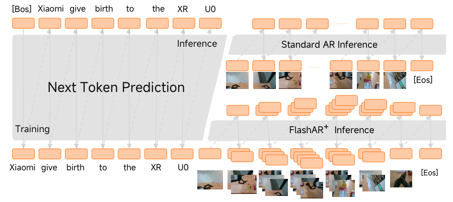

# arXiv text-to-image papers · Models from 2025 onward

<!-- Generated by scripts/catalog.py from data/t2i-arxiv-daily.json, data/models.json and data/figures.json. -->

[← Complete catalog](../README.md#models)

**60 model families · 60 papers · 54 new catalog entries · Reviewed 2026-09-29**

Screens all **4220 papers** returned by the pinned arXiv API query `(abs:"text-to-image" OR ti:"image generation" OR ti:"image synthesis") AND submittedDate:[202501010000 TO 202609292359]`, retrieved on 2026-09-29 (snapshot SHA-256 `d9bb13e3c0f2…`). Inclusion requires a text-to-image model, distinct generation architecture or named generation system whose paper was first submitted on or after **January 1, 2025**. A later revision of a 2024 paper does not qualify. Earlier entries and releases without an arXiv paper are covered by the complete catalog.

Datasets, benchmarks, guidance and control methods, personalization, editing-only methods, safety and concept erasure, acceleration techniques and methods without a distinct generation system are excluded. Closely related releases and renamed papers share a card. Descriptive names are used when a paper does not give its system a brand name.

Every family below has a description, a local image and paper links. **29** have author-linked GitHub sources; **31** have no author-linked repository found in the reviewed sources. A missing link is a review result, not a claim that no repository exists. **54** images come from primary sources; **6** are labeled editorial input/output diagrams.

Dates are first paper submission dates, not verified software release dates. Withdrawals and renamed papers are noted on the affected cards. [Full screening and repository evidence](../data/t2i-arxiv-daily.json) · [Figure credits](../assets/architectures/CREDITS.md).

Screening counts

| Decision | Papers |
| --- | ---: |
| Included | 60 |
| Component, guidance, control, personalization, editing, safety, acceleration or training method without a distinct generation system | 1481 |
| Dataset, benchmark, evaluation or analysis without a distinct text-to-image system | 621 |
| No distinct text-to-image system identified in the reviewed source | 1 |
| Image understanding, retrieval, video, 3D or application outside the text-to-image scope | 873 |
| Not yet screened | 1184 |

Model index

- [PSP-DiT](#psp-dit)
- [DuetGen](#duetgen)
- [FLAT](#flat)
- [Moonworks Lunara](#moonworks-lunara)
- [LLaDA-Image](#llada-image)
- [BIT (Bidirectional Image-Text Diffusion Bridges)](#bit)
- [Swift-Image](#swift-image)
- [Nexus](#nexus)
- [UniSpace](#unispace)
- [UniWorld-Design](#uniworld-design)
- [UniGen-AR](#unigen-ar)
- [Mage-Flow](#mage-flow)
- [Boogu-Image-0.1](#boogu-image)
- [Xiaomi-Robotics-U0](#xiaomi-robotics-u0)
- [Nemotron-Labs-Diffusion-Image](#nemotron-labs-diffusion-image)
- [Libra-2](#libra-2)
- [ILLUME-X](#illume-x)
- [Mural](#mural)
- [JuZhou 1.0](#juzhou-1)
- [SeFi-Image](#sefi-image)
- [Z-Image Turbo++](#z-image-turbo-pp)
- [i1](#i1)
- [ARM](#arm)
- [OmniGen-AR](#omnigen-ar)
- [BLM-SGAN](#blm-sgan)
- [Qwen-Image-Flash](#qwen-image-flash)
- [Cosmos 3](#cosmos3)
- [ERNIE-Image](#ernie-image)
- [CAR (Channel-wise Autoregressive)](#car)
- [Lens](#lens)
- [HiDream-O1-Image](#hidream-o1-image)
- [Normalizing Trajectory Models](#ntm)
- [JoyAI-Image](#joyai-image)
- [MMCORE](#mmcore)
- [ADP-DiT](#adp-dit)
- [Nucleus-Image](#nucleus-image)
- [GRN (Generative Refinement Networks)](#grn)
- [FlowInOne](#flowinone)
- [MMFace-DiT](#mmface-dit)
- [DreamLite](#dreamlite)
- [LaDe](#lade)
- [DREAM](#dream)
- [TerraDiT](#terradit)
- [LLaDA-o](#llada-o)
- [TMDM-3B](#tmdm-3b)
- [BitDance](#bitdance)
- [DeepGen 1.0](#deepgen-1)
- [DuoGen](#duogen)
- [LINA](#lina)
- [AR-Omni](#ar-omni)
- [Self-E](#self-e)
- [PS-VAE](#ps-vae)
- [SVG-T2I](#svg-t2i)
- [ProxT2I](#proxt2i)
- [oboro:](#oboro)
- [FIBO](#fibo)
- [Muddit](#muddit)
- [FlowTok](#flowtok)
- [DiT-Air](#dit-air)
- [MaskGen](#maskgen)

## Models

### PSP-DiT

**First paper submission:** 2026-09-24 · [Architecture card](../models/dit.md#psp-dit)

Panoptic Scene Program Diffusion Transformer (PSP-DiT) targets compositional text-to-image prompts — those requiring correct object counts, attribute ownership, spatial ordering and role-sensitive relations — by making a panoptic scene program (a structured graph of instances, attributes, relations and counts) a first-class latent that the diffusion transformer denoises jointly with the image, rather than an external layout signal or a post-hoc parse of the output. Coupled transformer streams for the image and scene-program latents exchange information through bidirectional cross-attention, and grounding plus cycle-consistency objectives tie the scene program to visual support in the generated image. The paper reports gains over a strong flat-text DiT baseline concentrated on counting, attribute binding, relational and long structured prompts, with modest added inference cost.

[Paper](https://arxiv.org/abs/2609.31780) · GitHub: no author-linked repository found

*Figure 1 · [Image source](https://arxiv.org/abs/2609.31780)*

### DuetGen

**First paper submission:** 2026-09-19 · [Architecture card](../models/continuous-ar.md#duetgen)

DuetGen is a visual text generation system for producing text-rich images (e.g. posters, signage) that jointly trains an autoregressive layout planner with a diffusion-transformer renderer under a framework the authors call DeepFusion, rather than optimizing planning and rendering as separate stages. A 2B-parameter AR planner predicts where text should appear and what it should say, and a 4B single-stream DiT renders the image conditioned on the planner's representations, with rendering-loss gradients flowing back into the planner so its layout representations are shaped by what the renderer can actually realize. A Phase-Aware Attention Modulation mechanism strengthens the binding between image regions and their intended text content and coordinates at inference.

[Paper](https://arxiv.org/abs/2609.22916) · GitHub: no author-linked repository found

*Figure 2 · [Image source](https://arxiv.org/abs/2609.22916)*

### FLAT

**First paper submission:** 2026-09-15 · [Architecture card](../models/unified.md#flat)

FLAT (Meta AI) is a representation-pretraining framework that jointly optimizes one shared multimodal encoder with downstream text-to-image and image-to-text decoders, so the same continuous representation serves as both a discriminative retrieval embedding and a generative conditioning signal. Images and text are mapped into a unified, variable-length continuous 1D sequence space using register tokens and nested dropout over a prefix length K, trained with combined contrastive and bidirectional generative objectives; a rectified-flow-matching decoder produces images and an autoregressive decoder produces captions. The paper reports competitive cross-modal retrieval alongside a text-to-image GenEval score of 71.1 zero-shot from pretraining (83.1 after task-specific fine-tuning).

[Paper](https://arxiv.org/abs/2609.16591) · GitHub: no author-linked repository found

*Figure 1 (PDF p. 3) · [Image source](https://arxiv.org/abs/2609.16591)*

### Moonworks Lunara

**First paper submission:** 2026-09-11 · [Architecture card](../models/dit.md#moonworks-lunara)

Moonworks Lunara, from the startup Moonworks, is a text-to-image model built around a novel Diffusion Mixture Transformer (DMT) architecture and framed around what the authors call Artistic Intelligence — generation that preserves semantic, artistic and compositional structure while leaving room for creative variation. Text (and optional image) input is routed through dedicated art-conception and compositional-attention stages into per-style latent-mixture denoising experts, and the model is trained with an iterative algorithm that actively selects informative generated samples and injects curated human-created art into the training distribution over successive rounds. The paper reports Lunara ranking first in aesthetic quality and competitive on content-integrity metrics against comparable sub-10B models, with sub-10-second inference.

[Paper](https://arxiv.org/abs/2609.22272) · GitHub: no author-linked repository found

*Figure 4 (PDF p. 7) · [Image source](https://arxiv.org/abs/2609.22272)*

### LLaDA-Image

**First paper submission:** 2026-09-03 · [Architecture card](../models/dit.md#llada-image)

LLaDA-Image (Ant Group's inclusionAI) is a text-to-image and instruction-editing system that pairs a 6B diffusion transformer trained from scratch with a frozen multimodal understanding module built on the LLaDA2.0-Mini diffusion language model, connected through cross-attention and a lightweight connector rather than sharing weights end-to-end. It reuses a FLUX.2 VAE for image tokenization and trains with parameter-free RMSNorm and the Muon optimizer on a large image-only-then-paired-data curriculum, reporting open-source state-of-the-art scores on Qwen-Image-Bench; a distilled LLaDA-Image-Turbo variant reduces sampling to 2-4 steps. The authors release model weights, training code and training recipes.

[Paper](https://arxiv.org/abs/2609.03796) · [GitHub](https://github.com/inclusionAI/LLaDA-Image)

*Figure 3 · [Image source](https://arxiv.org/abs/2609.03796)*

### BIT (Bidirectional Image-Text Diffusion Bridges)

**First paper submission:** 2026-08-28 · [Architecture card](../models/dit.md#bit)

BIT (Bidirectional Image-Text Diffusion Bridges), from Stanford University, reframes text-to-image diffusion as a bidirectional bridge between text and image data rather than a one-way noise-to-image process. Instead of starting from Gaussian noise and injecting a text prompt as side conditioning, BIT constructs a stochastic process that interpolates directly between continuous text-token representations and image pixels, so the same DiT-XL/2 network can run forward (text-to-image) or its analytically derived time-reversal (image-to-text captioning). The authors argue this source-aware, reversible path supports richer sampling algorithms — such as retracing a generation to recover an approximate caption, or generating semantically related image variants — and show it is competitive with standard diffusion and flow-matching baselines on text-to-image and image-to-text benchmarks as well as on a scientific cell-fate modeling task.

[Paper](https://arxiv.org/abs/2608.27885) · [GitHub](https://github.com/gabeguo/bit_diffusion) · [Project](https://bit-diffusion.github.io)

*Figure 1 (PDF p. 3) · [Image source](https://arxiv.org/abs/2608.27885)*

### Swift-Image

**First paper submission:** 2026-08-20 · [Architecture card](../models/dit.md#swift-image)

Swift-Image studies how far a small, compute-constrained unified generator can be pushed through training engineering rather than scale. Its 6B single-stream diffusion transformer is conditioned on a Qwen3-VL encoder and a FLUX.2 autoencoder, trained with a progressive pipeline that grows from broad semantic coverage to high-resolution, unified generation-and-editing supervision, then post-trained with parallel expert reinforcement learning and multi-teacher on-policy distillation. A separate Prompt Enhancer model handles reasoning about user intent so the diffusion transformer can focus on rendering, and structural pruning plus few-step distillation give compressed 3B and low-step variants; the paper reports leading open-source aggregate performance at only 6B parameters and 243K GPU training hours.

[Paper](https://arxiv.org/abs/2608.20334) · GitHub: no author-linked repository found

*Figure 5 (PDF p. 6) · [Image source](https://arxiv.org/abs/2608.20334)*

### Nexus

**First paper submission:** 2026-08-17 · [Architecture card](../models/dit.md#nexus)

Nexus is a text-to-image rectified-flow diffusion transformer designed around the joint optimization of three efficiency techniques that prior work has mostly explored separately: sparse Mixture-of-Experts feed-forward layers, linear-complexity Gated DeltaNet attention in place of quadratic self-attention, and per-expert low-bit quantization. The combination targets the compute, sequence-length and memory bottlenecks that limit high-resolution diffusion transformers on edge hardware, and the paper reports generation quality comparable to SDXL and SD3 with markedly better latency and memory scaling.

[Paper](https://arxiv.org/abs/2608.16104) · GitHub: no author-linked repository found

*Figure 2 · [Image source](https://arxiv.org/abs/2608.16104)*

### UniSpace

**First paper submission:** 2026-08-09 · [Architecture card](../models/unified.md#unispace)

UniSpace asks whether multimodal understanding, text-to-image generation and editing can share one visual representation built from a pretrained semantic ViT, instead of pairing a semantic encoder with a separate VAE for pixel-level generation. The authors show a frozen semantic ViT's blocks are not inherently unable to preserve fine detail — the original patch embedding is the bottleneck — and introduce Patch Reparameterization, adding a reconstruction-aware patch embedding alongside the original semantic one. This unified representation is scaled into UniSpace, an 8B Mixture-of-Transformer-Experts model that performs understanding, generation and editing without a separate VAE pathway.

[Paper](https://arxiv.org/abs/2608.08676) · [GitHub](https://github.com/yjb6/UniSpace)

*Figure 3 · [Image source](https://arxiv.org/abs/2608.08676)*

### UniWorld-Design

**First paper submission:** 2026-08-04 · [Architecture card](../models/dit.md#uniworld-design)

UniWorld-Design (Peking University and Rabbitpre AI) reframes image generation around semantic RGBA layers rather than flat pixels, so that generation, decomposition and editing operate on independently addressable, complete visual objects instead of a monolithic raster. It comprises two flow-matching models sharing an RGBA-extended autoencoder: Text-to-RGBA generates standalone transparent design assets directly from a prompt, and Image-to-Layer uses a new Layer-Instruction Binding MMDiT to decompose a finished image into an ordered stack of complete semantic RGBA layers, following instructions for top-level decomposition, recursive refinement, or targeted extraction of a specific element. The paper reports improvements over Qwen-Image-Layered on per-layer fidelity and transparency, and the highest CLIP Score among compared text-to-RGBA generators.

[Paper](https://arxiv.org/abs/2608.03971) · [Project](https://rabbitvis.rabbitpre.com/blog) · GitHub: no author-linked repository found

*Figure 3 · [Image source](https://arxiv.org/abs/2608.03971)*

### UniGen-AR

**First paper submission:** 2026-07-27 · [Architecture card](../models/ar-token.md#unigen-ar)

UniGen-AR (Carnegie Mellon University, UIUC and Toyota Research Institute) targets Unified Visual Generation — one model producing text-to-image generation, editing, restoration and perception outputs — while avoiding the inference latency of diffusion-based unified models. It pairs a general-purpose multimodal language model, which encodes instructions and control signals, with an efficient next-scale visual autoregressive decoder in the style of Infinity, combining MLLM-based conditioning flexibility with VAR's parallel-scale sampling efficiency. The paper reports up to 19x lower inference latency than diffusion-based unified baselines across more than 15 tasks spanning four task families.

[Paper](https://arxiv.org/abs/2607.24157) · [Project](https://zpbao.github.io/projects/unigenar) · GitHub: no author-linked repository found

*Figure 2 · [Image source](https://arxiv.org/abs/2607.24157)*

### Mage-Flow

**First paper submission:** 2026-07-21 · [Architecture card](../models/dit.md#mage-flow)

Mage-Flow is a Microsoft text-to-image and editing foundation model built around two efficiency-focused components: Mage-VAE, a lightweight pixel-diffusion autoencoder distilled to reproduce the FLUX.2-VAE latent space at a fraction of its compute cost, and a native-resolution MMDiT that packs variable-length text and image token sequences from different-sized images into one batch rather than forcing a fixed resolution bucket. Text (and, for editing, reference images) are encoded by Qwen3-VL-4B-Instruct, and the 4B-parameter transformer is trained with rectified flow matching. The family ships a standard Base checkpoint, an RL-aligned variant post-trained for prompt following and aesthetics, and a 4-step distilled Turbo variant for fast inference. The model card is gated behind Hugging Face authentication and no public code repository was found, so this catalog could not verify its license.

[Paper](https://arxiv.org/abs/2607.19064) · GitHub: no author-linked repository found

*Figure 5 · [Image source](https://arxiv.org/abs/2607.19064)*

### Boogu-Image-0.1

**First paper submission:** 2026-07-14 · [Architecture card](../models/unified.md#boogu-image)

Boogu-Image-0.1 is an open-source unified image generation and instruction-editing model family that argues open text-to-image models can close the gap to closed-source systems primarily by strengthening instruction understanding — via a stronger Qwen3-VL-8B encoder, agentic prompt rewriting, model routing between Base/Turbo variants, and inference-time reflection — together with data-quality and training-pipeline improvements, rather than through architectural scale. Trained from scratch on 208.62M unique images at a reported cost of about $400K, it reports performance competitive with or approaching leading closed-source systems on the authors' Boogu Arena and on Qwen-Image-Bench, and releases weights, code and training recipes under Apache-2.0.

[Paper](https://arxiv.org/abs/2607.13125) · [GitHub](https://github.com/Boogu-Project/Boogu-Image)

*Editorial input/output diagram · [Image source](https://arxiv.org/abs/2607.13125)*

### Xiaomi-Robotics-U0

**First paper submission:** 2026-07-13 · [Architecture card](../models/unified.md#xiaomi-robotics-u0)

Xiaomi-Robotics-U0 is a 38-billion-parameter multimodal autoregressive foundation model that treats embodied generation (multi-view robot scene generation, structured embodied transfer, embodied video) as an extension of general text-to-image and image-editing generation, rather than a separately fine-tuned robotics model. Built by extending a Qwen-3-32B decoder-only transformer's vocabulary with an IBQ image tokenizer, it models text and image tokens under one next-token-prediction objective, preserving the generalization of large-scale text/image pretraining while adding embodiment-specific tasks. The paper reports state-of-the-art multi-view embodied scene generation and transfer results, including a jump in out-of-distribution manipulation success rate for a downstream robot policy.

[Paper](https://arxiv.org/abs/2607.11643) · GitHub: no author-linked repository found

*Figure 3 · [Image source](https://arxiv.org/abs/2607.11643)*

### Nemotron-Labs-Diffusion-Image

**First paper submission:** 2026-06-29 · [Architecture card](../models/masked.md#nemotron-labs-diffusion-image)

Nemotron-Labs-Diffusion-Image (NVIDIA) is a masked discrete diffusion model for high-resolution text-to-image synthesis that targets two limitations of prior masked-token diffusion models: the inability to revise tokens once unmasked, and sparse training signal as tokenizer vocabularies grow. It adds a token-editing mechanism so the model can dynamically correct previously unmasked image tokens during sampling, and a Grouped Cross-Entropy objective that spreads training signal to semantically neighboring tokens in the codebook. The paper reports state-of-the-art masked-diffusion results at 1024px and strong quality in as few as one to five sampling steps.

[Paper](https://arxiv.org/abs/2606.29814) · GitHub: no author-linked repository found

*Figure 3 (PDF p. 5) · [Image source](https://arxiv.org/abs/2606.29814)*

### Libra-2

**First paper submission:** 2026-06-29 · [Architecture card](../models/unified.md#libra-2)

Libra-2 extends the Libra family's decoupled vision-language design from image understanding only (Libra-1) to unified image-to-text understanding and text-to-image generation. Libra keeps one dedicated vision system and one dedicated language system rather than a single shared backbone, connecting them through cross-modal bridges (low-rank projections) and switch attention/switch FFN modules that route computation between self-modal and cross-modal pathways so each modality's own processing is not disturbed by the other. A continuous-space visual tokenizer combines a VAE encoder with CLIP semantic features through cross-attention, and a unified rotary positional encoding (UniRoPE) handles both 2D image and 1D text positions in one sequence; the language branch (a frozen LLaMA3.2-1B-Instruct) is trained with causal attention while the vision branch, trained from scratch, uses masked generation supervision, with the authors reporting that coupling understanding and generation in this decoupled design yields mutual improvements on both.

[Paper](https://arxiv.org/abs/2608.20382) · [GitHub](https://github.com/YifanXu74/Libra)

*Fig. 2 · [Image source](https://arxiv.org/abs/2608.20382)*

### ILLUME-X

**First paper submission:** 2026-06-29 · [Architecture card](../models/unified.md#illume-x)

ILLUME-X (Harbin Institute of Technology and Huawei Noah's Ark Lab) is a unified multimodal model aimed specifically at free-form, N-to-M interleaved text-image generation — producing arbitrary sequences of text and image outputs, such as illustrated step-by-step instructions or per-object image decompositions, rather than a single fixed-modality output. It combines separate understanding and generation attention branches sharing one multi-modal self-attention over a joint text/VAE/ViT token sequence, trained with a progressive strategy and a specialized attention mask over a curated 100K-sample interleaved dataset. The authors also propose ILScore, an evaluation protocol for cross-modal continuity and per-modality quality in interleaved generation.

[Paper](https://arxiv.org/abs/2606.30054) · [GitHub](https://github.com/ChonghuinanWang/ILLUME-X)

*Figure 2 · [Image source](https://arxiv.org/abs/2606.30054)*

### Mural

**First paper submission:** 2026-06-27 · [Architecture card](../models/unified.md#mural)

Mural shows that knowledge from a frozen, text-only large language model remains transferable to text-to-image generation without multimodal pretraining or explicit reasoning supervision. Using a Mixture-of-Transformers design, a frozen Qwen2.5 or Qwen2.5-VL LLM and a trainable diffusion image-generation expert process a concatenated token sequence with layer-wise shared self-attention — causal for text, bidirectional for image tokens — while every other component (layer norms, QKV/FFN weights) stays modality-specific; only the image-generation expert is trained, with a flow-matching loss on FLUX.1 VAE latents and no loss on text tokens. Trained solely on standard English text-image pairs, Mural exhibits emergent capabilities absent from its training data, including cross-lingual generation, hex-color-guided composition and emoji-based scene construction, which the authors attribute to knowledge transfer through the shared attention mechanism rather than explicit multimodal training.

[Paper](https://arxiv.org/abs/2606.29013) · GitHub: no author-linked repository found

*Figure 1 · [Image source](https://arxiv.org/abs/2606.29013)*

### JuZhou 1.0

**First paper submission:** 2026-06-25 · [Architecture card](../models/efficient.md#juzhou-1)

JuZhou 1.0 is an edge-native Chinese text-to-image foundation model designed for fully offline, on-device generation rather than server-side deployment. Its compact ~0.387B-parameter stack pairs a small U-Net denoiser — whose early blocks drop self-attention to save compute while later blocks keep both self- and cross-attention — with a redesigned, highly compact VAE decoder (1.90M parameters) built from attention-free depthwise-pointwise convolutions. Chinese-CLIP ViT-H/14 replaces the usual English CLIP text towers for native Chinese semantic alignment, with a Qwen3-1.7B prompt refiner improving raw prompts before encoding; training uses rectified flow with DMD2 distillation for 4-step sampling and runs entirely on domestically developed Sugon K100 accelerators rather than NVIDIA hardware. Despite its small size, the base model reports a GenEval score of 0.69, ahead of the much larger SDXL and SD3-Medium, and the pipeline runs on Android and iOS with an accompanying app.

[Paper](https://arxiv.org/abs/2606.28421) · [GitHub](https://github.com/HswAI2026/JuZhou-V1)

*Figure 4 · [Image source](https://arxiv.org/abs/2606.28421)*

### SeFi-Image

**First paper submission:** 2026-06-21 · [Architecture card](../models/dit.md#sefi-image)

SeFi-Image is a family of text-to-image foundation models (1B/2B/5B parameters) built around Semantic-First Diffusion (SFD), a latent diffusion paradigm that asynchronously denoises separate semantic and texture latent streams instead of a single latent. Semantic structure, encoded by a dedicated transformer-based Semantic VAE over DINOv2-Large features, is resolved ahead of pixel-level texture (encoded by a fine-tuned FLUX.2 texture VAE) via distinct per-stream timesteps, so texture generation always has a cleaner structural anchor; a FLUX.2-style double-/single-stream DiT conditioned on Qwen3-VL text embeddings predicts velocities for both latents jointly. The authors report the 5B model reaches quality comparable to or exceeding Qwen-Image and Z-Image using only 125K A800 GPU hours, roughly 10-20% of Z-Image's training compute, and release DMD2-distilled few-step turbo variants for lighter-weight deployment.

[Paper](https://arxiv.org/abs/2606.22568) · [GitHub](https://github.com/jmliu206/SeFi-Image)

*Figure 7 · [Image source](https://arxiv.org/abs/2606.22568)*

### Z-Image Turbo++

**First paper submission:** 2026-06-10 · [Architecture card](../models/efficient.md#z-image-turbo-pp)

Z-Image Turbo++ pushes Z-Image Turbo's 8-step distilled sampling down to 2 steps. The authors identify that naive 2-step distillation suffers from increased task difficulty and limited capacity, and address this with three tailored choices: step-decoupled parameterization, which gives each of the two denoising steps its own set of weights (both initialized from the 8-step teacher) rather than sharing one network; distribution-aligned adversarial learning, which trains the GAN discriminator against teacher-generated images as the 'real' distribution instead of external photographs, giving the generator an achievable target; and end-to-end training with an explicit step-1 loss so gradients from final image quality reach the first step while keeping its intermediate output meaningful on its own. The combined recipe is reported to substantially narrow the quality gap between 2-step and 8-step generation.

[Paper](https://arxiv.org/abs/2606.12575) · GitHub: no author-linked repository found

*Editorial input/output diagram · [Image source](https://arxiv.org/abs/2606.12575)*

### i1

**First paper submission:** 2026-06-09 · [Architecture card](../models/dit.md#i1)

i1 is a fully open, from-scratch text-to-image diffusion model built from a systematic, 300+ experiment study of modeling and data design choices for text-to-image diffusion training. Rather than introducing new network modules, the authors combine the best-performing choices they identify — an encoder-decoder T5Gemma text encoder with a large adapter, long skip connections on a dual-stream MMDiT, and equal-weighted mixing of curated real, synthetic and text-rendering datasets — into a 3B-parameter model trained on 12 public datasets (162.9M images) with synthetic captions from Qwen3-VL. The authors release weights, training code, data pipelines and the Lens-800M-scale caption datasets, reporting the model outperforms the best other fully open text-to-image model by 29.5 points on average across benchmarks.

[Paper](https://arxiv.org/abs/2606.11289) · [GitHub](https://github.com/zlab-princeton/i1) · [Model card](https://huggingface.co/zlab-princeton/i1-3B)

*Figure 4 · [Image source](https://arxiv.org/abs/2606.11289)*

### ARM

**First paper submission:** 2026-06-09 · [Architecture card](../models/unified.md#arm)

ARM unifies image understanding, text-to-image generation and instruction-based editing within one next-token-prediction framework built around a discrete semantic visual tokenizer. The tokenizer projects frozen SigLIP2 features through Finite Scalar Quantization into a 65K-token discrete codebook, trained jointly with caption, pixel-reconstruction, contrastive and feature-distillation losses so the tokens carry both semantic and low-level information; a FLUX.1-dev-initialized latent diffusion decoder reconstructs pixels from the tokens. A 7B autoregressive transformer initialized from Qwen2.5-7B, with an added linear head for visual-token prediction, is pretrained on 2.5T multimodal tokens and then optimized with reinforcement learning, which the authors report substantially improves text-to-image and editing metrics (WISE score 0.50 to 0.56) and induces cross-task synergy between the two.

[Paper](https://arxiv.org/abs/2606.11188) · [GitHub](https://github.com/wdrink/ARM)

*Figure 2 · [Image source](https://arxiv.org/abs/2606.11188)*

### OmniGen-AR

**First paper submission:** 2026-06-08 · [Architecture card](../models/unified.md#omnigen-ar)

OmniGen-AR unifies text-to-image generation, image editing and other conditional image synthesis tasks (depth-to-image, segmentation-to-image) inside one autoregressive, next-token-prediction framework. Text and visual conditions share a single vocabulary built from a Qwen2.5 text tokenizer and a Cosmos-DV image/video tokenizer, and are fed through one decoder-only transformer initialized from Qwen2.5. The paper's main technical contribution, Disentangled Causal Attention, splits the causal attention mask into a condition-specific and a content-specific component during training so that generation targets cannot shortcut information from condition tokens, applied stochastically (10% of steps) as a regularizer while inference keeps standard causal decoding; a three-stage curriculum (single-image, image-video joint, multi-task) trains the 0.5B and 1.5B variants on a broad mixture of captioned image, video and instruction-editing datasets.

[Paper](https://arxiv.org/abs/2606.09156) · GitHub: no author-linked repository found

*Figure 2 · [Image source](https://arxiv.org/abs/2606.09156)*

### BLM-SGAN

**First paper submission:** 2026-06-07 · [Architecture card](../models/gan.md#blm-sgan)

BLM-SGAN (Bidirectional Language-Modeling Semantic-Spatial GAN) revisits the standard SSA-GAN-style one-stage text-to-image GAN pipeline and replaces its sequential LSTM-based text encoder with BERT, arguing that bidirectional attention over the full caption yields richer contextual word and sentence features than left-to-right recurrent encoding. Sentence features modulate a stack of 7 SSACN blocks that progressively upsample a noise vector to a 256x256 image, while word features are fed spatially to the same blocks and to the discriminator; the discriminator is trained with a Matching-Aware Gradient Penalty. Evaluated on the CUB bird dataset, the model reaches an Inception Score of 5.45, ahead of prior GAN baselines such as SSA-GAN, DF-GAN and AttnGAN under the same protocol.

[Paper](https://arxiv.org/abs/2606.08847) · [GitHub](https://github.com/haidy-maher/BLM-SGAN-Text-to-Image-Generation)

*Figure 2 · [Image source](https://arxiv.org/abs/2606.08847)*

### Qwen-Image-Flash

**First paper submission:** 2026-06-02 · [Architecture card](../models/efficient.md#qwen-image-flash)

Qwen-Image-Flash studies how to distill Qwen-Image-2.0 into a fast, few-step (4-NFE) model covering both text-to-image generation and instruction-based editing under the Distribution Matching Distillation (DMD) framework. Rather than proposing new network modules, the paper systematically revisits three practical levers of the distillation recipe: training-data composition (finding single-category data generalizes better than indiscriminately broad category mixes), teacher guidance (anchoring the first distillation steps to the base teacher and introducing a specialized teacher's guidance only at the final step, rather than supervising every step with a post-trained teacher), and task mixture (a balanced 5:5 text-to-image-to-editing ratio outperforming generation-dominant mixtures for unified few-step editing). The result is a single few-step student that handles both generation and editing from one set of weights.

[Paper](https://arxiv.org/abs/2606.03746) · GitHub: no author-linked repository found

*Editorial input/output diagram · [Image source](https://arxiv.org/abs/2606.03746)*

### Cosmos 3

**First paper submission:** 2026-06-01 · [Architecture card](../models/unified.md#cosmos3)

Cosmos 3 is NVIDIA's family of omnimodal world models for Physical AI, which jointly process and generate language, images, video, audio and robot or vehicle actions in one Mixture-of-Transformers model. Text is produced by next-token prediction in a reasoner tower, while images, video, audio and actions are produced by iterative denoising in a generator tower that attends to the reasoner's context. Text-to-image is one of its generation modes, and NVIDIA released Cosmos3-Super-Text2Image, a 64B checkpoint specialized for text-to-image by two-stage fine-tuning, which the technical report describes as ranked first among open-weight models on the Artificial Analysis text-to-image leaderboard at the time of writing.

[Model card](https://huggingface.co/nvidia/Cosmos3-Super-Text2Image) · [Paper 1](https://research.nvidia.com/labs/cosmos-lab/cosmos3/technical-report.pdf) · [GitHub](https://github.com/NVIDIA/cosmos) · [Paper 2](https://arxiv.org/abs/2606.02800)

*Figure 5 (PDF p. 11) · [Image source](https://research.nvidia.com/labs/cosmos-lab/cosmos3/technical-report.pdf)*

### ERNIE-Image

**First paper submission:** 2026-05-25 · [Architecture card](../models/dit.md#ernie-image)

ERNIE-Image is Baidu's open 8B-parameter text-to-image model, built as a single-stream diffusion transformer that deliberately pairs a compact 3B Ministral-3 language model as text encoder with the FLUX.2 project's open-source VAE, rather than pursuing a larger or novel backbone. Its technical report focuses on data and training choices instead of architectural novelty: captions are generated by a vision-language model instructed to describe in-image text carefully, so the model targets text-rich, layout-sensitive content such as slides, posters and documents, and training resolution is staged upward from 256px to 1024px. The team reports state-of-the-art results among open-weight text-to-image models at its release. Code and weights are released under Apache-2.0.

[Paper](https://arxiv.org/abs/2605.25347) · [GitHub](https://github.com/baidu/ERNIE-Image) · [Model card](https://huggingface.co/baidu/ERNIE-Image)

*Editorial input/output diagram · [Image source](https://arxiv.org/abs/2605.25347)*

### CAR (Channel-wise Autoregressive)

**First paper submission:** 2026-05-25 · [Architecture card](../models/ar-token.md#car)

CAR reframes autoregressive image generation around channels instead of spatial patches. Its Channel-wise Vector Quantization (CVQ) tokenizer quantizes each h x w channel slice of the encoder's feature map against a codebook of h x w matrices, achieving full codebook utilization and better reconstruction than conventional patch-wise VQ. The Channel-wise Autoregressive (CAR) model then predicts these channel tokens one at a time, conditioned on text through a pretrained Qwen3-4B or Qwen3-8B backbone, so generation proceeds from broad global structure (few channels) to progressively enriched visual detail (many channels), evaluated purely on text-to-image benchmarks.

[Paper](https://arxiv.org/abs/2605.26089) · [GitHub](https://github.com/songweii/CVQ)

*Figure 3 · [Image source](https://arxiv.org/abs/2605.26089)*

### Lens

**First paper submission:** 2026-05-20 · [Architecture card](../models/dit.md#lens)

Lens (Microsoft) targets training efficiency for foundational text-to-image models by prioritizing caption quality and batch information density over parameter count. Its 3.8B-parameter MMDiT backbone reuses a frozen large mixture-of-experts language model, GPT-OSS, as text encoder, concatenating features from several intermediate layers through a linear adapter rather than training a dedicated encoder, and is trained on Lens-800M, 800M image-text pairs with long, dense GPT-4.1-generated captions across varied resolutions and aspect ratios in every batch. The authors report Lens matches or exceeds text-to-image models with more than 6B parameters while needing only about 19.3% of the training compute of Z-Image, generates 1024-resolution images in 3.15 seconds on one H100, and reaches 0.84-second 4-step generation with a distilled turbo variant; an optional independent Reasoner module rewrites prompts before generation.

[Paper](https://arxiv.org/abs/2605.21573) · GitHub: no author-linked repository found

*Figure 6 (PDF p. 7) · [Image source](https://arxiv.org/abs/2605.21573)*

### HiDream-O1-Image

**First paper submission:** 2026-05-11 · [Architecture card](../models/pixel-diffusion.md#hidream-o1-image)

HiDream.ai's HiDream-O1-Image drops both the VAE and the separate text encoder. Text is tokenized with the backbone's own vocabulary, optional reference or source images are encoded with SigLIP2 into condition tokens, and the noisy target image is patchified directly from pixels; all three token types are concatenated and processed by one transformer, which predicts clean image patches. Text and condition tokens use causal attention while generation tokens attend to everything. The released 8B model is initialized from Qwen3-VL-8B-Instruct and trained with flow matching plus LPIPS and DINO perceptual losses, progressing from 512² to 1024² and above 2048² images. One model covers text-to-image generation, instruction-based editing and subject-driven personalization, and a Gemma-based prompt agent rewrites user prompts before generation.

[Paper](https://arxiv.org/abs/2605.11061) · [GitHub](https://github.com/HiDream-ai/HiDream-O1-Image) · [Model card](https://huggingface.co/HiDream-ai/HiDream-O1-Image)

*Figure 7 · [Image source](https://arxiv.org/abs/2605.11061)*

### Normalizing Trajectory Models

**First paper submission:** 2026-05-08 · [Architecture card](../models/continuous-ar.md#ntm)

Normalizing Trajectory Models (NTM, Apple) recast few-step diffusion sampling as a single invertible flow trained by exact maximum likelihood rather than distillation, consistency training or adversarial objectives. Building on STARFlow's TarFlow-style autoregressive flow blocks, NTM combines a few shallow, shared invertible Transporter blocks within each denoising step with a deep, non-causal Predictor transformer that attends across the whole trajectory, so the model can be trained end to end from scratch or by fine-tuning a pretrained flow-matching backbone. Because the trajectory likelihood stays tractable, the frozen model can also act as a supervisory score for self-distillation, training a lightweight denoiser that reaches comparable text-to-image quality in four steps while preserving the exact-likelihood framework throughout.

[Paper](https://arxiv.org/abs/2605.08078) · [GitHub](https://github.com/apple-aiml-research/ml-starflow)

*Figure 3 (PDF p. 4) · [Image source](https://arxiv.org/abs/2605.08078)*

### JoyAI-Image

**First paper submission:** 2026-05-05 · [Architecture card](../models/unified.md#joyai-image)

JoyAI-Image, from JD.com's JD Open Source team, is a unified model for visual understanding, text-to-image generation and instruction-guided image editing built around spatial intelligence. A spatially enhanced MLLM serves both as the understanding engine and as the interface that turns prompts and source images into semantically and spatially grounded conditioning signals, which a 16B-parameter dual-stream MMDiT (following the Qwen-Image style but with MRoPE replacing MSRoPE) consumes to synthesize or edit images through iterative denoising. Training is progressive: the MLLM is first fine-tuned for spatial understanding, the MMDiT is then trained from scratch for generation using MLLM-derived priors, and the whole system is finally optimized for instruction-based editing. The paper emphasizes a bidirectional loop between enhanced spatial understanding, controllable spatial editing (e.g. camera viewpoint changes) and novel-view-assisted reasoning, reporting state-of-the-art or highly competitive results on understanding, generation, long-text rendering and editing benchmarks.

[Paper](https://arxiv.org/abs/2605.04128) · [GitHub](https://github.com/jd-opensource/JoyAI-Image) · [Model card](https://huggingface.co/jdopensource/JoyAI-Image-Edit)

*Figure 4 · [Image source](https://arxiv.org/abs/2605.04128)*

### MMCORE

**First paper submission:** 2026-04-21 · [Architecture card](../models/unified.md#mmcore)

MMCORE (ByteDance) transfers the reasoning ability of a multimodal large language model into text-to-image generation and editing without deep-fusing an autoregressive model and a diffusion model end to end. A pre-trained MLLM is fine-tuned autoregressively to produce a fixed set of learnable query tokens that summarize the prompt and, for editing, any reference images; these compact visual-language embeddings condition a separately pre-trained MMDiT generator alongside the raw text embeddings, with a block-causal attention mask letting each generated frame attend to the VAE latents and embeddings of all preceding images. The system is trained in stages (MLLM fine-tuning, then diffusion-head SFT and RLHF) and supports text-to-image synthesis, multi-image editing and spatial reasoning/grounding without requiring deep architectural fusion between the two backbones.

[Paper](https://arxiv.org/abs/2604.19902) · GitHub: no author-linked repository found

*Figure 5 · [Image source](https://arxiv.org/abs/2604.19902)*

### ADP-DiT

**First paper submission:** 2026-04-15 · [Architecture card](../models/dit.md#adp-dit)

ADP-DiT is a diffusion transformer purpose-built to synthesize longitudinal brain-MRI scans showing predicted Alzheimer's-disease progression, conditioned on natural-language clinical prompts rather than only class labels. A 1.9B-parameter DiT backbone, trained from scratch, denoises SDXL-VAE latents with rotary position embeddings, while a follow-up interval together with demographic, diagnostic and neuropsychological information is packaged as a natural-language prompt and encoded by two frozen text encoders (OpenCLIP ViT-G/14 and T5-XXL); their embeddings and a separate metadata-embedding MLP enter the DiT through cross-attention and adaptive layer normalization.

[Paper](https://arxiv.org/abs/2604.13495) · GitHub: no author-linked repository found

*Figure 1 · [Image source](https://arxiv.org/abs/2604.13495)*

### Nucleus-Image

**First paper submission:** 2026-04-14 · [Architecture card](../models/dit.md#nucleus-image)

Nucleus-Image studies sparse mixture-of-experts scaling as a path to high-quality text-to-image diffusion, reaching 17B total parameters across 64 routed experts per layer while activating only about 2B parameters per forward pass through Expert-Choice Routing. Text conditioning is handled by joint attention with text-key/value sharing across denoising timesteps rather than by folding text tokens into the main transformer backbone, and a decoupled routing design is used to keep timestep-conditioned modulation stable under sparsification. The authors describe it as the first fully open-source MoE diffusion model at competitive quality, releasing the training recipe.

[Paper](https://arxiv.org/abs/2604.12163) · GitHub: no author-linked repository found

*Editorial input/output diagram · [Image source](https://arxiv.org/abs/2604.12163)*

### GRN (Generative Refinement Networks)

**First paper submission:** 2026-04-14 · [Architecture card](../models/masked.md#grn)

Generative Refinement Networks (GRN) propose a visual-synthesis paradigm distinct from standard masked or autoregressive token prediction. A Hierarchical Binary Quantization (HBQ) tokenizer refines each VAE feature element through several rounds of binary quantization with exponentially decaying error, reaching near-lossless reconstruction at higher compression than typical discrete tokenizers, in either an integer-index (GRNind) or direct-bit-prediction (GRNbit) variant. Generation starts from a random token map and, at each step, a transformer predicts a complete token map conditioned on the current partial map; the sampler then fills newly confident predictions, keeps some prior predictions, and erases and re-randomizes others, so every step simultaneously fills, refines and erases the image (unlike strictly monotonic masked-generation samplers). An entropy-guided, complexity-aware schedule allocates more refinement steps to harder samples.

[Paper](https://arxiv.org/abs/2604.13030) · [GitHub](https://github.com/bytedance/GRN)

*Figure 4 (PDF p. 5) · [Image source](https://arxiv.org/abs/2604.13030)*

### FlowInOne

**First paper submission:** 2026-04-08 · [Architecture card](../models/unified.md#flowinone)

FlowInOne reframes multimodal image generation as a purely visual, image-in/image-out process: instead of separate text encoders and task-specific branches for generation, layout-guided synthesis, editing and visual instruction following, every input -- text, arrows, masks, markers, source images -- is rendered onto a single canvas image, encoded by a SigLIP vision transformer, and consumed by one flow-matching model. A Dual-Path Spatially-Adaptive Modulation mechanism inside the transformer gates, per token, how much the model relies on the preserved input structure versus the instruction signal; pure generation bypasses cross-attention entirely to avoid injecting irrelevant conditioning noise, while editing selectively admits source-image priors. The 1.2B-parameter model is initialized from CrossFlow and trained with a combined flow-matching, CLIP-contrastive and KL-divergence loss.

[Paper](https://arxiv.org/abs/2604.06757) · [GitHub](https://github.com/CSU-JPG/FlowInOne) · [Project](https://csu-jpg.github.io/FlowInOne.github.io/)

*Figure 3 · [Image source](https://arxiv.org/abs/2604.06757)*

### MMFace-DiT

**First paper submission:** 2026-03-30 · [Architecture card](../models/dit.md#mmface-dit)

MMFace-DiT is an end-to-end diffusion transformer for multimodal face generation, built to avoid the ControlNet-style auxiliary modules that the authors argue limit how tightly spatial and textual conditioning can be fused. A dual-stream DiT-XL backbone (1.345B parameters, 28 blocks, FLUX VAE latent space) processes image and text tokens in parallel, joined by a shared RoPE attention layer that acts as the central cross-modal fusion point, with a Modality Embedder letting a single trained model switch between mask-conditioned and sketch-conditioned synthesis without retraining. Text conditioning comes from a Stable-Diffusion-2.1-base CLIP encoder, supplying both pooled and token-level embeddings.

[Paper](https://arxiv.org/abs/2603.29029) · [GitHub](https://github.com/Bharath-K3/MMFace-DiT) · [Project](https://vcbsl.github.io/MMFace-DiT/)

*Figure 2 · [Image source](https://arxiv.org/abs/2603.29029)*

### DreamLite

**First paper submission:** 2026-03-30 · [Architecture card](../models/efficient.md#dreamlite)

DreamLite is billed as the first unified on-device diffusion model to support both text-to-image generation and text-guided image editing from a single 0.39B-parameter network, small enough to run in under a second on a Xiaomi 14 phone. Its backbone is a mobile U-Net systematically pruned and re-architected from SnapGen's 2.5B design (fewer transformer blocks, smaller channel widths, separable convolutions, multi-query attention with one KV head), paired with a Qwen3-VL-2B text/instruction encoder and a 2.5M-parameter TinyVAE. Generation and editing share the same network through an in-context conditioning trick: the model always denoises a horizontally concatenated (target | condition) pair, using a blank panel as the condition for generation and the source image for editing, with an explicit [Generate] or [Edit] task token disambiguating the two modes.

[Paper](https://arxiv.org/abs/2603.28713) · [GitHub](https://github.com/ByteVisionLab/DreamLite) · [Project](https://carlofkl.github.io/dreamlite/)

*Figure 2 · [Image source](https://arxiv.org/abs/2603.28713)*

### LaDe

**First paper submission:** 2026-03-18 · [Architecture card](../models/dit.md#lade)

LaDe generates editable, layered graphic designs (e.g. an advertisement as separate background, subject and text layers) from a short prompt, rather than a single flattened image. A GPT-4o-mini prompt expander turns a brief request into a structured description (scene, per-layer captions, design type) encoded by FlanT5-XXL; an 11B latent diffusion transformer with a novel 4D RoPE positional scheme -- spanning spatial coordinates, layer index and a token-role flag -- then jointly denoises the composited design and each of its RGBA layers, decoded through a VAE fine-tuned to reconstruct alpha channels. Setting the number of layers to zero reduces the same model to plain text-to-image generation, and the model also supports the reverse task of decomposing an existing design image into its constituent layers.

[Paper](https://arxiv.org/abs/2603.17965) · GitHub: no author-linked repository found

*Figure 5 · [Image source](https://arxiv.org/abs/2603.17965)*

### DREAM

**First paper submission:** 2026-03-03 · [Architecture card](../models/unified.md#dream)

DREAM unifies text-image contrastive representation learning and text-to-image generation in one encoder, which is normally difficult because contrastive alignment wants mostly-visible tokens while generative modeling wants heavily-masked ones. Its 'Masking Warmup' schedule shifts the center of the per-step masking-ratio distribution from low to high over roughly 36 epochs of training so that both low- and high-masking regimes coexist throughout training, letting a single MAR-style ViT encoder and FLUID-style decoder serve both a CLIP contrastive loss (via a CLIP-style text encoder) and a diffusion generation loss (via a frozen T5-XXL text encoder and a six-layer diffusion MLP head predicting Stable Diffusion VAE latents). At inference, 'Semantically Aligned Decoding' spawns several partially-decoded candidates and uses the model's own encoder to score and select the best trajectory from as little as 12.5% of the image decoded.

[Paper](https://arxiv.org/abs/2603.02667) · GitHub: no author-linked repository found

*Figure 2 · [Image source](https://arxiv.org/abs/2603.02667)*

### TerraDiT

**First paper submission:** 2026-03-02 · [Architecture card](../models/dit.md#terradit)

TerraDiT is a diffusion transformer trained from scratch for text-to-satellite-image synthesis, aimed at replacing the dense pixel-level layout maps used by prior remote-sensing generators with lightweight point queries. The base TerraDiT-XL/2-alpha model follows a SiT-style DiT design (28 blocks, hidden size 1152, patch size 2) conditioned on LongCLIP text embeddings of GPT-4o-generated satellite-image captions. A second variant, TerraDiT-XL/2-Sigma, adds an Adaptive Local Attention block that lets a small number of user-supplied point locations (with semantic tags) steer generation: a MetaRBF module turns each point into a spatial prior that multiplicatively regularizes the block's cross-attention map, giving spatial control without a dense conditioning map.

[Paper](https://arxiv.org/abs/2603.02172) · [GitHub](https://github.com/mvrl/TerraDiT)

*Figure 3 · [Image source](https://arxiv.org/abs/2603.02172)*

### LLaDA-o

**First paper submission:** 2026-03-01 · [Architecture card](../models/unified.md#llada-o)

LLaDA-o extends the LLaDA masked-diffusion language model into a unified multimodal system by decoupling understanding and generation into two diffusion processes that nonetheless share one attention backbone, rather than bolting a separate diffusion decoder onto a frozen LLM. A discrete masked-diffusion 'understanding expert', initialized from LLaDA-8B-Instruct, handles text and visual tokens for comprehension tasks, while a continuous rectified-flow 'generation expert' -- initialized from the same architecture with newly added time-embedding parameters -- denoises FLUX-VAE image latents for text-to-image generation. The two experts interact only through a shared, efficient attention mechanism (intra-modality bidirectional attention) that keeps cross-modal conditioning global while avoiding the training conflicts the authors report from a single shared token stream.

[Paper](https://arxiv.org/abs/2603.01068) · [GitHub](https://github.com/ML-GSAI/LLaDA-o)

*Figure 2 (PDF p. 4) · [Image source](https://arxiv.org/abs/2603.01068)*

### TMDM-3B

**First paper submission:** 2026-02-25 · [Architecture card](../models/masked.md#tmdm-3b)

This paper conducts a systematic, large-scale study of the design space of tri-modal (text, image, audio) masked diffusion models -- scaling laws, noise schedules and batch-size effects -- and trains a 3B-parameter model (the paper's Section 7.1 calls it the 'Unified 3B Tri-modal MDM') from scratch for 1M steps on 6.4T tokens as its main empirical vehicle. The model packs text, image-caption and audio-transcription sequences and denoises them with one bidirectional transformer under a shared masking schedule, supporting conditional generation across modalities including text-to-image generation, image captioning, text-to-speech and automatic speech recognition from a single set of weights.

[Paper](https://arxiv.org/abs/2602.21472) · GitHub: no author-linked repository found

*Figure 2 · [Image source](https://arxiv.org/abs/2602.21472)*

### BitDance

**First paper submission:** 2026-02-15 · [Architecture card](../models/continuous-ar.md#bitdance)

BitDance (ByteDance with CUHK and other institutions) is an autoregressive image generator whose visual tokens are binary vectors from a lookup-free quantization tokenizer with vocabularies up to 2^256 states. Because a softmax over that many indices is impractical, a small DiT-style diffusion head treats each token as a vertex of a hypercube, generates it with rectified-flow sampling in continuous space conditioned on the transformer's hidden state, and snaps the result back to ±1. The same head samples a whole p×p patch of tokens at once (next-patch diffusion), under a block-wise causal mask, so many tokens are produced per step. For text-to-image generation a 14B model initialized from Qwen3-14B serves as both text encoder and image generator, uses a 16×-downsampling tokenizer and generates up to 1024×1024 images, with 16 or, after a short distillation stage, 64 tokens per step; the paper reports over 30× speedup over prior next-token AR models at 1024px.

[Paper](https://arxiv.org/abs/2602.14041) · [GitHub](https://github.com/shallowdream204/BitDance) · [Model card](https://huggingface.co/shallowdream204/BitDance-14B-64x)

*Figure 4 (PDF p. 6) · [Image source](https://arxiv.org/abs/2602.14041)*

### DeepGen 1.0

**First paper submission:** 2026-02-12 · [Architecture card](../models/unified.md#deepgen-1)

DeepGen 1.0 is a compact, 5B-parameter unified model for text-to-image generation and editing that the authors position against much larger unified models (reporting gains over the 80B HunyuanImage on the WISE benchmark). Rather than relying on the VLM's final-layer output alone, its Stacked Channel Bridging (SCB) framework samples hidden states from six layers spanning the low, middle and high depth of a Qwen2.5-VL-3B backbone, lets them interact with a set of learnable 'think tokens' through self-attention as an implicit chain-of-thought, and fuses the selected states through a channel-wise concatenation, MLP and Transformer connector before handing them to an SD3.5-Medium (2B) diffusion transformer decoder. Editing is supported by concatenating a reference image's VAE latents with the target image's noise tokens in the DiT input sequence.

[Paper](https://arxiv.org/abs/2602.12205) · GitHub: no author-linked repository found

*Figure 3 · [Image source](https://arxiv.org/abs/2602.12205)*

### DuoGen

**First paper submission:** 2026-01-31 · [Architecture card](../models/unified.md#duogen)

DuoGen (NVIDIA) is a unified system for interleaved text-and-image generation: producing multi-step, multi-image sequences such as illustrated how-to instructions rather than a single image per prompt. A pretrained multimodal LLM (Qwen2.5-VL-7B) reads the conversation and previously generated images and decides, token by token, whether to keep writing text or trigger image synthesis; when it does, a diffusion transformer initialized from a video-generation model (Cosmos Predict 2.5) renders the next image conditioned on the MLLM's hidden states and on all prior images in the sequence, stacked as VAE latents along a temporal axis. The paper argues that a video-pretrained backbone gives better cross-image visual consistency than an image-only DiT, and trains the system in two stages that first teach the MLLM when to generate images and then align the connector and DiT to the MLLM on large-scale image/video transition data.

[Paper](https://arxiv.org/abs/2602.00508) · [Project](https://research.nvidia.com/labs/dir/duogen/) · GitHub: no author-linked repository found

*Figure 3 · [Image source](https://arxiv.org/abs/2602.00508)*

### LINA

**First paper submission:** 2026-01-30 · [Architecture card](../models/continuous-ar.md#lina)

LINA studies how to design compute-efficient linear attention for continuous-token autoregressive text-to-image models, an approach otherwise bottlenecked by high computational cost. Through a systematic scaling analysis the authors find that division-based (not subtraction-based) normalization scales better for linear generative transformers, that depthwise convolution for locality is important for autoregressive image generation, and they extend gating mechanisms from causal to bidirectional linear attention with a new KV gate that assigns token-wise memory weights similar to forget gates in language models. Built on these findings, LINA is a full text-to-image system generating high-fidelity 1024x1024 images, achieving 2.18 FID on class-conditional ImageNet and 0.74 GenEval, with a single linear-attention module cutting FLOPs by about 61% versus softmax attention.

[Paper](https://arxiv.org/abs/2601.22630) · [GitHub](https://github.com/techmonsterwang/LINA)

*Figure 2 · [Image source](https://arxiv.org/abs/2601.22630)*

### AR-Omni

**First paper submission:** 2026-01-25 · [Architecture card](../models/unified.md#ar-omni)

AR-Omni is a unified autoregressive model for 'omni' multimodal understanding and generation, handling text, image and speech within one Transformer decoder and shared token vocabulary rather than routing modalities to separate expert modules. Initialized from the Anole interleaved image-text model and extended to speech, it addresses modality imbalance with task-aware loss reweighting, improves visual quality with a perceptual alignment loss, and manages the stability-creativity trade-off in generation with finite-state decoding. The paper reports strong performance across text, image and speech tasks while keeping real-time capability, including a 0.88 real-time factor for speech generation.

[Paper](https://arxiv.org/abs/2601.17761) · GitHub: no author-linked repository found

*Figure 1 · [Image source](https://arxiv.org/abs/2601.17761)*

### Self-E

**First paper submission:** 2025-12-26 · [Architecture card](../models/efficient.md#self-e)

Self-E (Self-Evaluating Model) is presented as the first from-scratch, any-step text-to-image model: a single trained network that works across the full range of inference step counts, from ultra-fast few-step sampling to high-quality 50-step sampling, without pretrained-teacher distillation. It combines instantaneous local supervision (standard denoising loss) with a self-driven global matching objective in which the model evaluates and refines its own generated samples, unlike diffusion/flow-matching models that rely solely on local supervision or distillation methods that require a separate teacher. The authors report performance that improves monotonically with more inference steps while remaining competitive with state-of-the-art flow-matching models at 50 steps.

[Paper](https://arxiv.org/abs/2512.22374) · GitHub: no author-linked repository found

*Figure 2 · [Image source](https://arxiv.org/abs/2512.22374)*

### PS-VAE

**First paper submission:** 2025-12-19 · [Architecture card](../models/unified.md#ps-vae)

PS-VAE addresses two obstacles in adapting representation-encoder features (rather than plain VAE latents) as generative latents: the discriminative feature space is poorly regularized, causing off-manifold samples with inaccurate structure, and the encoder's weak pixel reconstruction limits fine-grained geometry and texture. The paper introduces a semantic-pixel reconstruction objective that compresses both semantic content and fine-grained detail into a compact 96-channel, 16x16-downsampled latent, then builds a unified text-to-image and image-editing model on top of it. The authors report state-of-the-art reconstruction, faster convergence and substantial gains on both text-to-image and editing benchmarks compared to other feature spaces.

[Paper](https://arxiv.org/abs/2512.17909) · [Project](https://jshilong.github.io/PS-VAE-PAGE/) · GitHub: no author-linked repository found

*Figure 5 · [Image source](https://arxiv.org/abs/2512.17909)*

### SVG-T2I

**First paper submission:** 2025-12-12 · [Architecture card](../models/dit.md#svg-t2i)

SVG-T2I scales the SVG (Self-supervised representations for Visual Generation) framework to full text-to-image synthesis, training a diffusion transformer entirely within a visual-foundation-model (DINOv3) feature space rather than a traditional VAE latent space. The authors argue this validates the representational power of self-supervised visual features for generative modeling, and release the complete stack — autoencoder, generation model, training, inference and evaluation pipelines, and pretrained weights — reaching competitive GenEval and DPG-Bench scores.

[Paper](https://arxiv.org/abs/2512.11749) · [GitHub](https://github.com/KlingTeam/SVG-T2I)

*Figure 2 · [Image source](https://arxiv.org/abs/2512.11749)*

### ProxT2I

**First paper submission:** 2025-11-24 · [Architecture card](../models/dit.md#proxt2i)

ProxT2I proposes a text-to-image diffusion model built on backward (implicit) discretizations of the reverse diffusion process rather than the forward, explicit discretizations used by standard score-based samplers. It replaces the learned score function with learned, conditional proximal operators, which the authors argue gives more stable, efficient sampling in few steps, and further tunes the resulting samplers with reinforcement learning against human-preference reward models. The paper trains its U-ViT backbone from scratch on a newly introduced 15M-image human-portrait dataset with fine-grained captions (LAION-Face-T2I-15M), reporting sampling efficiency and preference-alignment gains over score-based baselines at comparable or lower compute and model size.

[Paper](https://arxiv.org/abs/2511.18742) · GitHub: no author-linked repository found

*Editorial input/output diagram · [Image source](https://arxiv.org/abs/2511.18742)*

### oboro:

**First paper submission:** 2025-11-11 · [Architecture card](../models/dit.md#oboro)

oboro: is a text-to-image foundation model built from scratch in Japan under the METI/NEDO GENIAC program, trained only on copyright-cleared images to support the country's anime and creative industries. Its Multi-Multi-Head (MMH) attention assigns a different number of attention heads to each DiT block (from 8/16 heads in early layers up to 24/48 in later ones) to encourage role differentiation between layers, and the model is designed to reach high image quality from a comparatively limited, deduplicated dataset (Megalith-10m with Florence-2 captions). The authors present it as the first fully Japan-developed, open-source, commercially oriented image-generation model, releasing weights and inference code.

[Paper](https://arxiv.org/abs/2511.08168) · [Model card](https://huggingface.co/aihub-geniac/oboro) · GitHub: no author-linked repository found

*Figure 1 · [Image source](https://arxiv.org/abs/2511.08168)*

### FIBO

**First paper submission:** 2025-11-10 · [Architecture card](../models/dit.md#fibo)

FIBO (Bria AI) is an open-source text-to-image model trained exclusively on long, structured JSON captions with fine-grained attributes, aiming to close the gap between the brief prompts most models are trained on and the richer control professional users want. Its DimFusion mechanism injects intermediate-layer representations from the SmolLM3-3B text encoder along the embedding dimension rather than concatenating them into the token sequence, keeping sequence length fixed while improving prompt alignment. The authors also introduce a Text-as-a-Bottleneck Reconstruction protocol to evaluate controllability, and report state-of-the-art prompt alignment among open-source models; weights are published on Hugging Face and code on GitHub.

[Paper](https://arxiv.org/abs/2511.06876) · [GitHub](https://github.com/Bria-AI/FIBO) · [Model card](https://huggingface.co/briaai/FIBO)

*Figure 2 · [Image source](https://arxiv.org/abs/2511.06876)*

### Muddit

**First paper submission:** 2025-05-29 · [Architecture card](../models/unified.md#muddit)

Muddit ("Meissonic II") is a second-generation unified discrete diffusion model for fast, parallel generation across text and image modalities. Unlike prior unified diffusion models trained from scratch, it integrates the strong visual priors of the pretrained Meissonic text-to-image backbone with a lightweight text decoder, enabling text-to-image generation, image-to-text captioning and visual question answering under one non-autoregressive architecture. The authors report Muddit matches or exceeds significantly larger autoregressive unified models in quality and efficiency, arguing that discrete diffusion with strong visual priors is a scalable backbone for unified generation.

[Paper](https://arxiv.org/abs/2505.23606) · [GitHub](https://github.com/M-E-AGI-Lab/Muddit) · [Model card](https://huggingface.co/MeissonFlow/Muddit)

*Figure 2 · [Image source](https://arxiv.org/abs/2505.23606)*

### FlowTok

**First paper submission:** 2025-03-13 · [Architecture card](../models/dit.md#flowtok)

FlowTok is a minimal framework for cross-modal generation that flows directly between text and image modalities through flow matching, rather than treating text as a conditioning signal that guides denoising from Gaussian noise. Images are encoded into a compact 1D token representation (built on TA-TiTok), reducing the latent space by 3.3x at 256px resolution compared to 2D latents and removing the need for complex conditioning or noise scheduling. The same formulation extends naturally to image-to-text generation, giving one lightweight model both directions with fewer training resources and faster sampling than comparable diffusion-based systems.

[Paper](https://arxiv.org/abs/2503.10772) · [GitHub](https://github.com/TACJu/FlowTok)

*Figure 4 · [Image source](https://arxiv.org/abs/2503.10772)*

### DiT-Air

**First paper submission:** 2025-03-13 · [Architecture card](../models/dit.md#dit-air)

DiT-Air (Apple) is an empirical study of architectural choices for text-to-image diffusion transformers — comparing PixArt-style, MMDiT-style and a standard DiT that simply concatenates text and noise inputs. The authors find the standard DiT variant matches specialized architectures while being far more parameter-efficient at scale, and use a layer-wise parameter-sharing strategy to shrink an MMDiT-equivalent model by 66% with little performance impact. Building on an analysis of text encoders and VAEs, they introduce DiT-Air and the smaller DiT-Air-Lite, which reach state-of-the-art GenEval and T2I-CompBench results after supervised and reward fine-tuning.

[Paper](https://arxiv.org/abs/2503.10618) · GitHub: no author-linked repository found

*Figure 4 (Simple DiT variant) · [Image source](https://arxiv.org/abs/2503.10618)*

### MaskGen

**First paper submission:** 2025-01-13 · [Architecture card](../models/masked.md#maskgen)

MaskGen is a family of text-to-image masked generative models trained exclusively on publicly available data, introduced alongside TA-TiTok, a text-aware 1-dimensional image tokenizer. TA-TiTok injects textual information during tokenizer decoding and supports either discrete or continuous 1D tokens without the two-stage distillation used by prior 1D tokenizers. MaskGen combines this compact tokenizer with an MM-DiT-style masked prediction backbone, aesthetic-score conditioning and caption recaptioning, and the authors report performance competitive with models trained on proprietary data despite using only open datasets.

[Paper](https://arxiv.org/abs/2501.07730) · [Project](https://tacju.github.io/projects/maskgen) · GitHub: no author-linked repository found

*Figure 3 · [Image source](https://arxiv.org/abs/2501.07730)*
