# arXiv text-to-image papers · Models from 2025 onward

<!-- Generated by scripts/catalog.py from data/t2i-arxiv-daily.json, data/models.json and data/figures.json. -->

[← Complete catalog](../README.md#models)

**26 model families · 26 papers · 25 new catalog entries · Reviewed 2026-09-29**

Screens all **4220 papers** returned by the pinned arXiv API query `(abs:"text-to-image" OR ti:"image generation" OR ti:"image synthesis") AND submittedDate:[202501010000 TO 202609292359]`, retrieved on 2026-09-29 (snapshot SHA-256 `d9bb13e3c0f2…`). Inclusion requires a text-to-image model, distinct generation architecture or named generation system whose paper was first submitted on or after **January 1, 2025**. A later revision of a 2024 paper does not qualify. Earlier entries and releases without an arXiv paper are covered by the complete catalog.

Datasets, benchmarks, guidance and control methods, personalization, editing-only methods, safety and concept erasure, acceleration techniques and methods without a distinct generation system are excluded. Closely related releases and renamed papers share a card. Descriptive names are used when a paper does not give its system a brand name.

Every family below has a description, a local image and paper links. **12** have author-linked GitHub sources; **14** have no author-linked repository found in the reviewed sources. A missing link is a review result, not a claim that no repository exists. **24** images come from primary sources; **2** are labeled editorial input/output diagrams.

Dates are first paper submission dates, not verified software release dates. Withdrawals and renamed papers are noted on the affected cards. [Full screening and repository evidence](../data/t2i-arxiv-daily.json) · [Figure credits](../assets/architectures/CREDITS.md).

Screening counts

| Decision | Papers |
| --- | ---: |
| Included | 26 |
| Component, guidance, control, personalization, editing, safety, acceleration or training method without a distinct generation system | 1078 |
| Dataset, benchmark, evaluation or analysis without a distinct text-to-image system | 491 |
| No distinct text-to-image system identified in the reviewed source | 1 |
| Image understanding, retrieval, video, 3D or application outside the text-to-image scope | 592 |
| Not yet screened | 2032 |

Model index

- [ADP-DiT](#adp-dit)
- [Nucleus-Image](#nucleus-image)
- [GRN (Generative Refinement Networks)](#grn)
- [FlowInOne](#flowinone)
- [MMFace-DiT](#mmface-dit)
- [DreamLite](#dreamlite)
- [LaDe](#lade)
- [DREAM](#dream)
- [TerraDiT](#terradit)
- [LLaDA-o](#llada-o)
- [TMDM-3B](#tmdm-3b)
- [BitDance](#bitdance)
- [DeepGen 1.0](#deepgen-1)
- [DuoGen](#duogen)
- [LINA](#lina)
- [AR-Omni](#ar-omni)
- [Self-E](#self-e)
- [PS-VAE](#ps-vae)
- [SVG-T2I](#svg-t2i)
- [ProxT2I](#proxt2i)
- [oboro:](#oboro)
- [FIBO](#fibo)
- [Muddit](#muddit)
- [FlowTok](#flowtok)
- [DiT-Air](#dit-air)
- [MaskGen](#maskgen)

## Models

### ADP-DiT

**First paper submission:** 2026-04-15 · [Architecture card](../models/dit.md#adp-dit)

ADP-DiT is a diffusion transformer purpose-built to synthesize longitudinal brain-MRI scans showing predicted Alzheimer's-disease progression, conditioned on natural-language clinical prompts rather than only class labels. A 1.9B-parameter DiT backbone, trained from scratch, denoises SDXL-VAE latents with rotary position embeddings, while a follow-up interval together with demographic, diagnostic and neuropsychological information is packaged as a natural-language prompt and encoded by two frozen text encoders (OpenCLIP ViT-G/14 and T5-XXL); their embeddings and a separate metadata-embedding MLP enter the DiT through cross-attention and adaptive layer normalization.

[Paper](https://arxiv.org/abs/2604.13495) · GitHub: no author-linked repository found

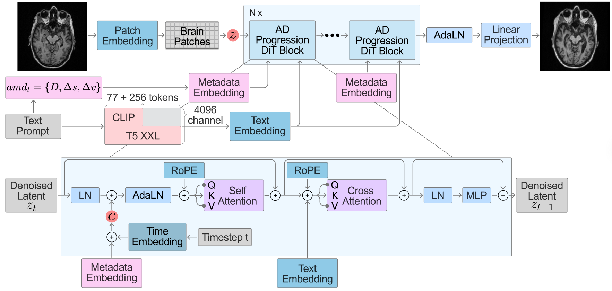

*Figure 1 · [Image source](https://arxiv.org/abs/2604.13495)*

### Nucleus-Image

**First paper submission:** 2026-04-14 · [Architecture card](../models/dit.md#nucleus-image)

Nucleus-Image studies sparse mixture-of-experts scaling as a path to high-quality text-to-image diffusion, reaching 17B total parameters across 64 routed experts per layer while activating only about 2B parameters per forward pass through Expert-Choice Routing. Text conditioning is handled by joint attention with text-key/value sharing across denoising timesteps rather than by folding text tokens into the main transformer backbone, and a decoupled routing design is used to keep timestep-conditioned modulation stable under sparsification. The authors describe it as the first fully open-source MoE diffusion model at competitive quality, releasing the training recipe.

[Paper](https://arxiv.org/abs/2604.12163) · GitHub: no author-linked repository found

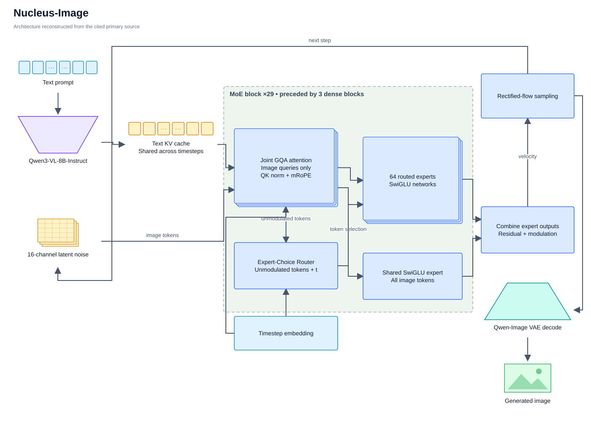

*Editorial input/output diagram · [Image source](https://arxiv.org/abs/2604.12163)*

### GRN (Generative Refinement Networks)

**First paper submission:** 2026-04-14 · [Architecture card](../models/masked.md#grn)

Generative Refinement Networks (GRN) propose a visual-synthesis paradigm distinct from standard masked or autoregressive token prediction. A Hierarchical Binary Quantization (HBQ) tokenizer refines each VAE feature element through several rounds of binary quantization with exponentially decaying error, reaching near-lossless reconstruction at higher compression than typical discrete tokenizers, in either an integer-index (GRNind) or direct-bit-prediction (GRNbit) variant. Generation starts from a random token map and, at each step, a transformer predicts a complete token map conditioned on the current partial map; the sampler then fills newly confident predictions, keeps some prior predictions, and erases and re-randomizes others, so every step simultaneously fills, refines and erases the image (unlike strictly monotonic masked-generation samplers). An entropy-guided, complexity-aware schedule allocates more refinement steps to harder samples.

[Paper](https://arxiv.org/abs/2604.13030) · [GitHub](https://github.com/bytedance/GRN)

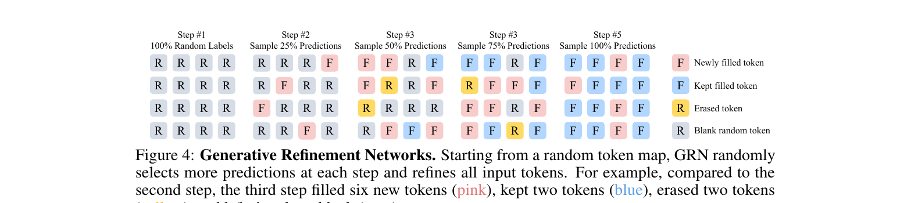

*Figure 4 (PDF p. 5) · [Image source](https://arxiv.org/abs/2604.13030)*

### FlowInOne

**First paper submission:** 2026-04-08 · [Architecture card](../models/unified.md#flowinone)

FlowInOne reframes multimodal image generation as a purely visual, image-in/image-out process: instead of separate text encoders and task-specific branches for generation, layout-guided synthesis, editing and visual instruction following, every input -- text, arrows, masks, markers, source images -- is rendered onto a single canvas image, encoded by a SigLIP vision transformer, and consumed by one flow-matching model. A Dual-Path Spatially-Adaptive Modulation mechanism inside the transformer gates, per token, how much the model relies on the preserved input structure versus the instruction signal; pure generation bypasses cross-attention entirely to avoid injecting irrelevant conditioning noise, while editing selectively admits source-image priors. The 1.2B-parameter model is initialized from CrossFlow and trained with a combined flow-matching, CLIP-contrastive and KL-divergence loss.

[Paper](https://arxiv.org/abs/2604.06757) · [GitHub](https://github.com/CSU-JPG/FlowInOne) · [Project](https://csu-jpg.github.io/FlowInOne.github.io/)

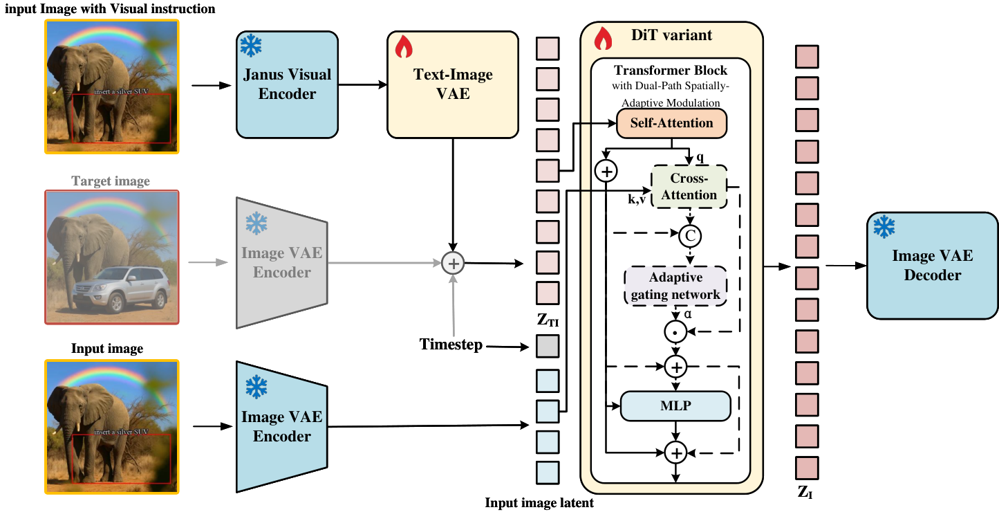

*Figure 3 · [Image source](https://arxiv.org/abs/2604.06757)*

### MMFace-DiT

**First paper submission:** 2026-03-30 · [Architecture card](../models/dit.md#mmface-dit)

MMFace-DiT is an end-to-end diffusion transformer for multimodal face generation, built to avoid the ControlNet-style auxiliary modules that the authors argue limit how tightly spatial and textual conditioning can be fused. A dual-stream DiT-XL backbone (1.345B parameters, 28 blocks, FLUX VAE latent space) processes image and text tokens in parallel, joined by a shared RoPE attention layer that acts as the central cross-modal fusion point, with a Modality Embedder letting a single trained model switch between mask-conditioned and sketch-conditioned synthesis without retraining. Text conditioning comes from a Stable-Diffusion-2.1-base CLIP encoder, supplying both pooled and token-level embeddings.

[Paper](https://arxiv.org/abs/2603.29029) · [GitHub](https://github.com/Bharath-K3/MMFace-DiT) · [Project](https://vcbsl.github.io/MMFace-DiT/)

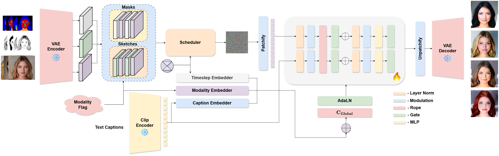

*Figure 2 · [Image source](https://arxiv.org/abs/2603.29029)*

### DreamLite

**First paper submission:** 2026-03-30 · [Architecture card](../models/efficient.md#dreamlite)

DreamLite is billed as the first unified on-device diffusion model to support both text-to-image generation and text-guided image editing from a single 0.39B-parameter network, small enough to run in under a second on a Xiaomi 14 phone. Its backbone is a mobile U-Net systematically pruned and re-architected from SnapGen's 2.5B design (fewer transformer blocks, smaller channel widths, separable convolutions, multi-query attention with one KV head), paired with a Qwen3-VL-2B text/instruction encoder and a 2.5M-parameter TinyVAE. Generation and editing share the same network through an in-context conditioning trick: the model always denoises a horizontally concatenated (target | condition) pair, using a blank panel as the condition for generation and the source image for editing, with an explicit [Generate] or [Edit] task token disambiguating the two modes.

[Paper](https://arxiv.org/abs/2603.28713) · [GitHub](https://github.com/ByteVisionLab/DreamLite) · [Project](https://carlofkl.github.io/dreamlite/)

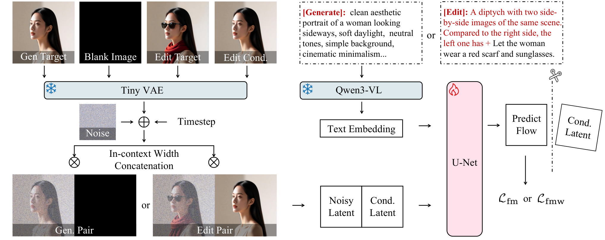

*Figure 2 · [Image source](https://arxiv.org/abs/2603.28713)*

### LaDe

**First paper submission:** 2026-03-18 · [Architecture card](../models/dit.md#lade)

LaDe generates editable, layered graphic designs (e.g. an advertisement as separate background, subject and text layers) from a short prompt, rather than a single flattened image. A GPT-4o-mini prompt expander turns a brief request into a structured description (scene, per-layer captions, design type) encoded by FlanT5-XXL; an 11B latent diffusion transformer with a novel 4D RoPE positional scheme -- spanning spatial coordinates, layer index and a token-role flag -- then jointly denoises the composited design and each of its RGBA layers, decoded through a VAE fine-tuned to reconstruct alpha channels. Setting the number of layers to zero reduces the same model to plain text-to-image generation, and the model also supports the reverse task of decomposing an existing design image into its constituent layers.

[Paper](https://arxiv.org/abs/2603.17965) · GitHub: no author-linked repository found

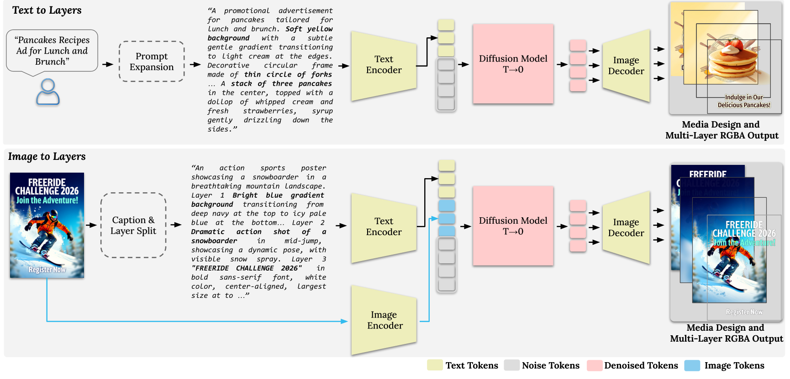

*Figure 5 · [Image source](https://arxiv.org/abs/2603.17965)*

### DREAM

**First paper submission:** 2026-03-03 · [Architecture card](../models/unified.md#dream)

DREAM unifies text-image contrastive representation learning and text-to-image generation in one encoder, which is normally difficult because contrastive alignment wants mostly-visible tokens while generative modeling wants heavily-masked ones. Its 'Masking Warmup' schedule shifts the center of the per-step masking-ratio distribution from low to high over roughly 36 epochs of training so that both low- and high-masking regimes coexist throughout training, letting a single MAR-style ViT encoder and FLUID-style decoder serve both a CLIP contrastive loss (via a CLIP-style text encoder) and a diffusion generation loss (via a frozen T5-XXL text encoder and a six-layer diffusion MLP head predicting Stable Diffusion VAE latents). At inference, 'Semantically Aligned Decoding' spawns several partially-decoded candidates and uses the model's own encoder to score and select the best trajectory from as little as 12.5% of the image decoded.

[Paper](https://arxiv.org/abs/2603.02667) · GitHub: no author-linked repository found

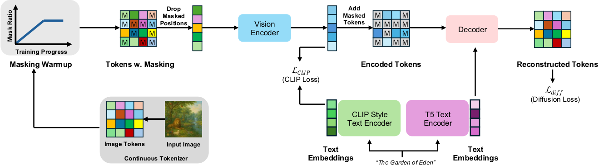

*Figure 2 · [Image source](https://arxiv.org/abs/2603.02667)*

### TerraDiT

**First paper submission:** 2026-03-02 · [Architecture card](../models/dit.md#terradit)

TerraDiT is a diffusion transformer trained from scratch for text-to-satellite-image synthesis, aimed at replacing the dense pixel-level layout maps used by prior remote-sensing generators with lightweight point queries. The base TerraDiT-XL/2-alpha model follows a SiT-style DiT design (28 blocks, hidden size 1152, patch size 2) conditioned on LongCLIP text embeddings of GPT-4o-generated satellite-image captions. A second variant, TerraDiT-XL/2-Sigma, adds an Adaptive Local Attention block that lets a small number of user-supplied point locations (with semantic tags) steer generation: a MetaRBF module turns each point into a spatial prior that multiplicatively regularizes the block's cross-attention map, giving spatial control without a dense conditioning map.

[Paper](https://arxiv.org/abs/2603.02172) · [GitHub](https://github.com/mvrl/TerraDiT)

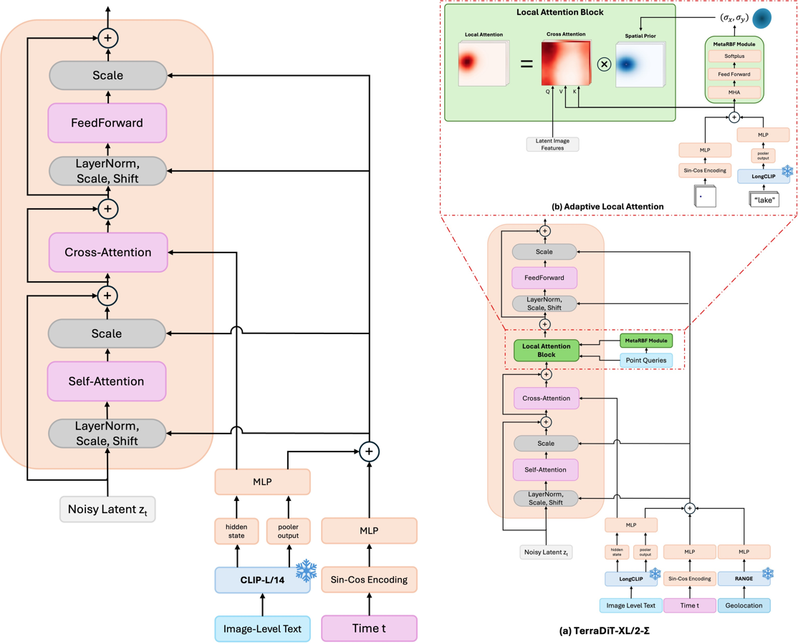

*Figure 3 · [Image source](https://arxiv.org/abs/2603.02172)*

### LLaDA-o

**First paper submission:** 2026-03-01 · [Architecture card](../models/unified.md#llada-o)

LLaDA-o extends the LLaDA masked-diffusion language model into a unified multimodal system by decoupling understanding and generation into two diffusion processes that nonetheless share one attention backbone, rather than bolting a separate diffusion decoder onto a frozen LLM. A discrete masked-diffusion 'understanding expert', initialized from LLaDA-8B-Instruct, handles text and visual tokens for comprehension tasks, while a continuous rectified-flow 'generation expert' -- initialized from the same architecture with newly added time-embedding parameters -- denoises FLUX-VAE image latents for text-to-image generation. The two experts interact only through a shared, efficient attention mechanism (intra-modality bidirectional attention) that keeps cross-modal conditioning global while avoiding the training conflicts the authors report from a single shared token stream.

[Paper](https://arxiv.org/abs/2603.01068) · [GitHub](https://github.com/ML-GSAI/LLaDA-o)

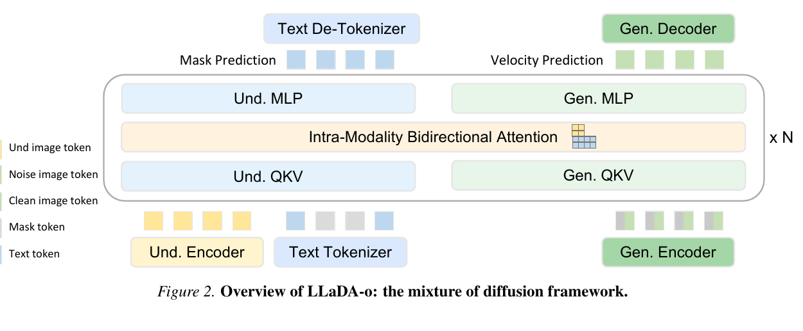

*Figure 2 (PDF p. 4) · [Image source](https://arxiv.org/abs/2603.01068)*

### TMDM-3B

**First paper submission:** 2026-02-25 · [Architecture card](../models/masked.md#tmdm-3b)

This paper conducts a systematic, large-scale study of the design space of tri-modal (text, image, audio) masked diffusion models -- scaling laws, noise schedules and batch-size effects -- and trains a 3B-parameter model (the paper's Section 7.1 calls it the 'Unified 3B Tri-modal MDM') from scratch for 1M steps on 6.4T tokens as its main empirical vehicle. The model packs text, image-caption and audio-transcription sequences and denoises them with one bidirectional transformer under a shared masking schedule, supporting conditional generation across modalities including text-to-image generation, image captioning, text-to-speech and automatic speech recognition from a single set of weights.

[Paper](https://arxiv.org/abs/2602.21472) · GitHub: no author-linked repository found

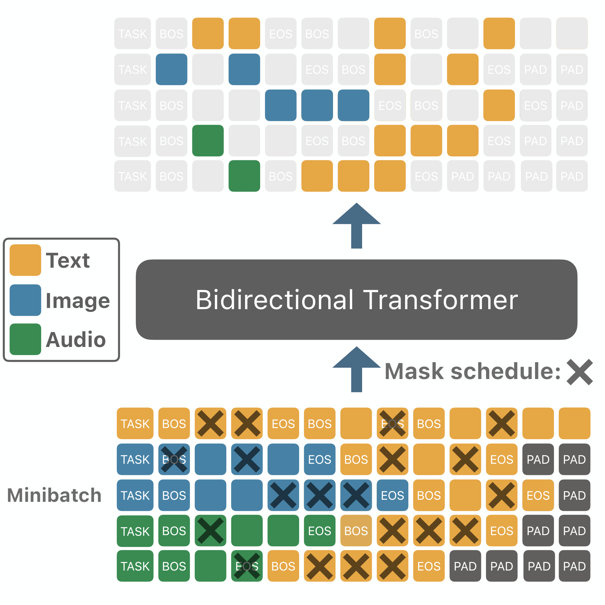

*Figure 2 · [Image source](https://arxiv.org/abs/2602.21472)*

### BitDance

**First paper submission:** 2026-02-15 · [Architecture card](../models/continuous-ar.md#bitdance)

BitDance (ByteDance with CUHK and other institutions) is an autoregressive image generator whose visual tokens are binary vectors from a lookup-free quantization tokenizer with vocabularies up to 2^256 states. Because a softmax over that many indices is impractical, a small DiT-style diffusion head treats each token as a vertex of a hypercube, generates it with rectified-flow sampling in continuous space conditioned on the transformer's hidden state, and snaps the result back to ±1. The same head samples a whole p×p patch of tokens at once (next-patch diffusion), under a block-wise causal mask, so many tokens are produced per step. For text-to-image generation a 14B model initialized from Qwen3-14B serves as both text encoder and image generator, uses a 16×-downsampling tokenizer and generates up to 1024×1024 images, with 16 or, after a short distillation stage, 64 tokens per step; the paper reports over 30× speedup over prior next-token AR models at 1024px.

[Paper](https://arxiv.org/abs/2602.14041) · [GitHub](https://github.com/shallowdream204/BitDance) · [Model card](https://huggingface.co/shallowdream204/BitDance-14B-64x)

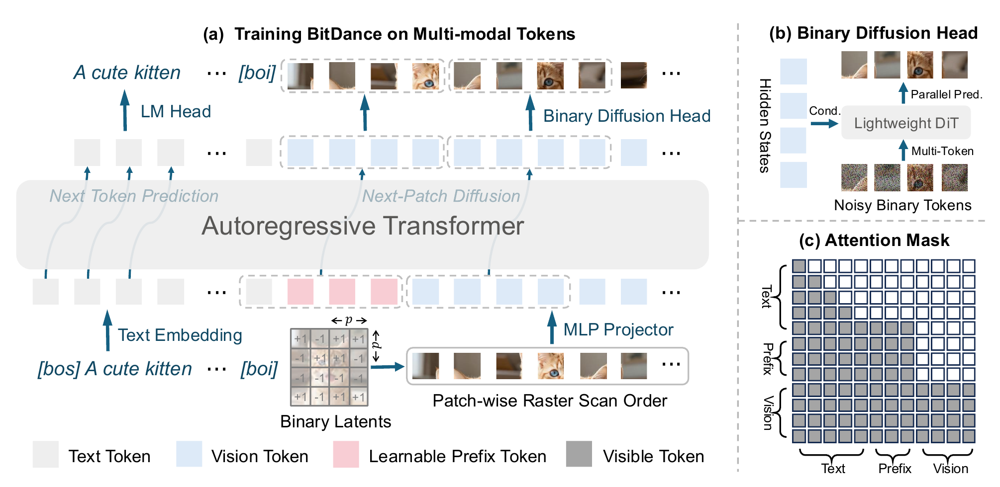

*Figure 4 (PDF p. 6) · [Image source](https://arxiv.org/abs/2602.14041)*

### DeepGen 1.0

**First paper submission:** 2026-02-12 · [Architecture card](../models/unified.md#deepgen-1)

DeepGen 1.0 is a compact, 5B-parameter unified model for text-to-image generation and editing that the authors position against much larger unified models (reporting gains over the 80B HunyuanImage on the WISE benchmark). Rather than relying on the VLM's final-layer output alone, its Stacked Channel Bridging (SCB) framework samples hidden states from six layers spanning the low, middle and high depth of a Qwen2.5-VL-3B backbone, lets them interact with a set of learnable 'think tokens' through self-attention as an implicit chain-of-thought, and fuses the selected states through a channel-wise concatenation, MLP and Transformer connector before handing them to an SD3.5-Medium (2B) diffusion transformer decoder. Editing is supported by concatenating a reference image's VAE latents with the target image's noise tokens in the DiT input sequence.

[Paper](https://arxiv.org/abs/2602.12205) · GitHub: no author-linked repository found

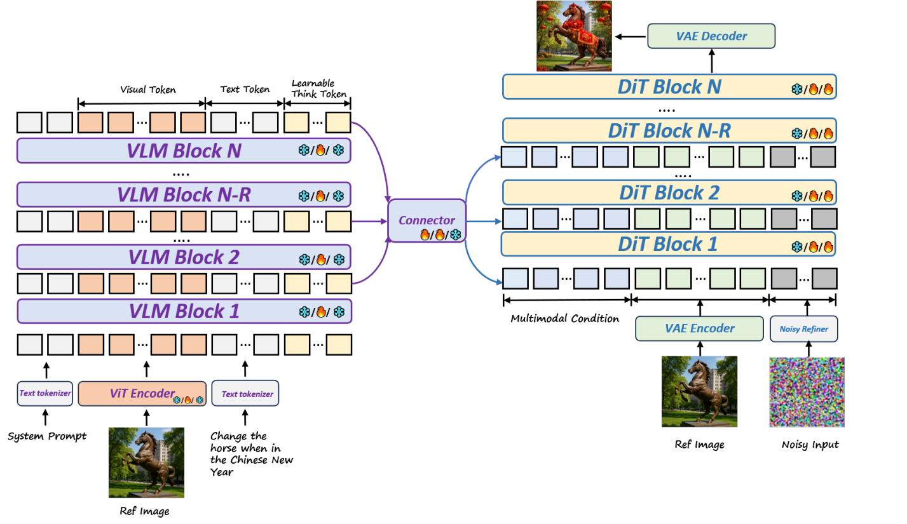

*Figure 3 · [Image source](https://arxiv.org/abs/2602.12205)*

### DuoGen

**First paper submission:** 2026-01-31 · [Architecture card](../models/unified.md#duogen)

DuoGen (NVIDIA) is a unified system for interleaved text-and-image generation: producing multi-step, multi-image sequences such as illustrated how-to instructions rather than a single image per prompt. A pretrained multimodal LLM (Qwen2.5-VL-7B) reads the conversation and previously generated images and decides, token by token, whether to keep writing text or trigger image synthesis; when it does, a diffusion transformer initialized from a video-generation model (Cosmos Predict 2.5) renders the next image conditioned on the MLLM's hidden states and on all prior images in the sequence, stacked as VAE latents along a temporal axis. The paper argues that a video-pretrained backbone gives better cross-image visual consistency than an image-only DiT, and trains the system in two stages that first teach the MLLM when to generate images and then align the connector and DiT to the MLLM on large-scale image/video transition data.

[Paper](https://arxiv.org/abs/2602.00508) · [Project](https://research.nvidia.com/labs/dir/duogen/) · GitHub: no author-linked repository found

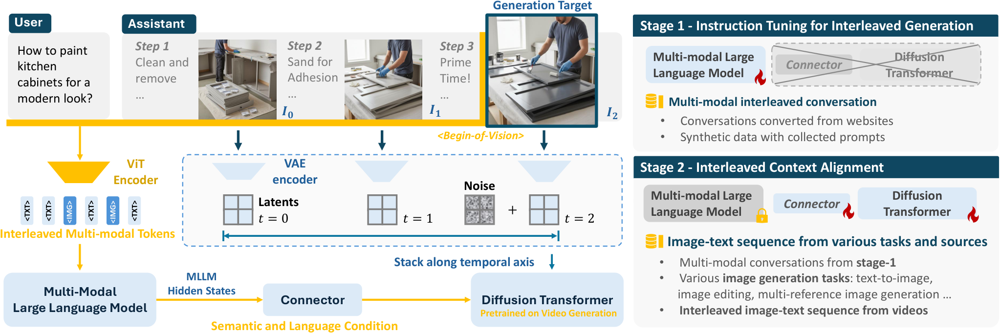

*Figure 3 · [Image source](https://arxiv.org/abs/2602.00508)*

### LINA

**First paper submission:** 2026-01-30 · [Architecture card](../models/continuous-ar.md#lina)

LINA studies how to design compute-efficient linear attention for continuous-token autoregressive text-to-image models, an approach otherwise bottlenecked by high computational cost. Through a systematic scaling analysis the authors find that division-based (not subtraction-based) normalization scales better for linear generative transformers, that depthwise convolution for locality is important for autoregressive image generation, and they extend gating mechanisms from causal to bidirectional linear attention with a new KV gate that assigns token-wise memory weights similar to forget gates in language models. Built on these findings, LINA is a full text-to-image system generating high-fidelity 1024x1024 images, achieving 2.18 FID on class-conditional ImageNet and 0.74 GenEval, with a single linear-attention module cutting FLOPs by about 61% versus softmax attention.

[Paper](https://arxiv.org/abs/2601.22630) · [GitHub](https://github.com/techmonsterwang/LINA)

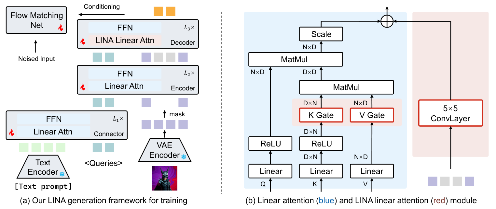

*Figure 2 · [Image source](https://arxiv.org/abs/2601.22630)*

### AR-Omni

**First paper submission:** 2026-01-25 · [Architecture card](../models/unified.md#ar-omni)

AR-Omni is a unified autoregressive model for 'omni' multimodal understanding and generation, handling text, image and speech within one Transformer decoder and shared token vocabulary rather than routing modalities to separate expert modules. Initialized from the Anole interleaved image-text model and extended to speech, it addresses modality imbalance with task-aware loss reweighting, improves visual quality with a perceptual alignment loss, and manages the stability-creativity trade-off in generation with finite-state decoding. The paper reports strong performance across text, image and speech tasks while keeping real-time capability, including a 0.88 real-time factor for speech generation.

[Paper](https://arxiv.org/abs/2601.17761) · GitHub: no author-linked repository found

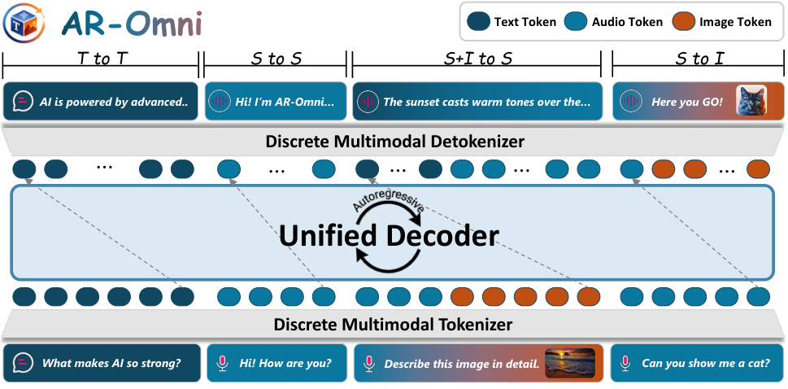

*Figure 1 · [Image source](https://arxiv.org/abs/2601.17761)*

### Self-E

**First paper submission:** 2025-12-26 · [Architecture card](../models/efficient.md#self-e)

Self-E (Self-Evaluating Model) is presented as the first from-scratch, any-step text-to-image model: a single trained network that works across the full range of inference step counts, from ultra-fast few-step sampling to high-quality 50-step sampling, without pretrained-teacher distillation. It combines instantaneous local supervision (standard denoising loss) with a self-driven global matching objective in which the model evaluates and refines its own generated samples, unlike diffusion/flow-matching models that rely solely on local supervision or distillation methods that require a separate teacher. The authors report performance that improves monotonically with more inference steps while remaining competitive with state-of-the-art flow-matching models at 50 steps.

[Paper](https://arxiv.org/abs/2512.22374) · GitHub: no author-linked repository found

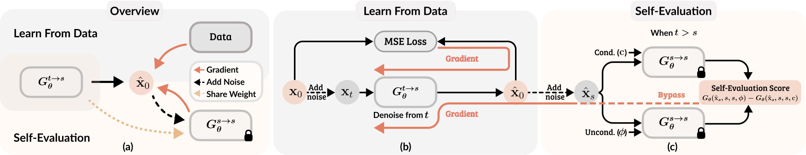

*Figure 2 · [Image source](https://arxiv.org/abs/2512.22374)*

### PS-VAE

**First paper submission:** 2025-12-19 · [Architecture card](../models/unified.md#ps-vae)

PS-VAE addresses two obstacles in adapting representation-encoder features (rather than plain VAE latents) as generative latents: the discriminative feature space is poorly regularized, causing off-manifold samples with inaccurate structure, and the encoder's weak pixel reconstruction limits fine-grained geometry and texture. The paper introduces a semantic-pixel reconstruction objective that compresses both semantic content and fine-grained detail into a compact 96-channel, 16x16-downsampled latent, then builds a unified text-to-image and image-editing model on top of it. The authors report state-of-the-art reconstruction, faster convergence and substantial gains on both text-to-image and editing benchmarks compared to other feature spaces.

[Paper](https://arxiv.org/abs/2512.17909) · [Project](https://jshilong.github.io/PS-VAE-PAGE/) · GitHub: no author-linked repository found

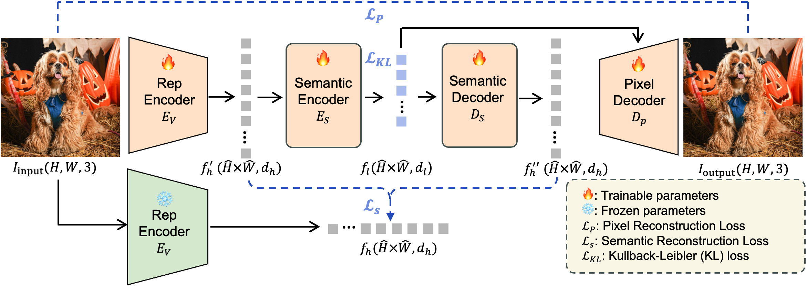

*Figure 5 · [Image source](https://arxiv.org/abs/2512.17909)*

### SVG-T2I

**First paper submission:** 2025-12-12 · [Architecture card](../models/dit.md#svg-t2i)

SVG-T2I scales the SVG (Self-supervised representations for Visual Generation) framework to full text-to-image synthesis, training a diffusion transformer entirely within a visual-foundation-model (DINOv3) feature space rather than a traditional VAE latent space. The authors argue this validates the representational power of self-supervised visual features for generative modeling, and release the complete stack — autoencoder, generation model, training, inference and evaluation pipelines, and pretrained weights — reaching competitive GenEval and DPG-Bench scores.

[Paper](https://arxiv.org/abs/2512.11749) · [GitHub](https://github.com/KlingTeam/SVG-T2I)

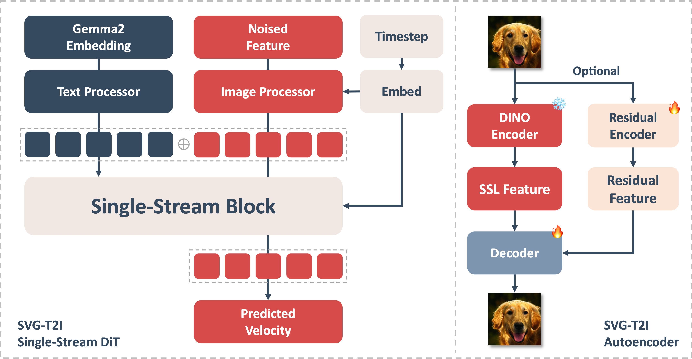

*Figure 2 · [Image source](https://arxiv.org/abs/2512.11749)*

### ProxT2I

**First paper submission:** 2025-11-24 · [Architecture card](../models/dit.md#proxt2i)

ProxT2I proposes a text-to-image diffusion model built on backward (implicit) discretizations of the reverse diffusion process rather than the forward, explicit discretizations used by standard score-based samplers. It replaces the learned score function with learned, conditional proximal operators, which the authors argue gives more stable, efficient sampling in few steps, and further tunes the resulting samplers with reinforcement learning against human-preference reward models. The paper trains its U-ViT backbone from scratch on a newly introduced 15M-image human-portrait dataset with fine-grained captions (LAION-Face-T2I-15M), reporting sampling efficiency and preference-alignment gains over score-based baselines at comparable or lower compute and model size.

[Paper](https://arxiv.org/abs/2511.18742) · GitHub: no author-linked repository found

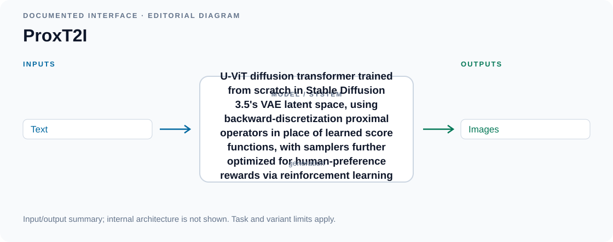

*Editorial input/output diagram · [Image source](https://arxiv.org/abs/2511.18742)*

### oboro:

**First paper submission:** 2025-11-11 · [Architecture card](../models/dit.md#oboro)

oboro: is a text-to-image foundation model built from scratch in Japan under the METI/NEDO GENIAC program, trained only on copyright-cleared images to support the country's anime and creative industries. Its Multi-Multi-Head (MMH) attention assigns a different number of attention heads to each DiT block (from 8/16 heads in early layers up to 24/48 in later ones) to encourage role differentiation between layers, and the model is designed to reach high image quality from a comparatively limited, deduplicated dataset (Megalith-10m with Florence-2 captions). The authors present it as the first fully Japan-developed, open-source, commercially oriented image-generation model, releasing weights and inference code.

[Paper](https://arxiv.org/abs/2511.08168) · [Model card](https://huggingface.co/aihub-geniac/oboro) · GitHub: no author-linked repository found

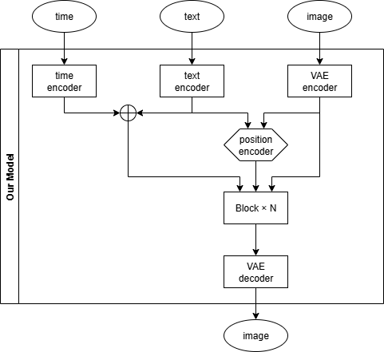

*Figure 1 · [Image source](https://arxiv.org/abs/2511.08168)*

### FIBO

**First paper submission:** 2025-11-10 · [Architecture card](../models/dit.md#fibo)

FIBO (Bria AI) is an open-source text-to-image model trained exclusively on long, structured JSON captions with fine-grained attributes, aiming to close the gap between the brief prompts most models are trained on and the richer control professional users want. Its DimFusion mechanism injects intermediate-layer representations from the SmolLM3-3B text encoder along the embedding dimension rather than concatenating them into the token sequence, keeping sequence length fixed while improving prompt alignment. The authors also introduce a Text-as-a-Bottleneck Reconstruction protocol to evaluate controllability, and report state-of-the-art prompt alignment among open-source models; weights are published on Hugging Face and code on GitHub.

[Paper](https://arxiv.org/abs/2511.06876) · [GitHub](https://github.com/Bria-AI/FIBO) · [Model card](https://huggingface.co/briaai/FIBO)

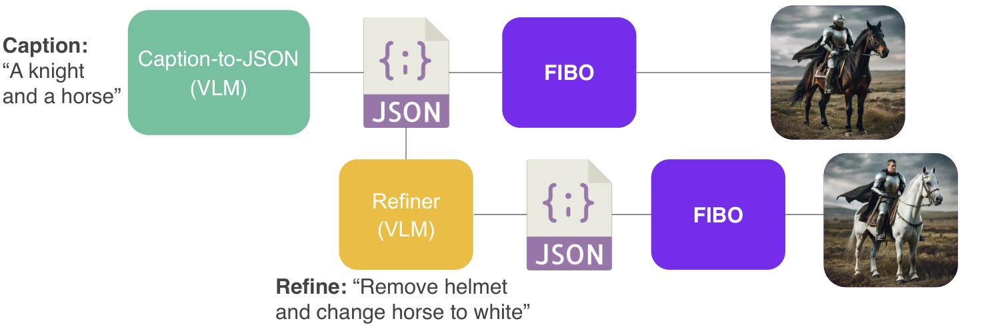

*Figure 2 · [Image source](https://arxiv.org/abs/2511.06876)*

### Muddit

**First paper submission:** 2025-05-29 · [Architecture card](../models/unified.md#muddit)

Muddit ("Meissonic II") is a second-generation unified discrete diffusion model for fast, parallel generation across text and image modalities. Unlike prior unified diffusion models trained from scratch, it integrates the strong visual priors of the pretrained Meissonic text-to-image backbone with a lightweight text decoder, enabling text-to-image generation, image-to-text captioning and visual question answering under one non-autoregressive architecture. The authors report Muddit matches or exceeds significantly larger autoregressive unified models in quality and efficiency, arguing that discrete diffusion with strong visual priors is a scalable backbone for unified generation.

[Paper](https://arxiv.org/abs/2505.23606) · [GitHub](https://github.com/M-E-AGI-Lab/Muddit) · [Model card](https://huggingface.co/MeissonFlow/Muddit)

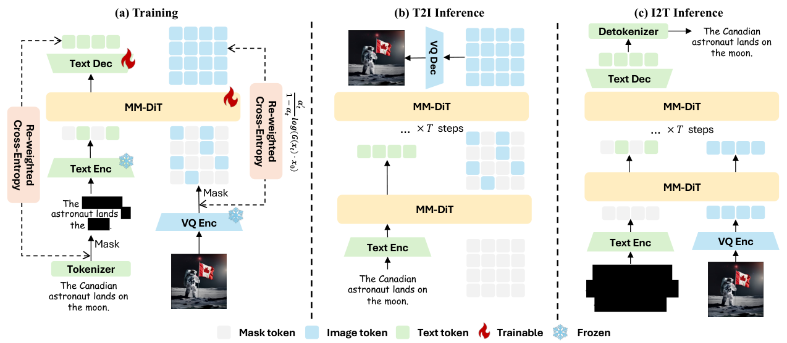

*Figure 2 · [Image source](https://arxiv.org/abs/2505.23606)*

### FlowTok

**First paper submission:** 2025-03-13 · [Architecture card](../models/dit.md#flowtok)

FlowTok is a minimal framework for cross-modal generation that flows directly between text and image modalities through flow matching, rather than treating text as a conditioning signal that guides denoising from Gaussian noise. Images are encoded into a compact 1D token representation (built on TA-TiTok), reducing the latent space by 3.3x at 256px resolution compared to 2D latents and removing the need for complex conditioning or noise scheduling. The same formulation extends naturally to image-to-text generation, giving one lightweight model both directions with fewer training resources and faster sampling than comparable diffusion-based systems.

[Paper](https://arxiv.org/abs/2503.10772) · [GitHub](https://github.com/TACJu/FlowTok)

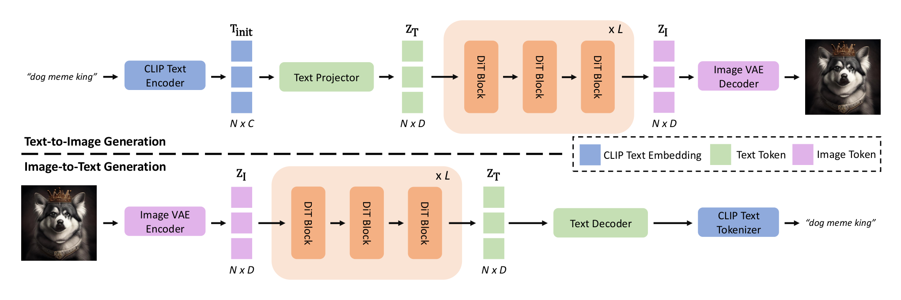

*Figure 4 · [Image source](https://arxiv.org/abs/2503.10772)*

### DiT-Air

**First paper submission:** 2025-03-13 · [Architecture card](../models/dit.md#dit-air)

DiT-Air (Apple) is an empirical study of architectural choices for text-to-image diffusion transformers — comparing PixArt-style, MMDiT-style and a standard DiT that simply concatenates text and noise inputs. The authors find the standard DiT variant matches specialized architectures while being far more parameter-efficient at scale, and use a layer-wise parameter-sharing strategy to shrink an MMDiT-equivalent model by 66% with little performance impact. Building on an analysis of text encoders and VAEs, they introduce DiT-Air and the smaller DiT-Air-Lite, which reach state-of-the-art GenEval and T2I-CompBench results after supervised and reward fine-tuning.

[Paper](https://arxiv.org/abs/2503.10618) · GitHub: no author-linked repository found

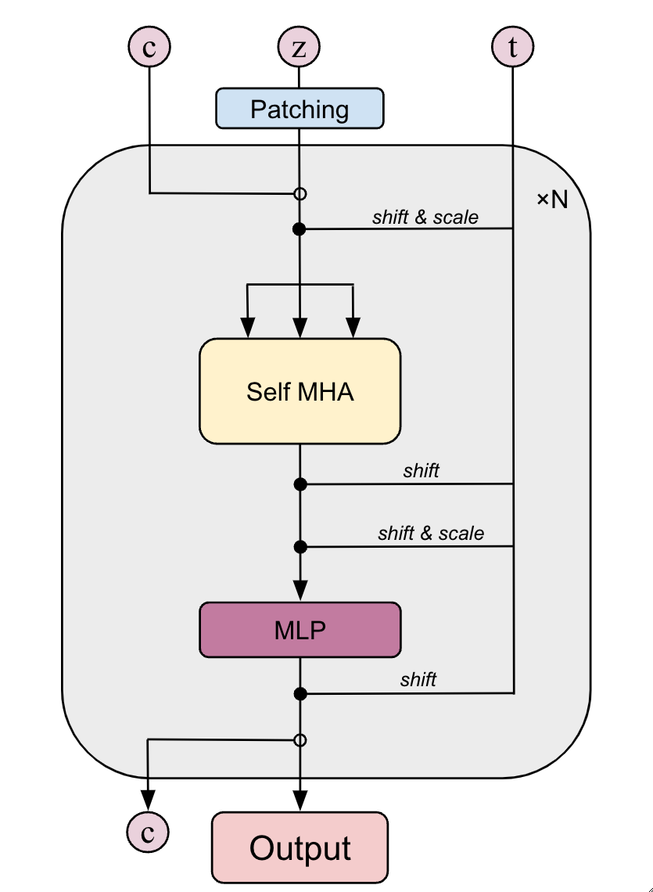

*Figure 4 (Simple DiT variant) · [Image source](https://arxiv.org/abs/2503.10618)*

### MaskGen

**First paper submission:** 2025-01-13 · [Architecture card](../models/masked.md#maskgen)

MaskGen is a family of text-to-image masked generative models trained exclusively on publicly available data, introduced alongside TA-TiTok, a text-aware 1-dimensional image tokenizer. TA-TiTok injects textual information during tokenizer decoding and supports either discrete or continuous 1D tokens without the two-stage distillation used by prior 1D tokenizers. MaskGen combines this compact tokenizer with an MM-DiT-style masked prediction backbone, aesthetic-score conditioning and caption recaptioning, and the authors report performance competitive with models trained on proprietary data despite using only open datasets.

[Paper](https://arxiv.org/abs/2501.07730) · [Project](https://tacju.github.io/projects/maskgen) · GitHub: no author-linked repository found

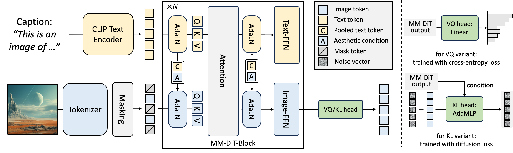

*Figure 3 · [Image source](https://arxiv.org/abs/2501.07730)*
