# Generative adversarial networks

<!-- Generated by scripts/catalog.py from data/models.json and data/figures.json. Edit the JSON, then regenerate. -->

[← All models](../README.md#models)

**46 models · Reviewed 2026-09-29**

Primary-source figures and labeled input/output diagrams. [Figure credits](../assets/architectures/CREDITS.md).

Model index and modality key

**Inputs and outputs:** T = text, I = image, V = video, A = audio. Image input usually means an optional reference, source or condition image. **Interaction:** `generation` = text-to-image synthesis; `editing` = synthesis plus documented text-guided editing of an input image. See the [methodology](../docs/methodology.md#modalities-and-interaction).

Dates refer to papers or announcements, not necessarily model releases.

| Model | Source date | Input → output | Interaction |
| --- | --- | --- | --- |
| [ALR-GAN](#alr-gan) | 2023-04-13 | T → I | generation |
| [AttnGAN](#attngan) | 2017-11-28 | T → I | generation |
| [Aurora (Sparse MoE GAN)](#aurora-moe-gan) | 2023-09-07 | T → I | generation |
| [BLM-SGAN](#blm-sgan) | 2026-06-07 | T → I | generation |
| [C4Synth](#c4synth) | 2018-09-20 | T → I | generation |
| [CAGAN](#cagan) | 2021-04-26 | T → I | generation |
| [CanvasGAN](#canvasgan) | 2018-10-05 | T → I | generation |
| [ChatPainter](#chatpainter) | 2018-02-22 | T → I | generation |
| [CI-GAN](#ci-gan) | 2021-08-03 | T → I | generation |
| [ControlGAN](#controlgan) | 2019-09-16 | T → I | generation |
| [CPGAN](#cpgan) | 2019-12-18 | T → I | generation |
| [CRD-CGAN](#crd-cgan) | 2021-07-28 | T → I | generation |
| [DAE-GAN](#dae-gan) | 2021-08-27 | T → I | generation |
| [DF-GAN](#df-gan) | 2020-08-13 | T → I | generation |
| [DiverGAN](#divergan) | 2021-11-17 | T → I | generation |
| [DM-GAN](#dm-gan) | 2019-04-02 | T → I | generation |
| [DR-GAN](#dr-gan) | 2022-04-17 | T → I | generation |
| [DSE-GAN](#dse-gan) | 2022-09-03 | T → I | generation |
| [DTGAN](#dtgan) | 2020-11-05 | T → I | generation |
| [FA-GAN](#fa-gan) | 2021-09-02 | T → I | generation |
| [GALIP](#galip) | 2023-01-30 | T → I | generation |
| [GAN-INT-CLS](#gan-int-cls) | 2016-05-17 | T → I | generation |
| [GAWWN](#gawwn) | 2016-10-08 | T → I | generation |
| [GigaGAN](#gigagan) | 2023-03-09 | T → I | generation |
| [GR-GAN](#gr-gan) | 2022-05-23 | T → I | generation |
| [HDGAN](#hdgan) | 2018-02-26 | T → I | generation |
| [Hierarchical text-to-image via inferred semantic layout (Hong et al.)](#hong-semantic-layout) | 2018-01-16 | T → I | generation |
| [LAFITE](#lafite) | 2021-11-27 | T → I | generation |
| [MirrorGAN](#mirrorgan) | 2019-03-14 | T → I | generation |
| [MSMT-GAN](#msmt-gan) | 2021-10-15 | T → I | generation |
| [Obj-GAN](#obj-gan) | 2019-02-27 | T → I | generation |
| [OP-GAN](#op-gan) | 2019-10-29 | T → I | generation |
| [RAT-GAN](#rat-gan) | 2022-04-22 | T → I | generation |
| [SD-GAN](#sd-gan) | 2019-04-02 | T → I | generation |
| [SDN (Symmetrical Distillation Networks)](#sdn-t2i) | 2018-08-21 | T → I | generation |
| [SegAttnGAN](#segattngan) | 2020-05-25 | T → I | generation |
| [SSA-GAN](#ssa-gan) | 2021-04-01 | T → I | generation |
| [StackGAN](#stackgan) | 2016-12-10 | T → I | generation |
| [StackGAN++ (StackGAN-v2)](#stackgan-v2) | 2017-10-19 | T → I | generation |
| [StyleGAN-T](#stylegan-t) | 2023-01-23 | T → I | generation |
| [TAC-GAN](#tac-gan) | 2017-03-19 | T → I | generation |
| [TediGAN](#tedigan) | 2020-12-06 | T, I → I | editing |
| [Text-SeGAN](#text-segan) | 2018-12-12 | T → I | generation |
| [TIME (Text and Image Mutual-Translation)](#time-gan) | 2020-05-27 | T → I | generation |
| [TReCS](#trecs) | 2020-11-07 | T → I | generation |
| [XMC-GAN](#xmc-gan) | 2021-01-12 | T → I | generation |

## Architectures

### ALR-GAN

Multi-stage GAN adding an Adaptive Layout Refinement (ALR) module at each stage that aligns the synthesized image's object/background layout with the corresponding real image's layout during training, followed by a Layout Visual Refinement (LVR) loss over the aligned regions.

[Paper](https://arxiv.org/abs/2304.06297)

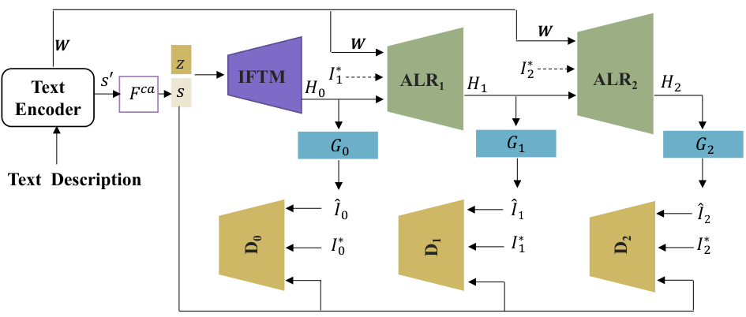

*Figure 2 · [Source](https://arxiv.org/abs/2304.06297)*

Details

**Input → output:** T → I · **Interaction:** generation

A text encoder and Conditioning Augmentation seed an Initial Feature Transition Module (IFTM), after which each ALR module (paper Fig. 3) builds a semantics-similarity matrix between word embeddings and image regions and a text-vision matrix to match the synthesized layout structure to the real image's layout, using real images only at training time; the LVR loss (perception and style refinement) then refines visual detail inside the aligned layout regions (Fig. 2, "Architecture of proposed ALR-GAN"). The ALR+LVR combination is also shown as a drop-in addition to DM-GAN, DAE-GAN and DR-GAN backbones in ablations. Evaluated on CUB-Bird and MS-COCO. No official code repository was found.

### AttnGAN

Multi-stage attentional GAN that generates 64×64 to 256×256 images, with word-level attention at each refinement stage and a DAMSM image–text matching loss.

[Paper](https://arxiv.org/abs/1711.10485) · [GitHub](https://github.com/taoxugit/AttnGAN)

*Figure 2 · [Source](https://arxiv.org/abs/1711.10485)*

Details

**Input → output:** T → I · **Interaction:** generation

A bidirectional LSTM text encoder yields word features and a sentence vector; the sentence vector (via Conditioning Augmentation) and noise start the first stage, and each later stage attends over word features to compute word-context vectors for image sub-regions (paper Figure 2). The Deep Attentional Multimodal Similarity Model pairs the text encoder with an Inception-v3 image encoder to provide a fine-grained word–region matching loss during training. Evaluated on CUB and MS COCO.

**License:** code: MIT.

### Aurora (Sparse MoE GAN)

Text-to-image GAN whose generator blocks route feature points through a sparsely-activated mixture-of-experts, selected per pixel by a router conditioned on the text-integrated global latent code.

[Paper](https://arxiv.org/abs/2309.03904) · [GitHub](https://github.com/zhujiapeng/Aurora)

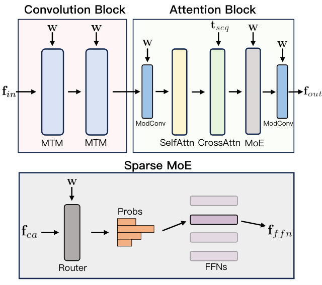

*Figure 2 · [Source](https://arxiv.org/abs/2309.03904)*

Details

**Input → output:** T → I · **Interaction:** generation

Each unit generative block combines convolution and self-/cross-attention with a Sparse MoE feed-forward layer whose router assigns each spatial feature point to the most suitable expert, conditioned on the noise-and-text global latent code rather than the text alone (paper Figure 2, "Illustration of a unit generative block in our proposed Aurora"; Figure 6 visualizes the learned per-pixel expert routing). Trained on LAION-2B-en and COYO-700M at 64x64 resolution; the released checkpoint only covers this base resolution and training code was not released at review time.

### BLM-SGAN

One-stage GAN in which a pre-trained BERT text encoder (replacing the LSTM/RNN encoders of earlier text-to-image GANs) supplies sentence and word features to 7 stacked Semantic-Spatial Aware Convolutional (SSACN) generator blocks, paired with a discriminator that concatenates image and text features under a Matching-Aware Gradient Penalty.

BLM-SGAN (Bidirectional Language-Modeling Semantic-Spatial GAN) revisits the standard SSA-GAN-style one-stage text-to-image GAN pipeline and replaces its sequential LSTM-based text encoder with BERT, arguing that bidirectional attention over the full caption yields richer contextual word and sentence features than left-to-right recurrent encoding. Sentence features modulate a stack of 7 SSACN blocks that progressively upsample a noise vector to a 256x256 image, while word features are fed spatially to the same blocks and to the discriminator; the discriminator is trained with a Matching-Aware Gradient Penalty. Evaluated on the CUB bird dataset, the model reaches an Inception Score of 5.45, ahead of prior GAN baselines such as SSA-GAN, DF-GAN and AttnGAN under the same protocol.

[Paper](https://arxiv.org/abs/2606.08847) · [GitHub](https://github.com/haidy-maher/BLM-SGAN-Text-to-Image-Generation)

*Figure 2 · [Source](https://arxiv.org/abs/2606.08847)*

Details

**Input → output:** T → I · **Interaction:** generation

Paper Figure 2 shows the generator (BERT encoder -> FC -> reshape 4x4x512 -> 7x SSACN blocks -> conv/tanh -> 256x256 image) and discriminator (conv stack with a downblock and matching-aware gradient penalty loss). Trained and evaluated only on CUB-200-2011 (11,788 bird images, 10 captions each) for 156 epochs. No parameter counts are given. The paper links its GitHub repository directly.

### C4Synth

Multi-caption text-to-image GAN that consumes several captions in sequence, with an LSTM captioning network enforcing cross-caption cycle consistency.

[Paper](https://arxiv.org/abs/1809.10238) · GitHub: no author-linked repository found

*Figure 3 · [Source](https://arxiv.org/abs/1809.10238)*

Details

**Input → output:** T → I · **Interaction:** generation

Cascaded-C4Synth grows a convolutional backbone block per caption (three in the experiments), each branching into a generator, a discriminator and a Cross-Caption Cycle Consistency Network that must caption the image as the next caption in the cycle, producing 64×64 to 256×256 images (paper Figure 3). Recurrent-C4Synth instead unrolls a single generator over any number of captions with a hidden state initialized from noise (paper Figure 4). Captions are encoded with Structured Joint Embeddings and Conditioning Augmentation. Evaluated on CUB and Oxford-102. No author-linked code repository was found.

**Variants:** Cascaded-C4Synth; Recurrent-C4Synth.

### CAGAN

AttnGAN-based multi-stage generator combining per-stage word-level attention with a squeeze-and-excitation channel attention module, plus an optional local self-attention module.

[Paper](https://arxiv.org/abs/2104.12663)

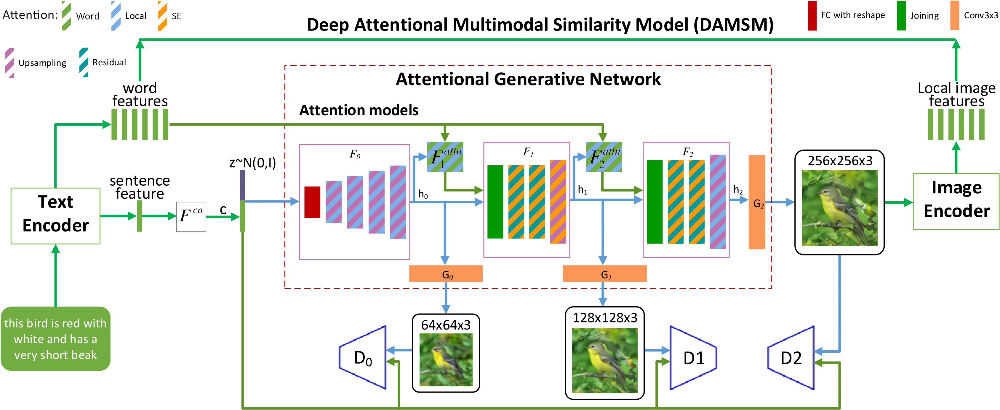

*Figure 2 · [Source](https://arxiv.org/abs/2104.12663)*

Details

**Input → output:** T → I · **Interaction:** generation

The Combined Attention GAN (CAGAN) keeps AttnGAN's multi-stage word-attention generator and DAMSM loss, and adds squeeze-and-excitation (SE) attention to model non-linear inter-channel dependencies at each stage, with spectral normalization for training stability (paper Figure 2, "The architecture of the proposed CAGAN with word, SE, and local attention"). An ablated variant adds local self-attention on top of SE attention. Evaluated on CUB and MS-COCO.

**Variants:** CAGAN (SE); CAGAN (SE + local attention).

### CanvasGAN

Recurrent GAN generator that attends over word features at each step and adds upscaled color patches to a canvas.

[Paper](https://arxiv.org/abs/1810.02833) · GitHub: no author-linked repository found

*Fig. 1 · [Source](https://arxiv.org/abs/1810.02833)*

Details

**Input → output:** T → I · **Interaction:** generation

GloVe word vectors pass through a self-attended bidirectional-GRU visual-semantic embedding trained separately with a pairwise ranking loss against image features. The augmented sentence vector and noise initialize a GRU; at each timestep attention over word encodings drives the next hidden state, from which r, g and b channels are produced, upscaled by a deconvolutional network with residual blocks, and added to the canvas with a learned weight (paper Fig. 1). The discriminator concatenates downsampled image features with the replicated text representation and scores semantic relevance. Trained on Oxford-102 flowers. No author-linked code repository was found.

### ChatPainter

StackGAN-style two-stage GAN (64×64 then 256×256) conditioned on a caption embedding concatenated with an embedding of a question–answer dialogue about the image.

[Paper](https://arxiv.org/abs/1802.08216) · GitHub: no author-linked repository found

*Figure 3 (PDF p. 3) · [Source](https://arxiv.org/abs/1802.08216)*

Details

**Input → output:** T → I · **Interaction:** generation

Caption embeddings come from the pretrained char-CNN-RNN encoder of Reed et al.; dialogue embeddings come either from a Skip-Thought encoding of the collapsed dialogue (non-recurrent) or from a bidirectional LSTM over per-turn Skip-Thought vectors (recurrent). The concatenated embedding passes through Conditioning Augmentation into Stage I and Stage II as in StackGAN (paper Figure 3). Trained on MS COCO captions paired with VisDial dialogues. No author-linked code repository was found.

**Variants:** Non-recurrent dialogue encoder; Recurrent dialogue encoder.

### CI-GAN

Three-stage pipeline that trains an unconditional StyleGAN, inverts it with a cycle-consistent GAN-inversion encoder, then aligns a text encoder to the learned StyleGAN W latent space so captions can be mapped to inversion codes at inference.

[Paper](https://arxiv.org/abs/2108.01361)

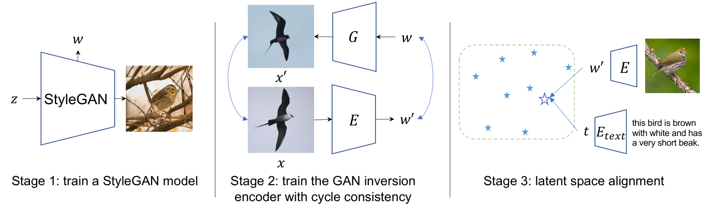

*Figure 2 · [Source](https://arxiv.org/abs/2108.01361)*

Details

**Input → output:** T → I · **Interaction:** generation

Stage 1 trains a StyleGAN generator without any text conditioning; Stage 2 trains a GAN-inversion encoder with a cycle-consistency constraint between image, W code and reconstructed image; Stage 3 aligns text embeddings with the same W space via a visual-linguistic similarity objective, so text-to-image generation happens through text-guided optimization over the inverted latent space rather than direct conditional generation (paper Figure 2, decoupled training flow; Figure 3, testing flow). The paper also shows text-guided manipulation of given images by re-optimizing the latent code, which requires an input image and is distinct from the unconditional text-to-image path. Evaluated on CUB birds and a recipe-to-food-image task against CookGAN.

### ControlGAN

Multi-stage AttnGAN-based generator with word-level spatial and channel-wise attention, trained with a word-level discriminator and a perceptual loss.

[Paper](https://arxiv.org/abs/1909.07083) · [GitHub](https://github.com/mrlibw/ControlGAN)

*Figure 2 · [Source](https://arxiv.org/abs/1909.07083)*

Details

**Input → output:** T → I · **Interaction:** generation

A pretrained bidirectional RNN provides sentence and word features; the augmented sentence feature and noise start the first stage, and each later stage concatenates spatial-attention and channel-wise-attention word-context features with the hidden visual features (paper Figure 2). The word-level discriminator correlates words with image regions to give fine-grained feedback, and a VGG-16 perceptual loss reduces randomness. The paper also shows manipulating its own synthetic images by regenerating with a modified description while preserving text-irrelevant content; this is not editing of arbitrary input images. Evaluated on CUB and MS COCO.

### CPGAN

Coarse-to-fine multi-stage GAN with a memory-attended text parser and an object-aware image encoder feeding a fine-grained conditional discriminator.

[Paper](https://arxiv.org/abs/1912.08562) · [GitHub](https://github.com/dongdongdong666/CPGAN)

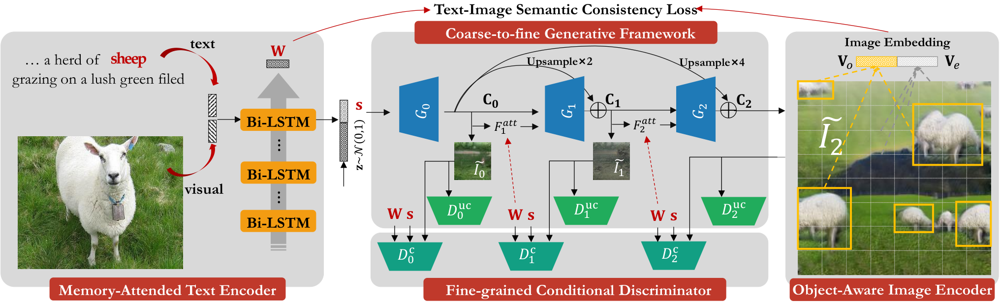

*Figure 2 · [Source](https://arxiv.org/abs/1912.08562)*

Details

**Input → output:** T → I · **Interaction:** generation

CPGAN parses the input text through a customized memory-attended text encoder that retrieves salient visual memory from training images, and parses the synthesized image through an object-aware image encoder built on a pretrained object detector; a fine-grained conditional discriminator (Figure 4, "Fine-grained Conditional Discriminator") gives region- and object-level feedback (paper Figure 2, "Architecture of the proposed CPGAN"). Evaluated on MS-COCO with Inception Score and Semantic Object Accuracy.

**License:** code: MIT.

### CRD-CGAN

Multi-generator conditional GAN that synthesizes K diverse images per caption in parallel and trains them with a relativistic conditional loss and a category-consistency loss to balance diversity against semantic fidelity.

[Paper](https://arxiv.org/abs/2107.13516)

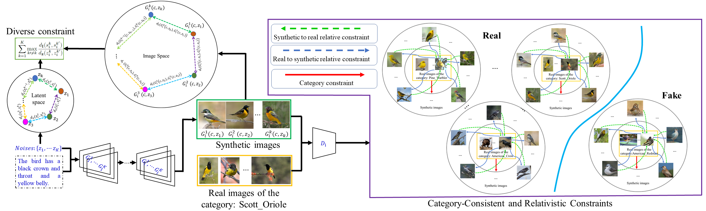

*Figure 2 · [Source](https://arxiv.org/abs/2107.13516)*

Details

**Input → output:** T → I · **Interaction:** generation

K parallel generators (sharing the conditioning text and independent noise) each produce a candidate image; a relativistic conditional loss compares each candidate's realism relative to the others and to matched/mismatched text, and a category-consistency loss keeps every candidate assigned to the same class as the real image (paper Figure 2, "Overview of our proposed framework CRD-CGAN"). Evaluated on CUB, Oxford-102 and MS-COCO 2014. No official code repository was found.

### DAE-GAN

Multi-stage GAN that extracts noun-phrase "aspects" from the caption alongside sentence and word features, then refines the image over several steps with an Aspect-aware Global Refinement (AGR) and Attention-based Local Refinement (ALR) module per step.

[Paper](https://arxiv.org/abs/2108.12141) · [GitHub](https://github.com/hiarsal/DAE-GAN)

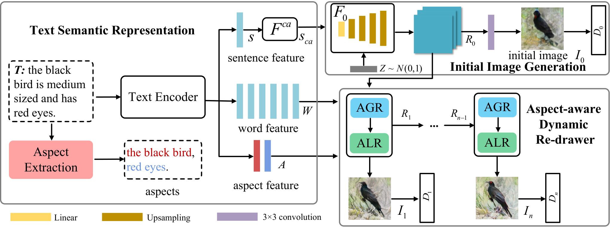

*Figure 2 · [Source](https://arxiv.org/abs/2108.12141)*

Details

**Input → output:** T → I · **Interaction:** generation

A text encoder yields sentence and word features while a separate aspect-extraction step parses the caption into noun-phrase aspects (e.g. "the black bird", "red eyes"); each refinement step's AGR fuses the next aspect globally and ALR attends over word regions locally before the image is upsampled (paper Figure 2, "Overall framework of DAE-GAN"; Figure 3, AGR/ALR architecture). A cause-and-effect study examines sensitivity to aspect ordering. Evaluated on CUB-200 and MS-COCO.

### DF-GAN

Single-stage GAN that generates high-resolution images directly with one generator-discriminator pair, fusing text and image features at each generator block via stacked deep text-image fusion blocks.

[Paper](https://arxiv.org/abs/2008.05865) · [GitHub](https://github.com/tobran/DF-GAN)

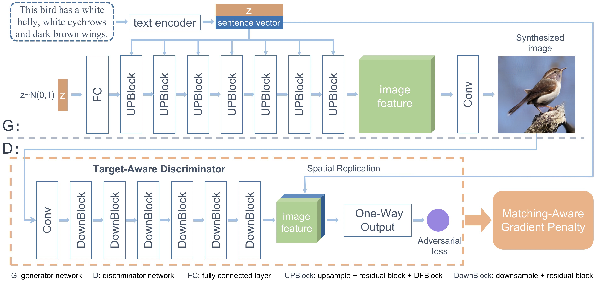

*Figure 2 · [Source](https://arxiv.org/abs/2008.05865)*

Details

**Input → output:** T → I · **Interaction:** generation

Removes the multi-stage backbone and per-stage discriminators used by StackGAN-family models; the generator upsamples through a sequence of UPBlocks that each fuse the sentence vector into image features via affine transformations (paper Figure 2, "The architecture of the proposed DF-GAN"). The discriminator is a target-aware, one-way-output design trained with a matching-aware gradient penalty (MA-GP) for stable single-pair adversarial training. Evaluated on CUB and MS-COCO.

**License:** code: CC BY-NC-SA 4.0.

### DiverGAN

Single-stage GAN with a channel-attention and a pixel-attention module in each residual generator block, a fully-connected image-feature layer for diversity, and Conditional Adaptive Instance-Layer Normalization (CAdaILN) that flexibly linearly-combines instance and layer normalization statistics from the sentence vector.

[Paper](https://arxiv.org/abs/2111.09267)

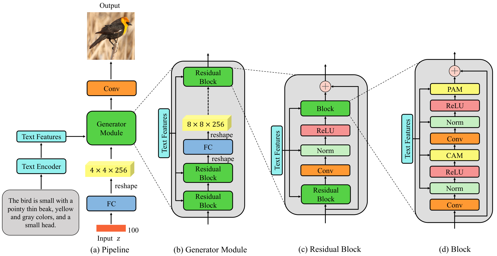

*Figure 2 · [Source](https://arxiv.org/abs/2111.09267)*

Details

**Input → output:** T → I · **Interaction:** generation

Word-level channel-attention (CAM) and pixel-attention (PAM) modules assign per-channel and per-pixel weights matching salient words at each generator block (paper Figure 2, "The overall architecture of the proposed DiverGAN"; Figures 3-4 detail CAM/PAM); CAdaILN (Figure 5) lets the sentence vector learn how much instance- versus layer-normalization to apply, and an extra fully-connected layer before the first convolution increases output diversity for a fixed caption. Evaluated on CUB, Oxford-102 and MS-COCO. No official code repository was found.

### DM-GAN

Initial-image GAN followed by refinement stages that read word features from a gated key–value dynamic memory to refine image features.

[Paper](https://arxiv.org/abs/1904.01310) · [GitHub](https://github.com/MinfengZhu/DM-GAN)

*Figure 2 · [Source](https://arxiv.org/abs/1904.01310)*

Details

**Input → output:** T → I · **Interaction:** generation

A text encoder yields a sentence feature (used with Conditioning Augmentation and noise for the initial image) and word features. Each refinement stage writes word features into memory with a memory-writing gate conditioned on the image, addresses memory slots by similarity to image features, reads value memories, and fuses them into the image features through a response gate before upsampling and residual blocks (paper Figure 2). The paper uses two refinement stages, reaching 256×256, and trains with Conditioning Augmentation and DAMSM losses. Evaluated on CUB and MS COCO.

**License:** code: MIT.

### DR-GAN

Multi-stage GAN whose per-stage Semantic Disentangling Module (SDM) separates word-context features into content-relevant and content-irrelevant parts before fusing them into image features, regularized by a Distribution Normalization Module (DNM) that aligns generated and real image feature distributions.

[Paper](https://arxiv.org/abs/2204.07945) · [GitHub](https://github.com/Tan-H-C/DR-GAN-Distribution-Regularization-for-Text-to-Image-Generation)

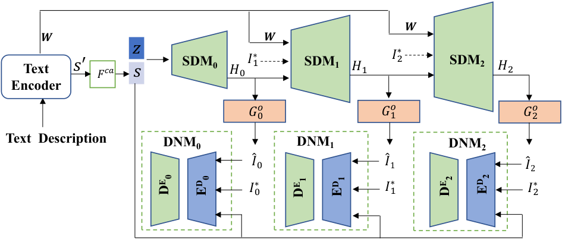

*Figure 1 · [Source](https://arxiv.org/abs/2204.07945)*

Details

**Input → output:** T → I · **Interaction:** generation

Each SDM uses word-level attention to build a word-context matrix and disentangles it into semantically relevant and irrelevant components so only relevant information conditions the image features (paper Fig. 1, "The framework of proposed Distribution Regularization Generative Adversarial Network"; Fig. 2 details the SDM); the DNM at each discriminator stage uses a variational encoder-decoder to regularize the generated-image feature distribution toward the real-image distribution. Evaluated on CUB-Bird and MS-COCO.

### DSE-GAN

Single adversarial-pair generator whose stages are connected by Dynamic Semantic Evolution (DSE) modules that re-derive fresh, generation-feedback-aware text features at every stage instead of reusing the same static word/sentence features throughout.

[Paper](https://arxiv.org/abs/2209.01339)

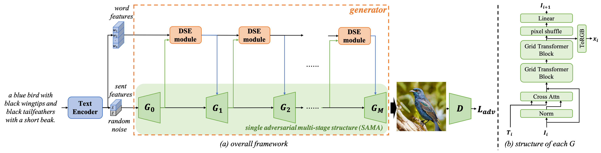

*Figure 2 · [Source](https://arxiv.org/abs/2209.01339)*

Details

**Input → output:** T → I · **Interaction:** generation

Prior multi-stage GANs condition every stage on the same fixed text encoder output; DSE-GAN's DSE module aggregates feedback from the previous stage's generated features, dynamically routes and re-weights word features accordingly, and hands the evolved text feature to the next stage's generator within a single adversarial multi-stage structure (SAMA) rather than a per-stage discriminator (paper Figure 2, "An overview of the proposed DSE-GAN framework"). Evaluated on CUB-200 and MS-COCO.

### DTGAN

Single-stage generator with seven upsampling layers, each carrying a channel-aware attention module and a pixel-aware attention module conditioned on word features, plus conditional normalization and a visual loss.

[Paper](https://arxiv.org/abs/2011.02709)

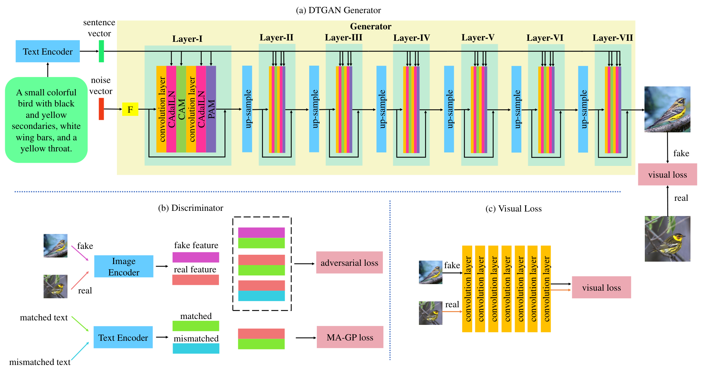

*Figure 2 · [Source](https://arxiv.org/abs/2011.02709)*

Details

**Input → output:** T → I · **Interaction:** generation

Unlike the multi-stage, multi-generator, multi-discriminator designs it compares against, DTGAN uses a single generator/discriminator pair (paper Figure 1) whose per-layer channel-aware attention module (CAM, Figure 3) and pixel-aware attention module (PAM, Figure 4) apply word-level attention along channel and spatial dimensions respectively (Figure 2, "The architecture of the proposed DTGAN"). A conditional normalization scheme and a visual-loss term further stabilize single-stage training. Evaluated on CUB and MS-COCO.

### FA-GAN

Single-stage GAN with a self-supervised, auto-encoding discriminator and a feature-aware loss that encourages diverse generator outputs for similar input sentences.

[Paper](https://arxiv.org/abs/2109.00907)

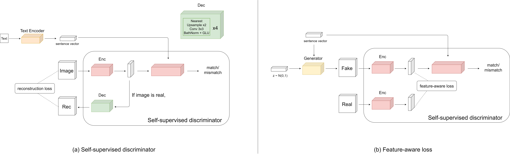

*Figure 2 · [Source](https://arxiv.org/abs/2109.00907)*

Details

**Input → output:** T → I · **Interaction:** generation

The self-supervised discriminator reconstructs real images through an auxiliary decoder in addition to its match/mismatch text-image classification (paper Figure 2(a)); the feature-aware loss compares the discriminator's encoded features of fake and real images to push the generator away from mode collapse on similar captions (Figure 2(b)). Evaluated on MS-COCO against AttnGAN, DM-GAN and DF-GAN baselines. The official repository names the paper but does not link an arXiv URL or author identities, so GitHub authorship is not confirmed.

### GALIP

CLIP-empowered GAN that bridges a frozen CLIP-ViT into both the generator (via a bridge feature predictor and prompt predictor) and the discriminator (Mate-D), so adversarial training reuses CLIP's pretrained vision-language representations instead of learning them from scratch.

[Paper](https://arxiv.org/abs/2301.12959) · [GitHub](https://github.com/tobran/GALIP)

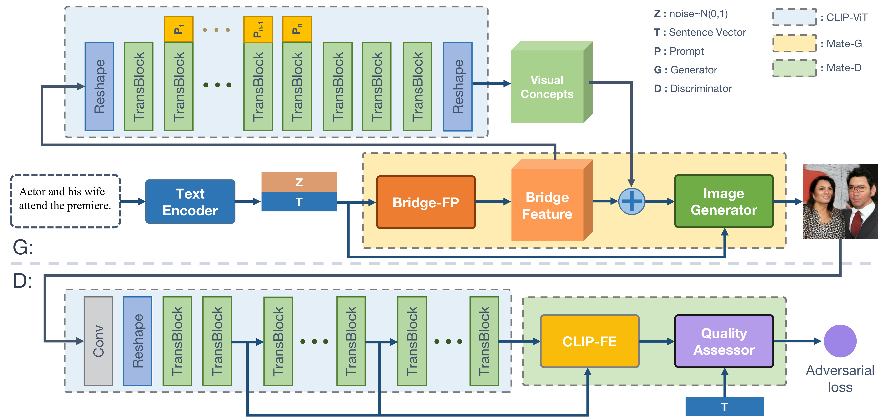

*Figure 3 · [Source](https://arxiv.org/abs/2301.12959)*

Details

**Input → output:** T → I · **Interaction:** generation

The generator's CLIP-empowered module (paper Figure 5) predicts a bridge feature and learnable prompts fed into a frozen CLIP-ViT so its visual concepts can be decoded back into an image (Figure 3, "The architecture of the proposed GALIP"); the discriminator (Mate-D, Figure 4) likewise extracts CLIP visual features of real/generated images for adversarial and CLIP-similarity losses. This lets GALIP train efficiently with a small generator (~320M parameters) while approaching latent diffusion model quality. Trained/evaluated on CC12M and compared on MS-COCO zero-shot FID.

**License:** code: CC BY-NC-SA 4.0.

### GAN-INT-CLS

Text-conditional DCGAN whose generator and discriminator both receive a projected char-CNN-RNN sentence embedding.

[Paper](https://arxiv.org/abs/1605.05396) · [GitHub](https://github.com/reedscot/icml2016)

*Figure 2 (PDF p. 4) · [Source](https://arxiv.org/abs/1605.05396)*

Details

**Input → output:** T → I · **Interaction:** generation

The 1,024-dimensional text embedding from a pretrained character-level CNN-RNN encoder is projected to 128 dimensions and concatenated with the noise vector in the generator and depth-concatenated with 4×4 feature maps in the discriminator (paper Figure 2). GAN-CLS adds a matching-aware discriminator that also scores real images with mismatched text as fake; GAN-INT trains the generator on interpolated text embeddings; GAN-INT-CLS combines both. Images are 64×64; experiments use CUB birds, Oxford-102 flowers and MS COCO. The paper also trains a style encoder that inverts the generator for pose and background transfer.

**License:** code: MIT.

### GAWWN

Text- and location-conditional GAN whose generator and discriminator split into global and local (bounding-box or keypoint-masked) pathways.

[Paper](https://arxiv.org/abs/1610.02454) · [GitHub](https://github.com/reedscot/nips2016)

*Figure 2 (PDF p. 4) · [Source](https://arxiv.org/abs/1610.02454)*

Details

**Input → output:** T → I · **Interaction:** generation

The Generative Adversarial What-Where Network conditions on a pretrained char-CNN-GRU caption embedding plus object location. In the bounding-box version the text embedding is spatially replicated and warped into the box; in the keypoint version a part-location tensor gates the local pathway (paper Figures 2 and 3). A separate conditional keypoint GAN can sample unspecified part locations from the text and a subset of user-given keypoints. Generates 128×128 images; experiments use CUB birds and MPII Human Pose with collected captions. Locations are spatial controls rather than a separate modality.

**License:** code: MIT.

**Variants:** Bounding-box-conditional GAWWN; Keypoint-conditional GAWWN.

### GigaGAN

Scaled-up StyleGAN-family text-to-image generator (~1B parameters) with sample-adaptive kernel selection, attention interleaved with convolution, and a multi-scale text-conditioned discriminator, plus a separate GAN-based upsampler for higher resolutions.

[Paper](https://arxiv.org/abs/2303.05511) · [GitHub](https://github.com/mingukkang/GigaGAN)

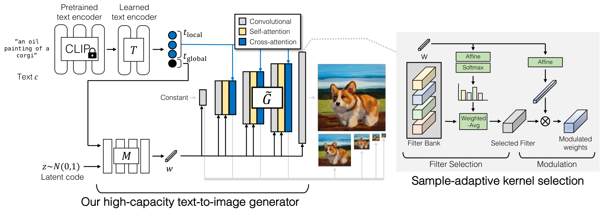

*Figure 4 · [Source](https://arxiv.org/abs/2303.05511)*

Details

**Input → output:** T → I · **Interaction:** generation

A CLIP text encoder and a learned encoder condition a synthesis network built from convolution and attention blocks with a bank of filters selected per-sample ("sample-adaptive kernel selection") to model complex text-image relationships at scale (paper Figure 4, "Our GigaGAN high-capacity text-to-image generator"); the discriminator processes multi-scale image and text branches (Figure 5). A separate GAN-based upsampler pipeline (not the base generator) reaches 512px/higher-resolution outputs and doubles as an off-the-shelf super-resolution model. Trained on large-scale text-image data; evaluated against distilled Stable Diffusion and DALL-E 2. The official repository only hosts the project page and paper results, not training or inference code.

### GR-GAN

Three-stage GAN whose Gradual Refinement Generator (GRG) conditions each successive stage on text at a coarser-to-finer granularity (image-level, then sentence-level, then word-level), paired with an Image-Text Matching (ITM) module providing sentence- and word-region-level matching losses.

[Paper](https://arxiv.org/abs/2205.11273) · [GitHub](https://github.com/BoO-18/GR-GAN)

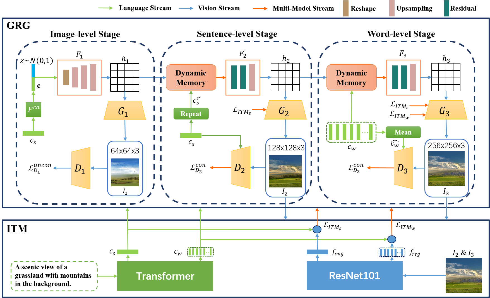

*Figure 1 · [Source](https://arxiv.org/abs/2205.11273)*

Details

**Input → output:** T → I · **Interaction:** generation

The image-level stage generates an initial 64x64 image from noise and the sentence vector alone; the sentence-level and word-level stages each read a dynamic-memory module and add sentence- or word-region matching losses from the ITM module (Transformer text encoder plus a ResNet101 image encoder) at increasing resolution up to 256x256 (paper Fig. 1, "The overall structure of the GR-GAN model"). The paper also introduces a Cross-Model Distance (CMD) metric evaluating quality and text-image consistency jointly. Evaluated on MS-COCO. No license file was found in the repository.

### HDGAN

Single-stream residual generator that emits side-output images of growing resolution, each judged by its own hierarchically-nested discriminator.

[Paper](https://arxiv.org/abs/1802.09178) · [GitHub](https://github.com/ypxie/HDGan)

*Figure 1 (top panel) · [Source](https://arxiv.org/abs/1802.09178)*

Details

**Input → output:** T → I · **Interaction:** generation

The generator stacks residual blocks and nearest-upsampling stretching layers from a 1024×4×4 input computed from the char-RNN sentence embedding (via Conditioning Augmentation) and noise, with linear compression layers producing side outputs at intermediate scales. Each discriminator combines a matching-aware image–text pair loss with a local image loss over an R×R real/fake probability map (paper Figures 1 and 3). Trained end to end rather than stage by stage; results up to 512×512 are reported, with the 512×512 generator initialized from a 256×256 model. Evaluated on CUB, Oxford-102 and MS COCO.

**License:** code: MIT.

### Hierarchical text-to-image via inferred semantic layout (Hong et al.)

Text → layout → image pipeline: an LSTM box generator, a convolutional-recurrent shape generator and a layout- and text-conditioned GAN image generator.

[Paper](https://arxiv.org/abs/1801.05091) · GitHub: no author-linked repository found

*Figure 2 · [Source](https://arxiv.org/abs/1801.05091)*

Details

**Input → output:** T → I · **Interaction:** generation

The box generator autoregressively samples labeled object boxes from the text embedding (class via softmax, coordinates via a Gaussian mixture); the shape generator, a convolutional recurrent network trained with instance-wise and global adversarial losses, predicts a binary mask inside each box; the masks are aggregated into a semantic label map (paper Figure 2). The image generator is a convolutional encoder–decoder that gates layout features with the text embedding and uses a cascaded decoder that re-reads the layout at each upsampling layer; its discriminator sees the image, layout and tiled text embedding. Evaluated on MS COCO. The paper does not name the model; the card name is descriptive.

### LAFITE

StyleGAN2-based generator trained language-free: real images are encoded by a pretrained CLIP model and perturbed into pseudo text features that stand in for captions, with the generator injecting this CLIP-space conditioning into every layer.

[Paper](https://arxiv.org/abs/2111.13792) · [GitHub](https://github.com/drboog/Lafite)

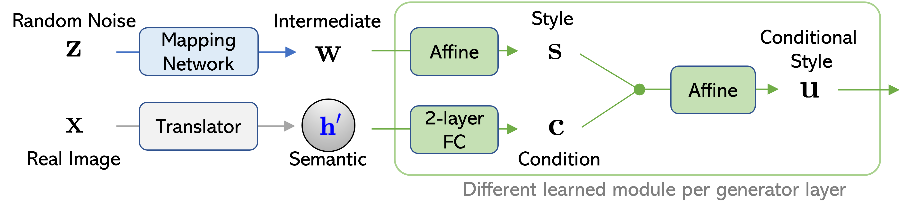

*Figure 3 · [Source](https://arxiv.org/abs/2111.13792)*

Details

**Input → output:** T → I · **Interaction:** generation

Because CLIP's image and text embeddings are approximately aligned, LAFITE trains without any paired captions by sampling pseudo text-feature perturbations of each image's CLIP embedding (paper Figure 1 motivates model-size gains from skipping a separate text encoder); a fully-connected layer injects the conditioning feature into each generator layer alongside the style code (Figure 3, "The process of injecting text-conditional information into each layer of the generator"). At inference, real CLIP text embeddings of captions condition generation. Evaluated on MS-COCO, CUB, Multi-Modal CelebA-HQ and Localized Narratives (LN-COCO).

**License:** code: MIT.

### MirrorGAN

Three-stage cascaded attentional GAN with global (sentence) and local (word) attention, plus a pretrained image-captioning module that redescribes the generated image for a text-reconstruction loss.

[Paper](https://arxiv.org/abs/1903.05854) · [GitHub](https://github.com/qiaott/MirrorGAN)

*Figure 2 · [Source](https://arxiv.org/abs/1903.05854)*

Details

**Input → output:** T → I · **Interaction:** generation

MirrorGAN has three modules (paper Figure 2): STEM, an RNN producing word and sentence embeddings; GLAM, cascaded generators built on the AttnGAN structure that concatenate word-level and sentence-level attention at each refinement stage; and STREAM, a CNN–LSTM encoder–decoder captioner that is pretrained and kept fixed while its captions of the generated image are aligned with the input text. Evaluated on CUB and MS COCO.

### MSMT-GAN

Multi-stage GAN whose initial stage generates separate word-n-gram-conditioned ("multi-tailed") image features that are fused together, followed by refinement stages reading a multi-headed spatial dynamic memory keyed on word features.

[Paper](https://arxiv.org/abs/2110.08143)

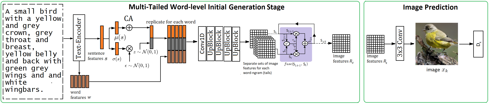

*Figure 1 · [Source](https://arxiv.org/abs/2110.08143)*

Details

**Input → output:** T → I · **Interaction:** generation

The Multi-Tailed Word-level Initial Generation (MTWIG) stage produces one set of image features per word tail before fusing them, aiming to preserve word-level information lost when only a pooled sentence vector seeds the first stage; later stages use an Iterative Multi-Headed spatial dynamic memory to refine image features against word features (paper Figure 1, "Our MSMT-GAN architecture"). Extends the dynamic-memory idea from DM-GAN. Evaluated on CUB and MS-COCO.

### Obj-GAN

Two-step object-driven GAN: an attentive seq2seq box generator and a bidirectional convolutional-LSTM shape generator build a semantic layout, then a multistage attentive generator renders a 256×256 image.

[Paper](https://arxiv.org/abs/1902.10740) · [GitHub](https://github.com/jamesli1618/Obj-GAN)

*Figure 2 · [Source](https://arxiv.org/abs/1902.10740)*

Details

**Input → output:** T → I · **Interaction:** generation

Words and the sentence are encoded with a pretrained bi-LSTM. The image generator conditions on the layout and adds object-driven attention, in which each object's class label (GloVe) queries the caption words and the resulting context vector is copied onto that object's mask, alongside AttnGAN-style grid attention (paper Figures 2–4). Training uses patch-wise discriminators and a Fast R-CNN-based object-wise discriminator. Evaluated on MS COCO.

### OP-GAN

Multi-stage AttnGAN-style GAN augmented with a per-object pathway, alongside the global image pathway, in both the generator and discriminator so that individual objects can be placed and refined at their bounding-box locations.

[Paper 1](https://arxiv.org/abs/1910.13321) · [Paper 2](https://arxiv.org/abs/1901.00686) · [GitHub](https://github.com/tohinz/semantic-object-accuracy-for-generative-text-to-image-synthesis)

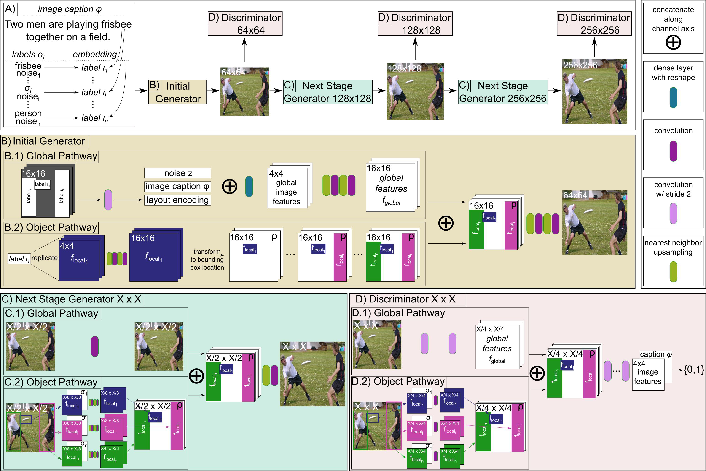

*Figure 1 · [Source](https://arxiv.org/abs/1910.13321)*

Details

**Input → output:** T → I · **Interaction:** generation

Object Pathways GAN (OP-GAN) extends a global generation pathway (image background and overall layout) with an object pathway that is iteratively applied at each object's bounding box, using only box coordinates and labels rather than a detailed semantic layout (paper Figure 1, "Overview of our model architecture called OP-GAN"). The discriminator mirrors this with matching global and object pathways. Evaluated on MS-COCO with the Semantic Object Accuracy (SOA) metric introduced in the same paper. The same authors' earlier ICLR 2019 workshop paper, "Generating Multiple Objects at Spatially Distinct Locations" (arXiv:1901.00686), introduced the object-pathway idea on Multi-MNIST, CLEVR and MS-COCO and is the direct predecessor of this model.

**License:** code: MIT.

### RAT-GAN

Single generator built from fusion blocks whose text-conditioned affine parameters are produced by a recurrent network (an RNN/LSTM over the sequence of fusion blocks) instead of being predicted independently at each block.

[Paper](https://arxiv.org/abs/2204.10482) · [GitHub](https://github.com/senmaoy/RAT-GAN)

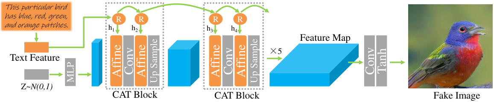

*Figure 1 · [Source](https://arxiv.org/abs/2204.10482)*

Details

**Input → output:** T → I · **Interaction:** generation

Because each fusion block's affine transformation is generated by a recurrent cell that carries hidden state from earlier blocks, text conditioning accumulates coherently across the whole generator rather than being applied identically and independently at every resolution (paper Figure 1(a), "Generator with the proposed recurrent affine transformation"). Evaluated on CUB, Oxford-102 and MS-COCO.

### SD-GAN

Siamese pair of three-stage stacked GANs trained with contrastive losses, whose generators are modulated by semantic-conditioned batch normalization.

[Paper](https://arxiv.org/abs/1904.01480) · GitHub: no author-linked repository found

*Figure 2 · [Source](https://arxiv.org/abs/1904.01480)*

Details

**Input → output:** T → I · **Interaction:** generation

The Semantics Disentangling GAN uses a bidirectional LSTM text encoder and stacked generator–discriminator stages (G0–G2, D0–D2). During training, two branches receive two descriptions and contrastive losses on discriminator features pull together images from descriptions of the same image and push apart others, to distill common semantics (paper Figure 2). Semantic-Conditioned Batch Normalization derives batch-norm modulation parameters from sentence-level cues (an MLP) or word-level cues (fused with visual features). Evaluated on CUB and MS COCO. No author-linked code repository was found.

### SDN (Symmetrical Distillation Networks)

Text-to-image GAN whose generator is trained with a two-stage symmetrical distillation loss that matches its feature maps, layer by layer, against a pretrained discriminative model (e.g. VGG19) processing the corresponding real image.

[Paper](https://arxiv.org/abs/1808.06801)

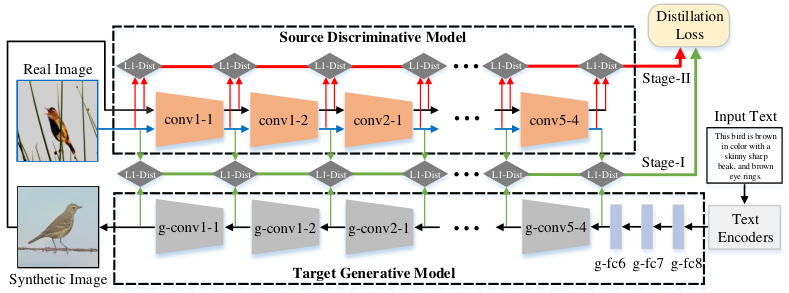

*Figure 2 · [Source](https://arxiv.org/abs/1808.06801)*

Details

**Input → output:** T → I · **Interaction:** generation

The source discriminative model and target generative model are treated as mirror-image (symmetrical) networks; Stage-I distillation matches high-level semantic feature maps and Stage-II matches lower-level content feature maps between the two, in addition to a standard adversarial and text-image matching loss (paper Figure 2, "source discriminative model" and "target generative model"). The paper also demonstrates diverse synthesis by interpolating between two text embeddings and retrieving approximate nearest training images for generated outputs. Evaluated on CUB-200-2011 and Oxford-102 Flowers. No official code repository was found.

### SegAttnGAN

AttnGAN-style multi-stage generator augmented with a segmentation attention module that injects a semantic segmentation map into each generator stage through a SPADE-like spatial modulation.

[Paper](https://arxiv.org/abs/2005.12444)

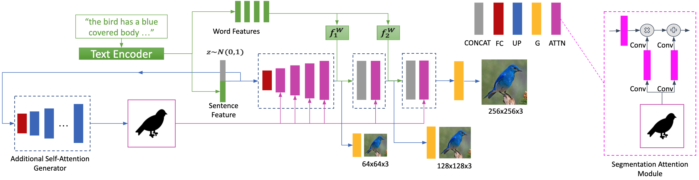

*Figure 2 · [Source](https://arxiv.org/abs/2005.12444)*

Details

**Input → output:** T → I · **Interaction:** generation

An LSTM text encoder gives sentence and word features as in AttnGAN; the segmentation attention module transforms features F using an input segmentation map S as F' = BN(F) * Conv(S) + Conv(S), preserving object spatial layout at each stage (paper Figure 2, "Our proposed SegAttnGAN architecture"). A self-attention variant generates its own segmentation maps at inference instead of requiring ground-truth masks, so the segmentation input is optional (I input) rather than always required. Evaluated on CUB and Oxford-102 with Inception Score. No official code repository was found.

**Variants:** Self-attention SegAttnGAN.

### SSA-GAN

Single generator-discriminator pair whose generator is a stack of seven Semantic-Spatial Aware Convolutional Network (SSACN) blocks that each predict a spatial mask from image features and use it to gate where text conditioning affine-modulates the image.

[Paper](https://arxiv.org/abs/2104.00567) · [GitHub](https://github.com/wtliao/text2image)

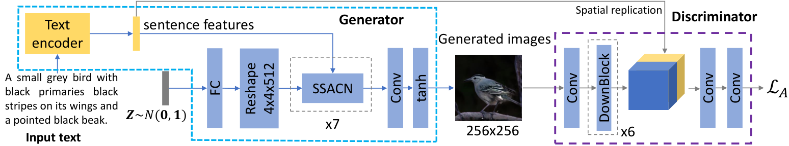

*Figure 2 · [Source](https://arxiv.org/abs/2104.00567)*

Details

**Input → output:** T → I · **Interaction:** generation

Each SSACN block predicts a mask map from the current image features and only applies the text-conditioned affine (scale/shift) transformation inside the masked, semantically relevant regions, weakening text influence over irrelevant background regions (paper Figure 2, "A schematic of our framework SSA-GAN"; Figure 3 shows the SSACN block). The paper also demonstrates text-driven diverse and locally editable synthesis of its own generated images by changing words in the input caption. Evaluated on CUB and MS-COCO.

### StackGAN

Two-stage conditional GAN: a Stage-I generator sketches a 64×64 image from text and noise, and a Stage-II encoder–residual–decoder generator refines it to 256×256 conditioned on the text again.

[Paper](https://arxiv.org/abs/1612.03242) · [GitHub](https://github.com/hanzhanggit/StackGAN)

*Figure 2 · [Source](https://arxiv.org/abs/1612.03242)*

Details

**Input → output:** T → I · **Interaction:** generation

Introduces Conditioning Augmentation: the conditioning vector is sampled from a Gaussian whose mean and diagonal covariance are predicted from the pretrained text embedding, with a KL regularizer toward the standard normal. Stage II takes no noise vector; it downsamples the Stage-I image, concatenates the spatially replicated text conditioning and applies residual blocks before upsampling (paper Figure 2). Both stages use matching-aware discriminators. Evaluated on CUB, Oxford-102 and MS COCO. The official repository is a TensorFlow implementation and links a separate PyTorch implementation.

**License:** code: MIT.

### StackGAN++ (StackGAN-v2)

End-to-end tree-structured GAN whose shared trunk branches into generators at 64×64, 128×128 and 256×256, each paired with its own discriminator.

[Paper](https://arxiv.org/abs/1710.10916) · [GitHub](https://github.com/hanzhanggit/StackGAN-v2)

*Fig. 2 (PDF p. 6) · [Source](https://arxiv.org/abs/1710.10916)*

Details

**Input → output:** T → I · **Interaction:** generation

For text-to-image, the conditioning vector (from Conditioning Augmentation on the text embedding) and noise feed the first stage, and the conditioning vector is re-injected at each later branch. Discriminators are trained jointly on unconditional (real/fake) and conditional (image–text match) losses, and a color-consistency regularizer ties the scales together (paper Fig. 2). The same framework is also used for unconditional generation on LSUN and ImageNet. The TPAMI paper also presents the two-stage StackGAN (StackGAN-v1), catalogued separately as StackGAN.

**License:** code: MIT.

### StyleGAN-T

Large-scale StyleGAN2-derived generator with Fourier-feature input, layer-scaled residual generator/discriminator blocks and a trained CLIP text encoder, paired with a multi-scale CLIP-and-vision-aided discriminator, for fast one-step large-scale text-to-image synthesis.

[Paper](https://arxiv.org/abs/2301.09515) · [GitHub](https://github.com/autonomousvision/stylegan-t)

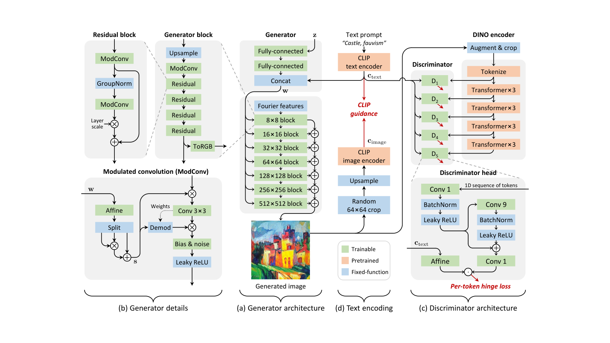

*Figure 3 · [Source](https://arxiv.org/abs/2301.09515)*

Details

**Input → output:** T → I · **Interaction:** generation

The generator replaces StyleGAN2's learned constant input with Fourier features and increases capacity and residual generator blocks per resolution for stronger text conditioning at scale; a CLIP text encoder is fine-tuned jointly and a random 64x64 crop of the generated image is scored by CLIP for a text-alignment guidance signal (paper Figure 3, "Overview of StyleGAN-T"). The multi-scale discriminator combines a DINO-based feature extractor with CLIP-conditioned per-scale heads. Trained on large-scale web image-text data; evaluated with FID/CLIP-score curves against distilled Stable Diffusion and eDiff-I at similar sampling speed.

**License:** code: Nvidia Source Code License.

### TAC-GAN

AC-GAN variant conditioned on Skip-Thought text embeddings, whose discriminator predicts both real/fake and the image class.

[Paper](https://arxiv.org/abs/1703.06412) · [GitHub](https://github.com/dashayushman/TAC-GAN)

*Figure 2 (PDF p. 2) · [Source](https://arxiv.org/abs/1703.06412)*

Details

**Input → output:** T → I · **Interaction:** generation

A fully connected network maps the Skip-Thought caption embedding to a latent vector that is concatenated with noise and decoded by transposed convolutions to 128×128 images. The discriminator receives the spatially expanded text latent alongside image features and outputs a source distribution and a class distribution; wrong images of other classes are used as negatives (paper Figure 2). Class labels are used only as a training signal; trained and evaluated on Oxford-102 flowers.

**License:** code: GPL-3.0.

### TediGAN

StyleGAN-inversion framework that maps both images and text descriptions into a shared StyleGAN W latent space through visual and linguistic encoders, so a caption alone can generate a face or edit an inverted real face by style mixing.

[Paper](https://arxiv.org/abs/2012.03308) · [GitHub](https://github.com/IIGROUP/TediGAN)

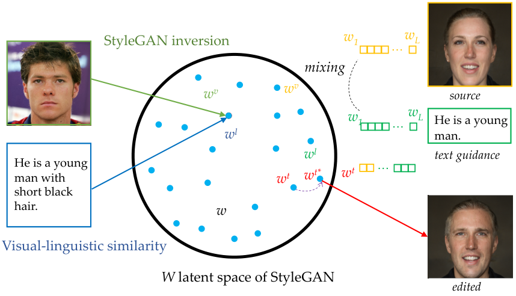

*Figure 2 · [Source](https://arxiv.org/abs/2012.03308)*

Details

**Input → output:** T, I → I · **Interaction:** editing

An image encoder inverts a real face into W (for editing) while a text encoder, trained with an instance-level non-linear optimization / visual-linguistic similarity loss, projects a caption into the same W space (paper Figure 2, "Projecting Multi-Modal Embedding into the W Space of StyleGAN"); style mixing between the projected text code and layers of a source/base code yields text-to-image generation or text-guided manipulation of a given face (Figure 6 shows which StyleGAN layers control which attributes). Generation from text alone (no input image) and editing of an inverted real image are both documented; the domain is limited to faces via the paper's Multi-Modal CelebA-HQ dataset.

**License:** code: MIT.

### Text-SeGAN

TAC-GAN variant whose discriminator predicts image source (real/fake) and semantic relevance to the text instead of a class label.

[Paper](https://arxiv.org/abs/1812.05083) · GitHub: no author-linked repository found

*Figure 3 · [Source](https://arxiv.org/abs/1812.05083)*

Details

**Input → output:** T → I · **Interaction:** generation

The generator maps an encoded caption and noise to 64×64 images. Training uses triplets of a positive image, its text encoding and a negative image selected by class and by distance in the text-embedding space (random, easy, hard, semi-easy and semi-hard negatives, plus an easy-to-hard curriculum); the generator maximizes the relevance likelihood while minimizing the source likelihood of fakes (paper Figure 3). The contribution is largely a training strategy on top of the TAC-GAN design. Evaluated on Oxford-102 flowers. No author-linked code repository was found.

### TIME (Text and Image Mutual-Translation)

Single-discriminator StackGAN-style aggregated generator paired with an image-captioning Transformer discriminator, jointly trained so text-to-image generation and image-to-text captioning act as mutual-translation adversarial tasks.

[Paper](https://arxiv.org/abs/2005.13192)

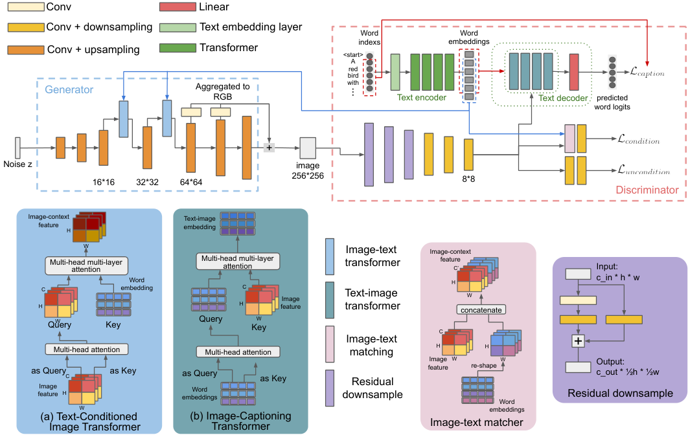

*Figure 2 · [Source](https://arxiv.org/abs/2005.13192)*

Details

**Input → output:** T → I · **Interaction:** generation

The aggregated generator produces RGB outputs at multiple resolutions that are rescaled and summed into one output so only a single discriminator is needed; its Text-Conditioned Image Transformer (TCIT) attention redesigns AttnGAN-style attention with separate key/value projections, multiple heads and stacked residual attention layers (paper Figure 2, "Model overview of TIME"; Figure 3 contrasts TCIT with AttnGAN attention). The discriminator includes a Transformer encoder-decoder that is trained to caption the generated/real image, whose image-text matching loss doubles as the adversarial signal. Evaluated on CUB and MS-COCO.

### TReCS

Multi-stage retrieval-and-composition pipeline that tags mouse-trace-aligned objects from a localized narrative, retrieves per-object semantic masks, composes them into a scene mask and renders it with a mask-to-image GAN.

[Paper](https://arxiv.org/abs/2011.03775)

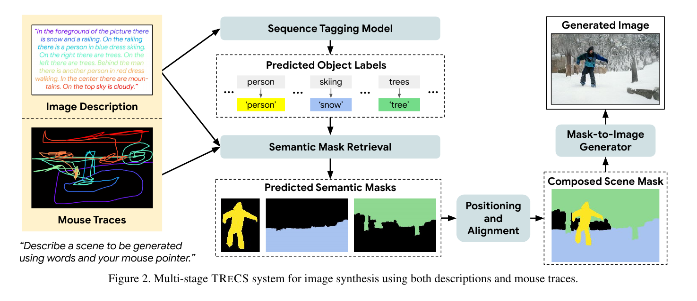

*Figure 2 (PDF p. 2) · [Source](https://arxiv.org/abs/2011.03775)*

Details

**Input → output:** T → I · **Interaction:** generation

TReCS (Text-to-Retrieval-and-Composition Synthesis) sequence-tags an image description into predicted object labels aligned to a mouse trace, retrieves semantic masks for each label, composes and positions the retrieved masks into a full scene segmentation, and generates the final image with an off-the-shelf mask-to-image GAN such as SPADE or CC-FPSE (PDF Figure 2, "Multi-stage TReCS system for image synthesis using both descriptions and mouse traces", cropped from the PDF since arXiv HTML omits the image). The text input is a Localized Narrative (a spoken description paired with a mouse trace over the image), and the trace is a spatial control rather than a distinct modality. Evaluated on Localized Narratives for MS-COCO (LN-COCO) and Open Images (LN-OpenImages) with human evaluation. No official code repository was found.

### XMC-GAN

Single-stage self-modulation GAN trained with cross-modal contrastive losses between image, region and sentence/word (BERT) representations instead of a hand-designed attention mechanism.

[Paper](https://arxiv.org/abs/2101.04702) · [GitHub](https://github.com/google-research/xmcgan_image_generation)

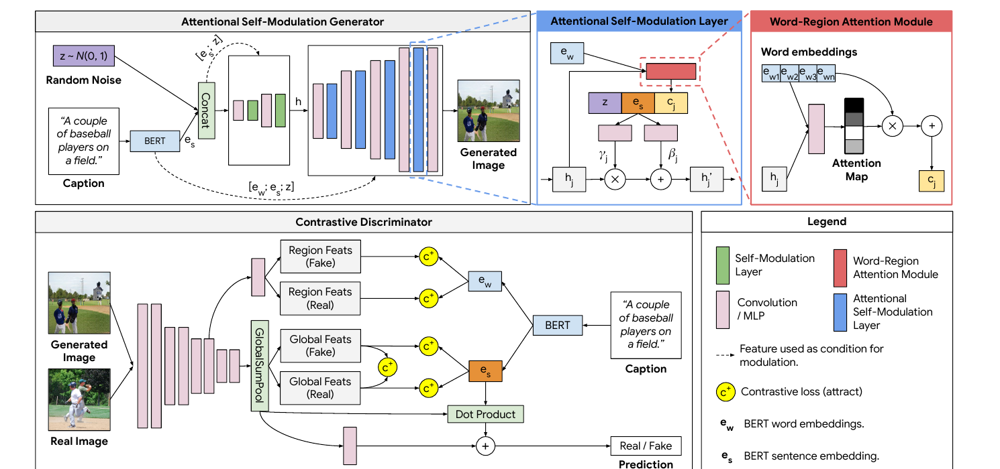

*Figure 2 (PDF p. 3) · [Source](https://arxiv.org/abs/2101.04702)*

Details

**Input → output:** T → I · **Interaction:** generation

The generator conditions each layer through attentional self-modulation on the BERT sentence embedding and applies word-region attention (PDF Figure 2, "Overview of the proposed XMC-GAN", cropped from the PDF since arXiv HTML omits the image); the contrastive discriminator maximizes mutual information between (1) real/generated image and sentence, (2) real/generated image regions and words, and (3) real and generated images of the same caption, rather than relying only on a real/fake adversarial loss. Evaluated on MS-COCO and Localized Narratives (LN-COCO, LN-OpenImages) with human evaluation.

