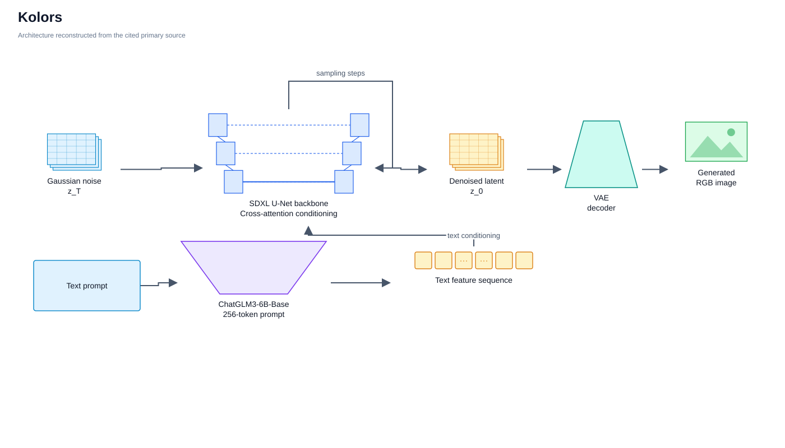
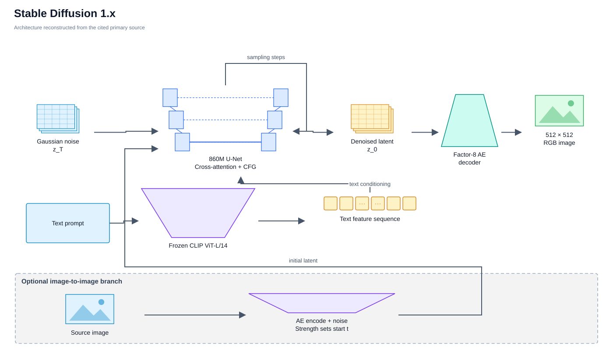

# Latent diffusion with U-Net backbones

<!-- Generated by scripts/catalog.py from data/models.json and data/figures.json. Edit the JSON, then regenerate. -->

[← All models](../README.md#models)

**24 models · Reviewed 2026-09-29**

Primary-source figures and labeled input/output diagrams. [Figure credits](../assets/architectures/CREDITS.md).

Model index and modality key

**Inputs and outputs:** T = text, I = image, V = video, A = audio. Image input usually means an optional reference, source or condition image. **Interaction:** `generation` = text-to-image synthesis; `editing` = synthesis plus documented text-guided editing of an input image. See the [methodology](../docs/methodology.md#modalities-and-interaction).

Dates refer to papers or announcements, not necessarily model releases.

| Model | Source date | Input → output | Interaction |
| --- | --- | --- | --- |
| [AltDiffusion](#altdiffusion) | 2023-08-19 | T → I | generation |
| [Bridge Diffusion Model (BDM)](#bridge-diffusion) | 2023-09-02 | T → I | generation |
| [CogView3](#cogview3) | 2024-03-08 | T → I | generation |
| [Diffusion Fuzzy System (DFS)](#diffusion-fuzzy-system) | 2025-12-01 | T → I | generation |
| [Emu (Meta)](#emu-meta) | 2023-09-27 | T → I | generation |
| [ERNIE-ViLG 2.0](#ernie-vilg-2) | 2022-10-27 | T → I | generation |
| [Frido](#frido) | 2022-08-29 | T → I | generation |
| [GoT](#got) | 2025-03-13 | T, I → I | editing |
| [Kandinsky 2](#kandinsky-2) | 2023-10-05 | T, I → I | editing |
| [Kandinsky 3](#kandinsky-3) | 2023-12-06 | T, I → I | editing |
| [Kolors](#kolors) | 2024-07-06 | T → I | generation |
| [Latent Diffusion Models (LDM)](#ldm) | 2021-12-20 | T → I | generation |
| [PanGu-Draw](#pangu-draw) | 2023-12-27 | T → I | generation |
| [Playground v2](#playground-v2) | 2024-02-27 | T → I | generation |
| [RAPHAEL](#raphael) | 2023-05-29 | T → I | generation |
| [Retrieval-Augmented Diffusion Models (RDM)](#rdm) | 2022-04-25 | T → I | generation |
| [SDXL](#sdxl) | 2023-07-04 | T → I | generation |
| [Stable Diffusion 1.x](#stable-diffusion-1) | 2022-08-22 | T, I → I | editing |
| [Stable Diffusion 2.x](#stable-diffusion-2) | 2022-11-24 | T, I → I | editing |
| [Taiyi-Diffusion-XL](#taiyi-diffusion-xl) | 2024-01-26 | T → I | generation |
| [Text2Earth](#text2earth) | 2025-01-01 | T, I → I | editing |
| [UPainting](#upainting) | 2022-10-28 | T → I | generation |
| [Versatile Diffusion](#versatile-diffusion) | 2022-11-15 | T, I → I, T | generation |
| [Würstchen](#wuerstchen) | 2023-06-01 | T → I | generation |

## Architectures

### AltDiffusion

Stable Diffusion 2.1 latent U-Net re-aligned to a frozen 18-language XLM-R text encoder distilled from the OpenCLIP ViT-H text encoder (AltCLIP-style).

[Paper](https://arxiv.org/abs/2308.09991) · [GitHub](https://github.com/superhero-7/AltDiffusion) · [Model card 1](https://huggingface.co/BAAI/AltDiffusion-m18) · [Model card 2](https://huggingface.co/BAAI/AltDiffusion-m9)

*Figure 2 · [Source](https://arxiv.org/abs/2308.09991)*

Details

**Input → output:** T → I · **Interaction:** generation

A multilingual XLM-R encoder with a fully connected projection is first trained by knowledge distillation to match the OpenCLIP text encoder used by SD v2, then frozen and plugged into the SD v2.1 512-base-ema U-Net. Training has two stages: concept alignment trains only the cross-attention key/value matrices at 256×256 on LAION2B-en and LAION2B-multi, and quality improvement unfreezes the whole U-Net at 512×512 on LAION Aesthetics V1-en/multi, followed by classifier-free-guidance training with 10% text dropout (paper Figure 2). The paper introduces the MG-18 and MC-18 multilingual benchmarks. The authors' README lists released checkpoints m2, m9 and m18; the m9 model card describes a model trained with AltCLIP-m9 from the original CompVis Stable Diffusion, and the m2 and m9 cards list creativeml-openrail-m while the m18 card lists no license. The GitHub repository has no LICENSE file and the m18 card states none, so no weight license is recorded for the family.

**Variants:** AltDiffusion (m2); AltDiffusion-m9; AltDiffusion-m18.

### Bridge Diffusion Model (BDM)

Frozen Stable Diffusion 1.5 U-Net backbone with a trainable ControlNet-like encoder branch conditioned on Chinese CLIP text features, keeping the latent space compatible with the English SD ecosystem.

[Paper](https://arxiv.org/abs/2309.00952) · [GitHub](https://github.com/360CVGroup/Bridge_Diffusion_Model) · [Model card](https://huggingface.co/qihoo360/BDM1.0)

*Figure 2 · [Source](https://arxiv.org/abs/2309.00952)*

Details

**Input → output:** T → I · **Interaction:** generation

The branch is a learnable copy of the backbone encoder without the image-condition convolutions; it processes the same latent features, takes Chinese CLIP embeddings of the Chinese prompt and injects offsets into the frozen backbone decoder, while the backbone's OpenAI CLIP encoder receives an empty string (paper Figure 2). Training aligns the Chinese-native semantics to the latent space associated with the empty English prompt, end to end. Because the backbone is unchanged, community SD checkpoints, LoRA, ControlNet, DreamBooth and textual inversion can be combined with Chinese prompts. The paper links the code repository and the qihoo360/BDM1.0 weights (360 CV Group).

**License:** code: Apache-2.0.

**Variants:** BDM1.0.

### CogView3

Two-stage latent relay diffusion with a 3B three-stage U-Net and a frozen T5-XXL text encoder: a 512×512 base stage followed by a relaying 2× super-resolution stage.

CogView3, from Zhipu AI and Tsinghua University, is the first text-to-image system to apply relay diffusion. A 3-billion-parameter U-Net diffusion model works in the 8× compressed latent space of a KL-regularized autoencoder, conditioned on a frozen T5-XXL encoder with prompts of up to 225 tokens that are first expanded by a language model. The base stage generates 512×512 images; the super-resolution stage encodes the bilinearly upsampled result, adds noise from an intermediate point and denoises and deblurs it with a linear blurring schedule to reach 1024×1024, and it can be applied iteratively for 2048×2048. Training uses LAION-2B with captions rewritten by a fine-tuned CogVLM recaptioner. The paper reports that CogView3 beats SDXL in human evaluation at about half its inference time, and a progressively distilled variant needs about a tenth of SDXL's inference time.

[Paper](https://arxiv.org/abs/2403.05121) · [GitHub](https://github.com/zai-org/CogView4)

*Figure 3 · [Source](https://arxiv.org/abs/2403.05121)*

Details

**Input → output:** T → I · **Interaction:** generation

Unlike earlier cascaded diffusion that conditions every super-resolution step on the low-resolution image, relaying super-resolution injects the low-resolution latent only at the starting step, corrupted by Gaussian noise, so it can correct base-stage artifacts (paper Figure 3). The official repository (now zai-org/CogView4) released CogView3 on 2024-09-29 together with CogView-3Plus, which is a separate diffusion-transformer model (see `cogview3-plus`).

**License:** code: Apache-2.0; weights: Apache-2.0.

**Variants:** CogView3 base (512×512); CogView3 relay SR (1024×1024, iterative 2048×2048); CogView3 distilled.

### Diffusion Fuzzy System (DFS)

Latent multi-path diffusion model with U-Net noise predictors on 32x32 latents of 256x256 images, where each path is assigned to a cluster of image features and cascaded fuzzy rules with fuzzy-membership-based inference steer and combine the paths, conditioned on text embeddings.

The Diffusion Fuzzy System (Jiangnan University and collaborators, 2025; the manuscript carries an IEEE Transactions on Fuzzy Systems identifier) builds a multi-path latent diffusion model in which each diffusion path learns one class of image features and fuzzy rules coordinate the paths. K-medoids clustering picks representative images that define fuzzy sets; membership degrees of the noisy latent to each set, computed from feature and semantic similarity, weight the path outputs at every denoising step through rule chains of forward and reverse cascaded rules. An encoder and decoder compress 256x256 images into 32x32 latents to keep the multi-path cost down. In the text-to-image setting the noise predictor receives noise and text embeddings, and the paper reports results on LSUN Bedroom, LSUN Church and MS COCO against single-path and multi-path diffusion baselines.

[Paper](https://arxiv.org/abs/2512.01533) · GitHub: no author-linked repository found

*Figure 2 (PDF p. 3) · [Source](https://arxiv.org/abs/2512.01533)*

Details

**Input → output:** T → I · **Interaction:** generation

Results are at 256x256 on LSUN and MS COCO (592,000 images split 7:1:2) and use FID, MIFID, IS, PSNR, SSIM, MS-SSIM, precision, recall and CLIP score; the paper reports improved FID and CLIP score over baselines such as LDM, GLIDE, unCLIP, SDG and the multi-path RAPHAEL, and uses a U-Net-based noise predictor. The text encoder and parameter counts are not specified in the main text. Experiments ran on 6 NVIDIA RTX A6000 GPUs. No repository or model weights are linked in the paper.

### Emu (Meta)

Quality-tuned 1024×1024 latent diffusion model with a 2.8B-parameter U-Net, a 16-channel autoencoder, and CLIP ViT-L plus T5-XXL text conditioning.

[Paper](https://arxiv.org/abs/2309.15807)

*Source-based architecture diagram · [Source](https://arxiv.org/abs/2309.15807)*

Details

**Input → output:** T → I · **Interaction:** generation

The autoencoder raises the latent channel count from the usual 4 to 16 and adds a Fourier feature transform on the input to improve reconstruction of fine details (paper Sec. 3.1, Figure 3). The U-Net increases channel sizes and the number of residual blocks per stage. Pre-training uses 1.1 billion internal image-text pairs with progressively increasing resolution and a 0.02 noise offset at the end; quality-tuning then fine-tunes on a few thousand human-selected, highly aesthetic images (batch 64, noise offset 0.1, at most 15K iterations with early stopping). The paper shows the same quality-tuning also helps pixel diffusion and masked generative transformer models. No architecture diagram is published (figures are samples, data examples and evaluations). Distinct from BAAI's multimodal Emu.

### ERNIE-ViLG 2.0

Chinese latent diffusion model with a 1.3B transformer text encoder and a mixture of ten 2.2B U-Net denoising experts, each assigned to one block of timesteps.

[Paper](https://arxiv.org/abs/2210.15257)

*Figure 2 · [Source](https://arxiv.org/abs/2210.15257)*

Details

**Input → output:** T → I · **Interaction:** generation

Diffusion runs in the 4-channel latent space of a pretrained image autoencoder following LDM; text features enter the U-Net through a cross-modal attention layer in which projected U-Net features are concatenated with the text representation. Mixture-of-Denoising-Experts (MoDE) divides all timesteps into 10 blocks and uses a separate U-Net expert per block with a shared text encoder, so inference cost does not grow with the number of experts; the total is about 24B parameters. Knowledge enhancement is a training-time mechanism: part-of-speech special tokens and up-weighted keyword attention (textual knowledge), and higher loss weights on object-detector regions (visual knowledge) (paper Figure 2). Trained on 170M image-text pairs (LAION plus internal Chinese data, English captions machine-translated to Chinese); the paper reports direct 1024×1024 output.

### Frido

Feature-pyramid latent diffusion model that denoises multi-scale MS-VQGAN latents coarse to fine with a shared pyramid U-Net (PyU-Net) using coarse-to-fine modulation.

[Paper](https://arxiv.org/abs/2208.13753) · [GitHub](https://github.com/chrisfan-wc/Frido)

*Figure 3 (PDF p. 4) · [Source](https://arxiv.org/abs/2208.13753)*

Details

**Input → output:** T → I · **Interaction:** generation

MS-VQGAN encodes an image into quantized feature maps at several spatial scales; diffusion runs sequentially per scale (T steps each), and denoising proceeds from the high-level (coarse) scale to the low-level one, with lightweight level-specific layers around a shared U-Net and coarse-to-fine modulation that conditions each level on the already generated coarser feature plus scale and timestep (paper Figure 3). For text-to-image, captions are encoded with a BERT tokenizer and transformer; the same framework handles layout-, scene-graph- and label-to-image, which are described here as conditioning variants rather than extra modalities. Text-to-image results are reported for training on COCO 2014 only, optionally with test-time CLIP reranking, so this is a research model rather than a web-scale generator. The paper links github.com/davidhalladay/Frido, which now redirects to chrisfan-wc/Frido.

**License:** code: MIT.

**Variants:** Frido-f16f8 (COCO text-to-image).

### GoT

Qwen2.5-VL-3B (LoRA-updated) that writes a Generation Chain-of-Thought with bounding boxes and then emits 64 guidance tokens for an SDXL-based diffusion decoder with a semantic-spatial guidance module (semantic, spatial-mask and reference-image pathways), trained end to end.

GoT (Generation Chain-of-Thought; CUHK MMLab, HKU, SenseTime and collaborators) makes an MLLM reason about a prompt before an image is drawn. Given a caption or an editing instruction, the MLLM writes a step-by-step description of objects, attributes and relations with explicit bounding-box coordinates. Its hidden states for 64 special image tokens become semantic guidance for the diffusion module, and the boxes are rendered as colour-coded masks that serve as spatial guidance. For editing, the source image is a third, reference-image pathway in the manner of InstructPix2Pix. The diffusion module follows SDXL and is optimized together with the MLLM through a joint cross-entropy and diffusion loss. Users can edit the generated chain, such as moving a box, to change the image. The authors build over 8M GoT-annotated image pairs for training.

[Paper](https://arxiv.org/abs/2503.10639) · [GitHub](https://github.com/rongyaofang/GoT) · [Model card](https://huggingface.co/LucasFang/GoT-6B)

*Figure 3 · [Source](https://arxiv.org/abs/2503.10639)*

Details

**Input → output:** T, I → I · **Interaction:** editing

Training data: Laion-Aesthetics-High-Resolution-GoT (3.77M), JourneyDB-GoT (4.09M), 600K FLUX.1-generated images with LAHR prompts, OmniEdit-GoT (736,691 single-turn edits) and SEED-Edit-Multiturn-GoT (180,190). Qwen2.5-VL-3B decoder weights are updated with LoRA while the SDXL-based module is fully optimized; the vision encoder is frozen. The paper reports GenEval (overall 0.64) and image-editing benchmarks (Emu-Edit, ImagenHub, Reason-Edit) and interactive generation. The reasoning text is a conditioning step; the paper does not evaluate image understanding as an output, so only I is listed as output. The README lists the GoT-6B checkpoint on Hugging Face, whose model card carries no license metadata.

**License:** code: MIT.

**Variants:** GoT-6B.

### Kandinsky 2

Diffusion image prior mapping CLIP text embeddings to CLIP image embeddings, followed by a 1.22B latent diffusion U-Net conditioned on image and multilingual text embeddings and a MoVQ decoder.

[Paper](https://arxiv.org/abs/2310.03502) · [GitHub](https://github.com/ai-forever/Kandinsky-2) · [Model card](https://huggingface.co/kandinsky-community/kandinsky-2-2-decoder)

*Figure 1 · [Source](https://arxiv.org/abs/2310.03502)*

Details

**Input → output:** T, I → I · **Interaction:** editing

The paper does not name a version; its component list (CLIP ViT-L/14 image encoder, 1B prior, 1.22B U-Net, 67M MoVQ) matches the README's Kandinsky 2.1. It trains a transformer-encoder diffusion prior (20 layers, 32 heads, hidden size 2048; about 1B parameters) from scratch on CLIP ViT-L/14 text and image embeddings. The U-Net receives merged CLIP-image and XLMR-CLIP text embeddings as input and adds them to the time embedding; decoding uses Sber-MoVQGAN (67M), a modified MoVQGAN trained on LAION HighRes, without skipping the quantization step. The total model is 3.3B parameters (paper Table 2). Documented inference regimes are text-to-image, image variations, image fusion, image-and-text fusion and text-guided inpainting/outpainting (paper Figure 1). Per the official README, Kandinsky 2.2 replaces the image encoder with CLIP ViT-bigG-14 and adds ControlNet support, while Kandinsky 2.0 was an earlier latent diffusion model with a 1.2B U-Net and two multilingual text encoders (mCLIP-XLMR and mT5-encoder-small) and no image prior.

**License:** code: Apache-2.0; weights: apache-2.0.

**Variants:** Kandinsky 2.0; Kandinsky 2.1; Kandinsky 2.2.

### Kandinsky 3

3.0B latent diffusion U-Net built from modified BigGAN-deep residual blocks, conditioned by cross-attention on a frozen 8.6B Flan-UL2 encoder, with a Sber-MoVQGAN decoder.

[Paper](https://arxiv.org/abs/2312.03511) · [GitHub](https://github.com/ai-forever/Kandinsky-3) · [Model card](https://huggingface.co/kandinsky-community/kandinsky-3)

*Figure 2 · [Source](https://arxiv.org/abs/2312.03511)*

Details

**Input → output:** T, I → I · **Interaction:** editing

Unlike Kandinsky 2.x there is no image prior: a text encoder, a latent U-Net and an image decoder form the pipeline (report Figure 1), 11.9B parameters in total (report Table 1). The U-Net uses ResNet-50-style bottleneck BigGAN-deep blocks, with self-attention and cross-attention only at lower resolutions (report Figure 2). The text encoder is the encoder of Flan-UL2 20B; the image decoder is the 270M Sber-MoVQGAN; both are frozen during U-Net training. Text-guided inpainting/outpainting uses a GLIDE-style 9-channel input fine-tune, and image-prompted editing uses an IP-Adapter-style extension; these are the basis for the image input and editing label. Kandinsky 3.1 adds Kandinsky Flash, an adversarial-diffusion-distillation model that generates in 4 steps, plus an updated inpainting model and LLM prompt expansion (official README; later report versions). Image-to-video and text-to-video extensions in the report are out of scope.

**License:** code: Apache-2.0; weights: apache-2.0.

**Variants:** Kandinsky 3.0; Kandinsky 3.1; Kandinsky Flash (distilled); Kandinsky 3 inpainting.

### Kolors

Latent diffusion model with the SDXL U-Net backbone conditioned on penultimate-layer features of a ChatGLM3-6B-Base text encoder (up to 256 tokens).

Kolors is a bilingual (Chinese and English) text-to-image latent diffusion model from Kuaishou's Kolors team. Its technical report keeps the U-Net architecture of SDXL and replaces the CLIP text encoders with ChatGLM3-6B-Base, whose penultimate output conditions the model with prompts of up to 256 tokens. Training data are re-captioned with a multimodal LLM (CogVLM) and mixed half-and-half with original captions, training is split into a concept-learning phase on billions of image-text pairs and a quality-improvement phase on manually graded high-aesthetic data, and high-resolution training extends the noise schedule from 1,000 to 1,100 steps to reach a lower terminal SNR. The report highlights Chinese text rendering and introduces the KolorsPrompts benchmark.

[Paper](https://github.com/Kwai-Kolors/Kolors/blob/master/imgs/Kolors_paper.pdf) · [GitHub](https://github.com/Kwai-Kolors/Kolors) · [Model card](https://huggingface.co/Kwai-Kolors/Kolors)

*Source-based architecture diagram · [Source](https://github.com/Kwai-Kolors/Kolors)*

Details

**Input → output:** T → I · **Interaction:** generation

The report states that the backbone strictly follows the SDXL U-Net and that the contributions are the text encoder, re-captioning, data curation and the high-resolution noise schedule; it has no architecture diagram. The technical report is hosted as a PDF in the official repository rather than on arXiv, so the date is the repository's dated release line ("2024.07.06 ... We release Kolors"). ControlNet, IP-Adapter, inpainting and LoRA releases in the same repository are add-ons and are not covered. The Hugging Face card metadata lists apache-2.0, while the repository README says the weights are fully open for academic research and commercial use requires registration with the licensor under its model license (MODEL_LICENSE).

**License:** code: Apache-2.0; weights: apache-2.0.

**Variants:** Kolors (Kwai-Kolors/Kolors); Kolors-diffusers.

### Latent Diffusion Models (LDM)

Time-conditional U-Net denoiser in the latent space of a pretrained autoencoder, with text injected through cross-attention from a jointly trained transformer encoder.

[Paper](https://arxiv.org/abs/2112.10752) · [GitHub](https://github.com/CompVis/latent-diffusion)

*Figure 3 (PDF p. 4) · [Source](https://arxiv.org/abs/2112.10752)*

Details

**Input → output:** T → I · **Interaction:** generation

A perceptual-compression autoencoder (KL- or VQ-regularized) is trained once, and the diffusion model operates on its latent at a downsampling factor f; a domain-specific encoder τθ maps the condition to features that enter intermediate U-Net layers through cross-attention (paper Figure 3). The text-to-image model is a 1.45B-parameter KL-regularized LDM with f = 8 (LDM-KL-8), conditioned on LAION-400M prompts via a BERT-tokenizer transformer encoder trained jointly with the U-Net and sampled with classifier-free guidance (LDM-KL-8-G). The same framework is used for class-conditional, layout-to-image, super-resolution, inpainting and semantic-map models, which are separate checkpoints. The official repository also hosts the retrieval-augmented RDM checkpoints (see `rdm`).

**License:** code: MIT.

**Variants:** LDM-KL-8 text-to-image (1.45B, LAION-400M); LDM-KL-8-G (classifier-free guidance).

### PanGu-Draw

Bilingual latent diffusion model (5B in its largest version) whose denoising is split in time between two SDXL-style U-Nets: a structure generator for high-noise timesteps and a texture generator for low-noise timesteps.

[Paper](https://arxiv.org/abs/2312.16486)

*Figure 1 · [Source](https://arxiv.org/abs/2312.16486)*

Details

**Input → output:** T → I · **Interaction:** generation

Time-decoupled training divides one denoiser into a structure generator (timesteps T to T_struct, trained on all data including upscaled low-resolution images) and a texture generator (T_struct to 0, trained at lower resolution but sampled at high resolution), each half the size of the full model, with T_struct = 500 (paper Figure 1c). Both are built on the SDXL U-Net architecture with the SDXL VAE; text embeddings from a Chinese text encoder pre-trained on the authors' Chinese data are concatenated with those of a pretrained English encoder, and resolution-index embeddings support multi-resolution output around 1024×1024. An LLM-based prompt enhancement stage is described. Coop-Diffusion, a sampling algorithm that fuses pretrained diffusion models with different latent spaces and resolutions (for example image-variation, depth or edge models) in one denoising process, is a separate contribution of the paper. Trained on 256 Ascend 910B cards; the paper states the 5B model is released on the Ascend platform.

### Playground v2

Latent diffusion model with the SDXL U-Net architecture and two frozen text encoders (OpenCLIP ViT-G and CLIP ViT-L), trained by Playground.

Playground v2 is a latent diffusion text-to-image model from Playground that its model card says follows the same architecture as Stable Diffusion XL, with OpenCLIP ViT-G and CLIP ViT-L as fixed text encoders. Playground v2.5 keeps that architecture and changes the training recipe to improve aesthetic quality: it trains from scratch with the EDM framework and a noise schedule skewed toward higher noise for vivid color and contrast, uses balanced aspect-ratio buckets for multi-aspect generation, and applies supervised fine-tuning on curated data for human preference alignment. Both weight releases are on Hugging Face under Playground community licenses.

[Paper](https://arxiv.org/abs/2402.17245) · [Model card 1](https://huggingface.co/playgroundai/playground-v2-1024px-aesthetic) · [Model card 2](https://huggingface.co/playgroundai/playground-v2.5-1024px-aesthetic) · GitHub: no author-linked repository found

*Source-based architecture diagram · [Source](https://huggingface.co/playgroundai/playground-v2-1024px-aesthetic)*

Details

**Input → output:** T → I · **Interaction:** generation

The v2.5 report states that, following v2, the underlying model architecture was not changed; its contributions are the training recipe (EDM noise schedule and preconditioning instead of v2's offset noise with a DDPM schedule, balanced bucketed multi-aspect training, and SFT-style human preference alignment). The v2.5 report has no architecture figure. The v2 release is not separately dated here because no dated primary announcement was verified.

**License:** weights: playground-v2-community (v2); playground-v2dot5-community (v2.5).

**Variants:** playground-v2-1024px-aesthetic; Playground v2.5 (playground-v2.5-1024px-aesthetic).

### RAPHAEL

Latent diffusion U-Net of 16 transformer blocks, each with self-attention, cross-attention to OpenCLIP-g/14 text tokens, a time-MoE layer and a space-MoE layer.

[Paper](https://arxiv.org/abs/2305.18295)

*Figure 3 · [Source](https://arxiv.org/abs/2305.18295)*

Details

**Input → output:** T → I · **Interaction:** generation

Space-MoE routes each text token, with the image region given by a thresholded cross-attention mask, to one of 6 space experts, and time-MoE uses a gate network to assign timesteps to 4 time experts; stacking 16 blocks yields billions of possible diffusion paths (paper Figures 3 and 4). An edge-supervised loss predicts HED edge maps from cross-attention maps during training and is paused at large timesteps. Images are compressed with a pretrained VAE following LDM. The paper describes a single 3B-parameter model trained on 1,000 A100 GPUs for two months with multi-scale aspect buckets, optionally combined with a tailor-made SR-GAN for higher resolution, and demonstrates LoRA and ControlNet extensions. The paper links a project page and a public demo; no weights are described as released.

### Retrieval-Augmented Diffusion Models (RDM)

Semi-parametric latent diffusion model whose U-Net is conditioned by cross-attention on CLIP embeddings of nearest neighbours retrieved from an external image database, enabling text-to-image by conditioning on CLIP text embeddings.

[Paper](https://arxiv.org/abs/2204.11824) · [GitHub 1](https://github.com/CompVis/retrieval-augmented-diffusion-models) · [GitHub 2](https://github.com/CompVis/latent-diffusion)

*Figure 3 · [Source](https://arxiv.org/abs/2204.11824)*

Details

**Input → output:** T → I · **Interaction:** generation

Following LDM, an RDM trains a U-Net denoiser in the latent space of a pretrained autoencoder; for each training image, k nearest neighbours are retrieved from a fixed database by CLIP ViT-B/32 image similarity (ScaNN search) and their CLIP embeddings are fed through cross-attention (paper Figure 3). Training uses images only; at inference the shared CLIP space allows conditioning on the CLIP text embedding of a prompt, on neighbours retrieved with the text, or both, which gives zero-shot text-to-image and class-conditional synthesis, and swapping the database (for example WikiArt or ArtBench) gives zero-shot stylization. The paper also presents retrieval-augmented autoregressive models (RARM). The official repositories refer to the work as "Retrieval-Augmented Diffusion Models". The CompVis/latent-diffusion README provides an rdm768x768 checkpoint with OpenImages and ArtBench databases; the dedicated repository's LICENSE permits non-commercial academic research and personal use only and names no standard license.

**Variants:** RDM (ImageNet, OpenImages database); rdm768x768 checkpoint.

### SDXL

2.6B-parameter latent diffusion U-Net conditioned on concatenated CLIP ViT-L and OpenCLIP ViT-bigG text features, with size/crop micro-conditioning and an optional latent refinement model.

[Paper](https://arxiv.org/abs/2307.01952) · [Announcement](https://stability.ai/news/stable-diffusion-sdxl-1-announcement) · [GitHub](https://github.com/Stability-AI/generative-models) · [Model card](https://huggingface.co/stabilityai/stable-diffusion-xl-base-1.0)

*Figure 1 (right panel) · [Source](https://arxiv.org/abs/2307.01952)*

Details

**Input → output:** T → I · **Interaction:** generation

Compared with SD 1.x/2.x, the U-Net drops the transformer block at the highest feature level, uses 2 and 10 transformer blocks at the lower levels and removes the 8× downsampling level (paper Table 1). Penultimate outputs of the two text encoders (817M parameters in total) are concatenated for cross-attention (context dimension 2048), and the pooled OpenCLIP embedding is an extra condition. Original image size and crop coordinates are Fourier-embedded and added to the timestep embedding; the final model is fine-tuned with multi-aspect training around 1024×1024 pixel area. A retrained autoencoder with the SD 1.x architecture is used. A separate refiner specialized on the first 200 noise scales applies SDEdit-style noising and denoising to the base latents with the same prompt (paper Figure 1). SDXL 0.9 was a limited research release before SDXL 1.0 (announced 2023-07-26).

**License:** code: MIT; weights: CreativeML Open RAIL++-M.

**Variants:** SDXL 0.9 (research release); SDXL 1.0 base; SDXL 1.0 refiner.

### Stable Diffusion 1.x

Latent diffusion model with an 860M U-Net conditioned through cross-attention on the non-pooled embeddings of a frozen CLIP ViT-L/14 text encoder.

[Announcement](https://stability.ai/news/stable-diffusion-public-release) · [GitHub](https://github.com/CompVis/stable-diffusion) · [Model card](https://huggingface.co/CompVis/stable-diffusion-v1-4) · [Paper](https://arxiv.org/abs/2112.10752)

*Source-based architecture diagram · [Source](https://github.com/CompVis/stable-diffusion)*

Details

**Input → output:** T, I → I · **Interaction:** editing

Stable Diffusion v1 is a specific LDM configuration: a downsampling-factor-8 autoencoder (H×W×3 images to H/8×W/8×4 latents), an 860M U-Net and a 123M frozen CLIP ViT-L/14 text encoder, pretrained at 256×256 and fine-tuned at 512×512 on LAION-5B subsets (official README and v1-4 model card). Checkpoints v1-1 to v1-4 differ in training data and steps, and v1-3/v1-4 drop the text condition 10% of the time for classifier-free guidance. The README documents SDEdit-style text-guided image-to-image translation with the same weights (img2img script), which is the basis for the image input and editing label. The reference sampling script adds a safety checker and invisible watermarking. The original runwayml/stable-diffusion-v1-5 Hugging Face repository was not reachable at review, so v1.5 is not described here. Built on the LDM paper (see `ldm`).

**License:** code: CreativeML Open RAIL-M; weights: creativeml-openrail-m.

**Variants:** sd-v1-1; sd-v1-2; sd-v1-3; sd-v1-4.

### Stable Diffusion 2.x

Latent diffusion U-Net (865M parameters) conditioned through cross-attention on an OpenCLIP ViT-H text encoder.

[Announcement 1](https://stability.ai/news/stable-diffusion-v2-release) · [Announcement 2](https://stability.ai/news/stablediffusion2-1-release7-dec-2022) · [Paper](https://arxiv.org/abs/2307.01952) · GitHub: no author-linked repository found

*Source-based architecture diagram · [Source](https://arxiv.org/abs/2307.01952)*

Details

**Input → output:** T, I → I · **Interaction:** editing

The 2.0 announcement introduces text-to-image models trained with a new OpenCLIP text encoder at default resolutions of 512×512 and 768×768, on an aesthetic, NSFW-filtered LAION-5B subset. The SDXL paper (Table 1) gives the SD 2.0/2.1 U-Net as 865M parameters with OpenCLIP ViT-H text features (context dimension 1024) and no pooled text embedding. The 2.0 release also includes a 4× upscaler diffusion model, a depth-guided depth2img model for structure-preserving image-to-image, and a text-guided inpainting model fine-tuned from the 2.0 base; these are the basis for the image input and editing label. Version 2.1 (announced 2022-12-07) fine-tunes 2.0 with less aggressive dataset filtering. The GitHub repository linked from the announcement (Stability-AI/StableDiffusion) and the stabilityai/stable-diffusion-2 Hugging Face cards were unavailable at review, so no license is recorded.

**Variants:** 2.0 (512 and 768); 2.1 (512 and 768); x4 upscaler; depth2img; 2.0 inpainting.

### Taiyi-Diffusion-XL

SDXL-based latent diffusion U-Net whose text encoder is replaced by a bilingual (Chinese-English) CLIP with expanded vocabulary and position encoding, trained jointly in continued pre-training.

Taiyi-Diffusion-XL (Taiyi-XL) is a Chinese-English bilingual text-to-image model from IDEA-CCNL built by continued pre-training of Stable Diffusion XL. The team first extends an English CLIP model with the most frequently used Chinese characters in its tokenizer and embedding layers and with expanded absolute position encoding, trains it contrastively on bilingual data such as LAION and Wukong, and then swaps it in as SDXL's text encoder. The U-Net and text encoder are trained together at mixed 512×512 and 1024×1024 resolutions and aspect ratios on images re-captioned by a large vision-language model. The technical report shows gains over earlier Chinese and bilingual open models on COCO and COCO-CN, and the 3.5B checkpoint and training code are public.

[Paper](https://arxiv.org/abs/2401.14688) · [Model card](https://huggingface.co/IDEA-CCNL/Taiyi-Stable-Diffusion-XL-3.5B) · [GitHub](https://github.com/IDEA-CCNL/Taiyi-Diffusion-XL)

*Figure 2 · [Source](https://arxiv.org/abs/2401.14688)*

Details

**Input → output:** T → I · **Interaction:** generation

The report describes a time-conditional U-Net denoiser in a VAE latent space, with the transformer text encoder optimized jointly with the denoiser (report Sec. 2.3 and Figure 2). Synthetic detailed captions are generated by a vision-language model from the image, the web-crawled caption and an instruction. The released checkpoint is Taiyi-Stable-Diffusion-XL-3.5B; the model card links the training code repository and a Fooocus-based WebUI.

**License:** code: Apache-2.0; weights: apache-2.0.

**Variants:** Taiyi-Stable-Diffusion-XL-3.5B.

### Text2Earth

1.3B-parameter latent diffusion U-Net with an OpenCLIP ViT-H text encoder cross-attended in the U-Net and a resolution embedding added to the timestep embedding, trained on the 10.5M-pair Git-10M remote-sensing image-text dataset.

Text2Earth (Beihang University, with NUS) is a text-driven remote sensing image generator trained on Git-10M, a global-scale dataset of 10.5 million remote-sensing image-text pairs that records resolution and geospatial metadata. The model is a latent diffusion system: a VAE compresses images, an OpenCLIP ViT-H encoder supplies text embeddings through cross-attention, and a denoising U-Net predicts noise. Its distinguishing mechanism is a resolution guidance module that projects the requested ground resolution into an embedding added to the timestep embedding, so users can specify the image resolution. A dynamic condition adaptation strategy randomly drops the text and resolution conditions in training and mixes conditional and null predictions at sampling, in the manner of classifier-free guidance. A second variant takes a masked image concatenated to the latent for text-driven editing, inpainting and iterative outpainting of unbounded scenes.

[Paper](https://arxiv.org/abs/2501.00895) · [GitHub](https://github.com/Chen-Yang-Liu/Text2Earth) · [Model card](https://huggingface.co/lcybuaa/Text2Earth) · [Project](https://chen-yang-liu.github.io/Text2Earth/)

*Figure 7 · [Source](https://arxiv.org/abs/2501.00895)*

Details

**Input → output:** T, I → I · **Interaction:** editing

The paper describes the U-Net as following the Stable Diffusion architecture and does not state whether weights were initialized from Stable Diffusion. Training used 8 A100 GPUs, batch size 1024 and 256x256 outputs, first on all of Git-10M and then fine-tuned on a high-quality subset. Two versions are described: Text2Earth_t (text and resolution to image) and Text2Earth_e (masked-image editing with an extra concatenated condition). The paper also demonstrates text-driven generation of panchromatic, near-infrared, SAR, low-resolution and foggy variants on an RSICD extension whose modalities were synthesized by conversion, plus image-to-image translation. Reported gains over earlier remote-sensing text-to-image models on the RSICD benchmark are +26.23 FID and +20.95% zero-shot classification accuracy. The repository ships Text2Earth and Text2Earth-inpainting checkpoints loadable through diffusers; the Hugging Face model card lists apache-2.0 and the GitHub repository carries an Apache-2.0 license file.

**License:** code: Apache-2.0; weights: apache-2.0.

**Variants:** Text2Earth; Text2Earth-inpainting.

### UPainting

Text-conditional U-Net diffusion model with a jointly fine-tuned pretrained transformer language model encoder, combined at inference with image-text matching (CLIP) guidance.

[Paper](https://arxiv.org/abs/2210.16031)

*Figure 2 · [Source](https://arxiv.org/abs/2210.16031)*

Details

**Input → output:** T → I · **Interaction:** generation

The denoiser adopts the U-Net of Ho et al. (2020), conditioned on a pooled text embedding added to the timestep embedding and on cross-attention over the full text-embedding sequence; the pretrained transformer text encoder is updated during diffusion training (paper Sec. 2 and Figure 2). At inference, a pretrained image-text matching model such as CLIP guides sampling in addition to classifier-free guidance (s = 8.0, g = 10.0); CLIP receives a blend of the predicted clean image and the noisy sample rather than raw noisy inputs, and the guidance is skipped for the first 10 of 50 DDIM steps. Trained on about 600M internal Chinese image-text pairs plus about 400M LAION pairs translated into Chinese (Baidu). The paper does not state whether diffusion runs in pixel space or in an autoencoder latent space, so the latent-U-Net grouping is not confirmed by the source.

### Versatile Diffusion

Multi-flow latent diffusion U-Net with shared global layers and swappable data layers (image ResBlocks or text FCResBlocks) and context layers (CLIP image or text cross-attention), covering text-to-image, image variation, image-to-text and text variation.

[Paper](https://arxiv.org/abs/2211.08332) · [GitHub](https://github.com/SHI-Labs/Versatile-Diffusion) · [Model card](https://huggingface.co/shi-labs/versatile-diffusion)

*Figure 3 · [Source](https://arxiv.org/abs/2211.08332)*

Details

**Input → output:** T, I → I, T · **Interaction:** generation

Each flow activates the shared time-embedding layers plus the data layers for its output modality and the cross-attention layers for its context modality (paper Figures 2 and 3). The image branch follows the Stable Diffusion U-Net and AutoencoderKL; the text branch uses fully connected residual blocks over 768-dimensional latents of the Optimus text VAE (BERT encoder, GPT-2 decoder). Contexts are normalized and projected CLIP text and image embeddings. Derived applications include semantic-style disentanglement and dual- or multi-context blending of images with text. Trained on LAION2B-en and COYO-700M with 30M samples at 256 and 6.4M at 512 resolution. Training is progressive: a single-flow image-variation model, then dual-flow, then four-flow.

**License:** code: MIT; weights: mit.

**Variants:** four-flow VD; dual-flow VD (text-to-image and image variation).

### Würstchen

Three-stage cascade: a text-conditional ConvNeXt diffusion model generates 16×24×24 semantic latents (Stage C), a latent diffusion U-Net decodes them into VQGAN latents (Stage B), and an f4 VQGAN decoder produces the image (Stage A).

[Paper](https://arxiv.org/abs/2306.00637) · [GitHub 1](https://github.com/dome272/Wuerstchen) · [Model card 1](https://huggingface.co/warp-ai/wuerstchen) · [Announcement](https://stability.ai/news/introducing-stable-cascade) · [GitHub 2](https://github.com/Stability-AI/StableCascade) · [Model card 2](https://huggingface.co/stabilityai/stable-cascade)

*Figure 2 · [Source](https://arxiv.org/abs/2306.00637)*

Details

**Input → output:** T → I · **Interaction:** generation

Stage C works at a 42:1 spatial compression and is a sequence of 16 ConvNeXt blocks without downsampling, with text and timestep conditioning via cross-attention after each block; it deviates from the U-Net design, whereas Stage B is a 4-stage ConvNeXt U-Net in the unquantized 4×256×256 latent of the Stage A VQGAN, conditioned on text and on the Semantic Compressor latents (paper Sec. 3 and appendix). During training an EfficientNetV2-S Semantic Compressor provides the Stage C targets; it is replaced by Stage C at inference. The paper's model uses an 18M Stage A, 1B Stage B and 1B Stage C, conditioned on un-pooled CLIP-H text embeddings. Stable Cascade (Stability AI, announced 2024-02-12) is built on the Würstchen architecture, with Stage C in 1B and 3.6B and Stage B in 700M and 1.5B sizes; its weights use the non-commercial `stable-cascade-nc-community` license and its code (Stability-AI/StableCascade) is MIT.

**License:** code: MIT; weights: mit.

**Variants:** Würstchen v2; Stable Cascade (Stage C 1B / 3.6B, Stage B 700M / 1.5B).

