# Pixel-space and cascaded diffusion

<!-- Generated by scripts/catalog.py from data/models.json and data/figures.json. Edit the JSON, then regenerate. -->

[← All models](../README.md#models)

**13 models · Reviewed 2026-09-29**

Primary-source figures and labeled input/output diagrams. [Figure credits](../assets/architectures/CREDITS.md).

Model index and modality key

**Inputs and outputs:** T = text, I = image, V = video, A = audio. Image input usually means an optional reference, source or condition image. **Interaction:** `generation` = text-to-image synthesis; `editing` = synthesis plus documented text-guided editing of an input image. See the [methodology](../docs/methodology.md#modalities-and-interaction).

Dates refer to papers or announcements, not necessarily model releases.

| Model | Source date | Input → output | Interaction |
| --- | --- | --- | --- |
| [B-cos Diffusion Models](#b-cos-diffusion) | 2025-07-05 | T → I | generation |
| [Composer](#composer) | 2023-02-20 | T, I → I | editing |
| [DALL·E 2 (unCLIP)](#dall-e-2) | 2022-04-13 | T, I → I | editing |
| [DeepFloyd IF](#deepfloyd-if) | 2023-04-28 | T, I → I | editing |
| [eDiff-I](#ediff-i) | 2022-11-02 | T, I → I | generation |
| [GLIDE](#glide) | 2021-12-20 | T, I → I | editing |
| [HiDream-O1-Image](#hidream-o1-image) | 2026-05-11 | T, I → I | editing |
| [Imagen](#imagen) | 2022-05-23 | T → I | generation |
| [Karlo](#karlo) | 2022-12-01 | T, I → I | generation |
| [Matryoshka Diffusion Models](#matryoshka-diffusion) | 2023-10-23 | T → I | generation |
| [PixelFlow](#pixelflow) | 2025-04-10 | T → I | generation |
| [PixNerd](#pixnerd) | 2025-07-31 | T → I | generation |
| [Re-Imagen](#re-imagen) | 2022-09-29 | T, I → I | generation |

## Architectures

### B-cos Diffusion Models

Pixel-space (64x64, no VAE) diffusion U-Net laid out as in Stable Diffusion 2.1 with all modules replaced by B-cos counterparts, conditioned on CLIP ViT-H/14 token embeddings, so that the model output is a dynamic linear map from which per-token, per-pixel attributions can be read off.

This paper extends B-cos networks, which make a model's output a dynamic linear function of its input to give faithful explanations, to text-to-image diffusion. The authors build the Stable Diffusion 2.1 U-Net from B-cos modules, drop the VAE to keep the explanation in pixel space, and train variants that predict the clean image x0 or the noise epsilon and that use either a B-cos token embedding or the frozen CLIP text encoder. Because the denoiser is interpretable by construction, the model can show which pixel regions each prompt token influenced and can flag prompt elements that the generated image failed to represent.

[Paper](https://arxiv.org/abs/2507.03846) · GitHub: no author-linked repository found

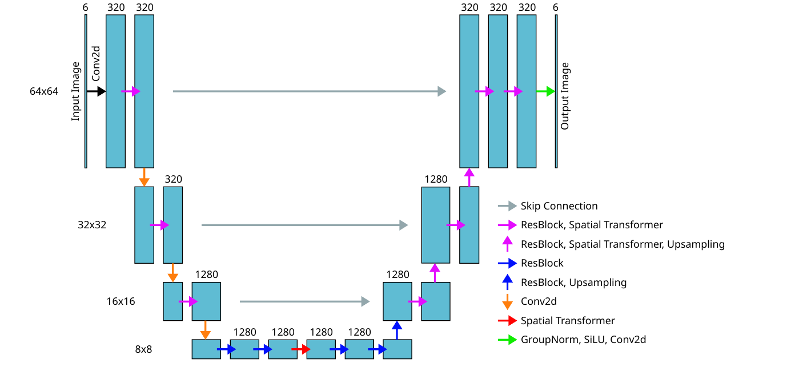

*Figure 4 (PDF p. 9) · [Source](https://arxiv.org/abs/2507.03846)*

Details

**Input → output:** T → I · **Interaction:** generation

Proof-of-concept scale: the models are trained for one million steps with batch size 3 on a 20,000-pair subset of LAION-2B-en-aesthetics restricted to five objects (banana, cat, goat, flamingo, penguin) at 64x64. FID over 100,000 samples is 21.18 for a vanilla Stable Diffusion baseline trained the same way, 21.46 for B-cos CLIP eps, 50.54 for B-cos CLIP x0 and 43.08 for B-cos x0. No code or checkpoints are linked from the paper.

**Variants:** B-cos x0; B-cos CLIP x0; B-cos CLIP eps.

### Composer

GLIDE-based cascaded pixel diffusion (64×64 base plus unconditional 256×256 and 1024×1024 upsamplers) trained to recompose images from decomposed global and local conditions, with an optional unCLIP-style prior from captions to CLIP image embeddings.

[Paper](https://arxiv.org/abs/2302.09778) · [GitHub](https://github.com/ali-vilab/composer)

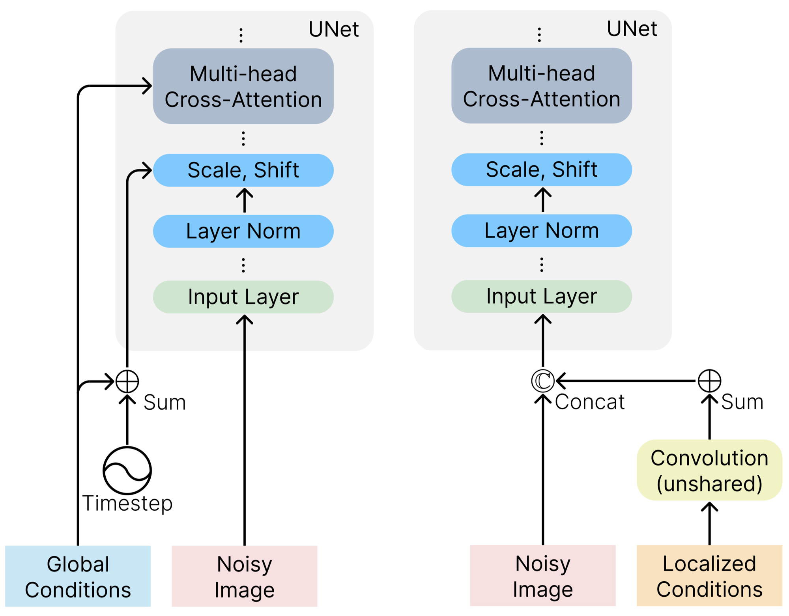

*Figures 7 and 8 (global and local conditioning modules) · [Source](https://arxiv.org/abs/2302.09778)*

Details

**Input → output:** T, I → I · **Interaction:** editing

Training images are decomposed on the fly into eight representations: caption (CLIP ViT-L/14@336px sentence and word embeddings), CLIP image embedding (semantics and style), smoothed CIELab color histogram, sketch, instance masks, depth map, grayscale intensity and masked image. Global conditions are projected and added to the timestep embedding, and image embeddings and palettes also become eight extra cross-attention tokens next to the CLIP word embeddings; local conditions pass through unshared convolution stacks, are summed and concatenated to the noisy input. Each condition is dropped independently during training so any subset can be used at inference, which covers plain text-to-image generation as well as variations, reconfiguration, region-specific (masked) editing, colorization and style transfer. Reported sizes: 2B base, 1.1B and 300M upsamplers and a 1B prior. The author-linked ali-vilab/composer repository (MIT) contains only a README and example assets; its TODO list shows code and pretrained models as not yet released.

**License:** code: MIT.

### DALL·E 2 (unCLIP)

Two-stage unCLIP stack: a prior maps the caption to a CLIP image embedding, and a GLIDE-style pixel diffusion decoder at 64×64 followed by two diffusion upsamplers (256×256, 1024×1024) inverts that embedding into an image.

[Paper](https://arxiv.org/abs/2204.06125) · [GitHub](https://github.com/openai/dalle-2-preview)

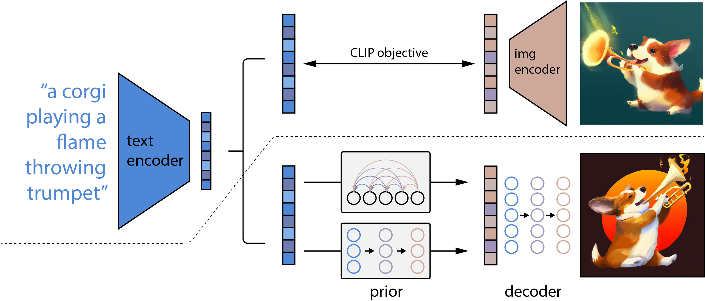

*Figure 2 · [Source](https://arxiv.org/abs/2204.06125)*

Details

**Input → output:** T, I → I · **Interaction:** editing

The paper compares an autoregressive prior (over PCA-reduced, quantized CLIP image embeddings) with a diffusion prior implemented as a decoder-only causal transformer, and finds the diffusion prior comparable and more compute-efficient. The decoder is the 3.5B-parameter GLIDE architecture, with CLIP image embeddings added to the timestep embedding and projected into four extra context tokens alongside the GLIDE text encoder's outputs. The upsamplers are unconditional ADMNets without attention, trained with Gaussian blur and BSR degradations. Encoding an image with CLIP and decoding gives image variations; interpolating embeddings blends images, and "text diffs" in CLIP space edit an input image toward a new caption. The paper names the DALL·E 2 Preview platform as the first deployment of an unCLIP model; the linked openai/dalle-2-preview repository holds only a risks-and-limitations system card, not code or weights.

### DeepFloyd IF

Frozen T5-XXL text encoder feeding three cascaded pixel-space diffusion U-Nets with cross-attention and attention pooling: a 64×64 base stage and super-resolution stages to 256×256 and 1024×1024.

[Announcement](https://stability.ai/news/deepfloyd-if-text-to-image-model) · [GitHub](https://github.com/deep-floyd/IF) · [Model card](https://huggingface.co/DeepFloyd/IF-I-XL-v1.0)

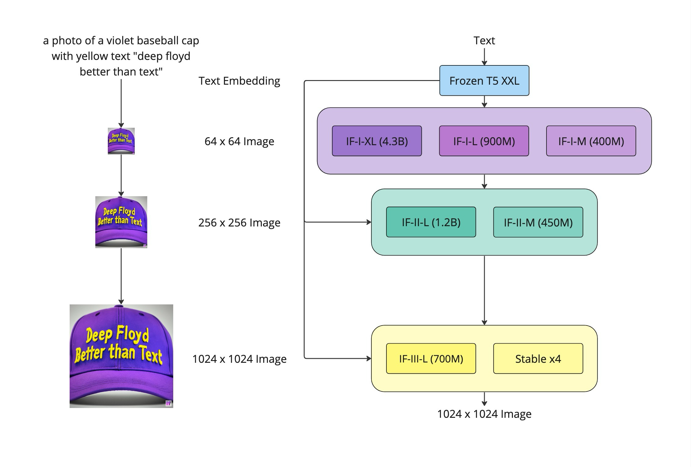

*README architecture scheme · [Source](https://github.com/deep-floyd/IF)*

Details

**Input → output:** T, I → I · **Interaction:** editing

The README credits Imagen as the inspiration and lists stage I checkpoints IF-I-M (400M), IF-I-L (900M) and IF-I-XL (4.3B), stage II IF-II-M (450M) and IF-II-L (1.2B), and a stage III IF-III-L (700M) marked "soon"; the documented 1024×1024 pipelines use the separate Stable x4 upscaler as the third stage. The announcement and README document zero-shot image-to-image modes (style transfer by re-noising a 64px version of the input and denoising with a new prompt, super-resolution of external images, and masked inpainting). No research paper was published at review time (README: "Research Paper (Soon)"). The code license is a modified MIT license that adds a clause forbidding removal of inference filters; weights are gated on Hugging Face under the DeepFloyd IF License Agreement, which the announcement describes as non-commercial and research-permissible.

**License:** code: Modified MIT; weights: DeepFloyd IF License Agreement.

**Variants:** IF-I-M; IF-I-L; IF-I-XL; IF-II-M; IF-II-L.

### eDiff-I

Cascaded pixel-space diffusion (64×64 base, SR256 and SR1024 super-resolution models) in which denoising is split across an ensemble of expert denoisers specialized for different noise intervals, conditioned on T5-XXL and CLIP text embeddings.

[Paper](https://arxiv.org/abs/2211.01324) · [Project](https://research.nvidia.com/labs/cosmos-lab/ediff-i/) · GitHub: no author-linked repository found

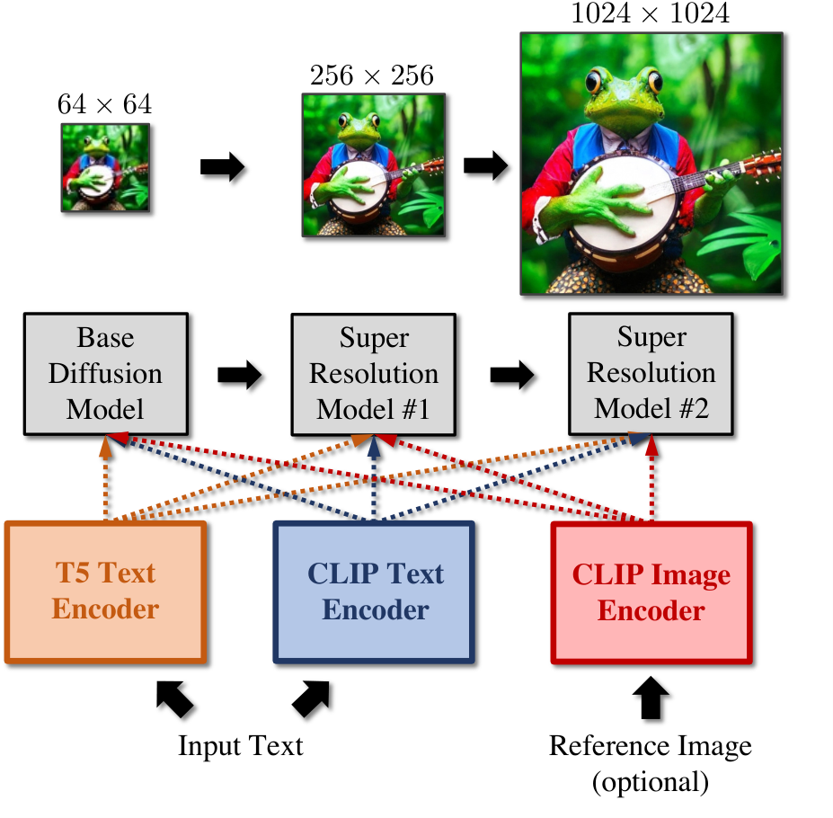

*Figure 5 · [Source](https://arxiv.org/abs/2211.01324)*

Details

**Input → output:** T, I → I · **Interaction:** generation

Experts are trained with a binary-tree branching scheme: a model trained on all noise levels is repeatedly split and fine-tuned on sub-intervals; the final base system uses an expert for high noise, one for low noise and one for the intermediate interval, and the paper's configurations also apply the ensemble to SR256. The base model is a modified ADM U-Net and the super-resolution models are modified Efficient U-Nets; T5-XXL text, CLIP L/14 text and optional CLIP L/14 image embeddings are added to the time embedding and used in cross-attention at multiple resolutions, each dropped independently during training. The optional CLIP image embedding of a reference image controls style (style transfer), and "paint-with-words" lets users paint phrase masks that are added to cross-attention maps to control layout without retraining. No code or weights are linked from the paper or project page.

### GLIDE

Cascaded pixel-space diffusion: a text-conditional ADM U-Net at 64×64 plus a text-conditional diffusion upsampler to 256×256, with text encoded by a transformer trained jointly with the model.

[Paper](https://arxiv.org/abs/2112.10741) · [GitHub](https://github.com/openai/glide-text2im)

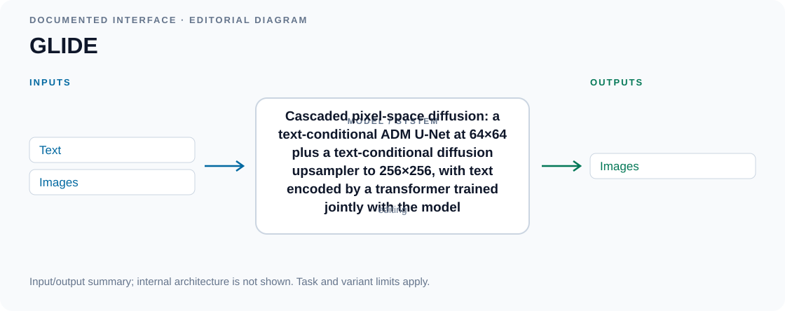

*Input/output diagram · [Source](https://arxiv.org/abs/2112.10741)*

Details

**Input → output:** T, I → I · **Interaction:** editing

The transformer's final token embedding replaces the ADM class embedding, and its last-layer token sequence is projected and concatenated to the attention context of every attention layer. The paper's main model has a 3.5B-parameter 64×64 base (about 2.3B visual plus 1.2B text transformer) and a 1.5B-parameter upsampler; the paper compares classifier-free guidance with CLIP guidance using a noised CLIP model and prefers classifier-free guidance. The base model is fine-tuned for inpainting with four extra input channels (masked RGB image and mask), which enables text-driven editing of an input image. Only a smaller GLIDE (filtered) model trained on a filtered dataset (people and some other content removed) was released; the repository is archived and its code is MIT-licensed, while no separate weight license was found.

**License:** code: MIT.

Editorial summary of documented inputs and outputs; internal architecture is not shown.

**Variants:** GLIDE (filtered).

### HiDream-O1-Image

Pixel-space flow-matching Unified Transformer (UiT): a decoder-only LLM-style transformer that denoises raw image patches in one sequence with text tokens and SigLIP2-encoded condition images, without a VAE or a separate text encoder.

HiDream.ai's HiDream-O1-Image drops both the VAE and the separate text encoder. Text is tokenized with the backbone's own vocabulary, optional reference or source images are encoded with SigLIP2 into condition tokens, and the noisy target image is patchified directly from pixels; all three token types are concatenated and processed by one transformer, which predicts clean image patches. Text and condition tokens use causal attention while generation tokens attend to everything. The released 8B model is initialized from Qwen3-VL-8B-Instruct and trained with flow matching plus LPIPS and DINO perceptual losses, progressing from 512² to 1024² and above 2048² images. One model covers text-to-image generation, instruction-based editing and subject-driven personalization, and a Gemma-based prompt agent rewrites user prompts before generation.

[Paper](https://arxiv.org/abs/2605.11061) · [GitHub](https://github.com/HiDream-ai/HiDream-O1-Image) · [Model card](https://huggingface.co/HiDream-ai/HiDream-O1-Image)

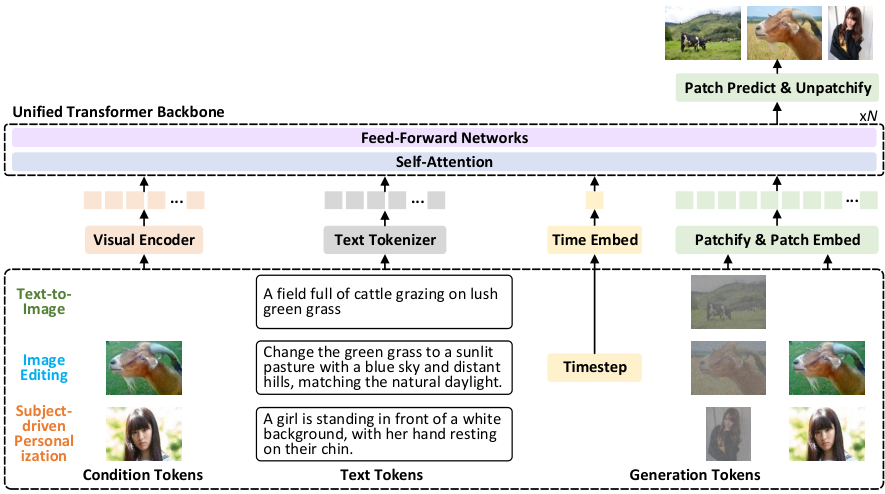

*Figure 7 · [Source](https://arxiv.org/abs/2605.11061)*

Details

**Input → output:** T, I → I · **Interaction:** editing

The diffusion timestep is encoded as a special token, and learnable input and output patch embeddings are added to the LLM backbone; the architecture uses RMSNorm, SwiGLU and RoPE. Pre-training jointly optimizes text-to-image generation, language modeling and multimodal understanding, then adds in-context editing and personalization at 1024², followed by SFT and RLHF. The report also describes a 200B+ parameter HiDream-O1-Image-Pro, which is not among the released checkpoints listed in the repository. Released checkpoints are the undistilled 8B model, a distilled Dev variant and the later HiDream-O1-Image-Dev-2604 (with a separate prompt refiner) aimed at text-to-image; the README notes additional layout and skeleton conditioning in the personalization pipeline. Because generation happens in pixel space it is catalogued under pixel diffusion rather than dit or unified. Code is MIT-licensed on GitHub and the main model card lists MIT.

**License:** code: MIT; weights: MIT.

**Variants:** HiDream-O1-Image (8B); HiDream-O1-Image-Dev; HiDream-O1-Image-Dev-2604.

### Imagen

Frozen T5-XXL text encoder feeding a cascade of pixel-space diffusion U-Nets: a 64×64 base model and two text-conditional super-resolution models (64→256, 256→1024).

[Paper](https://arxiv.org/abs/2205.11487) · [Project](https://imagen.research.google/) · GitHub: no author-linked repository found

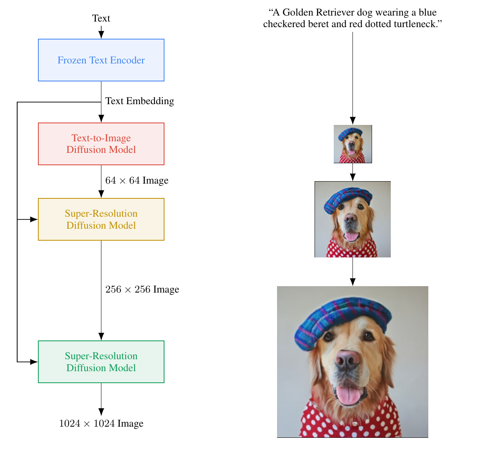

*Figure A.4 (PDF p. 19) · [Source](https://arxiv.org/abs/2205.11487)*

Details

**Input → output:** T → I · **Interaction:** generation

The base U-Net is conditioned on a pooled text embedding added to the timestep embedding and on the full text-embedding sequence through cross-attention at multiple resolutions. Both super-resolution stages use noise conditioning augmentation and text cross-attention; they use the paper's Efficient U-Net variant, and the 256→1024 model drops self-attention and is trained on 64→256 crops. The paper introduces dynamic thresholding to allow high classifier-free guidance weights and reports that scaling the frozen text encoder matters more than scaling the image U-Net. Default model sizes are 2B (base), 600M and 400M parameters (super-resolution). The paper also introduces the DrawBench prompt benchmark and states that the authors chose not to release code or a public demo.

### Karlo

Open unCLIP-based model: a prior maps the prompt to a CLIP ViT-L/14 image embedding, a pixel diffusion decoder generates a 64×64 image, and a super-resolution module upsamples it to 256×256.

[GitHub](https://github.com/kakaobrain/karlo) · [Model card](https://huggingface.co/kakaobrain/karlo-v1-alpha)

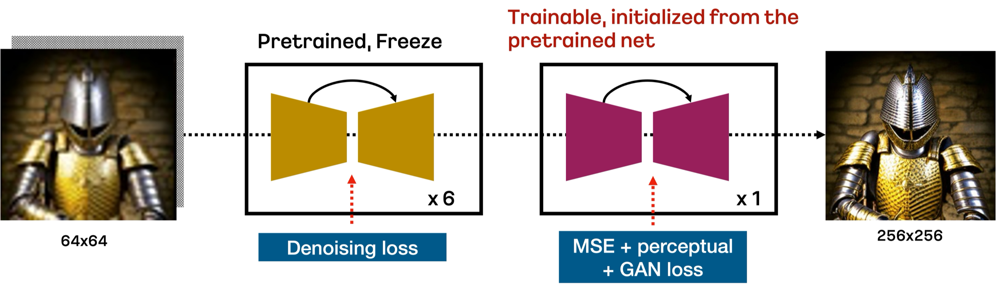

*README figure: improved 64→256 super-resolution module · [Source](https://github.com/kakaobrain/karlo)*

Details

**Input → output:** T, I → I · **Interaction:** generation

Kakao Brain's README describes Karlo-v1.0.alpha as based on OpenAI's unCLIP architecture, trained from scratch on 115M image-text pairs (COYO-100M high-quality subset, CC3M and CC12M). Unlike the original unCLIP, the decoder's trainable text transformer is replaced by the CLIP ViT-L/14 text encoder. The super-resolution module runs six respaced DDPM steps with a frozen pretrained SR network, then one final step with a fine-tuned copy trained with MSE, perceptual and GAN losses to recover high-frequency detail (the figure shows this module only). README component sizes: prior 1B, decoder 900M, SR 700M + 700M parameters. Image variation replaces the prior output with the CLIP image embedding of an input image. The README refers to an upcoming technical report; no paper was identified at review. The repository states that the project including the weights is distributed under the CreativeML Open RAIL-M license.

**License:** code: CreativeML Open RAIL-M; weights: CreativeML Open RAIL-M.

**Variants:** Karlo-v1.0.alpha.

### Matryoshka Diffusion Models

Single end-to-end pixel-space diffusion model that jointly denoises several resolutions with a NestedUNet, in which lower-resolution UNets are nested inside higher-resolution ones and share features and parameters.

[Paper](https://arxiv.org/abs/2310.15111) · [GitHub](https://github.com/apple-aiml-research/ml-mdm)

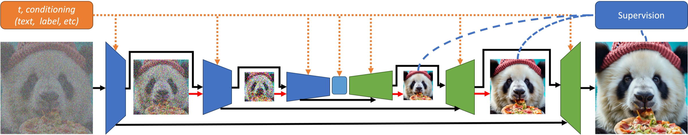

*Figure 3 · [Source](https://arxiv.org/abs/2310.15111)*

Details

**Input → output:** T → I · **Interaction:** generation

The innermost UNet runs at 64×64 and holds most parameters and self-attention (450M parameters for the inner UNet, with attention concentrated at 16×16); higher-resolution levels (e.g. 64²/256²/1024² or five levels up to 1024²) are attached around it with a small parameter increase. A multi-resolution loss and a progressive training schedule that adds higher resolutions over time are central to the method. Text conditioning uses a frozen FLAN-T5 XL encoder followed by two learnable self-attention layers. The paper trains text-to-image models on CC12M at 256² and 1024² and also reports class-conditional ImageNet and text-to-video (WebVid-10M) experiments, which are outside this catalog's scope. The official ml_mdm repository (MIT) provides training code and checkpoints at 64, 256 and 1024 px that, per the README, were trained on 50M Flickr text-image pairs; no weight license is stated.

**License:** code: MIT.

**Variants:** MDM 64×64; MDM 256×256; MDM 1024×1024.

### PixelFlow

VAE-free pixel-space flow-matching transformer that generates through a cascade of resolution stages with one shared set of parameters, upsampling the partially denoised image at each stage boundary.

PixelFlow (HKU and Adobe) generates images directly in raw pixels instead of an autoencoder latent, so the whole model is trained end to end. Its cost stays manageable because early, high-noise steps run at low resolution: the generation interval is split into stages, and at each stage the still-noisy result of the previous stage is upsampled and used as the starting point for flow matching at the next resolution. A single DiT-XL-style transformer handles every stage, with a resolution embedding, 2D RoPE and sequence packing for mixed resolutions. For text-to-image generation, cross-attention to Flan-T5-XL embeddings follows every self-attention layer; the paper reports benchmark results for a 512×512 model and also shows 1024×1024 samples.

[Paper](https://arxiv.org/abs/2504.07963) · [GitHub](https://github.com/ShoufaChen/PixelFlow) · [Model card](https://huggingface.co/ShoufaChen/PixelFlow-Text2Image)

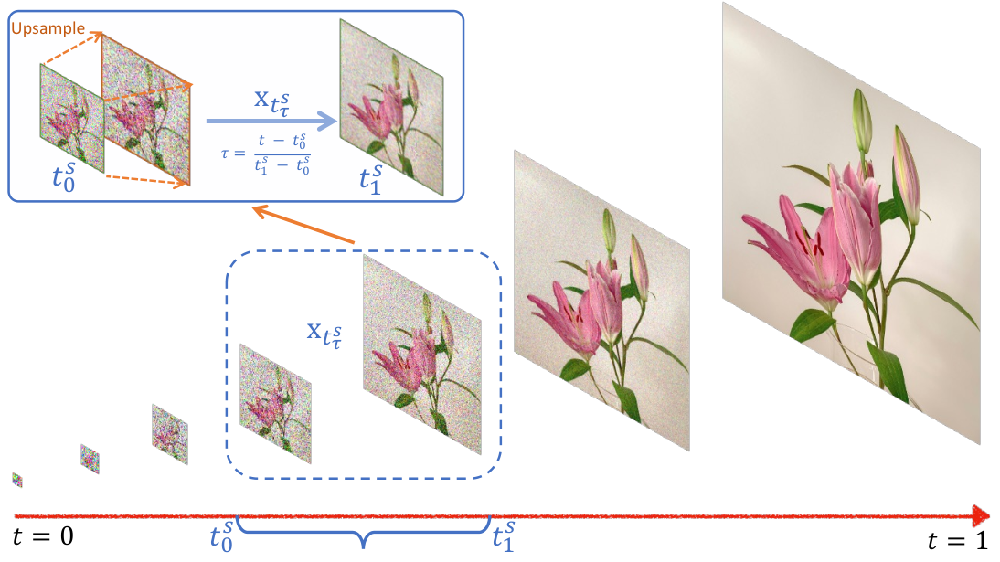

*Figure 2 · [Source](https://arxiv.org/abs/2504.07963)*

Details

**Input → output:** T → I · **Interaction:** generation

Architecture changes to DiT: patch embedding on pixels, 2D RoPE instead of sin-cos positions, and a sinusoidal resolution embedding added to the timestep embedding. Training samples all resolution stages uniformly; inference starts from Gaussian noise at the lowest resolution, uses Euler or Dopri5 sampling within each stage and a renoising step at stage transitions. The text-to-image model is initialized from the ImageNet checkpoint, trained on a LAION subset at 256×256 and fine-tuned on high-aesthetic images at 512×512 (the resolution of all reported T2I metrics). The paper's headline result is class-conditional ImageNet 256×256, which is outside this catalog's scope. The official repository lists an 882M-parameter text-to-image checkpoint; code (GitHub) and the text-to-image weights (Hugging Face) are MIT-licensed.

**License:** code: MIT; weights: MIT.

**Variants:** PixelFlow-Text2Image.

### PixNerd

Single-scale pixel-space diffusion transformer with large 16x16 patches that replaces the final linear projection with a patch-wise neural field, where the transformer's hidden state predicts the weights of small MLPs that decode pixel velocity from coordinate encodings and the noisy pixel values, with Qwen3-1.7B text conditioning.

PixNerd (Nanjing University, ByteDance Seed and NUS) removes the VAE from diffusion transformers without a cascaded or multi-scale pipeline. It keeps the token count of a latent diffusion transformer by using large pixel patches and decodes each patch with a neural field, where the transformer predicts per-patch MLP weights that map pixel coordinate encodings and noisy pixel values to velocity, instead of a single linear layer that cannot capture fine detail. The model is trained end to end with flow matching and representation alignment. On ImageNet, PixNerd-XL/16 reaches FID 2.15 at 256x256 and 2.84 at 512x512, and the paper extends the design to text-to-image with a 1.2B PixNerd-XXL/16 trained on about 45M recaptioned images, reporting 0.73 on GenEval and 80.9 on DPG-Bench.

[Paper](https://arxiv.org/abs/2507.23268) · [GitHub](https://github.com/MCG-NJU/PixNerd) · [Model card](https://huggingface.co/MCG-NJU/PixNerd-XXL-P16-T2I)

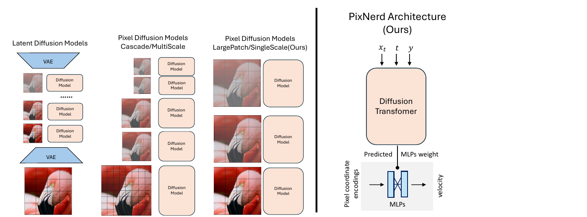

*Figure 1 (PDF p. 1) · [Source](https://arxiv.org/abs/2507.23268)*

Details

**Input → output:** T → I · **Interaction:** generation

The text-to-image model uses a frozen Qwen3-1.7B text encoder with several jointly trained transformer layers on top of the frozen features, in the manner of Fluid, about 45M images from SAM, JourneyDB, ImageNet-1K and other open datasets recaptioned with Qwen2.5-VL-7B (English captions only), square 256x256 pretraining followed by 512x512 training and an SFT stage on the BLIP-3o dataset, and the Adams-2nd solver with 25 steps. The paper reports training-free arbitrary-resolution sampling by interpolating pixel coordinates. The ImageNet class-conditional PixNerd-XL/16 checkpoints are separate variants. The repository states the MIT license; the text-to-image checkpoint's model card metadata states Apache-2.0.

**License:** code: MIT; weights: Apache-2.0.

**Variants:** PixNerd-XXL/16 (text-to-image, 1.2B); PixNerd-XL/16 (ImageNet class-conditional, 700M).

### Re-Imagen

Retrieval-augmented Imagen-style cascade (64×64 text-to-image model plus 256×256 and 1024×1024 super-resolution models) whose U-Net attends to encoded retrieved image-text neighbors between its downsampling and upsampling stacks.

[Paper](https://arxiv.org/abs/2209.14491) · GitHub: no author-linked repository found

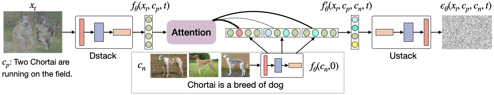

*Figure 3 · [Source](https://arxiv.org/abs/2209.14491)*

Details

**Input → output:** T, I → I · **Interaction:** generation

The prompt is embedded with T5. Top-k image-text pairs retrieved from an external multimodal knowledge base (BM25 or CLIP similarity) are encoded by the same downsampling stack (DStack) with the timestep set to zero, and a multi-head attention module fuses them into the noisy image's feature map before the upsampling stack (UStack) predicts the noise. Training uses a KNN-ImageText dataset built from Imagen's 50M-pair training data, and inference uses interleaved classifier-free guidance that alternates text-enhanced and neighbor-enhanced predictions to balance the two conditions. The reported model has a 2.5B 64×64 model, a 750M 256×256 and a 400M 1024×1024 super-resolution model (plus a 1.4B Re-Imagen-small base). Image input here means retrieved or supplied reference image-text pairs; the paper introduces EntityDrawBench for rare entities. No author-linked code was found.

**Variants:** Re-Imagen-small.

